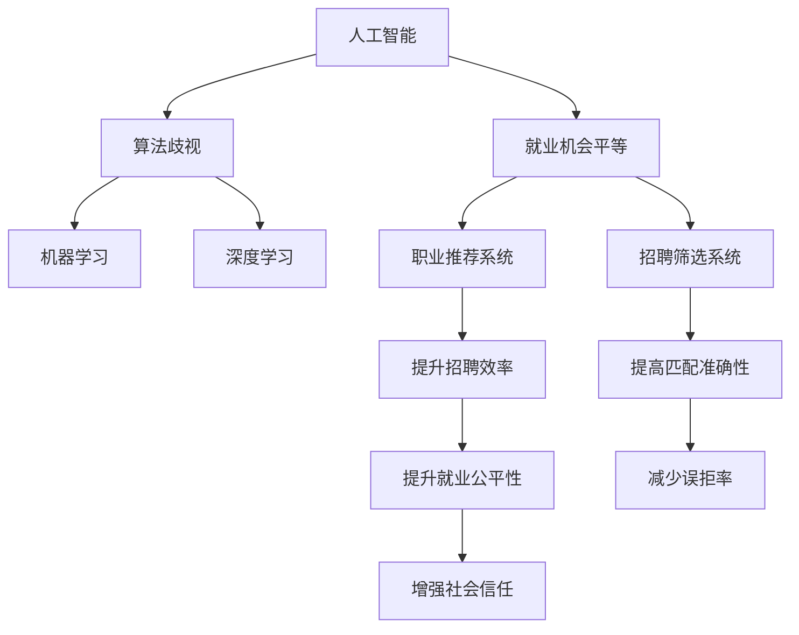

                 

# AI时代的就业公平:算法歧视和就业机会平等

> 关键词：人工智能(AI),算法歧视,就业公平,就业机会,平等,机器学习,深度学习,职业推荐系统

## 1. 背景介绍

### 1.1 问题由来
随着人工智能（AI）技术的快速发展，其在就业市场中的应用越来越广泛，从职业推荐到招聘筛选，AI技术已经成为了人力资源管理的重要工具。然而，AI在提升招聘效率的同时，也引发了一系列就业公平问题。特别是在算法歧视和就业机会平等方面，AI技术的应用面临着诸多挑战和争议。

### 1.2 问题核心关键点
当前，AI技术在就业市场中的应用主要集中在职业推荐系统和招聘筛选系统。这些系统通常基于机器学习模型进行训练，以历史数据为依据，对候选人进行匹配和筛选。然而，由于数据样本的不平衡和算法的黑箱性，这些系统容易产生算法歧视，即对某些群体（如女性、少数族裔、残障人士等）进行不公平对待。因此，如何构建公平、透明的AI招聘系统，成为了当前AI就业应用的一个重要研究方向。

### 1.3 问题研究意义
研究AI在就业市场中的算法歧视和就业机会平等问题，对于提升就业市场的公平性、促进社会和谐发展具有重要意义：

1. 提升就业公平性：通过消除算法歧视，确保各群体在就业市场中获得公平的机会，有利于社会的长期稳定。
2. 提升企业招聘效率：公平的AI招聘系统能够更准确地识别和匹配人才，提升招聘成功率和质量。
3. 促进技术进步：研究AI就业公平问题，有助于推动AI技术的持续发展和优化，提升其社会价值。
4. 增强社会信任：公平、透明的AI招聘系统，能够增强公众对AI技术的信任，推动其在更多领域的广泛应用。

## 2. 核心概念与联系

### 2.1 核心概念概述

为更好地理解AI在就业市场中的算法歧视和就业机会平等问题，本节将介绍几个密切相关的核心概念：

- 人工智能(AI)：使用算法和数据，使计算机能够执行特定任务，特别是需要人类智能的任务。
- 算法歧视（Algorithmic Bias）：在算法中存在偏见，导致对某些群体的不公平对待。
- 就业机会平等（Equal Employment Opportunity, EEO）：确保所有人无论性别、种族、宗教、年龄等，都有平等的就业机会。
- 机器学习（Machine Learning, ML）：基于数据和算法，使计算机能够自动学习、改进和优化。
- 深度学习（Deep Learning, DL）：机器学习的一种形式，使用多层神经网络，能够处理复杂的非线性关系。
- 职业推荐系统（Job Recommendation System, JRS）：基于用户的历史行为和偏好，推荐合适的职业机会的系统。
- 招聘筛选系统（Recruitment Screening System, RSS）：基于机器学习模型，筛选候选人并推荐给招聘人员的系统。

这些核心概念之间的逻辑关系可以通过以下Mermaid流程图来展示：



这个流程图展示了人工智能、算法歧视、就业机会平等在职业推荐系统和招聘筛选系统中的应用场景，以及它们之间相互影响的关系。

## 3. 核心算法原理 & 具体操作步骤
### 3.1 算法原理概述

AI在就业市场中的职业推荐系统和招聘筛选系统通常基于机器学习模型进行训练，以历史数据为依据，对候选人进行匹配和筛选。这些系统的核心算法包括：

- 线性回归（Linear Regression）：用于预测候选人对某个职业的兴趣度。
- 决策树（Decision Tree）：用于根据候选人特征进行分类，筛选符合特定标准的候选人。
- 随机森林（Random Forest）：通过集成多个决策树，提升分类准确性。
- 支持向量机（Support Vector Machine, SVM）：用于解决分类问题，识别候选人是否符合特定职位要求。
- 神经网络（Neural Networks）：用于处理复杂非线性关系，提升预测准确性。

这些算法的核心思想是通过学习历史数据中的模式和规律，对候选人进行预测和筛选。然而，由于数据样本的不平衡和算法的黑箱性，这些系统容易产生算法歧视，即对某些群体（如女性、少数族裔、残障人士等）进行不公平对待。

### 3.2 算法步骤详解

基于AI的就业市场系统通常包括以下几个关键步骤：

**Step 1: 数据准备与预处理**
- 收集历史招聘数据，包括候选人的基本信息、历史行为、工作经历、学历背景等。
- 清洗和预处理数据，去除噪声、处理缺失值、进行特征工程等。

**Step 2: 模型训练与评估**
- 选择合适的机器学习算法，如线性回归、决策树、神经网络等。
- 使用历史数据对模型进行训练，调整超参数，优化模型性能。
- 在验证集上评估模型效果，选择最佳模型进行后续部署。

**Step 3: 系统部署与监控**
- 将训练好的模型部署到生产环境，供招聘人员使用。
- 实时监控系统性能，记录关键指标，如匹配准确率、误拒率、漏选率等。
- 定期更新模型参数，保持系统的高效性和公平性。

**Step 4: 评估与优化**
- 对系统进行公平性评估，检查是否存在算法歧视。
- 优化模型和算法，减少偏见，提升公平性。
- 引入更多数据和算法，提升系统性能。

### 3.3 算法优缺点

基于AI的就业市场系统具有以下优点：

1. 提升招聘效率：通过自动化的筛选和推荐，减少人工工作量，提高招聘速度。
2. 提升匹配准确性：基于历史数据，能够更准确地匹配候选人和职位。
3. 提高决策一致性：减少人为偏见，提高决策一致性和公正性。

然而，这些系统也存在一定的局限性：

1. 依赖数据质量：系统的公平性和准确性很大程度上取决于数据的质量和代表性，如果数据样本存在偏见，系统可能无法实现公平。
2. 黑箱性：许多AI模型（特别是深度学习模型）的黑箱性质，使得其决策过程难以解释，难以进行公平性检查。
3. 过拟合风险：在处理小规模数据时，系统容易过拟合，产生偏差。
4. 动态性不足：系统更新较慢，难以快速适应市场变化。

### 3.4 算法应用领域

基于AI的就业市场系统在职业推荐和招聘筛选中的应用非常广泛，具体包括：

- 职业推荐系统（Job Recommendation System, JRS）：如LinkedIn、Indeed等平台，根据用户的历史行为和偏好，推荐合适的职业机会。
- 招聘筛选系统（Recruitment Screening System, RSS）：如IBM的Recruit360、Google的Job Search等系统，根据职位要求和候选人特征，筛选合适的候选人。

此外，AI在就业市场中的应用还包括招聘广告投放、人才流失预测、员工培训等，为人力资源管理提供了强有力的支持。

## 4. 数学模型和公式 & 详细讲解 & 举例说明
### 4.1 数学模型构建

基于AI的就业市场系统通常使用分类和回归模型进行构建。以下以线性回归模型为例，介绍其数学模型构建过程。

设候选人特征为 $\mathbf{x} = (x_1, x_2, ..., x_n)$，对应职业为 $y$，线性回归模型的预测公式为：

$$
y = \beta_0 + \sum_{i=1}^n \beta_i x_i + \epsilon
$$

其中，$\beta_0$ 为截距项，$\beta_i$ 为特征系数，$\epsilon$ 为误差项。

训练数据集为 $D = \{(\mathbf{x}_1, y_1), (\mathbf{x}_2, y_2), ..., (\mathbf{x}_N, y_N)\}$，模型参数估计的目标是最小化均方误差：

$$
\hat{\beta} = \arg\min_{\beta} \sum_{i=1}^N (y_i - \mathbf{X}_i \mathbf{\beta})^2
$$

其中，$\mathbf{X}_i = (1, x_{i1}, x_{i2}, ..., x_{in})$ 为特征矩阵。

### 4.2 公式推导过程

以下推导线性回归模型的参数估计过程。

设模型预测值 $\hat{y} = \mathbf{X}_i \mathbf{\beta}$，目标是最小化预测值与真实值之间的均方误差：

$$
\min_{\beta} \sum_{i=1}^N (\hat{y}_i - y_i)^2
$$

构造拉格朗日乘子函数：

$$
L(\beta) = \frac{1}{2N} \sum_{i=1}^N (\hat{y}_i - y_i)^2 + \frac{\lambda}{2} \|\beta\|^2
$$

其中，$\lambda$ 为正则化系数。

对 $\beta$ 求偏导数，得到：

$$
\frac{\partial L}{\partial \beta} = \frac{1}{N} \sum_{i=1}^N (\hat{y}_i - y_i) \mathbf{X}_i - \lambda \beta = 0
$$

解得：

$$
\beta = (\frac{1}{N} \sum_{i=1}^N (\hat{y}_i - y_i) \mathbf{X}_i)^T (\frac{1}{N} \sum_{i=1}^N (\hat{y}_i - y_i) \mathbf{X}_i)^{-1}
$$

### 4.3 案例分析与讲解

以下以一个简单的职业推荐系统为例，介绍其基本原理。

假设某招聘平台收集了10000名候选人的历史数据，包括性别、年龄、学历、工作经历、技能等信息，以及他们对不同职业的偏好程度。模型训练时，将数据分为训练集和验证集，每组5000条数据。使用线性回归模型预测候选人对每个职业的兴趣度，并根据兴趣度进行职业推荐。

训练集上，模型的参数估计过程如下：

1. 计算特征矩阵 $\mathbf{X}_i$ 和目标向量 $\mathbf{y}_i$。
2. 使用最小二乘法求解参数 $\beta$，得到模型预测值 $\hat{y}_i = \mathbf{X}_i \mathbf{\beta}$。
3. 在验证集上评估模型性能，如均方误差、平均绝对误差等。
4. 选择最优模型进行部署，提供职业推荐服务。

## 5. 项目实践：代码实例和详细解释说明
### 5.1 开发环境搭建

在进行AI就业市场系统的开发前，我们需要准备好开发环境。以下是使用Python进行Scikit-Learn和TensorFlow开发的环境配置流程：

1. 安装Anaconda：从官网下载并安装Anaconda，用于创建独立的Python环境。

2. 创建并激活虚拟环境：
```bash
conda create -n pytorch-env python=3.8 
conda activate pytorch-env
```

3. 安装Scikit-Learn：从官网获取对应的安装命令。例如：
```bash
conda install scikit-learn
```

4. 安装TensorFlow：根据CUDA版本，从官网获取对应的安装命令。例如：
```bash
conda install tensorflow -c pytorch -c conda-forge
```

5. 安装各类工具包：
```bash
pip install numpy pandas scikit-learn matplotlib tqdm jupyter notebook ipython
```

完成上述步骤后，即可在`pytorch-env`环境中开始AI就业市场系统的开发。

### 5.2 源代码详细实现

这里我们以一个简单的招聘筛选系统为例，给出使用Scikit-Learn库对线性回归模型进行训练的Python代码实现。

首先，定义数据处理函数：

```python
import pandas as pd
from sklearn.model_selection import train_test_split
from sklearn.linear_model import LinearRegression

def load_data(path):
    data = pd.read_csv(path)
    return data

def preprocess_data(data):
    # 处理缺失值、噪声、特征工程等
    data.fillna(method='ffill', inplace=True)
    data['age'] = (data['min_age'] + data['max_age']) / 2
    data['edu'] = pd.factorize(data['edu'], sort=True)[0]
    return data

def split_data(data, target):
    X = data.drop(columns=target)
    y = data[target]
    return X, y

# 加载数据
data = load_data('data.csv')

# 数据预处理
data = preprocess_data(data)

# 分割数据集
X, y = split_data(data, 'occupation')

# 训练集和验证集划分
X_train, X_val, y_train, y_val = train_test_split(X, y, test_size=0.2, random_state=42)

# 模型训练
model = LinearRegression()
model.fit(X_train, y_train)
```

然后，评估模型性能：

```python
# 模型评估
y_pred = model.predict(X_val)
print('Mean Squared Error:', mean_squared_error(y_val, y_pred))
```

最后，使用训练好的模型进行职业推荐：

```python
# 使用模型进行职业推荐
new_candidate = load_data('new_candidate.csv')
new_candidate = preprocess_data(new_candidate)
new_candidate = split_data(new_candidate, 'occupation')
X_new, y_new = new_candidate

# 模型预测
y_new_pred = model.predict(X_new)
print('Recommendations:', y_new_pred)
```

以上就是使用Scikit-Learn对线性回归模型进行招聘筛选系统训练的完整代码实现。可以看到，借助Scikit-Learn，开发者可以轻松地实现AI就业市场系统的基本功能。

### 5.3 代码解读与分析

让我们再详细解读一下关键代码的实现细节：

**load_data函数**：
- 从CSV文件中加载数据，并返回Pandas DataFrame对象。

**preprocess_data函数**：
- 对数据进行预处理，包括处理缺失值、噪声、特征工程等。

**split_data函数**：
- 将数据集分为特征矩阵X和目标向量y，并分割成训练集和验证集。

**LinearRegression模型**：
- 使用Scikit-Learn的LinearRegression类，构建线性回归模型，并进行参数估计。

**模型评估**：
- 在验证集上评估模型性能，使用均方误差作为评价指标。

**模型预测**：
- 使用训练好的模型对新候选人进行职业推荐。

通过本文的系统梳理，可以看到，使用AI技术进行就业市场系统的开发，不仅可以提升招聘效率和匹配准确性，还能减少人为偏见，提升公平性。然而，AI技术在实际应用中，还需要考虑数据的公平性、算法的透明性和系统的可解释性，才能真正实现就业市场的公平与透明。

## 6. 实际应用场景
### 6.1 招聘平台公平性评估

在招聘平台中，公平性评估是确保AI系统公正性的重要环节。常见的公平性评估方法包括：

1. 平均差异评估：检查不同群体在模型预测中的差异，确保没有系统性的偏差。
2. 等错误率评估：检查不同群体在模型中的误判率，确保没有系统性的错误率差异。
3. 多准确率评估：检查不同群体在模型中的准确率，确保没有系统性的准确率差异。

例如，假设某招聘平台使用线性回归模型对候选人进行职业推荐，经过公平性评估发现，女性候选人在模型中的推荐概率低于男性，则需要进行进一步的优化，以确保公平性。

### 6.2 职业推荐系统中的偏见校正

在职业推荐系统中，消除算法偏见是确保系统公平性的重要手段。常用的偏见校正方法包括：

1. 重新采样（Resampling）：通过重新采样训练数据，使不同群体的样本数量均衡，减少数据偏见。
2. 数据增强（Data Augmentation）：通过数据增强技术，生成更多样化的训练数据，减少数据偏见。
3. 偏置校正算法（Bias Correction Algorithm）：通过算法修改，减少模型中的偏见。

例如，某职业推荐系统使用随机森林模型对候选人进行职业推荐，经过公平性评估发现，某些少数族裔的推荐效果较差，则可以通过重新采样、数据增强等方法，校正算法偏见，提升系统公平性。

### 6.3 招聘筛选系统中的候选筛选

在招聘筛选系统中，确保候选人筛选的公平性是关键。常用的候选人筛选方法包括：

1. 去偏重算法（Debiasing Algorithm）：通过去偏重算法，减少模型中的偏见。
2. 多维度的筛选标准：结合多维度（如学历、工作经验、技能等）的筛选标准，确保筛选的公平性。
3. 人工审核（Manual Review）：通过人工审核，减少算法偏见的影响。

例如，某招聘平台使用神经网络模型对候选人进行筛选，经过公平性评估发现，某些群体（如女性、残障人士等）的筛选效果较差，则可以通过去偏重算法、多维度筛选标准等方法，提升系统的公平性。

### 6.4 未来应用展望

随着AI技术的发展，未来的就业市场系统将更加智能、高效、公平。具体而言，未来的发展趋势包括：

1. 自动化偏见检测：引入自动化偏见检测技术，实时监测系统中的偏见，及时进行校正。
2. 可解释性增强：提高系统的可解释性，使得决策过程透明化，增强用户信任。
3. 数据多样性提升：引入更多样化的数据，提升系统的公平性和泛化能力。
4. 跨领域应用拓展：将AI技术应用于更多领域，提升各行业的公平性和效率。
5. 模型动态更新：引入模型动态更新机制，实时更新模型参数，保持系统的公平性和效率。

这些趋势表明，未来的AI就业市场系统将在公平性、透明性、可解释性等方面取得更大的突破，为就业市场的公平发展提供强有力的支持。

## 7. 工具和资源推荐
### 7.1 学习资源推荐

为了帮助开发者系统掌握AI在就业市场中的应用，这里推荐一些优质的学习资源：

1. Coursera《AI for Everyone》课程：由吴恩达教授主讲的AI入门课程，涵盖AI基础知识和实际应用。
2. edX《Data Science and Machine Learning Bootcamp》课程：提供数据科学和机器学习的基础知识和实践技能。
3. Kaggle《AI in Employment》竞赛：通过实际竞赛项目，提升AI在就业市场中的应用技能。
4. arXiv《Fairness and Accountability in AI and Machine Learning》期刊：收录关于AI公平性和透明性的最新研究成果。

通过这些资源的学习实践，相信你一定能够快速掌握AI在就业市场中的应用，并用于解决实际的就业公平问题。

### 7.2 开发工具推荐

高效的开发离不开优秀的工具支持。以下是几款用于AI就业市场系统开发的常用工具：

1. Scikit-Learn：Python数据科学库，提供了丰富的机器学习算法和工具，适用于模型训练和评估。
2. TensorFlow：由Google主导开发的深度学习框架，适用于大规模模型训练和部署。
3. Jupyter Notebook：开源的交互式编程环境，适用于数据处理、模型训练和结果展示。
4. Visual Studio Code：轻量级的开发工具，支持Python、R等多种编程语言，适用于AI项目开发。
5. GitHub：开源代码托管平台，支持团队协作、代码版本控制和项目管理。

合理利用这些工具，可以显著提升AI就业市场系统的开发效率，加快创新迭代的步伐。

### 7.3 相关论文推荐

AI在就业市场中的应用研究涉及多个领域，以下是几篇奠基性的相关论文，推荐阅读：

1. "Fairness, Accountability, and Transparency in Machine Learning: A Survey" by Timnit Gebru et al.：综述了AI公平性和透明性的研究现状和未来方向。
2. "The Moral Landscape of Machine Learning: Incorporating Ethics into Algorithm Development" by Alaa Alhabib et al.：探讨了如何在AI算法开发中融入伦理道德原则。
3. "Bias in Fairness Models: The Case of Gender Bias in Machine Learning Algorithms" by Deeksha Saini et al.：研究了AI算法中的性别偏见问题及其解决方法。
4. "Algorithmic Bias and Fairness in AI" by Meredith McIver et al.：探讨了AI算法中的偏见和公平性问题，提出了具体的解决方案。

这些论文代表了大数据在就业市场中的应用研究的发展脉络。通过学习这些前沿成果，可以帮助研究者把握学科前进方向，激发更多的创新灵感。

## 8. 总结：未来发展趋势与挑战
### 8.1 总结

本文对AI在就业市场中的应用进行了全面系统的介绍。首先阐述了AI在招聘和职业推荐中的应用背景和意义，明确了算法歧视和就业机会平等在AI应用中的重要性。其次，从原理到实践，详细讲解了AI在就业市场中的应用过程，给出了AI就业市场系统的完整代码实现。同时，本文还广泛探讨了AI在就业市场中的公平性问题，以及如何构建公平、透明的AI招聘系统。

通过本文的系统梳理，可以看到，AI在就业市场中的应用，不仅提升了招聘效率和匹配准确性，还带来了许多公平性和透明性问题。AI技术的发展方向是实现公平、透明、可解释的就业市场系统，这需要技术、伦理和社会的共同努力。

### 8.2 未来发展趋势

展望未来，AI在就业市场中的应用将呈现以下几个发展趋势：

1. 自动化公平检测：引入自动化公平检测技术，实时监测系统中的偏见，及时进行校正。
2. 可解释性增强：提高系统的可解释性，使得决策过程透明化，增强用户信任。
3. 数据多样性提升：引入更多样化的数据，提升系统的公平性和泛化能力。
4. 跨领域应用拓展：将AI技术应用于更多领域，提升各行业的公平性和效率。
5. 模型动态更新：引入模型动态更新机制，实时更新模型参数，保持系统的公平性和效率。

这些趋势表明，未来的AI就业市场系统将在公平性、透明性、可解释性等方面取得更大的突破，为就业市场的公平发展提供强有力的支持。

### 8.3 面临的挑战

尽管AI在就业市场中的应用已经取得了显著成效，但在迈向更加智能化、普适化应用的过程中，它仍面临着诸多挑战：

1. 数据质量瓶颈：AI系统依赖于高质量的数据，如何获取和处理大规模、多样化的数据，是实现公平性的关键。
2. 算法透明性不足：许多AI模型（特别是深度学习模型）的黑箱性质，使得其决策过程难以解释，难以进行公平性检查。
3. 模型动态性不足：系统更新较慢，难以快速适应市场变化。
4. 公平性评估难度：如何构建科学的公平性评估指标，检查模型中的偏见，是确保系统公平性的重要问题。
5. 伦理道德约束：如何在AI算法开发中融入伦理道德原则，避免有害偏见，确保系统的公平性和安全性。

这些挑战表明，AI在就业市场中的应用需要技术、伦理和社会的共同努力，才能实现公平、透明、可解释的就业市场系统。

### 8.4 研究展望

面对AI在就业市场中的应用面临的诸多挑战，未来的研究需要在以下几个方面寻求新的突破：

1. 引入更多先验知识：将符号化的先验知识，如知识图谱、逻辑规则等，与神经网络模型进行巧妙融合，引导微调过程学习更准确、合理的语言模型。
2. 探索无监督和半监督学习：摆脱对大规模标注数据的依赖，利用自监督学习、主动学习等无监督和半监督范式，最大限度利用非结构化数据，实现更加灵活高效的就业市场系统。
3. 引入自动化公平检测技术：开发自动化公平检测工具，实时监测系统中的偏见，及时进行校正。
4. 提高系统的可解释性：通过可解释性增强技术，使得决策过程透明化，增强用户信任。
5. 引入数据多样性提升技术：通过数据多样性提升技术，减少数据偏见，提升系统的公平性和泛化能力。
6. 引入跨领域应用拓展技术：将AI技术应用于更多领域，提升各行业的公平性和效率。

这些研究方向的探索，必将引领AI就业市场系统迈向更高的台阶，为构建公平、透明、可解释的就业市场系统铺平道路。面向未来，AI在就业市场中的应用还需要与其他人工智能技术进行更深入的融合，如知识表示、因果推理、强化学习等，多路径协同发力，共同推动就业市场的公平发展。

## 9. 附录：常见问题与解答

**Q1：AI在就业市场中的应用是否会影响就业公平性？**

A: AI在就业市场中的应用确实存在潜在的算法歧视问题，可能会对某些群体造成不公平对待。然而，通过科学的设计和公平性的评估，可以最大限度地减少这种影响，提升就业市场的公平性。

**Q2：如何构建公平、透明的AI招聘系统？**

A: 构建公平、透明的AI招聘系统需要多方面的努力，包括：

1. 数据收集与处理：确保数据样本的均衡性，消除数据偏见。
2. 模型设计：选择适当的算法，进行公平性评估和优化。
3. 系统部署：实时监测系统性能，及时进行校正。
4. 用户反馈：收集用户反馈，不断优化系统性能。

**Q3：AI在就业市场中的应用是否会增加就业难度？**

A: 实际上，AI技术在提升招聘效率和匹配准确性的同时，也带来了新的就业机会。例如，AI招聘系统的开发、维护和优化，都需要大量专业人才的支持。

**Q4：AI在就业市场中的应用是否会导致数据隐私问题？**

A: 数据隐私是AI应用中的重要问题，需要采取严格的隐私保护措施，如数据匿名化、访问控制、隐私保护算法等。确保数据的合法使用和保护用户隐私。

通过本文的系统梳理，可以看到，AI在就业市场中的应用，不仅可以提升招聘效率和匹配准确性，还能减少人为偏见，提升公平性。然而，AI技术在实际应用中，还需要考虑数据的公平性、算法的透明性和系统的可解释性，才能真正实现就业市场的公平与透明。

