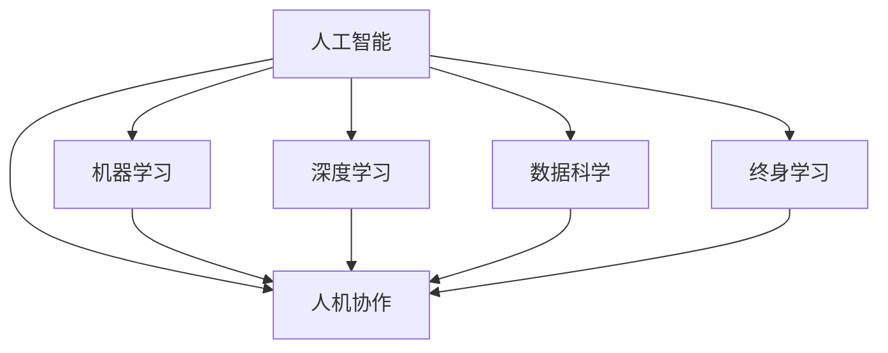

                 

# AI时代的就业转型:人机协作和终身学习

> 关键词：人工智能,人机协作,终身学习,机器学习,数据科学,深度学习,大数据

## 1. 背景介绍

### 1.1 问题由来
人工智能（AI）技术的迅猛发展，正在深刻改变各个行业的面貌。从自动驾驶、智能医疗到金融风控，AI技术的广泛应用正在推动各个领域实现数字化转型，提高生产效率，提升用户体验。然而，AI技术的发展同样带来了巨大的挑战，尤其是在就业领域。随着自动化、智能化程度的提高，传统职业岗位面临着被机器取代的风险，技能需求也在快速变化。如何在AI时代中实现职业转型，提升个人竞争力，成为每一个职场人必须面对的问题。

### 1.2 问题核心关键点
本文聚焦于人工智能时代下的职业转型问题，探讨如何通过人机协作和终身学习的理念，提升职业竞争力，实现职业生涯的持续发展。核心关键点包括：
1. **人工智能的崛起与职业影响**：AI技术如何改变工作方式，影响就业市场。
2. **人机协作的价值**：如何利用AI技术与人类协同工作，提升工作效率与质量。
3. **终身学习的理念**：在快速变化的技术环境中，如何不断学习新技能，保持竞争力。
4. **未来职业发展的方向**：AI时代下，职业发展的趋势与机会。

## 2. 核心概念与联系

### 2.1 核心概念概述

为更好地理解人工智能时代下的职业转型，本节将介绍几个密切相关的核心概念：

- **人工智能（Artificial Intelligence, AI）**：指利用计算机模拟人类智能过程的技术，包括机器学习、深度学习、自然语言处理等。
- **机器学习（Machine Learning, ML）**：指通过数据和算法训练模型，使其具备某种预测或决策能力的技术。
- **深度学习（Deep Learning, DL）**：指一种基于神经网络的机器学习技术，通过多层次非线性映射实现复杂模式识别。
- **数据科学（Data Science）**：指通过数据收集、分析和可视化，提取有价值信息并用于决策支持的技术。
- **人机协作（Human-AI Collaboration）**：指人类与AI技术在特定任务中协同工作，互补优势，提升效率和效果。
- **终身学习（Lifelong Learning）**：指个人在职业生涯中不断学习新知识、新技能，适应技术变化和职业需求。

这些核心概念之间的逻辑关系可以通过以下Mermaid流程图来展示：



这个流程图展示了这个核心概念之间的逻辑关系：

1. **人工智能**：作为整个概念体系的基础，包括机器学习和深度学习，用于处理和分析数据。
2. **机器学习**：是人工智能中的一个重要分支，用于构建模型。
3. **深度学习**：作为机器学习的一种高级形式，常用于处理复杂数据。
4. **数据科学**：是利用数据进行决策和预测的科学，与人机协作和终身学习密切相关。
5. **人机协作**：利用AI技术与人类协同工作，提升效率和效果。
6. **终身学习**：个人在职业生涯中不断学习新知识、新技能，适应技术变化和职业需求。

这些核心概念共同构成了AI时代下职业转型的基础框架，为我们提供了解决职业转型问题的理论依据和方法论。

## 3. 核心算法原理 & 具体操作步骤

### 3.1 算法原理概述

AI时代的就业转型，本质上是利用人工智能技术，结合人类的智慧和经验，通过不断学习和适应，实现个人与机器的协同工作，提升职业竞争力。具体来说，可以分为以下几个步骤：

1. **数据收集与处理**：收集并清洗与工作相关的数据，包括历史业绩、市场动态、技术趋势等。
2. **模型构建与训练**：利用机器学习或深度学习算法，构建预测模型或决策模型，并使用收集的数据进行训练。
3. **模型应用与优化**：将训练好的模型应用于实际工作中，通过反馈机制不断优化模型，提升预测准确性和决策效果。
4. **终身学习与技能更新**：在职业生涯中不断学习新知识、新技能，适应技术变化和职业需求。

### 3.2 算法步骤详解

下面详细介绍AI时代就业转型的算法步骤：

**Step 1: 数据收集与预处理**
- 收集与工作相关的数据，包括历史业绩、市场动态、技术趋势等。
- 对数据进行清洗和预处理，去除噪音和异常值，确保数据质量。
- 将数据按任务需求进行划分，分为训练集、验证集和测试集。

**Step 2: 模型构建与训练**
- 选择适合的机器学习或深度学习模型，如回归模型、分类模型、神经网络模型等。
- 使用训练集数据对模型进行训练，优化模型参数。
- 在验证集上评估模型性能，调整模型结构或参数，确保模型泛化能力。

**Step 3: 模型应用与优化**
- 将训练好的模型应用于实际工作中，如风险评估、客户分类、销售预测等。
- 通过反馈机制，收集模型应用效果的数据，进行模型优化。
- 定期对模型进行更新和维护，确保模型始终与业务需求和市场变化保持一致。

**Step 4: 终身学习与技能更新**
- 关注行业动态和技术发展，不断学习新知识和技能，适应技术变化。
- 参加培训课程和认证考试，提升专业能力和资格认证。
- 加入专业社群和交流平台，获取最新行业信息和实践经验。

### 3.3 算法优缺点

人工智能时代的就业转型方法具有以下优点：
1. **提升工作效率**：利用AI技术处理大量数据和复杂任务，减少人工负担，提升工作效率。
2. **增强决策质量**：通过数据驱动的模型，提供更准确、更全面的决策支持。
3. **适应技术变化**：不断学习和更新技能，保持与技术发展同步，提升职业竞争力。

同时，该方法也存在一些缺点：
1. **技术门槛较高**：需要掌握机器学习、深度学习等技术，门槛较高。
2. **数据质量要求高**：数据质量和预处理对模型性能有重要影响，数据准备工作量大。
3. **持续投入成本高**：模型构建、应用和维护需要持续的投入，成本较高。
4. **可能面临数据隐私风险**：使用个人和企业数据时，需要考虑数据隐私和安全问题。

尽管存在这些缺点，但就目前而言，利用AI技术进行就业转型的方法在提高工作效率和决策质量方面表现出色，值得在实践中推广应用。

### 3.4 算法应用领域

人工智能时代就业转型的算法方法，已经在各个行业得到广泛应用，例如：

- **金融行业**：使用机器学习模型进行风险评估、信用评分、投资策略等，提高金融决策的准确性和效率。
- **医疗行业**：利用深度学习模型进行疾病诊断、治疗方案推荐、药物研发等，提升医疗服务的质量和效率。
- **制造业**：采用数据科学和机器学习技术进行供应链优化、设备预测维护、质量控制等，提高生产效率和质量。
- **零售行业**：使用AI技术进行客户细分、个性化推荐、库存管理等，提升客户体验和销售效果。
- **交通运输**：应用机器学习模型进行交通流量预测、路径规划、自动驾驶等，提升交通管理水平和安全性。

除了上述这些经典行业外，AI技术在更多领域的应用还在不断拓展，为各行各业带来新的突破。随着AI技术的不断进步，相信在就业转型中，利用AI技术与人类协同工作，提升工作效率和决策质量，将成为一个重要的发展方向。

## 4. 数学模型和公式 & 详细讲解  
### 4.1 数学模型构建

本节将使用数学语言对AI时代就业转型的算法过程进行更加严格的刻画。

假设我们有 $N$ 个样本数据 $(x_i, y_i)$，其中 $x_i$ 表示样本特征，$y_i$ 表示目标变量。模型的目标是通过训练数据集 $\mathcal{D}=\{(x_i, y_i)\}_{i=1}^N$，找到最优的模型参数 $\theta$，使得模型在测试数据集上的性能最优。

定义模型的损失函数为 $L(\theta)$，如均方误差（MSE）或交叉熵（CE）等。模型的训练目标是最小化损失函数，即：

$$
\theta^* = \mathop{\arg\min}_{\theta} L(\theta)
$$

在实践中，我们通常使用基于梯度的优化算法（如SGD、Adam等）来近似求解上述最优化问题。设 $\eta$ 为学习率，则参数的更新公式为：

$$
\theta \leftarrow \theta - \eta \nabla_{\theta} L(\theta)
$$

其中 $\nabla_{\theta} L(\theta)$ 为损失函数对参数 $\theta$ 的梯度，可通过反向传播算法高效计算。

### 4.2 公式推导过程

以线性回归模型为例，推导均方误差损失函数的梯度计算公式。

假设线性回归模型的形式为 $y = \theta_0 + \theta_1 x_1 + \theta_2 x_2 + ... + \theta_p x_p$，其中 $\theta_0$ 为截距项，$\theta_i$ 为特征系数。均方误差损失函数定义为：

$$
L(\theta) = \frac{1}{2N} \sum_{i=1}^N (y_i - \theta_0 - \theta_1 x_{1,i} - \theta_2 x_{2,i} - ... - \theta_p x_{p,i})^2
$$

将上述公式展开并整理，得：

$$
L(\theta) = \frac{1}{2N} \sum_{i=1}^N \left(\sum_{j=0}^p \theta_j x_{j,i} - y_i\right)^2
$$

根据链式法则，损失函数对参数 $\theta_j$ 的梯度为：

$$
\frac{\partial L(\theta)}{\partial \theta_j} = \frac{1}{N} \sum_{i=1}^N (-2x_{j,i}) \left(\sum_{k=0}^p \theta_k x_{k,i} - y_i\right)
$$

在得到损失函数的梯度后，即可带入参数更新公式，完成模型的迭代优化。重复上述过程直至收敛，最终得到适应特定任务的最优模型参数 $\theta^*$。

## 5. 项目实践：代码实例和详细解释说明
### 5.1 开发环境搭建

在进行就业转型实践前，我们需要准备好开发环境。以下是使用Python进行TensorFlow开发的环境配置流程：

1. 安装Anaconda：从官网下载并安装Anaconda，用于创建独立的Python环境。

2. 创建并激活虚拟环境：
```bash
conda create -n tf-env python=3.8 
conda activate tf-env
```

3. 安装TensorFlow：根据CUDA版本，从官网获取对应的安装命令。例如：
```bash
pip install tensorflow-gpu==2.5
```

4. 安装Pandas、NumPy、Matplotlib等工具包：
```bash
pip install pandas numpy matplotlib scikit-learn
```

5. 安装Jupyter Notebook：
```bash
pip install jupyter notebook
```

完成上述步骤后，即可在`tf-env`环境中开始就业转型实践。

### 5.2 源代码详细实现

这里我们以金融风险评估为例，给出使用TensorFlow进行线性回归模型微调的PyTorch代码实现。

首先，定义模型和数据：

```python
import tensorflow as tf
import pandas as pd
import numpy as np

# 加载数据
data = pd.read_csv('financial_data.csv')

# 数据预处理
features = data[['feature1', 'feature2', 'feature3']]
target = data['target']
X = features.values
y = target.values

# 模型构建
model = tf.keras.models.Sequential([
    tf.keras.layers.Dense(64, activation='relu', input_shape=(3,)),
    tf.keras.layers.Dense(1)
])

# 模型编译
model.compile(optimizer='adam', loss='mse')

# 模型训练
model.fit(X, y, epochs=100, batch_size=32, validation_split=0.2)
```

然后，评估模型：

```python
# 加载测试数据
test_data = pd.read_csv('test_finance_data.csv')
X_test = test_data[['feature1', 'feature2', 'feature3']].values
y_test = test_data['target'].values

# 模型评估
mse = model.evaluate(X_test, y_test)
print(f'Mean Squared Error: {mse}')
```

最后，输出模型预测结果：

```python
# 模型预测
y_pred = model.predict(X_test)
print(f'Predicted Target Values: {y_pred}')
```

以上就是使用TensorFlow进行金融风险评估的线性回归模型微调的完整代码实现。可以看到，利用TensorFlow，代码实现变得简洁高效。

### 5.3 代码解读与分析

让我们再详细解读一下关键代码的实现细节：

**数据加载与预处理**：
- 使用Pandas库加载数据集，并进行特征选择和数据分割。
- 将数据转换为模型所需的格式，即样本特征和目标变量。

**模型构建与编译**：
- 使用TensorFlow的Keras API构建线性回归模型，包含一个ReLU激活层的全连接层和一个输出层。
- 使用Adam优化器和均方误差损失函数进行模型编译。

**模型训练与评估**：
- 使用训练集数据对模型进行训练，并在验证集上评估模型性能。
- 设置训练轮数和批量大小，确保模型充分学习。

**模型预测**：
- 使用测试集数据进行模型预测，并输出预测结果。

可以看到，TensorFlow提供了强大的数据处理和模型构建工具，使得模型训练和预测变得高效便捷。开发者可以将更多精力放在业务逻辑和模型优化上，而不必过多关注底层实现细节。

## 6. 实际应用场景
### 6.1 智能客服系统

基于人工智能技术的智能客服系统，已经在许多企业中得到应用。传统客服系统需要配备大量人力，高峰期响应缓慢，且一致性和专业性难以保证。而智能客服系统通过利用AI技术进行就业转型，可以7x24小时不间断服务，快速响应客户咨询，用自然流畅的语言解答各类常见问题。

在技术实现上，可以收集企业内部的历史客服对话记录，将问题和最佳答复构建成监督数据，在此基础上对预训练模型进行微调。微调后的对话模型能够自动理解用户意图，匹配最合适的答案模板进行回复。对于客户提出的新问题，还可以接入检索系统实时搜索相关内容，动态组织生成回答。如此构建的智能客服系统，能大幅提升客户咨询体验和问题解决效率。

### 6.2 金融舆情监测

金融机构需要实时监测市场舆论动向，以便及时应对负面信息传播，规避金融风险。传统的人工监测方式成本高、效率低，难以应对网络时代海量信息爆发的挑战。基于人工智能技术的就业转型，可以通过文本分类和情感分析技术，为金融舆情监测提供新的解决方案。

具体而言，可以收集金融领域相关的新闻、报道、评论等文本数据，并对其进行主题标注和情感标注。在此基础上对预训练语言模型进行微调，使其能够自动判断文本属于何种主题，情感倾向是正面、中性还是负面。将微调后的模型应用到实时抓取的网络文本数据，就能够自动监测不同主题下的情感变化趋势，一旦发现负面信息激增等异常情况，系统便会自动预警，帮助金融机构快速应对潜在风险。

### 6.3 个性化推荐系统

当前的推荐系统往往只依赖用户的历史行为数据进行物品推荐，无法深入理解用户的真实兴趣偏好。基于人工智能技术的就业转型，可以应用于推荐系统的构建，通过利用AI技术与人类协同工作，提升推荐系统的个性化和智能化水平。

在实践中，可以收集用户浏览、点击、评论、分享等行为数据，提取和用户交互的物品标题、描述、标签等文本内容。将文本内容作为模型输入，用户的后续行为（如是否点击、购买等）作为监督信号，在此基础上微调预训练语言模型。微调后的模型能够从文本内容中准确把握用户的兴趣点。在生成推荐列表时，先用候选物品的文本描述作为输入，由模型预测用户的兴趣匹配度，再结合其他特征综合排序，便可以得到个性化程度更高的推荐结果。

### 6.4 未来应用展望

随着人工智能技术的不断发展，基于人工智能技术的就业转型方法将呈现以下几个发展趋势：

1. **技术深度融合**：AI技术将进一步融入各个行业，提升工作效率和决策质量。
2. **人机协同创新**：通过人机协作，AI技术可以更好地发挥优势，实现更加复杂和高效的任务处理。
3. **终身学习普及**：终身学习理念将深入人心，成为职场发展的常态。
4. **跨领域应用扩展**：AI技术在更多领域的应用将不断拓展，带来新的机会和挑战。
5. **数据隐私保护**：数据隐私和安全问题将得到更多关注，法律法规和技术手段将进一步完善。
6. **伦理道德约束**：AI技术的伦理道德问题将得到更多重视，推动技术向善发展。

这些趋势凸显了人工智能技术在职场中的重要性和潜力，相信在不久的将来，AI技术将成为职场人不可或缺的工具，为各行各业带来新的突破。

## 7. 工具和资源推荐
### 7.1 学习资源推荐

为了帮助开发者系统掌握人工智能技术的理论基础和实践技巧，这里推荐一些优质的学习资源：

1. **《深度学习》书籍**：Ian Goodfellow等人所著，系统介绍了深度学习的原理和应用。
2. **Coursera《机器学习》课程**：Andrew Ng教授主讲，涵盖了机器学习的基本概念和算法。
3. **Kaggle竞赛平台**：提供大量数据集和竞赛机会，锻炼数据处理和模型构建能力。
4. **Google TensorFlow官方文档**：TensorFlow的官方文档，提供了丰富的API和示例代码。
5. **Udacity《人工智能》课程**：涵盖人工智能的各个方面，包括机器学习、深度学习、自然语言处理等。
6. **ArXiv论文库**：收集最新的人工智能研究论文，提供前沿知识的获取渠道。

通过对这些资源的学习实践，相信你一定能够快速掌握人工智能技术的精髓，并用于解决实际的就业转型问题。

### 7.2 开发工具推荐

高效的开发离不开优秀的工具支持。以下是几款用于人工智能技术开发的工具：

1. **Jupyter Notebook**：交互式的Python开发环境，支持代码编写、数据处理和模型评估。
2. **TensorFlow**：由Google主导开发的深度学习框架，提供丰富的模型和算法支持。
3. **PyTorch**：Facebook开发的深度学习框架，灵活的动态计算图，适合快速迭代研究。
4. **scikit-learn**：Python机器学习库，提供了各种常用的机器学习算法和工具。
5. **OpenAI GPT-3**：先进的自然语言处理模型，可用于生成、理解、翻译等任务。
6. **Hugging Face Transformers库**：提供了多种预训练模型，方便微调和使用。

合理利用这些工具，可以显著提升人工智能技术的开发效率，加快创新迭代的步伐。

### 7.3 相关论文推荐

人工智能技术的发展源于学界的持续研究。以下是几篇奠基性的相关论文，推荐阅读：

1. **《深度学习》论文**：Ian Goodfellow等人，全面介绍了深度学习的基础理论和应用。
2. **《ImageNet Classification with Deep Convolutional Neural Networks》论文**：Alex Krizhevsky等人，提出了卷积神经网络（CNN）用于图像分类。
3. **《Attention is All You Need》论文**：Ashish Vaswani等人，提出了Transformer模型，改变了NLP任务的处理方式。
4. **《TensorFlow: A System for Large-Scale Machine Learning》论文**：Jeff Dean等人，介绍了TensorFlow的架构和优化技术。
5. **《BERT: Pre-training of Deep Bidirectional Transformers for Language Understanding》论文**：Jacob Devlin等人，提出了BERT模型，提升了NLP任务的性能。

这些论文代表了大数据和人工智能技术的发展脉络。通过学习这些前沿成果，可以帮助研究者把握学科前进方向，激发更多的创新灵感。

## 8. 总结：未来发展趋势与挑战

### 8.1 总结

本文对基于人工智能技术的就业转型方法进行了全面系统的介绍。首先阐述了人工智能技术的崛起对职业市场的影响，明确了就业转型在AI时代的重要性和紧迫性。其次，从原理到实践，详细讲解了基于AI技术的就业转型算法过程，给出了就业转型任务开发的完整代码实例。同时，本文还广泛探讨了AI技术在智能客服、金融舆情、个性化推荐等多个行业领域的应用前景，展示了AI技术在职场中的巨大潜力。此外，本文精选了AI技术的各类学习资源，力求为读者提供全方位的技术指引。

通过本文的系统梳理，可以看到，基于人工智能技术的就业转型方法正在成为职场发展的核心范式，极大地提升了工作效率和决策质量，同时也为职业发展带来了新的机遇和挑战。未来，伴随AI技术的不断进步，基于AI技术的就业转型必将成为职场人必备的技能，推动职场向智能化、信息化方向发展。

### 8.2 未来发展趋势

展望未来，基于人工智能技术的就业转型方法将呈现以下几个发展趋势：

1. **技术深度融合**：AI技术将进一步融入各个行业，提升工作效率和决策质量。
2. **人机协同创新**：通过人机协作，AI技术可以更好地发挥优势，实现更加复杂和高效的任务处理。
3. **终身学习普及**：终身学习理念将深入人心，成为职场发展的常态。
4. **跨领域应用扩展**：AI技术在更多领域的应用将不断拓展，带来新的机会和挑战。
5. **数据隐私保护**：数据隐私和安全问题将得到更多关注，法律法规和技术手段将进一步完善。
6. **伦理道德约束**：AI技术的伦理道德问题将得到更多重视，推动技术向善发展。

这些趋势凸显了人工智能技术在职场中的重要性和潜力，相信在不久的将来，AI技术将成为职场人不可或缺的工具，为各行各业带来新的突破。

### 8.3 面临的挑战

尽管基于人工智能技术的就业转型方法已经取得了显著成效，但在迈向更加智能化、普适化应用的过程中，它仍面临着诸多挑战：

1. **技术门槛较高**：需要掌握机器学习、深度学习等技术，门槛较高。
2. **数据质量要求高**：数据质量和预处理对模型性能有重要影响，数据准备工作量大。
3. **持续投入成本高**：模型构建、应用和维护需要持续的投入，成本较高。
4. **数据隐私风险**：使用个人和企业数据时，需要考虑数据隐私和安全问题。
5. **伦理道德问题**：AI技术的伦理道德问题需要得到更多重视，确保技术应用符合人类价值观和伦理道德。

尽管存在这些挑战，但就目前而言，利用AI技术进行就业转型的方法在提高工作效率和决策质量方面表现出色，值得在实践中推广应用。

### 8.4 研究展望

面对基于人工智能技术的就业转型所面临的种种挑战，未来的研究需要在以下几个方面寻求新的突破：

1. **降低技术门槛**：开发更多易于使用的AI工具和库，降低技术入门门槛，普及AI技术。
2. **提高模型泛化能力**：通过数据增强、迁移学习等技术，提高模型的泛化能力和鲁棒性。
3. **注重数据隐私保护**：研究数据隐私保护技术，确保数据使用过程中的安全性和合法性。
4. **解决伦理道德问题**：引入伦理道德约束，确保AI技术的正向应用，避免负面影响。
5. **探索新算法和新模型**：持续研发新算法和新模型，提升AI技术的性能和应用效果。

这些研究方向将推动人工智能技术在职场中的进一步应用，促进职场向智能化、信息化方向发展，带来更加美好的未来。

## 9. 附录：常见问题与解答

**Q1：人工智能技术在就业转型中的具体应用有哪些？**

A: 人工智能技术在就业转型中的具体应用包括：
1. **智能客服系统**：通过AI技术构建的智能客服系统，可以7x24小时不间断服务，快速响应客户咨询，提升客户体验和问题解决效率。
2. **金融舆情监测**：利用AI技术进行文本分类和情感分析，为金融舆情监测提供新的解决方案，帮助金融机构及时应对潜在风险。
3. **个性化推荐系统**：通过AI技术构建的个性化推荐系统，可以提升推荐系统的个性化和智能化水平，满足用户多样化需求。
4. **风险评估和信用评分**：使用机器学习模型进行风险评估和信用评分，提高金融决策的准确性和效率。
5. **智能医疗**：利用深度学习模型进行疾病诊断、治疗方案推荐、药物研发等，提升医疗服务的质量和效率。

**Q2：如何构建一个高效的基于人工智能技术的就业转型系统？**

A: 构建一个高效的基于人工智能技术的就业转型系统，需要以下步骤：
1. **数据收集与预处理**：收集与工作相关的数据，并进行清洗和预处理，确保数据质量。
2. **模型构建与训练**：选择合适的机器学习或深度学习模型，使用训练集数据进行模型训练，优化模型参数。
3. **模型应用与优化**：将训练好的模型应用于实际工作中，通过反馈机制不断优化模型，确保模型性能稳定。
4. **终身学习与技能更新**：关注行业动态和技术发展，不断学习新知识和技能，适应技术变化。

**Q3：在实际应用中，如何确保人工智能技术的伦理道德问题？**

A: 确保人工智能技术的伦理道德问题，需要以下几个方面：
1. **透明性**：确保模型的决策过程透明，用户可以理解模型的输出。
2. **公平性**：确保模型在数据和决策过程中不带有偏见，避免对特定群体的歧视。
3. **安全性**：确保数据和模型在传输和使用过程中的安全性，防止数据泄露和模型被恶意攻击。
4. **隐私保护**：确保用户数据的隐私保护，遵守相关法律法规。
5. **责任追究**：确保模型在出现问题时，能够明确责任，进行相应的追责。

**Q4：如何利用人工智能技术提升个性化推荐系统的性能？**

A: 利用人工智能技术提升个性化推荐系统的性能，需要以下几个方面：
1. **数据收集与标注**：收集用户的浏览、点击、评论、分享等行为数据，进行标注和处理。
2. **模型构建与训练**：选择合适的机器学习或深度学习模型，使用标注数据进行模型训练，优化模型参数。
3. **特征工程**：设计合理的特征工程，提取有用的特征，提升模型性能。
4. **模型评估与优化**：在验证集上评估模型性能，调整模型结构或参数，确保模型泛化能力。
5. **实时更新与维护**：根据用户行为和市场变化，不断更新和维护模型，确保推荐系统保持最新状态。

**Q5：如何通过人工智能技术实现终身学习？**

A: 通过人工智能技术实现终身学习，需要以下几个方面：
1. **在线学习平台**：利用在线学习平台，获取最新的课程和资源，持续学习新知识和技能。
2. **在线证书**：获取在线证书，提升个人专业能力和资格认证。
3. **专业社群**：加入专业社群和交流平台，获取最新行业信息和实践经验。
4. **自主学习**：利用自主学习工具，如Kaggle、Udacity等，进行自我驱动的持续学习。
5. **实践应用**：将所学知识应用于实际工作中，不断总结和优化，提升个人技能水平。

**Q6：如何确保人工智能技术的伦理道德问题？**

A: 确保人工智能技术的伦理道德问题，需要以下几个方面：
1. **透明性**：确保模型的决策过程透明，用户可以理解模型的输出。
2. **公平性**：确保模型在数据和决策过程中不带有偏见，避免对特定群体的歧视。
3. **安全性**：确保数据和模型在传输和使用过程中的安全性，防止数据泄露和模型被恶意攻击。
4. **隐私保护**：确保用户数据的隐私保护，遵守相关法律法规。
5. **责任追究**：确保模型在出现问题时，能够明确责任，进行相应的追责。

---

作者：禅与计算机程序设计艺术 / Zen and the Art of Computer Programming

