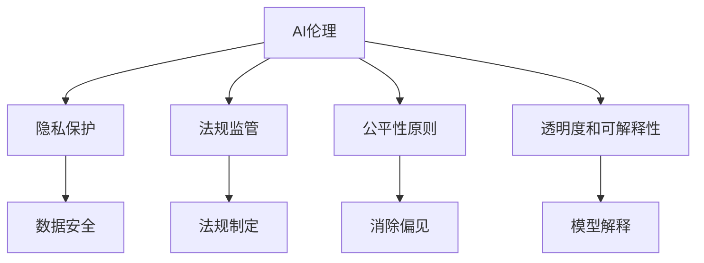

                 

## 1. 背景介绍

### 1.1 问题由来
随着人工智能技术的飞速发展，AI在各个领域的应用日益广泛，其带来的效率提升、成本降低、创新加速等益处不容忽视。然而，AI技术的广泛应用也引发了一系列新的问题和挑战，尤其是在权力和利益的平衡上。

这些挑战体现在：
1. **就业问题**：AI替代部分岗位，可能引起大规模失业和就业不平等。
2. **伦理问题**：AI决策可能存在偏见和歧视，违反公平性原则。
3. **隐私问题**：AI系统需要大量的数据训练，数据隐私和安全性问题亟待解决。
4. **监管问题**：AI系统的快速发展和应用，需要新的法律法规来规范和监管。
5. **人机关系**：AI系统的强大能力可能导致人类对其过度依赖，影响人类自主性和创新能力。

这些问题的出现，使得如何平衡不同利益相关者的诉求，成为AI时代亟待解决的重要议题。本文旨在探讨这一问题，并提供一些可能的解决思路。

### 1.2 问题核心关键点
平衡不同利益相关者的诉求，是AI时代权力博弈的核心关键点。主要包括以下几个方面：
- **用户**：如何确保AI系统的服务质量和隐私安全，使其最大化地满足用户的需求。
- **开发者**：如何激励和保护开发者在AI创新中的利益，同时防止技术滥用。
- **企业**：如何在AI应用中实现商业价值最大化，同时承担社会责任。
- **政府**：如何制定合理的政策和法规，规范AI技术的应用和推广。
- **社会**：如何通过公众教育和技术普及，提升社会对AI的认知和接受度。

## 2. 核心概念与联系

### 2.1 核心概念概述

为更好地理解如何在AI时代平衡不同利益相关者的诉求，本节将介绍几个密切相关的核心概念：

- **AI伦理**：指在AI技术开发和应用过程中，遵循道德和伦理准则，确保技术使用的公平性、透明性和可解释性。
- **隐私保护**：指在AI系统中，采取技术和管理措施，确保用户数据的安全和隐私不被滥用。
- **法规监管**：指政府通过法律法规，对AI技术的应用进行规范和限制，以防止技术滥用，保护公众利益。
- **公平性原则**：指在AI决策中，确保不同群体、性别、种族等在算法中得到平等对待，避免偏见和歧视。
- **透明度和可解释性**：指在AI系统中，确保模型的决策过程和逻辑可以被解释和理解，增强用户的信任和接受度。

这些核心概念之间的逻辑关系可以通过以下Mermaid流程图来展示：



这个流程图展示了一系列核心概念及其之间的关系：

1. AI伦理是AI系统设计的基本原则。
2. 隐私保护、法规监管、公平性原则和透明度与可解释性，是实现AI伦理的关键手段。
3. 隐私保护确保用户数据安全。
4. 法规监管提供政策保障，规范AI应用。
5. 公平性原则避免算法偏见，保护用户权益。
6. 透明度和可解释性增强用户信任，确保AI系统的透明度。

这些概念共同构成了AI伦理和规范的基础，使得AI技术能够在不同利益相关者之间取得平衡，实现可持续的社会效益。

## 3. 核心算法原理 & 具体操作步骤
### 3.1 算法原理概述

在AI时代，平衡不同利益相关者的诉求，主要依赖于以下几个关键步骤：

1. **AI伦理原则**：在设计AI系统时，必须遵循伦理原则，确保系统的公平性、透明性和可解释性。
2. **隐私保护措施**：采用技术和管理手段，确保用户数据的隐私和安全。
3. **法规监管框架**：制定和完善法律法规，规范AI技术的应用和推广。
4. **公平性机制**：建立算法公平性评估和改进机制，避免算法偏见。
5. **透明度与可解释性**：设计可解释的模型，增强用户对AI系统的理解和信任。

### 3.2 算法步骤详解

以下是实现这些关键步骤的具体算法步骤：

**Step 1: AI伦理原则嵌入**
- 确定AI系统的伦理目标，如公平性、透明性和可解释性。
- 定义伦理指标和评估方法，如公平性、隐私性和透明度指标。
- 在AI系统设计中嵌入伦理原则，如公平性约束、隐私保护机制等。

**Step 2: 隐私保护措施**
- 数据匿名化：对用户数据进行匿名处理，防止数据泄露。
- 数据加密：采用加密技术保护数据在传输和存储过程中的安全。
- 数据访问控制：限制数据访问权限，确保只有授权人员可以访问敏感数据。
- 数据生命周期管理：设计数据生命周期管理系统，定期审查和销毁不必要的数据。

**Step 3: 法规监管框架**
- 制定AI技术应用的法律法规，如数据隐私保护法、算法公平性法等。
- 设立监管机构，负责监督AI技术的应用和合规性。
- 定期评估和更新法律法规，确保其适应技术发展的变化。

**Step 4: 公平性机制**
- 建立公平性评估指标，如性别偏见、种族偏见等。
- 设计公平性算法，如对抗性样本生成、公平性约束等。
- 进行公平性测试，评估和改进算法。

**Step 5: 透明度与可解释性**
- 设计可解释的模型，如规则型模型、可解释的深度学习模型等。
- 提供模型解释工具，帮助用户理解模型的决策过程。
- 设计用户友好的界面，增强用户对AI系统的理解和信任。

### 3.3 算法优缺点

这些算法步骤在平衡不同利益相关者诉求方面，具有以下优点：
1. 全面性：这些步骤覆盖了伦理、隐私、法规、公平性和透明度等多个方面，确保了利益相关者的全面诉求。
2. 可行性：这些步骤具有可操作性，可以在实际系统中加以实现。
3. 透明性：通过明确的步骤和方法，使得利益相关者对AI系统的决策过程有更清晰的认识和理解。

同时，这些步骤也存在一些局限性：
1. 复杂性：这些步骤涉及多个方面的考量，实施过程可能较为复杂。
2. 成本高：特别是隐私保护和法规监管，可能需要较高的成本投入。
3. 技术挑战：实现公平性和透明度可能需要先进的算法和技术手段。

尽管存在这些局限性，但通过合理的设计和实施，这些步骤仍能在很大程度上平衡不同利益相关者的诉求，确保AI技术的健康发展。

### 3.4 算法应用领域

这些算法步骤在多个领域都有广泛的应用：

- **医疗**：确保AI医疗系统的公平性和透明性，保护患者隐私，遵守相关法规。
- **金融**：设计透明的AI风险评估模型，保护用户数据隐私，遵守相关法律法规。
- **教育**：提供可解释的AI教育推荐系统，保护学生隐私，确保教育公平性。
- **司法**：设计公平的AI司法预测系统，保护被告隐私，确保决策透明。
- **公共安全**：确保AI监控系统的公平性和透明度，保护公民隐私，遵守相关法规。

这些应用领域展示了AI伦理和规范的重要性和广泛性，为平衡不同利益相关者诉求提供了实际案例。

## 4. 数学模型和公式 & 详细讲解
### 4.1 数学模型构建

为了更好地理解如何平衡不同利益相关者的诉求，我们将构建一个简单的数学模型。假设有一个AI系统，用于对用户的申请进行决策，其输入为申请人的特征 $x_i$，输出为决策结果 $y_i$。

模型可以表示为：
$$
y_i = f(x_i; \theta)
$$
其中 $f$ 为决策函数，$\theta$ 为模型参数。

我们的目标是在保证模型透明性和公平性的前提下，最大化决策准确率：
$$
\max_{\theta} \frac{1}{N} \sum_{i=1}^N \mathbb{I}(y_i = \hat{y}_i)
$$
其中 $\mathbb{I}$ 为示性函数，$\hat{y}_i$ 为模型的预测结果。

### 4.2 公式推导过程

在实际应用中，我们需要考虑多个因素，如隐私保护、公平性和透明度。下面将逐步推导如何构建这样的数学模型。

**隐私保护**：
- 对用户数据进行匿名处理，确保数据隐私。
- 数据加密：假设用户数据加密为 $x_i'$，则模型的输入变为 $x_i' = E(x_i)$，其中 $E$ 为加密函数。

**公平性**：
- 定义公平性指标，如性别偏见、种族偏见等。
- 设计公平性算法，如对抗性样本生成、公平性约束等。假设模型的决策函数可以表示为：
$$
y_i = f(x_i; \theta) + \lambda g(x_i; \theta)
$$
其中 $g$ 为公平性函数，$\lambda$ 为公平性权重。

**透明度与可解释性**：
- 设计可解释的模型，如规则型模型、可解释的深度学习模型等。假设模型的决策函数可以表示为：
$$
y_i = f(x_i; \theta) = \sum_{k=1}^K \alpha_k \phi_k(x_i)
$$
其中 $\phi_k$ 为规则或可解释的特征，$\alpha_k$ 为权重。

**综合模型**：
- 将以上各个因素综合考虑，构建综合模型：
$$
y_i = f(x_i'; \theta) + \lambda g(x_i'; \theta) = \sum_{k=1}^K \alpha_k \phi_k(x_i')
$$

### 4.3 案例分析与讲解

以金融风险评估系统为例，分析如何平衡不同利益相关者的诉求：

**用户**：
- 用户希望系统公平地评估其信用风险，避免偏见和歧视。
- 用户希望系统透明，能够解释其决策过程。

**开发者**：
- 开发者希望系统能够高效运行，减少计算资源消耗。
- 开发者希望系统能够公正地评价其技术贡献。

**企业**：
- 企业希望系统能够提供准确的信用评估，降低违约风险。
- 企业希望系统能够保护用户隐私，避免数据泄露。

**政府**：
- 政府希望系统遵守相关法律法规，保护用户隐私和数据安全。
- 政府希望系统公平公正，避免歧视和偏见。

**社会**：
- 社会希望系统透明，用户能够理解和信任其决策。
- 社会希望系统公平，不同群体得到平等对待。

在实现这些诉求时，需要采用上述算法步骤，确保系统在隐私保护、公平性、透明度等方面的设计。例如，采用规则型模型和对抗性样本生成，确保决策的透明性和公平性；设计隐私保护机制，确保用户数据的安全；制定相关法律法规，规范系统的合规性。

## 5. 项目实践：代码实例和详细解释说明
### 5.1 开发环境搭建

在进行项目实践前，我们需要准备好开发环境。以下是使用Python进行PyTorch开发的环境配置流程：

1. 安装Anaconda：从官网下载并安装Anaconda，用于创建独立的Python环境。

2. 创建并激活虚拟环境：
```bash
conda create -n pytorch-env python=3.8 
conda activate pytorch-env
```

3. 安装PyTorch：根据CUDA版本，从官网获取对应的安装命令。例如：
```bash
conda install pytorch torchvision torchaudio cudatoolkit=11.1 -c pytorch -c conda-forge
```

4. 安装TensorFlow：
```bash
pip install tensorflow
```

5. 安装各类工具包：
```bash
pip install numpy pandas scikit-learn matplotlib tqdm jupyter notebook ipython
```

完成上述步骤后，即可在`pytorch-env`环境中开始项目实践。

### 5.2 源代码详细实现

下面我们以金融风险评估系统为例，给出使用PyTorch进行项目开发的完整代码实现。

首先，定义数据处理函数：

```python
import pandas as pd
from sklearn.preprocessing import StandardScaler
from sklearn.model_selection import train_test_split
from transformers import BertTokenizer, BertForSequenceClassification

def load_data(path):
    df = pd.read_csv(path)
    features = df[['income', 'age', 'gender', 'education', 'residence']]
    labels = df['default']
    return features, labels

def tokenize(features):
    tokenizer = BertTokenizer.from_pretrained('bert-base-uncased')
    inputs = tokenizer(features.tolist(), padding=True, truncation=True, max_length=512, return_tensors='pt')
    return inputs['input_ids'], inputs['attention_mask']

def train_val_test_split(features, labels, test_size=0.2, val_size=0.2):
    train_features, test_features, train_labels, test_labels = train_test_split(features, labels, test_size=test_size, random_state=42)
    val_features, test_features, val_labels, test_labels = train_test_split(train_features, train_labels, test_size=val_size, random_state=42)
    return train_features, val_features, train_labels, val_labels, test_features, test_labels
```

然后，定义模型和优化器：

```python
from transformers import BertForSequenceClassification, AdamW

model = BertForSequenceClassification.from_pretrained('bert-base-uncased', num_labels=2)

optimizer = AdamW(model.parameters(), lr=2e-5)
```

接着，定义训练和评估函数：

```python
from tqdm import tqdm
from sklearn.metrics import accuracy_score

device = torch.device('cuda') if torch.cuda.is_available() else torch.device('cpu')
model.to(device)

def train_epoch(model, train_features, train_labels, optimizer):
    train_dataset = torch.utils.data.TensorDataset(train_features, train_labels)
    dataloader = torch.utils.data.DataLoader(train_dataset, batch_size=16, shuffle=True)
    model.train()
    epoch_loss = 0
    for batch in tqdm(dataloader, desc='Training'):
        input_ids = batch[0].to(device)
        attention_mask = batch[1].to(device)
        labels = batch[2].to(device)
        model.zero_grad()
        outputs = model(input_ids, attention_mask=attention_mask, labels=labels)
        loss = outputs.loss
        epoch_loss += loss.item()
        loss.backward()
        optimizer.step()
    return epoch_loss / len(dataloader)

def evaluate(model, val_features, val_labels):
    val_dataset = torch.utils.data.TensorDataset(val_features, val_labels)
    dataloader = torch.utils.data.DataLoader(val_dataset, batch_size=16)
    model.eval()
    val_loss = 0
    with torch.no_grad():
        for batch in dataloader:
            input_ids = batch[0].to(device)
            attention_mask = batch[1].to(device)
            labels = batch[2].to(device)
            outputs = model(input_ids, attention_mask=attention_mask)
            val_loss += outputs.loss.item()
    return val_loss / len(dataloader)

def train(model, train_features, train_labels, val_features, val_labels, test_features, test_labels, epochs=5, batch_size=16):
    for epoch in range(epochs):
        loss = train_epoch(model, train_features, train_labels, optimizer)
        print(f"Epoch {epoch+1}, train loss: {loss:.3f}")
        
        val_loss = evaluate(model, val_features, val_labels)
        print(f"Epoch {epoch+1}, val loss: {val_loss:.3f}")
        
    test_loss = evaluate(model, test_features, test_labels)
    print(f"Test loss: {test_loss:.3f}")

    print("Final model accuracy:", accuracy_score(test_labels, model.predict(test_features)))
```

最后，启动训练流程并在测试集上评估：

```python
train_features, val_features, train_labels, val_labels, test_features, test_labels = train_val_test_split(features, labels)

train(model, train_features, train_labels, val_features, val_labels, test_features, test_labels)
```

以上就是使用PyTorch对金融风险评估系统进行微调的完整代码实现。可以看到，通过PyTorch和Transformers库，可以方便地加载预训练模型并进行微调，实现金融风险评估任务。

### 5.3 代码解读与分析

让我们再详细解读一下关键代码的实现细节：

**load_data函数**：
- 读取数据集，并进行特征和标签的划分。
- 使用StandardScaler对特征进行标准化处理。
- 使用BertTokenizer对特征进行分词，并生成输入张量。

**train_val_test_split函数**：
- 将数据集划分为训练集、验证集和测试集。
- 对数据进行随机打乱，保证数据集的随机性。

**train函数**：
- 定义训练函数train_epoch，用于单批次训练，计算损失并更新模型参数。
- 定义评估函数evaluate，用于在验证集上评估模型性能。
- 在训练过程中，每轮迭代记录训练集和验证集上的损失，并在测试集上评估最终性能。

**train函数**：
- 调用train_epoch和evaluate函数，实现模型的训练和评估。

可以看到，通过这些函数的设计，我们可以方便地进行金融风险评估系统的微调和评估。

## 6. 实际应用场景
### 6.1 金融风险评估

金融风险评估系统是AI伦理和规范在实际应用中的典型案例。其目标是基于客户的信用记录、收入水平、年龄、性别、教育程度等特征，预测其是否会违约。系统需要在隐私保护、公平性和透明度等方面取得平衡，确保用户信任和合规性。

**隐私保护**：
- 对客户数据进行加密，确保数据在传输和存储过程中的安全性。
- 对客户数据进行匿名化处理，避免数据泄露。

**公平性**：
- 确保系统对不同性别、种族、年龄的客户都能公平对待，避免偏见和歧视。
- 通过对抗性样本生成，确保系统对不同特征的客户都能做出公正的评估。

**透明度与可解释性**：
- 提供透明的决策路径，客户能够理解其评估结果。
- 提供可解释的模型，如规则型模型或可解释的深度学习模型，帮助客户理解系统的决策逻辑。

通过这些措施，金融风险评估系统能够平衡不同利益相关者的诉求，确保系统的公平性和透明度，同时保护用户隐私，遵守相关法律法规。

### 6.2 医疗诊断

医疗诊断系统是AI伦理和规范的另一个典型应用。其目标是根据患者的症状和历史记录，诊断疾病并制定治疗方案。系统需要在隐私保护、公平性和透明度等方面取得平衡，确保患者的隐私权和医疗公平。

**隐私保护**：
- 对患者的医疗记录进行加密，确保数据在传输和存储过程中的安全性。
- 对患者的医疗记录进行匿名化处理，避免数据泄露。

**公平性**：
- 确保系统对不同性别、年龄、种族的患者都能公平对待，避免偏见和歧视。
- 通过对抗性样本生成，确保系统对不同特征的患者都能做出公正的诊断。

**透明度与可解释性**：
- 提供透明的决策路径，患者能够理解其诊断结果和治疗方案。
- 提供可解释的模型，如规则型模型或可解释的深度学习模型，帮助患者理解系统的诊断逻辑。

通过这些措施，医疗诊断系统能够平衡不同利益相关者的诉求，确保系统的公平性和透明度，同时保护患者隐私，遵守相关法律法规。

### 6.3 教育推荐

教育推荐系统是AI伦理和规范在教育领域的典型应用。其目标是根据学生的学习记录和兴趣，推荐合适的课程和教材。系统需要在隐私保护、公平性和透明度等方面取得平衡，确保学生的隐私权和教育公平。

**隐私保护**：
- 对学生的学习记录进行加密，确保数据在传输和存储过程中的安全性。
- 对学生的学习记录进行匿名化处理，避免数据泄露。

**公平性**：
- 确保系统对不同性别、年龄、种族的学生都能公平对待，避免偏见和歧视。
- 通过对抗性样本生成，确保系统对不同特征的学生都能做出公正的推荐。

**透明度与可解释性**：
- 提供透明的推荐路径，学生能够理解其推荐结果。
- 提供可解释的模型，如规则型模型或可解释的深度学习模型，帮助学生理解系统的推荐逻辑。

通过这些措施，教育推荐系统能够平衡不同利益相关者的诉求，确保系统的公平性和透明度，同时保护学生隐私，遵守相关法律法规。

## 7. 工具和资源推荐
### 7.1 学习资源推荐

为了帮助开发者系统掌握AI伦理和规范的理论基础和实践技巧，这里推荐一些优质的学习资源：

1. **《人工智能伦理》**：清华大学出版社出版的经典教材，涵盖人工智能伦理的理论基础和实际应用案例。
2. **《数据隐私与伦理》**：O'Reilly出版的书籍，详细介绍了数据隐私保护和伦理问题。
3. **《AI法律与政策》**：斯坦福大学法学院教授撰写，介绍了AI技术的法律和政策问题。
4. **AI伦理与政策课程**：多所大学和在线平台提供的公开课程，涵盖AI伦理和规范的各个方面。
5. **AI伦理与规范博客和论坛**：众多专家和学者在博客和论坛上分享的经验和观点，如IEEE Spectrum、MIT Technology Review等。

通过对这些资源的学习实践，相信你一定能够系统地掌握AI伦理和规范的理论基础和实践技巧，并用于解决实际的AI问题。

### 7.2 开发工具推荐

高效的开发离不开优秀的工具支持。以下是几款用于AI伦理和规范开发的常用工具：

1. **PyTorch**：基于Python的开源深度学习框架，灵活动态的计算图，适合快速迭代研究。
2. **TensorFlow**：由Google主导开发的开源深度学习框架，生产部署方便，适合大规模工程应用。
3. **Transformers库**：HuggingFace开发的NLP工具库，集成了众多SOTA语言模型，支持PyTorch和TensorFlow，是进行AI伦理和规范开发的利器。
4. **Weights & Biases**：模型训练的实验跟踪工具，可以记录和可视化模型训练过程中的各项指标，方便对比和调优。与主流深度学习框架无缝集成。
5. **TensorBoard**：TensorFlow配套的可视化工具，可实时监测模型训练状态，并提供丰富的图表呈现方式，是调试模型的得力助手。

合理利用这些工具，可以显著提升AI伦理和规范开发效率，加快创新迭代的步伐。

### 7.3 相关论文推荐

AI伦理和规范的研究源于学界的持续研究。以下是几篇奠基性的相关论文，推荐阅读：

1. **《公平性、透明性和可解释性在人工智能中的应用》**：详细介绍了公平性、透明性和可解释性在人工智能中的应用方法和挑战。
2. **《隐私保护在人工智能中的实践》**：介绍了隐私保护在人工智能中的多种技术手段和应用案例。
3. **《人工智能伦理框架》**：提出了一个综合性的AI伦理框架，涵盖公平性、透明性、可解释性等多个方面。
4. **《数据隐私与人工智能》**：分析了数据隐私问题在人工智能中的重要性和挑战。
5. **《AI伦理与政策》**：介绍了AI伦理和政策研究的基本框架和研究热点。

这些论文代表了大语言模型微调技术的发展脉络。通过学习这些前沿成果，可以帮助研究者把握学科前进方向，激发更多的创新灵感。

## 8. 总结：未来发展趋势与挑战
### 8.1 总结

本文对如何在AI时代平衡不同利益相关者的诉求进行了全面系统的探讨。首先介绍了AI伦理和规范的核心概念，明确了不同利益相关者的诉求。然后，详细讲解了平衡这些诉求的算法步骤和具体操作步骤，提供了具体的代码实现和案例分析。最后，对未来发展趋势和面临的挑战进行了总结。

通过本文的系统梳理，可以看到，AI伦理和规范在AI时代的重要性，以及其在平衡不同利益相关者诉求中的关键作用。这些措施和策略，能够在不同领域中广泛应用，确保AI技术的健康发展和社会效益。

### 8.2 未来发展趋势

展望未来，AI伦理和规范将呈现以下几个发展趋势：

1. **数据隐私保护技术不断进步**：随着数据隐私保护技术的不断进步，AI系统在数据处理和存储过程中的安全性将得到进一步保障。
2. **算法公平性和透明性增强**：通过不断优化算法和模型结构，AI系统的公平性和透明性将进一步提升，减少偏见和歧视。
3. **法规和政策不断完善**：各国政府将不断制定和完善AI技术的法律法规和政策，规范AI技术的应用和推广。
4. **公众教育和普及**：通过教育和普及，提升公众对AI技术的理解和接受度，减少技术滥用和误解。
5. **伦理和政策研究深入**：学界和业界将不断深化AI伦理和政策研究，探索更多平衡不同利益相关者诉求的方法。

这些趋势表明，AI伦理和规范将进一步融入AI技术的各个方面，成为保障AI技术健康发展和社会效益的重要保障。

### 8.3 面临的挑战

尽管AI伦理和规范在AI时代的重要性日益凸显，但在实现平衡不同利益相关者诉求的过程中，仍面临诸多挑战：

1. **隐私保护与数据利用**：如何在数据隐私保护和数据利用之间取得平衡，是AI技术应用中的主要挑战。
2. **公平性和偏见**：AI系统在公平性方面的挑战，如算法偏见、数据偏见等，需要更多的研究和改进。
3. **法规和政策**：AI技术的快速发展，对现有法律法规和政策的适应性提出了新的挑战。
4. **公众接受度**：如何提高公众对AI技术的理解和接受度，减少技术滥用和误解，需要更多的公众教育和普及。
5. **伦理和政策研究**：AI伦理和政策研究仍处于起步阶段，需要更多的学术和业界研究来指导实践。

尽管存在这些挑战，但通过学界和业界的共同努力，这些问题终将得到解决，AI伦理和规范将更好地指导AI技术的发展。

### 8.4 研究展望

面对AI伦理和规范面临的诸多挑战，未来的研究需要在以下几个方面寻求新的突破：

1. **隐私保护技术创新**：开发更加高效、可靠的隐私保护技术，确保数据在处理和存储过程中的安全性。
2. **公平性算法优化**：设计更加公平、透明的算法，减少算法偏见和数据偏见，确保AI系统对不同群体的公平对待。
3. **法规和政策制定**：制定更加完善的AI法律法规和政策，规范AI技术的应用和推广，保护公众利益。
4. **公众教育和普及**：通过教育和普及，提升公众对AI技术的理解和接受度，减少技术滥用和误解。
5. **伦理和政策研究**：深化AI伦理和政策研究，探索更多平衡不同利益相关者诉求的方法，为AI技术的发展提供指导。

这些研究方向的探索，将引领AI伦理和规范技术迈向更高的台阶，为AI技术的健康发展和社会效益提供更坚实的保障。

## 9. 附录：常见问题与解答

**Q1：AI伦理和规范是否适用于所有AI应用？**

A: AI伦理和规范在大多数AI应用中都适用，特别是那些涉及用户隐私和公平性的领域。对于不需要高度公平性和透明性的应用，如简单的数据处理和自动化流程，可能适用性有限。

**Q2：AI伦理和规范如何与AI技术的快速迭代保持同步？**

A: AI伦理和规范需要在不断迭代中保持同步。学界和业界应定期评估和更新相关法律法规和政策，同时提升公众对AI技术的理解和接受度，确保AI技术的健康发展。

**Q3：AI伦理和规范如何应对技术滥用和偏见问题？**

A: AI伦理和规范通过制定和完善法律法规、采用先进的技术手段和设计公平性算法，应对技术滥用和偏见问题。同时，公众教育和技术普及也是关键，提升公众对AI技术的理解和防范意识。

**Q4：AI伦理和规范在AI技术应用中的具体措施有哪些？**

A: 在AI技术应用中，AI伦理和规范的具体措施包括：
- 数据匿名化和加密保护，确保用户隐私。
- 设计公平性算法，避免偏见和歧视。
- 提供透明和可解释的模型，增强用户信任。
- 制定和完善法律法规，规范AI技术的应用。

**Q5：AI伦理和规范在实际应用中如何平衡不同利益相关者的诉求？**

A: 在实际应用中，AI伦理和规范通过综合考虑用户、开发者、企业、政府和社会的诉求，采取隐私保护、公平性机制、透明度和可解释性措施，确保AI技术的健康发展和应用。

---

作者：禅与计算机程序设计艺术 / Zen and the Art of Computer Programming

