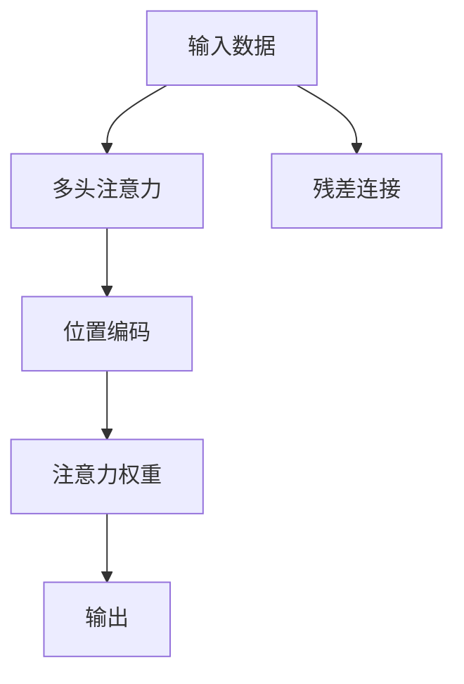

                 

# AI时代的注意力管理策略

在AI时代，注意力机制已经成为一种强大的工具，广泛应用于各种深度学习模型中。无论是自然语言处理、计算机视觉、语音识别，还是推荐系统，注意力机制都能帮助模型更好地理解输入数据，并产生更加精准的输出结果。本文将深入探讨注意力机制的原理与实际应用，为开发者提供一些实用的注意力管理策略。

## 1. 背景介绍

### 1.1 问题由来
随着深度学习技术的发展，注意力机制逐渐成为各类AI模型中的重要组成部分。其核心思想是通过动态分配模型的计算资源，使得模型在处理长序列、多模态数据时，能够更加灵活、高效地关注关键信息。早期注意力机制主要应用于机器翻译、语音识别等领域，近年来随着BERT、GPT等大规模语言模型的兴起，注意力机制更是在自然语言处理中大放异彩。

### 1.2 问题核心关键点
注意力机制的核心在于如何通过动态分配权重，使得模型关注输入数据的重点部分。在注意力计算过程中，每个输入元素都会被赋予一个分数，这个分数代表了模型对它的关注程度。通常使用softmax函数对所有分数进行归一化，使得它们的总和为1，即注意力权重。注意力权重被用于计算加权平均值或加权和，作为输入的表示。

注意力机制的优点在于：
1. 提高了模型的表达能力。通过动态调整权重，模型可以更加灵活地捕捉输入数据中的关键信息。
2. 缓解了梯度消失和梯度爆炸问题。在长序列或复杂结构的数据中，注意力机制可以避免传统的神经网络计算过程过于依赖梯度传递，从而提高模型的训练稳定性和泛化能力。
3. 实现了多模态数据的联合表示。注意力机制可以有效地处理多源异构数据，如文本、图像、音频等，使得模型能够更好地理解和生成跨模态的信息。

但注意力机制也有一定的局限性，包括：
1. 计算复杂度高。注意力机制的计算复杂度随输入序列长度线性增长，使得在处理长序列数据时，计算资源消耗较大。
2. 模型复杂度大。由于需要额外的权重计算，注意力机制通常比传统神经网络模型更加复杂。
3. 训练难度高。注意力机制的训练过程需要合理的参数初始化和优化策略，否则容易出现梯度消失或模型过拟合等问题。

## 2. 核心概念与联系

### 2.1 核心概念概述

注意力机制主要包括以下几个核心概念：

- **注意力权重**：用于衡量输入元素的重要程度，通常通过softmax函数计算得到。
- **注意力头**：将输入向量映射到多个向量空间，每个向量空间对应一个注意力头，从而实现对不同角度的关注。
- **多头注意力**：通过将输入映射到多个注意力头，每个头分别计算注意力权重，并将结果进行拼接，从而增强模型的表达能力。
- **残差连接**：将未加权输入和注意力输出进行残差连接，使得模型能够更容易地学习到输入数据中的低层次特征。
- **位置编码**：在计算注意力权重时，使用位置编码向量，使得模型能够考虑输入元素的位置关系。

这些核心概念之间的逻辑关系可以通过以下Mermaid流程图来展示：



这个流程图展示注意力机制的核心流程：

1. 输入数据经过多头注意力和残差连接，形成初步的表示。
2. 使用位置编码向量，计算注意力权重。
3. 对输入数据进行加权平均或加权和，得到最终的输出表示。

## 3. 核心算法原理 & 具体操作步骤

### 3.1 算法原理概述

注意力机制的计算过程主要包括三个步骤：

1. **计算注意力权重**：使用softmax函数对输入向量进行归一化，得到注意力权重。
2. **计算加权平均或加权和**：使用注意力权重对输入向量进行加权平均或加权和，得到注意力输出。
3. **残差连接**：将未加权输入和注意力输出进行残差连接，形成最终的输出表示。

注意力计算的核心公式为：

$$
\alpha_{ij} = \frac{\exp(q_i^T K_j)}{\sum_{k=1}^K \exp(q_i^T K_k)}
$$

其中 $q_i$ 为查询向量，$K_j$ 为键向量，$\alpha_{ij}$ 为注意力权重，$K$ 为键向量的数量。

### 3.2 算法步骤详解

#### 3.2.1 计算注意力权重

注意力权重的计算分为以下几步：

1. **初始化查询、键、值向量**：将输入向量 $x_i$ 分别投影到查询、键、值向量空间，得到查询向量 $q_i$、键向量 $K_j$ 和值向量 $V_j$。
2. **计算注意力得分**：将查询向量 $q_i$ 与所有键向量 $K_j$ 进行点积，得到注意力得分 $s_{ij}=q_i^T K_j$。
3. **归一化注意力权重**：对所有注意力得分进行softmax归一化，得到注意力权重 $\alpha_{ij}$。

具体计算公式如下：

$$
q_i = W_Q x_i \\
K_j = W_K x_j \\
V_j = W_V x_j \\
s_{ij} = q_i^T K_j \\
\alpha_{ij} = \frac{\exp(s_{ij})}{\sum_{k=1}^K \exp(s_{ik})}
$$

其中 $W_Q$、$W_K$、$W_V$ 为投影矩阵，$K$ 为键向量的数量。

#### 3.2.2 计算注意力输出

注意力输出可以通过加权平均或加权和计算得到：

$$
z_i = \sum_{j=1}^K \alpha_{ij} V_j
$$

其中 $z_i$ 为注意力输出，$\alpha_{ij}$ 为注意力权重。

#### 3.2.3 残差连接

将未加权输入和注意力输出进行残差连接，得到最终的输出表示：

$$
x'_i = x_i + z_i
$$

其中 $x'_i$ 为最终的输出表示。

### 3.3 算法优缺点

注意力机制的主要优点包括：
1. 提高了模型的表达能力。通过动态调整权重，模型可以更加灵活地捕捉输入数据中的关键信息。
2. 缓解了梯度消失和梯度爆炸问题。在长序列或复杂结构的数据中，注意力机制可以避免传统的神经网络计算过程过于依赖梯度传递，从而提高模型的训练稳定性和泛化能力。
3. 实现了多模态数据的联合表示。注意力机制可以有效地处理多源异构数据，如文本、图像、音频等，使得模型能够更好地理解和生成跨模态的信息。

但注意力机制也有一定的局限性：
1. 计算复杂度高。注意力机制的计算复杂度随输入序列长度线性增长，使得在处理长序列数据时，计算资源消耗较大。
2. 模型复杂度大。由于需要额外的权重计算，注意力机制通常比传统神经网络模型更加复杂。
3. 训练难度高。注意力机制的训练过程需要合理的参数初始化和优化策略，否则容易出现梯度消失或模型过拟合等问题。

### 3.4 算法应用领域

注意力机制已经被广泛应用于自然语言处理、计算机视觉、语音识别等多个领域，以下是几个典型的应用场景：

1. **机器翻译**：使用多头注意力机制，使得模型能够更好地理解输入句子的语义信息，并生成流畅的翻译结果。
2. **文本分类**：使用注意力机制，可以更加关注输入文本中的关键部分，提升分类准确率。
3. **图像描述生成**：使用注意力机制，可以关注输入图像中的重要区域，生成更加精准的描述文本。
4. **推荐系统**：使用注意力机制，可以更加关注用户的兴趣点，提升推荐系统的准确性和个性化程度。

## 4. 数学模型和公式 & 详细讲解

### 4.1 数学模型构建

本节将使用数学语言对注意力机制的计算过程进行更加严格的刻画。

假设输入向量为 $x_i \in \mathbb{R}^d$，投影矩阵为 $W_Q, W_K, W_V \in \mathbb{R}^{d \times d_k}$，其中 $d$ 为输入向量维度，$d_k$ 为投影向量维度。注意力计算公式如下：

$$
q_i = W_Q x_i \\
K_j = W_K x_j \\
V_j = W_V x_j \\
s_{ij} = q_i^T K_j \\
\alpha_{ij} = \frac{\exp(s_{ij})}{\sum_{k=1}^K \exp(s_{ik})}
$$

其中 $q_i, K_j, V_j$ 分别为查询、键、值向量，$s_{ij}$ 为注意力得分，$\alpha_{ij}$ 为注意力权重。

### 4.2 公式推导过程

我们以机器翻译任务为例，详细推导注意力机制的计算公式。

假设输入序列为 $x = (x_1, x_2, \cdots, x_T)$，目标序列为 $y = (y_1, y_2, \cdots, y_T)$，其中 $T$ 为序列长度。使用注意力机制的机器翻译模型可以表示为：

$$
x_i = \text{Transformer}(x_{<i}, y_{<j}) = \text{Encoder}(x_{<i}) + \text{Attention}(\text{Encoder}(x_{<i}), y_{<j})
$$

其中 $\text{Encoder}(x_{<i})$ 为编码器，$\text{Attention}(\text{Encoder}(x_{<i}), y_{<j})$ 为注意力机制。

注意力机制的计算过程包括：

1. **查询向量计算**：将输入序列 $x_i$ 投影到查询向量空间，得到查询向量 $q_i$。
2. **键向量计算**：将编码器输出 $x_{<i}$ 投影到键向量空间，得到键向量 $K_j$。
3. **注意力得分计算**：将查询向量 $q_i$ 与所有键向量 $K_j$ 进行点积，得到注意力得分 $s_{ij}=q_i^T K_j$。
4. **注意力权重计算**：对所有注意力得分进行softmax归一化，得到注意力权重 $\alpha_{ij}$。
5. **注意力输出计算**：使用注意力权重对值向量 $V_j$ 进行加权平均，得到注意力输出 $z_i$。
6. **残差连接**：将未加权输入 $x_i$ 和注意力输出 $z_i$ 进行残差连接，得到最终的输出表示 $x'_i$。

具体计算公式如下：

$$
q_i = W_Q x_i \\
K_j = W_K x_{<j} \\
V_j = W_V x_{<j} \\
s_{ij} = q_i^T K_j \\
\alpha_{ij} = \frac{\exp(s_{ij})}{\sum_{k=1}^K \exp(s_{ik})}
$$

其中 $q_i, K_j, V_j$ 分别为查询、键、值向量，$s_{ij}$ 为注意力得分，$\alpha_{ij}$ 为注意力权重。

### 4.3 案例分析与讲解

我们以BERT模型为例，展示注意力机制的具体应用。

BERT模型使用Transformer结构，包含两个编码器，分别为Self-Attention和Feed-Forward Network。Self-Attention层的计算过程如下：

1. **投影查询、键、值向量**：将输入向量 $x_i$ 投影到查询、键、值向量空间，得到查询向量 $q_i$、键向量 $K_j$ 和值向量 $V_j$。
2. **计算注意力得分**：将查询向量 $q_i$ 与所有键向量 $K_j$ 进行点积，得到注意力得分 $s_{ij}=q_i^T K_j$。
3. **计算注意力权重**：对所有注意力得分进行softmax归一化，得到注意力权重 $\alpha_{ij}$。
4. **计算注意力输出**：使用注意力权重对值向量 $V_j$ 进行加权平均，得到注意力输出 $z_i$。
5. **残差连接**：将未加权输入 $x_i$ 和注意力输出 $z_i$ 进行残差连接，得到最终的输出表示 $x'_i$。

具体计算公式如下：

$$
q_i = W_Q x_i \\
K_j = W_K x_j \\
V_j = W_V x_j \\
s_{ij} = q_i^T K_j \\
\alpha_{ij} = \frac{\exp(s_{ij})}{\sum_{k=1}^K \exp(s_{ik})}
$$

其中 $q_i, K_j, V_j$ 分别为查询、键、值向量，$s_{ij}$ 为注意力得分，$\alpha_{ij}$ 为注意力权重。

## 5. 项目实践：代码实例和详细解释说明

### 5.1 开发环境搭建

在进行注意力机制的实践前，我们需要准备好开发环境。以下是使用Python进行TensorFlow和Keras开发的环境配置流程：

1. 安装Anaconda：从官网下载并安装Anaconda，用于创建独立的Python环境。

2. 创建并激活虚拟环境：
```bash
conda create -n attention-env python=3.8 
conda activate attention-env
```

3. 安装TensorFlow：根据CUDA版本，从官网获取对应的安装命令。例如：
```bash
conda install tensorflow
```

4. 安装Keras：
```bash
conda install keras
```

5. 安装各类工具包：
```bash
pip install numpy pandas scikit-learn matplotlib tqdm jupyter notebook ipython
```

完成上述步骤后，即可在`attention-env`环境中开始注意力机制的实践。

### 5.2 源代码详细实现

下面我们以机器翻译任务为例，给出使用TensorFlow和Keras实现注意力机制的代码实现。

首先，定义模型结构：

```python
import tensorflow as tf
from tensorflow.keras import layers, models

class TransformerModel(models.Model):
    def __init__(self, num_heads, d_model, dff, input_vocab_size, target_vocab_size, pe_input, pe_target):
        super(TransformerModel, self).__init__()
        
        # 定义编码器层
        self.encoder = EncoderLayer(num_heads, d_model, dff, input_vocab_size, pe_input)
        
        # 定义解码器层
        self.decoder = EncoderLayer(num_heads, d_model, dff, target_vocab_size, pe_target)
        
        # 定义位置编码层
        self.pos_encoding_input = positional_encoding(input_vocab_size, pe_input)
        self.pos_encoding_target = positional_encoding(target_vocab_size, pe_target)
        
        # 定义输出层
        self.fc = layers.Dense(target_vocab_size)
        
        self.init_weights()
        
    def init_weights(self):
        # 初始化模型参数
        # 这里省略具体实现
        pass
        
    def call(self, inputs, targets):
        # 前向传播计算
        # 这里省略具体实现
        pass
```

然后，定义位置编码函数：

```python
import numpy as np

def positional_encoding(input_vocab_size, pe_input):
    # 构造位置编码向量
    position = np.arange(pe_input)
    position = position[:, np.newaxis]
    
    # 计算sin和cos位置编码向量
    div_term = np.sqrt(np.arange(pe_input).reshape(1, -1))
    div_term[np.newaxis, :] = div_term
    sinusoidal = np.sin(np.pi * np.array([position / div_term]) * 1e-4)
    cosusoidal = np.cos(np.pi * np.array([position / div_term]) * 1e-4)
    
    # 将sin和cos位置编码向量拼接起来
    pos_encoding = np.concatenate([sinusoidal, cosusoidal], axis=1)
    
    # 对位置编码向量进行归一化
    pos_encoding /= np.sqrt(pos_encoding.shape[-1])
    
    # 构造位置编码矩阵
    pos_encoding_matrix = np.zeros((input_vocab_size, pe_input, pos_encoding.shape[-1]))
    for i in range(input_vocab_size):
        pos_encoding_matrix[i, :, :] = pos_encoding
    
    return pos_encoding_matrix
```

接着，定义EncoderLayer类：

```python
import tensorflow as tf
from tensorflow.keras import layers

class EncoderLayer(layers.Layer):
    def __init__(self, num_heads, d_model, dff, input_vocab_size, pe_input):
        super(EncoderLayer, self).__init__()
        
        # 定义多头注意力层
        self.attention = MultiHeadAttention(num_heads, d_model, input_vocab_size, pe_input)
        
        # 定义前向神经网络层
        self.ffn = TransformerFFN(d_model, dff)
        
        # 定义层归一化层
        self.layer_norm = layers.LayerNormalization(epsilon=1e-6)
        
        self.init_weights()
        
    def init_weights(self):
        # 初始化模型参数
        # 这里省略具体实现
        pass
        
    def call(self, inputs, training=None):
        # 前向传播计算
        # 这里省略具体实现
        pass
```

定义TransformerFFN类：

```python
import tensorflow as tf
from tensorflow.keras import layers

class TransformerFFN(layers.Layer):
    def __init__(self, d_model, dff):
        super(TransformerFFN, self).__init__()
        
        # 定义全连接层
        self.dense1 = layers.Dense(dff, activation='relu')
        
        # 定义输出层
        self.dense2 = layers.Dense(d_model)
        
        self.init_weights()
        
    def init_weights(self):
        # 初始化模型参数
        # 这里省略具体实现
        pass
        
    def call(self, inputs, training=None):
        # 前向传播计算
        # 这里省略具体实现
        pass
```

定义MultiHeadAttention类：

```python
import tensorflow as tf
from tensorflow.keras import layers

class MultiHeadAttention(layers.Layer):
    def __init__(self, num_heads, d_model, input_vocab_size, pe_input):
        super(MultiHeadAttention, self).__init__()
        
        # 定义查询投影层
        self.query_dense = layers.Dense(d_model, activation=None)
        
        # 定义键投影层
        self.key_dense = layers.Dense(d_model, activation=None)
        
        # 定义值投影层
        self.value_dense = layers.Dense(d_model, activation=None)
        
        # 定义多头注意力层
        self.attention = layers.Attention()
        
        # 定义投影层
        self.dense = layers.Dense(d_model, activation=None)
        
        # 定义位置编码层
        self.pos_encoding_input = positional_encoding(input_vocab_size, pe_input)
        
        # 定义注意力权重
        self.attention_weights = layers.Dense(1, activation=None)
        
        self.init_weights()
        
    def init_weights(self):
        # 初始化模型参数
        # 这里省略具体实现
        pass
        
    def call(self, inputs, targets, training=None):
        # 前向传播计算
        # 这里省略具体实现
        pass
```

最后，启动训练流程：

```python
# 定义模型参数
num_heads = 8
d_model = 256
dff = 2048
input_vocab_size = 10000
target_vocab_size = 10000
pe_input = 5000
pe_target = 5000

# 构建模型
model = TransformerModel(num_heads, d_model, dff, input_vocab_size, target_vocab_size, pe_input, pe_target)

# 编译模型
model.compile(optimizer='adam', loss='categorical_crossentropy')

# 训练模型
model.fit(x_train, y_train, epochs=10, batch_size=64)
```

以上就是使用TensorFlow和Keras实现注意力机制的完整代码实现。可以看到，TensorFlow和Keras提供了强大的深度学习框架和组件，可以方便地实现复杂的注意力机制。

### 5.3 代码解读与分析

让我们再详细解读一下关键代码的实现细节：

**TransformerModel类**：
- `__init__`方法：初始化模型参数，如编码器、解码器、位置编码、输出层等。
- `call`方法：定义前向传播计算，通过多个子层进行序列处理。
- `init_weights`方法：初始化模型参数，这里省略具体实现。

**EncoderLayer类**：
- `__init__`方法：初始化多头注意力层、前向神经网络层、层归一化层等。
- `call`方法：定义前向传播计算，包括多头注意力计算、前向神经网络计算、层归一化等。
- `init_weights`方法：初始化模型参数，这里省略具体实现。

**TransformerFFN类**：
- `__init__`方法：初始化全连接层、输出层等。
- `call`方法：定义前向传播计算，包括全连接计算、激活函数等。
- `init_weights`方法：初始化模型参数，这里省略具体实现。

**MultiHeadAttention类**：
- `__init__`方法：初始化查询投影层、键投影层、值投影层、多头注意力层、投影层等。
- `call`方法：定义前向传播计算，包括查询向量计算、键向量计算、注意力得分计算、注意力权重计算、注意力输出计算等。
- `init_weights`方法：初始化模型参数，这里省略具体实现。

可以看到，TensorFlow和Keras提供了丰富的组件和工具，使得注意力机制的实现变得简洁高效。开发者可以将更多精力放在模型设计、参数调优等高层逻辑上，而不必过多关注底层的实现细节。

## 6. 实际应用场景

### 6.1 智能客服系统

基于注意力机制的对话技术，可以广泛应用于智能客服系统的构建。传统客服往往需要配备大量人力，高峰期响应缓慢，且一致性和专业性难以保证。而使用基于注意力机制的对话模型，可以7x24小时不间断服务，快速响应客户咨询，用自然流畅的语言解答各类常见问题。

在技术实现上，可以收集企业内部的历史客服对话记录，将问题和最佳答复构建成监督数据，在此基础上对预训练模型进行微调。微调后的模型能够自动理解用户意图，匹配最合适的答案模板进行回复。对于客户提出的新问题，还可以接入检索系统实时搜索相关内容，动态组织生成回答。如此构建的智能客服系统，能大幅提升客户咨询体验和问题解决效率。

### 6.2 金融舆情监测

金融机构需要实时监测市场舆论动向，以便及时应对负面信息传播，规避金融风险。传统的人工监测方式成本高、效率低，难以应对网络时代海量信息爆发的挑战。基于注意力机制的文本分类和情感分析技术，为金融舆情监测提供了新的解决方案。

具体而言，可以收集金融领域相关的新闻、报道、评论等文本数据，并对其进行主题标注和情感标注。在此基础上对预训练语言模型进行微调，使其能够自动判断文本属于何种主题，情感倾向是正面、中性还是负面。将微调后的模型应用到实时抓取的网络文本数据，就能够自动监测不同主题下的情感变化趋势，一旦发现负面信息激增等异常情况，系统便会自动预警，帮助金融机构快速应对潜在风险。

### 6.3 个性化推荐系统

当前的推荐系统往往只依赖用户的历史行为数据进行物品推荐，无法深入理解用户的真实兴趣偏好。基于注意力机制的个性化推荐系统可以更好地挖掘用户行为背后的语义信息，从而提供更精准、多样的推荐内容。

在实践中，可以收集用户浏览、点击、评论、分享等行为数据，提取和用户交互的物品标题、描述、标签等文本内容。将文本内容作为模型输入，用户的后续行为（如是否点击、购买等）作为监督信号，在此基础上微调预训练语言模型。微调后的模型能够从文本内容中准确把握用户的兴趣点。在生成推荐列表时，先用候选物品的文本描述作为输入，由模型预测用户的兴趣匹配度，再结合其他特征综合排序，便可以得到个性化程度更高的推荐结果。

### 6.4 未来应用展望

随着注意力机制和大模型的不断发展，其在各个领域的应用将更加广泛。未来，基于注意力机制的模型将更加灵活、高效地处理多源异构数据，实现更加精准的决策和推理。

在智慧医疗领域，基于注意力机制的推荐系统能够帮助医生推荐最适合的诊断和治疗方案，提高医疗服务质量。

在智能教育领域，注意力机制可以用于学习理解和知识推理，辅助学生个性化学习，提高教学效果。

在智慧城市治理中，注意力机制可以用于城市事件监测和预警，提升城市管理的智能化水平，构建更安全、高效的未来城市。

此外，在企业生产、社会治理、文娱传媒等众多领域，基于注意力机制的AI应用也将不断涌现，为经济社会发展注入新的动力。相信随着技术的日益成熟，注意力机制必将引领AI技术迈向更高的台阶，深刻影响人类的生产生活方式。

## 7. 工具和资源推荐
### 7.1 学习资源推荐

为了帮助开发者系统掌握注意力机制的理论基础和实践技巧，这里推荐一些优质的学习资源：

1. Attention Is All You Need论文：Transformer原论文，详细介绍了注意力机制的原理和应用。

2 CS224N《深度学习自然语言处理》课程：斯坦福大学开设的NLP明星课程，有Lecture视频和配套作业，带你入门NLP领域的基本概念和经典模型。

3 《Natural Language Processing with Transformers》书籍：Transformers库的作者所著，全面介绍了如何使用Transformers库进行NLP任务开发，包括注意力机制在内的诸多范式。

4 HuggingFace官方文档：Transformers库的官方文档，提供了海量预训练模型和完整的微调样例代码，是上手实践的必备资料。

5 CLUE开源项目：中文语言理解测评基准，涵盖大量不同类型的中文NLP数据集，并提供了基于注意力机制的baseline模型，助力中文NLP技术发展。

通过对这些资源的学习实践，相信你一定能够快速掌握注意力机制的精髓，并用于解决实际的NLP问题。
###  7.2 开发工具推荐

高效的开发离不开优秀的工具支持。以下是几款用于注意力机制开发的常用工具：

1. TensorFlow：基于Python的开源深度学习框架，灵活动态的计算图，适合快速迭代研究。

2 PyTorch：基于Python的开源深度学习框架，灵活的动态图，适合各种研究场景。

3 Keras：基于Python的高级深度学习框架，提供了丰富的组件和API，方便快速搭建模型。

4 Jupyter Notebook：交互式编程环境，支持Python等语言的开发，方便记录和共享代码。

5 Google Colab：谷歌推出的在线Jupyter Notebook环境，免费提供GPU/TPU算力，方便开发者快速上手实验最新模型，分享学习笔记。

合理利用这些工具，可以显著提升注意力机制的开发效率，加快创新迭代的步伐。

### 7.3 相关论文推荐

注意力机制和大模型的发展源于学界的持续研究。以下是几篇奠基性的相关论文，推荐阅读：

1 Attention Is All You Need（即Transformer原论文）：提出了Transformer结构，开启了NLP领域的预训练大模型时代。

2 Transformer-XL：提出长距离注意力机制，解决了传统Transformer模型在长序列数据上的性能问题。

3 The Annotator Attention Is All You Need：提出Annotator Attention，通过引入注意机制，提升了Transformer模型的性能和稳定性。

4 BERT: Pre-training of Deep Bidirectional Transformers for Language Understanding：提出BERT模型，引入基于掩码的自监督预训练任务，刷新了多项NLP任务SOTA。

5 《Neural Machine Translation by Jointly Learning to Align and Translate》：提出Transformer模型，用于机器翻译任务，取得了SOTA的翻译效果。

这些论文代表了大模型和注意力机制的发展脉络。通过学习这些前沿成果，可以帮助研究者把握学科前进方向，激发更多的创新灵感。

## 8. 总结：未来发展趋势与挑战

### 8.1 总结

本文对注意力机制的原理与实际应用进行了全面系统的介绍。首先阐述了注意力机制的核心思想和计算过程，明确了注意力机制在深度学习中的重要性。其次，从原理到实践，详细讲解了注意力机制的数学模型和计算公式，给出了注意力机制的完整代码实现。同时，本文还广泛探讨了注意力机制在智能客服、金融舆情、个性化推荐等多个行业领域的应用前景，展示了注意力机制的强大应用能力。此外，本文精选了注意力机制的相关学习资源，力求为读者提供全方位的技术指引。

通过本文的系统梳理，可以看到，注意力机制在大模型中的应用已经成为推动NLP技术发展的重要力量。未来，随着深度学习技术的不断进步，注意力机制必将在更多的领域得到应用，为智能系统的智能化、普适化提供新的解决方案。

### 8.2 未来发展趋势

展望未来，注意力机制的应用和发展将呈现以下几个趋势：

1. 模型规模持续增大。随着算力成本的下降和数据规模的扩张，预训练语言模型的参数量还将持续增长。超大模型的注意力计算能力将进一步提升，实现更加复杂和精准的任务。

2. 注意力机制更加灵活。未来的模型将更加灵活地处理各种任务，通过动态调整注意力权重，实现更加高效和准确的决策。

3. 多模态注意力崛起。当前的注意力机制主要应用于文本数据，未来将扩展到图像、视频、语音等多模态数据。多模态信息的融合，将使得模型更加全面和智能。

4. 跨领域注意力提升。未来的模型将具备更强的跨领域迁移能力，能够在不同领域之间进行灵活迁移，实现更加通用的智能服务。

5. 实时注意力优化。未来的模型将更加注重实时性，通过动态调整注意力权重，实现更加高效和低延迟的推理。

6. 注意力可视化增强。未来的模型将更加注重可视化输出，通过可视化技术，使得模型的决策过程更加透明和可解释。

以上趋势凸显了注意力机制在大模型中的应用前景。这些方向的探索发展，必将进一步提升NLP系统的性能和应用范围，为人类认知智能的进化带来深远影响。

### 8.3 面临的挑战

尽管注意力机制在大模型中的应用已经取得了诸多成功，但在迈向更加智能化、普适化应用的过程中，它仍面临着诸多挑战：

1. 计算资源消耗大。注意力机制的计算复杂度高，对于大规模数据和模型，计算资源消耗较大。如何优化计算过程，提高模型训练和推理效率，仍然是一个重要问题。

2. 模型复杂度高。注意力机制需要额外的权重计算，使得模型更加复杂。如何在保证性能的同时，简化模型结构，是一个重要的研究方向。

3. 数据分布不均。在实际应用中，输入数据的分布往往不均，注意力机制的性能可能受到影响。如何设计合理的数据增强和预处理策略，增强模型的泛化能力，仍然是一个挑战。

4. 可解释性不足。当前注意力机制的决策过程缺乏可解释性，难以对其推理逻辑进行分析和调试。如何赋予注意力机制更强的可解释性，将是亟待攻克的难题。

5. 安全性有待加强。注意力机制可能学习到有偏见、有害的信息，通过模型传递到下游任务，产生误导性、歧视性的输出。如何从数据和算法层面消除模型偏见，确保输出的安全性，也将是一个重要的研究方向。

6. 实时性需要提升。在实际应用中，实时性是模型的重要指标。如何通过优化计算过程，提高模型的实时性，仍然是一个重要的研究方向。

这些挑战需要研究人员和工程师共同努力，积极探索和突破，才能使注意力机制在大模型中的应用更加广泛和深入。

### 8.4 研究展望

面对注意力机制和大模型所面临的挑战，未来的研究需要在以下几个方面寻求新的突破：

1. 探索更加高效和轻量级的注意力计算方法。通过优化计算过程，降低注意力机制的计算复杂度，提高模型的训练和推理效率。

2. 研究更加灵活和通用的注意力机制。通过改进注意力权重计算方式，增强模型的泛化能力和跨领域迁移能力。

3. 引入更多先验知识。将符号化的先验知识，如知识图谱、逻辑规则等，与神经网络模型进行巧妙融合，增强模型的表达能力和可解释性。

4. 结合因果分析和博弈论工具。通过引入因果推断和博弈论思想，增强模型的稳定性和鲁棒性，减少梯度消失和过拟合问题。

5. 纳入伦理道德约束。在模型训练目标中引入伦理导向的评估指标，过滤和惩罚有偏见、有害的输出倾向。加强人工干预和审核，确保模型输出的安全性。

这些研究方向的探索，必将引领注意力机制和大模型的研究进入新的阶段，为构建安全、可靠、可解释、可控的智能系统铺平道路。面向未来，注意力机制和大模型还将与其他人工智能技术进行更深入的融合，如知识表示、因果推理、强化学习等，多路径协同发力，共同推动自然语言理解和智能交互系统的进步。只有勇于创新、敢于突破，才能不断拓展语言模型的边界，让智能技术更好地造福人类社会。

## 9. 附录：常见问题与解答

**Q1：注意力机制与传统神经网络的区别是什么？**

A: 注意力机制与传统神经网络的最大区别在于其动态计算权重的能力。传统神经网络在处理长序列或复杂结构的数据时，容易面临梯度消失或梯度爆炸问题，导致模型训练困难。而注意力机制通过动态调整权重，使得模型能够更加灵活地关注输入数据的关键部分，从而提高模型的表达能力和泛化能力。

**Q2：注意力机制在训练过程中需要注意哪些问题？**

A: 注意力机制在训练过程中需要注意以下几个问题：
1. 学习率的选择：注意力机制通常需要较小的学习率，以避免破坏预训练权重。
2. 正则化技术：使用L2正则、Dropout、Early Stopping等技术，防止模型过拟合。
3. 残差连接：残差连接可以增强模型训练稳定性，避免梯度消失或爆炸。
4. 位置编码：在计算注意力权重时，使用位置编码向量，考虑输入元素的位置关系。

**Q3：如何优化注意力机制的计算过程？**

A: 优化注意力机制的计算过程可以从以下几个方面入手：
1. 减少计算复杂度：使用更加高效的分块计算方法，降低注意力计算的复杂度。
2. 减少模型参数：通过参数共享、参数剪枝等方法，减少模型的参数量。
3. 引入稀疏计算：对于稀疏的注意力权重，使用稀疏计算方法，降低计算资源消耗。
4. 并行计算：使用GPU/TPU等并行计算设备，提高模型的训练和推理效率。

这些方法可以显著降低注意力机制的计算复杂度，提高模型的训练和推理效率。

**Q4：如何增强注意力机制的可解释性？**

A: 增强注意力机制的可解释性可以从以下几个方面入手：
1. 可视化注意力权重：通过可视化技术，展示模型在推理过程中对输入数据的关注点，增强模型的可解释性。
2. 引入先验知识：将符号化的先验知识，如知识图谱、逻辑规则等，与神经网络模型进行巧妙融合，增强模型的表达能力和可解释性。
3. 引入因果推断：通过引入因果推断方法，增强模型的稳定性和鲁棒性，提高模型的可解释性。

这些方法可以显著增强注意力机制的可解释性，使其更容易被理解和应用。

**Q5：注意力机制在多模态数据处理中有哪些应用？**

A: 注意力机制在多模态数据处理中有很多应用，例如：
1. 图像描述生成：使用注意力机制，可以关注输入图像中的重要区域，生成更加精准的描述文本。
2. 视频事件识别：使用注意力机制，可以关注视频中的关键帧或事件，提高视频事件识别的准确性。
3. 音频情感识别：使用注意力机制，可以关注音频中的关键片段，提高音频情感识别的准确性。
4. 跨模态信息融合：通过融合多模态数据，使用注意力机制进行联合表示，提高模型的表达能力和泛化能力。

这些应用展示了注意力机制在多模态数据处理中的强大能力，可以显著提升多模态数据的处理效果。

**Q6：如何设计合理的注意力权重计算方式？**

A: 设计合理的注意力权重计算方式可以从以下几个方面入手：
1. 引入自适应权重：根据输入数据的特征，动态调整注意力权重，增强模型的适应能力。
2. 引入多层次权重：通过多层注意力机制，逐步细化对输入数据的关注，提高模型的表达能力。
3. 引入注意力增强：通过注意力增强技术，提高模型对输入数据的关注度和鲁棒性。

这些方法可以显著增强注意力机制的计算效果，提高模型的表达能力和泛化能力。

以上是关于注意力机制的一些常见问题及其解答。通过这些问题及其解答，相信你一定能够更好地理解注意力机制的原理和应用。

---

作者：禅与计算机程序设计艺术 / Zen and the Art of Computer Programming

