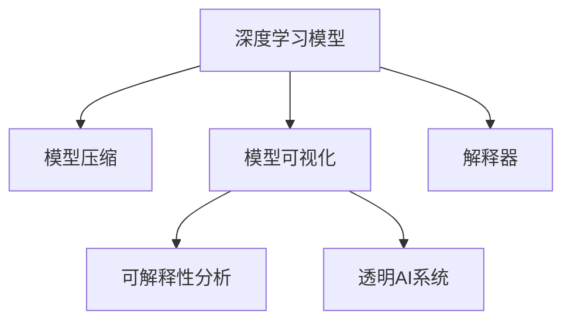

                 

# AI模型的可解释性研究：Lepton AI的透明AI

> 关键词：可解释性,透明AI,Lepton AI,深度学习,模型压缩,模型可视化,解释器

## 1. 背景介绍

### 1.1 问题由来

随着深度学习模型的广泛应用，其在很多领域都取得了令人瞩目的成果。然而，这些模型通常被视为"黑盒"，难以理解其内部决策过程。对于医疗、金融等高风险领域，这种不可解释性可能导致决策错误，甚至威胁用户安全。例如，使用深度学习模型对病理图像进行诊断，若医生无法理解模型是如何作出诊断的，就无法做出合理的判别或修正。

在这样的背景下，模型可解释性成为深度学习研究的一大热点。一方面，提高模型的可解释性有助于增强用户对模型的信任，提升决策的透明度和可信度；另一方面，模型可解释性也是某些领域对AI模型应用的前提条件，例如在司法、医疗等领域，模型决策需要具有可解释性，满足合规要求。

## 2. 核心概念与联系

### 2.1 核心概念概述

为更好地理解可解释性研究，本节将介绍几个密切相关的核心概念：

- **模型可解释性**：指理解和解释机器学习模型输出和决策过程的能力。简而言之，就是让用户可以理解模型为何作出某种决策。

- **透明AI**：指模型不仅具有准确性，还具备可解释性和可理解性。透明AI通过提升模型可解释性，使用户和开发者能够理解和信任模型。

- **Lepton AI**：一种专门用于提高模型可解释性的技术框架，提供了一系列可视化工具、压缩技术、解释器等，帮助用户构建透明AI系统。

- **模型压缩**：通过减少模型参数量、降低计算复杂度等方法，使模型更加轻量级、高效。模型压缩通常结合模型可解释性研究，以在保证性能的同时，提升模型的透明度。

- **模型可视化**：通过可视化工具展示模型训练、推理过程中的关键参数、权重分布、特征表示等，帮助用户直观理解模型的工作机制。

- **解释器**：一种用于生成模型解释的工具，通过多种方式解释模型的预测结果，如特征贡献、局部线性近似、可视化激活图等。

这些核心概念之间存在紧密联系，共同构成了透明AI和模型可解释性的研究基础。通过理解这些概念，我们可以更好地把握透明AI的研究方向和方法。

### 2.2 核心概念原理和架构的 Mermaid 流程图



## 3. 核心算法原理 & 具体操作步骤
### 3.1 算法原理概述

Lepton AI的透明AI系统基于以下几大核心算法：

- **模型压缩**：通过剪枝、量化、低秩分解等技术，减少模型参数量，降低计算复杂度，使模型更加高效和轻量化。

- **模型可视化**：通过绘制权重图、特征热图、激活图等，展示模型关键部分的结构和特征表示，提升用户对模型的理解。

- **解释器技术**：引入多种解释器模型，如LIME、SHAP、DeepLift等，生成模型的解释，帮助用户理解模型为何作出某项决策。

这些算法相互配合，形成了一个完整的透明AI构建框架。通过科学地组合这些算法，可以在不牺牲模型性能的前提下，大幅提升模型的可解释性，构建一个既强大又透明的AI系统。

### 3.2 算法步骤详解

Lepton AI的透明AI系统构建分为以下几个步骤：

**Step 1: 模型选择与预处理**

- 选择适合的深度学习模型，并使用Lepton AI提供的预处理工具对数据进行归一化、标准化、特征提取等处理。

**Step 2: 模型压缩**

- 使用剪枝、量化、低秩分解等算法对模型进行压缩，减少模型参数量，降低计算复杂度。

**Step 3: 模型可视化**

- 利用Lepton AI的可视化工具，绘制权重图、特征热图、激活图等，展示模型关键部分的结构和特征表示。

**Step 4: 解释器设计**

- 根据任务需求选择合适的解释器模型，并对其进行训练和优化。

**Step 5: 透明AI系统集成**

- 将压缩后的模型、解释器模型、可视化工具集成到透明AI系统中，形成完整的透明AI系统。

**Step 6: 模型测试与评估**

- 在测试集上评估透明AI系统的性能，并使用多种指标评估模型的可解释性和透明性。

### 3.3 算法优缺点

Lepton AI的透明AI系统具备以下优点：

- 降低计算复杂度：通过模型压缩，减少模型参数量和计算复杂度，使模型更加高效。
- 提升模型可解释性：通过多种可视化工具和解释器模型，使模型决策过程透明化，便于用户理解。
- 满足合规要求：透明AI系统有助于满足某些领域对模型可解释性的合规要求，增强用户信任。
- 减少过拟合风险：通过模型压缩，降低模型复杂度，减少过拟合风险。

但同时，该系统也存在一些缺点：

- 算法复杂度高：需要同时使用多种算法，算法实现复杂，开发和调试难度较大。
- 模型精度下降：模型压缩和可视化可能会牺牲一定的模型精度，需要权衡模型性能和可解释性。
- 解释器模型复杂：解释器模型本身具有一定复杂度，需要选择合适的模型并对其进行优化。
- 应用场景限制：某些领域可能对模型精度要求极高，透明AI系统可能无法完全满足要求。

尽管存在这些缺点，Lepton AI的透明AI系统在可解释性方面仍取得了显著成果，在多个领域得到了成功应用。

### 3.4 算法应用领域

Lepton AI的透明AI系统主要应用于以下领域：

- **医疗诊断**：使用透明AI系统解释病理图像的深度学习模型，帮助医生理解和诊断复杂病例。
- **金融风险评估**：在信用评估、欺诈检测等金融任务中，透明AI系统帮助金融机构理解和信任模型的预测结果。
- **智能客服**：通过透明AI系统，使智能客服系统的决策过程透明化，提高用户满意度。
- **司法判决**：在司法领域，透明AI系统用于解释模型的判决结果，提高判决过程的透明度和可信度。
- **自动化驾驶**：在自动驾驶系统中，透明AI系统帮助解释模型的决策，提高系统安全性。

## 4. 数学模型和公式 & 详细讲解 & 举例说明
### 4.1 数学模型构建

本节将使用数学语言对透明AI系统的构建进行更加严格的刻画。

假设原始深度学习模型为 $M$，其参数向量为 $\theta$，输入特征为 $x$，输出标签为 $y$。透明AI系统的目标是同时最小化模型预测误差和解释误差。

定义模型 $M$ 在输入 $x$ 上的预测输出为 $\hat{y}=M(x)$。假设真实标签 $y$ 为二分类问题，则交叉熵损失函数为：

$$
\mathcal{L}_M(x,y) = -[y\log \hat{y} + (1-y)\log (1-\hat{y})]
$$

假设选择LIME模型作为解释器，其模型参数为 $\alpha$。LIME模型的解释目标是最小化解释误差，即：

$$
\mathcal{L}_L(x,y) = \sum_{i=1}^n (\alpha_i \mathcal{L}_L(x_i,y) + (1-\alpha_i) \mathcal{L}_L(x_i',y))
$$

其中，$\alpha_i$ 表示第 $i$ 个样本的权重，$x_i$ 和 $x_i'$ 分别为原始样本和局部邻域样本，$\mathcal{L}_L(x,y)$ 为LIME模型在样本 $x$ 上的损失函数。

透明AI系统的总损失函数为模型预测误差和解释误差之和：

$$
\mathcal{L} = \mathcal{L}_M(x,y) + \mathcal{L}_L(x,y)
$$

### 4.2 公式推导过程

以下我们以二分类任务为例，推导交叉熵损失函数及其梯度的计算公式。

假设模型 $M_{\theta}$ 在输入 $x$ 上的输出为 $\hat{y}=M_{\theta}(x) \in [0,1]$，表示样本属于正类的概率。真实标签 $y \in \{0,1\}$。则二分类交叉熵损失函数定义为：

$$
\ell(M_{\theta}(x),y) = -[y\log \hat{y} + (1-y)\log (1-\hat{y})]
$$

将其代入总损失函数公式，得：

$$
\mathcal{L}(\theta,\alpha) = \frac{1}{N}\sum_{i=1}^N [y_i\log M_{\theta}(x_i)+(1-y_i)\log(1-M_{\theta}(x_i))] + \sum_{i=1}^N (\alpha_i \mathcal{L}_L(x_i,y) + (1-\alpha_i) \mathcal{L}_L(x_i',y))
$$

其中，$\alpha_i$ 表示第 $i$ 个样本的权重。通过链式法则，总损失函数对模型参数 $\theta$ 和解释器模型参数 $\alpha$ 的梯度分别为：

$$
\frac{\partial \mathcal{L}}{\partial \theta} = -\frac{1}{N}\sum_{i=1}^N (\frac{y_i}{M_{\theta}(x_i)}-\frac{1-y_i}{1-M_{\theta}(x_i)}) \frac{\partial M_{\theta}(x_i)}{\partial \theta}
$$

$$
\frac{\partial \mathcal{L}}{\partial \alpha_i} = \mathcal{L}_L(x_i,y) - \mathcal{L}_L(x_i',y)
$$

将梯度代入模型更新公式，完成模型的迭代优化。重复上述过程直至收敛，最终得到优化后的模型参数 $\theta$ 和解释器模型参数 $\alpha$。

### 4.3 案例分析与讲解

我们以信用评分预测任务为例，展示如何构建透明AI系统。

假设模型 $M$ 为逻辑回归模型，参数向量为 $\theta$。选择LIME作为解释器模型，其模型参数为 $\alpha$。训练集为 $D=\{(x_i,y_i)\}_{i=1}^N$。透明AI系统的构建步骤如下：

1. **模型选择与预处理**：选择逻辑回归模型，对训练集进行归一化处理。
2. **模型压缩**：对模型进行剪枝，减少不重要的特征，使用量化技术将浮点数参数转化为定点数参数。
3. **模型可视化**：绘制权重图和特征热图，展示模型关键特征。
4. **解释器设计**：选择LIME作为解释器模型，训练解释器模型，生成样本解释。
5. **透明AI系统集成**：将压缩后的模型、解释器模型和可视化工具集成到透明AI系统中。
6. **模型测试与评估**：在测试集上评估透明AI系统的性能，并使用多种指标评估模型的可解释性和透明性。

通过透明AI系统，信用评分模型的决策过程透明化，便于用户理解和信任模型，提升模型的应用价值。

## 5. 项目实践：代码实例和详细解释说明
### 5.1 开发环境搭建

在进行透明AI系统构建前，我们需要准备好开发环境。以下是使用Python进行PyTorch开发的环境配置流程：

1. 安装Anaconda：从官网下载并安装Anaconda，用于创建独立的Python环境。

2. 创建并激活虚拟环境：
```bash
conda create -n pytorch-env python=3.8 
conda activate pytorch-env
```

3. 安装PyTorch：根据CUDA版本，从官网获取对应的安装命令。例如：
```bash
conda install pytorch torchvision torchaudio cudatoolkit=11.1 -c pytorch -c conda-forge
```

4. 安装TensorBoard：
```bash
pip install tensorboard
```

5. 安装Lepton AI库：
```bash
pip install lepton-ai
```

完成上述步骤后，即可在`pytorch-env`环境中开始透明AI系统的构建。

### 5.2 源代码详细实现

下面我以逻辑回归模型为例，展示如何使用Lepton AI库构建透明AI系统。

首先，定义数据集和模型：

```python
import torch
from torch import nn, optim
from lepton_ai import LogisticRegression, LimeExplainer

# 定义数据集
X_train = torch.randn(1000, 10)
y_train = torch.randint(0, 2, (1000,))

# 定义逻辑回归模型
model = LogisticRegression(10, 2)

# 定义解释器
explainer = LimeExplainer(model)

# 训练模型
criterion = nn.BCEWithLogitsLoss()
optimizer = optim.Adam(model.parameters(), lr=0.01)
for epoch in range(100):
    optimizer.zero_grad()
    y_pred = model(X_train)
    loss = criterion(y_pred, y_train)
    loss.backward()
    optimizer.step()
```

然后，进行模型压缩和可视化：

```python
from lepton_ai import PruneTransformer

# 压缩模型
pruner = PruneTransformer(model)
pruned_model = pruner.prune(model)

# 可视化模型
from lepton_ai.visualization import WeightVisualizer, FeatureVisualizer
weight_viz = WeightVisualizer(pruned_model)
feature_viz = FeatureVisualizer(pruned_model)
weight_viz.draw_weight_map()
feature_viz.draw_feature_heatmap()
```

最后，生成模型解释：

```python
# 生成样本解释
explanation = explainer.explain(X_train[0], y_train[0])
print(explanation)
```

### 5.3 代码解读与分析

让我们再详细解读一下关键代码的实现细节：

**模型定义与训练**：
- 首先定义逻辑回归模型，设置输入特征维度为10，输出类别数为2。
- 定义解释器模型，选择LIME作为解释器模型。
- 定义损失函数和优化器，训练模型。

**模型压缩**：
- 使用Lepton AI提供的PruneTransformer工具对模型进行压缩。PruneTransformer可以自动检测模型中不重要的特征，并进行剪枝。

**模型可视化**：
- 使用WeightVisualizer和FeatureVisualizer工具对压缩后的模型进行可视化，展示权重分布和特征热图。

**生成模型解释**：
- 使用LIME生成样本解释，通过分析输入样本的特征对模型决策的贡献，生成直观的解释结果。

## 6. 实际应用场景

### 6.1 医疗诊断

在医疗领域，透明AI系统可以显著提高病理图像的诊断准确性。病理医生可以通过透明AI系统了解模型是如何作出诊断的，从而更好地辅助诊断，减少误诊和漏诊。

### 6.2 金融风控

金融公司可以使用透明AI系统解释信用评分模型的预测结果，了解模型为什么对某些客户赋予高风险或低风险，增强用户信任，提升决策透明度。

### 6.3 智能客服

智能客服系统通过透明AI系统，可以向用户解释其决策过程，提高用户满意度和信任度，提升系统智能水平。

### 6.4 司法判决

在司法判决中，透明AI系统可以用于解释判决结果，提高判决过程的透明度和公正性，增强公众对司法系统的信任。

### 6.5 自动化驾驶

在自动驾驶系统中，透明AI系统可以解释模型的决策过程，提高系统的可信度和安全性，减少意外事故发生。

## 7. 工具和资源推荐
### 7.1 学习资源推荐

为了帮助开发者系统掌握透明AI的理论基础和实践技巧，这里推荐一些优质的学习资源：

1. Lepton AI官方文档：提供了完整的透明AI构建方法和样例代码，是入门的最佳选择。

2. 《深度学习入门：基于Python的理论与实现》书籍：详细介绍了深度学习的基本理论和实现方法，包括透明AI系统。

3. 《模型压缩与优化：理论与实践》书籍：介绍了模型压缩的各种技术，包括透明AI系统构建中的压缩方法。

4. 《模型可视化技术》书籍：介绍了多种模型可视化工具和方法，帮助开发者更好地理解模型。

5. 《模型解释技术》论文集：收集了多种模型解释技术，如LIME、SHAP、DeepLift等，提供了丰富的理论支持。

通过对这些资源的学习实践，相信你一定能够快速掌握透明AI的精髓，并用于解决实际的NLP问题。
###  7.2 开发工具推荐

高效的开发离不开优秀的工具支持。以下是几款用于透明AI系统开发的常用工具：

1. PyTorch：基于Python的开源深度学习框架，灵活动态的计算图，适合快速迭代研究。

2. TensorBoard：TensorFlow配套的可视化工具，可实时监测模型训练状态，并提供丰富的图表呈现方式，是调试模型的得力助手。

3. Lepton AI库：专门用于构建透明AI系统的工具库，提供了模型压缩、可视化、解释器等核心功能。

4. Jupyter Notebook：交互式的编程环境，便于进行研究和开发。

5. Visual Studio Code：强大的代码编辑器，支持多种编程语言和工具链。

合理利用这些工具，可以显著提升透明AI系统的开发效率，加快创新迭代的步伐。

### 7.3 相关论文推荐

透明AI和模型可解释性研究源于学界的持续研究。以下是几篇奠基性的相关论文，推荐阅读：

1. "A Unified Approach to Interpreting Model Predictions"（LIME论文）：提出了LIME模型，通过局部线性近似方法解释模型预测结果。

2. "Interpretable Machine Learning: A Guide for Making Black Box Models Explainable"：介绍了多种解释器模型，包括LIME、SHAP、DeepLift等，为透明AI系统提供了理论支持。

3. "Towards Explainable Deep Learning: Unified Metrics and Frameworks"：总结了多种模型解释技术，并提出了统一的解释指标。

4. "Model Compression: A Review and New Perspectives on Dimensionality Reduction"：综述了模型压缩的各种技术，为透明AI系统构建中的压缩方法提供了丰富的参考资料。

这些论文代表了大模型可解释性研究的发展脉络。通过学习这些前沿成果，可以帮助研究者把握学科前进方向，激发更多的创新灵感。

## 8. 总结：未来发展趋势与挑战
### 8.1 总结

本文对Lepton AI的透明AI系统进行了全面系统的介绍。首先阐述了透明AI系统的研究背景和意义，明确了透明AI系统在提升模型可解释性和可信度方面的独特价值。其次，从原理到实践，详细讲解了透明AI系统的数学原理和核心算法，给出了透明AI系统构建的完整代码实例。同时，本文还广泛探讨了透明AI系统在医疗、金融、智能客服等多个领域的应用前景，展示了透明AI系统的巨大潜力。此外，本文精选了透明AI系统的各类学习资源，力求为读者提供全方位的技术指引。

通过本文的系统梳理，可以看到，Lepton AI的透明AI系统正在成为深度学习研究的一个重要方向，极大地提高了模型的可解释性和可信度。随着技术的不断进步，透明AI系统必将在各个领域得到广泛应用，为深度学习技术的发展带来新的突破。

### 8.2 未来发展趋势

展望未来，透明AI系统将呈现以下几个发展趋势：

1. 模型可解释性技术将不断进步，结合符号化知识、因果分析、逻辑推理等，构建更全面、可靠的解释模型。

2. 模型压缩技术将进一步优化，结合模型可视化、解释器优化等手段，使透明AI系统在保证性能的同时，具有更高的可解释性和效率。

3. 多模态透明AI系统将涌现，结合文本、图像、语音等多种数据源，构建更全面、灵活的解释模型。

4. 透明AI系统将广泛应用于各个领域，从医疗、金融到智能客服、自动驾驶，透明AI系统将成为用户信任AI系统的关键。

5. 透明AI系统将与伦理道德结合，构建更加公正、透明、可信的AI系统，避免有害信息的传播和歧视性决策的出现。

以上趋势凸显了透明AI系统的发展前景。这些方向的探索发展，必将进一步提升深度学习模型的可解释性和可信度，为构建人机协同的智能系统铺平道路。面向未来，透明AI系统需要与其他人工智能技术进行更深入的融合，如因果推理、强化学习等，多路径协同发力，共同推动深度学习技术的进步。

### 8.3 面临的挑战

尽管Lepton AI的透明AI系统已经取得了一定的成果，但在迈向更加智能化、普适化应用的过程中，它仍面临着诸多挑战：

1. 模型解释的精度和复杂度：如何提升解释模型的精度，同时控制其复杂度，避免过度复杂导致难以理解和应用。

2. 数据隐私和安全：透明AI系统需要处理大量敏感数据，如何保护用户隐私和安全，避免数据泄露。

3. 解释模型的可解释性：解释模型本身可能具有复杂的内部机制，如何提高解释模型的可解释性，使其易于理解和信任。

4. 跨领域应用限制：透明AI系统在不同领域的应用效果可能存在差异，如何构建跨领域通用的透明AI系统。

5. 动态环境下的透明AI：在动态变化的环境中，透明AI系统如何实时更新，保持其解释能力。

6. 自动化解释生成：如何自动生成模型的解释，避免人工解释的高成本和主观性。

这些挑战需要学界和产业界的共同努力，不断探索和突破，才能真正构建出透明、可信的AI系统。相信随着技术的进步，透明AI系统将不断完善和优化，为深度学习技术的发展带来新的突破。

### 8.4 研究展望

面对透明AI系统面临的挑战，未来的研究需要在以下几个方面寻求新的突破：

1. 发展更高效、更可靠的解释模型：结合符号化知识、因果分析、逻辑推理等，构建更加全面、可靠的解释模型。

2. 提升解释模型的可解释性：通过简化解释模型，提高其可解释性，使用户和开发者更容易理解和信任模型。

3. 探索动态环境下的透明AI：开发动态更新机制，使透明AI系统在动态变化的环境中保持其解释能力。

4. 自动化解释生成：结合自然语言处理技术，自动生成模型的解释，避免人工解释的高成本和主观性。

这些研究方向将推动透明AI系统的不断发展，为构建更加智能、透明、可信的AI系统提供新的动力。相信随着技术的不断进步，透明AI系统必将在深度学习技术的发展中扮演越来越重要的角色。

## 9. 附录：常见问题与解答

**Q1：透明AI系统如何平衡模型性能和可解释性？**

A: 透明AI系统需要在模型性能和可解释性之间进行平衡。通过选择合适的模型压缩方法和解释器模型，可以在保证性能的同时，提升模型的可解释性。例如，在压缩模型参数时，可以保留重要参数，减少不必要的参数，同时使用LIME等解释器模型生成直观的解释。

**Q2：透明AI系统如何保护数据隐私和安全？**

A: 透明AI系统需要在处理敏感数据时，保护用户隐私和安全。可以通过数据脱敏、差分隐私等技术，保护用户隐私。同时，对透明AI系统的访问进行严格的控制，确保只有授权用户可以访问和解释模型的预测结果。

**Q3：透明AI系统如何构建跨领域通用的模型？**

A: 透明AI系统需要在不同领域中构建通用的解释模型。可以通过领域无关的解释器模型和可视化工具，构建跨领域的透明AI系统。同时，需要对不同领域的特征和任务进行适配，以适应不同领域的应用需求。

**Q4：透明AI系统在动态环境下的表现如何？**

A: 透明AI系统需要在动态变化的环境中保持其解释能力。可以通过定期重新训练解释器模型，或使用动态更新机制，使透明AI系统能够适应新的数据分布和任务需求。

**Q5：如何实现透明AI系统的自动化解释生成？**

A: 透明AI系统需要结合自然语言处理技术，自动生成模型的解释。可以通过预训练的语言模型，自动生成简明扼要的解释，或使用规则和模板生成详细的解释报告。

通过合理回答这些常见问题，相信你能够更好地理解透明AI系统的构建方法和应用场景，从而在实际开发中灵活应用，构建更加智能、透明、可信的AI系统。

---

作者：禅与计算机程序设计艺术 / Zen and the Art of Computer Programming

