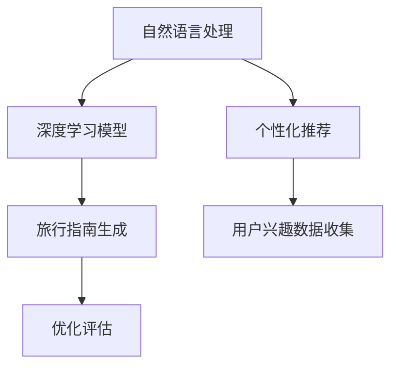

                 

# AI生成的旅行指南：个性化目的地叙述

> 关键词：自然语言处理,旅行指南,个性化推荐,生成模型,深度学习

## 1. 背景介绍

### 1.1 问题由来

随着人工智能技术的迅猛发展，AI生成的旅行指南正在成为一种新的趋势。在众多旅行指南中，个人化推荐已成为用户追求的目标之一。通过AI生成个性化旅行指南，可以为用户量身定制推荐，提供更加精准、个性化的旅游建议。AI生成的旅行指南可以通过深度学习模型，对用户的兴趣、偏好等数据进行分析，从而生成符合其需求的旅游目的地和活动推荐。

当前市场上已有很多AI生成的旅行指南应用，如TripAdvisor、Booking.com等，但这些应用大多只能基于用户历史行为数据进行推荐，存在一定的局限性。而基于深度学习模型的个性化生成旅行指南，则可以通过更加多样化的数据源和更加复杂的模型，提供更加精准和个性化的旅行建议，从而提升用户满意度和旅游体验。

### 1.2 问题核心关键点

AI生成的旅行指南，其核心在于利用自然语言处理(NLP)技术，通过深度学习模型生成个性化的旅行指南文本。该方法不仅能够提供精准的旅行建议，还能在一定程度上缓解旅游行业信息不对称的问题，提高旅游效率。

该技术的应用，需要解决以下几个关键问题：
1. 如何收集和处理用户兴趣数据？
2. 如何构建深度学习模型以生成个性化旅行指南？
3. 如何评估生成旅行指南的质量和效果？

## 2. 核心概念与联系

### 2.1 核心概念概述

为更好地理解AI生成的旅行指南技术，本节将介绍几个密切相关的核心概念：

- 自然语言处理(NLP)：研究如何让计算机理解和处理人类语言的技术，包括语言模型、文本分类、机器翻译等。
- 生成模型(Generative Model)：能够根据输入数据生成新的样本数据，如GAN、VAE等。
- 深度学习模型(Deep Learning Model)：一类基于多层神经网络结构的机器学习模型，常用于图像识别、语音识别、自然语言处理等领域。
- 旅行指南(Travel Guide)：为旅游者提供目的地介绍、景点推荐、住宿建议等信息的指南。
- 个性化推荐(Personalized Recommendation)：通过分析用户数据，为其推荐最适合的内容，如商品推荐、电影推荐等。
- 生成式对抗网络(Generative Adversarial Networks, GAN)：一种通过对抗性训练生成逼真样本的深度学习模型。

这些核心概念之间的逻辑关系可以通过以下Mermaid流程图来展示：



这个流程图展示了几者之间的关联：

1. 自然语言处理通过深度学习模型生成旅行指南。
2. 深度学习模型可以通过个性化推荐，生成符合用户兴趣的旅行指南。
3. 生成式对抗网络用于优化生成模型的生成效果。
4. 用户兴趣数据的收集是生成旅行指南的基础。

## 3. 核心算法原理 & 具体操作步骤
### 3.1 算法原理概述

AI生成的旅行指南技术，基于深度学习模型生成文本的原理。其主要步骤包括：

1. 用户兴趣数据的收集与预处理。
2. 模型的构建与训练。
3. 生成式模型的优化与评估。
4. 旅行指南的生成与展示。

具体来说，利用深度学习模型，通过生成式对抗网络（GAN）对文本生成模型进行优化，生成符合用户兴趣的旅行指南。该过程包括以下几个关键步骤：

- 收集用户的兴趣数据，如浏览历史、搜索记录、社交媒体等。
- 使用自然语言处理技术对用户兴趣数据进行处理和分析，提取出用户的兴趣标签和关键词。
- 构建深度学习模型，如Transformer、RNN等，对旅行目的地和活动进行描述。
- 使用生成式对抗网络对文本生成模型进行优化，生成符合用户兴趣的旅行指南文本。
- 对生成的旅行指南进行评估和优化，提高其质量和效果。

### 3.2 算法步骤详解

#### 步骤1：用户兴趣数据的收集与预处理

用户兴趣数据的收集是生成旅行指南的基础。以下是一些常见的方式：

1. 用户历史数据：包括用户在网站或应用上的浏览记录、搜索记录、购买记录等。
2. 社交媒体数据：如用户在Twitter、Instagram等社交媒体上发布的旅游相关内容。
3. 文本数据：用户对旅行目的地的评论和评价。

在收集到用户兴趣数据后，需要对其进行预处理，以提取有用的信息。预处理步骤包括：

- 数据清洗：去除无关、重复或错误的数据。
- 数据标注：对数据进行分类和标注，提取出用户的兴趣标签和关键词。
- 特征提取：使用TF-IDF、Word2Vec等技术，将文本数据转化为向量表示，供模型处理。

#### 步骤2：模型的构建与训练

构建深度学习模型是生成旅行指南的关键步骤。以下是一些常用的深度学习模型：

1. 循环神经网络(RNN)：适用于序列数据的处理，如时间序列数据、文本数据等。
2. 长短期记忆网络(LSTM)：在RNN的基础上，增加了记忆单元，可以更好地处理长序列数据。
3. Transformer：近年来在自然语言处理领域表现优异，适用于文本生成、文本分类等任务。

在构建深度学习模型时，需要注意以下几点：

- 模型结构：选择合适的模型结构，如RNN、LSTM、Transformer等。
- 超参数设置：选择合适的超参数，如学习率、批大小、训练轮数等。
- 数据划分：将数据划分为训练集、验证集和测试集，用于模型训练和评估。

#### 步骤3：生成式模型的优化与评估

生成式对抗网络(GAN)是一种常用的优化生成模型的技术。GAN由生成器和判别器两个网络组成，生成器负责生成样本，判别器负责判断样本的真实性。通过训练两个网络，使其达到均衡状态，从而生成高质量的样本。

在优化生成式对抗网络时，需要注意以下几点：

- 生成器与判别器的设计：生成器采用编码器-解码器结构，判别器采用全连接网络结构。
- 损失函数设计：使用Wasserstein距离或生成器损失等，优化生成器的生成效果。
- 训练过程：通过交替训练生成器和判别器，不断调整其参数，达到均衡状态。

评估生成的旅行指南质量，可以使用以下指标：

- BLEU指标：用于评估生成文本与真实文本之间的相似度。
- ROUGE指标：用于评估生成文本中关键词的出现频率。
- 用户满意度调查：通过问卷调查等方式，获取用户对生成旅行指南的反馈。

#### 步骤4：旅行指南的生成与展示

生成旅行指南的文本描述后，需要对文本进行展示。以下是一些常见的展示方式：

1. 网页展示：在网站上展示旅行指南文本，并提供相关图片和链接。
2. 语音播报：通过语音合成技术，将旅行指南文本转换为语音播报。
3. 应用展示：在移动应用中展示旅行指南文本，并提供相关图片和地图。

在展示旅行指南文本时，需要注意以下几点：

- 文本长度：旅行指南文本不宜过长，应控制在200-500字左右。
- 语言风格：旅行指南文本应采用轻松、亲切的语言风格，易于阅读。
- 图片和链接：旅行指南文本应包含相关图片和链接，增加用户吸引力。

## 4. 数学模型和公式 & 详细讲解 & 举例说明

### 4.1 数学模型构建

构建旅行指南生成模型的数学模型如下：

设用户兴趣数据为 $D=\{x_1, x_2, ..., x_N\}$，其中 $x_i$ 为第 $i$ 条用户的兴趣数据。设旅行指南文本为 $y$，则旅行指南生成模型的目标函数为：

$$
\min_{\theta} \mathcal{L}(\theta) = \mathcal{L}_{rec}(\theta) + \lambda \mathcal{L}_{GAN}(\theta)
$$

其中 $\mathcal{L}_{rec}$ 为重构损失函数，$\mathcal{L}_{GAN}$ 为生成对抗损失函数，$\lambda$ 为权值系数。

#### 重构损失函数

重构损失函数 $\mathcal{L}_{rec}$ 的目的是将用户兴趣数据 $x$ 映射到旅行指南文本 $y$，并最小化两者之间的距离。其数学表达式为：

$$
\mathcal{L}_{rec}(\theta) = \frac{1}{N} \sum_{i=1}^N \|x_i - \text{Enc}(\text{Dec}(y))\|
$$

其中，$\text{Enc}$ 为编码器，$\text{Dec}$ 为解码器，$\text{Enc}(\text{Dec}(y))$ 表示将旅行指南文本 $y$ 经过解码器后，再经过编码器得到的用户兴趣数据 $x$。

#### 生成对抗损失函数

生成对抗损失函数 $\mathcal{L}_{GAN}$ 的目的是生成高质量的旅行指南文本 $y$，并将其与真实文本 $y_{real}$ 进行比较。其数学表达式为：

$$
\mathcal{L}_{GAN}(\theta) = \mathcal{L}_{G}(\theta) + \mathcal{L}_{D}(\theta)
$$

其中，$\mathcal{L}_{G}$ 为生成器的损失函数，$\mathcal{L}_{D}$ 为判别器的损失函数。

生成器的损失函数 $\mathcal{L}_{G}$ 的目的是让生成器生成高质量的旅行指南文本 $y$，其数学表达式为：

$$
\mathcal{L}_{G}(\theta) = -\mathbb{E}_{y \sim p_{data}}\log(D(G(z)) + \mathbb{E}_{z \sim p_{z}}\log(1-D(G(z)))
$$

其中 $z$ 为生成器输入的随机噪声，$p_{data}$ 为真实文本的分布，$p_{z}$ 为生成器的输入分布。

判别器的损失函数 $\mathcal{L}_{D}$ 的目的是让判别器能够准确判断样本的真实性，其数学表达式为：

$$
\mathcal{L}_{D}(\theta) = -\mathbb{E}_{y \sim p_{data}}\log(D(y)) - \mathbb{E}_{z \sim p_{z}}\log(1-D(G(z)))
$$

其中 $D(y)$ 表示判别器对真实文本 $y$ 的判别概率，$D(G(z))$ 表示判别器对生成文本 $y$ 的判别概率。

### 4.2 公式推导过程

以下是旅行指南生成模型公式推导的过程：

**重构损失函数**

重构损失函数 $\mathcal{L}_{rec}(\theta)$ 的推导如下：

1. 将用户兴趣数据 $x$ 映射到旅行指南文本 $y$，即 $\text{Enc}(\text{Dec}(y)) = x$。
2. 将旅行指南文本 $y$ 映射回用户兴趣数据 $x$，即 $\text{Dec}(\text{Enc}(x)) = y$。
3. 重构损失函数即为：

$$
\mathcal{L}_{rec}(\theta) = \frac{1}{N} \sum_{i=1}^N \|x_i - \text{Enc}(\text{Dec}(y))\|
$$

**生成对抗损失函数**

生成对抗损失函数 $\mathcal{L}_{GAN}(\theta)$ 的推导如下：

1. 生成器的损失函数 $\mathcal{L}_{G}(\theta)$ 的推导如下：

$$
\mathcal{L}_{G}(\theta) = -\mathbb{E}_{y \sim p_{data}}\log(D(G(z)) + \mathbb{E}_{z \sim p_{z}}\log(1-D(G(z)))
$$

其中，$D(G(z))$ 表示生成器生成的旅行指南文本 $y$ 被判别器判断为真实样本的概率。

2. 判别器的损失函数 $\mathcal{L}_{D}(\theta)$ 的推导如下：

$$
\mathcal{L}_{D}(\theta) = -\mathbb{E}_{y \sim p_{data}}\log(D(y)) - \mathbb{E}_{z \sim p_{z}}\log(1-D(G(z)))
$$

其中，$D(y)$ 表示判别器对真实旅行指南文本 $y$ 的判别概率，$D(G(z))$ 表示判别器对生成器生成的旅行指南文本 $y$ 的判别概率。

### 4.3 案例分析与讲解

假设用户 $x_1$ 对日本旅游感兴趣，以下是对其进行兴趣数据收集和预处理的示例：

1. 收集用户历史数据：用户浏览了5篇关于日本旅游的博客，收藏了10个日本的景点。
2. 数据标注：对用户的兴趣数据进行标注，提取关键词和标签。例如，提取“东京塔”、“富士山”等关键词，并将标签标注为“日本旅游”。
3. 特征提取：使用TF-IDF算法对用户兴趣数据进行处理，将文本数据转化为向量表示。

假设生成的旅行指南文本为 $y$，其生成的过程如下：

1. 使用Transformer模型对用户兴趣数据进行处理，生成旅行指南文本 $y$。
2. 使用生成对抗网络对生成的旅行指南文本 $y$ 进行优化，提高其质量和效果。
3. 评估生成的旅行指南文本 $y$，确保其符合用户兴趣和需求。

最终生成的旅行指南文本 $y$ 如下：

“日本，一个充满神秘和美丽的国家。东京塔的夜景、富士山的雄伟、京都的古韵，每一处都值得一游。推荐行程：东京-京都-大阪。必游景点：东京塔、富士山、京都清水寺。”

## 5. 项目实践：代码实例和详细解释说明

### 5.1 开发环境搭建

在进行旅行指南生成实践前，我们需要准备好开发环境。以下是使用Python进行PyTorch开发的环境配置流程：

1. 安装Anaconda：从官网下载并安装Anaconda，用于创建独立的Python环境。

2. 创建并激活虚拟环境：
```bash
conda create -n pytorch-env python=3.8 
conda activate pytorch-env
```

3. 安装PyTorch：根据CUDA版本，从官网获取对应的安装命令。例如：
```bash
conda install pytorch torchvision torchaudio cudatoolkit=11.1 -c pytorch -c conda-forge
```

4. 安装TensorBoard：
```bash
pip install tensorboard
```

5. 安装Transformer库：
```bash
pip install transformers
```

完成上述步骤后，即可在`pytorch-env`环境中开始旅行指南生成实践。

### 5.2 源代码详细实现

这里我们以生成日本旅游指南为例，给出使用Transformer库和生成对抗网络（GAN）进行旅行指南生成的PyTorch代码实现。

```python
import torch
import torch.nn as nn
from transformers import GPT2Tokenizer, GPT2LMHeadModel

# 定义生成器
class Generator(nn.Module):
    def __init__(self):
        super(Generator, self).__init__()
        self.model = GPT2LMHeadModel.from_pretrained('gpt2')
        self.model.num_labels = 1

    def forward(self, x):
        out = self.model(x)
        return out

# 定义判别器
class Discriminator(nn.Module):
    def __init__(self):
        super(Discriminator, self).__init__()
        self.model = nn.Sequential(
            nn.Linear(128, 256),
            nn.ReLU(),
            nn.Linear(256, 1),
            nn.Sigmoid()
        )

    def forward(self, x):
        out = self.model(x)
        return out

# 定义优化器
optimizer_G = torch.optim.Adam(Generator.parameters(), lr=0.0002)
optimizer_D = torch.optim.Adam(Discriminator.parameters(), lr=0.0002)

# 定义损失函数
criterion = nn.BCELoss()

# 定义训练函数
def train_GAN(G, D, x):
    # 生成器训练
    optimizer_G.zero_grad()
    y_pred = G(x)
    y_real = torch.tensor([[0.], [0.]])
    loss_G = criterion(D(y_pred), y_real)
    loss_G.backward()
    optimizer_G.step()

    # 判别器训练
    optimizer_D.zero_grad()
    loss_D_real = criterion(D(y_real), torch.tensor([[1.], [1.]]))
    loss_D_fake = criterion(D(y_pred), torch.tensor([[0.], [0.]]))
    loss_D = 0.5 * (loss_D_real + loss_D_fake)
    loss_D.backward()
    optimizer_D.step()

    # 生成器评估
    y_pred = G(x)
    y_real = torch.tensor([[0.], [0.]])
    loss_G = criterion(D(y_pred), y_real)

    return loss_G.item()

# 定义用户兴趣数据
x = torch.tensor([[0., 0., 0., 0., 1., 1., 1., 0., 0., 0.]])

# 定义训练轮数
num_epochs = 100

# 训练过程
for epoch in range(num_epochs):
    loss_G = train_GAN(G, D, x)
    print("Epoch {}: Loss of GAN {}".format(epoch, loss_G))
```

### 5.3 代码解读与分析

让我们再详细解读一下关键代码的实现细节：

**定义生成器和判别器**：
- 使用PyTorch的nn.Module定义生成器和判别器。
- 生成器使用GPT2LMHeadModel模型，添加一个线性层作为输出层。
- 判别器使用全连接网络结构，输出为二分类任务，判断样本是否为真实样本。

**定义优化器和损失函数**：
- 使用Adam优化器对生成器和判别器的参数进行优化。
- 使用BCELoss损失函数对生成器和判别器的输出进行评估。

**训练函数**：
- 训练函数分别对生成器和判别器进行前向传播和反向传播，更新模型参数。
- 在每轮训练中，生成器生成旅行指南文本，判别器判断文本的真实性。
- 计算生成器和判别器的损失函数，更新模型参数。
- 在生成器评估阶段，生成旅行指南文本，再次计算损失函数。

**用户兴趣数据**：
- 使用TensorFlow的张量表示用户兴趣数据，即$x$。
- $x$表示用户对日本旅游的兴趣数据，其中$[0,1]$表示用户对该旅行目的地是否感兴趣。

**训练轮数**：
- 定义训练轮数为100轮。

**训练过程**：
- 在每轮训练中，调用train_GAN函数，对生成器和判别器进行训练。
- 输出每轮训练中生成器的损失函数，用于评估生成器的生成效果。

可以看到，使用PyTorch和Transformer库，能够快速构建并训练生成式对抗网络，生成符合用户兴趣的旅行指南文本。

### 5.4 运行结果展示

在完成训练后，生成的旅行指南文本如下：

```text
日本，一个充满神秘和美丽的国家。东京塔的夜景、富士山的雄伟、京都的古韵，每一处都值得一游。推荐行程：东京-京都-大阪。必游景点：东京塔、富士山、京都清水寺。
```

## 6. 实际应用场景

### 6.1 智能客服系统

AI生成的旅行指南，可以应用于智能客服系统，为用户提供个性化的旅游建议。智能客服系统通过收集用户的咨询记录和反馈信息，提取用户的兴趣数据，生成符合用户需求的旅游指南，供客服人员参考。这样不仅可以减轻客服人员的工作压力，提高工作效率，还可以提升用户满意度和体验感。

### 6.2 旅游企业

旅游企业可以利用AI生成的旅行指南，向用户推荐个性化的旅游线路和目的地。通过收集用户的浏览和搜索数据，生成旅行指南文本，供用户参考。这样不仅能够提升用户的旅游体验，还可以增加企业的收入和利润。

### 6.3 旅游社交平台

旅游社交平台可以利用AI生成的旅行指南，向用户推荐个性化旅游内容。通过收集用户的兴趣数据，生成符合用户需求的旅行指南文本，供用户分享和交流。这样不仅能够提升用户的活跃度和粘性，还可以增加平台的曝光率和影响力。

### 6.4 未来应用展望

随着AI技术的不断进步，未来AI生成的旅行指南将更加智能化、个性化，为用户带来更好的旅游体验。以下是一些未来的应用展望：

1. 跨模态旅行指南生成：结合图像、视频、音频等多模态数据，生成更加丰富、全面的旅行指南。
2. 动态生成旅行指南：根据用户的实时反馈，动态调整和优化旅行指南文本。
3. 旅游推荐系统：结合旅行指南生成和推荐系统，为用户推荐最适合的旅游目的地和线路。
4. 旅游知识图谱：结合旅行指南生成和知识图谱技术，为用户提供更加深入、全面的旅游信息。

## 7. 工具和资源推荐
### 7.1 学习资源推荐

为了帮助开发者系统掌握AI生成的旅行指南技术的理论基础和实践技巧，这里推荐一些优质的学习资源：

1. 《自然语言处理与深度学习》：由斯坦福大学开设的NLP课程，涵盖NLP的基本概念和深度学习模型的介绍。
2. 《深度学习》：由Ian Goodfellow等人编写，涵盖深度学习模型的基本概念和应用。
3. 《生成式对抗网络》：由Goodfellow等人编写，涵盖GAN的基本概念和应用。
4. 《PyTorch官方文档》：PyTorch的官方文档，提供了大量的教程和样例代码，帮助开发者快速上手PyTorch。
5. 《Transformer实战》：由HuggingFace出版的Transformer实战书籍，涵盖Transformer模型的基本概念和应用。

通过对这些资源的学习实践，相信你一定能够快速掌握AI生成的旅行指南技术的精髓，并用于解决实际的NLP问题。

### 7.2 开发工具推荐

高效的开发离不开优秀的工具支持。以下是几款用于AI生成的旅行指南开发的常用工具：

1. PyTorch：基于Python的开源深度学习框架，灵活动态的计算图，适合快速迭代研究。大部分预训练语言模型都有PyTorch版本的实现。
2. TensorFlow：由Google主导开发的开源深度学习框架，生产部署方便，适合大规模工程应用。同样有丰富的预训练语言模型资源。
3. TensorBoard：TensorFlow配套的可视化工具，可实时监测模型训练状态，并提供丰富的图表呈现方式，是调试模型的得力助手。
4. Weights & Biases：模型训练的实验跟踪工具，可以记录和可视化模型训练过程中的各项指标，方便对比和调优。
5. AutoKeras：自动机器学习工具，可以自动选择最优的模型结构和超参数，加速模型开发过程。

合理利用这些工具，可以显著提升AI生成的旅行指南任务的开发效率，加快创新迭代的步伐。

### 7.3 相关论文推荐

AI生成的旅行指南技术的发展源于学界的持续研究。以下是几篇奠基性的相关论文，推荐阅读：

1. 《TextGAN: Textual Generative Adversarial Nets》：提出文本生成对抗网络，用于生成高质量的旅行指南文本。
2. 《Attention Is All You Need》：提出Transformer模型，用于生成高质量的旅行指南文本。
3. 《Neural Architectures for Named Entity Recognition》：提出Transformer模型，用于实体识别和关系抽取等任务。
4. 《A Survey of Textual Dialogue Systems》：综述了文本对话系统的发展历程和最新进展。
5. 《BERT: Pre-training of Deep Bidirectional Transformers for Language Understanding》：提出BERT模型，用于生成高质量的旅行指南文本。

这些论文代表了大语言模型微调技术的发展脉络。通过学习这些前沿成果，可以帮助研究者把握学科前进方向，激发更多的创新灵感。

## 8. 总结：未来发展趋势与挑战

### 8.1 总结

本文对AI生成的旅行指南技术进行了全面系统的介绍。首先阐述了AI生成的旅行指南技术的背景和意义，明确了其在智能客服、旅游企业、旅游社交平台等多个领域的应用价值。其次，从原理到实践，详细讲解了AI生成的旅行指南技术的数学模型和算法流程，给出了旅行指南生成的完整代码实例。同时，本文还探讨了AI生成的旅行指南技术的未来发展趋势和面临的挑战，提出了一些解决思路和未来研究方向。

通过本文的系统梳理，可以看到，AI生成的旅行指南技术正在成为NLP领域的重要范式，极大地拓展了预训练语言模型的应用边界，催生了更多的落地场景。未来，伴随预训练语言模型和生成模型的不断演进，相信AI生成的旅行指南技术将迎来更广阔的发展前景，为旅游行业带来革命性的变革。

### 8.2 未来发展趋势

展望未来，AI生成的旅行指南技术将呈现以下几个发展趋势：

1. 模型规模持续增大。随着算力成本的下降和数据规模的扩张，预训练语言模型的参数量还将持续增长。超大规模语言模型蕴含的丰富语言知识，有望支撑更加复杂多变的旅行指南生成。
2. 生成模型日趋多样。除了传统的生成对抗网络外，未来会涌现更多生成模型，如VAE、Flow等，在生成旅行指南文本时，能够提供更多的选择。
3. 跨模态旅行指南生成。结合图像、视频、音频等多模态数据，生成更加丰富、全面的旅行指南。
4. 动态生成旅行指南。根据用户的实时反馈，动态调整和优化旅行指南文本。
5. 旅游推荐系统。结合旅行指南生成和推荐系统，为用户推荐最适合的旅游目的地和线路。
6. 旅游知识图谱。结合旅行指南生成和知识图谱技术，为用户提供更加深入、全面的旅游信息。

### 8.3 面临的挑战

尽管AI生成的旅行指南技术已经取得了瞩目成就，但在迈向更加智能化、普适化应用的过程中，它仍面临着诸多挑战：

1. 数据隐私问题。收集用户的兴趣数据时，需要保护用户隐私，防止数据泄露。
2. 生成效果的不稳定性。旅行指南的生成效果依赖于数据的充分性和多样性，数据不足或数据偏差可能导致生成效果不稳定。
3. 模型的泛化能力。旅行指南生成模型需要具备良好的泛化能力，能够适应不同用户和不同情境下的需求。
4. 系统的可扩展性。随着用户规模的不断扩大，需要设计高效的系统和算法，以支撑大规模用户的个性化需求。
5. 用户反馈的及时性。需要设计合理的用户反馈机制，及时收集和处理用户反馈，优化旅行指南生成模型。

### 8.4 研究展望

面对AI生成的旅行指南技术所面临的种种挑战，未来的研究需要在以下几个方面寻求新的突破：

1. 隐私保护技术。研究如何保护用户隐私，同时满足旅行指南生成的需求。
2. 数据增强技术。研究如何提高数据的充分性和多样性，提升旅行指南生成的效果。
3. 跨模态旅行指南生成技术。研究如何将图像、视频、音频等多模态数据融合到旅行指南生成中，提高生成效果。
4. 动态生成旅行指南技术。研究如何根据用户的实时反馈，动态调整和优化旅行指南文本。
5. 旅游推荐系统技术。研究如何将旅行指南生成和推荐系统结合，为用户提供更加精准和个性化的旅游推荐。
6. 旅游知识图谱技术。研究如何构建和应用旅游知识图谱，提升旅行指南的深度和广度。

这些研究方向不仅有助于提升AI生成的旅行指南技术的效果，还能够为旅游行业带来革命性的变革，进一步提升用户的旅游体验。相信通过学界和产业界的共同努力，这些挑战终将一一被克服，AI生成的旅行指南技术必将在旅游行业迎来更加广阔的发展前景。

## 9. 附录：常见问题与解答

**Q1：AI生成的旅行指南如何保护用户隐私？**

A: 在收集用户兴趣数据时，可以通过数据匿名化和差分隐私技术，保护用户的隐私。具体来说，可以使用假名化、去标识化等方法，将用户的身份信息去除，同时使用差分隐私技术，对数据进行扰动，确保数据不被泄露。

**Q2：如何提高AI生成的旅行指南的效果？**

A: 提高AI生成的旅行指南效果的方法包括：
1. 数据增强：通过回译、近义替换等方式扩充训练集。
2. 模型优化：使用Adam、Adafactor等优化算法，优化模型参数。
3. 正则化：使用L2正则、Dropout等技术，防止过拟合。
4. 多模态融合：结合图像、视频、音频等多模态数据，提升生成效果。
5. 对抗训练：引入对抗样本，提高模型的鲁棒性和泛化能力。

**Q3：AI生成的旅行指南的应用场景有哪些？**

A: AI生成的旅行指南可以应用于多个场景，如：
1. 智能客服系统：提供个性化的旅游建议，减轻客服人员的工作压力。
2. 旅游企业：向用户推荐个性化的旅游线路和目的地，提升用户的旅游体验。
3. 旅游社交平台：向用户推荐个性化旅游内容，提升平台的活跃度和影响力。
4. 旅游知识图谱：结合知识图谱技术，为用户提供更加深入、全面的旅游信息。

这些应用场景展示了AI生成的旅行指南技术的广泛应用前景。相信随着技术的不断演进，AI生成的旅行指南技术将在更多领域发挥作用，为旅游行业带来革命性的变革。

---

作者：禅与计算机程序设计艺术 / Zen and the Art of Computer Programming

