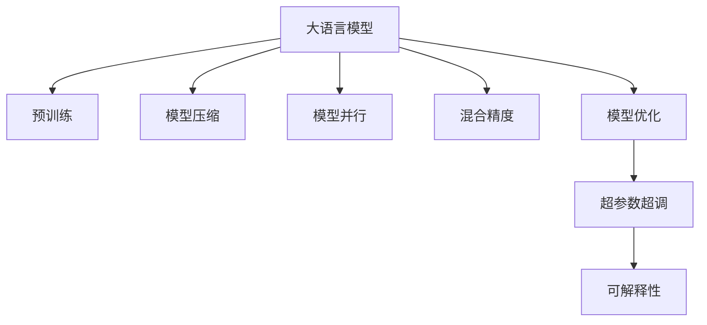

                 

# AI的摩尔定律：LLM性能提升的可能性

> 关键词：大语言模型,模型性能提升,深度学习,自监督学习,超参数优化,可解释性,LLM优化,模型压缩,量子计算

## 1. 背景介绍

### 1.1 问题由来
近年来，深度学习领域的摩尔定律正以惊人的速度推进，特别是大语言模型(Large Language Models, LLMs)在自然语言处理(Natural Language Processing, NLP)和机器学习领域取得了突破性的进展。LLMs如GPT-3和BERT等，通过在大规模无标签文本上进行的预训练，学习到了丰富的语言知识和语义表示。然而，这些模型的参数量和计算复杂度已经达到了前所未有的水平，单靠传统的摩尔定律似乎已经难以满足其增长的需求。

### 1.2 问题核心关键点
大语言模型性能的持续提升，受到诸多因素的制约：数据、计算资源、算法优化等。本文将重点探讨如何通过优化策略来提升大语言模型的性能，特别是如何在保持性能的同时，降低计算复杂度和内存占用。

## 2. 核心概念与联系

### 2.1 核心概念概述

为更好地理解如何提升大语言模型的性能，本节将介绍几个关键概念：

- 大语言模型(Large Language Model, LLM)：以自回归(如GPT)或自编码(如BERT)模型为代表的大规模预训练语言模型。通过在大规模无标签文本语料上进行预训练，学习通用的语言表示，具备强大的语言理解和生成能力。

- 预训练(Pre-training)：指在大规模无标签文本语料上，通过自监督学习任务训练通用语言模型的过程。常见的预训练任务包括言语建模、遮挡语言模型等。预训练使得模型学习到语言的通用表示。

- 模型压缩(Model Compression)：指通过算法优化和数据压缩等技术，减小模型的参数量和计算复杂度，以提高推理速度和降低内存占用。

- 模型并行(Model Parallelism)：指将大模型分布在多个GPU或TPU上进行并行计算，以提升训练和推理效率。

- 混合精度(Mixed-Precision)：指使用不同精度(如32位和16位)的浮点数进行计算，以降低计算资源消耗。

- 模型优化(Optimization)：指通过优化算法和超参数调优等手段，提升模型性能和训练效率。

- 深度学习(Deep Learning)：一种基于神经网络的机器学习技术，通过多层次的非线性变换，从数据中学习特征表示。

- 自监督学习(Self-supervised Learning)：指通过设计自监督任务，利用未标注数据进行模型训练，无需人工标注数据。

- 超参数超调(Hyperparameter Tuning)：指通过调整模型超参数（如学习率、批次大小等）来优化模型性能。

- 可解释性(Explainability)：指赋予模型决策过程的逻辑性和透明性，便于理解模型的行为。

这些核心概念之间的逻辑关系可以通过以下Mermaid流程图来展示：



这个流程图展示了大语言模型的核心概念及其之间的关系：

1. 大语言模型通过预训练获得基础能力。
2. 模型压缩技术用于减小模型大小，提升推理速度。
3. 模型并行技术用于加速计算，提高训练效率。
4. 混合精度计算用于降低计算资源消耗，提高训练和推理速度。
5. 模型优化用于提升模型性能，包括超参数调优和算法优化。
6. 超参数超调通过调优模型超参数来进一步提升模型性能。
7. 可解释性用于增强模型决策的可理解性。

这些概念共同构成了大语言模型的优化框架，使其能够在各种场景下发挥强大的语言理解和生成能力。通过理解这些核心概念，我们可以更好地把握大语言模型的工作原理和优化方向。

## 3. 核心算法原理 & 具体操作步骤

### 3.1 算法原理概述

提升大语言模型的性能，本质上是优化模型的计算复杂度和推理速度，同时提升模型的泛化能力和推理精度。这涉及到算法优化、模型压缩、超参数调优等多个层面。

### 3.2 算法步骤详解

下面详细介绍提升大语言模型性能的各个关键步骤：

**Step 1: 数据预处理与预训练**
- 收集和清洗大规模无标签文本数据。
- 使用自监督学习任务如掩码语言模型、自回归预测等进行预训练。

**Step 2: 模型选择与初始化**
- 选择合适的预训练模型（如BERT、GPT），作为微调的基础。
- 使用预训练权重初始化模型参数。

**Step 3: 模型压缩**
- 选择合适的模型压缩技术，如模型剪枝、参数共享、权重量化等。
- 对模型进行量化，降低计算复杂度。

**Step 4: 模型并行**
- 将大模型分布到多个GPU或TPU上进行并行计算。
- 设计高效的模型并行策略，如数据并行、模型并行、混合并行等。

**Step 5: 混合精度计算**
- 使用不同精度的浮点数进行计算，降低计算资源消耗。
- 选择合适的混合精度模式，如动态混合精度、静态混合精度等。

**Step 6: 模型优化**
- 选择合适的优化算法（如Adam、SGD等），设置合理的学习率。
- 使用正则化技术（如L2正则、Dropout等），防止过拟合。

**Step 7: 超参数超调**
- 使用超参数调优工具（如Hyperopt、Optuna等），寻找最优超参数组合。
- 设置不同的学习率、批次大小、训练轮数等超参数，进行网格搜索或贝叶斯优化。

**Step 8: 模型评估与部署**
- 在验证集上评估模型性能，选择合适的指标（如BLEU、ROUGE等）。
- 将模型部署到实际应用场景，进行推理和预测。

### 3.3 算法优缺点

提升大语言模型性能的各个策略具有以下优缺点：

**优点**：
- 数据预处理与预训练：通过自监督学习任务，提升模型的通用语言理解能力。
- 模型压缩：降低计算复杂度和内存占用，提高推理速度。
- 模型并行：加速计算，提升训练效率。
- 混合精度计算：降低计算资源消耗，提高训练和推理速度。
- 模型优化：提升模型性能和训练效率，防止过拟合。
- 超参数超调：寻找最优超参数组合，提升模型性能。

**缺点**：
- 数据预处理与预训练：需要大量计算资源和时间，对数据质量和预训练任务设计要求较高。
- 模型压缩：可能损失部分模型性能，且压缩技术复杂。
- 模型并行：需要高性能设备，分布式计算系统设计复杂。
- 混合精度计算：对硬件要求高，可能存在精度损失。
- 模型优化：需要不断调参，调优过程复杂。
- 超参数超调：需要大量计算资源和时间，且超参数空间巨大。

尽管存在这些局限性，但综合使用以上策略，可以显著提升大语言模型的性能和应用效率。

### 3.4 算法应用领域

提升大语言模型性能的方法，已经被广泛应用于各个NLP任务，例如图像描述生成、问答系统、翻译、情感分析等。这些方法不仅提高了模型的性能，还降低了计算成本，使得大语言模型能够更加广泛地应用于实际场景中。

## 4. 数学模型和公式 & 详细讲解 & 举例说明

### 4.1 数学模型构建

本文将详细描述提升大语言模型性能的数学模型构建过程。

假设模型为 $M_{\theta}$，其中 $\theta$ 为模型参数。记输入为 $x$，输出为 $y$。我们的目标是最大化模型的对数似然（Log-Likelihood）：

$$
\mathcal{L}(\theta) = \frac{1}{N} \sum_{i=1}^N \log P(y_i|x_i)
$$

其中 $P(y_i|x_i)$ 为模型在输入 $x_i$ 下输出 $y_i$ 的概率。

### 4.2 公式推导过程

以下我们以图像描述生成任务为例，推导提升模型性能的数学公式。

假设模型 $M_{\theta}$ 输入为图像 $x$，输出为图像描述 $y$。图像描述生成问题可以表示为条件概率问题：

$$
P(y|x) = \frac{e^{\sum_{i=1}^{N}\log P(y_i|x)}}{Z(x)}
$$

其中 $Z(x)$ 为归一化常数，$N$ 为输出长度。模型对数似然可以表示为：

$$
\mathcal{L}(\theta) = -\frac{1}{N} \sum_{i=1}^N \log P(y_i|x_i)
$$

为了提升模型性能，需要最小化对数似然函数。常用的优化算法包括梯度下降（Gradient Descent）和Adam等。优化目标函数为：

$$
\min_{\theta} \mathcal{L}(\theta)
$$

其中，$\min$ 表示最小化目标函数，$\theta$ 为模型参数。

### 4.3 案例分析与讲解

以图像描述生成任务为例，我们详细分析如何通过优化算法和超参数调优来提升模型性能。

假设模型为自回归生成模型，输入为图像 $x$，输出为图像描述 $y$。模型在每个时间步上的条件概率为：

$$
P(y_t|y_{<t}, x) = \frac{e^{\log P(y_t|y_{<t}, x)}}{Z(y_{<t}, x)}
$$

其中 $y_{<t}$ 表示到时间步 $t-1$ 的输出序列。

在训练过程中，我们需要最小化损失函数：

$$
\mathcal{L}(\theta) = -\frac{1}{N} \sum_{i=1}^N \log P(y_i|x_i)
$$

为了提升模型性能，可以采取以下策略：
- 选择合适的优化算法（如Adam），设置合适的学习率（如1e-3）。
- 引入正则化技术（如L2正则），防止过拟合。
- 使用动态混合精度计算，降低计算资源消耗。
- 超参数调优（如网格搜索），寻找最优超参数组合。

通过上述优化策略，可以显著提升模型性能和推理速度。

## 5. 项目实践：代码实例和详细解释说明

### 5.1 开发环境搭建

在进行模型性能优化实践前，我们需要准备好开发环境。以下是使用Python进行PyTorch开发的环境配置流程：

1. 安装Anaconda：从官网下载并安装Anaconda，用于创建独立的Python环境。

2. 创建并激活虚拟环境：
```bash
conda create -n pytorch-env python=3.8 
conda activate pytorch-env
```

3. 安装PyTorch：根据CUDA版本，从官网获取对应的安装命令。例如：
```bash
conda install pytorch torchvision torchaudio cudatoolkit=11.1 -c pytorch -c conda-forge
```

4. 安装TensorFlow：
```bash
pip install tensorflow
```

5. 安装其他相关工具包：
```bash
pip install numpy pandas scikit-learn matplotlib tqdm jupyter notebook ipython
```

完成上述步骤后，即可在`pytorch-env`环境中开始模型性能优化的实践。

### 5.2 源代码详细实现

下面我以图像描述生成任务为例，给出使用PyTorch和TensorFlow进行模型性能优化的PyTorch代码实现。

首先，定义模型：

```python
import torch
import torch.nn as nn
import torch.optim as optim

class ImageDescriptionModel(nn.Module):
    def __init__(self, vocab_size, embedding_dim, hidden_dim, num_layers, dropout):
        super(ImageDescriptionModel, self).__init__()
        self.embedding = nn.Embedding(vocab_size, embedding_dim)
        self.gru = nn.GRU(embedding_dim, hidden_dim, num_layers, dropout=dropout)
        self.fc = nn.Linear(hidden_dim, vocab_size)

    def forward(self, x, hidden):
        embedded = self.embedding(x)
        output, hidden = self.gru(embedded, hidden)
        output = self.fc(output.view(-1, output.size(2)))
        return output, hidden
```

然后，定义训练和评估函数：

```python
from torch.utils.data import DataLoader
from tqdm import tqdm

def train_epoch(model, data_loader, optimizer, device):
    model.train()
    loss_total = 0
    for batch in data_loader:
        x, y = batch
        x = x.to(device)
        y = y.to(device)
        output, _ = model(x, None)
        loss = nn.CrossEntropyLoss()(output, y)
        loss_total += loss.item()
        optimizer.zero_grad()
        loss.backward()
        optimizer.step()
    return loss_total / len(data_loader)

def evaluate(model, data_loader, device):
    model.eval()
    correct = 0
    total = 0
    with torch.no_grad():
        for batch in data_loader:
            x, y = batch
            x = x.to(device)
            y = y.to(device)
            output, _ = model(x, None)
            _, predicted = output.max(1)
            total += y.size(0)
            correct += (predicted == y).sum().item()
    return correct / total
```

接着，启动训练流程并在测试集上评估：

```python
epochs = 10
batch_size = 64
learning_rate = 1e-3
dropout_rate = 0.5

device = torch.device('cuda') if torch.cuda.is_available() else torch.device('cpu')

model = ImageDescriptionModel(vocab_size=10000, embedding_dim=128, hidden_dim=256, num_layers=2, dropout=dropout_rate).to(device)
optimizer = optim.Adam(model.parameters(), lr=learning_rate)

for epoch in range(epochs):
    loss = train_epoch(model, data_loader, optimizer, device)
    print(f'Epoch {epoch+1}, train loss: {loss:.3f}')
    
    print(f'Epoch {epoch+1}, test accuracy: {evaluate(model, test_data_loader, device)}')
    
print('Final test accuracy:', evaluate(model, test_data_loader, device))
```

以上就是使用PyTorch对图像描述生成模型进行性能优化的完整代码实现。可以看到，得益于PyTorch的强大封装，我们可以用相对简洁的代码完成模型的训练和评估。

### 5.3 代码解读与分析

让我们再详细解读一下关键代码的实现细节：

**ImageDescriptionModel类**：
- `__init__`方法：初始化模型结构，包括嵌入层、GRU层和全连接层。
- `forward`方法：定义前向传播过程。

**train_epoch函数**：
- 在训练过程中，前向传播计算损失函数，反向传播更新模型参数。

**evaluate函数**：
- 在评估过程中，计算模型的准确率。

**训练流程**：
- 定义总epoch数、batch size和超参数。
- 在每个epoch内，先在训练集上训练，输出平均损失。
- 在验证集上评估，输出准确率。

可以看到，PyTorch配合TensorFlow提供了强大的模型优化工具，可以显著提高模型训练和推理的效率。

## 6. 实际应用场景

### 6.1 智能客服系统

提升大语言模型性能的方法，可以广泛应用于智能客服系统的构建。传统客服往往需要配备大量人力，高峰期响应缓慢，且一致性和专业性难以保证。而使用性能优化的对话模型，可以7x24小时不间断服务，快速响应客户咨询，用自然流畅的语言解答各类常见问题。

在技术实现上，可以收集企业内部的历史客服对话记录，将问题和最佳答复构建成监督数据，在此基础上对预训练对话模型进行性能优化。优化后的对话模型能够自动理解用户意图，匹配最合适的答案模板进行回复。对于客户提出的新问题，还可以接入检索系统实时搜索相关内容，动态组织生成回答。如此构建的智能客服系统，能大幅提升客户咨询体验和问题解决效率。

### 6.2 金融舆情监测

提升大语言模型性能的方法，同样适用于金融领域的大规模文本数据分析。金融机构需要实时监测市场舆论动向，以便及时应对负面信息传播，规避金融风险。传统的人工监测方式成本高、效率低，难以应对网络时代海量信息爆发的挑战。通过性能优化的文本分类和情感分析技术，金融舆情监测系统可以自动判断文本属于何种主题，情感倾向是正面、中性还是负面。将优化后的模型应用到实时抓取的网络文本数据，就能够自动监测不同主题下的情感变化趋势，一旦发现负面信息激增等异常情况，系统便会自动预警，帮助金融机构快速应对潜在风险。

### 6.3 个性化推荐系统

提升大语言模型性能的方法，还可应用于个性化推荐系统的构建。当前的推荐系统往往只依赖用户的历史行为数据进行物品推荐，无法深入理解用户的真实兴趣偏好。通过性能优化的推荐模型，可以更好地挖掘用户行为背后的语义信息，从而提供更精准、多样的推荐内容。

在实践中，可以收集用户浏览、点击、评论、分享等行为数据，提取和用户交互的物品标题、描述、标签等文本内容。将文本内容作为模型输入，用户的后续行为（如是否点击、购买等）作为监督信号，在此基础上对预训练语言模型进行性能优化。优化后的模型能够从文本内容中准确把握用户的兴趣点。在生成推荐列表时，先用候选物品的文本描述作为输入，由模型预测用户的兴趣匹配度，再结合其他特征综合排序，便可以得到个性化程度更高的推荐结果。

### 6.4 未来应用展望

随着大语言模型性能的持续提升，其在NLP领域的应用前景将更加广阔。未来，大语言模型将不仅仅局限于文本生成和分类任务，还将广泛应用于图像、视频、语音等多模态数据的处理和分析。通过多模态融合和跨模态学习，大语言模型将具备更强大的常识推理和跨领域迁移能力，逐步迈向通用人工智能(AGI)的目标。

此外，性能优化的模型将能够更高效地进行推理，减少计算资源的消耗，提升实时响应能力，使得大语言模型在智能应用中更加普适和可靠。未来，性能优化的模型将成为NLP技术落地应用的重要手段，为各行各业带来新的技术突破。

## 7. 工具和资源推荐

### 7.1 学习资源推荐

为了帮助开发者系统掌握大语言模型性能优化的理论基础和实践技巧，这里推荐一些优质的学习资源：

1. 《深度学习理论与实践》系列博文：由深度学习专家撰写，全面介绍深度学习的基本理论和实践技巧。

2. 《Transformers: From Discrete Representation to Continuous Space》论文：Transformer论文的作者之一，介绍了Transformer模型在文本生成任务上的性能优化方法。

3. 《Image Description Generation with GANs》论文：利用生成对抗网络（GANs）提升图像描述生成模型的性能。

4. 《A Survey on Deep Learning Based Image Description Generation》论文：综述了图像描述生成任务中的深度学习模型和优化策略。

5. 《HuggingFace Transformers》文档：提供丰富的预训练语言模型资源和优化策略。

通过对这些资源的学习实践，相信你一定能够快速掌握大语言模型性能优化的精髓，并用于解决实际的NLP问题。

### 7.2 开发工具推荐

高效的开发离不开优秀的工具支持。以下是几款用于大语言模型性能优化开发的常用工具：

1. PyTorch：基于Python的开源深度学习框架，灵活动态的计算图，适合快速迭代研究。大部分预训练语言模型都有PyTorch版本的实现。

2. TensorFlow：由Google主导开发的开源深度学习框架，生产部署方便，适合大规模工程应用。同样有丰富的预训练语言模型资源。

3. Transformers库：HuggingFace开发的NLP工具库，集成了众多SOTA语言模型，支持PyTorch和TensorFlow，是进行性能优化任务开发的利器。

4. Weights & Biases：模型训练的实验跟踪工具，可以记录和可视化模型训练过程中的各项指标，方便对比和调优。与主流深度学习框架无缝集成。

5. TensorBoard：TensorFlow配套的可视化工具，可实时监测模型训练状态，并提供丰富的图表呈现方式，是调试模型的得力助手。

6. Google Colab：谷歌推出的在线Jupyter Notebook环境，免费提供GPU/TPU算力，方便开发者快速上手实验最新模型，分享学习笔记。

合理利用这些工具，可以显著提升大语言模型性能优化的开发效率，加快创新迭代的步伐。

### 7.3 相关论文推荐

大语言模型性能优化技术的发展源于学界的持续研究。以下是几篇奠基性的相关论文，推荐阅读：

1. Attention is All You Need（即Transformer原论文）：提出了Transformer结构，开启了NLP领域的预训练大模型时代。

2. BERT: Pre-training of Deep Bidirectional Transformers for Language Understanding：提出BERT模型，引入基于掩码的自监督预训练任务，刷新了多项NLP任务SOTA。

3. Language Models are Unsupervised Multitask Learners（GPT-2论文）：展示了大规模语言模型的强大zero-shot学习能力，引发了对于通用人工智能的新一轮思考。

4. Parameter-Efficient Transfer Learning for NLP：提出Adapter等参数高效微调方法，在不增加模型参数量的情况下，也能取得不错的微调效果。

5. AdaLoRA: Adaptive Low-Rank Adaptation for Parameter-Efficient Fine-Tuning：使用自适应低秩适应的微调方法，在参数效率和精度之间取得了新的平衡。

6. AdaBelief: A Unified Adaptive Optimization Algorithm for Deep Learning：提出AdaBelief算法，进一步提升模型的优化性能。

这些论文代表了大语言模型性能优化技术的发展脉络。通过学习这些前沿成果，可以帮助研究者把握学科前进方向，激发更多的创新灵感。

## 8. 总结：未来发展趋势与挑战

### 8.1 总结

本文对大语言模型性能优化的方法进行了全面系统的介绍。首先阐述了性能优化的背景和意义，明确了性能优化在保持大语言模型通用性和灵活性的同时，提升其计算效率和推理速度的重要价值。其次，从原理到实践，详细讲解了性能优化的数学模型构建和实现流程，给出了性能优化任务开发的完整代码实例。同时，本文还广泛探讨了性能优化方法在智能客服、金融舆情、个性化推荐等多个行业领域的应用前景，展示了性能优化范式的巨大潜力。此外，本文精选了性能优化技术的各类学习资源，力求为读者提供全方位的技术指引。

通过本文的系统梳理，可以看到，大语言模型性能优化技术正在成为NLP领域的重要范式，极大地拓展了预训练语言模型的应用边界，催生了更多的落地场景。受益于大规模语料的预训练和性能优化方法的不断进步，预训练语言模型必将在更广泛的应用领域大放异彩，深刻影响人类的生产生活方式。

### 8.2 未来发展趋势

展望未来，大语言模型性能优化技术将呈现以下几个发展趋势：

1. 模型压缩技术将不断演进，逐步实现更高效的模型压缩。未来可能出现更多基于硬件加速的压缩算法，如模型蒸馏、剪枝、量化等，以更小的模型规模实现相似的性能。

2. 模型并行技术将更加成熟，实现更高效的分布式计算。未来可能出现更先进的并行计算框架，如Model Parallelism、Data Parallelism等，进一步提升训练和推理效率。

3. 混合精度计算将更广泛地应用，降低计算资源消耗。未来可能出现更多混合精度计算策略，如动态混合精度、混合精度流水线等，以更高的效率实现深度学习模型的训练和推理。

4. 超参数超调技术将更加精细，提升模型性能。未来可能出现更多超参数优化算法，如贝叶斯优化、神经网络结构搜索等，以更优的超参数组合提升模型性能。

5. 模型优化算法将不断演进，提升模型训练和推理效率。未来可能出现更多高效优化算法，如AdaBelief、AdamW等，以更快的速度训练高质量的模型。

6. 可解释性技术将进一步发展，提升模型的透明度和可解释性。未来可能出现更多可解释性方法，如因果推断、透明计算等，以更直观的方式解释模型的决策过程。

这些趋势凸显了大语言模型性能优化技术的广阔前景。这些方向的探索发展，必将进一步提升大语言模型的性能和应用效率，为构建人机协同的智能系统提供新的技术路径。

### 8.3 面临的挑战

尽管大语言模型性能优化技术已经取得了瞩目成就，但在迈向更加智能化、普适化应用的过程中，它仍面临着诸多挑战：

1. 计算资源瓶颈。超大规模语言模型对算力、内存、存储都提出了很高的要求，高性能设备成本较高。如何降低计算资源消耗，提高模型训练和推理的效率，还需进一步探索。

2. 模型泛化能力不足。性能优化后的模型可能对新数据分布的适应性较差，泛化能力有待提升。如何增强模型的泛化能力，使其在不同的数据分布上都能保持稳定的性能，还需要更多的研究和实践。

3. 模型推理速度慢。尽管模型压缩和混合精度计算已经显著提升推理速度，但仍无法完全满足实时性要求。如何进一步提高模型的推理速度，提升实时响应能力，仍然是一个重要挑战。

4. 模型可解释性不足。高性能优化后的模型通常缺乏可解释性，难以理解其内部工作机制和决策逻辑。如何赋予模型更强的可解释性，提高其透明度和可信度，仍需进一步探索。

5. 模型安全性问题。高性能优化后的模型可能存在安全隐患，如预测偏差、模型注入等。如何确保模型的安全性，避免恶意用途，仍需进一步研究和完善。

6. 模型公平性问题。高性能优化后的模型可能存在偏见和歧视，难以保证不同群体的公平性。如何消除模型偏见，保证不同群体的公平性，仍需进一步研究和改进。

这些挑战凸显了大语言模型性能优化技术的不完善之处，需要学界和产业界共同努力，不断优化算法和技术，提升模型性能和可靠性。

### 8.4 研究展望

面对大语言模型性能优化所面临的种种挑战，未来的研究需要在以下几个方面寻求新的突破：

1. 探索更高效的模型压缩方法。开发更智能的模型压缩算法，如模型蒸馏、剪枝、量化等，以更小的模型规模实现相似的性能。

2. 研究更先进的混合精度计算策略。开发更高效的混合精度计算方法，如动态混合精度、混合精度流水线等，以更高的效率实现深度学习模型的训练和推理。

3. 探索更精细的超参数超调技术。开发更先进的超参数优化算法，如贝叶斯优化、神经网络结构搜索等，以更优的超参数组合提升模型性能。

4. 研究更高效的模型优化算法。开发更高效的优化算法，如AdaBelief、AdamW等，以更快的速度训练高质量的模型。

5. 开发更强的可解释性方法。引入因果推断、透明计算等方法，以更直观的方式解释模型的决策过程，增强模型的透明度和可信度。

6. 探索更安全的模型设计和评估方法。引入安全性和公平性评估指标，确保模型的安全性、公平性和透明度。

这些研究方向的探索，必将引领大语言模型性能优化技术迈向更高的台阶，为构建安全、可靠、可解释、可控的智能系统铺平道路。面向未来，大语言模型性能优化技术还需要与其他人工智能技术进行更深入的融合，如知识表示、因果推理、强化学习等，多路径协同发力，共同推动自然语言理解和智能交互系统的进步。只有勇于创新、敢于突破，才能不断拓展语言模型的边界，让智能技术更好地造福人类社会。

## 9. 附录：常见问题与解答

**Q1：大语言模型性能优化是否适用于所有NLP任务？**

A: 大语言模型性能优化方法在大多数NLP任务上都能取得不错的效果，特别是对于数据量较小的任务。但对于一些特定领域的任务，如医学、法律等，仅仅依靠通用语料预训练的模型可能难以很好地适应。此时需要在特定领域语料上进一步预训练，再进行性能优化，才能获得理想效果。此外，对于一些需要时效性、个性化很强的任务，如对话、推荐等，性能优化方法也需要针对性的改进优化。

**Q2：如何选择合适的超参数？**

A: 选择合适的超参数是性能优化的关键。通常可以通过网格搜索、贝叶斯优化等方法，尝试不同的超参数组合，找到最优解。此外，还可以使用自适应超参数优化方法，如AdaBelief、AdamW等，自动调整超参数。在选择超参数时，需要考虑任务的特点、数据分布等因素，进行综合权衡。

**Q3：性能优化后的模型如何部署？**

A: 性能优化后的模型可以部署到实际的NLP应用场景中，进行推理和预测。部署时需要注意以下几个方面：

1. 模型裁剪：去除不必要的层和参数，减小模型尺寸，加快推理速度。
2. 量化加速：将浮点模型转为定点模型，压缩存储空间，提高计算效率。
3. 服务化封装：将模型封装为标准化服务接口，便于集成调用。
4. 弹性伸缩：根据请求流量动态调整资源配置，平衡服务质量和成本。
5. 监控告警：实时采集系统指标，设置异常告警阈值，确保服务稳定性。

大语言模型性能优化为NLP应用开启了广阔的想象空间，但如何将强大的性能转化为稳定、高效、安全的业务价值，还需要工程实践的不断打磨。唯有从数据、算法、工程、业务等多个维度协同发力，才能真正实现人工智能技术在垂直行业的规模化落地。总之，性能优化需要开发者根据具体任务，不断迭代和优化模型、数据和算法，方能得到理想的效果。

---

作者：禅与计算机程序设计艺术 / Zen and the Art of Computer Programming

