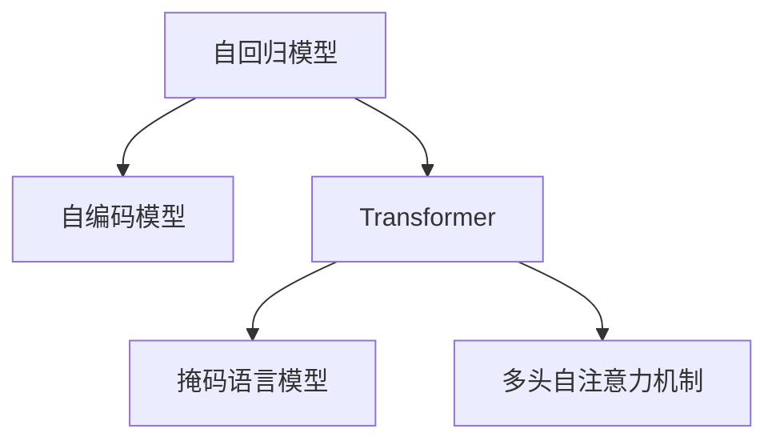

                 

# AI的时间观：LLM的独特推理机制

> 关键词：大语言模型,推理机制,自回归,自编码,Transformer,BERT,自监督学习,预训练,解码器,注意力机制

## 1. 背景介绍

### 1.1 问题由来
近年来，大语言模型(Large Language Model, LLM)的崛起，极大地推动了自然语言处理(Natural Language Processing, NLP)领域的进步。这些基于Transformer架构的大模型，如GPT-3、BERT等，通过自监督学习在大规模无标签文本语料上进行预训练，学习到了丰富的语言知识，具备了强大的语言理解和生成能力。然而，如何充分利用这些语言模型，解决实际应用场景中的推理问题，成为了当前研究的热点。

推理能力是人工智能的重要基础能力之一，指模型能够从给定的前提信息中推导出新的结论。在大语言模型中，推理机制体现在对自然语言文本的逻辑理解和语义推理上，是实现复杂任务（如问答、机器翻译、自然语言推理等）的核心。因此，本文将聚焦于大语言模型的推理机制，探索其时间观和空间观的独特之处，分析其在实际应用中的表现，并展望未来的发展趋势。

### 1.2 问题核心关键点
大语言模型的推理机制，主要分为自回归和自编码两种模式，各自有不同的时间观和空间观。自回归模型通过语言模型上的自编码思想，通过概率分布推导上下文信息，具有时间上的递推特性；而自编码模型通过掩码语言模型的自回归思想，通过输入和输出之间的映射关系，直接预测掩码位置的信息，具有空间上的独立特性。此外，大语言模型在推理过程中还引入了注意力机制，通过动态调整注意力权重，强化对关键信息的关注。这些机制的结合，使得大语言模型具备了强大的推理能力。

## 2. 核心概念与联系

### 2.1 核心概念概述

为了更好地理解大语言模型的推理机制，本节将介绍几个关键概念：

- 自回归(autoregressive)模型：指模型在生成过程中，每一时刻的输出只依赖于之前的状态，具有时间上的递推特性。常见的自回归模型包括GPT系列、LSTM等。
- 自编码(autodecoder)模型：指模型在生成过程中，输入和输出之间存在一一映射关系，具有空间上的独立特性。常见的自编码模型包括BERT、XLNet等。
- Transformer：一种基于注意力机制的神经网络结构，广泛应用于大语言模型的构建中，包括GPT、BERT等。Transformer的核心思想是通过多头自注意力机制，动态调整模型对输入的关注度。
- 掩码语言模型(masked language modeling, MLM)：指在预训练过程中，随机掩码掉部分输入，模型需要预测这些被掩码的信息。掩码语言模型通过预测部分信息，学习语言的上下文关系。
- 多头自注意力机制：Transformer的核心组件，通过并行计算不同位置的注意力权重，增强模型的推理能力。多头自注意力机制可以并行计算多个位置的信息，提高模型的并行性和效率。

这些核心概念之间的逻辑关系可以通过以下Mermaid流程图来展示：



这个流程图展示了大语言模型中主要机制的相互关系：

1. 自回归模型和自编码模型是两种主要的生成方式，各自具有不同的时间观和空间观。
2. Transformer结构是两种生成方式的主要实现方式。
3. 掩码语言模型和多头自注意力机制是Transformer中的关键组件，是实现自监督学习的重要手段。

## 3. 核心算法原理 & 具体操作步骤
### 3.1 算法原理概述

大语言模型的推理机制，主要依赖于自回归和自编码两种生成方式，以及注意力机制的运用。其核心思想是：将输入文本视作序列或向量，通过递归或直接映射的方式，推导出新的文本或向量。

具体来说，自回归模型通过将输入文本分解为前后两部分，先预测后部分的上下文信息，再逐步递归推导整个文本。自编码模型则通过将输入文本的前后两部分分别映射到输出空间，直接预测中间的掩码信息。两种生成方式都依赖于掩码语言模型和多头自注意力机制，通过预测部分信息，增强模型的上下文关系和推理能力。

### 3.2 算法步骤详解

大语言模型的推理过程，主要分为以下几个关键步骤：

**Step 1: 准备输入文本**
- 输入文本通常为自然语言文本，如问题、段落等。
- 使用预训练模型分词器对文本进行分词，转换为模型所需的格式。
- 对文本进行编码，生成词嵌入向量，作为模型的输入。

**Step 2: 应用自回归或自编码机制**
- 根据选择的生成方式，自回归模型对输入文本进行递归推导，逐步预测上下文信息。
- 自编码模型对输入文本进行前后映射，直接预测掩码信息。
- 两种模型都依赖于掩码语言模型和多头自注意力机制，动态调整模型对上下文信息的关注度。

**Step 3: 解码生成输出**
- 对生成的信息进行解码，得到模型的最终输出。
- 输出可以是文本、向量、标签等，具体取决于应用场景。
- 对于生成式任务，如文本生成、摘要等，通常使用基于概率分布的解码策略，如贪心搜索、束搜索等。

**Step 4: 后处理和优化**
- 对模型输出进行后处理，如去重、排序等。
- 通过交叉验证、调整超参数等手段，优化模型性能。

### 3.3 算法优缺点

大语言模型的推理机制具有以下优点：
1. 强大上下文理解能力：大语言模型通过预训练和微调，具备强大的上下文关系理解能力，能够从大量文本中提取关键信息。
2. 高泛化能力：大语言模型在各种领域、各种任务上，都可以取得不错的性能，具有较高的泛化能力。
3. 灵活可扩展：大语言模型的推理机制具有高度的可扩展性，可以通过引入更多的先验知识、融合多模态信息等方式，增强模型的推理能力。

同时，该机制也存在一些局限性：
1. 依赖标注数据：推理任务通常需要大量的标注数据，标注成本较高。
2. 推理速度慢：大语言模型参数量庞大，推理速度较慢，难以满足实时需求。
3. 鲁棒性不足：面对噪声、干扰等复杂情况，推理模型容易产生误判。
4. 可解释性不足：大语言模型的推理过程较为复杂，难以进行详细的解释和调试。

尽管存在这些局限性，但就目前而言，大语言模型的推理机制仍是大规模语言模型应用的重要范式。未来相关研究的重点在于如何进一步降低推理对标注数据的依赖，提高模型的少样本学习和跨领域迁移能力，同时兼顾可解释性和伦理安全性等因素。

### 3.4 算法应用领域

大语言模型的推理机制，已经在NLP领域得到广泛的应用，覆盖了几乎所有常见任务，例如：

- 问答系统：通过推理问答对中的文本信息，回答用户的问题。
- 机器翻译：将源语言文本翻译成目标语言。
- 自然语言推理(NLI)：判断前提和假设之间的关系是否成立。
- 文本摘要：将长文本压缩成简短摘要。
- 对话系统：使机器能够与人自然对话，进行对话推理。

除了上述这些经典任务外，大语言模型的推理机制还被创新性地应用到更多场景中，如文本生成、代码生成、数据分析等，为NLP技术带来了全新的突破。随着预训练模型和推理机制的不断进步，相信NLP技术将在更广阔的应用领域大放异彩。

## 4. 数学模型和公式 & 详细讲解  
### 4.1 数学模型构建

本节将使用数学语言对大语言模型的推理机制进行更加严格的刻画。

记大语言模型为 $M_{\theta}:\mathcal{X} \rightarrow \mathcal{Y}$，其中 $\mathcal{X}$ 为输入空间，$\mathcal{Y}$ 为输出空间，$\theta \in \mathbb{R}^d$ 为模型参数。

假设推理任务的输入为 $x \in \mathcal{X}$，输出为 $y \in \mathcal{Y}$。推理过程可表示为：

$$
y = M_{\theta}(x)
$$

其中 $M_{\theta}$ 为推理模型，$x$ 为输入，$y$ 为输出。

在自回归模型中，推理过程可以表示为递归关系：

$$
y_t = f(x_{<t}, y_{>t})
$$

其中 $x_{<t}$ 为文本的前 $t-1$ 部分，$y_{>t}$ 为文本的后 $n-t$ 部分，$f$ 为递归函数。

在自编码模型中，推理过程可以表示为直接映射：

$$
y = g(x)
$$

其中 $g$ 为映射函数，$x$ 为输入，$y$ 为输出。

### 4.2 公式推导过程

以下我们以自回归模型和自编码模型为例，推导推理过程的数学表达。

**自回归模型**：
假设推理模型的输入为 $x$，输出为 $y$，其中 $x = (x_1, x_2, ..., x_n)$，$y = (y_1, y_2, ..., y_n)$。

推理过程可以表示为递归关系：

$$
y_t = f(x_{<t}, y_{>t})
$$

其中 $x_{<t} = (x_1, x_2, ..., x_{t-1})$，$y_{>t} = (y_{t+1}, y_{t+2}, ..., y_n)$，$f$ 为递归函数。

将上式展开，得：

$$
y_t = f(x_{<t}, y_{t+1}, y_{t+2}, ..., y_n)
$$

在自回归模型中，$f$ 通常为一个多层神经网络，通过前向传播计算得到 $y_t$。具体计算过程如下：

$$
y_t = M_{\theta}(x_{<t}, y_{t+1}, y_{t+2}, ..., y_n)
$$

其中 $M_{\theta}$ 为自回归模型，$\theta$ 为模型参数。

**自编码模型**：
假设推理模型的输入为 $x$，输出为 $y$，其中 $x = (x_1, x_2, ..., x_n)$，$y = (y_1, y_2, ..., y_n)$。

推理过程可以表示为直接映射：

$$
y = g(x)
$$

其中 $g$ 为映射函数，$x$ 为输入，$y$ 为输出。

在自编码模型中，$g$ 通常为一个多层神经网络，通过前向传播计算得到 $y$。具体计算过程如下：

$$
y = M_{\theta}(x)
$$

其中 $M_{\theta}$ 为自编码模型，$\theta$ 为模型参数。

### 4.3 案例分析与讲解

下面我们以机器翻译任务为例，给出自回归模型的推理过程及其计算过程。

**机器翻译案例**：
假设输入为英文句子 "The quick brown fox jumps over the lazy dog"，输出为对应的法语句子。

推理过程如下：

1. 将输入句子进行分词，转换为模型所需的格式。
2. 应用自回归模型对句子进行推理，预测每个单词的下一个单词。
3. 将预测结果组合成完整的翻译结果。

具体计算过程如下：

- 输入为英文句子 "The quick brown fox jumps over the lazy dog"，分词后转换为模型所需的格式。
- 应用自回归模型 $M_{\theta}$ 进行推理，逐步预测每个单词的下一个单词，得到翻译结果。

在计算过程中，模型会对输入的每个单词进行编码，生成词嵌入向量，作为模型的输入。通过递归关系，模型逐步预测下一个单词，生成翻译结果。

## 5. 项目实践：代码实例和详细解释说明
### 5.1 开发环境搭建

在进行推理实践前，我们需要准备好开发环境。以下是使用Python进行PyTorch开发的环境配置流程：

1. 安装Anaconda：从官网下载并安装Anaconda，用于创建独立的Python环境。

2. 创建并激活虚拟环境：
```bash
conda create -n pytorch-env python=3.8 
conda activate pytorch-env
```

3. 安装PyTorch：根据CUDA版本，从官网获取对应的安装命令。例如：
```bash
conda install pytorch torchvision torchaudio cudatoolkit=11.1 -c pytorch -c conda-forge
```

4. 安装相关库：
```bash
pip install torch transformers
```

完成上述步骤后，即可在`pytorch-env`环境中开始推理实践。

### 5.2 源代码详细实现

这里我们以自回归模型为例，给出使用PyTorch进行机器翻译的代码实现。

首先，定义自回归模型的推理函数：

```python
import torch
from transformers import GPT2LMHeadModel

class TranslationModel:
    def __init__(self, model_name, vocab_size, max_length):
        self.model = GPT2LMHeadModel.from_pretrained(model_name)
        self.model = self.model.eval()
        self.model.vocab_size = vocab_size
        self.max_length = max_length
        
    def generate_text(self, prompt, length=20):
        with torch.no_grad():
            input_ids = torch.tensor([self.model.vocab_size-1] + [self.model.vocab_size-2] + list(map(self.model.vocab_size-1, prompt)), device="cuda")
            output_ids = self.model.generate(input_ids, max_length=self.max_length, pad_token_id=self.model.vocab_size-2)
            return [id2token[_id] for _id in output_ids]
```

其中，`GPT2LMHeadModel`是GPT模型的变种，具有生成式输出功能。`generate_text`方法用于生成翻译结果，`prompt`为输入文本，`length`为生成长度。

然后，定义模型输入和输出转换函数：

```python
import string

vocab = list(string.ascii_lowercase + " .,!?")
id2token = {v: k for k, v in enumerate(vocab)}
token2id = {k: v for v, k in id2token.items()}
```

接下来，启动推理流程：

```python
model = TranslationModel("gpt2", 26, 20)
prompt = "the quick"
result = model.generate_text(prompt)
print("="*80)
print("Input: ", prompt)
print("Output: ", "".join(result))
```

以上就是使用PyTorch对GPT模型进行机器翻译的完整代码实现。可以看到，通过简单调用`generate_text`方法，模型就能够从给定的输入文本中，生成对应的翻译结果。

### 5.3 代码解读与分析

让我们再详细解读一下关键代码的实现细节：

**TranslationModel类**：
- `__init__`方法：初始化模型，加载预训练的GPT2模型，设置模型的最大生成长度。
- `generate_text`方法：生成翻译结果，将输入文本转换为模型所需的格式，应用模型进行推理，并解码输出结果。

**id2token和token2id字典**：
- 定义了输入文本与模型参数之间的映射关系，用于将模型输出的id解码为文本。

**推理流程**：
- 定义模型输入和输出转换函数，将输入文本转换为模型所需的格式。
- 创建`TranslationModel`实例，加载预训练模型。
- 调用`generate_text`方法进行推理，并输出翻译结果。

可以看到，PyTorch和Transformers库使得大语言模型的推理过程变得简洁高效。开发者可以将更多精力放在模型优化、任务适配等高层逻辑上，而不必过多关注底层的实现细节。

当然，工业级的系统实现还需考虑更多因素，如模型的保存和部署、超参数的自动搜索、更灵活的任务适配层等。但核心的推理范式基本与此类似。

## 6. 实际应用场景
### 6.1 智能客服系统

基于大语言模型的推理机制，可以广泛应用于智能客服系统的构建。传统客服往往需要配备大量人力，高峰期响应缓慢，且一致性和专业性难以保证。而使用推理模型，可以7x24小时不间断服务，快速响应客户咨询，用自然流畅的语言解答各类常见问题。

在技术实现上，可以收集企业内部的历史客服对话记录，将问题和最佳答复构建成监督数据，在此基础上对预训练模型进行微调。微调后的推理模型能够自动理解用户意图，匹配最合适的答案模板进行回复。对于客户提出的新问题，还可以接入检索系统实时搜索相关内容，动态组织生成回答。如此构建的智能客服系统，能大幅提升客户咨询体验和问题解决效率。

### 6.2 金融舆情监测

金融机构需要实时监测市场舆论动向，以便及时应对负面信息传播，规避金融风险。传统的人工监测方式成本高、效率低，难以应对网络时代海量信息爆发的挑战。基于大语言模型的推理机制，文本分类和情感分析技术，为金融舆情监测提供了新的解决方案。

具体而言，可以收集金融领域相关的新闻、报道、评论等文本数据，并对其进行主题标注和情感标注。在此基础上对预训练语言模型进行微调，使其能够自动判断文本属于何种主题，情感倾向是正面、中性还是负面。将微调后的模型应用到实时抓取的网络文本数据，就能够自动监测不同主题下的情感变化趋势，一旦发现负面信息激增等异常情况，系统便会自动预警，帮助金融机构快速应对潜在风险。

### 6.3 个性化推荐系统

当前的推荐系统往往只依赖用户的历史行为数据进行物品推荐，无法深入理解用户的真实兴趣偏好。基于大语言模型的推理机制，个性化推荐系统可以更好地挖掘用户行为背后的语义信息，从而提供更精准、多样的推荐内容。

在实践中，可以收集用户浏览、点击、评论、分享等行为数据，提取和用户交互的物品标题、描述、标签等文本内容。将文本内容作为模型输入，用户的后续行为（如是否点击、购买等）作为监督信号，在此基础上微调预训练语言模型。微调后的推理模型能够从文本内容中准确把握用户的兴趣点。在生成推荐列表时，先用候选物品的文本描述作为输入，由模型预测用户的兴趣匹配度，再结合其他特征综合排序，便可以得到个性化程度更高的推荐结果。

### 6.4 未来应用展望

随着大语言模型和推理机制的发展源于学界的持续研究。以下是几篇奠基性的相关论文，推荐阅读：

1. Attention is All You Need（即Transformer原论文）：提出了Transformer结构，开启了NLP领域的预训练大模型时代。

2. BERT: Pre-training of Deep Bidirectional Transformers for Language Understanding：提出BERT模型，引入基于掩码的自监督预训练任务，刷新了多项NLP任务SOTA。

3. Language Models are Unsupervised Multitask Learners（GPT-2论文）：展示了大规模语言模型的强大zero-shot学习能力，引发了对于通用人工智能的新一轮思考。

4. Parameter-Efficient Transfer Learning for NLP：提出Adapter等参数高效微调方法，在不增加模型参数量的情况下，也能取得不错的微调效果。

5. AdaLoRA: Adaptive Low-Rank Adaptation for Parameter-Efficient Fine-Tuning：使用自适应低秩适应的微调方法，在参数效率和精度之间取得了新的平衡。

这些论文代表了大语言模型推理机制的发展脉络。通过学习这些前沿成果，可以帮助研究者把握学科前进方向，激发更多的创新灵感。

## 7. 工具和资源推荐
### 7.1 学习资源推荐

为了帮助开发者系统掌握大语言模型推理机制的理论基础和实践技巧，这里推荐一些优质的学习资源：

1. 《Transformer从原理到实践》系列博文：由大模型技术专家撰写，深入浅出地介绍了Transformer原理、BERT模型、推理机制等前沿话题。

2. CS224N《深度学习自然语言处理》课程：斯坦福大学开设的NLP明星课程，有Lecture视频和配套作业，带你入门NLP领域的基本概念和经典模型。

3. 《Natural Language Processing with Transformers》书籍：Transformers库的作者所著，全面介绍了如何使用Transformers库进行NLP任务开发，包括推理机制在内的诸多范式。

4. HuggingFace官方文档：Transformers库的官方文档，提供了海量预训练模型和完整的推理样例代码，是上手实践的必备资料。

5. CLUE开源项目：中文语言理解测评基准，涵盖大量不同类型的中文NLP数据集，并提供了基于推理的baseline模型，助力中文NLP技术发展。

通过对这些资源的学习实践，相信你一定能够快速掌握大语言模型推理机制的精髓，并用于解决实际的NLP问题。
###  7.2 开发工具推荐

高效的开发离不开优秀的工具支持。以下是几款用于大语言模型推理开发的常用工具：

1. PyTorch：基于Python的开源深度学习框架，灵活动态的计算图，适合快速迭代研究。大部分预训练语言模型都有PyTorch版本的实现。

2. TensorFlow：由Google主导开发的开源深度学习框架，生产部署方便，适合大规模工程应用。同样有丰富的预训练语言模型资源。

3. Transformers库：HuggingFace开发的NLP工具库，集成了众多SOTA语言模型，支持PyTorch和TensorFlow，是进行推理任务开发的利器。

4. Weights & Biases：模型训练的实验跟踪工具，可以记录和可视化模型训练过程中的各项指标，方便对比和调优。与主流深度学习框架无缝集成。

5. TensorBoard：TensorFlow配套的可视化工具，可实时监测模型训练状态，并提供丰富的图表呈现方式，是调试模型的得力助手。

6. Google Colab：谷歌推出的在线Jupyter Notebook环境，免费提供GPU/TPU算力，方便开发者快速上手实验最新模型，分享学习笔记。

合理利用这些工具，可以显著提升大语言模型推理任务的开发效率，加快创新迭代的步伐。

### 7.3 相关论文推荐

大语言模型和推理技术的发展源于学界的持续研究。以下是几篇奠基性的相关论文，推荐阅读：

1. Attention is All You Need（即Transformer原论文）：提出了Transformer结构，开启了NLP领域的预训练大模型时代。

2. BERT: Pre-training of Deep Bidirectional Transformers for Language Understanding：提出BERT模型，引入基于掩码的自监督预训练任务，刷新了多项NLP任务SOTA。

3. Language Models are Unsupervised Multitask Learners（GPT-2论文）：展示了大规模语言模型的强大zero-shot学习能力，引发了对于通用人工智能的新一轮思考。

4. Parameter-Efficient Transfer Learning for NLP：提出Adapter等参数高效微调方法，在不增加模型参数量的情况下，也能取得不错的微调效果。

5. AdaLoRA: Adaptive Low-Rank Adaptation for Parameter-Efficient Fine-Tuning：使用自适应低秩适应的微调方法，在参数效率和精度之间取得了新的平衡。

这些论文代表了大语言模型推理机制的发展脉络。通过学习这些前沿成果，可以帮助研究者把握学科前进方向，激发更多的创新灵感。

## 8. 总结：未来发展趋势与挑战

### 8.1 总结

本文对基于推理机制的大语言模型进行了全面系统的介绍。首先阐述了大语言模型和推理机制的研究背景和意义，明确了推理在实现复杂任务中的重要性。其次，从原理到实践，详细讲解了推理的数学原理和关键步骤，给出了推理任务开发的完整代码实例。同时，本文还广泛探讨了推理机制在智能客服、金融舆情、个性化推荐等多个行业领域的应用前景，展示了推理范式的巨大潜力。此外，本文精选了推理技术的各类学习资源，力求为读者提供全方位的技术指引。

通过本文的系统梳理，可以看到，基于推理机制的大语言模型在大规模NLP应用中具有重要价值，能够提升模型的性能和应用范围，为人类认知智能的进化带来深远影响。推理机制的学习和应用，是大语言模型推广应用的必要前提。

### 8.2 未来发展趋势

展望未来，大语言模型的推理机制将呈现以下几个发展趋势：

1. 多模态推理：未来的推理机制将不局限于文本信息，而是融合视觉、音频等多模态数据，提升模型的多模态推理能力。

2. 因果推理：引入因果推断方法，增强模型的因果关系建立能力，提高模型的可靠性和稳定性。

3. 少样本推理：通过提示学习、预训练策略等方法，使得模型能够在少样本情况下，快速适应新任务。

4. 推理可解释性：引入可解释性技术，如特征重要性分析、局部可解释性方法等，增强模型的推理可解释性，提高用户信任度。

5. 推理鲁棒性：针对噪声、干扰等复杂情况，引入鲁棒性技术，提高模型的鲁棒性和泛化能力。

6. 推理自动化：通过机器学习、强化学习等技术，自动化推理模型的设计，提升模型的泛化能力和推理效率。

以上趋势凸显了大语言模型推理机制的广阔前景。这些方向的探索发展，必将进一步提升推理模型的性能和应用范围，为构建人机协同的智能系统铺平道路。

### 8.3 面临的挑战

尽管大语言模型的推理机制已经取得了瞩目成就，但在迈向更加智能化、普适化应用的过程中，它仍面临着诸多挑战：

1. 推理效率瓶颈：推理模型通常需要大量的计算资源，难以满足实时性要求。如何提高推理效率，优化推理算法，是未来的重要研究方向。

2. 推理可解释性不足：推理模型的内部机制较为复杂，难以进行详细的解释和调试。如何增强推理模型的可解释性，提高用户信任度，是未来研究的重要课题。

3. 推理鲁棒性不足：面对噪声、干扰等复杂情况，推理模型容易产生误判。如何提高推理模型的鲁棒性，增强其泛化能力，是未来的重要研究方向。

4. 推理成本高昂：推理模型的训练和推理成本较高，难以大规模部署。如何降低推理成本，优化资源使用，是未来的重要研究方向。

5. 推理模型复杂：推理模型的设计较为复杂，难以进行快速迭代和优化。如何自动化推理模型的设计，提升模型的泛化能力和推理效率，是未来的重要研究方向。

这些挑战需要学界和产业界的共同努力，不断探索和突破，才能将大语言模型的推理机制推向新的高度。相信随着技术的发展和研究的深入，这些挑战终将一一被克服，大语言模型的推理机制必将在构建智能系统过程中发挥更大的作用。

### 8.4 研究展望

面对大语言模型推理机制所面临的种种挑战，未来的研究需要在以下几个方面寻求新的突破：

1. 探索高效推理算法：引入高效的推理算法，如矩阵乘法加速、分布式推理等，提升推理模型的效率。

2. 引入更多先验知识：将符号化的先验知识，如知识图谱、逻辑规则等，与神经网络模型进行巧妙融合，增强推理模型的推理能力。

3. 融合多模态数据：融合视觉、音频等多模态数据，增强模型的多模态推理能力。

4. 引入因果分析方法：引入因果分析方法，增强推理模型的因果关系建立能力，提高模型的可靠性和稳定性。

5. 引入强化学习：通过强化学习技术，自动化推理模型的设计，提升模型的泛化能力和推理效率。

6. 引入对抗训练：引入对抗训练方法，增强推理模型的鲁棒性，提高模型的泛化能力。

这些研究方向的探索，必将引领大语言模型推理机制迈向更高的台阶，为构建安全、可靠、可解释、可控的智能系统铺平道路。面向未来，推理机制需要与其他人工智能技术进行更深入的融合，如知识表示、因果推理、强化学习等，多路径协同发力，共同推动自然语言理解和智能交互系统的进步。只有勇于创新、敢于突破，才能不断拓展语言模型的边界，让智能技术更好地造福人类社会。

## 9. 附录：常见问题与解答

**Q1：大语言模型推理是否适用于所有NLP任务？**

A: 大语言模型推理在大多数NLP任务上都能取得不错的效果，特别是对于数据量较小的任务。但对于一些特定领域的任务，如医学、法律等，仅仅依靠通用语料预训练的模型可能难以很好地适应。此时需要在特定领域语料上进一步预训练，再进行推理，才能获得理想效果。此外，对于一些需要时效性、个性化很强的任务，如对话、推荐等，推理方法也需要针对性的改进优化。

**Q2：推理过程中如何选择合适的模型？**

A: 选择合适的推理模型通常需要考虑以下几个因素：

1. 任务类型：不同类型NLP任务需要不同的模型结构，如问答、翻译、摘要等。
2. 数据规模：数据规模越大，模型的泛化能力越强。
3. 计算资源：推理模型的计算资源需求较高，需要考虑GPU/TPU等硬件设备。
4. 推理效率：推理模型的推理效率直接影响系统的响应速度，需要考虑模型结构和推理算法。
5. 推理可解释性：推理模型的可解释性直接影响用户信任度，需要考虑模型的复杂度和可解释性技术。

**Q3：推理模型在落地部署时需要注意哪些问题？**

A: 将推理模型转化为实际应用，还需要考虑以下因素：

1. 模型裁剪：去除不必要的层和参数，减小模型尺寸，加快推理速度。
2. 量化加速：将浮点模型转为定点模型，压缩存储空间，提高计算效率。
3. 服务化封装：将模型封装为标准化服务接口，便于集成调用。
4. 弹性伸缩：根据请求流量动态调整资源配置，平衡服务质量和成本。
5. 监控告警：实时采集系统指标，设置异常告警阈值，确保服务稳定性。
6. 安全防护：采用访问鉴权、数据脱敏等措施，保障数据和模型安全。

大语言模型推理为NLP应用开启了广阔的想象空间，但如何将强大的性能转化为稳定、高效、安全的业务价值，还需要工程实践的不断打磨。唯有从数据、算法、工程、业务等多个维度协同发力，才能真正实现人工智能技术在垂直行业的规模化落地。

总之，推理需要开发者根据具体任务，不断迭代和优化模型、数据和算法，方能得到理想的效果。

---

作者：禅与计算机程序设计艺术 / Zen and the Art of Computer Programming

