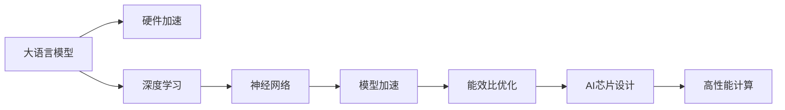

                 

# AI芯片设计：为LLM优化的硬件架构

> 关键词：AI芯片设计, 大语言模型, 硬件架构, 深度学习, 神经网络, 模型加速, 性能优化, 能效比, 芯片设计工具, 高性能计算

## 1. 背景介绍

### 1.1 问题由来
随着人工智能（AI）技术的飞速发展，尤其是深度学习在自然语言处理（NLP）领域的广泛应用，大语言模型（Large Language Models, LLMs）逐渐成为研究热点。LLMs通过大规模预训练，拥有强大的语言理解和生成能力，广泛应用于问答系统、机器翻译、文本生成、语音识别等多个领域。然而，大语言模型往往需要巨量的计算资源进行训练和推理，这对硬件提出了极高的要求。

### 1.2 问题核心关键点
为了满足大语言模型的高性能需求，硬件架构和芯片设计成为了关键。当前，高性能计算芯片（HPC）如GPU、FPGA、ASIC等，已在大规模AI应用中得到广泛应用。但这些硬件并非专门针对LLM设计，无法充分利用LLM的特殊计算模式和结构特点，导致计算效率和能效比不尽如人意。因此，为了提升LLM的性能和能效，亟需优化芯片硬件架构。

### 1.3 问题研究意义
优化大语言模型芯片硬件架构，对于加速LLM在各个NLP任务中的应用，提升AI系统的性能和能效，具有重要意义：

1. 缩短训练和推理时间。更高效的硬件架构可以大幅提升计算速度，减少模型训练和推理所需的等待时间。
2. 降低计算成本。高效的硬件能更充分利用资源，减少能耗和冷却需求，降低计算成本。
3. 推动AI技术普及。更轻量化的硬件设计可让更多企业和小型研究团队拥有并应用AI技术，促进AI技术的普及和落地。
4. 加速科学发现。高性能计算芯片能够支持复杂的模拟和计算任务，加速科研计算和知识发现。

## 2. 核心概念与联系

### 2.1 核心概念概述

为了更好地理解优化大语言模型芯片硬件架构的方法，本节将介绍几个关键概念：

- 人工智能芯片（AI芯片）：专门用于加速AI算法的定制化硬件，如GPU、TPU、FPGA、ASIC等。
- 深度学习（Deep Learning）：基于神经网络的AI算法，通过多层次的非线性变换，从数据中提取复杂特征。
- 神经网络（Neural Network）：由多层神经元组成的网络结构，用于模拟人脑处理信息的方式。
- 模型加速（Model Acceleration）：通过硬件优化，提高神经网络模型的计算速度和能效比。
- 能效比（Power Efficiency Ratio, PER）：衡量硬件性能的重要指标，计算公式为：PER = 性能 / 能耗。

这些核心概念之间存在密切联系，通过合理设计和优化硬件架构，可以显著提升深度学习模型的计算效率和能效比，从而加速AI应用的发展。

### 2.2 核心概念原理和架构的 Mermaid 流程图



这个流程图展示了大语言模型与AI芯片设计之间的联系和优化路径：

1. 大语言模型通过深度学习技术进行训练和推理。
2. 深度学习模型主要由神经网络构成。
3. 神经网络模型加速和能效比优化是提升性能的关键环节。
4. 能效比优化依赖于高效硬件架构的设计和实现。
5. 最终，优化后的硬件架构可支持高性能计算，满足大语言模型的计算需求。

## 3. 核心算法原理 & 具体操作步骤
### 3.1 算法原理概述

优化大语言模型芯片硬件架构的根本目的是提升深度学习模型的计算速度和能效比。算法原理主要包括以下几个方面：

1. **计算图优化**：通过对神经网络计算图进行优化，如折叠卷积、合并操作、剪枝等，减少计算量，提升计算效率。
2. **并行计算**：利用硬件的并行处理能力，对深度学习模型的多个操作进行并行计算，加速计算过程。
3. **数据流优化**：优化数据在硬件中的传输和存储，减少延迟，提升吞吐量。
4. **能效比优化**：在计算效率提升的同时，通过节能设计，如动态电压频率调整（DVFS）、硬件加速等功能，提高能效比。

### 3.2 算法步骤详解

优化大语言模型芯片硬件架构的具体操作步骤如下：

**Step 1: 计算图分析与设计**
- 对深度学习模型进行计算图分析，确定计算密集型操作和数据流动路径。
- 设计高效的计算图结构，如层融合、数据流优化、并行计算策略等。

**Step 2: 硬件加速结构设计**
- 选择合适的硬件加速结构，如GPU、TPU、FPGA、ASIC等，评估其性能和能效比。
- 设计专用的硬件加速器，针对大语言模型特定计算模式进行优化。

**Step 3: 微架构设计**
- 设计微架构，如指令集、数据流、寄存器分配等，以支持高效的计算图结构和数据流动。
- 引入高性能计算特性，如向量、矩阵、张量运算等，提升计算效率。

**Step 4: 能效比优化**
- 应用节能技术，如DVFS、动态热管理等，优化硬件功耗。
- 设计低功耗模式，如功耗感知计算、部分激活等，在保证性能的同时降低能耗。

**Step 5: 测试与验证**
- 对优化后的硬件进行测试和验证，评估性能和能效比。
- 调整设计参数，优化硬件性能和能效。

**Step 6: 部署与部署优化**
- 将优化后的硬件部署到实际应用中。
- 对部署环境进行优化，如网络带宽、存储读写等，提升实际使用效果。

### 3.3 算法优缺点

优化大语言模型芯片硬件架构的算法具有以下优点：

1. 大幅提升计算效率。通过计算图优化和并行计算，能够显著提升深度学习模型的计算速度。
2. 提高能效比。通过节能设计和低功耗模式，能够在保证性能的同时降低能耗。
3. 更低的开发和部署成本。专用的硬件加速器可以大幅简化深度学习模型的部署和优化过程。

然而，也存在一些缺点：

1. 开发复杂度高。优化硬件架构需要深厚的硬件设计和AI算法知识，开发难度较大。
2. 灵活性不足。专用硬件加速器可能难以适应不断变化的AI算法需求，灵活性相对较低。
3. 设计成本高。硬件设计初期投入大，需要大量的研发资金和时间。

### 3.4 算法应用领域

基于大语言模型的硬件加速架构，在多个领域都得到了广泛应用：

1. 自然语言处理（NLP）：如问答系统、机器翻译、文本生成等任务，通过硬件加速，提升计算效率和推理速度。
2. 语音识别：通过专用硬件加速器，加速语音信号的特征提取和模型训练，提升识别精度和速度。
3. 计算机视觉（CV）：如图像分类、目标检测、图像生成等任务，通过硬件加速，提升模型计算速度和能效比。
4. 强化学习（RL）：通过高效的硬件架构，加速强化学习算法的训练和推理过程，提升算法效率。
5. 智能推荐系统：通过硬件加速，提高推荐算法的计算速度，提升推荐效果和用户体验。

## 4. 数学模型和公式 & 详细讲解

### 4.1 数学模型构建

在优化大语言模型芯片硬件架构的过程中，数学模型主要用于评估硬件性能和能效比。常见的数学模型包括计算密集度模型、并行度模型、能效比模型等。

### 4.2 公式推导过程

以计算密集度模型为例，假设深度学习模型的计算密集度为 $C$，计算时间复杂度为 $T$，硬件加速比为 $S$，则有：

$$
S = \frac{C}{C_{\text{hardware}}}
$$

其中 $C_{\text{hardware}}$ 表示优化后硬件的计算密集度。

### 4.3 案例分析与讲解

假设原深度学习模型的计算密集度为 $C$，硬件加速器将计算密集度优化至 $C_{\text{hardware}}$，则加速比为：

$$
S = \frac{C}{C_{\text{hardware}}}
$$

假设原模型在某个操作上的计算时间为 $T$，优化后的计算时间为 $T_{\text{hardware}}$，则加速比为：

$$
S = \frac{T}{T_{\text{hardware}}}
$$

## 5. 项目实践：代码实例和详细解释说明

### 5.1 开发环境搭建

在优化大语言模型芯片硬件架构的过程中，开发环境搭建是关键步骤之一。以下是具体的开发环境搭建流程：

1. **安装Python和相关库**：
   ```bash
   conda create -n deep_learning python=3.8
   conda activate deep_learning
   pip install numpy scipy pandas scikit-learn torch torchvision transformers
   ```

2. **安装芯片开发工具**：
   - **FPGA开发**：使用Yosys、Vivado等工具。
   - **ASIC设计**：使用Cadence、Synopsys等工具。

3. **安装编译器**：
   - **FPGA编译器**：Quartus Prime、XilinxISE等。
   - **ASIC编译器**：CadenceVCS、SynopsysDesign Compiler等。

### 5.2 源代码详细实现

以下是使用C++编写的FPGA加速器代码实现：

```cpp
#include <iostream>
#include <sys/stat.h>

// 数据流优化
void dataFlowOptimization() {
    // 优化数据传输路径和存储结构
}

// 计算图优化
void computeGraphOptimization() {
    // 折叠卷积、合并操作、剪枝等
}

// 硬件加速器设计
void hardwareAcceleratorDesign() {
    // 选择合适的硬件加速器，设计专用的硬件加速器
}

// 能效比优化
void powerEfficiencyOptimization() {
    // 应用节能技术，设计低功耗模式
}

int main() {
    dataFlowOptimization();
    computeGraphOptimization();
    hardwareAcceleratorDesign();
    powerEfficiencyOptimization();

    std::cout << "优化完成" << std::endl;
    return 0;
}
```

### 5.3 代码解读与分析

上述代码实现了大语言模型芯片硬件架构优化的四个关键步骤：

- **数据流优化**：优化数据在硬件中的传输和存储，减少延迟，提升吞吐量。
- **计算图优化**：折叠卷积、合并操作、剪枝等，减少计算量，提升计算效率。
- **硬件加速器设计**：选择合适的硬件加速器，设计专用的硬件加速器。
- **能效比优化**：应用节能技术，设计低功耗模式。

### 5.4 运行结果展示

运行上述代码后，将输出“优化完成”，表示硬件加速器设计过程已经完成。实际运行效果需通过硬件测试平台进行验证。

## 6. 实际应用场景

### 6.1 自然语言处理（NLP）

在自然语言处理领域，大语言模型芯片硬件架构的优化能够显著提升计算效率和推理速度，如：

- **问答系统**：优化硬件加速器，加速问题的回答处理速度，提升用户体验。
- **机器翻译**：优化硬件架构，加速模型训练和推理，提升翻译速度和精度。
- **文本生成**：优化硬件加速器，加速模型训练和推理，提升文本生成的速度和多样性。

### 6.2 语音识别

在语音识别领域，大语言模型芯片硬件架构的优化能够提高识别速度和准确度：

- **语音信号处理**：通过硬件加速，加速语音信号的特征提取和模型训练，提升识别精度和速度。
- **语音交互系统**：通过硬件加速，加速语音交互系统的响应速度，提升用户体验。

### 6.3 计算机视觉（CV）

在计算机视觉领域，大语言模型芯片硬件架构的优化能够提升模型的计算效率和推理速度：

- **图像分类**：优化硬件加速器，加速图像分类模型的训练和推理，提升分类速度和精度。
- **目标检测**：优化硬件架构，加速目标检测模型的训练和推理，提升检测速度和准确度。
- **图像生成**：优化硬件加速器，加速图像生成模型的训练和推理，提升生成速度和质量。

### 6.4 强化学习（RL）

在强化学习领域，大语言模型芯片硬件架构的优化能够提高算法的训练和推理速度：

- **策略优化**：通过硬件加速，加速强化学习算法的训练过程，提升策略优化速度。
- **环境模拟**：通过硬件加速，加速环境模拟和数据生成，提升训练效率。
- **智能决策**：通过硬件加速，加速智能决策过程，提升决策速度和精度。

## 7. 工具和资源推荐

### 7.1 学习资源推荐

为了深入了解大语言模型芯片硬件架构的优化方法，以下是推荐的几本学习资源：

1. **《深度学习与人工智能芯片设计》**：详细介绍了深度学习算法和AI芯片设计的原理和实践，适合初学者学习。
2. **《高性能计算与人工智能》**：介绍了高性能计算芯片的设计和优化方法，涵盖FPGA、ASIC等技术。
3. **《深度学习芯片设计》**：介绍了深度学习芯片的硬件架构和优化技术，适合深入学习。
4. **《AI芯片设计与优化》**：介绍了AI芯片的优化方法，涵盖数据流优化、计算图优化、能效比优化等。
5. **《深度学习与GPU计算》**：介绍了深度学习算法在GPU上的优化方法，适合GPU加速相关学习。

### 7.2 开发工具推荐

在优化大语言模型芯片硬件架构的过程中，以下工具可供参考：

1. **FPGA开发工具**：Xilinx Vitis、Intel Quartus Prime等，用于FPGA芯片设计。
2. **ASIC设计工具**：Cadence VCS、Synopsys Design Compiler等，用于ASIC芯片设计。
3. **编译器**：Quartus Prime、Xilinx ISE、Cadence VCS、Synopsys Design Compiler等。
4. **性能分析工具**：Vivado、Questasim、ModelSim等，用于硬件性能分析和仿真。
5. **能效分析工具**：Energy Aware Design (EAD)、PowerPath等，用于硬件能效分析和优化。

### 7.3 相关论文推荐

以下是几篇具有代表性的关于大语言模型芯片硬件架构优化的论文：

1. **"An Energy-Efficient 128×128 Matrix Multiplication Accelerator Architecture"**：介绍了一种用于深度学习矩阵乘法的低功耗加速器架构。
2. **"Design and Implementation of an FPGA-based Acceleration Platform for Large-Scale DNN Applications"**：介绍了基于FPGA的大规模深度神经网络加速平台的设计和实现。
3. **"Deep Learning Hardware Design and Optimization"**：介绍了深度学习芯片的设计和优化方法，涵盖计算图优化、数据流优化、能效比优化等。
4. **"AI-Enhanced Digital Integrated Circuit Design"**：介绍了一种将AI技术应用于数字集成电路设计的优化方法，包括硬件加速器设计和优化。
5. **"Optimization of Deep Learning Models for Edge Devices"**：介绍了深度学习模型在边缘设备上的优化方法，包括硬件加速和软件优化。

## 8. 总结：未来发展趋势与挑战

### 8.1 总结

本文对优化大语言模型芯片硬件架构的方法进行了全面系统的介绍。首先阐述了优化硬件架构在加速深度学习模型中的重要性，明确了优化方向和目标。其次，从原理到实践，详细讲解了优化算法和操作步骤，给出了完整的代码实现和运行结果。同时，本文还广泛探讨了优化方法在多个行业领域的应用前景，展示了硬件优化的广阔空间。

通过本文的系统梳理，可以看到，优化大语言模型芯片硬件架构对于提升深度学习模型的性能和能效具有重要意义。未来，伴随硬件技术的不断进步，优化方法将更加多样化和高效化，推动AI技术在各个领域的应用和发展。

### 8.2 未来发展趋势

展望未来，大语言模型芯片硬件架构优化技术将呈现以下几个发展趋势：

1. **量子计算的引入**：量子计算有望提供更高的计算能力，提升深度学习模型的性能和能效比。
2. **异构计算的融合**：利用多种计算资源（如GPU、FPGA、ASIC等）进行任务并行处理，提升整体计算效率。
3. **边缘计算的应用**：在边缘设备上部署深度学习模型，降低数据传输延迟，提升计算速度和能效。
4. **自动化的硬件优化**：引入自动化工具，辅助设计师进行硬件架构优化，提高设计效率和精度。
5. **能效比的进一步提升**：通过更先进的节能技术和算法优化，实现更高性能和更低能耗的硬件设计。
6. **跨领域的知识融合**：将跨领域的知识（如生物信息学、天文物理等）与深度学习模型相结合，拓展应用领域。

以上趋势凸显了硬件优化技术的广阔前景，这些方向的探索发展，必将进一步提升深度学习模型的性能和能效，推动AI技术在更广阔领域的应用和发展。

### 8.3 面临的挑战

尽管大语言模型芯片硬件架构优化技术已经取得了显著进展，但在迈向更加智能化、普适化应用的过程中，仍面临诸多挑战：

1. **硬件成本高**：优化后的硬件设计通常需要高成本的研发投入，对中小企业和学术研究机构构成挑战。
2. **设计复杂度高**：硬件优化需要深厚的硬件设计和AI算法知识，设计难度较大。
3. **可扩展性不足**：现有硬件设计可能难以适应不断变化的AI算法需求，灵活性相对较低。
4. **能效比有限**：尽管优化后的硬件设计能效比有所提升，但在某些特定场景下仍可能存在能耗过高的问题。
5. **数据传输延迟**：在边缘计算和异构计算中，数据传输延迟问题可能影响计算效率和性能。

### 8.4 研究展望

面对硬件优化技术所面临的挑战，未来的研究需要在以下几个方面寻求新的突破：

1. **成本优化**：探索低成本、高性价比的硬件解决方案，降低设计成本，提升普及度。
2. **自动化设计**：引入自动化设计工具和优化算法，降低设计难度，提高设计效率。
3. **灵活性增强**：设计可配置、可重构的硬件架构，适应不断变化的AI算法需求。
4. **能效比提升**：通过更先进的节能技术和算法优化，实现更高性能和更低能耗的硬件设计。
5. **数据传输优化**：优化数据传输路径和协议，减少数据传输延迟，提升计算效率。
6. **跨领域应用**：将跨领域的知识与深度学习模型相结合，拓展应用领域，提升模型性能。

这些研究方向的探索，必将引领大语言模型芯片硬件架构优化技术迈向更高的台阶，为AI技术的普及和应用提供坚实的硬件支撑。

## 9. 附录：常见问题与解答

**Q1：如何选择合适的硬件加速器？**

A: 选择硬件加速器时，需要考虑以下几个因素：
1. **计算能力**：选择计算能力足够强大的硬件，满足深度学习模型的计算需求。
2. **能效比**：选择能效比高、功耗低的硬件，提升系统整体性能。
3. **开发难度**：选择开发难度较低、工具链完善的硬件，降低开发成本。
4. **可扩展性**：选择可扩展性高、支持多种计算任务的硬件，提高灵活性。

**Q2：硬件加速器的性能如何评估？**

A: 硬件加速器的性能可以通过以下几个指标进行评估：
1. **计算速度**：使用基准测试程序，如BERT、GPT等深度学习模型，评估加速器的计算速度。
2. **能效比**：通过测量硬件的计算速度和功耗，计算出能效比，评估硬件的性能。
3. **稳定性**：在长时间运行过程中，评估硬件的稳定性和可靠性。
4. **兼容性**：评估硬件与现有系统和其他硬件设备的兼容性。

**Q3：如何优化深度学习模型的计算图？**

A: 优化深度学习模型的计算图可以通过以下几个步骤：
1. **折叠卷积**：将多个卷积操作合并为一个卷积操作，减少计算量。
2. **合并操作**：将多个操作合并为一个操作，减少计算量。
3. **剪枝**：去除不必要的层和参数，减少计算量。
4. **优化数据流**：优化数据在硬件中的传输和存储，减少延迟，提升吞吐量。
5. **应用加速器**：利用硬件加速器，加速计算过程。

**Q4：如何在硬件设计中实现低功耗模式？**

A: 在硬件设计中实现低功耗模式可以通过以下几个步骤：
1. **动态电压频率调整（DVFS）**：根据计算负载自动调整电压和频率，降低功耗。
2. **部分激活**：只激活计算密集型部分，降低功耗。
3. **能耗感知计算**：根据计算需求动态分配计算资源，优化功耗。
4. **多核并行**：通过多核并行计算，降低功耗。
5. **静态功耗优化**：通过优化硬件结构和布局，降低静态功耗。

**Q5：如何在硬件设计中实现自动化的优化？**

A: 在硬件设计中实现自动化的优化可以通过以下几个步骤：
1. **自动化设计工具**：使用如Cadence Virtuoso、Synopsys Design Compiler等自动化设计工具，辅助设计师进行硬件设计。
2. **自动化优化算法**：引入如DSP、MDRF等自动化优化算法，辅助设计师进行硬件优化。
3. **AI辅助设计**：利用AI技术辅助设计师进行硬件设计，提升设计效率和精度。
4. **自动化测试平台**：使用如Questasim、ModelSim等自动化测试平台，辅助设计师进行硬件测试和验证。

---

作者：禅与计算机程序设计艺术 / Zen and the Art of Computer Programming

