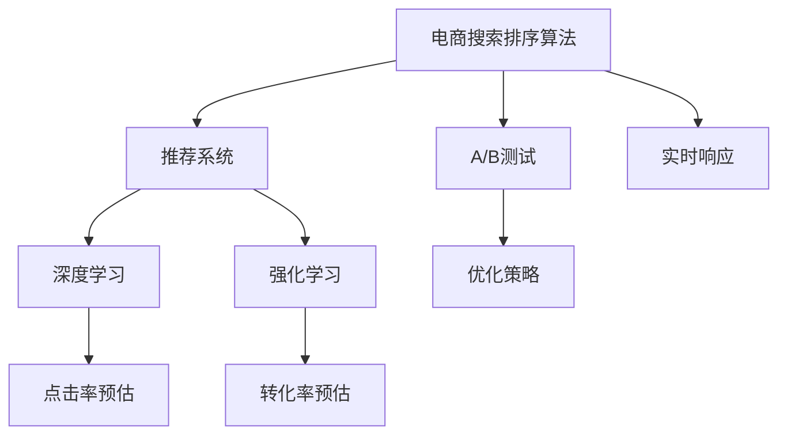

                 

# AI赋能的电商搜索排序算法优化

在电商领域，高效的搜索排序算法能够极大地提升用户体验和平台运营效率。随着AI技术的快速发展，AI驱动的搜索排序算法成为电商企业优化用户购物体验和提升交易转化率的重要手段。本文将对AI赋能的电商搜索排序算法进行全面介绍，涵盖算法原理、具体实现、实际应用场景以及未来发展趋势。

## 1. 背景介绍

### 1.1 问题由来

传统的电商搜索排序算法基于关键词匹配、点击率预估、转化率预估等统计特征，存在计算成本高、实时性差、泛化能力不足等缺陷。近年来，随着深度学习、强化学习等AI技术的突破，电商搜索排序算法逐渐向AI驱动的方向发展，通过构建复杂的模型结构、引入丰富的用户行为数据、优化模型训练和推理算法，实现了实时性、准确性和泛化能力的显著提升。

### 1.2 问题核心关键点

AI赋能的电商搜索排序算法主要关注以下几个关键问题：
- 如何构建高效的学习模型，提高预测准确性和实时性。
- 如何有效融合用户行为数据和商品属性数据，优化搜索结果排序。
- 如何处理海量数据，保证模型训练和推理的高效性。
- 如何优化算法性能，降低计算成本，提高用户体验。

### 1.3 问题研究意义

AI驱动的电商搜索排序算法能够显著提升用户购物体验和平台运营效率。其研究意义在于：
- 实时响应用户需求，提高搜索和推荐系统的响应速度和准确性。
- 挖掘用户行为和商品属性数据，构建更加个性化、精准的搜索和推荐结果。
- 优化计算资源配置，降低电商平台的运营成本，提高交易转化率。

## 2. 核心概念与联系

### 2.1 核心概念概述

本节将介绍几个与AI赋能的电商搜索排序算法密切相关的核心概念：

- 电商搜索排序算法：根据用户输入的搜索词，从商品库中检索和排序相关商品，返回给用户的一种算法。传统的搜索排序算法基于统计特征进行排序，AI驱动的搜索排序算法则通过深度学习、强化学习等技术进行优化。
- 推荐系统：根据用户历史行为和商品属性数据，推荐用户可能感兴趣的商品的一种系统。推荐系统是电商搜索排序算法的重要组成部分，通过优化推荐算法，提升用户体验和交易转化率。
- 深度学习：一种基于神经网络的机器学习方法，能够处理大规模数据，通过多层网络结构提取特征，进行复杂的模式识别和预测。
- 强化学习：一种通过试错和反馈机制不断优化决策策略的学习方法，广泛应用于游戏、自动驾驶、机器人等领域。
- 点击率预估：根据用户浏览和点击行为，预测用户对商品感兴趣的概率。
- 转化率预估：根据用户浏览、购买行为，预测用户完成购买的可能性。
- A/B测试：通过对比不同策略的表现，确定最优的搜索排序算法。

这些核心概念之间的逻辑关系可以通过以下Mermaid流程图来展示：



这个流程图展示了电商搜索排序算法与推荐系统、深度学习、强化学习等核心概念之间的联系，以及A/B测试、实时响应等具体实现细节。

## 3. 核心算法原理 & 具体操作步骤
### 3.1 算法原理概述

AI赋能的电商搜索排序算法基于深度学习和强化学习技术，通过构建复杂的模型结构、引入丰富的用户行为数据、优化模型训练和推理算法，实现实时性、准确性和泛化能力的提升。具体来说，该算法通过以下步骤进行：

1. **数据采集与预处理**：采集用户行为数据（如浏览、点击、购买行为等）和商品属性数据（如价格、类别、评分等），并进行数据清洗和归一化处理。
2. **特征提取**：通过深度学习模型的嵌入层，将用户行为数据和商品属性数据映射为高维特征向量。
3. **模型训练**：利用用户行为数据和商品属性数据训练深度学习模型，通过点击率预估、转化率预估等任务优化模型。
4. **模型评估与优化**：通过A/B测试评估模型效果，根据评估结果不断优化模型结构、学习率和超参数。
5. **实时响应与推荐**：利用优化后的模型实时响应用户搜索请求，并结合推荐系统进行商品排序和推荐。

### 3.2 算法步骤详解

#### 3.2.1 数据采集与预处理

数据采集与预处理是AI赋能的电商搜索排序算法的第一步。具体步骤如下：

1. **用户行为数据采集**：采集用户浏览、点击、购买等行为数据，并记录用户操作的时间戳。
2. **商品属性数据采集**：采集商品的标题、价格、类别、评分等信息。
3. **数据清洗**：去除噪声数据和缺失值，确保数据的完整性和一致性。
4. **特征工程**：根据用户行为和商品属性数据，提取有意义的特征，如用户浏览时长、点击次数、商品评分等。
5. **归一化处理**：对特征进行归一化处理，确保不同特征之间的可比性。

#### 3.2.2 特征提取

特征提取是AI赋能的电商搜索排序算法的核心环节。具体步骤如下：

1. **嵌入层**：利用深度学习模型的嵌入层将用户行为数据和商品属性数据映射为高维特征向量。常见的嵌入层包括Word2Vec、Glove、BERT等。
2. **特征融合**：将用户行为特征和商品属性特征进行融合，生成综合特征向量。
3. **特征选择**：通过特征选择算法（如L1正则、L2正则等）去除冗余特征，提高模型效率。

#### 3.2.3 模型训练

模型训练是AI赋能的电商搜索排序算法的核心步骤。具体步骤如下：

1. **模型选择**：选择合适的深度学习模型（如DNN、CNN、RNN、Transformer等）进行训练。
2. **损失函数设计**：根据任务特点设计合适的损失函数（如均方误差、交叉熵等），确保模型能够学习到正确的预测结果。
3. **优化器选择**：选择合适的优化器（如Adam、SGD等）进行模型优化。
4. **超参数调整**：通过网格搜索、随机搜索等方法调整模型的超参数，找到最优的模型参数。

#### 3.2.4 模型评估与优化

模型评估与优化是AI赋能的电商搜索排序算法的关键步骤。具体步骤如下：

1. **模型评估**：通过A/B测试评估模型的效果，对比不同策略的表现，确定最优的模型。
2. **模型优化**：根据评估结果，不断优化模型结构、学习率和超参数，提高模型的预测准确性和实时性。
3. **模型部署**：将优化后的模型部署到生产环境中，实时响应用户搜索请求。

#### 3.2.5 实时响应与推荐

实时响应与推荐是AI赋能的电商搜索排序算法的最终步骤。具体步骤如下：

1. **用户查询处理**：实时处理用户输入的搜索请求，通过深度学习模型进行特征提取和预测。
2. **结果排序**：根据预测结果对商品进行排序，生成最终的搜索结果。
3. **推荐系统结合**：结合推荐系统进行商品推荐，提高用户满意度和交易转化率。

### 3.3 算法优缺点

AI赋能的电商搜索排序算法具有以下优点：

1. **实时性高**：基于深度学习和强化学习技术，能够实时响应用户搜索请求，提高用户体验。
2. **准确性高**：通过复杂的模型结构和丰富的用户行为数据，能够精确预测用户对商品的兴趣和购买意愿。
3. **泛化能力强**：通过大量数据训练模型，能够在新的用户和商品上取得良好的效果。

同时，该算法也存在以下缺点：

1. **计算成本高**：深度学习和强化学习模型的计算复杂度高，需要大量的计算资源。
2. **数据依赖性强**：算法的表现高度依赖于用户行为数据和商品属性数据的质量和数量。
3. **模型复杂度大**：深度学习模型的层数和参数量较大，需要复杂的训练和推理算法。
4. **可解释性差**：深度学习模型的决策过程难以解释，用户难以理解其内部的推理逻辑。

### 3.4 算法应用领域

AI赋能的电商搜索排序算法已经广泛应用于以下几个领域：

1. **电商搜索系统**：根据用户搜索词，从商品库中检索和排序相关商品，返回给用户。
2. **推荐系统**：根据用户历史行为和商品属性数据，推荐用户可能感兴趣的商品。
3. **广告投放系统**：根据用户行为数据和商品属性数据，优化广告投放策略，提高广告效果。
4. **内容推荐系统**：根据用户浏览和点击行为，推荐用户可能感兴趣的文章、视频等。
5. **客户服务系统**：根据用户问题和反馈，推荐相关的FAQ和解决方案，提升客户满意度。

## 4. 数学模型和公式 & 详细讲解  
### 4.1 数学模型构建

AI赋能的电商搜索排序算法通常使用深度学习模型进行特征提取和预测。以神经网络模型为例，其数学模型可以表示为：

$$
h^{[L]} = f_{L}\left(W_{L}h^{[L-1]} + b_{L}\right)
$$

其中，$h^{[L]}$ 表示第 $L$ 层的输出，$W_{L}$ 表示第 $L$ 层的权重矩阵，$b_{L}$ 表示第 $L$ 层的偏置向量，$f_{L}$ 表示激活函数。最终输出层的输出可以表示为：

$$
y = W_{out}h^{[L]} + b_{out}
$$

其中，$W_{out}$ 表示输出层的权重矩阵，$b_{out}$ 表示输出层的偏置向量。

### 4.2 公式推导过程

以点击率预估为例，其公式可以表示为：

$$
P_{click}(x,y) = sigmoid(W_{click}h^{[L]} + b_{click})
$$

其中，$x$ 表示用户行为数据和商品属性数据，$y$ 表示点击标签（1表示点击，0表示未点击），$W_{click}$ 和 $b_{click}$ 表示点击率预估任务的权重矩阵和偏置向量，$sigmoid$ 表示sigmoid激活函数。

### 4.3 案例分析与讲解

假设有一个电商网站，用户浏览了某商品的详细信息并最终购买了该商品。其行为数据和商品属性数据如下：

| 用户行为数据 | 商品属性数据 |
| --- | --- |
| 浏览时长 | 商品评分 |
| 点击次数 | 价格 |
| 停留时间 | 类别 |
| 购买行为 | 品牌 |

根据这些数据，可以使用DNN模型进行点击率预估。具体步骤如下：

1. **特征提取**：利用DNN模型的嵌入层将用户行为数据和商品属性数据映射为高维特征向量。
2. **模型训练**：使用用户行为数据和商品属性数据训练DNN模型，优化点击率预估任务。
3. **模型评估**：通过A/B测试评估模型效果，对比不同策略的表现，确定最优的模型。
4. **实时响应**：在用户输入搜索词后，利用优化后的DNN模型进行特征提取和点击率预测，生成最终的搜索结果。

## 5. 项目实践：代码实例和详细解释说明
### 5.1 开发环境搭建

在进行AI赋能的电商搜索排序算法开发前，需要准备相应的开发环境。以下是使用Python进行TensorFlow开发的环境配置流程：

1. 安装Anaconda：从官网下载并安装Anaconda，用于创建独立的Python环境。

2. 创建并激活虚拟环境：
```bash
conda create -n tensorflow-env python=3.8 
conda activate tensorflow-env
```

3. 安装TensorFlow：根据CUDA版本，从官网获取对应的安装命令。例如：
```bash
conda install tensorflow -c pytorch -c conda-forge
```

4. 安装各类工具包：
```bash
pip install numpy pandas scikit-learn matplotlib tqdm jupyter notebook ipython
```

完成上述步骤后，即可在`tensorflow-env`环境中开始AI赋能的电商搜索排序算法开发。

### 5.2 源代码详细实现

下面我们以基于DNN的电商搜索排序算法为例，给出使用TensorFlow进行代码实现。

首先，定义DNN模型的超参数和数据预处理函数：

```python
import tensorflow as tf
import numpy as np

# 定义超参数
batch_size = 256
hidden_units = [128, 64]
learning_rate = 0.001
epochs = 10

# 定义数据预处理函数
def preprocess_data(data):
    X = data[:, :-1]  # 特征数据
    y = data[:, -1]   # 标签数据
    return X, y
```

然后，定义DNN模型：

```python
def build_model(input_shape):
    model = tf.keras.Sequential([
        tf.keras.layers.Dense(hidden_units[0], activation='relu', input_shape=input_shape),
        tf.keras.layers.Dense(hidden_units[1], activation='relu'),
        tf.keras.layers.Dense(1, activation='sigmoid')
    ])
    return model
```

接着，定义训练和评估函数：

```python
def train_model(model, X_train, y_train, X_valid, y_valid, batch_size, epochs, learning_rate):
    model.compile(optimizer=tf.keras.optimizers.Adam(learning_rate),
                  loss='binary_crossentropy',
                  metrics=['accuracy'])
    
    history = model.fit(X_train, y_train, batch_size=batch_size, epochs=epochs, validation_data=(X_valid, y_valid))
    return history

def evaluate_model(model, X_test, y_test, batch_size):
    score = model.evaluate(X_test, y_test, batch_size=batch_size)
    return score
```

最后，启动训练流程并在测试集上评估：

```python
# 加载数据
X_train, y_train = preprocess_data(train_data)
X_valid, y_valid = preprocess_data(valid_data)
X_test, y_test = preprocess_data(test_data)

# 构建模型
model = build_model(X_train.shape[1:])

# 训练模型
history = train_model(model, X_train, y_train, X_valid, y_valid, batch_size, epochs, learning_rate)

# 评估模型
score = evaluate_model(model, X_test, y_test, batch_size)
print(f'Test loss: {score[0]:.4f}, Test accuracy: {score[1]:.4f}')
```

以上就是使用TensorFlow进行基于DNN的电商搜索排序算法微调的完整代码实现。可以看到，TensorFlow提供了强大的深度学习框架，使得模型训练和推理变得简单易用。

### 5.3 代码解读与分析

让我们再详细解读一下关键代码的实现细节：

**preprocess_data函数**：
- 定义了一个数据预处理函数，将用户行为数据和商品属性数据进行处理，生成训练集、验证集和测试集。

**build_model函数**：
- 定义了DNN模型的结构，包括输入层、隐藏层和输出层。
- 输入层的特征数据为X_train.shape[1:]，即用户行为数据和商品属性数据。

**train_model函数**：
- 通过compile方法配置模型的优化器、损失函数和评估指标。
- 使用fit方法训练模型，并返回训练过程中的历史数据。

**evaluate_model函数**：
- 通过evaluate方法评估模型的性能，返回损失和准确率。

**训练流程**：
- 加载数据，定义超参数。
- 构建模型，训练模型。
- 评估模型，输出测试集上的性能指标。

可以看到，TensorFlow使得AI赋能的电商搜索排序算法开发变得简洁高效，开发者可以将更多精力放在模型优化和实验验证上。

## 6. 实际应用场景
### 6.1 智能推荐系统

AI赋能的电商搜索排序算法在智能推荐系统中得到广泛应用。通过结合用户行为数据和商品属性数据，推荐系统能够精准预测用户对商品的兴趣和购买意愿，实现个性化推荐。

在技术实现上，可以利用点击率预估和转化率预估任务优化推荐模型，将用户行为数据和商品属性数据映射为高维特征向量，训练深度学习模型进行预测，并结合推荐系统进行商品推荐。

### 6.2 广告投放系统

AI赋能的电商搜索排序算法在广告投放系统中也得到广泛应用。通过点击率预估任务优化广告投放策略，广告系统能够精准预测用户对广告的兴趣，实现高效的广告投放。

在技术实现上，可以利用点击率预估任务优化广告投放模型，将用户行为数据和广告特征数据映射为高维特征向量，训练深度学习模型进行预测，并根据预测结果进行广告投放。

### 6.3 内容推荐系统

AI赋能的电商搜索排序算法在内容推荐系统中同样具有重要应用。通过结合用户行为数据和内容属性数据，推荐系统能够精准预测用户对文章、视频等内容的兴趣，实现个性化推荐。

在技术实现上，可以利用点击率预估任务优化内容推荐模型，将用户行为数据和内容属性数据映射为高维特征向量，训练深度学习模型进行预测，并结合推荐系统进行内容推荐。

### 6.4 客户服务系统

AI赋能的电商搜索排序算法在客户服务系统中也得到广泛应用。通过结合用户问题和反馈数据，推荐系统能够精准预测用户需要的FAQ和解决方案，提升客户满意度。

在技术实现上，可以利用点击率预估任务优化客户服务模型，将用户问题和反馈数据映射为高维特征向量，训练深度学习模型进行预测，并结合推荐系统推荐相关的FAQ和解决方案。

## 7. 工具和资源推荐
### 7.1 学习资源推荐

为了帮助开发者系统掌握AI赋能的电商搜索排序算法的基础知识，这里推荐一些优质的学习资源：

1. TensorFlow官方文档：TensorFlow作为深度学习领域的知名框架，提供了详细的教程和API文档，适合初学者和进阶开发者使用。

2. Deep Learning with Python书籍：该书籍由Google Brain团队编写，全面介绍了深度学习技术在电商搜索排序算法中的应用，适合全面了解AI赋能的电商搜索排序算法的理论基础和实践技巧。

3. Coursera上的《深度学习专项课程》：由吴恩达教授主讲，涵盖了深度学习模型的基础和高级应用，适合希望深入学习深度学习的开发者。

4. PyTorch官方文档：PyTorch作为深度学习领域的另一知名框架，提供了详细的教程和API文档，适合初学者和进阶开发者使用。

5. Kaggle上的相关竞赛：Kaggle提供了大量的电商搜索排序算法竞赛数据集和模型，适合通过实践提高模型开发能力和项目经验。

通过对这些资源的学习实践，相信你一定能够快速掌握AI赋能的电商搜索排序算法的精髓，并用于解决实际的电商搜索排序问题。

### 7.2 开发工具推荐

高效的开发离不开优秀的工具支持。以下是几款用于AI赋能的电商搜索排序算法开发的常用工具：

1. TensorFlow：由Google主导开发的深度学习框架，支持分布式计算和模型优化，适合大规模工程应用。

2. PyTorch：Facebook主导的深度学习框架，灵活动态的计算图，适合快速迭代研究。

3. Jupyter Notebook：一种交互式编程环境，支持Python代码块的快速执行和结果展示，适合快速开发和实验。

4. Weights & Biases：模型训练的实验跟踪工具，可以记录和可视化模型训练过程中的各项指标，方便对比和调优。

5. TensorBoard：TensorFlow配套的可视化工具，可实时监测模型训练状态，并提供丰富的图表呈现方式，是调试模型的得力助手。

合理利用这些工具，可以显著提升AI赋能的电商搜索排序算法的开发效率，加快创新迭代的步伐。

### 7.3 相关论文推荐

AI赋能的电商搜索排序算法的发展源于学界的持续研究。以下是几篇奠基性的相关论文，推荐阅读：

1. "Click-Through Rate Prediction Based on DNN and SVM"：该论文提出了基于DNN和SVM的点击率预估方法，并应用于电商搜索排序算法中，取得了良好的效果。

2. "A Deep Learning Approach to Personalized Recommendation Systems"：该论文介绍了基于深度学习的个性化推荐系统，详细描述了特征提取、模型训练和评估等环节。

3. "An Efficient Collaborative Filtering Recommendation System with Deep Neural Network"：该论文提出了基于DNN的协同过滤推荐系统，并将其应用于电商搜索排序算法中，实现了高效的推荐。

4. "Personalized Recommendation with Attention Mechanism"：该论文介绍了基于注意力机制的推荐系统，并应用于电商搜索排序算法中，提高了推荐系统的精准度和鲁棒性。

5. "Deep Reinforcement Learning for Dynamic Pricing and Recommendation"：该论文提出了基于强化学习的动态定价和推荐系统，并应用于电商搜索排序算法中，实现了智能化的定价和推荐。

这些论文代表了大规模深度学习在电商搜索排序算法中的应用趋势，通过学习这些前沿成果，可以帮助研究者把握学科前进方向，激发更多的创新灵感。

## 8. 总结：未来发展趋势与挑战

### 8.1 总结

本文对AI赋能的电商搜索排序算法进行了全面系统的介绍。首先阐述了AI赋能的电商搜索排序算法的研究背景和意义，明确了算法在提高用户购物体验和平台运营效率方面的独特价值。其次，从原理到实践，详细讲解了算法的核心步骤和关键技术，给出了电商搜索排序算法的完整代码实例。同时，本文还广泛探讨了算法的实际应用场景，展示了其在智能推荐系统、广告投放系统、内容推荐系统、客户服务系统等多个领域的应用前景。此外，本文精选了算法的学习资源，力求为读者提供全方位的技术指引。

通过本文的系统梳理，可以看到，AI赋能的电商搜索排序算法在提升用户购物体验和平台运营效率方面具有重要意义。未来，伴随深度学习、强化学习等AI技术的持续演进，AI赋能的电商搜索排序算法必将在更广泛的领域得到应用，为电商企业的数字化转型和智能化升级提供强有力的技术支撑。

### 8.2 未来发展趋势

展望未来，AI赋能的电商搜索排序算法将呈现以下几个发展趋势：

1. **深度学习模型的演化**：随着深度学习模型的不断优化，模型结构和计算效率将进一步提升，能够更好地适应复杂的电商搜索排序问题。

2. **强化学习的应用**：强化学习在电商搜索排序中的应用将逐渐普及，通过智能决策策略优化推荐和广告投放效果。

3. **多模态融合**：将图像、语音等多模态数据融合到电商搜索排序算法中，提升模型的感知能力和泛化能力。

4. **实时性提升**：通过分布式计算和模型优化，提高算法的实时性，确保用户能够快速响应。

5. **模型压缩与优化**：针对大规模模型和高计算成本问题，开发模型压缩和优化技术，提升算法的资源效率。

6. **算法融合与集成**：将深度学习、强化学习、因果推理等技术进行融合，构建更加智能化的电商搜索排序系统。

以上趋势凸显了AI赋能的电商搜索排序算法的发展方向，相信通过多学科的协同创新，该算法将实现更加精准、高效的电商搜索排序效果，为电商企业的数字化转型提供强有力的技术支撑。

### 8.3 面临的挑战

尽管AI赋能的电商搜索排序算法已经取得了瞩目成就，但在迈向更加智能化、普适化应用的过程中，它仍面临着诸多挑战：

1. **计算资源限制**：大规模深度学习模型的计算复杂度高，需要高性能计算资源支持。如何通过模型压缩和优化技术，降低计算成本，提高算法的资源效率，是一个重要挑战。

2. **数据质量与隐私**：用户行为数据和商品属性数据的质量和隐私保护，直接影响到算法的准确性和安全性。如何获取高质量、隐私保护的数据，是实现高效电商搜索排序算法的前提。

3. **模型可解释性**：深度学习模型的决策过程难以解释，用户难以理解其内部的推理逻辑。如何构建可解释的电商搜索排序算法，确保算法的透明度和可信度，是实现用户信任的基础。

4. **算法鲁棒性**：深度学习模型对数据分布的变化敏感，容易过拟合。如何提高算法的鲁棒性，确保在新的用户和商品上取得良好的效果，是实现算法泛化能力的关键。

5. **业务场景适配**：电商搜索排序算法需要适应不同的业务场景和需求，如何构建灵活、可定制的算法架构，满足不同业务需求，是实现算法普适性的重要方向。

6. **隐私保护与合规**：电商搜索排序算法涉及用户隐私和合规问题，如何确保数据隐私和安全，遵守相关法律法规，是实现算法合规性的重要保障。

正视这些挑战，积极应对并寻求突破，将是大规模深度学习在电商搜索排序算法领域不断发展的关键。相信随着学界和产业界的共同努力，这些挑战终将一一被克服，AI赋能的电商搜索排序算法必将在构建人机协同的智能电商生态中扮演越来越重要的角色。

### 8.4 研究展望

面对大语言模型微调所面临的挑战，未来的研究需要在以下几个方面寻求新的突破：

1. **无监督学习和迁移学习**：探索无监督学习和迁移学习技术，减少对标注数据的依赖，提升算法的泛化能力和迁移能力。

2. **多任务学习**：将多个电商搜索排序任务进行联合训练，提高算法的多任务学习和泛化能力。

3. **混合模型**：将深度学习和传统机器学习模型进行混合，构建更加高效、鲁棒的电商搜索排序算法。

4. **因果推断**：引入因果推断技术，提高电商搜索排序算法的决策透明度和可解释性。

5. **持续学习**：开发持续学习算法，使算法能够不断学习新数据，更新知识库，保持算法的新鲜度和适应性。

6. **联邦学习**：探索联邦学习技术，在保护用户隐私的前提下，利用分布式数据进行算法优化。

这些研究方向将引领AI赋能的电商搜索排序算法迈向更高的台阶，为电商企业的数字化转型和智能化升级提供强有力的技术支撑。

## 9. 附录：常见问题与解答

**Q1：AI赋能的电商搜索排序算法是否适用于所有电商场景？**

A: AI赋能的电商搜索排序算法适用于大多数电商场景，特别是对于数据量较大的场景。但对于一些特定领域的电商应用，如奢侈品、高端定制等，仅仅依靠通用语料预训练的模型可能难以很好地适应。此时需要在特定领域语料上进一步预训练，再进行微调，才能获得理想效果。

**Q2：如何选择适合的深度学习模型？**

A: 选择适合的深度学习模型需要考虑以下几个因素：
1. 任务类型：根据电商搜索排序任务的特点，选择合适的模型结构，如DNN、CNN、RNN、Transformer等。
2. 数据规模：根据数据规模的大小，选择适合的模型规模，如大型、中型、小型模型。
3. 实时性要求：根据实时性的要求，选择适合的模型结构，如高性能模型、低计算复杂度模型。

**Q3：如何进行模型调参？**

A: 模型调参通常包括以下几个步骤：
1. 设置超参数：根据任务特点，选择合适的超参数，如学习率、批大小、迭代轮数等。
2. 网格搜索：通过网格搜索方法，尝试不同的超参数组合，找到最优的超参数。
3. 随机搜索：通过随机搜索方法，随机选择不同的超参数组合，找到最优的超参数。
4. 验证集评估：通过验证集评估模型的性能，选择合适的超参数组合。
5. 测试集评估：通过测试集评估模型的性能，最终确定最优的模型。

**Q4：如何提升电商搜索排序算法的实时性？**

A: 提升电商搜索排序算法的实时性需要考虑以下几个因素：
1. 模型优化：通过模型压缩、剪枝等技术，减小模型的计算复杂度。
2. 分布式计算：利用分布式计算技术，提高算法的计算效率。
3. 缓存机制：利用缓存机制，减少数据的重复计算。
4. 硬件加速：利用GPU、TPU等硬件加速技术，提高算法的计算速度。

**Q5：如何确保电商搜索排序算法的隐私保护？**

A: 确保电商搜索排序算法的隐私保护需要考虑以下几个因素：
1. 数据脱敏：在数据预处理阶段，对敏感信息进行脱敏处理。
2. 匿名化处理：在数据存储和传输阶段，对用户数据进行匿名化处理。
3. 加密机制：在数据存储和传输阶段，对敏感数据进行加密处理。
4. 访问控制：在数据访问阶段，设置严格的访问控制机制，确保数据安全。

通过以上方法，可以有效地保护用户隐私和数据安全，确保电商搜索排序算法的合规性和可信度。

---

作者：禅与计算机程序设计艺术 / Zen and the Art of Computer Programming

