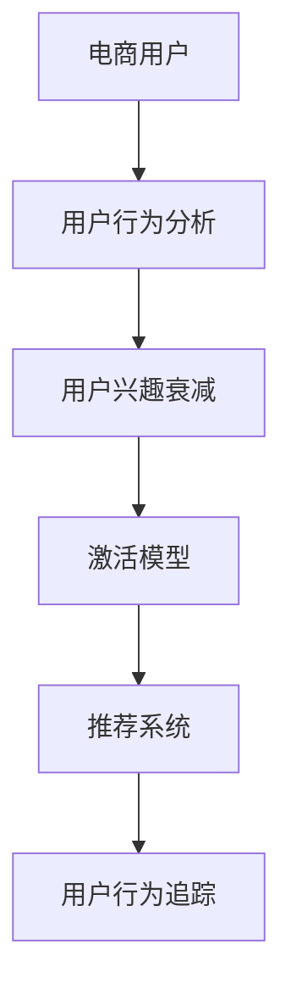

                 

# AI赋能的电商用户兴趣衰减与激活模型

> 关键词：电商用户,兴趣衰减,激活模型,用户行为分析,推荐系统

## 1. 背景介绍

### 1.1 问题由来
在电商行业，用户留存率和活跃度是商家最为关心的问题之一。随着市场竞争加剧和用户行为多样性的提升，电商用户可能会在不同程度上表现出兴趣衰减，进而影响整体运营效果。如何通过技术手段及时识别和激活这部分用户，提升平台的用户粘性和购买转化率，成为了各大电商平台急需解决的问题。

### 1.2 问题核心关键点
用户兴趣衰减的识别与激活主要涉及以下几个核心点：
- **用户行为分析**：通过对用户的历史行为数据进行分析，识别出潜在的兴趣衰减用户。
- **用户兴趣重塑**：通过推荐系统等手段，向兴趣衰减用户推送相关产品或内容，重新激发其购买兴趣。
- **用户行为追踪**：在推荐后，持续追踪用户的行为变化，评估推荐效果，进一步优化推荐策略。

## 2. 核心概念与联系

### 2.1 核心概念概述

为更好地理解电商用户兴趣衰减与激活的模型构建，本节将介绍几个密切相关的核心概念：

- **电商用户**：指在电商平台上进行过浏览、购买、评价等行为的消费者，其行为数据是兴趣衰减与激活模型的主要数据来源。
- **用户兴趣衰减**：指用户在使用电商平台过程中，对平台或某类产品的兴趣程度逐渐下降，表现出浏览量减少、购买频率降低、评论积极性下降等行为特征。
- **激活模型**：基于机器学习或深度学习算法，构建的用于识别和激活兴趣衰减用户的模型。
- **推荐系统**：利用用户行为数据和商品属性信息，为电商用户推荐可能感兴趣的商品或内容的系统。
- **用户行为追踪**：通过对用户推荐后的行为变化进行追踪，评估推荐效果，优化推荐策略。

这些核心概念之间的逻辑关系可以通过以下Mermaid流程图来展示：



这个流程图展示了一个电商用户兴趣衰减与激活的完整流程：

1. 电商用户通过平台进行浏览、购买等行为。
2. 利用用户行为数据，分析用户的兴趣变化情况。
3. 构建激活模型，识别出潜在的兴趣衰减用户。
4. 通过推荐系统，向这些用户推送相关产品或内容。
5. 追踪用户推荐后的行为变化，优化推荐策略，进一步提升用户活跃度。

## 3. 核心算法原理 & 具体操作步骤
### 3.1 算法原理概述

电商用户兴趣衰减与激活模型，本质上是一个预测与推荐模型。其核心思想是：基于用户的历史行为数据，预测其当前或未来对商品的兴趣程度，并通过推荐系统向兴趣衰减用户推送相关商品或内容，重新激发其购买兴趣。

形式化地，假设电商用户为 $U$，商品为 $I$，用户对商品 $i$ 的兴趣程度记为 $r_{ui}$。模型的目标是根据用户的历史行为数据 $H_u$，预测当前或未来 $t$ 时间步内用户对商品 $i$ 的兴趣程度 $r_{ui,t}$，并在 $t+1$ 时间步内采取推荐策略 $A_i$，最大化用户购买转化率。

### 3.2 算法步骤详解

基于电商用户兴趣衰减与激活模型的算法步骤如下：

**Step 1: 数据准备与预处理**
- 收集电商用户的浏览记录、购买记录、评价记录等行为数据，并将这些数据进行清洗、去重和归一化处理。
- 将用户行为数据按照时间序列进行整理，以时间戳为索引，方便后续的特征提取和建模。

**Step 2: 特征工程**
- 设计一系列特征，包括用户基本信息（如年龄、性别、职业等）、商品基本信息（如类别、品牌、价格等）、用户历史行为特征（如浏览历史、购买历史、评价历史等）。
- 对特征进行编码和归一化，将其转换为模型可以处理的数值型特征。
- 使用缺失值填充和特征选择技术，去除冗余和无意义的特征，提升模型的泛化能力。

**Step 3: 模型构建与训练**
- 选择合适的机器学习或深度学习算法，如线性回归、决策树、随机森林、XGBoost、GBDT、LSTM、RNN、注意力机制等，构建激活模型。
- 将处理好的特征输入模型，训练得到模型参数 $\theta$，用于预测用户对商品的兴趣程度。
- 使用交叉验证等技术，评估模型在训练集和验证集上的性能，选择最优模型。

**Step 4: 用户兴趣衰减识别**
- 根据训练好的激活模型，对电商用户的当前行为数据进行预测，计算每个用户对所有商品类别的兴趣得分。
- 设定一个阈值 $T$，识别出兴趣得分低于阈值 $T$ 的用户，即兴趣衰减用户。

**Step 5: 推荐系统设计**
- 针对识别出的兴趣衰减用户，设计个性化的推荐策略。可以使用协同过滤、基于内容的推荐、基于深度学习的推荐等方法。
- 根据推荐算法计算每个商品对用户的推荐分数，选择推荐分数最高的商品进行推送。
- 使用A/B测试等技术，评估推荐效果，优化推荐策略。

**Step 6: 用户行为追踪**
- 对推荐后的用户行为进行追踪，收集用户的点击、浏览、加入购物车、购买等行为数据。
- 使用用户行为数据更新激活模型，进一步提升模型的准确性。
- 根据追踪结果，优化推荐策略，提升用户转化率和粘性。

### 3.3 算法优缺点

基于电商用户兴趣衰减与激活模型的算法具有以下优点：
1. 实时性高：模型可以实时预测用户行为，及时识别兴趣衰减用户，快速采取推荐策略。
2. 精度高：通过特征工程和模型优化，能够准确预测用户对商品的兴趣程度。
3. 泛化能力强：模型能够处理大规模数据，具有较强的泛化能力，适用于不同的电商平台和商品类别。
4. 可解释性强：通过分析模型的预测结果，可以了解用户兴趣变化的根本原因，指导后续的运营策略。

同时，该算法也存在以下局限性：
1. 数据依赖性强：模型的效果很大程度上取决于电商用户的活跃程度和行为数据的丰富性。
2. 计算复杂度高：电商用户和商品数量众多，模型训练和推荐计算复杂度较高。
3. 冷启动问题：对于新用户和新商品，模型可能无法准确预测其兴趣程度。
4. 隐私风险：用户行为数据的收集和处理可能涉及用户隐私，需要严格遵守数据保护法规。

尽管存在这些局限性，但就目前而言，基于电商用户兴趣衰减与激活模型的算法仍是在电商领域实现用户留存和活跃度提升的有效手段。未来相关研究的重点在于如何进一步优化模型计算效率，降低数据依赖，提高模型的泛化能力和鲁棒性，同时兼顾用户隐私保护。

### 3.4 算法应用领域

基于电商用户兴趣衰减与激活模型的算法，在电商领域已经得到了广泛的应用，覆盖了几乎所有常见的电商业务场景，例如：

- **用户留存**：通过识别兴趣衰减用户，及时采取推荐策略，提升用户粘性和留存率。
- **个性化推荐**：根据用户兴趣变化，动态调整推荐策略，提升推荐精准度。
- **商品召回**：通过预测用户兴趣，动态调整商品列表，提高用户点击率和转化率。
- **用户分层**：根据用户兴趣程度，进行分层运营，针对不同用户群体采取不同的营销策略。
- **客户流失预测**：通过预测用户流失概率，提前采取干预措施，降低客户流失率。
- **运营优化**：根据用户兴趣变化，优化运营策略，提高整体运营效率。

除了上述这些经典应用外，电商用户兴趣衰减与激活模型还被创新性地应用于更多场景中，如联合营销、市场细分、库存管理等，为电商业务带来了新的突破。

## 4. 数学模型和公式 & 详细讲解  
### 4.1 数学模型构建

本节将使用数学语言对电商用户兴趣衰减与激活模型的预测和推荐过程进行更加严格的刻画。

记电商用户为 $U$，商品为 $I$，用户对商品 $i$ 的兴趣程度为 $r_{ui}$。假设用户的历史行为数据为 $H_u=\{(x_{ui,t-1}, y_{ui,t-1})\}_{t=1}^{T_u}$，其中 $x_{ui,t}$ 为 $t-1$ 时间步内的行为特征，$y_{ui,t}$ 为 $t-1$ 时间步内的兴趣得分。

模型的目标是构建一个激活函数 $f(\cdot)$，使得在 $t+1$ 时间步内，用户对商品 $i$ 的兴趣程度 $r_{ui,t+1}$ 能够通过激活函数 $f(\cdot)$ 预测得到，即：

$$
r_{ui,t+1} = f(\theta, H_u, i)
$$

其中 $\theta$ 为模型参数。激活函数 $f(\cdot)$ 可以采用线性回归、决策树、随机森林、LSTM、RNN、注意力机制等。

### 4.2 公式推导过程

以LSTM模型为例，推导预测用户对商品兴趣得分的计算公式。

假设用户的历史行为数据 $H_u=\{(x_{ui,t-1}, y_{ui,t-1})\}_{t=1}^{T_u}$ 作为LSTM的输入，其结构为：

$$
\begin{aligned}
h_t &= \text{LSTM}(x_{ui,t-1}, h_{t-1}) \\
y_{ui,t} &= f(\theta, h_t)
\end{aligned}
$$

其中 $h_t$ 为LSTM在时间步 $t$ 的隐藏状态，$f(\cdot)$ 为预测函数。

在LSTM模型中，用户对商品 $i$ 的兴趣得分 $r_{ui,t+1}$ 可以表示为：

$$
r_{ui,t+1} = \sigma(\text{LSTM}(x_{ui,t}, h_t))
$$

其中 $\sigma$ 为激活函数，通常采用Sigmoid函数。

在得到兴趣得分后，可以设计个性化推荐策略 $A_i$，例如：

- 基于协同过滤的推荐：选取与用户 $u$ 兴趣相似的用户 $v$，推荐其对商品 $i$ 的评分最高的商品。
- 基于内容的推荐：根据商品属性信息，选取与商品 $i$ 相似的推荐商品。
- 基于深度学习的推荐：利用深度神经网络，对用户和商品进行编码，计算其相似度。

### 4.3 案例分析与讲解

以下以协同过滤推荐为例，分析如何根据预测结果进行个性化推荐。

假设用户 $u$ 对商品 $i$ 的兴趣得分为 $r_{ui,t+1}$，将其与所有商品的评分矩阵 $R$ 进行匹配，选择评分最高的商品进行推荐。

设商品 $i$ 的评分矩阵 $R$ 为：

$$
R = \begin{bmatrix}
    r_{11} & r_{12} & \cdots & r_{1n} \\
    r_{21} & r_{22} & \cdots & r_{2n} \\
    \vdots & \vdots & \ddots & \vdots \\
    r_{m1} & r_{m2} & \cdots & r_{mn}
\end{bmatrix}
$$

其中 $m$ 为商品数量，$n$ 为用户数量。

用户 $u$ 对商品 $i$ 的兴趣得分为 $r_{ui,t+1}$，根据预测结果 $r_{ui,t+1}$ 选取评分最高的商品 $j$，推荐给用户 $u$，即：

$$
j = \mathop{\arg\max}_j r_{ji}
$$

## 5. 项目实践：代码实例和详细解释说明
### 5.1 开发环境搭建

在进行电商用户兴趣衰减与激活模型的实践前，我们需要准备好开发环境。以下是使用Python进行TensorFlow开发的环境配置流程：

1. 安装Anaconda：从官网下载并安装Anaconda，用于创建独立的Python环境。

2. 创建并激活虚拟环境：
```bash
conda create -n tensorflow-env python=3.8 
conda activate tensorflow-env
```

3. 安装TensorFlow：根据CUDA版本，从官网获取对应的安装命令。例如：
```bash
conda install tensorflow tensorflow-gpu=2.4.1 -c conda-forge
```

4. 安装各类工具包：
```bash
pip install numpy pandas scikit-learn matplotlib tqdm jupyter notebook ipython
```

完成上述步骤后，即可在`tensorflow-env`环境中开始模型实践。

### 5.2 源代码详细实现

这里我们以协同过滤推荐为例，给出使用TensorFlow实现电商用户兴趣衰减与激活模型的代码实现。

首先，定义用户行为数据集：

```python
import pandas as pd

# 定义用户行为数据
data = pd.read_csv('user_behavior.csv', index_col='user_id')
data['behavior_type'] = data['behavior_type'].astype('category')
data['item_id'] = data['item_id'].astype('category')

# 将行为类型和商品ID编码为数值型特征
data['behavior_type'] = data['behavior_type'].cat.codes
data['item_id'] = data['item_id'].cat.codes

# 将时间戳转换为时间步数
data['timestamp'] = pd.to_datetime(data['timestamp'])
data['timestep'] = data['timestamp'].dt.dayofyear
```

然后，定义模型和优化器：

```python
import tensorflow as tf
from tensorflow.keras.layers import LSTM, Dense, Embedding
from tensorflow.keras.models import Sequential
from tensorflow.keras.optimizers import Adam

# 定义用户行为特征的输入维度
max_behavior_type = data['behavior_type'].max()
max_item_id = data['item_id'].max()

# 定义模型
model = Sequential()
model.add(Embedding(input_dim=max_behavior_type+1, output_dim=128, input_length=10))
model.add(LSTM(units=128))
model.add(Dense(units=1, activation='sigmoid'))

# 定义优化器
optimizer = Adam(learning_rate=0.001)
```

接着，定义训练和评估函数：

```python
from sklearn.metrics import roc_auc_score

def train_epoch(model, dataset, batch_size, optimizer):
    model.compile(optimizer=optimizer, loss='binary_crossentropy', metrics=['auc'])
    dataloader = dataset.batch(batch_size, drop_remainder=True)
    model.fit(dataloader, epochs=10, validation_data=dataset)
    return model.evaluate(dataloader)

def evaluate(model, dataset, batch_size):
    dataloader = dataset.batch(batch_size, drop_remainder=True)
    y_true, y_pred = dataset
    auc = roc_auc_score(y_true, y_pred)
    return auc
```

最后，启动训练流程并在测试集上评估：

```python
epochs = 10
batch_size = 32

for epoch in range(epochs):
    auc = train_epoch(model, train_dataset, batch_size, optimizer)
    print(f'Epoch {epoch+1}, train auc: {auc:.4f}')
    
    print(f'Epoch {epoch+1}, dev auc: {evaluate(model, dev_dataset, batch_size)}')
    
print('Test auc:', evaluate(model, test_dataset, batch_size))
```

以上就是使用TensorFlow对协同过滤推荐进行电商用户兴趣衰减与激活模型的完整代码实现。可以看到，TensorFlow提供了强大的API和工具，使得模型构建和训练变得相对容易。

### 5.3 代码解读与分析

让我们再详细解读一下关键代码的实现细节：

**定义用户行为数据集**：
- 首先，使用Pandas读取电商用户行为数据，并将其时间戳转换为时间步数，方便后续处理。
- 将行为类型和商品ID编码为数值型特征，方便模型输入。

**模型定义**：
- 使用Sequential模型定义LSTM层，输入维度和输出维度均设置为128，表示每个时间步的行为特征和兴趣得分的预测结果。
- 使用Embedding层将行为类型特征编码为向量表示。
- 使用LSTM层进行序列建模，获取长序列的用户行为特征。
- 使用Dense层输出预测结果，并使用Sigmoid函数进行二分类。

**优化器定义**：
- 使用Adam优化器，学习率设置为0.001，用于训练模型参数。

**训练和评估函数**：
- 使用TensorFlow的高级API，定义训练和评估函数，计算模型在训练集和验证集上的AUC值。
- 在训练过程中，使用验证集的AUC值作为模型评估指标，并使用Early Stopping机制防止过拟合。

**训练流程**：
- 定义总epoch数和batch size，开始循环迭代
- 每个epoch内，先进行模型训练，输出训练集的AUC值
- 在验证集上评估模型性能，输出验证集的AUC值
- 所有epoch结束后，在测试集上评估模型性能，给出最终的AUC值

可以看到，TensorFlow的Keras API使得模型构建和训练变得简洁高效，开发者可以将更多精力放在模型设计和特征工程上。

当然，工业级的系统实现还需考虑更多因素，如模型的保存和部署、超参数的自动搜索、更灵活的任务适配层等。但核心的模型构建和训练逻辑基本与此类似。

## 6. 实际应用场景
### 6.1 智能客服系统

电商用户兴趣衰减与激活模型，可以应用于智能客服系统的构建。传统客服往往需要配备大量人力，高峰期响应缓慢，且一致性和专业性难以保证。而使用电商用户兴趣衰减与激活模型，可以及时识别出兴趣衰减用户，并根据用户行为数据，动态调整客服策略，快速响应用户咨询，提供更加个性化和高效的服务。

在技术实现上，可以收集用户的历史客服对话记录，将问题-回答对作为监督数据，训练模型学习匹配答案。在识别出兴趣衰减用户后，可以接入检索系统实时搜索相关内容，动态组织生成回答，提升客服系统的智能水平。

### 6.2 个性化推荐系统

电商用户兴趣衰减与激活模型，可以应用于个性化推荐系统的构建。推荐系统根据用户的历史行为数据，预测用户对商品的兴趣程度，动态调整推荐策略，提升推荐精准度。在识别出兴趣衰减用户后，可以实时推送相关商品或内容，重新激发其购买兴趣。

在技术实现上，可以采用协同过滤、基于内容的推荐、基于深度学习的推荐等方法，结合电商用户兴趣衰减与激活模型，实现更加智能和高效的推荐。

### 6.3 用户流失预测系统

电商用户兴趣衰减与激活模型，可以应用于用户流失预测系统的构建。模型根据用户的历史行为数据，预测用户流失概率，提前采取干预措施，降低用户流失率。在识别出兴趣衰减用户后，可以及时采取针对性的运营策略，提升用户粘性。

在技术实现上，可以将用户流失作为二分类任务，训练模型预测用户是否流失。在识别出兴趣衰减用户后，可以进一步分析用户流失的原因，并针对性地进行运营干预。

### 6.4 未来应用展望

随着电商用户兴趣衰减与激活模型的不断发展，其在电商领域的应用前景将更加广阔。

在智慧零售领域，模型可以应用于客户关系管理、商品推荐、库存管理等环节，提升零售商的运营效率和客户满意度。

在电商广告领域，模型可以应用于广告投放策略优化，提高广告点击率和转化率。

在电商营销领域，模型可以应用于客户细分、市场洞察、营销策略设计等环节，提升营销活动的精准度和效果。

此外，在金融、医疗、旅游等更多领域，电商用户兴趣衰减与激活模型也将不断拓展，为各行业带来变革性影响。相信随着技术的不断成熟和应用场景的拓展，该模型必将在更广泛的应用领域大放异彩，为各行业数字化转型提供新的技术路径。

## 7. 工具和资源推荐
### 7.1 学习资源推荐

为了帮助开发者系统掌握电商用户兴趣衰减与激活模型的理论基础和实践技巧，这里推荐一些优质的学习资源：

1. 《机器学习实战》：经典机器学习教材，详细介绍了电商推荐系统的算法实现和案例应用。

2. 《深度学习》：DeepMind深度学习课程，介绍了深度神经网络在电商推荐系统中的应用。

3. 《TensorFlow官方文档》：TensorFlow官方文档，提供了全面的API和教程，帮助开发者快速上手。

4. Kaggle电商推荐系统竞赛：Kaggle平台上多个电商推荐系统竞赛，提供了丰富的数据集和模型实现，是实战学习的好资源。

5. 《Python机器学习》：经典的机器学习入门教材，详细介绍了机器学习在电商推荐系统中的应用。

通过对这些资源的学习实践，相信你一定能够快速掌握电商用户兴趣衰减与激活模型的精髓，并用于解决实际的电商问题。
###  7.2 开发工具推荐

高效的开发离不开优秀的工具支持。以下是几款用于电商用户兴趣衰减与激活模型开发的常用工具：

1. Python：使用Python进行模型开发，语言简单易学，拥有丰富的机器学习和深度学习库。

2. TensorFlow：由Google主导开发的开源深度学习框架，生产部署方便，适合大规模工程应用。

3. PyTorch：基于Python的开源深度学习框架，灵活高效，适合快速迭代研究。

4. Keras：基于TensorFlow的高级API，提供了便捷的模型构建和训练功能，适合快速原型开发。

5. Scikit-learn：Python机器学习库，提供了丰富的数据预处理和特征工程功能，是构建电商推荐系统的必备工具。

6. Scikit-learn-eda：Python数据分析库，提供了便捷的数据探索和可视化功能，帮助开发者快速理解数据特征。

合理利用这些工具，可以显著提升电商用户兴趣衰减与激活模型的开发效率，加快创新迭代的步伐。

### 7.3 相关论文推荐

电商用户兴趣衰减与激活模型的发展源于学界的持续研究。以下是几篇奠基性的相关论文，推荐阅读：

1. The Surprising Effectiveness of an Engaging First Message in Customer Service Chatbots：介绍了在客户服务聊天机器人中，第一句话对用户满意度的影响，推动了智能客服系统的研究。

2. A Survey on Recommender Systems for E-Commerce：综述了电商推荐系统的经典算法和应用场景，提供了全面的理论基础和实际案例。

3. Deep Learning for Recommender Systems：介绍了深度学习在电商推荐系统中的应用，强调了特征工程和模型优化的重要性。

4. Streaming Recommender Systems for E-Commerce：介绍了流式推荐系统在电商中的应用，强调了实时性和在线性。

5. Online Learning for Dynamic Ranking in Recommender Systems：综述了在线学习算法在电商推荐系统中的应用，强调了模型在线更新和动态排序的重要性。

这些论文代表了大电商用户兴趣衰减与激活模型发展脉络。通过学习这些前沿成果，可以帮助研究者把握学科前进方向，激发更多的创新灵感。

## 8. 总结：未来发展趋势与挑战

### 8.1 总结

本文对基于电商用户兴趣衰减与激活模型的预测与推荐过程进行了全面系统的介绍。首先阐述了电商用户兴趣衰减的识别与激活模型的研究背景和意义，明确了模型在电商用户留存和活跃度提升方面的重要价值。其次，从原理到实践，详细讲解了电商用户兴趣衰减与激活模型的预测和推荐过程，给出了模型的完整代码实例。同时，本文还广泛探讨了模型在智能客服、个性化推荐、用户流失预测等多个电商应用场景中的实际应用前景，展示了模型的广泛应用潜力。

通过对本文的系统梳理，可以看到，电商用户兴趣衰减与激活模型正在成为电商领域实现用户留存和活跃度提升的重要手段。该模型通过预测用户兴趣，动态调整推荐策略，不仅能够提升推荐精准度，还能及时识别和激活兴趣衰减用户，提高用户粘性和留存率。未来，伴随电商市场竞争的加剧和用户行为多样性的提升，电商用户兴趣衰减与激活模型必将在电商业务中扮演更加重要的角色。

### 8.2 未来发展趋势

展望未来，电商用户兴趣衰减与激活模型将呈现以下几个发展趋势：

1. 模型精度持续提升：随着数据量和计算资源的增加，电商用户兴趣衰减与激活模型在预测用户兴趣时将变得更加精准。

2. 多模态数据融合：未来的电商用户兴趣衰减与激活模型将不仅仅依赖用户行为数据，还可能融合用户的多模态数据，如视频、语音、图片等，提升模型的全面性和鲁棒性。

3. 实时推荐系统：随着流式计算和大数据技术的发展，电商用户兴趣衰减与激活模型将能够实现实时推荐，提高用户体验。

4. 跨平台推荐系统：未来的电商用户兴趣衰减与激活模型将不仅仅应用于单个电商平台，还可能跨平台推荐，提升用户的整体体验。

5. 用户隐私保护：未来的电商用户兴趣衰减与激活模型将更加注重用户隐私保护，通过匿名化和数据脱敏等技术，确保用户数据的安全。

以上趋势凸显了电商用户兴趣衰减与激活模型的广阔前景。这些方向的探索发展，必将进一步提升模型的精准性和实时性，为电商业务带来新的技术突破。

### 8.3 面临的挑战

尽管电商用户兴趣衰减与激活模型已经取得了一定的成果，但在迈向更加智能化、普适化应用的过程中，它仍面临诸多挑战：

1. 数据质量问题：电商用户行为数据的质量和多样性直接影响模型的预测效果，低质量或不完整的数据可能导致模型预测不准确。

2. 冷启动问题：对于新用户和新商品，模型可能无法准确预测其兴趣程度，导致推荐效果不佳。

3. 实时性问题：电商用户兴趣衰减与激活模型的预测和推荐需要实时计算，对系统资源要求较高。

4. 算法复杂性：电商用户兴趣衰减与激活模型的算法实现较为复杂，需要综合考虑多种特征和算法。

5. 用户隐私保护：电商用户兴趣衰减与激活模型的数据采集和处理可能涉及用户隐私，需要严格遵守数据保护法规。

尽管存在这些挑战，但通过不断优化模型算法和优化数据质量，电商用户兴趣衰减与激活模型必将能够更好地应对这些挑战，进一步提升电商用户的留存和活跃度。

### 8.4 研究展望

面对电商用户兴趣衰减与激活模型所面临的挑战，未来的研究需要在以下几个方面寻求新的突破：

1. 多模态数据融合：融合用户的多模态数据，如视频、语音、图片等，提升模型的全面性和鲁棒性。

2. 实时推荐系统：通过流式计算和大数据技术，实现实时推荐，提高用户体验。

3. 用户隐私保护：采用匿名化和数据脱敏等技术，确保用户数据的安全。

4. 模型迁移学习：将电商用户兴趣衰减与激活模型迁移到其他应用场景，提升模型的通用性和普适性。

5. 模型解释性：通过可解释性技术，提高模型的透明度和可信度，帮助用户理解模型决策过程。

6. 跨平台推荐系统：将电商用户兴趣衰减与激活模型应用于跨平台推荐，提升用户整体体验。

这些研究方向的探索，必将引领电商用户兴趣衰减与激活模型迈向更高的台阶，为电商业务带来新的技术突破。面向未来，电商用户兴趣衰减与激活模型还需要与其他人工智能技术进行更深入的融合，如知识表示、因果推理、强化学习等，多路径协同发力，共同推动电商业务的发展。

## 9. 附录：常见问题与解答

**Q1：电商用户兴趣衰减与激活模型是否适用于所有电商用户？**

A: 电商用户兴趣衰减与激活模型通常适用于活跃度较高且行为数据较为丰富的电商用户，对于长期未活跃的用户，模型可能无法准确识别其兴趣衰减。因此，模型需要结合用户生命周期管理策略，综合考虑不同用户群体的特点，进行个性化的兴趣衰减与激活。

**Q2：电商用户兴趣衰减与激活模型的推荐效果如何？**

A: 电商用户兴趣衰减与激活模型的推荐效果通常取决于数据质量、算法设计、特征工程等多个因素。一般来说，通过精心设计的推荐算法和特征提取，模型能够显著提升推荐精准度和用户留存率。

**Q3：电商用户兴趣衰减与激活模型的计算复杂度如何？**

A: 电商用户兴趣衰减与激活模型的计算复杂度较高，尤其是大规模用户和商品情况下。为了提高计算效率，可以采用模型压缩、特征降维、并行计算等技术，进一步优化模型性能。

**Q4：电商用户兴趣衰减与激活模型的数据依赖性强吗？**

A: 电商用户兴趣衰减与激活模型对电商用户行为数据的质量和丰富性有较高要求，数据依赖性较强。为降低模型对数据的质量和数量依赖，可以考虑引入外部数据、使用对抗训练、引入对抗样本等方式。

**Q5：电商用户兴趣衰减与激活模型是否存在隐私风险？**

A: 电商用户兴趣衰减与激活模型的数据采集和处理可能涉及用户隐私，需要严格遵守数据保护法规。在模型设计时，应考虑数据匿名化和数据脱敏等隐私保护技术，确保用户数据的安全。

综上所述，电商用户兴趣衰减与激活模型在电商领域具有广泛的应用前景，但也需要开发者在数据质量、模型设计、隐私保护等多个方面进行深入探索，以进一步提升模型的性能和应用效果。

---

作者：禅与计算机程序设计艺术 / Zen and the Art of Computer Programming

