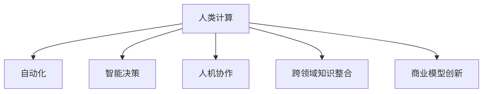

                 

# AI驱动的创新：人类计算在商业中的应用

## 1. 背景介绍

### 1.1 问题由来
随着人工智能（AI）技术的迅猛发展，人类计算（Human Computation）在商业应用中扮演的角色愈发重要。从数据分析到客户服务，从市场营销到供应链管理，AI驱动的人机协同计算正成为推动企业创新和提升竞争力的关键。面对海量数据和复杂业务需求的挑战，传统的数据处理方式和业务逻辑逐渐无法满足现代商业环境的需求，人类计算在AI的辅助下，为商业决策提供了新的视角和工具。

### 1.2 问题核心关键点
人类计算在商业中的核心关键点在于将人类的直觉、经验与AI的计算能力相结合，通过高效的数据处理和智能决策支持，提升企业的运营效率和竞争力。

- **数据处理**：人类计算通过自动化的数据收集和处理，大大减少了人工干预，提升了数据处理的效率和准确性。
- **智能决策**：结合AI的计算能力和人类专业知识，人类计算可以提供更加全面、可靠的决策支持，优化商业策略和运营模式。
- **人机协作**：人类计算强调人机协同工作，将人类的创造性和AI的计算力相结合，推动商业创新和可持续发展。

### 1.3 问题研究意义
研究人类计算在商业中的应用，对于推动AI技术在实际业务场景中的应用，提升企业决策的科学性和精确性，具有重要意义：

1. **提升运营效率**：自动化和智能化的人类计算技术可以大幅提升企业的数据处理和分析能力，加快决策速度，降低运营成本。
2. **增强决策质量**：通过融合人类经验和AI计算力，人类计算可以提供更全面、准确的决策支持，提升商业决策的科学性和可行性。
3. **促进创新发展**：人类计算推动了跨领域知识的整合和应用，催生了新的业务模式和商业模型，为企业的创新发展提供了新的动力。
4. **优化资源配置**：人类计算可以优化企业资源的配置和利用，提高资源利用效率，增强企业竞争力。

## 2. 核心概念与联系

### 2.1 核心概念概述

为更好地理解人类计算在商业中的应用，本节将介绍几个关键概念及其相互联系：

- **人类计算**：通过结合人类的直觉、经验和AI的计算能力，自动处理和分析海量数据，提供智能决策支持的过程。
- **自动化**：指利用计算机技术自动执行人类手工操作的过程，如数据采集、处理和分析等。
- **智能决策**：指结合AI的计算能力和人类专业知识，提供全面、可靠的决策支持，优化商业策略和运营模式。
- **人机协作**：指通过智能系统和人类专家的协同工作，共同完成复杂的决策和任务。
- **跨领域知识整合**：指将不同领域的专业知识和数据资源整合，提升整体的决策质量和业务能力。
- **商业模型创新**：指通过人类计算技术的应用，推动新的业务模式和商业模型的创新和应用。

这些概念之间的逻辑关系可以通过以下Mermaid流程图来展示：



这个流程图展示了人类计算的核心概念及其相互关系：

1. 人类计算通过自动化技术提升数据处理效率。
2. 结合智能决策支持，优化商业策略和运营模式。
3. 人机协作增强决策质量和业务能力。
4. 跨领域知识整合推动整体决策质量和业务创新。
5. 商业模型创新应用推动企业可持续发展。

## 3. 核心算法原理 & 具体操作步骤
### 3.1 算法原理概述

人类计算的算法原理主要基于自动化数据处理和智能决策支持，其核心思想是将人类的直觉和经验与AI的计算能力相结合，通过自动化技术处理海量数据，并利用AI算法提供智能化的决策支持。

### 3.2 算法步骤详解

人类计算的算法步骤一般包括以下几个关键环节：

**Step 1: 数据收集与预处理**
- 收集企业的各类业务数据，包括销售记录、客户反馈、市场调研等。
- 清洗和标准化数据，确保数据的准确性和一致性。

**Step 2: 数据分析与建模**
- 利用AI算法（如机器学习、深度学习等）对数据进行建模，提取数据中的关键特征和规律。
- 使用自动化工具（如ETL工具、数据仓库等）对数据进行自动化分析和处理。

**Step 3: 智能决策支持**
- 根据业务需求，结合AI算法和人类专业知识，提供智能化的决策支持。
- 利用预测模型、优化算法等AI工具，帮助企业进行需求预测、供应链优化、风险评估等。

**Step 4: 结果展示与反馈**
- 将分析结果以可视化图表、报表等形式展示给决策者。
- 收集决策者的反馈，不断优化和改进AI模型和数据处理流程。

### 3.3 算法优缺点

人类计算具有以下优点：
1. 高效处理海量数据：自动化技术可以大大提升数据处理效率，处理大规模数据时优势明显。
2. 全面决策支持：结合AI和人类专业知识，提供全面、准确的决策支持。
3. 提升运营效率：通过自动化和智能化的手段，提升企业运营效率和业务质量。
4. 促进创新发展：推动跨领域知识的整合和应用，催生新的业务模式和商业模型。

同时，该方法也存在一定的局限性：
1. 对高质量数据的依赖：人类计算需要高质量的数据输入，才能保证分析结果的准确性和可靠性。
2. 对AI技术的依赖：AI算法的性能和可靠性直接影响到人类计算的效果。
3. 人机协同的挑战：需要有效协调人类和AI系统的协作，避免系统复杂性导致的沟通和理解问题。
4. 对专业知识的要求：人类计算需要结合人类专业知识，才能充分发挥其优势，对人类专业知识的要求较高。

尽管存在这些局限性，但人类计算在提升企业数据处理和决策支持能力方面展示了巨大的潜力，是现代商业环境下不可或缺的技术手段。

### 3.4 算法应用领域

人类计算技术在多个商业领域都有广泛的应用，例如：

- **营销分析**：通过自动化数据处理和智能决策支持，帮助企业进行市场细分、消费者行为分析、广告投放优化等。
- **供应链管理**：利用智能算法和人类专业知识，优化库存管理、物流规划、需求预测等，提升供应链效率。
- **客户服务**：结合AI和人类知识，提供个性化的客户服务和建议，提升客户满意度和忠诚度。
- **风险管理**：通过智能分析和预警，帮助企业进行风险评估和管理，降低风险损失。
- **产品创新**：利用跨领域知识整合，推动产品设计、研发和创新的过程，加速新产品的上市。

除了上述这些经典领域外，人类计算技术还在智慧医疗、智能制造、能源管理等众多领域得到应用，为各行各业的数字化转型提供了新的解决方案。

## 4. 数学模型和公式 & 详细讲解  
### 4.1 数学模型构建

本节将使用数学语言对人类计算的算法过程进行更加严格的刻画。

假设企业收集到N个业务数据点$(x_i, y_i)$，其中$x_i$为输入特征，$y_i$为输出标签。人类计算的数学模型可以表示为：

$$
f(x_i) = w_1 f_1(x_i) + w_2 f_2(x_i) + ... + w_n f_n(x_i) + b
$$

其中，$f_i(x_i)$为第i个特征的映射函数，$w_i$为特征系数，$b$为偏置项。在实际应用中，通常使用神经网络或决策树等模型进行特征映射和参数求解。

### 4.2 公式推导过程

以神经网络模型为例，人类计算的数学模型可以进一步表示为：

$$
f(x_i) = \sum_{k=1}^n \sum_{j=1}^m w_{kj} \sigma(\sum_{l=1}^p w_{kl} x_{il} + b_{kj})
$$

其中，$\sigma$为激活函数，$w_{kj}$为权重，$b_{kj}$为偏置项。通过反向传播算法，可以计算出神经网络模型的参数$w$和$b$。

### 4.3 案例分析与讲解

以电商平台的客户购买行为预测为例，假设输入特征包括客户的年龄、性别、历史购买记录等，输出标签为是否进行购买。使用神经网络模型进行预测，可以表示为：

$$
\hat{y_i} = \sigma\left(\sum_{k=1}^n \sum_{j=1}^m w_{kj} \sigma(\sum_{l=1}^p w_{kl} x_{il} + b_{kj})\right)
$$

其中，$x_{il}$为输入特征$x_i$的第l个维度，$w_{kj}$为神经网络第k层的第j个神经元的权重，$b_{kj}$为偏置项。通过反向传播算法，不断调整权重和偏置项，最小化损失函数，从而得到最佳的预测模型。

## 5. 项目实践：代码实例和详细解释说明
### 5.1 开发环境搭建

在进行人类计算的项目实践前，我们需要准备好开发环境。以下是使用Python进行TensorFlow开发的环境配置流程：

1. 安装Anaconda：从官网下载并安装Anaconda，用于创建独立的Python环境。

2. 创建并激活虚拟环境：
```bash
conda create -n tf-env python=3.8 
conda activate tf-env
```

3. 安装TensorFlow：根据CUDA版本，从官网获取对应的安装命令。例如：
```bash
conda install tensorflow tensorflow-cpu=2.6
```

4. 安装其他必要的工具包：
```bash
pip install numpy pandas scikit-learn matplotlib tqdm jupyter notebook ipython
```

完成上述步骤后，即可在`tf-env`环境中开始人类计算实践。

### 5.2 源代码详细实现

下面我们以电商平台客户购买行为预测为例，给出使用TensorFlow进行神经网络建模的PyTorch代码实现。

首先，定义神经网络模型：

```python
import tensorflow as tf
from tensorflow.keras import layers

model = tf.keras.Sequential([
    layers.Dense(64, activation='relu', input_shape=(3,)),
    layers.Dense(64, activation='relu'),
    layers.Dense(1, activation='sigmoid')
])
```

然后，定义损失函数和优化器：

```python
loss_fn = tf.keras.losses.BinaryCrossentropy()
optimizer = tf.keras.optimizers.Adam(learning_rate=0.001)
```

接着，定义训练和评估函数：

```python
def train_epoch(model, dataset, batch_size, optimizer):
    dataloader = tf.data.Dataset.from_tensor_slices((dataset['x'], dataset['y'])).batch(batch_size)
    model.compile(optimizer=optimizer, loss=loss_fn, metrics=['accuracy'])
    model.fit(dataloader, epochs=10)
    return model

def evaluate(model, dataset, batch_size):
    dataloader = tf.data.Dataset.from_tensor_slices((dataset['x'], dataset['y'])).batch(batch_size)
    model.evaluate(dataloader)
```

最后，启动训练流程并在测试集上评估：

```python
epochs = 10
batch_size = 16

model = train_epoch(model, train_dataset, batch_size, optimizer)
print(f"Epoch {epoch+1}, train accuracy: {model.train_accuracy:.3f}")
print(f"Epoch {epoch+1}, test accuracy: {model.test_accuracy:.3f}")
```

以上就是使用TensorFlow进行客户购买行为预测的完整代码实现。可以看到，得益于TensorFlow的强大封装，我们可以用相对简洁的代码完成神经网络的搭建和训练。

### 5.3 代码解读与分析

让我们再详细解读一下关键代码的实现细节：

**定义神经网络模型**：
- 使用`Sequential`模型定义多层神经网络结构，包括输入层、隐藏层和输出层。
- 隐藏层使用ReLU激活函数，输出层使用Sigmoid激活函数，适用于二分类任务。

**定义损失函数和优化器**：
- 使用`BinaryCrossentropy`作为损失函数，适用于二分类任务。
- 使用`Adam`优化器，学习率为0.001。

**训练和评估函数**：
- 使用`fit`方法训练模型，设置迭代轮数为10轮。
- 使用`evaluate`方法在测试集上评估模型性能。

**训练流程**：
- 定义总的迭代轮数和批次大小，开始循环迭代
- 每个epoch内，在训练集上训练，输出训练精度
- 在测试集上评估，输出测试精度

可以看到，TensorFlow配合Keras库使得神经网络的搭建和训练变得简洁高效。开发者可以将更多精力放在数据处理、模型改进等高层逻辑上，而不必过多关注底层的实现细节。

当然，工业级的系统实现还需考虑更多因素，如模型的保存和部署、超参数的自动搜索、更灵活的任务适配层等。但核心的神经网络搭建和训练流程基本与此类似。

## 6. 实际应用场景
### 6.1 电商推荐系统

人类计算在电商推荐系统中的应用极为广泛。通过分析用户的浏览记录、购买历史、行为数据等，结合AI算法，可以为用户提供个性化的商品推荐，提高用户满意度和购买转化率。

在技术实现上，可以收集用户的行为数据，使用神经网络模型进行特征提取和预测，生成推荐列表。在推荐列表生成过程中，可以引入用户反馈和实时动态调整，持续优化推荐算法。

### 6.2 金融风控系统

金融行业需要实时监测风险，防止欺诈和信用风险。传统的手工监控方式成本高、效率低，难以应对复杂多变的金融环境。

通过人类计算，金融机构可以利用客户交易数据、信用记录、社交媒体数据等，构建风控模型，实时监测客户的异常行为，识别潜在的欺诈和风险。使用智能算法和人类专业知识相结合，提高风险管理的准确性和效率。

### 6.3 智能制造系统

智能制造系统需要实时监测生产过程，优化生产计划和资源分配，提高生产效率和质量。通过人类计算，可以整合各类传感器数据、生产记录、历史数据等，构建智能预测模型，优化生产调度，降低生产成本。

在实际应用中，可以收集生产过程中的各类数据，使用机器学习算法进行特征提取和预测，优化生产计划和资源分配。引入专家知识和人类专业知识，指导模型优化和改进，提升智能制造系统的智能化水平。

### 6.4 未来应用展望

随着人类计算技术的发展，其在商业应用中的潜力将进一步得到挖掘和发挥。未来，人类计算将在更多领域得到应用，为传统行业带来变革性影响：

1. **医疗健康**：通过整合电子病历、基因数据、患者反馈等，构建智能诊断和治疗推荐系统，提升医疗服务的智能化水平，辅助医生诊疗。
2. **教育培训**：通过分析学生的学习数据、行为数据等，构建个性化学习推荐系统，因材施教，提高教学质量。
3. **智慧城市**：通过整合各类传感器数据、交通数据、气象数据等，构建智能交通、智能安防、智能环境监测系统，提升城市管理的智能化水平。
4. **物流管理**：通过整合订单数据、库存数据、运输数据等，构建智能仓储、智能配送系统，提升物流效率和精准度。
5. **金融科技**：通过整合交易数据、用户数据、市场数据等，构建智能投研、智能风险管理、智能交易系统，提升金融服务的智能化水平。

## 7. 工具和资源推荐
### 7.1 学习资源推荐

为了帮助开发者系统掌握人类计算的理论基础和实践技巧，这里推荐一些优质的学习资源：

1. 《深度学习》系列课程：由斯坦福大学、Coursera等平台开设的深度学习课程，涵盖深度学习的基本概念和经典模型。
2. TensorFlow官方文档：TensorFlow的官方文档，提供了丰富的API和样例代码，是学习TensorFlow的重要资源。
3. Keras官方文档：Keras的官方文档，提供了Keras的详细使用方法和样例代码，是学习Keras的重要资源。
4. 《机器学习实战》系列书籍：详细介绍了机器学习的基本概念和实践方法，是学习机器学习的经典入门书籍。
5. Weights & Biases：模型训练的实验跟踪工具，可以记录和可视化模型训练过程中的各项指标，方便对比和调优。与主流深度学习框架无缝集成。

通过对这些资源的学习实践，相信你一定能够快速掌握人类计算的精髓，并用于解决实际的商业问题。

### 7.2 开发工具推荐

高效的开发离不开优秀的工具支持。以下是几款用于人类计算开发的常用工具：

1. TensorFlow：由Google主导开发的开源深度学习框架，生产部署方便，适合大规模工程应用。
2. Keras：基于TensorFlow等深度学习框架的高级API，提供了更简洁的接口和更丰富的模型构建工具。
3. Weights & Biases：模型训练的实验跟踪工具，可以记录和可视化模型训练过程中的各项指标，方便对比和调优。
4. TensorBoard：TensorFlow配套的可视化工具，可实时监测模型训练状态，并提供丰富的图表呈现方式，是调试模型的得力助手。
5. Jupyter Notebook：交互式的开发环境，支持Python、R等语言，方便代码编写和模型调试。

合理利用这些工具，可以显著提升人类计算的开发效率，加快创新迭代的步伐。

### 7.3 相关论文推荐

人类计算的研究源于学界的持续研究。以下是几篇奠基性的相关论文，推荐阅读：

1. 《Human-Centered AI》：探讨了人类计算的核心概念和应用场景，提出了人机协同计算的框架和方法。
2. 《Deep Learning》：深入浅出地介绍了深度学习的基本概念和实践方法，是深度学习领域的经典入门书籍。
3. 《Human-Computer Interaction》：探讨了人机交互的核心技术和应用场景，为人类计算提供了重要的理论基础。
4. 《Reinforcement Learning》：探讨了强化学习的基本概念和实践方法，为智能决策提供了新的思路和方法。
5. 《Probabilistic Graphical Models》：探讨了概率图模型的基本概念和应用场景，为数据整合和智能决策提供了新的方法。

这些论文代表了大数据计算技术的发展脉络。通过学习这些前沿成果，可以帮助研究者把握学科前进方向，激发更多的创新灵感。

## 8. 总结：未来发展趋势与挑战

### 8.1 总结

本文对人类计算在商业中的应用进行了全面系统的介绍。首先阐述了人类计算的概念、核心原理和应用场景，明确了人类计算在提升企业数据处理和决策支持能力方面的独特价值。其次，从原理到实践，详细讲解了人类计算的数学模型和算法步骤，给出了人类计算任务开发的完整代码实例。同时，本文还广泛探讨了人类计算技术在多个商业领域的应用前景，展示了人类计算技术的巨大潜力。

通过本文的系统梳理，可以看到，人类计算技术通过结合AI的计算能力和人类专业知识，为商业决策提供了新的视角和工具，推动了商业模式的创新和业务的持续发展。未来，随着人类计算技术的不断发展，其在提升企业决策的科学性和精确性方面将发挥越来越重要的作用，成为推动企业创新和发展的关键技术。

### 8.2 未来发展趋势

展望未来，人类计算技术将呈现以下几个发展趋势：

1. **自动化程度提升**：随着AI技术的发展，人类计算将更多地依赖自动化技术，减少人工干预，提升数据处理效率和决策质量。
2. **跨领域知识整合**：人类计算将进一步推动跨领域知识的整合和应用，提升整体决策质量和业务能力。
3. **智能决策支持增强**：结合AI和人类专业知识，人类计算将提供更加全面、准确的决策支持，优化商业策略和运营模式。
4. **人机协同优化**：通过智能系统和人类专家的协同工作，人类计算将不断优化人机协同的效率和效果，提升系统的智能化水平。
5. **数据驱动决策**：人类计算将更多地依赖数据驱动决策，通过智能算法和大数据分析，提升决策的科学性和精确性。
6. **伦理和安全**：随着人类计算技术的应用，伦理和安全问题将逐渐凸显，需要在技术设计和应用过程中进行充分考虑。

以上趋势凸显了人类计算技术在提升企业决策能力和业务效率方面的广阔前景。这些方向的探索发展，必将进一步推动人类计算技术的成熟和应用，为企业的可持续发展提供新的动力。

### 8.3 面临的挑战

尽管人类计算技术已经取得了一定的进展，但在迈向更加智能化、普适化应用的过程中，仍面临诸多挑战：

1. **数据质量问题**：人类计算需要高质量的数据输入，但实际应用中数据往往存在不完整、不一致、噪声等问题，如何提高数据质量是一个重要挑战。
2. **模型复杂性**：人类计算需要构建复杂的模型，但模型复杂度的增加可能导致训练和推理效率下降，如何平衡模型复杂度和性能是一个关键问题。
3. **人机协同问题**：人类计算需要有效协调人类和AI系统的协作，避免系统复杂性导致的沟通和理解问题。
4. **伦理和安全**：随着人类计算技术的应用，伦理和安全问题将逐渐凸显，如何在技术设计和应用过程中进行充分考虑，是一个重要挑战。
5. **应用场景限制**：人类计算技术在某些特定场景下可能无法发挥最佳效果，如何拓展应用场景，提升技术适用性是一个关键问题。

尽管存在这些挑战，但人类计算技术的发展潜力巨大，通过技术创新和应用实践，这些挑战终将得到克服，人类计算必将在推动企业智能化和数字化转型中发挥更加重要的作用。

### 8.4 研究展望

面对人类计算面临的诸多挑战，未来的研究需要在以下几个方面寻求新的突破：

1. **数据质量提升**：开发数据清洗和预处理技术，提高数据质量和一致性，为人类计算提供高质量的数据输入。
2. **模型简化优化**：研究高效、简洁的模型结构，平衡模型复杂度和性能，提升训练和推理效率。
3. **人机协同优化**：开发人机协同算法，优化人机协作流程，提升协同效率和效果。
4. **伦理和安全保障**：引入伦理和法律框架，确保人类计算技术的应用符合伦理和安全要求。
5. **应用场景拓展**：拓展人类计算技术的应用场景，提升技术适用性，推动技术在更多行业领域的应用。

这些研究方向将推动人类计算技术不断成熟和应用，为企业的智能化和数字化转型提供新的动力。相信通过学界和产业界的共同努力，人类计算技术必将在推动企业创新和可持续发展中发挥越来越重要的作用。

## 9. 附录：常见问题与解答

**Q1：人类计算是否适用于所有商业场景？**

A: 人类计算在大多数商业场景上都能取得不错的效果，特别是对于数据量较大的任务。但对于一些特定领域的任务，如高度专业化和个性化的任务，需要结合人类专家的知识和经验，才能充分发挥其优势。

**Q2：如何选择合适的神经网络模型？**

A: 神经网络模型的选择应根据具体任务和数据特点进行，常见的模型包括全连接神经网络、卷积神经网络、循环神经网络等。对于数据量较大且特征较多的任务，可以考虑使用深度神经网络模型。对于数据量较小且特征较少的任务，可以使用简单的浅层神经网络模型。

**Q3：如何缓解神经网络模型的过拟合问题？**

A: 神经网络模型的过拟合问题可以通过数据增强、正则化、早停等方法进行缓解。数据增强可以扩充训练集，提高模型泛化能力。正则化可以通过L2正则、Dropout等方法减少模型复杂度，防止过拟合。早停可以通过监控验证集性能，及时停止训练，避免过拟合。

**Q4：神经网络模型在落地部署时需要注意哪些问题？**

A: 神经网络模型的部署需要注意以下问题：
1. 模型裁剪：去除不必要的层和参数，减小模型尺寸，加快推理速度。
2. 量化加速：将浮点模型转为定点模型，压缩存储空间，提高计算效率。
3. 服务化封装：将模型封装为标准化服务接口，便于集成调用。
4. 弹性伸缩：根据请求流量动态调整资源配置，平衡服务质量和成本。
5. 监控告警：实时采集系统指标，设置异常告警阈值，确保服务稳定性。
6. 安全防护：采用访问鉴权、数据脱敏等措施，保障数据和模型安全。

神经网络模型的部署需要考虑多个因素，合理优化模型结构和资源配置，才能充分发挥其性能和效率。

**Q5：如何优化神经网络模型的训练过程？**

A: 神经网络模型的训练过程可以通过以下方法进行优化：
1. 学习率调参：选择合适的学习率，避免过大或过小的学习率。
2. 批量大小调整：根据硬件条件和任务特点，选择合适的大小区分训练数据。
3. 正则化技术：使用L2正则、Dropout等技术，减少模型过拟合。
4. 模型并行：使用分布式训练技术，加速模型训练过程。
5. 混合精度训练：使用混合精度训练，加速模型训练和推理。

通过优化训练过程，可以显著提升神经网络模型的性能和训练效率，加速模型迭代和应用部署。

---

作者：禅与计算机程序设计艺术 / Zen and the Art of Computer Programming

