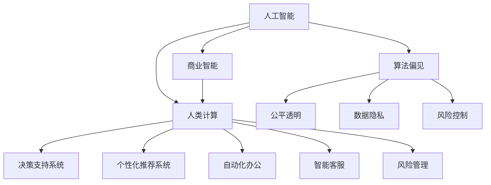

                 

# AI驱动的创新：人类计算在商业中的道德考虑因素与应用场景

> 关键词：人工智能,商业智能,道德考虑,人类计算,应用场景,创新

## 1. 背景介绍

### 1.1 问题由来
随着人工智能(AI)技术的飞速发展，其在商业领域的应用也日益深入。从自动化办公、智能客服到个性化推荐，AI技术为企业带来了前所未有的效率和便利。然而，这些技术的广泛应用也引发了一系列道德和社会问题，如就业替代、隐私侵犯、算法偏见等，成为社会关注的焦点。

如何确保AI技术在商业应用中既高效又公正，同时又符合道德规范，成为当前AI领域的一大挑战。本文聚焦于人类计算在商业智能(Business Intelligence, BI)中的应用，探讨其在提升商业决策效率的同时，如何兼顾道德考虑，以期为商业界提供指导。

### 1.2 问题核心关键点
人类计算在商业中的应用，主要体现在以下几个方面：

- **决策支持系统**：通过大数据分析和机器学习算法，辅助企业进行决策。
- **个性化推荐系统**：利用用户行为数据和推荐算法，为用户提供定制化推荐。
- **自动化办公**：引入自然语言处理、计算机视觉等技术，优化办公流程。
- **智能客服与机器人**：通过对话系统和大模型，提升客户服务质量和效率。
- **风险管理**：利用预测模型和大数据技术，预测和规避风险。

这些应用场景中，人类计算不仅能提升效率，还能释放员工潜力，创造更多价值。然而，在追求效率和效益的同时，必须注意以下几个关键点：

- **数据隐私**：如何合理收集和使用用户数据，避免隐私泄露。
- **算法偏见**：如何避免算法模型对特定群体的歧视性。
- **公平透明**：决策过程如何既高效又透明，符合商业伦理。
- **风险控制**：如何通过技术手段，增强决策的鲁棒性和可靠性。

### 1.3 问题研究意义
研究人类计算在商业中的道德考虑，对于推动AI技术的健康发展，确保其正面应用，具有重要意义：

1. **促进社会共识**：构建AI技术应用的道德规范，促进技术与社会和谐共生。
2. **保障用户权益**：通过透明、公平的算法，确保用户隐私和权益不受侵犯。
3. **提升决策质量**：通过科学决策，降低决策风险，提高商业成功率。
4. **推动产业升级**：引入AI技术，优化商业流程，提高企业竞争力。
5. **鼓励创新探索**：建立道德框架，激发企业大胆创新，推动技术进步。

## 2. 核心概念与联系

### 2.1 核心概念概述

为更好地理解人类计算在商业智能中的应用及其道德考虑，本节将介绍几个密切相关的核心概念：

- **人工智能(AI)**：通过计算机模拟人类智能，实现信息处理、学习推理等功能的技术。
- **商业智能(BI)**：利用数据挖掘、统计分析等技术，为企业决策提供支持的解决方案。
- **人类计算**：结合AI与人类智慧，通过智能工具辅助人类完成复杂决策和计算任务的实践。
- **道德考虑**：在AI技术应用中，遵循的伦理准则和道德规范，包括隐私保护、算法公平、透明度等。
- **应用场景**：AI技术在商业中落地应用的各个领域，如个性化推荐、智能客服、自动化办公等。
- **创新驱动**：利用AI技术驱动商业模式的创新，提升企业竞争力。

这些核心概念之间的逻辑关系可以通过以下Mermaid流程图来展示：



这个流程图展示了大语言模型的核心概念及其之间的关系：

1. AI技术作为基础，为BI提供智能支持。
2. 人类计算将AI技术应用于具体商业场景，提升决策效率。
3. 通过BI系统，企业可进行决策分析、个性化推荐、自动化办公等操作。
4. 在应用过程中，必须注意算法偏见、公平透明、数据隐私和风险控制等道德问题。

## 3. 核心算法原理 & 具体操作步骤
### 3.1 算法原理概述

人类计算在商业中的应用，主要基于机器学习和大数据技术。其核心思想是：通过智能算法和大规模数据，辅助人类进行复杂计算和决策。

形式化地，假设输入数据集为 $D=\{(x_i, y_i)\}_{i=1}^N$，其中 $x_i$ 为特征向量，$y_i$ 为目标标签。商业智能系统的目标是通过模型 $M$ 拟合数据，即最小化经验风险：

$$
\hat{M}=\mathop{\arg\min}_{M}\mathcal{L}(M,D)
$$

其中 $\mathcal{L}$ 为损失函数，用于衡量模型预测与真实标签之间的差距。常见的损失函数包括均方误差损失、交叉熵损失等。

### 3.2 算法步骤详解

人类计算在商业中的操作步骤一般包括以下几个关键步骤：

**Step 1: 数据收集与处理**
- 收集业务数据，包括用户行为、销售数据、市场信息等，并进行清洗、归一化等预处理操作。
- 选择合适的特征表示方法，如词向量、TF-IDF等，将数据转换为模型可处理的形式。

**Step 2: 选择与训练模型**
- 根据业务需求选择合适的机器学习模型，如线性回归、逻辑回归、决策树、随机森林、神经网络等。
- 对模型进行训练，通过反向传播等方法最小化损失函数。

**Step 3: 模型评估与优化**
- 在验证集上评估模型性能，使用准确率、精确率、召回率等指标衡量。
- 根据评估结果，调整模型参数，选择最优模型。

**Step 4: 部署与应用**
- 将训练好的模型部署到生产环境中，如服务器、云计算平台等。
- 对新数据进行预测，辅助业务决策。

**Step 5: 监控与反馈**
- 实时监测模型性能，使用异常检测等技术及时发现问题。
- 定期收集用户反馈，不断优化模型和算法。

以上是人类计算在商业中的应用步骤。在实际应用中，还需要根据具体业务场景，进行模型选择、特征工程、超参数调优等优化操作，以提升模型效果。

### 3.3 算法优缺点

人类计算在商业中的应用，具有以下优点：

1. 提升决策效率：通过智能算法和大数据，快速辅助决策，缩短决策周期。
2. 降低人力成本：自动化处理复杂计算任务，释放人力资源，优化人力结构。
3. 提高数据利用率：通过机器学习技术，深度挖掘数据价值，提高资源利用效率。
4. 增强预测能力：利用历史数据和智能算法，提高预测准确度，规避风险。

同时，该方法也存在一些局限性：

1. 依赖数据质量：数据质量直接影响模型效果，如果数据存在偏差或噪音，模型也可能误判。
2. 算法透明性不足：复杂模型难以解释其内部机制，可能导致决策过程不透明。
3. 数据隐私风险：在数据收集和处理过程中，可能存在隐私泄露的风险。
4. 过度依赖技术：对技术依赖过高可能导致技术路径锁定，难以灵活应对变化。
5. 误导性输出：不当数据选择和模型训练可能产生误导性结果，影响业务决策。

尽管存在这些局限性，但就目前而言，人类计算在商业中的应用已成为不可逆转的趋势。未来相关研究的重点在于如何进一步优化算法设计，增强模型的透明性和公平性，同时兼顾数据隐私和伦理规范等因素。

### 3.4 算法应用领域

人类计算在商业中的应用，已经广泛应用于各个领域，例如：

- **市场营销**：通过用户行为数据，进行个性化推荐、广告投放优化。
- **供应链管理**：利用大数据分析，预测需求、优化库存。
- **客户服务**：通过智能客服系统，提升客户服务质量和效率。
- **风险评估**：利用预测模型，评估信用风险、欺诈风险。
- **财务管理**：通过智能审计，发现异常交易、降低财务风险。
- **产品推荐**：利用推荐算法，提高产品销售量和用户满意度。

除了上述这些经典应用外，人类计算还被创新性地应用于更多场景中，如金融预测、医疗诊断、智能合约等，为商业决策带来了新的突破。随着技术的发展和应用的深入，相信人类计算将在更广阔的领域大放异彩。

## 4. 数学模型和公式 & 详细讲解 & 举例说明
### 4.1 数学模型构建

本节将使用数学语言对人类计算在商业智能中的应用过程进行更加严格的刻画。

假设输入数据集为 $D=\{(x_i, y_i)\}_{i=1}^N$，其中 $x_i \in \mathcal{X}, y_i \in \mathcal{Y}$。定义商业智能系统的损失函数为 $\ell$，则模型的训练目标为：

$$
\hat{M}=\mathop{\arg\min}_{M}\mathcal{L}(M,D) = \mathop{\arg\min}_{M}\frac{1}{N}\sum_{i=1}^N \ell(M(x_i),y_i)
$$

其中 $\mathcal{X}$ 和 $\mathcal{Y}$ 分别为输入和输出空间，$\ell$ 为损失函数，可以是均方误差、交叉熵等。

### 4.2 公式推导过程

以线性回归模型为例，推导其参数估计公式。

假设模型为 $M_{\theta}(x)=\theta^Tx$，其中 $\theta$ 为模型参数，$x$ 为输入特征。设目标函数为 $y_i=\theta^Tx_i+\epsilon_i$，其中 $\epsilon_i$ 为误差项。则最小二乘法目标函数为：

$$
\mathcal{L}(\theta)=\frac{1}{N}\sum_{i=1}^N (y_i-\theta^Tx_i)^2
$$

求导并令其等于0，得：

$$
\frac{\partial \mathcal{L}(\theta)}{\partial \theta_j}=-2\frac{1}{N}\sum_{i=1}^N x_{ij}(y_i-\theta^Tx_i)
$$

整理得：

$$
\theta_j=\frac{1}{N}\sum_{i=1}^N x_{ij}y_i
$$

这就是线性回归模型的参数估计公式。通过求解上述方程，可以得到最优参数 $\hat{\theta}$，使得模型预测与真实标签尽可能一致。

## 5. 项目实践：代码实例和详细解释说明
### 5.1 开发环境搭建

在进行商业智能项目开发前，我们需要准备好开发环境。以下是使用Python进行Pandas、NumPy等数据处理工具的环境配置流程：

1. 安装Anaconda：从官网下载并安装Anaconda，用于创建独立的Python环境。

2. 创建并激活虚拟环境：
```bash
conda create -n bi-env python=3.8 
conda activate bi-env
```

3. 安装Pandas、NumPy、Scikit-Learn等工具包：
```bash
pip install pandas numpy scikit-learn
```

4. 安装Jupyter Notebook：
```bash
pip install jupyter notebook
```

完成上述步骤后，即可在`bi-env`环境中开始商业智能项目开发。

### 5.2 源代码详细实现

下面我们以一个基于线性回归的营销推荐系统为例，给出使用Pandas、NumPy、Scikit-Learn库进行商业智能项目开发的PyTorch代码实现。

首先，定义数据处理函数：

```python
import pandas as pd
from sklearn.model_selection import train_test_split

def load_data(path):
    df = pd.read_csv(path)
    return df.dropna().values
```

然后，定义模型和优化器：

```python
from sklearn.linear_model import LinearRegression
from sklearn.metrics import mean_squared_error

X, y = load_data('data.csv')
X_train, X_test, y_train, y_test = train_test_split(X, y, test_size=0.2)

model = LinearRegression()
```

接着，定义训练和评估函数：

```python
def train_model(model, X_train, y_train, X_test, y_test):
    model.fit(X_train, y_train)
    y_pred = model.predict(X_test)
    mse = mean_squared_error(y_test, y_pred)
    return mse

mse = train_model(model, X_train, y_train, X_test, y_test)
print(f"Mean Squared Error: {mse}")
```

最后，启动训练流程并在测试集上评估：

```python
from sklearn.linear_model import LinearRegression
from sklearn.metrics import mean_squared_error

X, y = load_data('data.csv')
X_train, X_test, y_train, y_test = train_test_split(X, y, test_size=0.2)

model = LinearRegression()

# 训练模型
model.fit(X_train, y_train)

# 评估模型
y_pred = model.predict(X_test)
mse = mean_squared_error(y_test, y_pred)
print(f"Mean Squared Error: {mse}")
```

以上就是使用Pandas、NumPy、Scikit-Learn库进行营销推荐系统开发的完整代码实现。可以看到，在实际应用中，Pandas、NumPy和Scikit-Learn库可以高效地处理和分析数据，而Scikit-Learn中的线性回归模型也非常易于使用，可以快速完成模型训练和评估。

### 5.3 代码解读与分析

让我们再详细解读一下关键代码的实现细节：

**load_data函数**：
- 使用Pandas库读取数据，并进行缺失值处理。
- 返回处理后的数据集。

**train_model函数**：
- 使用Scikit-Learn的LinearRegression模型进行线性回归训练。
- 在测试集上进行预测，并计算均方误差。

**启动训练流程**：
- 导入LinearRegression模型，加载数据集。
- 分割数据集为训练集和测试集。
- 创建LinearRegression模型，并调用train_model函数进行训练和评估。
- 输出测试集上的均方误差。

通过Pandas、NumPy和Scikit-Learn库，我们能够高效地处理数据、训练模型并进行评估，是商业智能项目开发的必备工具。在实际应用中，还需结合具体的业务需求，进一步优化模型选择、特征工程、超参数调优等操作，以提升模型效果。

## 6. 实际应用场景
### 6.1 智能营销系统

基于线性回归的营销推荐系统，可以广泛应用于智能营销系统的构建。传统的营销方式往往需要人工分析大量用户数据，分析过程繁琐且容易出错。而使用基于机器学习的营销推荐系统，可以自动分析用户行为数据，预测其购买意愿，自动生成推荐内容，提升营销效果。

在技术实现上，可以收集用户的历史行为数据，包括浏览记录、购买历史等，将其作为训练数据。利用线性回归模型，对用户未来购买意愿进行预测，并生成个性化推荐内容。通过实时监控推荐效果，不断优化模型参数，提升推荐精准度，最终实现智能化的营销推荐。

### 6.2 供应链优化

通过机器学习和大数据分析，企业可以构建供应链优化系统，实现库存管理、物流调度的智能化。

具体而言，可以收集供应链各环节的数据，包括需求预测、库存量、运输成本等，构建供应链优化模型。通过优化算法，实时预测和调整库存水平、运输路线，降低物流成本，提高供应链效率。例如，通过LSTM等时间序列模型，预测未来需求量，指导企业调整库存和采购策略。

### 6.3 客户服务

基于机器学习和大数据分析，企业可以构建智能客服系统，提高客户服务质量和效率。

智能客服系统通过收集和分析客户的历史交互数据，构建对话模型。在客户咨询时，系统自动匹配最佳回答，并生成个性化的推荐。通过不断优化对话模型，提升服务质量和客户满意度。例如，通过Seq2Seq模型，对客户咨询进行自然语言理解，生成最合适的回答。

### 6.4 未来应用展望

随着AI技术的不断发展，基于人类计算的商业智能系统将在更多领域得到应用，为传统行业带来变革性影响。

在智慧农业领域，通过机器学习和大数据分析，实时监测农作物的生长状态，自动调节灌溉、施肥等操作，提升农业生产效率。

在金融行业，通过机器学习和大数据分析，预测市场趋势，指导投资决策，降低金融风险。

在医疗健康领域，通过机器学习和大数据分析，预测疾病发展趋势，辅助医生制定治疗方案，提升医疗服务质量。

除了上述这些领域，人类计算在商业中的应用还将进一步拓展，为各行各业带来新的机遇和挑战。

## 7. 工具和资源推荐
### 7.1 学习资源推荐

为了帮助开发者系统掌握人类计算在商业智能中的应用，这里推荐一些优质的学习资源：

1. 《Python数据科学手册》：全面介绍Python在数据处理、机器学习中的应用，适合初学者和进阶开发者。

2. 《商业智能与数据分析》在线课程：Coursera上斯坦福大学开设的课程，深入讲解商业智能的基本概念和技术。

3. 《机器学习实战》书籍：通过实际案例，深入浅出地介绍机器学习模型的开发和应用。

4. Kaggle竞赛：参加Kaggle机器学习竞赛，提升数据处理和模型优化能力。

5. Google Cloud AI平台：提供丰富的机器学习资源和工具，帮助开发者高效进行商业智能项目开发。

通过对这些资源的学习实践，相信你一定能够快速掌握人类计算在商业智能中的原理和实践，并用于解决实际的商业问题。

### 7.2 开发工具推荐

高效的开发离不开优秀的工具支持。以下是几款用于商业智能开发的常用工具：

1. Jupyter Notebook：免费开源的交互式编程环境，支持Python、R等多种语言，便于编写、分享和调试代码。

2. Pandas：基于NumPy的数据处理库，提供了高效的数据清洗、转换和分析功能。

3. Scikit-Learn：Python机器学习库，提供了丰富的算法和工具，支持快速原型设计和模型训练。

4. TensorFlow：谷歌开源的深度学习框架，支持分布式计算和模型优化，适用于大规模商业智能项目。

5. Weights & Biases：模型训练的实验跟踪工具，可以记录和可视化模型训练过程中的各项指标，方便对比和调优。

6. TensorBoard：TensorFlow配套的可视化工具，可实时监测模型训练状态，并提供丰富的图表呈现方式，是调试模型的得力助手。

合理利用这些工具，可以显著提升商业智能项目的开发效率，加快创新迭代的步伐。

### 7.3 相关论文推荐

人类计算在商业中的应用源于学界的持续研究。以下是几篇奠基性的相关论文，推荐阅读：

1. Causal Inference in Statistics, Social, and Biomedical Sciences（因果推断综述）：详细介绍了因果推断的基本原理和应用方法，为商业智能提供了理论支持。

2. Mining of Massive Datasets（大数据挖掘）：介绍大数据分析的基本框架和技术，适用于商业智能项目的数据处理和分析。

3. Machine Learning Yearning（机器学习实战）：深度介绍了机器学习模型的开发和调优，提供了丰富的实践经验和代码示例。

4. The Elements of Statistical Learning（统计学习基础）：介绍了统计学习的基本概念和算法，适合深入理解机器学习模型。

5. Deep Learning for Business（深度学习在商业中的应用）：介绍深度学习技术在商业中的应用场景，提供了丰富的案例和实践经验。

这些论文代表了大数据和机器学习在商业智能领域的发展脉络。通过学习这些前沿成果，可以帮助研究者把握学科前进方向，激发更多的创新灵感。

## 8. 总结：未来发展趋势与挑战

### 8.1 总结

本文对人类计算在商业智能中的应用进行了全面系统的介绍。首先阐述了人类计算与AI技术的融合，探讨了其在提升商业决策效率的同时，如何兼顾道德考虑。其次，从原理到实践，详细讲解了人类计算在商业中的应用过程，给出了具体的代码实现。同时，本文还广泛探讨了人类计算在营销、供应链、客户服务等多个行业领域的应用前景，展示了人类计算范式的巨大潜力。此外，本文精选了人类计算在商业中的应用工具和资源，力求为开发者提供全方位的技术指引。

通过本文的系统梳理，可以看到，人类计算在商业智能中的应用已经成为不可逆转的趋势，通过AI技术和人类智慧的结合，帮助企业提升决策效率，降低成本，创造更多价值。未来，随着AI技术的不断演进，人类计算将进一步拓展应用范围，成为企业智能化升级的重要推动力。

### 8.2 未来发展趋势

展望未来，人类计算在商业中的应用将呈现以下几个发展趋势：

1. **智能化水平提升**：通过深度学习和大数据分析，提高商业智能系统的智能化水平，实现精准预测和决策。
2. **数据驱动决策**：更多地依赖数据驱动决策，提高决策的科学性和准确度。
3. **跨领域融合**：结合不同领域的知识，实现多领域数据和技术的融合，提升决策的多样性和全面性。
4. **实时性增强**：通过实时数据分析和预测，提高决策的时效性，及时应对市场变化。
5. **可视化提升**：更多地利用可视化工具，增强决策过程的透明性和可理解性。
6. **伦理和隐私保护**：在数据收集和处理过程中，加强数据隐私保护和算法公平性。

以上趋势凸显了人类计算在商业中的应用前景。这些方向的探索发展，必将进一步提升商业智能系统的性能和应用范围，为商业界带来更多的创新和机遇。

### 8.3 面临的挑战

尽管人类计算在商业中的应用已经取得了显著成果，但在迈向更加智能化、普适化应用的过程中，它仍面临着诸多挑战：

1. **数据质量瓶颈**：数据质量直接影响模型效果，如何获取和处理高质量数据，仍是技术难点。
2. **算法透明性不足**：复杂模型难以解释其内部机制，可能导致决策过程不透明。
3. **数据隐私风险**：在数据收集和处理过程中，可能存在隐私泄露的风险。
4. **技术路径锁定**：对技术依赖过高可能导致技术路径锁定，难以灵活应对变化。
5. **误导性输出**：不当数据选择和模型训练可能产生误导性结果，影响业务决策。

尽管存在这些挑战，但随着AI技术的不断进步和应用深化，相信这些挑战终将一一被克服，人类计算必将在构建智能商业决策中发挥越来越重要的作用。

### 8.4 研究展望

面对人类计算在商业智能面临的挑战，未来的研究需要在以下几个方面寻求新的突破：

1. **数据质量保障**：开发更加高效的数据清洗和预处理算法，提高数据质量。
2. **模型透明性提升**：引入可解释性技术，增强模型的透明性和公平性。
3. **隐私保护技术**：开发隐私保护算法，如差分隐私、联邦学习等，确保数据安全。
4. **技术路径多样化**：鼓励多样化技术路径探索，提升系统的灵活性和适应性。
5. **误导性输出检测**：开发误导性输出检测算法，提高模型的鲁棒性和可靠性。

这些研究方向的探索，必将引领人类计算在商业智能的应用走向更加智能化、普适化，为商业决策带来更多创新和机遇。

## 9. 附录：常见问题与解答

**Q1：如何确保商业智能系统的数据质量？**

A: 数据质量直接影响模型的效果，因此确保数据质量至关重要。以下是一些常见的数据质量保障措施：

1. 数据清洗：去除重复、缺失、异常数据，保证数据完整性和一致性。
2. 数据标注：对数据进行人工标注，确保标注准确性。
3. 数据融合：将多个数据源的数据进行融合，提高数据丰富性和多样性。
4. 数据采样：采用采样技术，提高数据代表性，减少偏差。
5. 数据可视化：通过数据可视化工具，及时发现数据中的问题和异常。

这些措施可以有效提高数据质量，确保模型训练和评估的可靠性。

**Q2：如何提升商业智能系统的算法透明性？**

A: 算法的透明性是商业智能系统的重要考量因素。以下是一些提升算法透明性的措施：

1. 模型解释：引入模型解释技术，如SHAP、LIME等，解释模型的决策过程和输出结果。
2. 特征可视化：使用特征重要性可视化工具，展示模型对各个特征的依赖程度。
3. 可解释模型：选择可解释性强的模型，如决策树、线性回归等，降低模型复杂度。
4. 数据分布分析：通过分析数据分布，发现模型预测中的异常和偏差。
5. 专家介入：引入领域专家，辅助分析模型输出，提高决策的科学性和合理性。

这些措施可以显著提升算法的透明性和可解释性，增强决策过程的可理解性和公平性。

**Q3：如何在商业智能系统中实现数据隐私保护？**

A: 数据隐私保护是商业智能系统的重要考量因素。以下是一些常见的数据隐私保护措施：

1. 差分隐私：通过添加噪声或扰动，保护个体数据隐私，防止数据泄露。
2. 联邦学习：将数据分散在多个节点上进行训练，避免集中存储和处理。
3. 数据匿名化：将数据进行匿名化处理，防止数据关联和识别。
4. 访问控制：通过访问控制技术，限制数据访问权限，防止数据滥用。
5. 数据脱敏：对数据进行脱敏处理，防止数据泄露和滥用。

这些措施可以有效保护数据隐私，确保数据安全，避免数据滥用和泄露。

**Q4：如何优化商业智能系统的模型参数？**

A: 模型参数的优化是商业智能系统的重要环节。以下是一些常见的模型参数优化措施：

1. 网格搜索：通过网格搜索技术，寻找最优的超参数组合。
2. 贝叶斯优化：通过贝叶斯优化算法，快速找到最优超参数。
3. 随机搜索：通过随机搜索技术，探索超参数空间，找到最优参数。
4. 学习率调整：通过学习率调整技术，提高模型训练的稳定性和收敛速度。
5. 正则化技术：通过正则化技术，防止过拟合和欠拟合，提高模型泛化能力。

这些措施可以有效提高模型参数的优化效果，确保模型性能。

**Q5：如何在商业智能系统中实现实时预测？**

A: 实时预测是商业智能系统的重要功能。以下是一些实现实时预测的措施：

1. 流式处理：通过流式处理技术，实时处理数据，实现实时预测。
2. 内存计算：利用内存计算技术，提高数据处理速度，实现实时预测。
3. 分布式计算：通过分布式计算技术，提高计算效率，实现实时预测。
4. 缓存技术：通过缓存技术，减少数据存储和计算的延迟，实现实时预测。
5. 高性能计算：利用高性能计算资源，提高计算速度，实现实时预测。

这些措施可以有效实现商业智能系统的实时预测功能，提高决策的时效性。

通过本文的系统梳理，可以看到，人类计算在商业智能中的应用已经成为不可逆转的趋势，通过AI技术和人类智慧的结合，帮助企业提升决策效率，降低成本，创造更多价值。未来，随着AI技术的不断演进，人类计算将进一步拓展应用范围，成为企业智能化升级的重要推动力。

总之，本文旨在帮助开发者理解和应用人类计算在商业智能中的原理和实践，促进技术进步和商业创新。通过系统化的学习和实践，相信你一定能够快速掌握人类计算的精髓，并用于解决实际的商业问题。

---

作者：禅与计算机程序设计艺术 / Zen and the Art of Computer Programming

