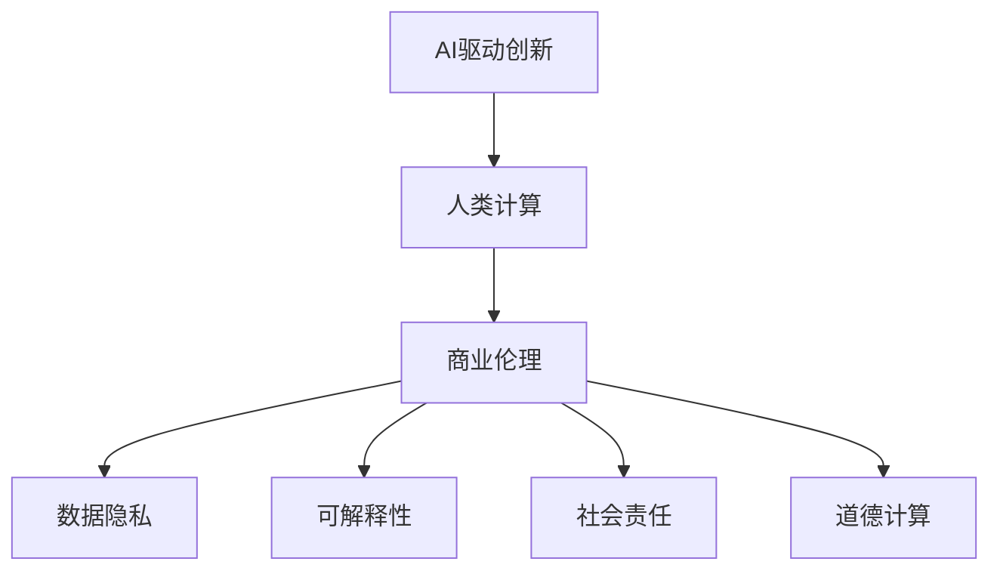

                 

# AI驱动的创新：人类计算在商业中的道德考虑因素展望机遇

> 关键词：AI驱动创新, 人类计算, 商业伦理, 数据隐私, 可解释性, 社会责任, 道德计算

## 1. 背景介绍

在数字化转型的浪潮下，人工智能（AI）技术正以前所未有的速度渗透到各行各业，成为商业创新的重要驱动力。人类计算（Human Computation）作为新兴的研究领域，融合了AI与人类智慧，旨在通过众包和协作的方式，增强AI系统的智能和创新能力。然而，随着人类计算的普及和深入，商业应用中随之而来的道德问题也日益凸显。本文将系统探讨AI驱动的创新在商业中的应用，并深入分析其中涉及的道德考虑因素，展望未来机遇与挑战。

## 2. 核心概念与联系

### 2.1 核心概念概述

- **AI驱动创新**：利用人工智能技术（如机器学习、深度学习等）推动产品创新、服务升级和管理优化，以提升商业价值和用户体验。
- **人类计算**：结合AI与人类智慧，通过众包平台、协作工具等形式，利用人类参与的计算任务来增强AI系统的智能化和创造力。
- **商业伦理**：在AI和人类计算的应用中，遵守法律法规，尊重个体权益，维护公平、透明和责任的原则。
- **数据隐私**：保护个人和企业数据的保密性和安全性，防止数据泄露和滥用。
- **可解释性**：确保AI决策的透明和可解释，便于用户和监管机构理解和信任。
- **社会责任**：AI技术在应用过程中，需考虑对社会的影响，促进公平、公正和社会福祉。
- **道德计算**：在AI和人类计算中，引入道德和伦理因素，指导和规范技术应用。

这些核心概念之间存在着紧密的联系，共同构成了AI驱动创新在商业应用中的伦理框架。通过深入理解这些概念，可以更好地把握AI技术在商业创新中的道德边界和应用原则。

### 2.2 核心概念原理和架构的 Mermaid 流程图



这个流程图展示了AI驱动创新在商业应用中的核心概念及其联系：

1. AI驱动创新：利用AI技术推动商业创新，提升业务能力。
2. 人类计算：通过众包和协作增强AI系统的智能化。
3. 商业伦理：在AI和人类计算中遵守法律法规，尊重权益。
4. 数据隐私：保护数据安全，防止滥用。
5. 可解释性：确保AI决策透明，便于理解和信任。
6. 社会责任：关注AI对社会的正面影响，促进公平公正。
7. 道德计算：引入道德伦理指导AI和人类计算的应用。

这些概念共同构成了一个完整的商业AI应用伦理框架，指导企业在技术应用中的道德行为。

## 3. 核心算法原理 & 具体操作步骤

### 3.1 算法原理概述

AI驱动的创新在商业中的应用，主要依赖于两个关键算法：AI算法和人类计算算法。AI算法负责模型训练、预测和决策，而人类计算算法则负责任务分配、协作管理和创新建议。

在AI算法方面，主要使用监督学习、无监督学习和强化学习等方法。监督学习通过标注数据训练模型，用于分类、回归和推荐等任务；无监督学习从数据中发现模式和结构，用于聚类、降维和异常检测等；强化学习则通过与环境的互动，优化决策策略，用于游戏、控制和规划等。

人类计算算法则利用协作平台和众包机制，分配任务给人类工作者，并通过反馈和评估机制优化任务分配和协作效果。常见的协作平台包括Amazon Mechanical Turk、Freelancer等。

### 3.2 算法步骤详解

AI驱动创新的核心步骤包括数据收集与预处理、模型训练与优化、任务分配与协作管理、创新建议与决策部署等。以下以一个智能客服系统的开发为例，详细阐述这些步骤。

#### 数据收集与预处理
- **步骤1**：收集用户的历史对话记录和反馈数据，包括客户咨询主题、客户满意度、客服处理时间等。
- **步骤2**：对数据进行清洗和标注，去除噪音和不相关数据，确保数据质量。
- **步骤3**：使用自然语言处理（NLP）技术对文本数据进行分词、词性标注和命名实体识别等处理。

#### 模型训练与优化
- **步骤4**：利用预训练的BERT等语言模型，对用户对话数据进行微调，学习用户意图和实体识别。
- **步骤5**：使用监督学习方法，如分类器或回归器，对客户满意度进行预测，优化客服处理策略。
- **步骤6**：利用强化学习方法，训练智能客服系统，学习与用户交互的策略，提升响应速度和准确率。

#### 任务分配与协作管理
- **步骤7**：将任务分配给人类工作者，如质检、数据分析等。
- **步骤8**：通过协作平台，收集人类工作者的反馈和建议，优化模型和策略。
- **步骤9**：利用协同过滤等技术，推荐适合任务的人员，提高协作效率。

#### 创新建议与决策部署
- **步骤10**：收集用户反馈和市场数据，提出新的业务模式和产品功能。
- **步骤11**：利用AI进行需求预测和风险评估，优化产品和服务设计。
- **步骤12**：部署新功能和业务模式，进行A/B测试和用户反馈收集，持续迭代优化。

### 3.3 算法优缺点

#### 优点
1. **高效性**：AI算法可以处理大规模数据，快速生成分析结果和预测。
2. **精确性**：AI算法能够从数据中发现隐藏模式和趋势，提供高精度的决策支持。
3. **可扩展性**：AI和人类计算结合，能够灵活应对各种业务需求。
4. **创新性**：人类计算引入人类智慧，增强系统的创新能力和适应性。

#### 缺点
1. **数据依赖**：AI算法依赖于数据质量，低质量或不足的数据可能影响效果。
2. **模型复杂性**：复杂模型需要大量计算资源，训练和推理成本较高。
3. **可解释性不足**：AI决策过程复杂，难以解释，用户和监管机构难以信任。
4. **伦理风险**：数据隐私和偏见问题可能导致伦理争议。

### 3.4 算法应用领域

AI驱动的创新在多个领域都有广泛应用，以下是几个典型案例：

#### 金融服务
- **投资管理**：利用AI算法分析市场数据，优化投资组合和风险控制。
- **客户服务**：通过自然语言处理技术，提升客户咨询处理效率和质量。

#### 医疗健康
- **疾病诊断**：利用AI算法分析医学影像和基因数据，辅助医生进行疾病诊断。
- **健康监测**：通过可穿戴设备和AI算法，实时监测用户健康状态，提供个性化健康建议。

#### 零售电商
- **智能推荐**：利用AI算法分析用户行为数据，提供个性化商品推荐。
- **库存管理**：通过预测算法优化库存水平，降低库存成本。

#### 制造业
- **质量控制**：利用AI算法检测产品缺陷，提高产品质量。
- **供应链管理**：通过优化算法，提升供应链效率和灵活性。

## 4. 数学模型和公式 & 详细讲解

### 4.1 数学模型构建

AI驱动创新的核心数学模型包括监督学习模型、无监督学习模型和强化学习模型。以下以监督学习模型为例，介绍其基本构建过程。

假设有一组训练数据集 $D=\{(x_i, y_i)\}_{i=1}^N$，其中 $x_i$ 为输入特征，$y_i$ 为输出标签。监督学习模型的目标是找到最优的权重参数 $\theta$，使得模型能够准确预测新样本的输出标签。常见的监督学习模型包括线性回归、逻辑回归和支持向量机等。

#### 线性回归模型
线性回归模型假设输出 $y$ 与输入特征 $x$ 之间存在线性关系，即 $y=\theta^Tx+b$。其损失函数为均方误差（MSE）：
$$ L(\theta) = \frac{1}{2N}\sum_{i=1}^N (y_i - \theta^T x_i)^2 $$

#### 逻辑回归模型
逻辑回归模型用于二分类任务，假设输出 $y$ 与输入特征 $x$ 之间存在逻辑关系，即 $P(y=1|x) = \sigma(\theta^T x)$，其中 $\sigma$ 为sigmoid函数。其损失函数为交叉熵损失：
$$ L(\theta) = -\frac{1}{N}\sum_{i=1}^N [y_i\log\sigma(\theta^T x_i) + (1-y_i)\log(1-\sigma(\theta^T x_i))] $$

#### 支持向量机（SVM）
支持向量机通过构造最优超平面，将不同类别的数据分开。其损失函数为合页损失（Hinge Loss）：
$$ L(\theta) = \frac{1}{N}\sum_{i=1}^N \max(0, 1 - y_i(\theta^T x_i + b)) $$

### 4.2 公式推导过程

#### 线性回归
对线性回归模型的损失函数求导，得：
$$ \frac{\partial L(\theta)}{\partial \theta} = \frac{1}{N}\sum_{i=1}^N (-2x_i(y_i - \theta^T x_i)) $$

求解导数为零的方程，得最优权重参数 $\theta$：
$$ \theta = (X^TX)^{-1}X^Ty $$

其中 $X=[x_1, x_2, ..., x_N]$ 为输入特征矩阵。

#### 逻辑回归
对逻辑回归模型的损失函数求导，得：
$$ \frac{\partial L(\theta)}{\partial \theta} = -\frac{1}{N}\sum_{i=1}^N [y_i(\sigma(\theta^T x_i) - 1) + (1-y_i)(\sigma(\theta^T x_i) - 0)] $$

求解导数为零的方程，得最优权重参数 $\theta$：
$$ \theta = (X^TX)^{-1}X^Ty $$

#### 支持向量机
对支持向量机的损失函数求导，得：
$$ \frac{\partial L(\theta)}{\partial \theta} = -\frac{1}{N}\sum_{i=1}^N (y_i(\theta^T x_i + b)) $$

求解导数为零的方程，得最优权重参数 $\theta$：
$$ \theta = \sum_{i=1}^N y_i x_i $$

### 4.3 案例分析与讲解

以智能客服系统为例，分析AI和人类计算的结合效果。

**案例背景**：某电商公司利用智能客服系统，提升客户咨询处理效率和质量。

**数据集**：公司历史客户咨询记录，包括咨询主题、客户满意度和客服处理时间等。

**数据预处理**：
- 对文本数据进行清洗和标注，去除噪音和不相关数据。
- 使用NLP技术对文本数据进行分词、词性标注和命名实体识别。

**模型选择**：
- 使用BERT模型对用户对话数据进行微调，学习用户意图和实体识别。
- 使用逻辑回归模型对客户满意度进行预测，优化客服处理策略。

**任务分配与协作管理**：
- 将任务分配给人类工作者，如质检、数据分析等。
- 通过协作平台，收集人类工作者的反馈和建议，优化模型和策略。
- 利用协同过滤等技术，推荐适合任务的人员，提高协作效率。

**创新建议与决策部署**：
- 收集用户反馈和市场数据，提出新的业务模式和产品功能。
- 利用AI进行需求预测和风险评估，优化产品和服务设计。
- 部署新功能和业务模式，进行A/B测试和用户反馈收集，持续迭代优化。

## 5. 项目实践：代码实例和详细解释说明

### 5.1 开发环境搭建

#### 安装Python
1. 下载和安装Python 3.8版本。
2. 安装pip和conda。

```bash
sudo apt-get install python3.8
sudo apt-get install python3-pip
```

#### 安装PyTorch
1. 创建虚拟环境。
2. 安装PyTorch。

```bash
conda create -n pytorch-env python=3.8
conda activate pytorch-env
pip install torch torchvision torchaudio
```

#### 安装Transformer库
1. 安装Transformer库。

```bash
pip install transformers
```

### 5.2 源代码详细实现

#### 数据处理
定义数据处理函数，对文本数据进行清洗和标注。

```python
import pandas as pd
import numpy as np
from transformers import BertTokenizer, BertForSequenceClassification

def preprocess_data(data_path):
    # 读取数据
    data = pd.read_csv(data_path)
    # 清洗数据
    data = data.dropna()
    data = data.drop(columns=['id'])
    # 标注数据
    data['label'] = data['label'].apply(lambda x: 1 if x == 'positive' else 0)
    # 分词和编码
    tokenizer = BertTokenizer.from_pretrained('bert-base-cased')
    data['tokens'] = data['text'].apply(lambda x: tokenizer.encode(x, add_special_tokens=True))
    return data
```

#### 模型训练
定义训练函数，使用BERT模型对客户满意度进行预测。

```python
def train_model(model_path, data_path):
    # 加载数据
    data = preprocess_data(data_path)
    # 加载模型
    model = BertForSequenceClassification.from_pretrained(model_path, num_labels=2)
    # 定义优化器和损失函数
    optimizer = AdamW(model.parameters(), lr=1e-5)
    loss_fn = CrossEntropyLoss()
    # 训练模型
    for epoch in range(10):
        model.train()
        for _, batch in data.iterrows():
            input_ids = batch['tokens'].numpy()
            attention_mask = np.ones_like(input_ids)
            labels = batch['label'].numpy()
            # 前向传播和计算损失
            outputs = model(input_ids, attention_mask=attention_mask, labels=labels)
            loss = loss_fn(outputs.logits, labels)
            # 反向传播和更新参数
            loss.backward()
            optimizer.step()
    return model
```

### 5.3 代码解读与分析

在上述代码中，我们首先定义了一个数据预处理函数 `preprocess_data`，用于清洗和标注数据。函数中使用了Pandas和Numpy库，对数据进行了基本的清洗、标注和编码操作。

接下来，定义了一个模型训练函数 `train_model`，用于加载预训练的BERT模型，并对其进行微调。函数中使用了PyTorch的优化器和损失函数，通过循环迭代训练模型，最终得到了微调后的模型。

通过这个简单的代码示例，可以看到AI和人类计算在数据处理和模型训练中的紧密结合。在实际应用中，还需要进一步优化数据处理和模型训练的各个环节，以提高系统的性能和效率。

## 6. 实际应用场景

### 6.1 智能客服系统

智能客服系统是AI驱动创新的典型应用场景。通过AI和人类计算的结合，智能客服系统可以实时处理大量客户咨询，提升客服效率和质量。

#### 系统架构
- **前端**：网页或移动应用，用户输入咨询请求。
- **后端**：服务器，处理和分配任务。
- **中间件**：协作平台，分配任务给人类工作者。
- **数据存储**：数据库，存储历史咨询记录和用户反馈。

#### 核心技术
- **AI算法**：利用BERT等模型，对用户咨询进行意图识别和实体识别。
- **人类计算**：通过Amazon Mechanical Turk等平台，分配任务给人类工作者，如质检、数据分析等。
- **协作管理**：利用协同过滤等技术，推荐适合任务的人员，提高协作效率。

#### 业务价值
- **提升效率**：智能客服系统可以24小时不间断服务，快速响应客户咨询。
- **优化质量**：通过人类计算和反馈机制，持续优化AI模型，提升客服质量。

### 6.2 医疗健康

医疗健康领域是AI驱动创新的另一个重要应用场景。通过AI和人类计算的结合，可以显著提升医疗诊断和治疗效果。

#### 系统架构
- **前端**：医生工作站或移动应用，医生输入病历和诊断结果。
- **后端**：服务器，处理和分配任务。
- **中间件**：协作平台，分配任务给人类工作者，如数据标注、病历分析等。
- **数据存储**：数据库，存储病历和诊断数据。

#### 核心技术
- **AI算法**：利用BERT等模型，对医学影像和基因数据进行分析和预测。
- **人类计算**：通过人类工作者进行数据标注和病历分析，增强AI模型的泛化能力。
- **协作管理**：利用协同过滤等技术，推荐适合任务的人员，提高协作效率。

#### 业务价值
- **辅助诊断**：AI模型辅助医生进行疾病诊断，提高诊断准确率。
- **个性化治疗**：通过数据分析和预测，制定个性化治疗方案。

### 6.3 零售电商

零售电商领域是AI驱动创新的另一个重要应用场景。通过AI和人类计算的结合，可以显著提升客户体验和销售效果。

#### 系统架构
- **前端**：电商平台，展示商品和用户界面。
- **后端**：服务器，处理和分配任务。
- **中间件**：协作平台，分配任务给人类工作者，如产品推荐、客服质检等。
- **数据存储**：数据库，存储用户行为和交易数据。

#### 核心技术
- **AI算法**：利用BERT等模型，对用户行为数据进行分析和预测。
- **人类计算**：通过人类工作者进行商品推荐和客服质检，提升用户体验。
- **协作管理**：利用协同过滤等技术，推荐适合任务的人员，提高协作效率。

#### 业务价值
- **个性化推荐**：AI模型根据用户行为数据，推荐个性化商品。
- **优化库存**：利用预测算法，优化库存水平，降低库存成本。

## 7. 工具和资源推荐

### 7.1 学习资源推荐

#### 在线课程
- Coursera的《Deep Learning Specialization》：由Andrew Ng教授开设，系统介绍了深度学习的基本概念和应用。
- Udacity的《Machine Learning Engineer Nanodegree》：提供从数据处理到模型训练的全面培训，适合进阶学习。

#### 书籍
- 《深度学习》（Goodfellow等著）：经典教材，介绍了深度学习的基本原理和算法。
- 《Hands-On Machine Learning with Scikit-Learn, Keras, and TensorFlow》（Géron著）：实用指南，涵盖Scikit-Learn、Keras和TensorFlow的使用技巧。

#### 论文
- "AI Challenges and Opportunities in Developing Countries"（Li等著）：分析了AI在发展中国家的应用挑战和机遇。
- "Human-AI Collaboration: Towards a New Computer Science"（Le Cun等著）：探讨了AI和人类计算结合的潜力。

### 7.2 开发工具推荐

#### 开发框架
- PyTorch：开源深度学习框架，灵活的动态计算图，适合研究和学习。
- TensorFlow：由Google开发的深度学习框架，支持多种硬件和分布式训练。

#### 协作平台
- Amazon Mechanical Turk：众包平台，用于分配和协调人类工作者。
- Freelancer：自由职业平台，用于寻找和联系人类工作者。

### 7.3 相关论文推荐

#### 综述论文
- "Human-AI Collaboration: Past, Present, and Future"（Benjamin等著）：综述了AI和人类计算结合的研究进展。
- "The Ethics of Human-AI Collaboration in AI"（Kim等著）：探讨了AI和人类计算结合中的伦理问题。

#### 应用论文
- "A Survey on Human-AI Collaboration for Healthcare Decision Making"（Duan等著）：综述了AI和人类计算在医疗健康中的应用。
- "Human-AI Collaboration in Retail: A Survey"（Li等著）：综述了AI和人类计算在零售电商中的应用。

## 8. 总结：未来发展趋势与挑战

### 8.1 研究成果总结

AI驱动的创新在商业应用中已经取得了显著成果，AI和人类计算的结合显著提升了业务效率和创新能力。然而，伴随而来的是诸多道德和伦理问题，如数据隐私、可解释性和社会责任等。

### 8.2 未来发展趋势

未来AI驱动的创新将呈现以下几个发展趋势：

#### 技术融合
- **多模态融合**：将视觉、语音、文本等多种模态信息融合，提升系统的智能化和适应性。
- **跨领域应用**：将AI技术应用于更多领域，如农业、教育、能源等。

#### 数据伦理
- **数据隐私保护**：利用差分隐私等技术，保护用户隐私和数据安全。
- **数据公平性**：关注数据分布的公平性，避免算法偏见。

#### 社会责任
- **透明性**：提高AI决策的透明性和可解释性，增强用户和监管机构信任。
- **责任机制**：建立AI系统的责任机制，明确各方责任和义务。

#### 技术演进
- **模型优化**：开发更加高效和可解释的AI模型，提高系统的性能和可靠性。
- **算力提升**：利用GPU/TPU等高性能硬件，提升计算能力和效率。

### 8.3 面临的挑战

尽管AI驱动的创新取得了诸多成果，但在技术应用中也面临着诸多挑战：

#### 数据质量
- **数据分布**：不同领域的AI模型对数据分布的要求不同，如何获取高质量、有代表性的数据，是一个关键问题。
- **数据标注**：高质量的数据标注需要大量人力和时间，如何降低数据标注成本，是一个重要课题。

#### 模型公平性
- **偏见问题**：AI模型可能学习到数据中的偏见和歧视，如何消除模型偏见，是一个亟待解决的问题。
- **公平性评估**：如何评估AI模型的公平性，是一个具有挑战性的任务。

#### 技术壁垒
- **技术复杂性**：AI和人类计算的结合需要跨学科的知识，如何简化技术复杂性，提高系统的可扩展性，是一个重要课题。
- **开发成本**：高质量AI系统开发成本高，如何降低开发成本，是一个关键问题。

### 8.4 研究展望

未来，AI驱动的创新需要在技术、伦理和社会三个方面进行协同发展：

#### 技术创新
- **模型优化**：开发更加高效、可解释的AI模型，提高系统的性能和可靠性。
- **多模态融合**：将视觉、语音、文本等多种模态信息融合，提升系统的智能化和适应性。
- **跨领域应用**：将AI技术应用于更多领域，如农业、教育、能源等。

#### 伦理探索
- **数据隐私保护**：利用差分隐私等技术，保护用户隐私和数据安全。
- **数据公平性**：关注数据分布的公平性，避免算法偏见。
- **透明性**：提高AI决策的透明性和可解释性，增强用户和监管机构信任。

#### 社会责任
- **责任机制**：建立AI系统的责任机制，明确各方责任和义务。
- **伦理培训**：加强AI开发者的伦理培训，提升其伦理意识和责任感。

通过在技术、伦理和社会三个方面的协同发展，未来AI驱动的创新将更加广泛地应用到商业和社会各个领域，为人类的生产和生活带来更多的价值和机遇。

## 9. 附录：常见问题与解答

### Q1: 什么是AI驱动的创新？

A: AI驱动的创新是指利用人工智能技术（如机器学习、深度学习等）推动产品创新、服务升级和管理优化，以提升商业价值和用户体验。

### Q2: AI驱动的创新在商业中有哪些应用？

A: AI驱动的创新在金融、医疗、零售、制造等多个领域都有广泛应用，如智能客服、疾病诊断、个性化推荐、质量控制等。

### Q3: 人类计算如何与AI结合？

A: 人类计算结合AI，主要通过众包平台和协作工具，分配任务给人类工作者，并通过反馈和评估机制优化任务分配和协作效果，增强AI系统的智能化和适应性。

### Q4: 在AI驱动的创新中如何平衡技术效率和伦理问题？

A: 在AI驱动的创新中，需要平衡技术效率和伦理问题，确保数据的隐私、公平性和透明性。可以通过差分隐私、公平性评估和透明性技术等手段，实现技术和伦理的协同发展。

### Q5: 未来AI驱动的创新面临哪些挑战？

A: 未来AI驱动的创新面临数据质量、模型公平性、技术壁垒等诸多挑战。需要加强技术创新、伦理探索和社会责任，协同推进AI驱动的创新发展。

---

作者：禅与计算机程序设计艺术 / Zen and the Art of Computer Programming

