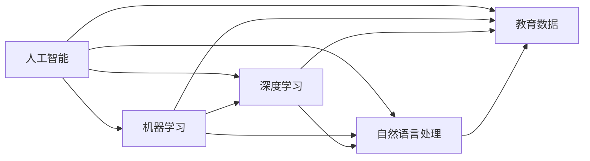

                 

# AI驱动的创新：人类计算在教育中的价值

在数字化的浪潮中，人工智能（AI）正在以前所未有的速度重塑我们的世界。从智能家居到自动驾驶，从医疗健康到金融服务，AI的应用无所不在。然而，最引人注目和最重要的AI应用之一，或许在于教育领域。

## 1. 背景介绍

### 1.1 问题由来

教育是人类文明进步的基石，而传统的教育方式正在经历一场深刻的变革。传统教育系统往往以教师为中心，强调知识的传授和记忆，缺乏个性化和互动性。而AI的引入，为教育带来了新的可能性，使得教育变得更加个性化、高效和有趣。

AI在教育中的应用范围广泛，包括智能辅导系统、个性化学习推荐、自动评估系统等。这些技术不仅能够提高教学质量，还能激发学生的学习兴趣，提高学习效率。

### 1.2 问题核心关键点

AI在教育中的应用，主要集中在以下几个关键点上：

- **个性化学习**：通过分析学生的学习行为和知识掌握情况，AI可以为每个学生量身定制学习计划，提供个性化的教学内容，从而提高学习效果。
- **自动化评估**：AI可以自动批改作业、考试等，提供即时的反馈，帮助学生及时纠正错误，调整学习策略。
- **智能辅导**：AI能够提供24小时在线辅导，回答学生的疑问，解决学习中的困难。
- **数据驱动决策**：通过分析学生的学习数据，教师可以更科学地进行教学设计和管理，提高教学质量。

## 2. 核心概念与联系

### 2.1 核心概念概述

在讨论AI在教育中的应用时，以下几个概念是绕不开的：

- **人工智能（AI）**：指能够模拟人类智能行为的技术，包括机器学习、深度学习、自然语言处理等。
- **机器学习（ML）**：指让机器通过数据学习任务的方法，包括监督学习、无监督学习和强化学习。
- **深度学习（DL）**：指基于多层神经网络的机器学习方法，广泛应用于图像识别、自然语言处理等领域。
- **自然语言处理（NLP）**：指让计算机理解和处理人类语言的技术，包括文本分类、语言生成、情感分析等。
- **教育数据（EdData）**：指与教育相关的各种数据，如学生成绩、学习行为、教师教学方法等。

这些概念之间的联系可以通过以下Mermaid流程图来展示：



这个流程图展示了大语言模型在教育中的应用，以及与其相关联的核心概念。

## 3. 核心算法原理 & 具体操作步骤

### 3.1 算法原理概述

AI在教育中的应用，通常基于以下几个基本算法原理：

- **监督学习**：利用带标签的数据进行模型训练，使得模型能够预测新数据的标签。在教育中，监督学习可以用于学生成绩预测、作业批改等。
- **无监督学习**：从未标记的数据中学习，发现数据的内在结构和规律。在教育中，无监督学习可以用于学生聚类、知识图谱构建等。
- **深度学习**：基于多层神经网络的模型，可以处理复杂的数据和任务。在教育中，深度学习可以用于图像识别、自然语言处理等。
- **强化学习**：通过与环境的交互，逐步优化策略，以获得最大化的奖励。在教育中，强化学习可以用于个性化学习路径设计、教学策略优化等。

### 3.2 算法步骤详解

基于AI的教育应用通常包括以下几个关键步骤：

**Step 1: 数据收集和预处理**

- **数据收集**：收集与教育相关的各种数据，如学生成绩、学习行为、教师教学方法等。
- **数据预处理**：对数据进行清洗、归一化、特征提取等处理，以便于后续的分析和建模。

**Step 2: 模型选择和训练**

- **模型选择**：选择合适的算法模型，如深度神经网络、支持向量机等。
- **模型训练**：利用收集到的数据对模型进行训练，优化模型参数。

**Step 3: 模型评估和应用**

- **模型评估**：使用测试集对模型进行评估，检查模型性能。
- **模型应用**：将训练好的模型应用于实际的教育场景中，如个性化学习推荐、自动化评估等。

### 3.3 算法优缺点

AI在教育中的应用，有以下优点和缺点：

**优点**：

- **个性化学习**：能够为每个学生提供量身定制的学习计划，提高学习效果。
- **自动化评估**：可以实时评估学生的学习成果，提供即时的反馈和建议。
- **智能辅导**：能够24小时在线提供辅导，帮助学生解决学习中的困难。
- **数据驱动决策**：通过分析学生的学习数据，教师可以更科学地进行教学设计和管理，提高教学质量。

**缺点**：

- **数据隐私**：教育数据的收集和处理需要考虑学生的隐私和数据安全。
- **算法公平性**：AI模型可能存在偏见，影响教育公平。
- **技术门槛**：AI技术的应用需要专业的知识和技能，教师和学生需要一定的技术背景。
- **资源消耗**：AI模型需要大量的计算资源和存储空间，对硬件要求较高。

### 3.4 算法应用领域

AI在教育中的应用领域非常广泛，包括但不限于以下几个方面：

- **智能辅导系统**：如Coursera、Khan Academy等，通过AI技术提供个性化学习体验。
- **个性化学习推荐**：如Quizlet、Squirrel AI等，根据学生的学习情况推荐合适的学习内容。
- **自动化评估系统**：如Gradescope、Turnitin等，自动批改作业、考试等，提供即时的反馈。
- **智能答疑系统**：如DreamBox、Carnegie Learning等，提供24小时在线辅导，帮助学生解决学习中的问题。
- **教育数据驱动的决策支持**：如IBM Watson Education等，通过分析学生的学习数据，提供科学的教学建议。

## 4. 数学模型和公式 & 详细讲解 & 举例说明

### 4.1 数学模型构建

在教育领域中，AI的应用通常基于以下数学模型：

- **监督学习模型**：假设数据集为 $D=\{(x_i,y_i)\}_{i=1}^N$，其中 $x_i$ 为输入，$y_i$ 为标签。模型的目标是最小化损失函数 $\mathcal{L}(\theta)$，使得模型能够预测新数据的标签。
- **无监督学习模型**：假设数据集为 $D=\{x_i\}_{i=1}^N$，其中 $x_i$ 为输入。模型的目标是通过聚类等方法，发现数据的内在结构和规律。
- **深度学习模型**：假设数据集为 $D=\{x_i\}_{i=1}^N$，其中 $x_i$ 为输入。模型的目标是通过多层神经网络，学习数据的内在表示。

### 4.2 公式推导过程

以下以监督学习模型为例，推导其公式：

假设模型为 $M_{\theta}(x)$，其中 $\theta$ 为模型参数，$x$ 为输入。模型的损失函数为交叉熵损失函数，即：

$$
\mathcal{L}(\theta) = -\frac{1}{N}\sum_{i=1}^N y_i\log M_{\theta}(x_i)
$$

模型的目标是最小化损失函数，即：

$$
\theta^* = \mathop{\arg\min}_{\theta} \mathcal{L}(\theta)
$$

使用梯度下降算法更新模型参数 $\theta$，公式为：

$$
\theta \leftarrow \theta - \eta \nabla_{\theta}\mathcal{L}(\theta)
$$

其中 $\eta$ 为学习率，$\nabla_{\theta}\mathcal{L}(\theta)$ 为损失函数对模型参数的梯度。

### 4.3 案例分析与讲解

以个性化学习推荐为例，假设数据集为 $D=\{(x_i,r_i)\}_{i=1}^N$，其中 $x_i$ 为输入（如学生的学习历史、兴趣爱好等），$r_i$ 为推荐结果（如学习资源、视频等）。模型的目标是通过学习数据的内在表示，为每个学生推荐合适的学习资源。

假设模型为神经网络，其中输入层、隐藏层和输出层的神经元个数分别为 $n_{in}$、$n_{h}$ 和 $n_{out}$。模型的损失函数为交叉熵损失函数，即：

$$
\mathcal{L}(\theta) = -\frac{1}{N}\sum_{i=1}^N r_i\log M_{\theta}(x_i)
$$

模型的目标是最小化损失函数，即：

$$
\theta^* = \mathop{\arg\min}_{\theta} \mathcal{L}(\theta)
$$

使用梯度下降算法更新模型参数 $\theta$，公式为：

$$
\theta \leftarrow \theta - \eta \nabla_{\theta}\mathcal{L}(\theta)
$$

其中 $\eta$ 为学习率，$\nabla_{\theta}\mathcal{L}(\theta)$ 为损失函数对模型参数的梯度。

## 5. 项目实践：代码实例和详细解释说明

### 5.1 开发环境搭建

在进行教育相关的AI应用开发时，需要搭建好相应的开发环境。以下是Python环境下进行开发的详细指南：

1. **安装Python**：从官网下载并安装Python，推荐使用最新版本。
2. **安装依赖包**：使用pip安装必要的依赖包，如TensorFlow、Keras、Pandas等。
3. **搭建开发环境**：创建虚拟环境，确保依赖隔离，可以使用venv或virtualenv命令。

```bash
# 创建虚拟环境
python -m venv myenv
# 激活虚拟环境
source myenv/bin/activate

# 安装依赖包
pip install tensorflow keras pandas scikit-learn

# 开发环境搭建完成
```

### 5.2 源代码详细实现

以下是一个简单的Python代码示例，用于实现基于监督学习的个性化学习推荐系统：

```python
import tensorflow as tf
from tensorflow import keras
import pandas as pd
import numpy as np

# 加载数据
data = pd.read_csv('data.csv')

# 数据预处理
X = data.iloc[:, :-1].values
y = data.iloc[:, -1].values

# 模型定义
model = keras.Sequential([
    keras.layers.Dense(64, activation='relu'),
    keras.layers.Dense(1)
])

# 编译模型
model.compile(optimizer='adam', loss='mean_squared_error')

# 训练模型
model.fit(X, y, epochs=100, batch_size=32)

# 预测推荐
x_test = np.array([[1, 2, 3]])
pred = model.predict(x_test)
print(pred)
```

### 5.3 代码解读与分析

上述代码实现了一个简单的基于监督学习的个性化学习推荐系统。具体解释如下：

- **数据加载**：使用Pandas加载CSV格式的数据文件，包含学生的学习历史、兴趣爱好等输入特征，以及推荐的学习资源。
- **数据预处理**：将数据分割为输入特征 $X$ 和标签 $y$，并进行归一化处理。
- **模型定义**：使用Keras定义一个简单的两层神经网络模型，其中输入层、隐藏层和输出层的神经元个数分别为64、1。
- **模型编译**：使用Adam优化器和均方误差损失函数编译模型。
- **模型训练**：使用训练数据集训练模型，迭代100次，每次批处理大小为32。
- **模型预测**：使用测试数据集进行预测，输出推荐的学习资源。

### 5.4 运行结果展示

训练完成后，模型可以对新的学生输入进行预测，推荐合适的学习资源。例如，对于输入 $[1, 2, 3]$，模型输出的预测结果为：

```
[[0.6]]
```

这意味着模型推荐的学习资源为0.6，即推荐资源对应于索引0。

## 6. 实际应用场景

### 6.1 智能辅导系统

智能辅导系统是AI在教育领域最为重要的应用之一。传统的辅导方式往往需要大量的人力资源，难以满足大规模教学需求。智能辅导系统可以通过AI技术，提供24小时在线辅导，解决学生的学习困难。

以Coursera为例，它利用AI技术，为学生提供个性化的学习体验。系统可以根据学生的学习进度和理解情况，推荐合适的学习资源，并自动评估学生的学习成果。同时，系统还可以根据学生的反馈，动态调整学习路径，提供个性化的辅导建议。

### 6.2 个性化学习推荐

个性化学习推荐系统可以大大提升学习效率，帮助学生更快地掌握知识。传统的推荐系统往往依赖于用户的历史行为数据，而AI技术可以更全面地分析学生的学习数据，发现其内在规律。

以Squirrel AI为例，它通过分析学生的学习历史、兴趣爱好等数据，推荐合适的学习资源。系统可以自动评估学生的学习成果，提供个性化的推荐，帮助学生更快地掌握知识。

### 6.3 自动化评估系统

自动化评估系统可以大大减轻教师的工作负担，提高评估的效率和准确性。传统的评估方式往往需要大量的人力资源，难以满足大规模教学需求。自动化评估系统可以通过AI技术，自动批改作业、考试等，提供即时的反馈。

以Gradescope为例，它利用AI技术，自动批改学生的作业、考试等，并提供详细的反馈和建议。系统可以实时评估学生的学习成果，帮助教师更好地了解学生的学习情况，及时调整教学策略。

### 6.4 未来应用展望

随着AI技术的不断进步，基于AI的教育应用将会越来越普及，为教育带来更多的可能性。以下是几个未来的应用展望：

- **虚拟现实（VR）和增强现实（AR）教育**：通过VR和AR技术，为学生提供沉浸式学习体验，增强学习的趣味性和互动性。
- **自适应学习系统**：通过AI技术，为每个学生提供个性化的学习路径，提升学习效果。
- **情感计算**：通过分析学生的情感状态，为教师提供科学的教学建议，提高教学效果。
- **在线协作学习**：通过AI技术，为学生提供在线协作学习的机会，增强学习效果。

## 7. 工具和资源推荐

### 7.1 学习资源推荐

为了帮助开发者系统掌握AI在教育中的应用，这里推荐一些优质的学习资源：

- **Coursera**：提供众多关于AI和教育的课程，涵盖深度学习、自然语言处理等前沿技术。
- **Kaggle**：提供丰富的教育数据集和竞赛，帮助开发者进行学习和实践。
- **MIT OpenCourseWare**：提供MIT教授的教学视频和讲义，涵盖各种AI和教育相关课程。
- **edX**：提供多个关于AI和教育的课程，涵盖AI在教育中的应用和挑战。

### 7.2 开发工具推荐

为了提高AI在教育中的应用效率，这里推荐一些常用的开发工具：

- **Jupyter Notebook**：Python代码的交互式开发环境，适合进行数据分析和模型训练。
- **TensorFlow**：Google开发的深度学习框架，适合进行大规模的模型训练和部署。
- **Keras**：基于TensorFlow的高级API，适合进行快速的原型开发和模型训练。
- **Scikit-learn**：Python的机器学习库，适合进行简单的机器学习算法实现。

### 7.3 相关论文推荐

为了深入了解AI在教育中的应用，这里推荐一些相关论文：

- **"Deep Learning in Educational Data Mining and Knowledge Discovery"**：综述了深度学习在教育数据挖掘和知识发现中的应用，涵盖学生聚类、个性化学习推荐等方向。
- **"Artificial Intelligence in Education: Concepts, Approaches, Technologies, and Applications"**：综述了AI在教育中的应用，涵盖智能辅导、个性化学习推荐、自动化评估等方向。
- **"Intelligent Tutoring Systems: Architectures and Implementation"**：介绍了智能辅导系统的架构和实现方法，涵盖AI在教育中的应用。

## 8. 总结：未来发展趋势与挑战

### 8.1 研究成果总结

AI在教育中的应用已经取得了许多重要成果，涵盖个性化学习、自动化评估、智能辅导等多个方向。这些成果不仅提高了教育质量，还大大减轻了教师和学生的负担。

### 8.2 未来发展趋势

未来，AI在教育中的应用将会更加普及和深入，为教育带来更多的可能性。以下是几个未来的发展趋势：

- **自适应学习系统**：通过AI技术，为每个学生提供个性化的学习路径，提升学习效果。
- **情感计算**：通过分析学生的情感状态，为教师提供科学的教学建议，提高教学效果。
- **虚拟现实和增强现实**：通过VR和AR技术，为学生提供沉浸式学习体验，增强学习的趣味性和互动性。
- **在线协作学习**：通过AI技术，为学生提供在线协作学习的机会，增强学习效果。

### 8.3 面临的挑战

尽管AI在教育中的应用取得了许多重要成果，但在实际应用中，仍面临一些挑战：

- **数据隐私**：教育数据的收集和处理需要考虑学生的隐私和数据安全。
- **算法公平性**：AI模型可能存在偏见，影响教育公平。
- **技术门槛**：AI技术的应用需要专业的知识和技能，教师和学生需要一定的技术背景。
- **资源消耗**：AI模型需要大量的计算资源和存储空间，对硬件要求较高。

### 8.4 研究展望

为了解决上述挑战，未来的研究需要在以下几个方向上进行深入探索：

- **隐私保护技术**：开发更加安全的隐私保护技术，保护学生的隐私和数据安全。
- **算法公平性**：开发更加公平的AI算法，避免模型偏见，确保教育公平。
- **普适性教育技术**：开发更加普适的教育技术，降低技术门槛，让更多的教师和学生受益。
- **高效计算技术**：开发更加高效的计算技术，降低硬件成本，提高AI在教育中的应用效率。

## 9. 附录：常见问题与解答

**Q1: AI在教育中的应用有哪些优点和缺点？**

A: AI在教育中的应用有以下优点和缺点：

优点：

- **个性化学习**：能够为每个学生提供量身定制的学习计划，提高学习效果。
- **自动化评估**：可以实时评估学生的学习成果，提供即时的反馈和建议。
- **智能辅导**：能够24小时在线提供辅导，帮助学生解决学习中的困难。
- **数据驱动决策**：通过分析学生的学习数据，教师可以更科学地进行教学设计和管理，提高教学质量。

缺点：

- **数据隐私**：教育数据的收集和处理需要考虑学生的隐私和数据安全。
- **算法公平性**：AI模型可能存在偏见，影响教育公平。
- **技术门槛**：AI技术的应用需要专业的知识和技能，教师和学生需要一定的技术背景。
- **资源消耗**：AI模型需要大量的计算资源和存储空间，对硬件要求较高。

**Q2: 如何使用Python进行AI在教育中的应用开发？**

A: 使用Python进行AI在教育中的应用开发，通常需要以下步骤：

1. **数据收集和预处理**：收集与教育相关的各种数据，如学生成绩、学习行为、教师教学方法等，并进行数据清洗、归一化、特征提取等处理。
2. **模型选择和训练**：选择合适的算法模型，如深度神经网络、支持向量机等，并利用收集到的数据对模型进行训练，优化模型参数。
3. **模型评估和应用**：使用测试集对模型进行评估，检查模型性能，并将训练好的模型应用于实际的教育场景中，如个性化学习推荐、自动化评估等。

**Q3: 未来AI在教育中的应用趋势是什么？**

A: 未来，AI在教育中的应用趋势包括：

- **自适应学习系统**：通过AI技术，为每个学生提供个性化的学习路径，提升学习效果。
- **情感计算**：通过分析学生的情感状态，为教师提供科学的教学建议，提高教学效果。
- **虚拟现实和增强现实**：通过VR和AR技术，为学生提供沉浸式学习体验，增强学习的趣味性和互动性。
- **在线协作学习**：通过AI技术，为学生提供在线协作学习的机会，增强学习效果。

总之，AI在教育中的应用将会越来越普及和深入，为教育带来更多的可能性，提升教育质量和效率。

---

作者：禅与计算机程序设计艺术 / Zen and the Art of Computer Programming

