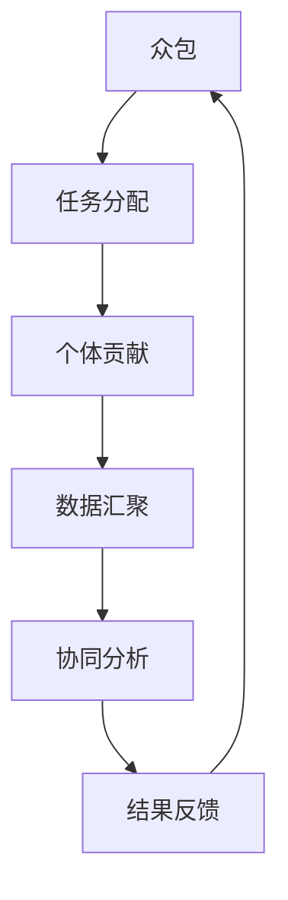

                 

# AI驱动的创新：众包与人类计算

> 关键词：众包,人类计算,机器学习,人工智能,协同创新,分布式智能,未来科技

## 1. 背景介绍

### 1.1 问题由来

随着人工智能（AI）技术的不断进步，尤其是在机器学习（ML）和深度学习（DL）领域的突破，人类计算的概念正变得愈发重要。人类计算不仅仅是指利用人类的智慧来辅助机器学习，更在于通过将人类智慧与机器学习相结合，创造出更高效、更智能的解决方案。这种结合不仅推动了科技的进步，也为各行各业带来了革命性的变化。

### 1.2 问题核心关键点

本节将简要介绍人类计算的核心概念，包括其原理、架构以及与其他关键技术的联系。

### 1.3 问题研究意义

在AI时代，人类计算将帮助我们更好地理解和利用人类的智慧，从而提升AI系统的性能和效率。通过众包和人类计算，我们能够解决许多机器学习无法直接处理的复杂问题，如伦理、道德、法律和社会问题等，这些是机器学习模型难以捕捉的。同时，人类计算也有助于推动跨学科的合作，促进科学的进步和社会的发展。

## 2. 核心概念与联系

### 2.1 核心概念概述

为了更好地理解人类计算的概念，我们将介绍几个核心概念：

- **众包（Crowdsourcing）**：指将任务外包给大量的个体，通过他们的共同努力来完成某项任务。众包充分利用了人的智慧和创造力，能够解决一些需要大量人力和时间才能完成的问题。

- **人类计算（Human Computation）**：利用人类的认知能力来辅助机器学习，解决机器难以处理的复杂问题。它通过将人类智慧与机器学习相结合，创造出更智能的解决方案。

- **协同创新（Collaborative Innovation）**：指多个人或组织共同合作，共同推动技术或产品的创新和改进。通过众包和人类计算，可以实现跨学科、跨领域的协同创新，促进科学的进步和社会的发展。

- **分布式智能（Distributed Intelligence）**：将智能分布到多个个体或设备上，实现共同协作解决问题。人类计算正是分布式智能的一种表现形式，它将人类智慧与机器智能相结合，提高了整体系统的智能水平。

### 2.2 核心概念原理和架构的 Mermaid 流程图



此图展示了众包的基本流程：任务分配给个体，个体贡献数据，数据汇聚进行分析，分析结果反馈给个体，形成闭环，不断优化。

## 3. 核心算法原理 & 具体操作步骤

### 3.1 算法原理概述

人类计算的核心算法原理主要基于众包和协同计算。通过众包的方式，将任务分配给大量个体，每个个体利用自己的认知能力处理小部分数据，最后汇聚数据并共同进行分析，得出最终结果。这种算法原理的核心在于利用大规模的个体智慧来解决复杂问题。

### 3.2 算法步骤详解

人类计算的具体操作步骤可以分为以下几个步骤：

1. **任务分配**：将任务拆分成多个小任务，分配给不同的个体处理。
2. **个体贡献**：每个个体利用自己的认知能力处理分配到的小任务，并提交结果。
3. **数据汇聚**：将各个体提交的结果进行汇聚，形成完整的数据集。
4. **协同分析**：利用分布式计算技术，对汇聚的数据进行协同分析，得出最终结果。
5. **结果反馈**：将最终结果反馈给各个个体，形成闭环，不断优化。

### 3.3 算法优缺点

人类计算的优点在于：

- **充分利用人类智慧**：能够解决机器难以处理的复杂问题，如伦理、道德、法律和社会问题等。
- **提升系统智能水平**：通过将人类智慧与机器学习相结合，创造出更智能的解决方案。

但人类计算也存在一些缺点：

- **依赖个体智慧**：个体智慧的差异可能导致结果的不一致性。
- **数据隐私问题**：汇聚的数据可能涉及个人隐私，需要特别注意数据保护。
- **时间成本高**：利用个体智慧需要较长时间，可能不适合一些紧急任务。

### 3.4 算法应用领域

人类计算的应用领域非常广泛，涵盖科技、医疗、教育、金融、环境保护等诸多领域。以下以几个典型应用为例：

1. **医疗诊断**：利用众包的方式，收集大量病历数据，利用人类智慧进行疾病诊断和治疗方案设计。
2. **教育培训**：通过众包的方式，收集大量学习数据，利用人类智慧进行教材编写和教学方法改进。
3. **环境保护**：利用众包的方式，收集大量环境数据，利用人类智慧进行生态保护和环境治理。
4. **金融风险管理**：利用众包的方式，收集大量金融数据，利用人类智慧进行风险评估和管理。

## 4. 数学模型和公式 & 详细讲解 & 举例说明

### 4.1 数学模型构建

人类计算的数学模型通常包括众包模型的构建和协同计算模型的构建。以下是两个典型的数学模型：

- **众包模型**：$P_i = f(x_i, \theta)$，其中 $P_i$ 表示个体 $i$ 的处理结果，$x_i$ 表示个体 $i$ 处理的数据，$\theta$ 表示个体 $i$ 的处理能力。
- **协同计算模型**：$C = g(P_1, P_2, \cdots, P_n)$，其中 $C$ 表示最终的结果，$P_i$ 表示个体 $i$ 的处理结果，$g$ 表示协同分析的函数。

### 4.2 公式推导过程

以众包模型为例，推导其数学公式：

设个体 $i$ 的处理能力为 $\theta_i$，则个体 $i$ 的处理结果为：

$$P_i = f(x_i, \theta_i)$$

假设个体 $i$ 的处理能力服从正态分布 $N(\mu, \sigma^2)$，则有：

$$P_i = \mu + \sigma \epsilon_i$$

其中 $\epsilon_i \sim N(0, 1)$ 为独立同分布的随机变量。

因此，最终的结果 $C$ 可以表示为：

$$C = g\left(\mu + \sigma \epsilon_1, \mu + \sigma \epsilon_2, \cdots, \mu + \sigma \epsilon_n\right)$$

### 4.3 案例分析与讲解

以众包医疗诊断为例，分析其数学模型的应用。

假设某医院需要诊断一种罕见疾病，但医院的专家团队有限，无法覆盖所有可能的症状。此时，可以采用众包的方式，将患者病历数据分配给大量医生进行处理。每个医生根据其专业知识，对病历数据进行分析，并提交诊断结果。医院将各医生的诊断结果汇总，利用协同计算技术进行分析，得出最终的诊断结论。

## 5. 项目实践：代码实例和详细解释说明

### 5.1 开发环境搭建

在进行人类计算项目实践前，我们需要准备好开发环境。以下是使用Python进行人类计算项目开发的流程：

1. **安装Python**：从官网下载并安装Python，确保安装最新版本。
2. **安装必要的库**：安装TensorFlow、PyTorch等深度学习库，以及众包平台所需的库，如Flask、Redis等。
3. **搭建众包平台**：使用Flask搭建一个众包平台，用于任务分配和结果提交。
4. **配置协同计算环境**：搭建分布式计算环境，如Hadoop、Spark等，用于数据的汇聚和协同分析。

### 5.2 源代码详细实现

以众包医疗诊断项目为例，给出一个使用TensorFlow和Flask实现源代码的实例：

```python
# 1. 导入必要的库
import tensorflow as tf
from flask import Flask, request, jsonify

# 2. 定义模型
def build_model():
    # 构建模型
    model = tf.keras.Sequential([
        tf.keras.layers.Dense(64, activation='relu', input_shape=(784,)),
        tf.keras.layers.Dense(10, activation='softmax')
    ])
    # 编译模型
    model.compile(optimizer=tf.keras.optimizers.Adam(0.001),
                  loss=tf.keras.losses.SparseCategoricalCrossentropy(from_logits=True),
                  metrics=[tf.keras.metrics.SparseCategoricalAccuracy()])
    return model

# 3. 定义Flask应用
app = Flask(__name__)

# 4. 定义任务分配和结果提交路由
@app.route('/assign', methods=['POST'])
def assign_task():
    # 获取任务数据
    data = request.get_json()
    task_id = data['task_id']
    data = data['data']
    # 分配任务
    assign_task_to_doctors(task_id, data)
    return jsonify({'task_id': task_id, 'status': 'task assigned'})

@app.route('/submit', methods=['POST'])
def submit_result():
    # 获取提交结果
    data = request.get_json()
    task_id = data['task_id']
    result = data['result']
    # 汇总结果
    combine_results(task_id, result)
    return jsonify({'task_id': task_id, 'status': 'result submitted'})

# 5. 定义众包处理函数
def assign_task_to_doctors(task_id, data):
    # 将任务分配给医生
    doctors = get_available_doctors()
    for doctor in doctors:
        assign_task_to_doctor(task_id, data, doctor)

def assign_task_to_doctor(task_id, data, doctor):
    # 分配任务给医生
    doctors[data] = doctor
    # 医生处理数据
    result = process_data(data, doctor)
    # 提交结果
    submit_result(task_id, result)

# 6. 定义协同分析函数
def combine_results(task_id, result):
    # 汇总结果
    results = {}
    for doctor in doctors:
        data = doctors[doctor]
        result = process_data(data, doctor)
        results[doctor] = result
    # 进行协同分析
    combined_result = combine_results(results)
    # 输出结果
    output_result(task_id, combined_result)

# 7. 定义其他函数
def get_available_doctors():
    # 获取可用医生列表
    pass

def process_data(data, doctor):
    # 处理数据
    pass

def combine_results(results):
    # 组合结果
    pass

def output_result(task_id, result):
    # 输出结果
    pass

# 8. 运行Flask应用
if __name__ == '__main__':
    app.run(debug=True)
```

### 5.3 代码解读与分析

让我们详细解读一下关键代码的实现细节：

**Flask应用**：
- 使用Flask搭建一个Web应用，提供任务分配和结果提交的接口。
- 任务分配接口`assign_task`：接收任务数据，并将其分配给医生。
- 结果提交接口`submit_result`：接收医生提交的结果，并将其汇总。

**众包处理函数**：
- `assign_task_to_doctors`：将任务分配给医生。
- `assign_task_to_doctor`：将任务分配给具体医生，并让其处理数据。
- `process_data`：处理数据，并生成结果。

**协同分析函数**：
- `combine_results`：汇总医生提交的结果，并进行协同分析。
- `combined_result`：生成最终的组合结果。
- `output_result`：输出最终的组合结果。

通过上述代码，我们可以看到人类计算项目的基本实现流程：任务分配、个体贡献、数据汇聚和协同分析。这个例子展示了如何使用Python和TensorFlow等库来实现众包医疗诊断项目。

### 5.4 运行结果展示

运行上述代码，我们可以得到一个众包平台，医生可以通过该平台接收任务、提交结果，并查看其他医生的结果。最终，平台会汇总医生的结果，进行协同分析，输出最终的诊断结论。

## 6. 实际应用场景

### 6.1 智能交通系统

智能交通系统利用人类计算技术，结合众包和分布式计算，实现交通流量分析和智能交通控制。通过众包的方式，收集大量交通数据，利用人类智慧进行流量分析和控制，提升交通系统的效率和安全性。

### 6.2 金融风险评估

金融行业利用人类计算技术，结合众包和分布式计算，进行风险评估和管理。通过众包的方式，收集大量金融数据，利用人类智慧进行风险分析和评估，提升风险管理的准确性和效率。

### 6.3 环境保护

环境保护领域利用人类计算技术，结合众包和分布式计算，进行生态保护和环境治理。通过众包的方式，收集大量环境数据，利用人类智慧进行数据分析和决策，提升环境保护的效果和效率。

## 7. 工具和资源推荐

### 7.1 学习资源推荐

为了帮助开发者系统掌握人类计算的理论基础和实践技巧，这里推荐一些优质的学习资源：

1. **《人工智能导论》**：介绍人工智能的基本概念和算法，包括众包和人类计算的相关内容。
2. **Coursera《人工智能》课程**：由斯坦福大学开设，涵盖人工智能的多个方面，包括机器学习、深度学习、自然语言处理等。
3. **Kaggle竞赛平台**：利用众包和人类计算技术，进行数据标注和数据分析。
4. **GitHub众包平台**：提供一个开源众包平台，用于任务分配和结果提交。
5. **TensorFlow官方文档**：提供TensorFlow库的使用指南和案例，包括分布式计算和协同计算的内容。

通过这些资源的学习实践，相信你一定能够快速掌握人类计算的精髓，并用于解决实际的AI问题。

### 7.2 开发工具推荐

高效的开发离不开优秀的工具支持。以下是几款用于人类计算开发的常用工具：

1. **Flask**：Python的Web应用框架，用于搭建任务分配和结果提交的接口。
2. **TensorFlow**：深度学习库，支持分布式计算和协同计算。
3. **Redis**：分布式缓存系统，用于存储和管理任务数据。
4. **Hadoop**：分布式计算平台，用于数据的汇聚和分析。
5. **Spark**：快速、通用的大数据处理引擎，用于分布式计算和协同计算。
6. **Docker**：容器化技术，用于部署和管理分布式应用。

合理利用这些工具，可以显著提升人类计算项目的开发效率，加快创新迭代的步伐。

### 7.3 相关论文推荐

人类计算的研究源于学界的持续研究。以下是几篇奠基性的相关论文，推荐阅读：

1. **《众包经济学》**：介绍众包的基本概念和应用，探讨其经济性和可行性。
2. **《人类计算的未来》**：探讨人类计算的未来发展趋势和应用前景。
3. **《分布式人工智能》**：介绍分布式人工智能的基本概念和算法，包括分布式计算和协同计算的内容。
4. **《智能交通系统的众包技术》**：介绍智能交通系统中的众包应用，提升交通系统的效率和安全性。
5. **《金融风险管理中的人类计算》**：探讨金融风险管理中的人类计算应用，提升风险评估的准确性和效率。

这些论文代表了大规模计算和微调技术的发展脉络。通过学习这些前沿成果，可以帮助研究者把握学科前进方向，激发更多的创新灵感。

## 8. 总结：未来发展趋势与挑战

### 8.1 总结

本文对基于众包和人类计算的AI技术进行了全面系统的介绍。首先阐述了众包和人类计算的概念及其研究背景和意义，明确了其在提升AI系统性能和效率方面的独特价值。其次，从原理到实践，详细讲解了人类计算的数学模型和操作步骤，给出了人类计算项目开发的完整代码实例。同时，本文还广泛探讨了人类计算技术在智能交通、金融风险管理、环境保护等多个领域的应用前景，展示了人类计算技术的广阔前景。最后，本文精选了人类计算技术的各类学习资源和开发工具，力求为读者提供全方位的技术指引。

通过本文的系统梳理，可以看到，人类计算技术正逐步成为AI技术的重要组成部分，极大地提升了AI系统的智能水平和应用范围。未来，伴随人类计算技术的不断演进，人工智能技术必将更加智能、高效，为人类社会的进步做出更大贡献。

### 8.2 未来发展趋势

展望未来，人类计算技术将呈现以下几个发展趋势：

1. **自动化程度提高**：随着技术的进步，自动化程度将不断提高，减少人类智慧的介入，提升系统的效率和稳定性。
2. **分布式计算优化**：分布式计算技术将进一步优化，提升数据汇聚和协同分析的效率，减少时间和成本的浪费。
3. **跨领域协同创新**：人类计算将推动跨学科、跨领域的协同创新，促进科学的进步和社会的发展。
4. **AI伦理和道德约束**：随着人类计算技术的发展，AI伦理和道德约束将愈发重要，需加强监管和规范。
5. **数据隐私和安全保护**：汇聚的数据可能涉及个人隐私，需加强数据保护，确保隐私和安全。

这些趋势展示了人类计算技术的广阔前景，将为AI技术的未来发展提供新的方向。

### 8.3 面临的挑战

尽管人类计算技术已经取得了瞩目成就，但在迈向更加智能化、普适化应用的过程中，它仍面临着诸多挑战：

1. **数据质量问题**：众包和人类计算的结果依赖于个体智慧，数据质量可能存在差异，需加强数据质量管理。
2. **个体智慧差异**：个体智慧的差异可能导致结果的不一致性，需加强个体智慧的训练和管理。
3. **计算资源成本**：分布式计算需要大量的计算资源，成本较高，需优化计算资源配置。
4. **数据隐私问题**：汇聚的数据可能涉及个人隐私，需加强数据保护。
5. **系统复杂性**：系统设计复杂，需提高系统的可维护性和可扩展性。

这些挑战需我们不断探索和解决，才能将人类计算技术推向更高的台阶。

### 8.4 研究展望

面对人类计算技术所面临的挑战，未来的研究需要在以下几个方面寻求新的突破：

1. **自动化技术改进**：开发更加自动化的人类计算系统，减少人类智慧的介入，提升系统的效率和稳定性。
2. **跨领域协同创新**：推动跨学科、跨领域的协同创新，促进科学的进步和社会的发展。
3. **数据质量提升**：加强数据质量管理，提升众包和人类计算的结果可靠性。
4. **隐私保护技术**：开发隐私保护技术，保障数据隐私和安全。
5. **系统设计优化**：提高系统的可维护性和可扩展性，降低系统设计复杂性。

这些研究方向将推动人类计算技术的不断演进，为AI技术的未来发展提供新的动力。

## 9. 附录：常见问题与解答

**Q1: 人类计算和机器学习的区别是什么？**

A: 人类计算和机器学习的区别在于，人类计算利用人类的智慧和认知能力来辅助机器学习，解决机器难以处理的复杂问题；而机器学习则完全依赖于算法和数据，自动学习并优化模型。

**Q2: 人类计算和众包的区别是什么？**

A: 人类计算和众包的区别在于，人类计算是将人类智慧与机器学习相结合，解决机器难以处理的复杂问题；而众包是将任务外包给大量个体，利用他们的智慧和创造力来解决一些需要大量人力和时间才能完成的问题。

**Q3: 人类计算的缺点有哪些？**

A: 人类计算的缺点包括依赖个体智慧、数据隐私问题、时间成本高，可能导致结果不一致性。

**Q4: 人类计算的应用领域有哪些？**

A: 人类计算的应用领域包括智能交通系统、金融风险评估、环境保护等。

**Q5: 人类计算的未来发展趋势是什么？**

A: 人类计算的未来发展趋势包括自动化程度提高、分布式计算优化、跨领域协同创新、AI伦理和道德约束、数据隐私和安全保护等。

---

作者：禅与计算机程序设计艺术 / Zen and the Art of Computer Programming

