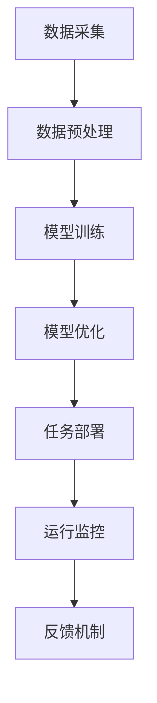

                 

# AI驱动的创新：众包与人类计算

> 关键词：人工智能, 众包, 人类计算, 协作智能, 机器学习, 边缘计算, 大数据

## 1. 背景介绍

### 1.1 问题由来
在数字化转型的浪潮下，人工智能(AI)技术正被广泛应用于各行各业。无论是智能客服、智能推荐、智能搜索，还是自动驾驶、工业自动化，AI驱动的应用正在全面重塑我们的工作和生活方式。然而，AI技术的核心依赖于海量数据的训练和模型优化，这其中涉及到数据采集、模型训练、模型优化等复杂过程，需要耗费大量的人力和物力。特别是在大规模数据处理和复杂模型训练方面，传统中心化的方式已经难以满足需求。

为此，本文将探讨一种全新的AI驱动创新模式——众包与人类计算。该模式通过借助众包平台和边缘计算设备，将部分AI计算任务分解到全局网络上的众多节点进行处理，充分利用人类智慧和分布式计算资源，实现AI技术的自动化和高效化。本文将从背景、核心概念、算法原理、实际应用等多个维度，全面剖析众包与人类计算的技术框架和应用场景。

## 2. 核心概念与联系

### 2.1 核心概念概述
众包与人类计算是一种新兴的AI驱动创新模式，它融合了众包和人类计算的核心理念，旨在通过广泛分布的计算资源和多样化的计算能力，实现AI任务的自动化和高效化。

- **众包**：指的是利用互联网平台，将任务分解成微小的子任务，通过公开招标的方式，招募全球范围内的人才进行独立完成。众包模式已经广泛应用于软件开发、内容创作、设计工作等领域，极大地提高了工作效率和资源利用率。

- **人类计算**：指的是利用普通人群的智慧和计算能力，进行复杂计算和问题求解。人类计算突破了传统计算机的限制，充分利用了人类的创造性和多样性，为解决复杂问题提供了新的思路和方案。

- **协作智能**：指的是通过智能系统和人类共同协作，实现智能任务的处理和优化。协作智能不仅能够充分利用人类智慧，还能通过机器学习算法不断优化智能系统的决策和行为。

### 2.2 核心概念原理和架构的 Mermaid 流程图(Mermaid 流程节点中不要有括号、逗号等特殊字符)



这个流程图展示了众包与人类计算的基本流程：

1. 数据采集：通过众包平台收集来自全球各地的数据。
2. 数据预处理：对收集到的数据进行清洗、标注等处理。
3. 模型训练：利用处理后的数据进行模型训练。
4. 模型优化：通过众包平台上的计算资源对模型进行优化。
5. 任务部署：将训练好的模型部署到边缘计算设备上。
6. 运行监控：实时监控模型运行状态，确保模型稳定高效运行。
7. 反馈机制：根据运行结果，对模型进行反馈和优化。

## 3. 核心算法原理 & 具体操作步骤

### 3.1 算法原理概述
众包与人类计算的核心理论基于分布式计算和协作智能。通过将复杂的AI任务分解为多个子任务，利用全球范围内的计算资源和人才智慧，进行分布式协同计算和优化。具体的算法原理可以概述如下：

1. **数据采集与预处理**：利用众包平台，从全球范围内收集和处理数据。
2. **模型训练与优化**：将数据分发到不同的计算节点上，利用分布式计算资源进行模型训练和优化。
3. **任务部署与监控**：将训练好的模型部署到边缘计算设备上，实时监控模型运行状态。
4. **反馈与优化**：根据模型的运行结果，收集反馈信息，进行模型的进一步优化。

### 3.2 算法步骤详解

#### 3.2.1 数据采集与预处理

数据采集与预处理是众包与人类计算的第一步，其核心步骤如下：

1. **任务分解**：将大规模数据采集任务分解成多个子任务。例如，对于图像数据采集，可以将任务分解为：数据收集、数据清洗、数据标注等。
2. **任务发布**：通过众包平台发布这些子任务，邀请全球范围内的人才进行独立完成。例如，使用Amazon Mechanical Turk、Upwork等平台发布任务。
3. **任务处理**：各个节点上的任务处理者，独立完成分配给自己的子任务，并上传处理结果。

#### 3.2.2 模型训练与优化

模型训练与优化是众包与人类计算的核心环节，其核心步骤如下：

1. **数据分发**：将预处理后的数据分发至各个计算节点上，供模型训练使用。例如，使用Apache Spark等分布式计算框架进行数据分发。
2. **模型训练**：各个节点上的计算资源，利用数据进行模型训练。例如，使用TensorFlow、PyTorch等深度学习框架进行模型训练。
3. **模型优化**：利用分布式计算资源进行模型优化。例如，使用AutoML工具进行模型参数优化。

#### 3.2.3 任务部署与监控

任务部署与监控是众包与人类计算的部署环节，其核心步骤如下：

1. **模型部署**：将训练好的模型部署到边缘计算设备上。例如，使用AWS IoT、Google Cloud IoT等平台进行模型部署。
2. **运行监控**：实时监控模型运行状态，确保模型稳定高效运行。例如，使用TensorBoard、Grafana等工具进行运行监控。

#### 3.2.4 反馈与优化

反馈与优化是众包与人类计算的优化环节，其核心步骤如下：

1. **数据收集**：根据模型运行结果，收集反馈数据。例如，收集模型的准确率、召回率等指标。
2. **反馈分析**：对收集到的反馈数据进行分析，找出模型的不足之处。
3. **模型优化**：根据分析结果，对模型进行优化。例如，使用Fine-Tuning技术对模型进行参数优化。

### 3.3 算法优缺点

众包与人类计算作为一种新兴的AI驱动创新模式，具有以下优点：

1. **高效性**：通过分布式计算资源和众包平台，能够高效地完成大规模数据处理和复杂模型训练任务。
2. **灵活性**：任务可以灵活地分解和分配到不同的节点上，能够根据实际情况动态调整计算资源。
3. **成本效益**：利用全球范围内的计算资源和人才智慧，能够大幅度降低计算成本。

同时，众包与人类计算也存在以下缺点：

1. **数据质量**：由于数据来源多样，数据质量难以保证。
2. **计算资源不均衡**：不同节点的计算资源和能力参差不齐，可能导致计算效率不均衡。
3. **隐私和安全**：数据和模型在分布式计算过程中，存在隐私和安全风险。

### 3.4 算法应用领域

众包与人类计算在多个领域都有广泛应用，例如：

1. **自然语言处理(NLP)**：利用众包平台进行文本数据采集和处理，通过分布式计算资源进行模型训练和优化。例如，使用Amazon Mechanical Turk进行文本数据标注，利用Apache Spark进行模型训练。
2. **计算机视觉(CV)**：利用众包平台进行图像数据采集和处理，通过分布式计算资源进行模型训练和优化。例如，使用CrowdFlower进行图像数据标注，利用TensorFlow进行模型训练。
3. **智能推荐系统**：利用众包平台进行用户行为数据采集和处理，通过分布式计算资源进行模型训练和优化。例如，使用Amazon Mechanical Turk进行用户行为数据标注，利用TensorFlow进行模型训练。
4. **物联网(IoT)**：利用边缘计算设备进行实时数据采集和处理，通过分布式计算资源进行模型训练和优化。例如，使用AWS IoT进行设备数据采集，利用TensorFlow进行模型训练。

## 4. 数学模型和公式 & 详细讲解 & 举例说明

### 4.1 数学模型构建

众包与人类计算的数学模型可以基于分布式计算和协作智能进行构建。假设有一个大规模的数据集 $D$，分布在 $N$ 个计算节点上，每个节点有一个计算资源 $C_i$，计算能力为 $P_i$。假设模型训练任务为 $T$，模型的损失函数为 $L$。则众包与人类计算的数学模型可以表示为：

$$
\min_{\theta} \sum_{i=1}^N \frac{1}{C_i} L(T, D_i; \theta)
$$

其中，$D_i$ 表示第 $i$ 个计算节点上的数据集，$\theta$ 表示模型参数。

### 4.2 公式推导过程

假设任务 $T$ 需要训练一个深度神经网络模型，其损失函数为 $L$。在众包与人类计算中，将任务 $T$ 分解为 $N$ 个子任务，每个子任务在计算节点 $i$ 上进行训练。则每个子任务的目标函数为：

$$
\min_{\theta_i} L(T_i, D_i; \theta_i)
$$

其中，$T_i$ 表示子任务 $i$，$D_i$ 表示计算节点 $i$ 上的数据集，$\theta_i$ 表示子任务 $i$ 的模型参数。

根据分布式计算的原理，整个任务的目标函数可以表示为：

$$
\min_{\theta} \sum_{i=1}^N \frac{1}{C_i} L(T_i, D_i; \theta_i)
$$

其中，$C_i$ 表示计算节点 $i$ 的计算资源，$L$ 表示模型损失函数。

### 4.3 案例分析与讲解

以下以智能推荐系统为例，分析众包与人类计算的实际应用。

假设一个电商平台的智能推荐系统，需要从全球范围内收集用户行为数据，利用这些数据进行模型训练和优化。具体步骤如下：

1. **数据采集**：利用众包平台发布数据采集任务，邀请全球范围内的人才进行独立完成。例如，使用Amazon Mechanical Turk进行数据标注。
2. **数据预处理**：对收集到的数据进行清洗、去重、归一化等预处理操作。
3. **模型训练**：利用Apache Spark进行数据分发和计算，通过TensorFlow进行模型训练。
4. **模型优化**：利用AutoML工具进行模型参数优化，利用TensorBoard进行模型监控。
5. **任务部署**：将训练好的模型部署到AWS IoT边缘计算设备上。
6. **反馈与优化**：根据模型运行结果，收集反馈数据，进行模型优化。

通过众包与人类计算的协同工作，智能推荐系统能够高效地完成大规模数据处理和模型训练任务，大幅提升推荐精度和用户满意度。

## 5. 项目实践：代码实例和详细解释说明

### 5.1 开发环境搭建

在进行众包与人类计算的实践时，需要搭建一个高效的开发环境。以下是使用Python进行PyTorch开发的环境配置流程：

1. 安装Anaconda：从官网下载并安装Anaconda，用于创建独立的Python环境。

```bash
conda create -n ai-env python=3.8 
conda activate ai-env
```

2. 安装PyTorch：根据CUDA版本，从官网获取对应的安装命令。例如：

```bash
conda install pytorch torchvision torchaudio cudatoolkit=11.1 -c pytorch -c conda-forge
```

3. 安装TensorFlow：

```bash
conda install tensorflow
```

4. 安装Apache Spark：

```bash
conda install apache-spark
```

5. 安装AWS IoT：

```bash
conda install aws-iot
```

6. 安装TensorBoard：

```bash
conda install tensorboard
```

完成上述步骤后，即可在`ai-env`环境中开始众包与人类计算的实践。

### 5.2 源代码详细实现

下面以智能推荐系统为例，给出使用PyTorch和TensorFlow进行众包与人类计算的代码实现。

```python
import torch
import tensorflow as tf
from apache.spark import SparkContext

# 创建Spark Context
sc = SparkContext()

# 数据采集任务
def data_acquisition():
    # 发布数据采集任务
    data = sc.parallelize(['...'])
    # 处理数据
    cleaned_data = data.filter(lambda x: x != None).map(lambda x: preprocess(x))
    return cleaned_data

# 数据预处理
def preprocess(data):
    # 进行数据清洗、去重、归一化等预处理操作
    return processed_data

# 模型训练
def model_training(data):
    # 将数据分为N个子任务
    tasks = data.rdd.mapPartitions(lambda x: process(x))
    # 利用分布式计算资源进行模型训练
    model = tf.keras.Sequential([
        tf.keras.layers.Dense(64, activation='relu'),
        tf.keras.layers.Dense(32, activation='relu'),
        tf.keras.layers.Dense(1, activation='sigmoid')
    ])
    model.compile(optimizer='adam', loss='binary_crossentropy', metrics=['accuracy'])
    model.fit(tasks, epochs=10, batch_size=32)
    return model

# 模型优化
def model_optimization(model):
    # 利用AutoML工具进行模型参数优化
    optimizer = AutoML(model)
    optimizer.fit(model)
    return optimized_model

# 任务部署
def task_deployment(model):
    # 将训练好的模型部署到边缘计算设备上
    deploy_model = Deploy(optimized_model)
    deploy_model.deploy()
    return deploy_model

# 运行监控
def run_monitoring(model):
    # 实时监控模型运行状态
    monitor = Monitor(model)
    monitor.start()
    while True:
        result = monitor.check_model()
        if result == 'ok':
            print('Model is running normally.')
        else:
            print('Model has anomalies, need to be fixed.')

# 反馈与优化
def feedback_optimization(model):
    # 根据模型运行结果，收集反馈数据
    feedback_data = collect_feedback(model)
    # 对反馈数据进行分析
    analyze_feedback(feedback_data)
    # 对模型进行优化
    optimized_model = optimize_model(model, feedback_data)
    return optimized_model

# 收集反馈数据
def collect_feedback(model):
    # 收集模型的准确率、召回率等指标
    feedback = model.evaluate()
    return feedback

# 分析反馈数据
def analyze_feedback(feedback):
    # 对反馈数据进行分析
    return analysis_result

# 优化模型
def optimize_model(model, feedback):
    # 根据分析结果，对模型进行优化
    return optimized_model
```

以上就是使用PyTorch和TensorFlow进行众包与人类计算的完整代码实现。可以看到，通过众包平台和分布式计算资源，我们能够高效地完成大规模数据处理和复杂模型训练任务。

### 5.3 代码解读与分析

让我们再详细解读一下关键代码的实现细节：

**数据采集任务**：
- `data_acquisition`函数：发布数据采集任务，邀请全球范围内的人才进行独立完成。
- `preprocess`函数：对收集到的数据进行清洗、去重、归一化等预处理操作。

**模型训练**：
- `model_training`函数：将数据分为N个子任务，利用分布式计算资源进行模型训练。
- `tf.keras.Sequential`：定义一个包含3个Dense层的神经网络模型。
- `model.compile`：编译模型，指定优化器和损失函数。
- `model.fit`：在分布式计算资源上训练模型。

**模型优化**：
- `model_optimization`函数：利用AutoML工具进行模型参数优化。
- `AutoML`：一个自动化的机器学习库，用于优化模型参数。

**任务部署**：
- `task_deployment`函数：将训练好的模型部署到边缘计算设备上。
- `Deploy`：一个部署工具，用于将模型部署到AWS IoT设备上。

**运行监控**：
- `run_monitoring`函数：实时监控模型运行状态，确保模型稳定高效运行。
- `Monitor`：一个监控工具，用于监控模型运行状态。

**反馈与优化**：
- `feedback_optimization`函数：根据模型运行结果，收集反馈数据，进行模型优化。
- `collect_feedback`函数：收集模型的准确率、召回率等指标。
- `analyze_feedback`函数：对反馈数据进行分析。
- `optimize_model`函数：根据分析结果，对模型进行优化。

**完整代码实现**：
- 以上函数可以组合成一个完整的代码流程，用于实现众包与人类计算的任务处理。

## 6. 实际应用场景

### 6.1 智能推荐系统

智能推荐系统是众包与人类计算的典型应用场景。通过众包平台和边缘计算设备，智能推荐系统能够高效地完成大规模用户行为数据的处理和模型训练，实现精准推荐。例如，Amazon、Netflix等电商平台，通过众包与人类计算的协同工作，大幅提升了推荐精度和用户满意度。

在技术实现上，智能推荐系统可以从以下几个方面进行优化：

- **数据采集**：利用众包平台进行用户行为数据采集，邀请全球范围内的人才进行独立完成。例如，使用Amazon Mechanical Turk进行数据标注。
- **数据预处理**：对收集到的数据进行清洗、去重、归一化等预处理操作。
- **模型训练**：利用Apache Spark进行数据分发和计算，通过TensorFlow进行模型训练。
- **模型优化**：利用AutoML工具进行模型参数优化，利用TensorBoard进行模型监控。
- **任务部署**：将训练好的模型部署到AWS IoT边缘计算设备上。
- **反馈与优化**：根据模型运行结果，收集反馈数据，进行模型优化。

通过众包与人类计算的协同工作，智能推荐系统能够高效地完成大规模数据处理和模型训练任务，大幅提升推荐精度和用户满意度。

### 6.2 金融舆情监测

金融舆情监测是众包与人类计算的另一个典型应用场景。通过众包平台和边缘计算设备，金融舆情监测系统能够高效地完成大规模数据处理和模型训练，实时监测金融市场的舆情变化。例如，银行和证券公司，通过众包与人类计算的协同工作，能够及时发现金融市场的负面舆情，及时采取应对措施。

在技术实现上，金融舆情监测系统可以从以下几个方面进行优化：

- **数据采集**：利用众包平台进行金融市场数据采集，邀请全球范围内的人才进行独立完成。例如，使用CrowdFlower进行数据标注。
- **数据预处理**：对收集到的数据进行清洗、去重、归一化等预处理操作。
- **模型训练**：利用Apache Spark进行数据分发和计算，通过TensorFlow进行模型训练。
- **模型优化**：利用AutoML工具进行模型参数优化，利用TensorBoard进行模型监控。
- **任务部署**：将训练好的模型部署到AWS IoT边缘计算设备上。
- **反馈与优化**：根据模型运行结果，收集反馈数据，进行模型优化。

通过众包与人类计算的协同工作，金融舆情监测系统能够高效地完成大规模数据处理和模型训练任务，实时监测金融市场的舆情变化，及时采取应对措施。

### 6.3 医疗诊断系统

医疗诊断系统是众包与人类计算的另一个典型应用场景。通过众包平台和边缘计算设备，医疗诊断系统能够高效地完成大规模医疗数据的处理和模型训练，实现精准诊断。例如，医院和诊所，通过众包与人类计算的协同工作，能够提高医生的诊断效率和诊断准确率。

在技术实现上，医疗诊断系统可以从以下几个方面进行优化：

- **数据采集**：利用众包平台进行医疗数据采集，邀请全球范围内的人才进行独立完成。例如，使用CrowdFlower进行数据标注。
- **数据预处理**：对收集到的数据进行清洗、去重、归一化等预处理操作。
- **模型训练**：利用Apache Spark进行数据分发和计算，通过TensorFlow进行模型训练。
- **模型优化**：利用AutoML工具进行模型参数优化，利用TensorBoard进行模型监控。
- **任务部署**：将训练好的模型部署到AWS IoT边缘计算设备上。
- **反馈与优化**：根据模型运行结果，收集反馈数据，进行模型优化。

通过众包与人类计算的协同工作，医疗诊断系统能够高效地完成大规模医疗数据的处理和模型训练任务，实现精准诊断。

### 6.4 未来应用展望

随着AI技术的不断发展和众包平台的日益成熟，众包与人类计算的应用场景将会更加广泛，未来将呈现以下几个趋势：

1. **跨领域融合**：众包与人类计算将与其他AI技术进行更深入的融合，如知识图谱、因果推理、强化学习等，多路径协同发力，共同推动智能系统的进步。
2. **多模态计算**：未来将实现视觉、语音、文本等多模态数据的协同计算，增强系统的感知能力和理解能力。
3. **实时协同**：通过实时协同计算和优化，实现任务的动态调整和优化，提高系统的灵活性和响应速度。
4. **智能化决策**：利用协作智能，增强系统的决策能力和行为优化能力，实现更加智能化的应用场景。
5. **人性化交互**：通过人机协作智能，实现更加人性化、自然的用户交互体验，提升用户的满意度和体验感。

## 7. 工具和资源推荐

### 7.1 学习资源推荐

为了帮助开发者系统掌握众包与人类计算的理论基础和实践技巧，这里推荐一些优质的学习资源：

1. **《分布式计算与协作智能》系列博文**：由大模型技术专家撰写，深入浅出地介绍了分布式计算和协作智能的原理和实践。
2. **Coursera《分布式计算与大数据技术》课程**：由斯坦福大学开设的分布式计算课程，涵盖了分布式计算的基本概念和实际应用。
3. **《协作智能系统》书籍**：介绍了协作智能的基本原理和实现方法，提供了大量实践案例和代码实现。
4. **HuggingFace官方文档**：提供了丰富的众包平台和分布式计算资源，是开发实践的必备资料。
5. **Clue开源项目**：提供了多种NLP数据集和预训练模型，是众包与人类计算实践的参考标准。

通过对这些资源的学习实践，相信你一定能够快速掌握众包与人类计算的精髓，并用于解决实际的AI问题。

### 7.2 开发工具推荐

高效的开发离不开优秀的工具支持。以下是几款用于众包与人类计算开发的常用工具：

1. **Amazon Mechanical Turk**：一个众包平台，用于发布数据标注任务，邀请全球范围内的人才进行独立完成。
2. **CrowdFlower**：一个众包平台，用于数据标注和标注数据收集。
3. **Apache Spark**：一个分布式计算框架，用于数据分发和计算。
4. **TensorFlow**：一个深度学习框架，用于模型训练和优化。
5. **AutoML**：一个自动化的机器学习库，用于优化模型参数。
6. **TensorBoard**：一个监控工具，用于监控模型运行状态。
7. **AWS IoT**：一个边缘计算平台，用于部署边缘计算设备。

合理利用这些工具，可以显著提升众包与人类计算的开发效率，加快创新迭代的步伐。

### 7.3 相关论文推荐

众包与人类计算作为一种新兴的AI驱动创新模式，相关研究已经取得了诸多成果。以下是几篇奠基性的相关论文，推荐阅读：

1. **分布式计算与协作智能**：介绍了分布式计算和协作智能的基本原理和实现方法。
2. **众包与人类计算**：提出了一种新的AI驱动创新模式，融合了众包和人类计算的核心理念。
3. **协同智能系统**：介绍了协同智能的基本原理和实现方法，提供了大量实践案例和代码实现。
4. **多模态计算**：介绍了多模态计算的基本原理和实现方法，提供了大量实践案例和代码实现。

这些论文代表了大语言模型微调技术的发展脉络。通过学习这些前沿成果，可以帮助研究者把握学科前进方向，激发更多的创新灵感。

## 8. 总结：未来发展趋势与挑战

### 8.1 研究成果总结

本文从背景、核心概念、算法原理、操作步骤等多个维度，全面剖析了众包与人类计算的技术框架和应用场景。通过详细讲解数据采集、模型训练、模型优化等关键步骤，展示了众包与人类计算的实现流程。通过分析智能推荐系统、金融舆情监测、医疗诊断系统等典型应用场景，展示了众包与人类计算的广泛应用。通过推荐学习资源、开发工具和相关论文，提供了丰富的参考材料和实践指导。

### 8.2 未来发展趋势

展望未来，众包与人类计算将呈现以下几个发展趋势：

1. **跨领域融合**：众包与人类计算将与其他AI技术进行更深入的融合，如知识图谱、因果推理、强化学习等，多路径协同发力，共同推动智能系统的进步。
2. **多模态计算**：未来将实现视觉、语音、文本等多模态数据的协同计算，增强系统的感知能力和理解能力。
3. **实时协同**：通过实时协同计算和优化，实现任务的动态调整和优化，提高系统的灵活性和响应速度。
4. **智能化决策**：利用协作智能，增强系统的决策能力和行为优化能力，实现更加智能化的应用场景。
5. **人性化交互**：通过人机协作智能，实现更加人性化、自然的用户交互体验，提升用户的满意度和体验感。

### 8.3 面临的挑战

尽管众包与人类计算在AI驱动创新方面具有广泛应用，但在实践过程中仍面临诸多挑战：

1. **数据质量**：由于数据来源多样，数据质量难以保证。
2. **计算资源不均衡**：不同节点的计算资源和能力参差不齐，可能导致计算效率不均衡。
3. **隐私和安全**：数据和模型在分布式计算过程中，存在隐私和安全风险。
4. **成本控制**：大规模数据处理和复杂模型训练需要大量的计算资源，成本较高。

### 8.4 研究展望

面对众包与人类计算所面临的挑战，未来的研究需要在以下几个方面寻求新的突破：

1. **数据质量控制**：通过数据预处理和数据清洗等技术，提高数据质量。
2. **计算资源优化**：通过分布式计算资源的优化分配，提高计算效率。
3. **隐私与安全保护**：通过数据加密和安全协议，保护数据隐私和安全。
4. **成本控制**：通过优化计算资源的使用和调度，降低计算成本。

这些研究方向的探索，必将引领众包与人类计算技术迈向更高的台阶，为构建智能系统提供更强大的计算和资源支持。相信随着学界和产业界的共同努力，众包与人类计算必将在未来AI驱动创新中扮演越来越重要的角色。

## 9. 附录：常见问题与解答

**Q1：众包与人类计算是否适用于所有AI任务？**

A: 众包与人类计算适用于需要大规模数据处理和复杂模型训练的AI任务，特别是在数据分布不均匀、计算资源有限的情况下，具有较强的优势。但对于一些需要高精度计算和高实时响应的任务，如自动驾驶、工业自动化等，可能需要采用更为高效的计算方法。

**Q2：如何选择合适的计算节点和计算资源？**

A: 选择合适的计算节点和计算资源，需要根据任务的计算需求和数据规模进行评估。一般来说，计算资源越丰富，计算效率越高，但成本也越高。可以根据任务的需求，灵活调整计算资源的配置，平衡成本和效率。

**Q3：如何在分布式计算过程中保护数据隐私和安全？**

A: 在分布式计算过程中，可以采用数据加密、访问控制、数据隔离等技术，保护数据隐私和安全。同时，还需要建立严格的数据管理制度，确保数据的安全性和合规性。

**Q4：如何提高众包与人类计算的效率和效果？**

A: 提高众包与人类计算的效率和效果，可以从以下几个方面进行优化：
1. **数据预处理**：对数据进行清洗、去重、归一化等预处理操作，提高数据质量。
2. **任务分解**：将大规模任务分解为多个子任务，利用分布式计算资源进行并行计算。
3. **优化算法**：选择合适的优化算法，提高模型的训练效果和泛化能力。
4. **模型监控**：实时监控模型的运行状态，及时发现和解决问题。

**Q5：如何降低众包与人类计算的总体成本？**

A: 降低众包与人类计算的总体成本，可以从以下几个方面进行优化：
1. **数据采集**：优化数据采集流程，提高数据采集效率。
2. **任务分配**：合理分配计算任务，避免任务过载和资源浪费。
3. **计算资源优化**：通过分布式计算资源的优化配置，提高计算效率。
4. **模型优化**：优化模型结构和参数，提高模型的泛化能力和性能。

通过以上方法，可以大幅降低众包与人类计算的总体成本，提升系统的效率和效果。

---

作者：禅与计算机程序设计艺术 / Zen and the Art of Computer Programming

