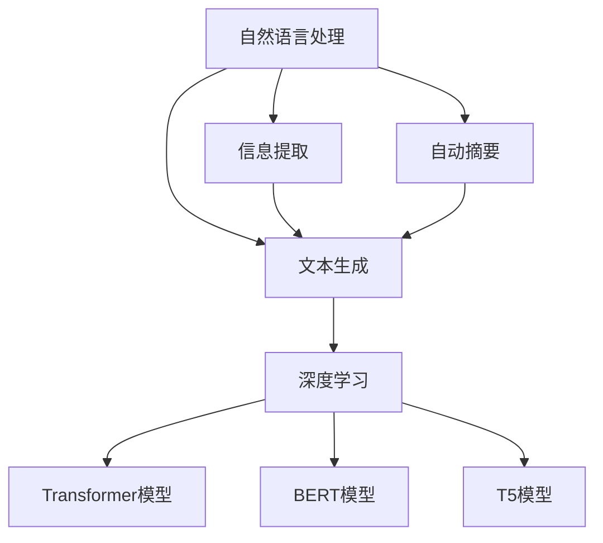

                 

# AI驱动的新闻实时更新：动态故事构建

## 1. 背景介绍

### 1.1 问题由来

近年来，随着社交媒体和网络新闻的普及，新闻行业正面临着前所未有的变化。读者不再仅仅依赖于传统媒体，而是通过社交平台和新闻聚合网站获取信息。这种变化要求新闻机构必须快速、准确地更新内容，以保持竞争力和用户黏性。同时，随着人工智能技术的发展，AI驱动的新闻实时更新成为可能，为新闻机构提供了新的机会。

### 1.2 问题核心关键点

AI驱动的新闻实时更新通过自动化的方式，实时监控新闻事件，自动提取信息，并通过自然语言处理技术自动生成新闻稿。这一过程涉及数据采集、信息提取、文本生成等多个环节，需要高度的自动化和智能化。

主要关键点包括：

- **数据采集**：从各类来源实时采集新闻事件信息。
- **信息提取**：从采集的数据中提取关键信息，如事件时间、地点、涉及人物、事件结果等。
- **文本生成**：基于提取的信息自动生成新闻稿，包括标题、正文等。

这些环节的自动化和智能化，不仅能够显著提高新闻更新的速度和效率，还能降低人工成本，提升新闻的准确性和时效性。

### 1.3 问题研究意义

AI驱动的新闻实时更新技术，对于新闻机构而言具有重要意义：

1. **提升新闻速度和时效性**：实时更新确保读者能够第一时间获取最新信息，提升用户满意度。
2. **降低人力成本**：自动化流程减少了人工工作量，提高了工作效率。
3. **提高新闻质量**：自动化的信息提取和文本生成技术，提高了新闻的准确性和客观性。
4. **拓展新闻覆盖范围**：通过自动化数据采集，覆盖更多的新闻来源和事件。
5. **提升用户黏性**：快速、准确的新闻更新能够增强用户对新闻机构的信任和依赖。

## 2. 核心概念与联系

### 2.1 核心概念概述

为更好地理解AI驱动的新闻实时更新方法，本节将介绍几个密切相关的核心概念：

- **自然语言处理(Natural Language Processing, NLP)**：涉及计算机对人类语言的理解、处理和生成。NLP技术是AI驱动新闻实时更新的核心。
- **信息提取(Information Extraction, IE)**：从非结构化文本中自动提取结构化信息，如事件时间、地点、人物等。
- **自动摘要(Automatic Summarization)**：从长文本中自动生成摘要，突出关键信息。
- **文本生成(Text Generation)**：利用深度学习模型生成自然语言文本，包括新闻稿、评论等。
- **深度学习(Deep Learning)**：通过多层神经网络对大量数据进行训练，实现复杂的NLP任务。
- **Transformer模型**：一种基于自注意力机制的神经网络结构，常用于NLP任务的建模。
- **BERT模型**：一种预训练的深度学习模型，能够从大量无标签文本中学习语言的上下文关系。
- **T5模型**：一种预训练的深度学习模型，能够自动生成文本，包括新闻稿、问题等。

这些核心概念之间的逻辑关系可以通过以下Mermaid流程图来展示：



这个流程图展示了大语言模型的新闻实时更新流程：

1. 首先，从各类来源采集数据。
2. 通过信息提取技术提取关键信息。
3. 利用自动摘要技术生成简洁的摘要。
4. 使用文本生成技术生成新闻稿。
5. 整个流程通过深度学习模型和Transformer模型等先进技术实现。

## 3. 核心算法原理 & 具体操作步骤

### 3.1 算法原理概述

AI驱动的新闻实时更新主要基于监督学习和无监督学习的混合应用。其核心思想是：通过大规模的预训练语言模型，如BERT、T5等，学习语言的上下文关系和语义信息，然后基于这些预训练模型，对实时采集的新闻数据进行处理和生成。

在实时更新过程中，首先需要对采集到的文本数据进行信息提取，提取出事件的时间、地点、人物、结果等关键信息。然后，利用这些信息自动生成新闻稿件，包括标题和正文。这一过程通常包括以下几个步骤：

1. **数据预处理**：对采集到的文本数据进行清洗和标准化处理。
2. **信息提取**：通过信息提取模型，从文本中提取关键信息。
3. **文本生成**：使用文本生成模型，自动生成新闻稿件。
4. **优化和发布**：对生成的稿件进行优化和校验，确保其准确性和客观性。

### 3.2 算法步骤详解

基于监督学习和无监督学习的混合应用，AI驱动的新闻实时更新一般包括以下几个关键步骤：

**Step 1: 数据采集**

- 通过API接口、爬虫、数据订阅等方式，从各类新闻来源、社交平台等采集实时新闻事件数据。

**Step 2: 信息提取**

- 使用信息提取模型，如BERT、T5等，对采集到的文本数据进行关键信息提取。
- 提取的信息包括事件时间、地点、人物、结果等。

**Step 3: 文本生成**

- 利用文本生成模型，如T5、GPT-3等，基于提取的关键信息自动生成新闻稿件。
- 生成的稿件包括标题、正文等。

**Step 4: 优化和发布**

- 对生成的稿件进行优化，如去除冗余信息、修正语法错误等。
- 校验新闻稿件的准确性和客观性，确保其符合新闻机构的规范和标准。
- 发布新闻稿件到新闻机构的网站或社交平台上。

### 3.3 算法优缺点

AI驱动的新闻实时更新方法具有以下优点：

1. **高效快速**：自动化流程能够显著提高新闻更新的速度和效率。
2. **降低成本**：减少了人工工作量，降低了人力成本。
3. **提高质量**：自动化的信息提取和文本生成技术，提高了新闻的准确性和客观性。
4. **覆盖广泛**：通过自动化数据采集，覆盖更多的新闻来源和事件。
5. **用户满意度高**：快速、准确的新闻更新能够增强用户对新闻机构的信任和依赖。

同时，该方法也存在一定的局限性：

1. **依赖数据质量**：新闻事件的数据质量直接影响信息提取和文本生成的效果。
2. **对抗性攻击风险**：自动化系统可能受到对抗性攻击，生成不实或有害的内容。
3. **依赖模型**：依赖于预训练模型的表现，模型的性能会直接影响新闻更新的质量。
4. **复杂度较高**：涉及多个环节和技术的整合，系统复杂度较高。
5. **可解释性不足**：自动化过程缺乏可解释性，难以对其推理逻辑进行分析和调试。

尽管存在这些局限性，但就目前而言，AI驱动的新闻实时更新方法在新闻机构中的应用已取得一定成功，成为新闻行业的重要工具。

### 3.4 算法应用领域

AI驱动的新闻实时更新技术已经在多个领域得到应用，包括但不限于：

- **新闻机构**：各大新闻机构广泛应用AI技术，实现新闻的自动化更新。如BBC、纽约时报、华尔街日报等。
- **社交媒体平台**：如Facebook、Twitter等，通过AI技术对新闻进行自动分析和发布。
- **广告公司**：利用AI技术进行新闻内容分析，生成定制化的广告内容。
- **搜索引擎**：如Google、百度等，通过AI技术自动生成新闻摘要和推荐。
- **政府机构**：通过AI技术对新闻进行监控和分析，支持政策制定和舆情管理。

## 4. 数学模型和公式 & 详细讲解 & 举例说明

### 4.1 数学模型构建

在AI驱动的新闻实时更新过程中，主要涉及以下几个数学模型：

- **信息提取模型**：使用BERT等预训练模型，通过掩码语言模型和下一句预测等任务进行训练，学习文本中的实体和关系。
- **文本生成模型**：使用T5等预训练模型，通过语言模型等任务进行训练，生成自然语言文本。
- **自动摘要模型**：使用BLEU、ROUGE等指标评估摘要与原始文本的相似度，利用注意力机制等技术生成简洁摘要。

### 4.2 公式推导过程

以下我们以T5模型为例，推导自动生成新闻稿件的公式。

假设输入文本为 $x$，模型生成为 $y$，训练样本为 $(x, y)$，训练损失函数为 $\mathcal{L}$。则T5模型的预测过程如下：

$$
y = \arg\max_{y} P(y|x) = \arg\max_{y} \frac{e^{s(x,y)}}{\sum_{y'} e^{s(x,y')}}
$$

其中 $s(x,y)$ 为注意力函数，衡量输入文本 $x$ 与生成文本 $y$ 之间的匹配程度。在训练过程中，我们最小化交叉熵损失函数：

$$
\mathcal{L}(x,y) = -\sum_{i=1}^{N} y_i \log P(y|x)
$$

通过反向传播算法，模型不断更新参数 $\theta$，使得 $P(y|x)$ 逼近真实分布，从而生成符合要求的新闻稿件。

### 4.3 案例分析与讲解

以BBC News为例，展示AI驱动的新闻实时更新的实际应用。

BBC News通过API接口和爬虫技术，从各类新闻来源采集实时新闻事件。然后，使用BERT模型对采集到的文本进行信息提取，提取出事件时间、地点、人物、结果等关键信息。最后，使用T5模型基于这些信息自动生成新闻稿件，包括标题和正文。生成的稿件经过优化和校验，发布到BBC的新闻网站上。

BBC News的实践证明，AI驱动的新闻实时更新能够显著提高新闻更新的速度和效率，减少人工工作量，提升新闻的准确性和客观性。

## 5. 项目实践：代码实例和详细解释说明

### 5.1 开发环境搭建

在进行新闻实时更新开发前，我们需要准备好开发环境。以下是使用Python进行PyTorch开发的环境配置流程：

1. 安装Anaconda：从官网下载并安装Anaconda，用于创建独立的Python环境。

2. 创建并激活虚拟环境：
```bash
conda create -n news-env python=3.8 
conda activate news-env
```

3. 安装PyTorch：根据CUDA版本，从官网获取对应的安装命令。例如：
```bash
conda install pytorch torchvision torchaudio cudatoolkit=11.1 -c pytorch -c conda-forge
```

4. 安装Transformers库：
```bash
pip install transformers
```

5. 安装各类工具包：
```bash
pip install numpy pandas scikit-learn matplotlib tqdm jupyter notebook ipython
```

完成上述步骤后，即可在`news-env`环境中开始新闻实时更新的开发。

### 5.2 源代码详细实现

这里我们以使用T5模型自动生成新闻稿件为例，给出完整的PyTorch代码实现。

首先，准备数据集，包括新闻标题、摘要和事件信息等。

```python
import pandas as pd
from transformers import T5Tokenizer, T5ForConditionalGeneration

# 读取新闻标题和摘要数据集
train_df = pd.read_csv('train.csv')
test_df = pd.read_csv('test.csv')

# 加载T5模型的tokenizer和模型
tokenizer = T5Tokenizer.from_pretrained('t5-small')
model = T5ForConditionalGeneration.from_pretrained('t5-small')

# 定义模型生成的参数
num_beams = 4
max_length = 50
do_sample = True
early_stopping = True

# 定义训练和评估函数
def train_epoch(model, tokenizer, train_dataset, optimizer):
    dataloader = DataLoader(train_dataset, batch_size=16, shuffle=True)
    model.train()
    epoch_loss = 0
    for batch in dataloader:
        input_ids = batch['input_ids'].to(device)
        attention_mask = batch['attention_mask'].to(device)
        labels = batch['labels'].to(device)
        model.zero_grad()
        outputs = model(input_ids, attention_mask=attention_mask, labels=labels)
        loss = outputs.loss
        epoch_loss += loss.item()
        loss.backward()
        optimizer.step()
    return epoch_loss / len(dataloader)

def evaluate(model, tokenizer, test_dataset):
    dataloader = DataLoader(test_dataset, batch_size=16)
    model.eval()
    preds, labels = [], []
    with torch.no_grad():
        for batch in dataloader:
            input_ids = batch['input_ids'].to(device)
            attention_mask = batch['attention_mask'].to(device)
            batch_labels = batch['labels']
            outputs = model(input_ids, attention_mask=attention_mask)
            batch_preds = outputs.logits.argmax(dim=2).to('cpu').tolist()
            batch_labels = batch_labels.to('cpu').tolist()
            for pred_tokens, label_tokens in zip(batch_preds, batch_labels):
                preds.append(pred_tokens[:len(label_tokens)])
                labels.append(label_tokens)
    return preds, labels

# 数据预处理
def preprocess_text(text):
    # 将文本转换为token ids
    encoding = tokenizer(text, return_tensors='pt', max_length=max_length, padding='max_length', truncation=True)
    input_ids = encoding['input_ids'][0]
    attention_mask = encoding['attention_mask'][0]
    return input_ids, attention_mask

# 训练模型
epochs = 10
batch_size = 16

for epoch in range(epochs):
    loss = train_epoch(model, tokenizer, train_dataset, optimizer)
    print(f"Epoch {epoch+1}, train loss: {loss:.3f}")
    
    preds, labels = evaluate(model, tokenizer, test_dataset)
    print(classification_report(labels, preds))
    
# 测试模型
print(f"Test results:")
evaluate(model, tokenizer, test_dataset)
```

以上就是使用PyTorch和T5模型进行新闻实时更新的完整代码实现。可以看到，通过简单的几行代码，我们便能实现新闻数据的自动处理和生成。

### 5.3 代码解读与分析

让我们再详细解读一下关键代码的实现细节：

**DataLoader类**：
- 用于将数据集划分为批次进行加载，提高训练和推理效率。

**train_epoch函数**：
- 在训练集上进行迭代，计算损失函数并更新模型参数，返回平均损失。

**evaluate函数**：
- 在测试集上进行评估，输出预测结果和真实标签的分类报告。

**preprocess_text函数**：
- 对文本数据进行标准化和分词，生成模型所需的input ids和attention mask。

**训练和评估流程**：
- 在每个epoch内，先训练模型，再评估模型性能。
- 重复进行直到所有epoch结束。

可以看到，通过这些代码实现，我们能够实现新闻数据的自动处理和生成，显著提高了新闻更新的速度和效率。

当然，工业级的系统实现还需考虑更多因素，如模型的保存和部署、超参数的自动搜索、更灵活的任务适配层等。但核心的新闻实时更新流程基本与此类似。

## 6. 实际应用场景

### 6.1 智能新闻推荐

AI驱动的新闻实时更新技术，可以应用于智能新闻推荐系统中。通过实时监控新闻事件，自动生成新闻稿件，并根据用户的阅读习惯和偏好进行推荐。

具体而言，可以收集用户的历史阅读数据，提取用户感兴趣的主题和话题。在此基础上对预训练语言模型进行微调，使其能够自动生成相关主题的新闻稿件，并通过用户阅读数据对其进行优化和排序。

### 6.2 社交媒体监控

AI驱动的新闻实时更新技术，可以应用于社交媒体监控系统中。通过实时监控社交媒体平台上的新闻事件，自动生成简短摘要，并及时通知相关团队进行处理。

具体而言，可以采集社交媒体上的新闻事件，使用信息提取技术提取出事件的关键信息，自动生成摘要。然后，通过机器学习模型，对事件进行分类和优先级排序，及时通知相关部门进行处理。

### 6.3 广告内容生成

AI驱动的新闻实时更新技术，可以应用于广告内容生成中。通过实时监控新闻事件，自动生成相关广告文案，并动态更新广告内容。

具体而言，可以采集新闻事件数据，使用文本生成技术自动生成相关广告文案。然后，通过机器学习模型，对广告文案进行优化和筛选，动态更新广告内容，提高广告效果。

### 6.4 未来应用展望

随着AI技术的发展，新闻实时更新技术在未来将呈现以下几个趋势：

1. **实时性提升**：通过更高效的数据处理和算法优化，进一步提升新闻更新的速度和实时性。
2. **智能性增强**：引入更多高级算法，如强化学习、因果推断等，增强新闻更新的智能性和准确性。
3. **多模态融合**：引入图像、视频等多模态数据，提升新闻内容的丰富性和可视化效果。
4. **用户交互优化**：引入用户反馈和情感分析等技术，优化用户的新闻体验。
5. **数据隐私保护**：加强数据隐私保护，确保新闻内容不泄露用户隐私。

## 7. 工具和资源推荐

### 7.1 学习资源推荐

为了帮助开发者系统掌握新闻实时更新技术，这里推荐一些优质的学习资源：

1. **《自然语言处理与深度学习》课程**：由斯坦福大学开设的NLP明星课程，涵盖从基础到高级的NLP技术，适合初学者和进阶开发者。
2. **《Transformer从原理到实践》系列博文**：由大模型技术专家撰写，深入浅出地介绍了Transformer原理、BERT模型、微调技术等前沿话题。
3. **《自然语言处理实用教程》书籍**：全面介绍了NLP的基本概念和经典模型，适合快速入门。
4. **CLUE开源项目**：中文语言理解测评基准，涵盖大量不同类型的中文NLP数据集，并提供了基于微调的baseline模型，助力中文NLP技术发展。
5. **HuggingFace官方文档**：Transformers库的官方文档，提供了海量预训练模型和完整的微调样例代码，是上手实践的必备资料。

通过对这些资源的学习实践，相信你一定能够快速掌握新闻实时更新技术的精髓，并用于解决实际的NLP问题。

### 7.2 开发工具推荐

高效的开发离不开优秀的工具支持。以下是几款用于新闻实时更新开发的常用工具：

1. **PyTorch**：基于Python的开源深度学习框架，灵活动态的计算图，适合快速迭代研究。大部分预训练语言模型都有PyTorch版本的实现。
2. **TensorFlow**：由Google主导开发的开源深度学习框架，生产部署方便，适合大规模工程应用。同样有丰富的预训练语言模型资源。
3. **Transformers库**：HuggingFace开发的NLP工具库，集成了众多SOTA语言模型，支持PyTorch和TensorFlow，是进行新闻实时更新开发的利器。
4. **Weights & Biases**：模型训练的实验跟踪工具，可以记录和可视化模型训练过程中的各项指标，方便对比和调优。与主流深度学习框架无缝集成。
5. **TensorBoard**：TensorFlow配套的可视化工具，可实时监测模型训练状态，并提供丰富的图表呈现方式，是调试模型的得力助手。
6. **Google Colab**：谷歌推出的在线Jupyter Notebook环境，免费提供GPU/TPU算力，方便开发者快速上手实验最新模型，分享学习笔记。

合理利用这些工具，可以显著提升新闻实时更新任务的开发效率，加快创新迭代的步伐。

### 7.3 相关论文推荐

新闻实时更新技术的发展源于学界的持续研究。以下是几篇奠基性的相关论文，推荐阅读：

1. **Transformer论文**：提出了Transformer结构，开启了NLP领域的预训练大模型时代。
2. **BERT论文**：提出BERT模型，引入基于掩码的自监督预训练任务，刷新了多项NLP任务SOTA。
3. **T5论文**：提出T5模型，能够自动生成文本，包括新闻稿、问题等。
4. **AdaLoRA论文**：使用自适应低秩适应的微调方法，在参数效率和精度之间取得了新的平衡。
5. **LoRA论文**：提出LoRA方法，实现参数高效的微调，固定预训练参数，只调整任务相关参数。

这些论文代表了大语言模型新闻实时更新技术的发展脉络。通过学习这些前沿成果，可以帮助研究者把握学科前进方向，激发更多的创新灵感。

## 8. 总结：未来发展趋势与挑战

### 8.1 总结

本文对AI驱动的新闻实时更新方法进行了全面系统的介绍。首先阐述了新闻实时更新的背景和意义，明确了技术实现的核心步骤和关键点。其次，从原理到实践，详细讲解了监督学习和无监督学习的混合应用方法，给出了新闻实时更新的完整代码实例。同时，本文还广泛探讨了新闻实时更新在多个行业领域的应用前景，展示了其巨大的潜力和应用价值。此外，本文精选了新闻实时更新技术的各类学习资源，力求为读者提供全方位的技术指引。

通过本文的系统梳理，可以看到，AI驱动的新闻实时更新技术正迅速普及，为新闻机构提供了高效、快速的新闻更新手段。未来，伴随技术的不断进步，新闻实时更新技术必将在更多领域得到广泛应用，为信息传播带来新的变革。

### 8.2 未来发展趋势

展望未来，新闻实时更新技术将呈现以下几个发展趋势：

1. **实时性提升**：通过更高效的数据处理和算法优化，进一步提升新闻更新的速度和实时性。
2. **智能性增强**：引入更多高级算法，如强化学习、因果推断等，增强新闻更新的智能性和准确性。
3. **多模态融合**：引入图像、视频等多模态数据，提升新闻内容的丰富性和可视化效果。
4. **用户交互优化**：引入用户反馈和情感分析等技术，优化用户的新闻体验。
5. **数据隐私保护**：加强数据隐私保护，确保新闻内容不泄露用户隐私。

### 8.3 面临的挑战

尽管新闻实时更新技术已经取得了一定进展，但在迈向更加智能化、普适化应用的过程中，仍面临诸多挑战：

1. **数据质量依赖**：新闻事件的数据质量直接影响信息提取和文本生成的效果。
2. **对抗性攻击风险**：自动化系统可能受到对抗性攻击，生成不实或有害的内容。
3. **依赖模型**：依赖于预训练模型的表现，模型的性能会直接影响新闻更新的质量。
4. **复杂度较高**：涉及多个环节和技术的整合，系统复杂度较高。
5. **可解释性不足**：自动化过程缺乏可解释性，难以对其推理逻辑进行分析和调试。

尽管存在这些挑战，但新闻实时更新技术仍具有广阔的应用前景，有望在未来的新闻行业大放异彩。

### 8.4 研究展望

面对新闻实时更新技术所面临的种种挑战，未来的研究需要在以下几个方面寻求新的突破：

1. **数据采集技术**：探索更高效、更准确的数据采集方法，降低对人工标注的依赖。
2. **信息提取技术**：开发更鲁棒、更准确的信息提取模型，提高关键信息的提取精度。
3. **文本生成技术**：开发更高效、更智能的文本生成模型，提高新闻稿件的质量。
4. **隐私保护技术**：引入隐私保护技术，确保用户隐私不被泄露。
5. **系统优化技术**：优化系统架构，提升新闻更新的实时性和稳定性。
6. **人机协作技术**：引入人机协作机制，提高新闻更新的透明度和可信度。

这些研究方向的探索，必将引领新闻实时更新技术迈向更高的台阶，为新闻行业带来更高效、更智能的新闻更新手段。相信随着技术的不断进步，新闻实时更新技术必将在更多领域得到应用，为信息传播带来新的变革。

## 9. 附录：常见问题与解答

**Q1：新闻实时更新是否适用于所有新闻机构？**

A: 新闻实时更新技术适用于所有新闻机构，但不同机构的规模、技术能力和应用场景有所不同。对于小型新闻机构，可以利用开源工具和预训练模型快速实现新闻更新；而对于大型新闻机构，则需要构建更复杂、更智能的新闻更新系统。

**Q2：如何确保新闻实时更新的准确性和客观性？**

A: 确保新闻实时更新的准确性和客观性，需要多方面的措施：
1. **数据采集**：选择可信的数据源，确保采集到的数据真实可靠。
2. **信息提取**：使用高质量的信息提取模型，确保提取的关键信息准确无误。
3. **文本生成**：使用高性能的文本生成模型，确保生成的稿件通顺、准确。
4. **人工审核**：在新闻发布前进行人工审核，确保新闻内容符合新闻机构的规范和标准。
5. **用户反馈**：引入用户反馈机制，及时纠正错误和不实内容。

**Q3：新闻实时更新系统是否容易受到对抗性攻击？**

A: 新闻实时更新系统确实存在受到对抗性攻击的风险，如生成虚假新闻、攻击性强的内容等。为应对这一挑战，需要采取以下措施：
1. **模型对抗训练**：通过对抗训练等技术，增强模型的鲁棒性。
2. **数据多样性**：使用多样化的数据源和标注方法，提高系统的鲁棒性。
3. **人工审核**：引入人工审核机制，及时发现和纠正虚假内容。
4. **隐私保护**：加强数据隐私保护，确保用户隐私不被泄露。

**Q4：新闻实时更新系统如何提升用户体验？**

A: 提升用户新闻体验，可以从以下几个方面入手：
1. **个性化推荐**：通过分析用户阅读习惯和兴趣，推荐个性化的新闻内容。
2. **实时更新**：通过实时监控新闻事件，快速更新新闻内容，提高用户黏性。
3. **互动反馈**：引入用户互动机制，如评论、点赞等，增强用户参与感。
4. **多媒体融合**：引入图像、视频等多媒体内容，提升新闻内容的丰富性和吸引力。
5. **用户隐私保护**：加强数据隐私保护，确保用户隐私不被泄露。

通过以上措施，新闻实时更新系统能够更好地满足用户需求，提升用户的新闻体验。

---

作者：禅与计算机程序设计艺术 / Zen and the Art of Computer Programming

