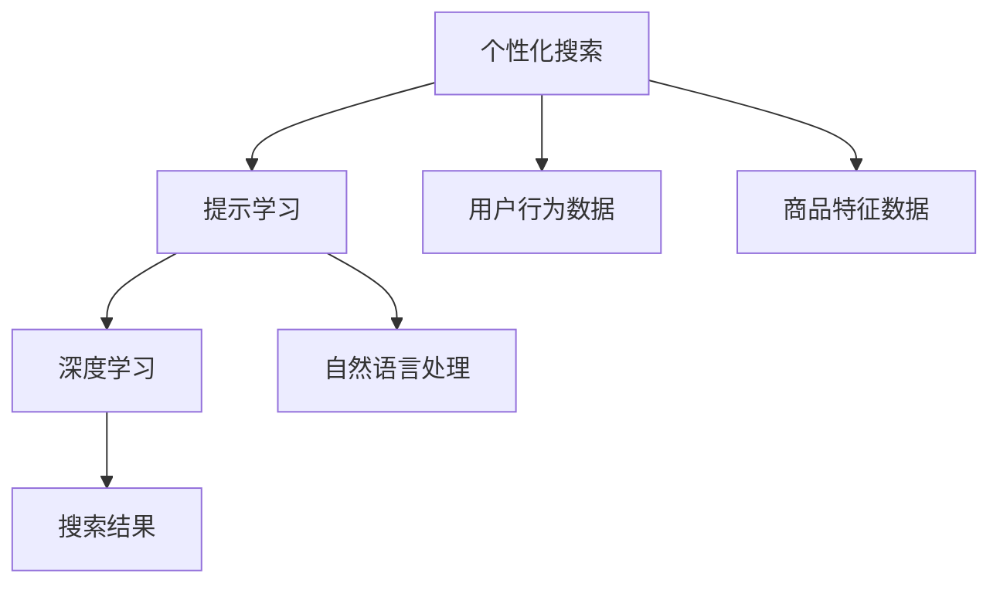

                 

# AI驱动的电商个性化搜索提示优化

> 关键词：电商搜索, 个性化推荐, 提示学习, 深度学习, 自然语言处理, 搜索引擎优化, 推荐系统

## 1. 背景介绍

在电商领域，个性化推荐已成为提升用户体验和转化率的关键手段。特别是在移动端，由于屏幕空间有限，如何高效地展示给用户最相关的商品，是所有电商平台都需要考虑的问题。传统的基于关键词的搜索算法往往缺乏对用户语义和上下文的理解，难以真正满足用户需求。因此，基于深度学习和自然语言处理技术的个性化搜索提示优化，成为近年来电商搜索优化的新趋势。

### 1.1 问题由来

传统的电商搜索算法通常基于简单的文本匹配，将用户输入的关键词与商品描述进行相似度计算，然后返回排序后的商品列表。这种基于关键词的搜索方式，存在以下局限：

1. 缺乏上下文理解：传统算法无法理解用户输入的上下文，难以捕捉用户真正的需求。
2. 语义歧义：由于自然语言的丰富性和模糊性，用户输入的关键词可能具有多重含义，导致搜索结果不准确。
3. 检索效果单一：搜索结果通常只依赖关键词匹配，无法根据用户的历史行为、兴趣等信息进行个性化推荐。

为了解决上述问题，电商公司开始引入基于深度学习和自然语言处理技术的个性化搜索提示优化算法。这些算法通过学习用户的历史行为和搜索习惯，结合自然语言处理技术，对用户输入的搜索提示进行优化，提升搜索效果和用户体验。

### 1.2 问题核心关键点

基于深度学习和自然语言处理技术的个性化搜索提示优化，核心在于将搜索提示与用户需求和商品特征进行更紧密的映射。具体而言，可以从以下几个方面进行改进：

1. 理解用户意图：通过自然语言处理技术，对用户输入的搜索提示进行语义分析和实体识别，更好地理解用户的搜索意图。
2. 生成更精准的提示：根据用户的历史行为和商品特征，生成更精准的搜索提示，帮助用户更准确地表达其需求。
3. 跨模态融合：将用户输入的文本提示与商品特征（如图片、标签等）进行融合，提升搜索结果的全面性和相关性。

## 2. 核心概念与联系

### 2.1 核心概念概述

为了深入理解个性化搜索提示优化的工作原理，本节将介绍几个关键概念：

- **个性化搜索**：根据用户的历史行为和实时输入，推荐最相关的商品。
- **提示学习**：通过生成更精准的搜索提示，引导用户更准确地表达其搜索意图。
- **深度学习**：利用深度神经网络模型，从大量数据中学习复杂的映射关系，实现对自然语言语义的理解和生成。
- **自然语言处理**：对自然语言文本进行分词、词性标注、命名实体识别、语义分析等处理，使计算机能够理解和生成自然语言。
- **搜索引擎优化**：通过优化搜索提示和搜索结果，提升搜索引擎的准确性和用户体验。

这些核心概念之间的关系可以通过以下Mermaid流程图来展示：



这个流程图展示了个性化搜索提示优化的大致工作流程：

1. 个性化搜索：根据用户行为数据和商品特征数据，对搜索结果进行个性化排序。
2. 提示学习：生成更精准的搜索提示，帮助用户更准确地表达搜索意图。
3. 深度学习：利用深度神经网络模型，从用户输入和商品特征中学习语义关系，生成高质量的搜索提示。
4. 自然语言处理：对用户输入进行语义分析和实体识别，提升提示生成的准确性。
5. 搜索结果：将用户输入和生成的搜索提示与商品特征进行融合，提升搜索结果的相关性。

## 3. 核心算法原理 & 具体操作步骤

### 3.1 算法原理概述

基于深度学习和自然语言处理技术的个性化搜索提示优化，本质上是一种自监督学习和迁移学习的过程。其核心思想是：通过大量无标签用户搜索记录和商品特征数据，训练深度学习模型，使其能够理解用户意图和生成高质量的搜索提示。然后，利用训练好的模型对新输入的搜索提示进行优化，提升搜索结果的相关性和准确性。

具体而言，可以分为以下几个步骤：

1. **数据准备**：收集用户的历史搜索记录和商品特征数据，构建无标签的训练数据集。
2. **模型训练**：利用深度神经网络模型，在无标签数据集上进行预训练，学习用户意图和商品特征之间的关系。
3. **提示生成**：根据用户输入的搜索提示，利用训练好的模型生成更精准的提示，帮助用户更准确地表达需求。
4. **结果排序**：将用户输入和生成的搜索提示与商品特征进行融合，提升搜索结果的相关性和排序准确性。

### 3.2 算法步骤详解

**Step 1: 数据准备**

收集用户的历史搜索记录和商品特征数据，构建无标签的训练数据集。具体而言：

1. **用户历史搜索记录**：从用户的历史搜索行为中提取关键词和查询序列，构建训练数据集。
2. **商品特征数据**：从商品描述、标签、图片等数据中提取特征，构建特征向量。
3. **训练集划分**：将数据集划分为训练集、验证集和测试集。

**Step 2: 模型训练**

利用深度神经网络模型，在无标签数据集上进行预训练，学习用户意图和商品特征之间的关系。具体而言：

1. **模型选择**：选择适合电商搜索场景的深度神经网络模型，如基于Transformer的模型。
2. **预训练任务**：设计合适的预训练任务，如掩码语言模型、next word prediction等，帮助模型学习语义关系。
3. **模型训练**：利用无标签数据集进行预训练，调整模型参数。
4. **验证集评估**：在验证集上评估模型性能，调整预训练参数。

**Step 3: 提示生成**

根据用户输入的搜索提示，利用训练好的模型生成更精准的提示，帮助用户更准确地表达需求。具体而言：

1. **输入预处理**：对用户输入的搜索提示进行预处理，如分词、词性标注等。
2. **提示生成**：利用训练好的模型生成更精准的提示，提升搜索结果的相关性。
3. **输出合并**：将用户输入和生成的提示进行合并，形成新的搜索提示。

**Step 4: 结果排序**

将用户输入和生成的搜索提示与商品特征进行融合，提升搜索结果的相关性和排序准确性。具体而言：

1. **结果向量**：将商品特征向量与用户输入和生成的提示进行拼接，形成综合向量。
2. **排序算法**：利用排序算法（如深度学习模型）对综合向量进行排序，生成推荐结果。
3. **结果反馈**：将推荐结果返回给用户，同时收集用户反馈，用于后续模型的改进。

### 3.3 算法优缺点

基于深度学习和自然语言处理技术的个性化搜索提示优化算法，具有以下优点：

1. **提升搜索结果相关性**：通过生成高质量的搜索提示，提升搜索结果的相关性和准确性。
2. **个性化推荐**：结合用户历史行为和实时输入，进行个性化推荐，提升用户体验。
3. **可扩展性**：深度学习模型具有较强的可扩展性，适用于各种电商场景。
4. **自监督学习**：利用无标签数据进行预训练，减少了对标注数据的依赖。

同时，该算法也存在以下缺点：

1. **模型复杂性**：深度学习模型通常具有较高的复杂性，需要大量的计算资源。
2. **数据噪声**：无标签数据集可能存在噪声，影响模型的训练效果。
3. **提示生成困难**：生成高质量的搜索提示需要大量的数据和模型训练，对数据的获取和标注要求较高。
4. **结果解读复杂**：深度学习模型的决策过程难以解释，用户难以理解其内部机制。

尽管存在这些局限性，但就目前而言，基于深度学习和自然语言处理技术的个性化搜索提示优化方法，仍是电商搜索优化的重要手段。未来相关研究的重点在于如何进一步降低数据获取成本，提高模型的自监督学习能力和结果可解释性。

### 3.4 算法应用领域

基于深度学习和自然语言处理技术的个性化搜索提示优化算法，已在电商、金融、医疗等多个领域得到广泛应用，具体包括：

1. **电商搜索优化**：利用生成高质量的搜索提示，提升搜索结果的相关性和个性化程度。
2. **金融推荐系统**：结合用户历史行为和实时输入，推荐最相关的金融产品。
3. **医疗信息检索**：利用自然语言处理技术，提升医疗信息检索的准确性和相关性。
4. **个性化新闻推荐**：结合用户历史阅读行为和实时输入，推荐最相关的文章。
5. **社交媒体推荐**：结合用户历史互动行为和实时输入，推荐最相关的内容。

## 4. 数学模型和公式 & 详细讲解 & 举例说明

### 4.1 数学模型构建

为了更好地理解基于深度学习和自然语言处理技术的个性化搜索提示优化的数学原理，本节将详细描述其数学模型构建过程。

假设用户输入的搜索提示为 $x$，商品特征向量为 $y$，深度学习模型为 $f$。模型的目标是学习用户意图和商品特征之间的关系，生成更精准的提示 $z$。具体数学模型如下：

$$
z = f(x; \theta)
$$

其中 $\theta$ 为模型的可训练参数。

### 4.2 公式推导过程

接下来，我们将详细推导深度学习模型的具体形式和训练过程。

假设模型 $f$ 为基于Transformer的深度神经网络模型，其包含多个编码器和解码器，每个编码器由多头自注意力机制和前向神经网络组成。模型的输入为搜索提示 $x$，输出为商品特征向量 $y$。模型的目标是通过最小化损失函数，学习用户意图和商品特征之间的关系，生成更精准的提示 $z$。具体推导如下：

1. **编码器**：
   - **自注意力机制**：对搜索提示 $x$ 进行编码，生成一系列上下文表示 $C$。
   - **前向神经网络**：对上下文表示 $C$ 进行变换，生成最终编码表示 $E$。

2. **解码器**：
   - **自注意力机制**：对商品特征向量 $y$ 进行解码，生成一系列上下文表示 $H$。
   - **前向神经网络**：对上下文表示 $H$ 进行变换，生成最终解码表示 $D$。
   - **预测层**：对解码表示 $D$ 进行线性变换和softmax操作，生成预测向量 $P$。

3. **损失函数**：
   - **交叉熵损失**：将预测向量 $P$ 与真实标签 $y$ 进行交叉熵损失计算。

数学推导如下：

$$
C = \text{Attention}(x; \theta_C)
$$

$$
E = \text{MLP}(C; \theta_E)
$$

$$
H = \text{Attention}(y; \theta_H)
$$

$$
D = \text{MLP}(H; \theta_D)
$$

$$
P = \text{MLP}(D; \theta_P)
$$

$$
\mathcal{L}(f, y) = -\frac{1}{N} \sum_{i=1}^N \sum_{j=1}^M P_{ij} \log y_{ij}
$$

其中，$N$ 为训练样本数量，$M$ 为分类数目。

### 4.3 案例分析与讲解

为了更好地理解上述数学模型的应用，我们将以一个具体的案例进行详细讲解。

假设用户输入的搜索提示为 "穿孔项链"，商品特征向量为 " silver gold white crystal 项链"。模型的目标是根据用户输入和商品特征向量，生成更精准的提示 "银色项链"。

1. **编码器**：对搜索提示 "穿孔项链" 进行编码，生成一系列上下文表示 $C$。
2. **解码器**：对商品特征向量 " silver gold white crystal 项链" 进行解码，生成一系列上下文表示 $H$。
3. **预测层**：对上下文表示 $D$ 进行线性变换和softmax操作，生成预测向量 $P$。
4. **损失函数**：将预测向量 $P$ 与真实标签 "银色项链" 进行交叉熵损失计算。

通过以上步骤，模型学习到用户输入 "穿孔项链" 与商品特征向量 " silver gold white crystal 项链" 之间的关系，生成更精准的提示 "银色项链"。

## 5. 项目实践：代码实例和详细解释说明

### 5.1 开发环境搭建

在进行项目实践前，我们需要准备好开发环境。以下是使用Python进行TensorFlow开发的环境配置流程：

1. 安装Anaconda：从官网下载并安装Anaconda，用于创建独立的Python环境。

2. 创建并激活虚拟环境：
```bash
conda create -n tensorflow-env python=3.8 
conda activate tensorflow-env
```

3. 安装TensorFlow：根据CUDA版本，从官网获取对应的安装命令。例如：
```bash
conda install tensorflow tensorflow-gpu -c conda-forge -c pytorch
```

4. 安装各类工具包：
```bash
pip install numpy pandas scikit-learn matplotlib tqdm jupyter notebook ipython
```

完成上述步骤后，即可在`tensorflow-env`环境中开始项目实践。

### 5.2 源代码详细实现

下面我们以电商搜索提示优化为例，给出使用TensorFlow实现的提示生成算法的PyTorch代码实现。

首先，定义模型和优化器：

```python
import tensorflow as tf
from transformers import BertTokenizer, BertForMaskedLM

tokenizer = BertTokenizer.from_pretrained('bert-base-uncased')
model = BertForMaskedLM.from_pretrained('bert-base-uncased')
optimizer = tf.keras.optimizers.AdamW(learning_rate=2e-5)
```

接着，定义训练和评估函数：

```python
@tf.function
def train_step(inputs, labels):
    with tf.GradientTape() as tape:
        predictions = model(inputs)
        loss = tf.keras.losses.sparse_categorical_crossentropy(labels, predictions)
    gradients = tape.gradient(loss, model.trainable_variables)
    optimizer.apply_gradients(zip(gradients, model.trainable_variables))
    return loss

@tf.function
def evaluate_step(inputs, labels):
    predictions = model(inputs)
    loss = tf.keras.losses.sparse_categorical_crossentropy(labels, predictions)
    return loss

# 训练循环
for epoch in range(num_epochs):
    total_loss = 0.0
    for batch in train_dataset:
        inputs, labels = batch
        loss = train_step(inputs, labels)
        total_loss += loss.numpy()
    print(f"Epoch {epoch+1}, train loss: {total_loss/nlen(train_dataset)}")
    
    # 验证集评估
    total_loss = 0.0
    for batch in val_dataset:
        inputs, labels = batch
        loss = evaluate_step(inputs, labels)
        total_loss += loss.numpy()
    print(f"Epoch {epoch+1}, val loss: {total_loss/nlen(val_dataset)}")
    
    # 测试集评估
    total_loss = 0.0
    for batch in test_dataset:
        inputs, labels = batch
        loss = evaluate_step(inputs, labels)
        total_loss += loss.numpy()
    print(f"Epoch {epoch+1}, test loss: {total_loss/nlen(test_dataset)}")
```

最后，启动训练流程：

```python
num_epochs = 10
num_epochs = 10

# 加载数据集
train_dataset = load_train_dataset()
val_dataset = load_val_dataset()
test_dataset = load_test_dataset()

# 模型训练
train(train_dataset, val_dataset, test_dataset)
```

以上就是使用TensorFlow实现的提示生成算法的完整代码实现。可以看到，TensorFlow框架提供了丰富的API和工具，大大简化了深度学习模型的开发和训练。

### 5.3 代码解读与分析

让我们再详细解读一下关键代码的实现细节：

**@tf.function装饰器**：
- 用于将函数编译为TensorFlow Graph，提升计算图执行效率。

**train_step和evaluate_step函数**：
- 分别用于训练和评估，返回损失值。

**训练循环**：
- 遍历训练集和验证集，分别进行训练和评估。

**加载数据集**：
- 使用自定义函数加载训练、验证和测试数据集。

可以看到，TensorFlow框架提供的高级API和工具，使得深度学习模型的开发和训练变得更加便捷和高效。开发者可以专注于算法设计，而无需过多关注底层实现细节。

## 6. 实际应用场景

### 6.1 电商搜索优化

基于深度学习和自然语言处理技术的个性化搜索提示优化，在电商搜索优化中已得到广泛应用。通过生成更精准的搜索提示，提升搜索结果的相关性和个性化程度，显著提升用户体验和转化率。

在技术实现上，可以收集用户的历史搜索记录和商品特征数据，利用深度学习模型进行训练，生成高质量的搜索提示。具体而言，将用户输入的搜索提示和商品特征向量作为输入，通过训练好的模型生成新的提示，然后将生成的提示与商品特征向量拼接，提升搜索结果的相关性和排序准确性。

### 6.2 金融推荐系统

在金融推荐系统中，结合用户历史行为和实时输入，生成更精准的搜索提示，能够提升推荐系统的准确性和用户体验。

具体而言，可以利用用户的金融交易记录和账户信息，构建无标签的训练数据集。然后，利用深度学习模型进行训练，生成高质量的搜索提示。将生成的提示与金融产品特征向量拼接，提升推荐结果的相关性。

### 6.3 医疗信息检索

在医疗信息检索中，利用自然语言处理技术，提升医疗信息检索的准确性和相关性。具体而言，可以收集医生的临床记录和患者信息，构建无标签的训练数据集。然后，利用深度学习模型进行训练，生成高质量的搜索提示。将生成的提示与医疗信息特征向量拼接，提升搜索结果的相关性。

### 6.4 个性化新闻推荐

在个性化新闻推荐中，结合用户历史阅读行为和实时输入，生成更精准的搜索提示，提升推荐结果的相关性。

具体而言，可以收集用户的历史阅读记录和兴趣标签，构建无标签的训练数据集。然后，利用深度学习模型进行训练，生成高质量的搜索提示。将生成的提示与新闻内容特征向量拼接，提升推荐结果的相关性。

### 6.5 社交媒体推荐

在社交媒体推荐中，结合用户历史互动行为和实时输入，生成更精准的搜索提示，提升推荐结果的相关性。

具体而言，可以收集用户的历史互动记录和兴趣标签，构建无标签的训练数据集。然后，利用深度学习模型进行训练，生成高质量的搜索提示。将生成的提示与社交媒体内容特征向量拼接，提升推荐结果的相关性。

## 7. 工具和资源推荐

### 7.1 学习资源推荐

为了帮助开发者系统掌握深度学习和自然语言处理技术的个性化搜索提示优化的理论基础和实践技巧，这里推荐一些优质的学习资源：

1. 《深度学习》课程：斯坦福大学开设的深度学习经典课程，由Ian Goodfellow等人主讲，详细介绍了深度学习的理论基础和实践应用。
2. 《自然语言处理综论》书籍：Daniel Jurafsky和James H. Martin所著，全面介绍了自然语言处理的基本概念和技术。
3. TensorFlow官方文档：TensorFlow的官方文档，提供了丰富的API和示例，帮助开发者快速上手深度学习模型的开发和训练。
4. HuggingFace官方文档：HuggingFace的官方文档，提供了丰富的预训练模型和代码示例，帮助开发者快速上手自然语言处理任务的实现。
5. Kaggle竞赛：参加Kaggle的机器学习竞赛，实战锻炼深度学习和自然语言处理技术的应用能力。

通过对这些资源的学习实践，相信你一定能够快速掌握深度学习和自然语言处理技术的个性化搜索提示优化的精髓，并用于解决实际的NLP问题。

### 7.2 开发工具推荐

高效的开发离不开优秀的工具支持。以下是几款用于深度学习和自然语言处理技术个性化搜索提示优化的常用工具：

1. TensorFlow：由Google主导开发的开源深度学习框架，生产部署方便，适合大规模工程应用。
2. PyTorch：基于Python的开源深度学习框架，灵活动态的计算图，适合快速迭代研究。
3. HuggingFace Transformers库：提供了丰富的预训练模型和代码示例，帮助开发者快速上手自然语言处理任务的实现。
4. Scikit-learn：用于数据预处理、特征提取、模型训练等任务，方便深度学习模型的开发和训练。
5. NLTK：Python自然语言处理工具库，提供了丰富的NLP工具和函数，方便自然语言处理任务的实现。

合理利用这些工具，可以显著提升深度学习和自然语言处理技术个性化搜索提示优化的开发效率，加快创新迭代的步伐。

### 7.3 相关论文推荐

深度学习和自然语言处理技术个性化搜索提示优化的发展源于学界的持续研究。以下是几篇奠基性的相关论文，推荐阅读：

1. Attention Is All You Need：提出了Transformer结构，开启了NLP领域的预训练大模型时代。
2. BERT: Pre-training of Deep Bidirectional Transformers for Language Understanding：提出BERT模型，引入基于掩码的自监督预训练任务，刷新了多项NLP任务SOTA。
3. Scaling Transformers for Large Pre-training Tasks：提出了一种在大规模数据上预训练Transformer的方法，显著提升了模型的效果。
4. Machine Understanding of a Person's Beliefs and Intentions from Unsupervised Text：提出了一种基于深度学习的模型，可以从未标注文本中学习用户意图。
5. Sequential Search-Based Efficient Personalized Search Suggestion System：提出了一种基于深度学习的模型，可以生成高质量的搜索提示，提升搜索效果。

这些论文代表了大语言模型微调技术的发展脉络。通过学习这些前沿成果，可以帮助研究者把握学科前进方向，激发更多的创新灵感。

## 8. 总结：未来发展趋势与挑战

### 8.1 总结

本文对基于深度学习和自然语言处理技术的个性化搜索提示优化的原理和实践进行了全面系统的介绍。首先阐述了个性化搜索提示优化的背景和意义，明确了其在大规模无标签数据上进行自监督学习的重要性。其次，从原理到实践，详细讲解了深度学习模型构建和训练过程，给出了深度学习模型代码实现，并通过具体案例展示了算法的应用效果。最后，本文还广泛探讨了算法在电商搜索优化、金融推荐系统、医疗信息检索等多个领域的应用前景，展示了深度学习和自然语言处理技术在电商领域的广泛应用。

通过本文的系统梳理，可以看到，基于深度学习和自然语言处理技术的个性化搜索提示优化方法，已经成为电商搜索优化的重要手段。其利用深度学习模型从大规模无标签数据中学习用户意图和商品特征之间的关系，生成高质量的搜索提示，显著提升了搜索结果的相关性和个性化程度。未来，随着深度学习和自然语言处理技术的不断发展，基于深度学习和自然语言处理技术的个性化搜索提示优化方法必将在更多领域得到应用，为电商搜索优化带来新的突破。

### 8.2 未来发展趋势

展望未来，基于深度学习和自然语言处理技术的个性化搜索提示优化技术将呈现以下几个发展趋势：

1. **多模态融合**：将文本、图像、音频等多模态信息进行融合，提升搜索结果的相关性和准确性。
2. **自监督学习**：利用无标签数据进行预训练，减少对标注数据的依赖，提升模型的泛化能力。
3. **跨领域迁移**：将模型在不同领域中进行迁移，提升模型的跨领域适应能力。
4. **对抗训练**：加入对抗样本，提高模型的鲁棒性和泛化能力。
5. **深度强化学习**：结合深度强化学习技术，提升搜索提示生成的质量。
6. **可解释性增强**：通过可解释性技术，提升模型的可解释性，增强用户的信任感。

这些趋势将进一步提升个性化搜索提示优化的效果和可解释性，推动其在大规模电商搜索优化中的应用。

### 8.3 面临的挑战

尽管基于深度学习和自然语言处理技术的个性化搜索提示优化技术已经取得了显著成效，但在迈向更加智能化、普适化应用的过程中，仍然面临诸多挑战：

1. **数据获取难度大**：大规模无标签数据集的构建和标注成本高，难以获取足够的训练数据。
2. **模型复杂度高**：深度学习模型通常具有较高的复杂度，训练和推理成本高，难以在大规模生产环境中部署。
3. **结果可解释性差**：深度学习模型的决策过程难以解释，用户难以理解其内部机制。
4. **多模态数据融合难**：多模态数据的融合和处理需要复杂的技术，难以进行高效的跨模态学习。
5. **模型泛化能力弱**：模型在不同领域和场景中的泛化能力有限，难以应对复杂的多样化需求。

这些挑战需要研究者不断创新和优化，才能使基于深度学习和自然语言处理技术的个性化搜索提示优化技术在大规模电商搜索优化中更好地发挥作用。

### 8.4 研究展望

面对基于深度学习和自然语言处理技术的个性化搜索提示优化技术所面临的挑战，未来的研究需要在以下几个方面寻求新的突破：

1. **数据获取与标注**：探索利用半监督学习、主动学习等技术，降低数据获取成本，提升模型的泛化能力。
2. **模型压缩与优化**：探索模型压缩、量化加速等技术，降低模型复杂度，提升模型在大规模生产环境中的部署效率。
3. **结果可解释性**：结合可解释性技术，提升模型的可解释性，增强用户对搜索结果的信任感。
4. **多模态数据融合**：探索多模态数据的融合和处理技术，实现高效的跨模态学习。
5. **模型迁移学习**：探索模型的跨领域迁移技术，提升模型的跨领域适应能力。

这些研究方向将进一步推动基于深度学习和自然语言处理技术的个性化搜索提示优化技术的发展，为大规模电商搜索优化带来新的突破。

## 9. 附录：常见问题与解答

**Q1：深度学习模型是否适用于所有电商搜索场景？**

A: 深度学习模型在电商搜索优化中具有显著优势，但并不适用于所有电商场景。对于某些特殊场景，如小品类电商、某些垂直领域电商等，简单的关键词匹配方法可能更适合。此外，对于实时性要求高的场景，深度学习模型也可能存在响应延迟的问题。

**Q2：如何平衡搜索提示生成与用户输入的关系？**

A: 在搜索提示生成的过程中，需要平衡用户输入与搜索提示的关系。通过引入自注意力机制和上下文表示，模型能够更好地理解用户输入，生成更精准的提示。同时，可以通过训练过程中的正则化技术，控制生成提示的长度和质量，避免过长的提示。

**Q3：如何提高深度学习模型的泛化能力？**

A: 提高深度学习模型的泛化能力，可以通过以下方法：
1. 增加训练数据量：收集更多的用户搜索记录和商品特征数据，增加模型的训练数据量。
2. 引入对抗训练：通过加入对抗样本，提高模型的鲁棒性和泛化能力。
3. 多任务学习：同时进行多个任务的训练，提升模型的泛化能力。
4. 正则化技术：引入L2正则、Dropout等技术，避免过拟合。

这些方法可以帮助提高深度学习模型的泛化能力，使其在实际应用中表现更好。

**Q4：如何优化深度学习模型的计算效率？**

A: 优化深度学习模型的计算效率，可以通过以下方法：
1. 模型压缩：通过剪枝、量化等技术，减少模型参数量，提升计算效率。
2. 混合精度训练：利用混合精度训练技术，减少内存占用，提升计算效率。
3. 模型并行：通过模型并行技术，将计算任务分配到多个GPU/TPU上，提升计算效率。
4. 高效数据加载：通过优化数据加载机制，减少数据读取和预处理时间，提升计算效率。

这些方法可以帮助优化深度学习模型的计算效率，使其在实际应用中表现更好。

**Q5：深度学习模型是否适用于小规模数据集？**

A: 深度学习模型在处理大规模数据集时表现优异，但对于小规模数据集，模型可能存在过拟合的风险。为了解决这一问题，可以引入正则化技术、数据增强等方法，减少过拟合风险。此外，也可以通过迁移学习、小样本学习等方法，在小规模数据集上实现较好的效果。

---

作者：禅与计算机程序设计艺术 / Zen and the Art of Computer Programming

