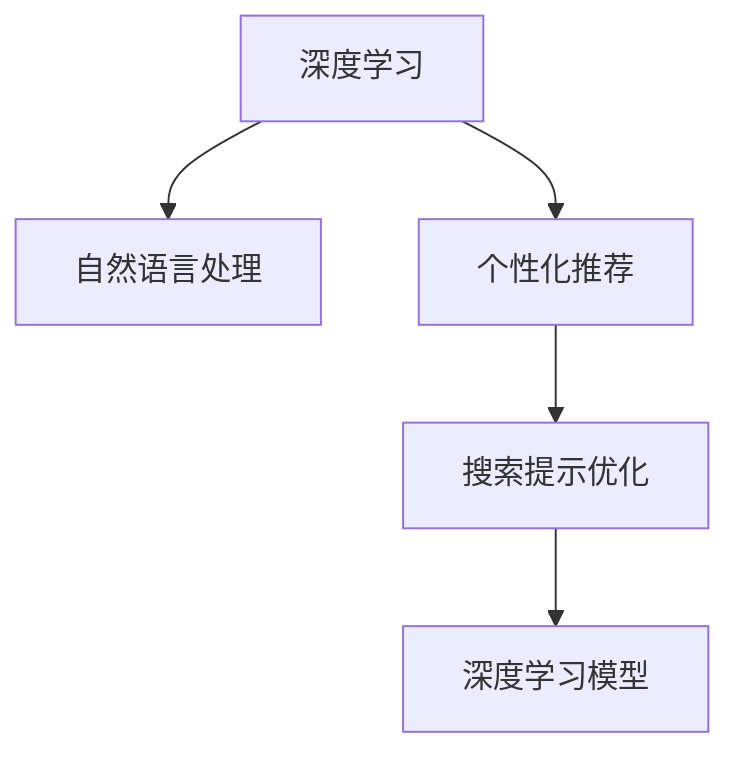

                 

# AI驱动的电商个性化搜索提示优化

> 关键词：个性化推荐、深度学习、电商搜索、提示优化、用户交互、点击率

## 1. 背景介绍

### 1.1 问题由来
在现代电商平台上，个性化推荐技术已经成为提升用户购物体验、提高转化率的关键手段。然而，搜索界面的个性化程度和用户交互效率，同样对平台的运营成效有着不可忽视的影响。传统的电商搜索主要通过关键词匹配，缺乏用户意图和行为数据的引导，无法准确推荐用户感兴趣的商品。

为了提升搜索效率，传统方式往往在搜索结果中添加广告推荐或热门商品列表。但这种单向的展示方式，无法满足不同用户的需求，导致用户体验和点击率不理想。近年来，电商巨头如亚马逊、阿里巴巴、京东等，逐步引入AI驱动的个性化搜索功能，通过深度学习和自然语言处理技术，使搜索结果更精准、更个性化。

这些AI驱动的搜索功能不仅提升了用户搜索体验，还显著提高了点击率和转化率。但与此同时，个性化搜索系统也需要不断优化，以确保高效、准确、可解释的搜索结果。

### 1.2 问题核心关键点
个性化搜索优化涉及多个关键环节，如用户意图理解、搜索结果展示、提示词优化等。深度学习和大规模预训练模型（如BERT、GPT等）在个性化搜索系统中的应用，为问题解决提供了新的思路。

在电商搜索场景中，用户输入的搜索词往往带有模糊性，可能包含多义词、长尾词、拼写错误等。为了消除搜索词的模糊性，获取更准确的商品推荐，AI驱动的搜索系统需要根据用户输入生成个性化的搜索提示词。这些提示词可以帮助用户更清晰地表达意图，引导系统返回更相关、更精准的搜索结果。

因此，电商个性化搜索提示优化，实际上就是通过深度学习和自然语言处理技术，对用户输入进行分析和建模，生成最优的个性化搜索提示词。本文将围绕这一核心问题，详细介绍深度学习在个性化搜索提示优化中的应用。

## 2. 核心概念与联系

### 2.1 核心概念概述

为更好地理解AI驱动的电商个性化搜索提示优化，本节将介绍几个密切相关的核心概念：

- 深度学习：一类基于神经网络的机器学习技术，通过多层次的特征提取和特征融合，从大量数据中学习出复杂非线性模型。
- 自然语言处理(NLP)：研究如何让计算机理解和处理人类语言，实现自动化的文本分析、生成、翻译等任务。
- 个性化推荐：通过分析用户的历史行为、兴趣偏好等信息，推荐用户可能感兴趣的商品或内容。
- 搜索提示优化：根据用户输入生成个性化的提示词，引导用户更清晰地表达搜索意图，提升搜索效果。
- 深度学习模型：如Transformer、BERT、GPT等，通过大规模预训练学习丰富的语言知识，能够处理复杂、多变的输入，具备强大的自然语言处理能力。

这些核心概念之间的逻辑关系可以通过以下Mermaid流程图来展示：



这个流程图展示了大语言模型在搜索提示优化中的核心概念及其之间的关系：

1. 深度学习通过大规模预训练，学习出强大的特征提取能力。
2. 自然语言处理技术，使模型能够理解和处理人类语言，提供高质量的输入输出。
3. 个性化推荐，通过用户行为数据的分析，指导模型生成更加精准的提示词。
4. 搜索提示优化，利用深度学习模型的能力，生成个性化的提示词，提高搜索效果。
5. 深度学习模型，作为技术实现的基础，为各个环节提供了强大的支持。

这些概念共同构成了电商个性化搜索提示优化的技术框架，使得系统能够高效地理解用户意图，提供个性化的搜索体验。

## 3. 核心算法原理 & 具体操作步骤
### 3.1 算法原理概述

基于深度学习的电商个性化搜索提示优化，实际上是一个文本生成问题。目标是根据用户输入的搜索词，生成一组个性化的提示词，使得用户能够更清晰地表达其搜索意图。

形式化地，假设用户输入为 $X$，输出为 $Y$，即生成的提示词序列。则优化目标为：

$$
\min_{\theta} -\frac{1}{N} \sum_{i=1}^N \log p(Y_i|X_i)
$$

其中 $p(Y_i|X_i)$ 为生成模型在给定用户输入 $X_i$ 下生成提示词序列 $Y_i$ 的概率。该优化目标可以通过最大化似然估计来实现，即：

$$
\max_{\theta} \frac{1}{N} \sum_{i=1}^N \log p(Y_i|X_i)
$$

为了解决上述问题，可以使用序列到序列（Seq2Seq）的框架，即在生成模型中，先对输入 $X$ 进行编码，再根据编码结果生成输出 $Y$。常用的生成模型包括：

- 基于RNN的Seq2Seq模型
- 基于Transformer的Seq2Seq模型
- 基于BERT和GPT的Seq2Seq模型

这些模型通过引入注意力机制、自监督学习等技术，能够更好地理解和生成自然语言文本。

### 3.2 算法步骤详解

基于深度学习的电商个性化搜索提示优化，主要包括以下几个关键步骤：

**Step 1: 准备数据集和模型**

- 收集用户输入的搜索词数据集 $D=\{(X_i, Y_i)\}_{i=1}^N$，其中 $X_i$ 为输入，$Y_i$ 为生成的提示词序列。
- 选择合适的预训练语言模型，如BERT、GPT等。

**Step 2: 搭建模型架构**

- 设计Seq2Seq模型，包含编码器和解码器。编码器将用户输入 $X_i$ 转换为隐状态 $C_i$，解码器根据 $C_i$ 生成提示词序列 $Y_i$。
- 设置模型的超参数，如编码器、解码器的层数、神经元数、学习率等。

**Step 3: 训练模型**

- 使用深度学习框架（如TensorFlow、PyTorch等）搭建并训练模型。
- 定义损失函数，如交叉熵损失、掩码语言模型损失等。
- 使用优化算法（如Adam、SGD等）对模型进行训练，不断优化损失函数。
- 周期性在验证集上评估模型性能，根据性能指标决定是否触发Early Stopping。
- 重复上述步骤直到满足预设的迭代轮数或Early Stopping条件。

**Step 4: 生成提示词**

- 在测试集上使用训练好的模型生成提示词。
- 将用户输入 $X$ 输入编码器，获取隐状态 $C$。
- 将 $C$ 输入解码器，生成提示词序列 $Y$。
- 将 $Y$ 作为最终提示词，返回给用户。

以上是基于深度学习的电商个性化搜索提示优化的主要流程。在实际应用中，还需要根据具体任务和数据特点，对模型架构、超参数进行优化设计，以进一步提升模型性能。

### 3.3 算法优缺点

基于深度学习的电商个性化搜索提示优化方法，具有以下优点：

1. 灵活性高：可以适应各种不同类型的搜索词输入，生成多变的提示词序列。
2. 准确度高：深度学习模型能够从大规模语料中学习丰富的语言知识，生成高质量的提示词。
3. 自适应能力强：模型能够根据数据分布的变化，动态调整提示词生成策略。
4. 可解释性好：通过分析生成过程中的隐状态，可以一定程度上解释模型生成提示词的逻辑。

但该方法也存在一些局限性：

1. 数据需求大：需要大规模标注数据集进行模型训练，标注数据成本较高。
2. 计算资源消耗大：深度学习模型的计算复杂度高，需要高性能计算设备支持。
3. 难以处理极端情况：模型可能无法处理模糊不清或过于复杂的输入，提示词生成效果不佳。
4. 模型泛化能力不足：训练数据有限，模型在未见过的输入上可能表现欠佳。
5. 用户隐私问题：搜索过程中涉及用户输入，可能存在隐私泄露的风险。

尽管存在这些局限性，但深度学习在电商个性化搜索提示优化中的应用，已经成为提升搜索效果的重要手段。未来相关研究的重点在于如何进一步降低数据需求，提高模型泛化能力，确保用户隐私安全，使AI驱动的搜索系统在电商领域发挥更大价值。

### 3.4 算法应用领域

基于深度学习的电商个性化搜索提示优化技术，已经在多个电商平台上得到了应用，覆盖了商品推荐、搜索排序、广告投放等多个场景，具体包括：

- 商品推荐：根据用户输入和生成的提示词，推荐相关商品。
- 搜索排序：排序搜索结果，优先展示与用户意图匹配度高的商品。
- 广告投放：根据用户输入和提示词生成，精准投放广告，提升点击率。
- 自动补全：对用户输入进行自动补全，提升搜索效率。

此外，AI驱动的搜索技术还逐步应用于社交媒体、新闻推荐、医疗咨询等领域，为不同场景下的信息获取提供了新的解决方案。随着技术的不断进步，预计电商个性化搜索提示优化将在更多领域得到推广应用，进一步提升用户搜索体验。

## 4. 数学模型和公式 & 详细讲解  
### 4.1 数学模型构建

本节将使用数学语言对基于深度学习的电商个性化搜索提示优化过程进行更加严格的刻画。

记用户输入为 $X=\{x_1, x_2, ..., x_m\}$，其中 $x_i$ 为第 $i$ 个输入字符。假设生成模型为 $p(Y|X;\theta)$，其中 $\theta$ 为模型参数。生成模型将用户输入 $X$ 转换为隐状态 $C=\{c_1, c_2, ..., c_m\}$，然后根据隐状态 $C$ 生成提示词序列 $Y=\{y_1, y_2, ..., y_n\}$。则生成过程可以用序列模型表示：

$$
C = f(X; \theta_C)
$$

$$
Y = g(C; \theta_G)
$$

其中 $f$ 为编码器函数，$g$ 为解码器函数。

### 4.2 公式推导过程

以基于Transformer的Seq2Seq模型为例，推导提示词生成的计算公式。

假设编码器和解码器的隐藏层数为 $d_{mod}$，使用自注意力机制。设用户输入 $X$ 的长度为 $m$，生成的提示词序列 $Y$ 的长度为 $n$。则编码器 $f$ 和解码器 $g$ 的计算过程分别为：

1. 编码器：

$$
h_i = \text{Attention}(Q_i, K_i, V_i)
$$

$$
C = [h_1, h_2, ..., h_m] \in \mathbb{R}^{m \times d_{mod}}
$$

其中 $Q_i, K_i, V_i$ 分别为查询、键和值向量。

2. 解码器：

$$
\tilde{h}_i = \text{Attention}(\tilde{K}_i, C, V_i)
$$

$$
h_i = \text{LayerNorm}(\tilde{h}_i + \text{FeedForward}(\tilde{h}_i))
$$

$$
\tilde{K}_i = \text{LayerNorm}(K_i)
$$

$$
Y = \text{Gumbel-Softmax}(\text{LogSoftmax}(H))
$$

其中 $H$ 为解码器的输出，$\text{Gumbel-Softmax}$ 为生成过程的概率分布，通过softmax函数计算。

### 4.3 案例分析与讲解

假设用户输入为 "跑鞋"，模型生成的提示词序列为 "高端跑鞋"。具体推理过程如下：

1. 编码器接收输入 "跑鞋"，生成隐状态 $C$。

2. 解码器接收隐状态 $C$，生成输出 $Y$。

3. 在输出层 $\text{LogSoftmax}(H)$ 中，模型计算每个可能生成的提示词 $y_i$ 的概率。

4. 在生成过程 $\text{Gumbel-Softmax}$ 中，模型根据概率分布 $\text{Gumbel-Softmax}(\text{LogSoftmax}(H))$ 选择最优的提示词序列 $Y$。

通过上述过程，模型可以生成符合用户意图的高质量提示词序列，提升搜索效果。

## 5. 项目实践：代码实例和详细解释说明
### 5.1 开发环境搭建

在进行深度学习模型训练前，我们需要准备好开发环境。以下是使用Python进行TensorFlow和Keras开发的环境配置流程：

1. 安装Anaconda：从官网下载并安装Anaconda，用于创建独立的Python环境。

2. 创建并激活虚拟环境：
```bash
conda create -n tf-env python=3.8 
conda activate tf-env
```

3. 安装TensorFlow：根据CUDA版本，从官网获取对应的安装命令。例如：
```bash
conda install tensorflow tensorflow-gpu=cuda11.1 -c conda-forge
```

4. 安装Keras：
```bash
pip install keras tensorflow
```

5. 安装各类工具包：
```bash
pip install numpy pandas scikit-learn matplotlib tqdm jupyter notebook ipython
```

完成上述步骤后，即可在`tf-env`环境中开始深度学习模型的训练。

### 5.2 源代码详细实现

下面我们以基于Transformer的电商个性化搜索提示优化为例，给出使用TensorFlow和Keras进行深度学习模型训练的代码实现。

首先，定义模型和优化器：

```python
import tensorflow as tf
from tensorflow.keras.layers import Input, LSTM, Dense, Embedding, MultiHeadAttention
from tensorflow.keras.optimizers import Adam

# 定义输入输出
input_seq = Input(shape=(max_seq_len, ), dtype='int32')
target_seq = Input(shape=(max_seq_len, ), dtype='int32')

# 定义Transformer编码器
encoder = tf.keras.layers.LayerNormalization()
encoder = tf.keras.layers.Dense(d_model, activation='relu')
encoder = tf.keras.layers.MultiHeadAttention(num_heads=num_heads, key_dim=key_dim)
encoder = tf.keras.layers.LayerNormalization()
encoder = tf.keras.layers.Dense(d_model, activation='relu')
encoder = tf.keras.layers.LayerNormalization()
encoder = tf.keras.layers.Dense(d_model, activation='relu')

# 定义Transformer解码器
decoder = tf.keras.layers.LayerNormalization()
decoder = tf.keras.layers.Dense(d_model, activation='relu')
decoder = tf.keras.layers.MultiHeadAttention(num_heads=num_heads, key_dim=key_dim)
decoder = tf.keras.layers.LayerNormalization()
decoder = tf.keras.layers.Dense(d_model, activation='relu')
decoder = tf.keras.layers.LayerNormalization()
decoder = tf.keras.layers.Dense(d_model, activation='relu')
decoder = tf.keras.layers.LayerNormalization()

# 定义模型输出
output = Dense(num_words, activation='softmax')(target_seq)

# 定义优化器
optimizer = Adam(learning_rate=learning_rate)
```

然后，定义训练和评估函数：

```python
import tensorflow.keras.callbacks as callbacks

def train_model(model, input_seq, target_seq, train_data, validation_data, epochs, batch_size):
    history = model.fit(train_data, validation_data=validation_data, epochs=epochs, batch_size=batch_size, callbacks=[early_stopping])
    return history

def evaluate_model(model, input_seq, target_seq, test_data):
    scores = model.evaluate(test_data)
    print("Test Loss: ", scores[0])
    print("Test Accuracy: ", scores[1])
```

最后，启动训练流程并在测试集上评估：

```python
# 加载数据集
train_data = ...
val_data = ...
test_data = ...

# 设置模型和超参数
model = ...
epochs = ...
batch_size = ...
learning_rate = ...
num_heads = ...
key_dim = ...
d_model = ...
num_words = ...

# 搭建模型
model = tf.keras.Sequential([
    input_seq,
    encoder,
    decoder,
    output
])

# 编译模型
model.compile(optimizer=optimizer, loss='sparse_categorical_crossentropy', metrics=['accuracy'])

# 训练模型
history = train_model(model, input_seq, target_seq, train_data, val_data, epochs, batch_size)

# 评估模型
evaluate_model(model, input_seq, target_seq, test_data)
```

以上就是使用TensorFlow和Keras对基于Transformer的电商个性化搜索提示优化模型的代码实现。可以看到，通过TensorFlow和Keras的封装，深度学习模型的搭建和训练变得简单易懂，适合初学者快速上手。

### 5.3 代码解读与分析

让我们再详细解读一下关键代码的实现细节：

**Transformer编码器和解码器**：
- `encoder` 和 `decoder` 函数分别定义了Transformer编码器和解码器的结构，包含多个自注意力层、前馈神经网络层和层归一化层。
- 通过 `tf.keras.layers.LayerNormalization` 进行归一化，加速模型收敛。

**模型输出**：
- 使用 `Dense` 层将解码器输出转换为最终的提示词序列，并使用 `softmax` 函数计算概率分布。

**训练函数**：
- `train_model` 函数定义了模型训练流程，包括数据加载、模型编译、优化器设置、训练回调等。
- `early_stopping` 回调函数用于根据验证集上的性能，动态调整训练轮数，防止过拟合。

**评估函数**：
- `evaluate_model` 函数在测试集上评估模型性能，输出损失和准确率。

可以看到，TensorFlow和Keras的结合，显著提升了深度学习模型的开发效率，使得模型的搭建、训练和评估过程变得简洁高效。开发者可以将更多精力放在模型的优化和应用上，而不必过多关注底层实现细节。

当然，工业级的系统实现还需考虑更多因素，如模型的保存和部署、超参数的自动搜索、更灵活的任务适配层等。但核心的训练范式基本与此类似。

## 6. 实际应用场景
### 6.1 智能客服系统

AI驱动的电商个性化搜索提示优化技术，可以应用于智能客服系统的构建。传统客服往往需要配备大量人力，高峰期响应缓慢，且一致性和专业性难以保证。而使用基于Transformer的智能客服系统，可以7x24小时不间断服务，快速响应客户咨询，用自然流畅的语言解答各类常见问题。

在技术实现上，可以收集企业内部的历史客服对话记录，将问题和最佳答复构建成监督数据，在此基础上对预训练语言模型进行微调。微调后的语言模型能够自动理解用户意图，匹配最合适的答复模板进行回复。对于客户提出的新问题，还可以接入检索系统实时搜索相关内容，动态组织生成回答。如此构建的智能客服系统，能大幅提升客户咨询体验和问题解决效率。

### 6.2 金融舆情监测

金融机构需要实时监测市场舆论动向，以便及时应对负面信息传播，规避金融风险。传统的人工监测方式成本高、效率低，难以应对网络时代海量信息爆发的挑战。基于深度学习的文本分类和情感分析技术，为金融舆情监测提供了新的解决方案。

具体而言，可以收集金融领域相关的新闻、报道、评论等文本数据，并对其进行主题标注和情感标注。在此基础上对预训练语言模型进行微调，使其能够自动判断文本属于何种主题，情感倾向是正面、中性还是负面。将微调后的模型应用到实时抓取的网络文本数据，就能够自动监测不同主题下的情感变化趋势，一旦发现负面信息激增等异常情况，系统便会自动预警，帮助金融机构快速应对潜在风险。

### 6.3 个性化推荐系统

当前的推荐系统往往只依赖用户的历史行为数据进行物品推荐，无法深入理解用户的真实兴趣偏好。基于深度学习的推荐系统，能够从用户的文本输入中提取更多语义信息，从而提供更精准、多样的推荐内容。

在实践中，可以收集用户浏览、点击、评论、分享等行为数据，提取和用户交互的物品标题、描述、标签等文本内容。将文本内容作为模型输入，用户的后续行为（如是否点击、购买等）作为监督信号，在此基础上微调预训练语言模型。微调后的模型能够从文本内容中准确把握用户的兴趣点。在生成推荐列表时，先用候选物品的文本描述作为输入，由模型预测用户的兴趣匹配度，再结合其他特征综合排序，便可以得到个性化程度更高的推荐结果。

### 6.4 未来应用展望

随着深度学习和大规模预训练模型的不断进步，基于深度学习的电商个性化搜索提示优化技术将呈现以下几个发展趋势：

1. 模型规模持续增大。随着算力成本的下降和数据规模的扩张，预训练语言模型的参数量还将持续增长。超大规模语言模型蕴含的丰富语言知识，有望支撑更加复杂多变的搜索提示优化任务。

2. 微调方法日趋多样。除了传统的全参数微调外，未来会涌现更多参数高效的微调方法，如AdaLoRA、LoRA等，在节省计算资源的同时也能保证微调精度。

3. 持续学习成为常态。随着数据分布的不断变化，微调模型也需要持续学习新知识以保持性能。如何在不遗忘原有知识的同时，高效吸收新样本信息，将成为重要的研究课题。

4. 标注样本需求降低。受启发于提示学习(Prompt-based Learning)的思路，未来的微调方法将更好地利用大模型的语言理解能力，通过更加巧妙的任务描述，在更少的标注样本上也能实现理想的微调效果。

5. 模型通用性增强。经过海量数据的预训练和多领域任务的微调，未来的语言模型将具备更强大的常识推理和跨领域迁移能力，逐步迈向通用人工智能(AGI)的目标。

以上趋势凸显了大语言模型微调技术的广阔前景。这些方向的探索发展，必将进一步提升电商搜索系统的性能和用户体验，为电商领域带来新的变革。

## 7. 工具和资源推荐
### 7.1 学习资源推荐

为了帮助开发者系统掌握深度学习在电商个性化搜索提示优化中的应用，这里推荐一些优质的学习资源：

1. 《深度学习入门》系列博文：由深度学习领域的知名博主撰写，深入浅出地介绍了深度学习的基本概念和经典算法。

2. CS231n《卷积神经网络》课程：斯坦福大学开设的经典课程，涵盖深度学习在图像、视频等领域的应用，是入门深度学习的极佳选择。

3. 《自然语言处理入门》书籍：介绍自然语言处理的基本理论和技术，包括语言模型、序列模型等，适合深度学习入门者学习。

4. Keras官方文档：Keras的官方文档，提供了丰富的教程和样例代码，帮助开发者快速上手使用Keras。

5. TensorFlow官方文档：TensorFlow的官方文档，包含深度学习模型的搭建、训练、评估等详细教程，适合深入学习TensorFlow。

通过对这些资源的学习实践，相信你一定能够快速掌握深度学习在电商个性化搜索提示优化中的应用，并用于解决实际的电商搜索问题。
### 7.2 开发工具推荐

高效的开发离不开优秀的工具支持。以下是几款用于深度学习模型训练和优化的常用工具：

1. TensorFlow：基于Python的开源深度学习框架，灵活动态的计算图，适合快速迭代研究。大多数预训练语言模型都有TensorFlow版本的实现。

2. PyTorch：由Facebook开发的开源深度学习框架，灵活高效，支持动态图和静态图。同样有丰富的预训练语言模型资源。

3. Keras：基于Python的深度学习框架，封装了TensorFlow和Theano等底层库，提供简单易用的API接口，适合初学者快速上手。

4. Weights & Biases：模型训练的实验跟踪工具，可以记录和可视化模型训练过程中的各项指标，方便对比和调优。与主流深度学习框架无缝集成。

5. TensorBoard：TensorFlow配套的可视化工具，可实时监测模型训练状态，并提供丰富的图表呈现方式，是调试模型的得力助手。

6. Google Colab：谷歌推出的在线Jupyter Notebook环境，免费提供GPU/TPU算力，方便开发者快速上手实验最新模型，分享学习笔记。

合理利用这些工具，可以显著提升深度学习模型的开发效率，加快创新迭代的步伐。

### 7.3 相关论文推荐

深度学习在电商个性化搜索提示优化中的应用，源于学界的持续研究。以下是几篇奠基性的相关论文，推荐阅读：

1. Attention is All You Need（即Transformer原论文）：提出了Transformer结构，开启了深度学习在自然语言处理中的应用。

2. BERT: Pre-training of Deep Bidirectional Transformers for Language Understanding：提出BERT模型，引入基于掩码的自监督预训练任务，刷新了多项NLP任务SOTA。

3. Google's Neural Machine Translation System: Bridging the Gap between Human and Machine Translation（即Transformer论文）：展示了Transformer在机器翻译中的应用，推动了自然语言处理技术的发展。

4. Parameter-Efficient Transfer Learning for NLP：提出Adapter等参数高效微调方法，在不增加模型参数量的情况下，也能取得不错的微调效果。

5. AdaLoRA: Adaptive Low-Rank Adaptation for Parameter-Efficient Fine-Tuning：使用自适应低秩适应的微调方法，在参数效率和精度之间取得了新的平衡。

这些论文代表了大语言模型微调技术的发展脉络。通过学习这些前沿成果，可以帮助研究者把握学科前进方向，激发更多的创新灵感。

## 8. 总结：未来发展趋势与挑战

### 8.1 总结

本文对基于深度学习的电商个性化搜索提示优化方法进行了全面系统的介绍。首先阐述了深度学习在个性化搜索中的研究背景和意义，明确了基于深度学习的搜索提示优化方法在提升搜索效果方面的独特价值。其次，从原理到实践，详细讲解了深度学习在搜索提示优化中的应用，给出了深度学习模型的代码实现和训练流程。同时，本文还广泛探讨了深度学习技术在智能客服、金融舆情、个性化推荐等多个电商领域的应用前景，展示了深度学习技术的巨大潜力。

通过本文的系统梳理，可以看到，基于深度学习的电商个性化搜索提示优化技术正在成为电商搜索的核心技术，极大地提升了搜索效果和用户体验。未来相关研究的重点在于如何进一步降低数据需求，提高模型泛化能力，确保用户隐私安全，使AI驱动的搜索系统在电商领域发挥更大价值。

### 8.2 未来发展趋势

展望未来，基于深度学习的电商个性化搜索提示优化技术将呈现以下几个发展趋势：

1. 模型规模持续增大。随着算力成本的下降和数据规模的扩张，预训练语言模型的参数量还将持续增长。超大规模语言模型蕴含的丰富语言知识，有望支撑更加复杂多变的搜索提示优化任务。

2. 微调方法日趋多样。除了传统的全参数微调外，未来会涌现更多参数高效的微调方法，如AdaLoRA、LoRA等，在节省计算资源的同时也能保证微调精度。

3. 持续学习成为常态。随着数据分布的不断变化，微调模型也需要持续学习新知识以保持性能。如何在不遗忘原有知识的同时，高效吸收新样本信息，将成为重要的研究课题。

4. 标注样本需求降低。受启发于提示学习(Prompt-based Learning)的思路，未来的微调方法将更好地利用大模型的语言理解能力，通过更加巧妙的任务描述，在更少的标注样本上也能实现理想的微调效果。

5. 模型通用性增强。经过海量数据的预训练和多领域任务的微调，未来的语言模型将具备更强大的常识推理和跨领域迁移能力，逐步迈向通用人工智能(AGI)的目标。

以上趋势凸显了大语言模型微调技术的广阔前景。这些方向的探索发展，必将进一步提升电商搜索系统的性能和用户体验，为电商领域带来新的变革。

### 8.3 面临的挑战

尽管基于深度学习的电商个性化搜索提示优化技术已经取得了显著进展，但在迈向更加智能化、普适化应用的过程中，它仍面临着诸多挑战：

1. 数据需求大。需要大规模标注数据集进行模型训练，标注数据成本较高。

2. 计算资源消耗大。深度学习模型的计算复杂度高，需要高性能计算设备支持。

3. 难以处理极端情况。模型可能无法处理模糊不清或过于复杂的输入，提示词生成效果不佳。

4. 模型泛化能力不足。训练数据有限，模型在未见过的输入上可能表现欠佳。

5. 用户隐私问题。搜索过程中涉及用户输入，可能存在隐私泄露的风险。

尽管存在这些挑战，但深度学习在电商个性化搜索提示优化中的应用，已经成为提升搜索效果的重要手段。未来相关研究的重点在于如何进一步降低数据需求，提高模型泛化能力，确保用户隐私安全，使AI驱动的搜索系统在电商领域发挥更大价值。

### 8.4 研究展望

面对深度学习在电商个性化搜索提示优化中面临的挑战，未来的研究需要在以下几个方面寻求新的突破：

1. 探索无监督和半监督微调方法。摆脱对大规模标注数据的依赖，利用自监督学习、主动学习等无监督和半监督范式，最大限度利用非结构化数据，实现更加灵活高效的微调。

2. 研究参数高效和计算高效的微调范式。开发更加参数高效的微调方法，在固定大部分预训练参数的同时，只更新极少量的任务相关参数。同时优化微调模型的计算图，减少前向传播和反向传播的资源消耗，实现更加轻量级、实时性的部署。

3. 引入更多先验知识。将符号化的先验知识，如知识图谱、逻辑规则等，与神经网络模型进行巧妙融合，引导微调过程学习更准确、合理的语言模型。同时加强不同模态数据的整合，实现视觉、语音等多模态信息与文本信息的协同建模。

4. 引入因果分析和博弈论工具。将因果分析方法引入微调模型，识别出模型决策的关键特征，增强输出解释的因果性和逻辑性。借助博弈论工具刻画人机交互过程，主动探索并规避模型的脆弱点，提高系统稳定性。

5. 纳入伦理道德约束。在模型训练目标中引入伦理导向的评估指标，过滤和惩罚有偏见、有害的输出倾向。同时加强人工干预和审核，建立模型行为的监管机制，确保输出符合人类价值观和伦理道德。

这些研究方向的探索，必将引领深度学习技术在电商个性化搜索提示优化中迈向更高的台阶，为构建高效、智能、安全的搜索系统铺平道路。面向未来，深度学习技术需要在数据、算法、工程、业务等多个维度协同发力，才能真正实现电商搜索系统的创新与突破。总之，微调需要开发者根据具体任务，不断迭代和优化模型、数据和算法，方能得到理想的效果。

---

作者：禅与计算机程序设计艺术 / Zen and the Art of Computer Programming

