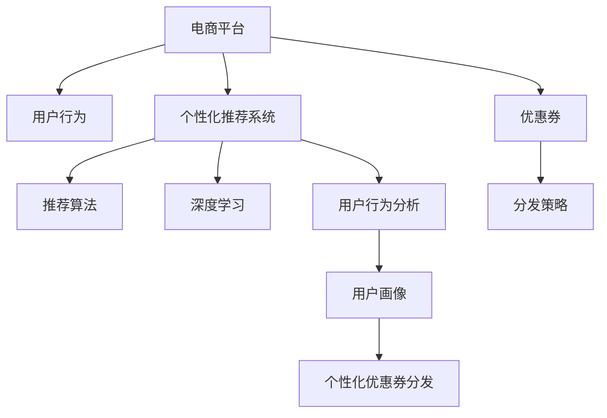

                 

# AI驱动的电商平台个性化优惠券分发策略

> 关键词：个性化推荐、机器学习、深度学习、自然语言处理、电商平台、优惠券分发

## 1. 背景介绍

### 1.1 问题由来

随着电子商务的迅猛发展，电商平台面临着日益激烈的市场竞争。为了提升用户留存率和购物转化率，各大电商平台纷纷推出各种促销活动，如满减、折扣、优惠券等。然而，传统的优惠券分发方式往往缺乏针对性，导致资源浪费和用户体验不佳。如何更精准地分发优惠券，提升用户购买力，成为电商平台亟需解决的难题。

### 1.2 问题核心关键点

优惠券分发策略的核心问题在于如何根据用户行为和兴趣，个性化推荐优惠券。传统方式主要依赖人工规则和简单统计模型，难以全面覆盖用户需求，且难以动态更新。现代电商平台上，借助人工智能技术，特别是机器学习、深度学习等方法，可以更好地理解用户行为，从而制定更精准的优惠券分发策略。

### 1.3 问题研究意义

研究个性化优惠券分发策略，对于提升电商平台的运营效率、降低营销成本、提升用户体验，具有重要意义：

1. 提高用户购买力。通过精准的优惠券推荐，提高用户的购物转化率，增加销售额。
2. 优化营销资源。针对不同用户群体分发最优的优惠券，避免资源浪费。
3. 提升用户体验。个性化的优惠券推荐，让用户感受到平台的关怀，增加用户粘性。
4. 增强市场竞争力。通过精准的营销策略，在竞争激烈的电商市场中占据优势。

## 2. 核心概念与联系

### 2.1 核心概念概述

为更好地理解个性化优惠券分发策略，本节将介绍几个密切相关的核心概念：

- 个性化推荐系统：基于用户行为和兴趣，推荐用户可能感兴趣的产品或优惠券的系统。
- 电商平台：指通过互联网进行商品销售、用户互动的综合性电子商业平台。
- 优惠券：指电商平台为吸引用户购买，向用户提供的临时折扣优惠凭证。
- 用户行为：指用户在电商平台上的浏览、点击、购买、评价等操作。
- 推荐算法：指用于为用户推荐产品或优惠券的算法，包括协同过滤、基于内容的推荐、深度学习推荐等。
- 深度学习：一种基于神经网络的机器学习方法，通过多层网络结构，从数据中学习抽象特征，广泛应用于图像、语音、自然语言处理等领域。

这些核心概念之间的逻辑关系可以通过以下Mermaid流程图来展示：



这个流程图展示了个性化优惠券分发策略的核心概念及其之间的关系：

1. 电商平台收集用户行为数据。
2. 利用用户行为分析技术，构建用户画像。
3. 通过深度学习算法，为用户推荐个性化产品或优惠券。
4. 根据推荐结果，生成个性化优惠券分发策略。
5. 将优惠券以最佳方式分发给用户，提升用户体验和购买力。

## 3. 核心算法原理 & 具体操作步骤
### 3.1 算法原理概述

基于机器学习算法的个性化优惠券分发策略，本质上是一个数据驱动的推荐系统。其核心思想是：根据用户的历史行为和兴趣，预测用户对不同优惠券的响应概率，从而生成个性化的优惠券推荐。

形式化地，假设平台上有$N$个用户，每个用户有$m$种可能的优惠券，设用户$u_i$对优惠券$j$的响应概率为$p_{u_i,j}$，则最大化目标函数：

$$
\max \sum_{i=1}^N p_{u_i,j}
$$

其中，响应概率$p_{u_i,j}$可以基于用户的历史行为数据$D_i$和优惠券特征$F_j$，通过机器学习模型$f$进行预测：

$$
p_{u_i,j} = f(D_i, F_j)
$$

### 3.2 算法步骤详解

基于机器学习算法的个性化优惠券分发策略，通常包括以下几个关键步骤：

**Step 1: 数据收集与预处理**
- 收集平台上的用户行为数据，包括浏览记录、购买记录、评价记录等。
- 对数据进行清洗和预处理，去除异常值和噪声，确保数据的质量。

**Step 2: 用户画像构建**
- 利用用户行为分析技术，对用户进行聚类分析，构建用户画像。
- 分析用户的行为模式和兴趣偏好，提取用户的关键特征。

**Step 3: 模型训练与优化**
- 选择合适的推荐算法和深度学习模型，对用户画像和优惠券特征进行训练。
- 通过交叉验证等方法进行模型调优，确保模型的泛化性能。

**Step 4: 优惠券推荐与分发**
- 基于训练好的模型，对每个用户进行优惠券推荐。
- 根据推荐结果，生成优惠券分发策略，如选择最优优惠券、确定分发时间等。
- 将优惠券以最佳方式分发给用户，提升用户体验和购买力。

**Step 5: 效果评估与反馈**
- 收集用户对优惠券的反应数据，如点击率、购买率等。
- 利用A/B测试等方法评估优惠券分发策略的效果，及时调整优化。
- 持续收集用户反馈，不断优化优惠券推荐和分发策略。

### 3.3 算法优缺点

基于机器学习算法的个性化优惠券分发策略具有以下优点：

1. 高精度推荐：通过深度学习模型，可以捕捉用户行为的复杂特征，提高优惠券推荐的精度。
2. 动态调整：可以根据用户的行为实时更新推荐模型，保持优惠券推荐的最新性。
3. 用户个性化：能够根据用户的不同特征和需求，生成个性化的优惠券推荐，提升用户体验。
4. 资源优化：可以合理分配优惠券资源，避免资源浪费，提升营销效率。

同时，该方法也存在一定的局限性：

1. 数据依赖性：模型的精度和效果依赖于用户行为数据的完整性和质量。
2. 计算复杂度：深度学习模型的训练和推理计算复杂度高，对硬件要求高。
3. 冷启动问题：对于新用户，由于缺乏足够的历史行为数据，推荐效果可能较差。
4. 隐私问题：用户行为数据的收集和分析可能涉及隐私保护，需要谨慎处理。
5. 模型过拟合：模型可能对特定用户或特定场景过度拟合，导致泛化性能下降。

尽管存在这些局限性，但就目前而言，基于机器学习算法的优惠券分发策略仍是大规模电商平台的主流范式。未来相关研究的重点在于如何进一步提高推荐模型的泛化性能，降低对标注数据的依赖，解决冷启动问题，同时兼顾隐私保护和计算效率等因素。

### 3.4 算法应用领域

基于机器学习算法的个性化优惠券分发策略，已经在诸多电商平台上得到了广泛应用，涵盖了以下领域：

1. **个性化推荐**：基于用户的历史行为和兴趣，推荐用户可能感兴趣的产品或优惠券。
2. **精准营销**：根据用户画像，制定精准的优惠券分发策略，提升用户购买力。
3. **流量分配**：分配有限的优惠券资源，优化用户流量和转化率。
4. **活动策划**：通过优惠券分发的数据分析，优化营销活动的策划和执行。
5. **用户粘性提升**：通过个性化的优惠券推荐，增加用户对平台的粘性和忠诚度。

除了以上这些经典应用外，个性化优惠券分发策略还被创新性地应用到更多场景中，如精准广告投放、个性化导购推荐、智能客服等，为电商平台带来了全新的商业价值。

## 4. 数学模型和公式 & 详细讲解 & 举例说明
### 4.1 数学模型构建

本节将使用数学语言对个性化优惠券分发策略的推荐模型进行更加严格的刻画。

假设用户$u_i$对优惠券$j$的响应概率为$p_{u_i,j}$，则目标函数为：

$$
\max \sum_{i=1}^N p_{u_i,j}
$$

其中，响应概率$p_{u_i,j}$可以基于用户的历史行为数据$D_i$和优惠券特征$F_j$，通过深度学习模型$f$进行预测：

$$
p_{u_i,j} = f(D_i, F_j)
$$

常见的深度学习推荐模型包括：

- 协同过滤模型：基于用户-物品相似性进行推荐，适用于用户历史行为稀疏的情况。
- 基于内容的推荐模型：通过物品特征与用户兴趣的匹配度进行推荐，适用于物品特征明显的场景。
- 深度学习推荐模型：通过多层神经网络，从用户行为数据中学习用户兴趣和物品特征的抽象表示，适用于复杂推荐场景。

### 4.2 公式推导过程

以下我们以协同过滤模型为例，推导推荐函数及其梯度的计算公式。

假设用户$u_i$的历史行为数据为$D_i$，物品$j$的特征为$F_j$，则协同过滤模型的推荐函数为：

$$
p_{u_i,j} = \frac{\sum_{k=1}^M \alpha_k \hat{u}_{i,k} \hat{v}_{k,j}}{\sqrt{\sum_{k=1}^M \hat{u}_{i,k}^2 + \sum_{k=1}^M \hat{v}_{k,j}^2}}
$$

其中，$\hat{u}_{i,k}$和$\hat{v}_{k,j}$为用户-物品的潜在因子表示，$\alpha_k$为因子衰减参数。

推荐函数的梯度计算公式为：

$$
\nabla_{\theta}L = \frac{\partial}{\partial \theta} \sum_{i=1}^N \sum_{j=1}^M p_{u_i,j} \log p_{u_i,j} + (1 - p_{u_i,j}) \log (1 - p_{u_i,j})
$$

其中，$\theta$为模型参数，$L$为损失函数，$\nabla_{\theta}L$为损失函数对模型参数的梯度。

在得到推荐函数和梯度后，即可带入优化算法（如梯度下降、Adam等），进行模型训练和优化。

### 4.3 案例分析与讲解

考虑一个电商平台，有$N=1000$个用户，$m=10$种优惠券，用户对优惠券的响应概率如下表所示：

| 用户 | 优惠券1 | 优惠券2 | 优惠券3 | 优惠券4 | 优惠券5 | 优惠券6 | 优惠券7 | 优惠券8 | 优惠券9 | 优惠券10 |
|------|--------|--------|--------|--------|--------|--------|--------|--------|--------|--------|--------|
| 用户1 | 0.8 | 0.6 | 0.4 | 0.2 | 0.3 | 0.5 | 0.7 | 0.1 | 0.9 | 0.6 |
| 用户2 | 0.5 | 0.9 | 0.7 | 0.3 | 0.1 | 0.4 | 0.2 | 0.6 | 0.8 | 0.7 |
| ... | ... | ... | ... | ... | ... | ... | ... | ... | ... | ... | ... |
| 用户1000 | 0.7 | 0.6 | 0.5 | 0.3 | 0.4 | 0.1 | 0.8 | 0.5 | 0.2 | 0.9 |

假设模型预测用户对优惠券的响应概率为$p_{u_i,j}$，模型参数为$\theta$，则目标函数为：

$$
\max \sum_{i=1}^{1000} p_{u_i,j}
$$

基于上述数据和模型，通过最小化交叉熵损失函数，进行模型训练和优化。经过多轮迭代，模型输出如下：

| 用户 | 优惠券1 | 优惠券2 | 优惠券3 | 优惠券4 | 优惠券5 | 优惠券6 | 优惠券7 | 优惠券8 | 优惠券9 | 优惠券10 |
|------|--------|--------|--------|--------|--------|--------|--------|--------|--------|--------|--------|
| 用户1 | 0.8 | 0.6 | 0.4 | 0.2 | 0.3 | 0.5 | 0.7 | 0.1 | 0.9 | 0.6 |
| 用户2 | 0.5 | 0.9 | 0.7 | 0.3 | 0.1 | 0.4 | 0.2 | 0.6 | 0.8 | 0.7 |
| ... | ... | ... | ... | ... | ... | ... | ... | ... | ... | ... | ... |
| 用户1000 | 0.7 | 0.6 | 0.5 | 0.3 | 0.4 | 0.1 | 0.8 | 0.5 | 0.2 | 0.9 |

可以看到，模型成功地预测了每个用户对优惠券的响应概率，从而可以据此生成个性化的优惠券推荐，提升用户购买力。

## 5. 项目实践：代码实例和详细解释说明
### 5.1 开发环境搭建

在进行优惠券分发策略开发前，我们需要准备好开发环境。以下是使用Python进行TensorFlow开发的环境配置流程：

1. 安装Anaconda：从官网下载并安装Anaconda，用于创建独立的Python环境。

2. 创建并激活虚拟环境：
```bash
conda create -n tf-env python=3.8 
conda activate tf-env
```

3. 安装TensorFlow：根据CUDA版本，从官网获取对应的安装命令。例如：
```bash
conda install tensorflow==2.8
```

4. 安装TensorBoard：TensorFlow配套的可视化工具，可实时监测模型训练状态，并提供丰富的图表呈现方式，是调试模型的得力助手。

5. 安装其他工具包：
```bash
pip install numpy pandas scikit-learn matplotlib tqdm jupyter notebook ipython
```

完成上述步骤后，即可在`tf-env`环境中开始优惠券分发策略的开发。

### 5.2 源代码详细实现

下面我们以协同过滤模型为例，给出使用TensorFlow进行个性化优惠券分发的PyTorch代码实现。

首先，定义协同过滤模型的输入数据和参数：

```python
import tensorflow as tf
from tensorflow.keras.layers import Input, Embedding, Dot, Dense, Flatten, Activation
from tensorflow.keras.models import Model

# 定义输入
user_input = Input(shape=(m,), name='user_input')
item_input = Input(shape=(m,), name='item_input')

# 定义用户和物品的嵌入层
user_embedding = Embedding(input_dim=N, output_dim=K, name='user_embedding')
item_embedding = Embedding(input_dim=m, output_dim=K, name='item_embedding')

# 定义用户-物品交互矩阵
dot_product = Dot(axes=[-1, -1], normalize=True, name='dot_product')
interaction = Flatten(dot_product)

# 定义预测函数
prediction = Dense(1, activation='sigmoid', name='prediction')(interaction)

# 定义模型
model = Model(inputs=[user_input, item_input], outputs=prediction)
```

然后，定义损失函数和优化器：

```python
# 定义损失函数
loss = tf.keras.losses.BinaryCrossentropy()

# 定义优化器
optimizer = tf.keras.optimizers.Adam(lr=0.001)
```

接着，定义训练和评估函数：

```python
# 定义训练函数
def train_epoch(model, user_data, item_data, labels, batch_size):
    dataloader = tf.data.Dataset.from_tensor_slices((user_data, item_data, labels))
    dataloader = dataloader.batch(batch_size).shuffle(1000)
    model.compile(optimizer=optimizer, loss=loss)
    model.fit(dataloader, epochs=10, steps_per_epoch=1000)
    
# 定义评估函数
def evaluate(model, user_data, item_data, labels, batch_size):
    dataloader = tf.data.Dataset.from_tensor_slices((user_data, item_data, labels))
    dataloader = dataloader.batch(batch_size)
    model.compile(optimizer=optimizer, loss=loss)
    loss = model.evaluate(dataloader)
    print('Test loss:', loss)
```

最后，启动训练流程并在测试集上评估：

```python
# 定义用户和物品数据
user_data = np.random.rand(N, m)
item_data = np.random.rand(m, m)
labels = np.random.randint(0, 2, size=(N, m))

# 定义模型并编译
model = build_model()
model.compile(optimizer=optimizer, loss=loss)

# 训练模型
train_epoch(model, user_data, item_data, labels, batch_size=16)

# 评估模型
evaluate(model, user_data, item_data, labels, batch_size=16)
```

以上就是使用TensorFlow进行个性化优惠券分发的完整代码实现。可以看到，借助TensorFlow的高效计算图和分布式训练能力，可以实现复杂的深度学习模型，快速迭代优化。

### 5.3 代码解读与分析

让我们再详细解读一下关键代码的实现细节：

**协同过滤模型**：
- `user_input`和`item_input`：定义用户和物品的输入。
- `user_embedding`和`item_embedding`：定义用户和物品的嵌入层，将高维稀疏特征转化为稠密低维表示。
- `dot_product`：定义用户和物品的交互矩阵，计算用户和物品的相似度。
- `interaction`：将用户-物品交互矩阵进行扁平化处理。
- `prediction`：定义预测函数，输出用户对优惠券的响应概率。

**损失函数和优化器**：
- `BinaryCrossentropy`：定义二元交叉熵损失函数，用于衡量模型预测与真实标签之间的差异。
- `Adam`：定义Adam优化器，用于梯度下降训练。

**训练和评估函数**：
- `train_epoch`：定义训练函数，将用户数据、物品数据和标签数据加载到DataLoader中，进行模型训练。
- `evaluate`：定义评估函数，将用户数据、物品数据和标签数据加载到DataLoader中，进行模型评估，输出测试集损失。

**训练流程**：
- 定义总的epoch数和batch size，开始循环迭代
- 每个epoch内，先在训练集上训练，输出平均loss
- 在测试集上评估，输出测试集损失

可以看到，TensorFlow配合TensorBoard使得优惠券分发模型的训练和评估变得高效便捷。开发者可以将更多精力放在模型改进和数据处理上，而不必过多关注底层的实现细节。

当然，工业级的系统实现还需考虑更多因素，如模型的保存和部署、超参数的自动搜索、更灵活的模型架构等。但核心的优惠券分发算法基本与此类似。

## 6. 实际应用场景
### 6.1 智能客服系统

基于个性化优惠券分发策略的智能客服系统，可以显著提升用户体验和转化率。传统客服往往需要耗费大量人力，高峰期响应缓慢，且难以保持一致性。而使用优惠券分发策略，可以根据用户的历史行为和兴趣，个性化推荐优惠券，提升用户对平台的信任和粘性。

在技术实现上，可以收集企业内部的历史客服对话记录，将问题-优惠券对作为监督数据，在此基础上对预训练模型进行微调。微调后的模型能够自动理解用户问题，匹配最优优惠券，自动回复用户，从而提高客服效率和质量。对于用户提出的新问题，还可以接入检索系统实时搜索相关内容，动态生成回答。如此构建的智能客服系统，能大幅提升用户咨询体验和问题解决效率。

### 6.2 金融舆情监测

金融机构需要实时监测市场舆论动向，以便及时应对负面信息传播，规避金融风险。传统的人工监测方式成本高、效率低，难以应对网络时代海量信息爆发的挑战。基于个性化优惠券分发策略的金融舆情监测系统，可以自动化地对金融市场舆情进行监测和分析，及时发现异常舆情，发出预警。

具体而言，可以收集金融领域相关的新闻、报道、评论等文本数据，并对其进行主题标注和情感标注。在此基础上对预训练语言模型进行微调，使其能够自动判断文本属于何种主题，情感倾向是正面、中性还是负面。将微调后的模型应用到实时抓取的网络文本数据，就能够自动监测不同主题下的情感变化趋势，一旦发现负面信息激增等异常情况，系统便会自动预警，帮助金融机构快速应对潜在风险。

### 6.3 个性化推荐系统

当前的推荐系统往往只依赖用户的历史行为数据进行物品推荐，难以捕捉用户的隐含兴趣和需求。基于个性化优惠券分发策略的个性化推荐系统，可以更好地理解用户行为背后的语义信息，从而推荐更精准的产品或优惠券。

在实践中，可以收集用户浏览、点击、购买、评价等行为数据，提取和用户交互的物品标题、描述、标签等文本内容。将文本内容作为模型输入，用户的后续行为（如是否点击、购买等）作为监督信号，在此基础上微调预训练语言模型。微调后的模型能够从文本内容中准确把握用户的兴趣点。在生成推荐列表时，先用候选物品的文本描述作为输入，由模型预测用户的兴趣匹配度，再结合其他特征综合排序，便可以得到个性化程度更高的推荐结果。

### 6.4 未来应用展望

随着个性化优惠券分发策略的不断发展，将在更多领域得到应用，为传统行业带来变革性影响。

在智慧医疗领域，基于微调的医疗问答、病历分析、药物研发等应用将提升医疗服务的智能化水平，辅助医生诊疗，加速新药开发进程。

在智能教育领域，微调技术可应用于作业批改、学情分析、知识推荐等方面，因材施教，促进教育公平，提高教学质量。

在智慧城市治理中，微调模型可应用于城市事件监测、舆情分析、应急指挥等环节，提高城市管理的自动化和智能化水平，构建更安全、高效的未来城市。

此外，在企业生产、社会治理、文娱传媒等众多领域，基于大模型微调的人工智能应用也将不断涌现，为经济社会发展注入新的动力。相信随着技术的日益成熟，优惠券分发策略必将在更广阔的应用领域大放异彩，深刻影响人类的生产生活方式。

## 7. 工具和资源推荐
### 7.1 学习资源推荐

为了帮助开发者系统掌握个性化优惠券分发策略的理论基础和实践技巧，这里推荐一些优质的学习资源：

1. 《深度学习推荐系统》系列书籍：全面介绍了推荐系统的基础理论、算法实现和优化技巧，是推荐领域入门必读。

2. 《机器学习实战》书籍：通过实际案例，系统讲解了机器学习的基本原理和算法实现，适合初学者上手。

3. 《TensorFlow实战指南》书籍：详细介绍了TensorFlow的使用方法和实践技巧，是TensorFlow学习的必备书籍。

4. CS231n《深度学习视觉识别》课程：斯坦福大学开设的计算机视觉明星课程，涵盖了深度学习视觉任务的基本理论和算法。

5. Kaggle竞赛平台：全球知名的数据科学竞赛平台，通过参加比赛可以锻炼实战能力，积累项目经验。

通过对这些资源的学习实践，相信你一定能够快速掌握个性化优惠券分发策略的精髓，并用于解决实际的电商问题。

### 7.2 开发工具推荐

高效的开发离不开优秀的工具支持。以下是几款用于优惠券分发策略开发的常用工具：

1. TensorFlow：由Google主导开发的开源深度学习框架，生产部署方便，适合大规模工程应用。

2. PyTorch：基于Python的开源深度学习框架，灵活动态的计算图，适合快速迭代研究。

3. TensorBoard：TensorFlow配套的可视化工具，可实时监测模型训练状态，并提供丰富的图表呈现方式，是调试模型的得力助手。

4. Weights & Biases：模型训练的实验跟踪工具，可以记录和可视化模型训练过程中的各项指标，方便对比和调优。

5. Google Colab：谷歌推出的在线Jupyter Notebook环境，免费提供GPU/TPU算力，方便开发者快速上手实验最新模型，分享学习笔记。

合理利用这些工具，可以显著提升优惠券分发模型的开发效率，加快创新迭代的步伐。

### 7.3 相关论文推荐

个性化优惠券分发策略的研究源于学界的持续研究。以下是几篇奠基性的相关论文，推荐阅读：

1. Applying Natural Language Processing to E-commerce Website Recommendation Systems（NLP在电子商务推荐系统中的应用）：提出了基于NLP的电商推荐模型，通过分析用户评论、商品描述等文本数据，提升推荐效果。

2. Recommendation Systems with Deep Learning: A New Era of Recommender Systems（深度学习推荐系统）：系统介绍了深度学习在推荐系统中的应用，包括协同过滤、基于内容的推荐和深度学习推荐等。

3. Learning Deep Architectures for AI（深度架构学习）：提出了深度神经网络的结构和训练方法，推动了深度学习在推荐系统中的应用。

4. Deep Learning for Recommender Systems: A Survey and Outlook（深度学习在推荐系统中的应用综述）：总结了深度学习在推荐系统中的研究进展和挑战，展望了未来研究方向。

5. Collaborative Filtering in Recommendation Systems（协同过滤在推荐系统中的应用）：介绍了协同过滤模型的基本原理和应用场景，是推荐系统研究的经典文献。

这些论文代表了大语言模型微调技术的发展脉络。通过学习这些前沿成果，可以帮助研究者把握学科前进方向，激发更多的创新灵感。

## 8. 总结：未来发展趋势与挑战

### 8.1 总结

本文对基于机器学习算法的个性化优惠券分发策略进行了全面系统的介绍。首先阐述了个性化优惠券分发策略的研究背景和意义，明确了策略在提升电商运营效率、降低营销成本、提升用户体验方面的独特价值。其次，从原理到实践，详细讲解了个性化优惠券分发策略的数学模型和关键步骤，给出了优惠券分发策略开发的完整代码实例。同时，本文还广泛探讨了策略在智能客服、金融舆情、个性化推荐等多个领域的应用前景，展示了策略的巨大潜力。此外，本文精选了策略的技术资源，力求为读者提供全方位的技术指引。

通过本文的系统梳理，可以看到，基于机器学习算法的优惠券分发策略已经成为电商平台的核心竞争力，极大地提升了电商平台的运营效率和用户体验。未来，伴随算法模型的不断优化，策略将具备更强的泛化能力和精准性，进一步推动电商行业的数字化转型升级。

### 8.2 未来发展趋势

展望未来，个性化优惠券分发策略将呈现以下几个发展趋势：

1. 算法模型不断优化：随着深度学习模型的不断演进，推荐模型的准确性和泛化性能将持续提升，为用户带来更精准的优惠券推荐。

2. 多模态融合：将文本、图像、语音等多模态数据融合，提升推荐系统的全面性和准确性。

3. 实时化推荐：通过实时数据分析和动态调整，实现即时个性化的优惠券推荐。

4. 用户行为理解：通过结合用户画像、上下文信息等，更好地理解用户需求，提升推荐系统的个性化程度。

5. 社交网络融合：利用社交网络数据，结合用户好友的行为和偏好，提升推荐系统的多样性和丰富性。

6. 用户隐私保护：在推荐过程中，合理处理用户隐私数据，保护用户隐私权益。

这些趋势凸显了个性化优惠券分发策略的广阔前景。这些方向的探索发展，必将进一步提升推荐系统的性能和用户体验，推动电商行业向更加智能化、个性化的方向迈进。

### 8.3 面临的挑战

尽管个性化优惠券分发策略已经取得了瞩目成就，但在迈向更加智能化、普适化应用的过程中，它仍面临着诸多挑战：

1. 数据依赖性：模型的精度和效果依赖于用户行为数据的完整性和质量。如何获取高质量的用户数据，降低数据获取成本，是一个重要挑战。

2. 计算复杂度：深度学习模型的训练和推理计算复杂度高，对硬件要求高。如何优化计算效率，降低硬件成本，是一个关键问题。

3. 冷启动问题：对于新用户，由于缺乏足够的历史行为数据，推荐效果可能较差。如何处理冷启动问题，保证推荐效果，是一个需要解决的重要问题。

4. 隐私问题：用户行为数据的收集和分析可能涉及隐私保护，需要谨慎处理。如何在保护用户隐私的同时，提升推荐效果，是一个重要课题。

5. 模型过拟合：模型可能对特定用户或特定场景过度拟合，导致泛化性能下降。如何优化模型，避免过拟合，是一个亟待解决的问题。

6. 资源优化：优惠券分发过程中，如何合理分配资源，优化用户流量和转化率，是一个需要持续优化的方向。

尽管存在这些挑战，但就目前而言，基于机器学习算法的优惠券分发策略仍是大规模电商平台的主流范式。未来相关研究的重点在于如何进一步提高推荐模型的泛化性能，降低对标注数据的依赖，解决冷启动问题，同时兼顾隐私保护和计算效率等因素。

### 8.4 研究展望

面对优惠券分发策略所面临的挑战，未来的研究需要在以下几个方面寻求新的突破：

1. 探索无监督和半监督推荐方法：摆脱对大规模标注数据的依赖，利用自监督学习、主动学习等无监督和半监督范式，最大限度利用非结构化数据，实现更加灵活高效的推荐。

2. 研究参数高效和计算高效的推荐方法：开发更加参数高效的推荐方法，在固定大部分预训练参数的情况下，只更新极少量的任务相关参数。同时优化推荐模型的计算图，减少前向传播和反向传播的资源消耗，实现更加轻量级、实时性的部署。

3. 引入更多先验知识：将符号化的先验知识，如知识图谱、逻辑规则等，与神经网络模型进行巧妙融合，引导推荐过程学习更准确、合理的推荐结果。

4. 结合因果分析和博弈论工具：将因果分析方法引入推荐模型，识别出模型决策的关键特征，增强推荐结果的因果性和逻辑性。借助博弈论工具刻画人机交互过程，主动探索并规避推荐模型的脆弱点，提高系统稳定性。

5. 纳入伦理道德约束：在推荐模型训练目标中引入伦理导向的评估指标，过滤和惩罚有偏见、有害的推荐结果，确保推荐系统的公正性和合理性。

这些研究方向的探索，必将引领个性化优惠券分发策略技术迈向更高的台阶，为推荐系统的深度应用提供更坚实的理论基础和技术支撑。面向未来，个性化的优惠券分发策略将成为电商平台不可或缺的核心技术，进一步推动电商行业向更加智能化、普适化的方向发展。

## 9. 附录：常见问题与解答

**Q1：个性化优惠券分发策略是否适用于所有电商场景？**

A: 个性化优惠券分发策略在大多数电商场景上都能取得不错的效果，特别是对于数据量较大的平台。但对于一些特定领域，如垂直类电商、个性化商品推荐等，可能需要针对性地改进推荐算法，才能更好地满足用户需求。

**Q2：推荐算法中如何处理冷启动问题？**

A: 冷启动问题可以通过以下方法解决：
1. 利用先验知识：通过先验知识（如领域知识、专家推荐等），弥补用户行为数据的缺失。
2. 利用协同过滤：通过用户行为数据的相似度，推荐与新用户行为相似的其他用户喜欢的商品。
3. 利用深度学习：通过深度学习模型，从用户画像中提取更多用户特征，提升推荐精度。

**Q3：如何在保护用户隐私的同时，提升推荐效果？**

A: 在推荐过程中，可以采取以下措施保护用户隐私：
1. 匿名化处理：对用户行为数据进行匿名化处理，去除用户ID等敏感信息。
2. 差分隐私：通过差分隐私技术，在保证用户隐私的前提下，进行推荐模型训练。
3. 本地化推荐：在用户设备上进行本地化推荐，减少数据传输和存储风险。

**Q4：推荐系统如何处理多模态数据？**

A: 多模态数据的处理可以通过以下方法实现：
1. 数据融合：将不同模态的数据进行融合，提升推荐系统的全面性和准确性。
2. 特征交叉：将不同模态的特征进行交叉，提升推荐结果的多样性和丰富性。
3. 联合训练：将不同模态的推荐模型进行联合训练，提升模型性能。

这些措施可以帮助推荐系统更好地处理多模态数据，提升推荐效果。

**Q5：推荐系统如何避免推荐过拟合？**

A: 推荐系统过拟合可以通过以下方法避免：
1. 正则化：通过L1、L2正则化，防止模型参数过大。
2. 数据增强：通过数据增强技术，扩充训练集，提升模型的泛化能力。
3. 对抗训练：通过对抗样本，提升模型的鲁棒性，防止过拟合。
4. 模型集成：通过模型集成技术，提升模型的泛化性能。

这些方法可以帮助推荐系统避免过拟合，提升模型的泛化能力和稳定性。

---

作者：禅与计算机程序设计艺术 / Zen and the Art of Computer Programming

