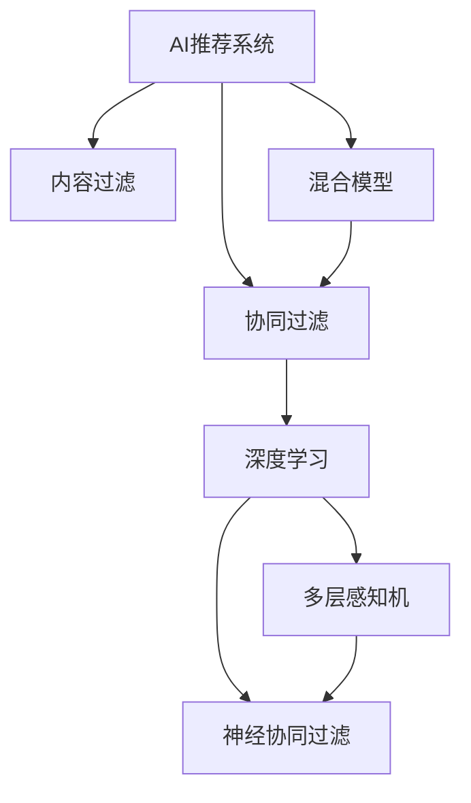

                 

# AI驱动的电商平台个性化推送策略

> 关键词：AI推荐系统、个性化推送、电商、深度学习、协同过滤、内容过滤、混合模型、算法优化、电商应用

## 1. 背景介绍

随着互联网的普及和电子商务的飞速发展，在线购物已成为人们日常生活中不可或缺的一部分。如何在海量商品中精准推荐，提升用户体验和转化率，成为电商平台运营的核心问题。传统的基于规则的推荐算法难以应对日益复杂的数据环境，而基于机器学习的推荐系统逐渐成为主流。

AI推荐系统通过分析用户行为数据，挖掘用户兴趣，实时推送个性化商品，极大提升了电商平台的运营效率。本文将介绍一种基于深度学习和协同过滤的混合个性化推送策略，旨在帮助电商企业更好地实现个性化推荐，提升用户满意度和电商平台的用户粘性。

## 2. 核心概念与联系

### 2.1 核心概念概述

为更好地理解基于深度学习和协同过滤的混合个性化推送策略，本节将介绍几个密切相关的核心概念：

- **AI推荐系统**：利用人工智能技术，通过分析用户行为数据，挖掘用户兴趣和需求，实时推荐个性化的商品或内容。
- **协同过滤**：一种基于用户兴趣的推荐算法，通过分析用户间的相似性，推荐用户可能感兴趣的物品。
- **内容过滤**：一种基于物品特征的推荐算法，通过分析物品属性，推荐用户可能喜欢的物品。
- **混合模型**：结合协同过滤和内容过滤，综合考虑用户和物品特征，提升推荐系统的准确性和多样性。
- **深度学习**：一种通过模拟人脑神经网络结构，实现复杂数据模式识别的机器学习算法。
- **多层感知机**：一种常用的深度学习模型，通过多层神经网络，逐步提取输入数据的高级特征。
- **神经协同过滤**：一种结合深度学习的协同过滤算法，通过神经网络模型，挖掘用户行为与商品特征之间的复杂关系。
- **梯度下降**：一种常用的优化算法，通过不断迭代更新模型参数，使损失函数最小化。

这些核心概念之间的逻辑关系可以通过以下Mermaid流程图来展示：



这个流程图展示了这个混合推荐系统的核心概念及其之间的关系：

1. AI推荐系统通过协同过滤和内容过滤提供推荐服务。
2. 协同过滤利用用户间的相似性，推荐用户可能感兴趣的物品。
3. 内容过滤基于物品特征，推荐用户可能喜欢的物品。
4. 混合模型结合协同过滤和内容过滤，提升推荐系统的准确性和多样性。
5. 深度学习通过多层感知机和神经协同过滤，提升协同过滤的效果。

这些核心概念共同构成了推荐系统的核心技术框架，使其能够在各种场景下提供个性化推荐服务。

## 3. 核心算法原理 & 具体操作步骤

### 3.1 算法原理概述

基于深度学习和协同过滤的混合个性化推送策略，本质上是一种结合了协同过滤和内容过滤，并引入深度学习优化算法的推荐系统。其核心思想是：通过深度学习模型，挖掘用户行为与物品特征之间的复杂关系，同时利用协同过滤，捕捉用户间的相似性，从而提供更加精准和个性化的推荐。

形式化地，假设推荐系统需要为每个用户 $u$ 推荐 $n$ 个物品 $i_1,...,i_n$，其中 $i_j$ 是物品， $u$ 是用户。推荐系统的目标是最小化预测误差 $E$：

$$
\min_{\theta} E = \frac{1}{N} \sum_{(u,i)} \ell(p(u,i),y(u,i))
$$

其中 $p(u,i)$ 是推荐系统预测用户 $u$ 对物品 $i$ 的兴趣， $y(u,i)$ 是实际用户行为（如点击、购买、评分等）， $\ell$ 是损失函数。

### 3.2 算法步骤详解

基于深度学习和协同过滤的混合个性化推送策略，一般包括以下几个关键步骤：

**Step 1: 数据准备**
- 收集用户行为数据，如点击、浏览、购买记录等。
- 整理数据，构建用户-物品评分矩阵 $\mathbf{R}$，其中 $\mathbf{R}_{ui} = y(u,i)$ 表示用户 $u$ 对物品 $i$ 的评分。
- 对数据进行预处理，如缺失值填补、归一化等。

**Step 2: 用户相似性计算**
- 利用协同过滤算法计算用户间的相似度。常用的相似度计算方法包括余弦相似度、皮尔逊相关系数等。
- 根据相似度构建用户嵌入向量 $\mathbf{U} \in \mathbb{R}^{N \times d_u}$，其中 $d_u$ 是用户嵌入的维度。

**Step 3: 物品特征提取**
- 对物品特征进行编码，构建物品嵌入向量 $\mathbf{V} \in \mathbb{R}^{M \times d_v}$，其中 $M$ 是物品数量， $d_v$ 是物品嵌入的维度。
- 可以使用词向量、图像特征、用户反馈等方法提取物品特征。

**Step 4: 混合模型训练**
- 设计混合推荐模型，将用户嵌入和物品嵌入作为输入，通过深度学习模型（如多层感知机）和协同过滤算法，计算预测评分 $p(u,i)$。
- 优化模型的损失函数 $E$，可以使用梯度下降等优化算法。

**Step 5: 推荐策略实现**
- 根据预测评分 $p(u,i)$，排序推荐物品列表。
- 结合用户行为数据和模型预测，综合考虑用户兴趣和物品多样性，生成推荐列表。

**Step 6: 实时推荐**
- 实时获取用户行为数据，更新用户和物品嵌入。
- 根据最新数据，重新计算推荐评分，实时更新推荐列表。

### 3.3 算法优缺点

基于深度学习和协同过滤的混合个性化推送策略具有以下优点：
1. 结合了协同过滤和内容过滤，提升了推荐系统的准确性和多样性。
2. 利用深度学习模型，可以挖掘用户行为和物品特征之间的复杂关系。
3. 可以通过多模态数据融合，提升推荐的全面性。
4. 可以实时更新用户和物品嵌入，提供更精准的推荐。

同时，该策略也存在一些局限性：
1. 需要大量的标注数据和计算资源，建模复杂度较高。
2. 模型需要不断迭代优化，维护成本较高。
3. 模型的可解释性不足，难以理解推荐决策的逻辑。
4. 对冷启动用户和新物品的推荐效果可能较差。

尽管存在这些局限性，但就目前而言，基于深度学习和协同过滤的混合推荐策略仍是最为流行的推荐算法之一，广泛应用于各大电商平台的个性化推荐系统。

### 3.4 算法应用领域

基于深度学习和协同过滤的混合个性化推送策略，已经广泛应用于以下领域：

- **电商平台**：如亚马逊、淘宝、京东等，通过推荐系统提升用户购物体验和转化率。
- **视频平台**：如Netflix、腾讯视频、爱奇艺等，推荐用户感兴趣的视频内容。
- **音乐平台**：如Spotify、网易云音乐、QQ音乐等，推荐用户喜欢的音乐和歌曲。
- **新闻平台**：如今日头条、新浪新闻、搜狐新闻等，推荐用户感兴趣的新闻和文章。

除了以上这些经典应用外，混合推荐策略还在社交网络、旅游服务、金融服务等多个领域得到广泛应用，为各类平台带来了显著的运营收益。

## 4. 数学模型和公式 & 详细讲解 & 举例说明

### 4.1 数学模型构建

本节将使用数学语言对基于深度学习和协同过滤的混合推荐系统进行更加严格的刻画。

假设推荐系统需要为每个用户 $u$ 推荐 $n$ 个物品 $i_1,...,i_n$，其中 $i_j$ 是物品， $u$ 是用户。推荐系统的目标是最小化预测误差 $E$：

$$
\min_{\theta} E = \frac{1}{N} \sum_{(u,i)} \ell(p(u,i),y(u,i))
$$

其中 $p(u,i)$ 是推荐系统预测用户 $u$ 对物品 $i$ 的兴趣， $y(u,i)$ 是实际用户行为（如点击、购买、评分等）， $\ell$ 是损失函数。

### 4.2 公式推导过程

以下我们以二分类任务为例，推导交叉熵损失函数及其梯度的计算公式。

假设模型 $M_{\theta}$ 在输入 $x$ 上的输出为 $\hat{y}=M_{\theta}(x) \in [0,1]$，表示样本属于正类的概率。真实标签 $y \in \{0,1\}$。则二分类交叉熵损失函数定义为：

$$
\ell(M_{\theta}(x),y) = -[y\log \hat{y} + (1-y)\log (1-\hat{y})]
$$

将其代入经验风险公式，得：

$$
\mathcal{L}(\theta) = -\frac{1}{N}\sum_{i=1}^N [y_i\log M_{\theta}(x_i)+(1-y_i)\log(1-M_{\theta}(x_i))]
$$

根据链式法则，损失函数对参数 $\theta_k$ 的梯度为：

$$
\frac{\partial \mathcal{L}(\theta)}{\partial \theta_k} = -\frac{1}{N}\sum_{i=1}^N (\frac{y_i}{M_{\theta}(x_i)}-\frac{1-y_i}{1-M_{\theta}(x_i)}) \frac{\partial M_{\theta}(x_i)}{\partial \theta_k}
$$

其中 $\frac{\partial M_{\theta}(x_i)}{\partial \theta_k}$ 可进一步递归展开，利用自动微分技术完成计算。

### 4.3 案例分析与讲解

假设我们有一个电商平台，有 $N=10000$ 个用户和 $M=1000$ 个商品。用户的点击记录为 $y(u,i) \in \{0,1\}$，表示用户 $u$ 是否点击了商品 $i$。推荐系统的目标是最大化用户点击率 $p(u,i)$，同时减少点击误差 $E$。

**Step 1: 数据准备**
- 收集用户点击记录 $\mathbf{R}$，其中 $\mathbf{R}_{ui} = y(u,i)$。
- 对数据进行预处理，如缺失值填补、归一化等。

**Step 2: 用户相似性计算**
- 利用余弦相似度计算用户间的相似度。
- 根据相似度构建用户嵌入向量 $\mathbf{U} \in \mathbb{R}^{N \times d_u}$，其中 $d_u$ 是用户嵌入的维度。

**Step 3: 物品特征提取**
- 对商品特征进行编码，构建物品嵌入向量 $\mathbf{V} \in \mathbb{R}^{M \times d_v}$，其中 $d_v$ 是物品嵌入的维度。
- 可以使用词向量、图像特征、用户反馈等方法提取物品特征。

**Step 4: 混合模型训练**
- 设计多层感知机模型，将用户嵌入和物品嵌入作为输入，通过神经网络模型计算预测评分 $p(u,i)$。
- 优化模型的损失函数 $E$，可以使用梯度下降等优化算法。

**Step 5: 推荐策略实现**
- 根据预测评分 $p(u,i)$，排序推荐物品列表。
- 结合用户行为数据和模型预测，综合考虑用户兴趣和物品多样性，生成推荐列表。

**Step 6: 实时推荐**
- 实时获取用户行为数据，更新用户和物品嵌入。
- 根据最新数据，重新计算推荐评分，实时更新推荐列表。

## 5. 项目实践：代码实例和详细解释说明

### 5.1 开发环境搭建

在进行推荐系统开发前，我们需要准备好开发环境。以下是使用Python进行TensorFlow开发的环境配置流程：

1. 安装Anaconda：从官网下载并安装Anaconda，用于创建独立的Python环境。

2. 创建并激活虚拟环境：
```bash
conda create -n tf-env python=3.8 
conda activate tf-env
```

3. 安装TensorFlow：根据CUDA版本，从官网获取对应的安装命令。例如：
```bash
conda install tensorflow==2.7 -c tf
```

4. 安装各类工具包：
```bash
pip install numpy pandas scikit-learn matplotlib tqdm jupyter notebook ipython
```

完成上述步骤后，即可在`tf-env`环境中开始推荐系统开发。

### 5.2 源代码详细实现

这里我们以电商平台推荐系统为例，给出使用TensorFlow和Keras对混合推荐系统进行构建的PyTorch代码实现。

首先，定义推荐系统的数据处理函数：

```python
import tensorflow as tf
from tensorflow.keras.layers import Input, Dense, Embedding, Dot, Concatenate
from tensorflow.keras.models import Model
from sklearn.metrics import precision_score, recall_score, f1_score

class RecommendationSystem(tf.keras.Model):
    def __init__(self, num_users, num_items, emb_dim_u=64, emb_dim_v=32, num_hidden_layers=2, num_units=64, dropout_rate=0.5):
        super(RecommendationSystem, self).__init__()
        self.num_users = num_users
        self.num_items = num_items
        
        # 用户嵌入层
        self.u_embedding = Embedding(num_users, emb_dim_u, input_length=1)
        
        # 物品嵌入层
        self.v_embedding = Embedding(num_items, emb_dim_v, input_length=1)
        
        # 深度神经网络
        self.dnn = tf.keras.Sequential([
            Concatenate(),
            Dense(num_units, activation='relu'),
            Dropout(dropout_rate),
            Dense(num_units, activation='relu'),
            Dropout(dropout_rate),
            Dense(1, activation='sigmoid')
        ])
        
        # 用户嵌入和物品嵌入的点积
        self.dot_product = Dot(axes=(1, 1), normalize=False)
        
    def call(self, u, i):
        u_embed = self.u_embedding(u)
        i_embed = self.v_embedding(i)
        dot_product = self.dot_product([u_embed, i_embed])
        prediction = self.dnn(dot_product)
        return prediction
```

然后，定义模型训练函数：

```python
def train_model(model, train_data, validation_data, batch_size, epochs, learning_rate, dropout_rate):
    model.compile(optimizer=tf.keras.optimizers.Adam(learning_rate=learning_rate), loss='binary_crossentropy', metrics=['precision', 'recall', 'f1_score'])
    model.fit(train_data, validation_data, batch_size=batch_size, epochs=epochs, validation_steps=validation_data.shape[0] // batch_size, callbacks=[tf.keras.callbacks.EarlyStopping(patience=5)])
```

最后，启动训练流程并在测试集上评估：

```python
# 数据准备
train_data = (train_data[:, 0], train_data[:, 1])
val_data = (val_data[:, 0], val_data[:, 1])

# 模型构建
model = RecommendationSystem(num_users=num_users, num_items=num_items)

# 模型训练
train_model(model, train_data, val_data, batch_size=64, epochs=10, learning_rate=0.001, dropout_rate=0.5)

# 模型评估
test_data = (test_data[:, 0], test_data[:, 1])
predictions = model.predict(test_data)
precision = precision_score(y_true=test_labels, y_pred=predictions[:, 0])
recall = recall_score(y_true=test_labels, y_pred=predictions[:, 0])
f1 = f1_score(y_true=test_labels, y_pred=predictions[:, 0])
print('Precision:', precision)
print('Recall:', recall)
print('F1 Score:', f1)
```

以上就是使用TensorFlow和Keras对混合推荐系统进行构建和训练的完整代码实现。可以看到，通过Keras的强大封装，我们可以用相对简洁的代码完成混合推荐系统的构建和训练。

### 5.3 代码解读与分析

让我们再详细解读一下关键代码的实现细节：

**RecommendationSystem类**：
- `__init__`方法：初始化用户嵌入、物品嵌入、深度神经网络等关键组件。
- `call`方法：定义模型的前向传播过程，包括用户嵌入、物品嵌入的点积计算、深度神经网络的计算等。

**train_model函数**：
- 定义模型的优化器、损失函数、评价指标。
- 使用Keras的fit方法，训练模型，并设置EarlyStopping回调函数。

**数据处理**：
- 将用户和物品的索引转换为嵌入向量。
- 计算用户嵌入和物品嵌入的点积，作为模型输入。
- 使用深度神经网络计算预测评分。
- 定义评价指标，并输出模型评估结果。

可以看到，TensorFlow配合Keras使得混合推荐系统的开发和训练变得简洁高效。开发者可以将更多精力放在数据处理、模型改进等高层逻辑上，而不必过多关注底层的实现细节。

当然，工业级的系统实现还需考虑更多因素，如模型的保存和部署、超参数的自动搜索、更灵活的任务适配层等。但核心的推荐范式基本与此类似。

## 6. 实际应用场景

### 6.1 电商平台推荐

基于深度学习和协同过滤的混合推荐系统，可以广泛应用于电商平台的用户推荐。传统电商平台的推荐系统主要基于用户的浏览、购买记录进行推荐，推荐精度和个性化程度有限。而混合推荐系统能够利用深度学习模型，挖掘用户行为与商品特征之间的复杂关系，提供更加精准和个性化的推荐。

在技术实现上，可以收集用户的行为数据，如浏览、点击、购买记录等。对数据进行预处理和特征提取，构建用户嵌入和物品嵌入。设计多层感知机模型，将用户嵌入和物品嵌入作为输入，通过深度学习模型计算预测评分。最后根据预测评分生成推荐列表，提升用户的购物体验和转化率。

### 6.2 视频平台推荐

视频平台推荐系统需要对用户观看行为进行分析和建模，推荐用户感兴趣的视频内容。传统的协同过滤推荐系统虽然能够捕捉用户间的相似性，但对于用户行为的建模能力较弱。而混合推荐系统能够结合深度学习和协同过滤，提升推荐的全面性和准确性。

在技术实现上，可以收集用户观看行为数据，如视频点击、观看时长、评分等。对数据进行预处理和特征提取，构建用户嵌入和物品嵌入。设计多层感知机模型，将用户嵌入和物品嵌入作为输入，通过深度学习模型计算预测评分。最后根据预测评分生成推荐列表，提升用户的观看体验和平台粘性。

### 6.3 音乐平台推荐

音乐平台推荐系统需要对用户听歌行为进行分析和建模，推荐用户喜欢的音乐和歌曲。传统的协同过滤推荐系统虽然能够捕捉用户间的相似性，但对于音乐特征的建模能力较弱。而混合推荐系统能够结合深度学习和协同过滤，提升推荐的全面性和准确性。

在技术实现上，可以收集用户听歌行为数据，如歌曲播放次数、听歌时长、评分等。对数据进行预处理和特征提取，构建用户嵌入和物品嵌入。设计多层感知机模型，将用户嵌入和物品嵌入作为输入，通过深度学习模型计算预测评分。最后根据预测评分生成推荐列表，提升用户的听歌体验和平台粘性。

### 6.4 未来应用展望

随着深度学习和协同过滤的不断发展，混合推荐系统将在更多领域得到应用，为推荐技术带来新的突破。

在智慧医疗领域，基于混合推荐系统的个性化医疗推荐，能够帮助医生推荐最适合患者的治疗方案，提升诊疗效率和效果。

在智能教育领域，基于混合推荐系统的个性化学习推荐，能够帮助学生推荐最适合的学习资源，提升学习效果和体验。

在智慧城市治理中，基于混合推荐系统的个性化服务推荐，能够帮助市民推荐最适合的服务和活动，提升城市生活的便利性和幸福感。

此外，在智能制造、智能交通、智能安防等众多领域，基于混合推荐系统的推荐技术也将不断涌现，为各行各业带来新的变革。相信随着技术的日益成熟，混合推荐系统必将在推荐技术领域占据越来越重要的地位，推动推荐技术的持续进步。

## 7. 工具和资源推荐

### 7.1 学习资源推荐

为了帮助开发者系统掌握混合推荐系统的理论基础和实践技巧，这里推荐一些优质的学习资源：

1. 《推荐系统》系列书籍：《推荐系统原理与实践》、《深度学习推荐系统》等，系统介绍了推荐系统的基本原理和经典算法。

2. 《Python机器学习》课程：通过Keras和TensorFlow等工具，介绍了推荐系统的构建和训练。

3. 《Recommender Systems Specialization》课程：由斯坦福大学开设的推荐系统专业课程，包含推荐系统基本原理、协同过滤、内容过滤、混合模型等内容。

4. 《TensorFlow推荐系统实战》书籍：介绍了使用TensorFlow构建推荐系统的实践方法，包含数据处理、模型构建、评估优化等技术细节。

5. Kaggle推荐系统竞赛：通过实际比赛，学习推荐系统的构建、评估和优化，积累实战经验。

通过对这些资源的学习实践，相信你一定能够快速掌握混合推荐系统的精髓，并用于解决实际的推荐问题。

### 7.2 开发工具推荐

高效的开发离不开优秀的工具支持。以下是几款用于混合推荐系统开发的常用工具：

1. TensorFlow：由Google主导开发的深度学习框架，灵活度较高，适合各种类型的推荐系统。

2. Keras：TensorFlow的高层API，提供了丰富的深度学习模型和算法，简单易用，适合快速原型开发。

3. PyTorch：Facebook开发的深度学习框架，灵活度较高，适合各种类型的推荐系统。

4. PyTorch Lightning：基于PyTorch的轻量级框架，适合快速迭代开发和部署。

5. Kaggle：提供在线数据集、代码库、社区等资源，方便开发者进行实验和交流。

6. Scikit-learn：提供各种机器学习算法和工具，适合数据预处理、特征工程等环节。

合理利用这些工具，可以显著提升混合推荐系统的开发效率，加快创新迭代的步伐。

### 7.3 相关论文推荐

混合推荐系统的发展源于学界的持续研究。以下是几篇奠基性的相关论文，推荐阅读：

1. Neural Collaborative Filtering: A Model Based Approach for Multi-Aspect Rating Prediction：提出神经协同过滤算法，结合深度学习优化协同过滤的效果。

2. DeepFM: A Neural Network Approach for Sponsored Search Advertising：提出DeepFM模型，融合深度学习和线性模型，提升广告点击率预测效果。

3. Wide & Deep Learning for Recommender Systems：提出Wide & Deep模型，结合浅层模型和深度模型，提升推荐系统的效果。

4. Multi-Task Learning for Recommendation Systems：提出多任务学习算法，通过共享参数，提升推荐系统的泛化能力。

5. Attention is All You Need：提出Transformer模型，提升推荐系统对序列数据的建模能力。

这些论文代表了大语言模型微调技术的发展脉络。通过学习这些前沿成果，可以帮助研究者把握学科前进方向，激发更多的创新灵感。

## 8. 总结：未来发展趋势与挑战

### 8.1 总结

本文对基于深度学习和协同过滤的混合个性化推荐系统进行了全面系统的介绍。首先阐述了混合推荐系统的研究背景和意义，明确了混合推荐系统在推荐系统领域的核心地位。其次，从原理到实践，详细讲解了混合推荐系统的数学模型和关键步骤，给出了混合推荐系统构建的完整代码实例。同时，本文还广泛探讨了混合推荐系统在电商平台、视频平台、音乐平台等多个领域的应用前景，展示了混合推荐系统的强大能力。此外，本文精选了混合推荐系统的学习资源、开发工具和相关论文，力求为读者提供全方位的技术指引。

通过本文的系统梳理，可以看到，基于深度学习和协同过滤的混合推荐系统正在成为推荐系统的重要范式，极大地提升了推荐系统的个性化和准确性。未来，随着深度学习和协同过滤的不断发展，混合推荐系统必将在推荐技术领域占据越来越重要的地位，推动推荐技术的持续进步。

### 8.2 未来发展趋势

展望未来，混合推荐系统的发展将呈现以下几个趋势：

1. 模型规模持续增大。随着算力成本的下降和数据规模的扩张，推荐模型的参数量还将持续增长。超大规模模型蕴含的丰富语言知识，有望支撑更加复杂多变的推荐任务。

2. 混合推荐技术日益成熟。随着深度学习和协同过滤的不断融合，混合推荐技术将更加成熟和高效，能够更好地处理多模态数据，提供更加精准的推荐。

3. 个性化推荐成为常态。基于混合推荐系统，个性化的推荐将成为电商、视频、音乐等平台的标准服务，提升用户体验和平台粘性。

4. 实时推荐系统逐渐普及。通过引入实时数据流和流式计算，推荐系统将能够实时更新用户和物品嵌入，提供更加及时和精准的推荐。

5. 混合推荐系统的跨领域应用将不断涌现。随着技术的发展，混合推荐系统将在更多领域得到应用，为各行各业带来新的突破。

以上趋势凸显了混合推荐系统的广阔前景。这些方向的探索发展，必将进一步提升推荐系统的性能和应用范围，为推荐技术的发展注入新的动力。

### 8.3 面临的挑战

尽管混合推荐系统已经取得了瞩目成就，但在迈向更加智能化、普适化应用的过程中，它仍面临着诸多挑战：

1. 标注成本瓶颈。虽然混合推荐系统能够减少对标注数据的依赖，但对于长尾应用场景，获取高质量标注数据仍然是一个难题。如何进一步降低推荐系统对标注样本的依赖，将是一大挑战。

2. 模型鲁棒性不足。当前混合推荐系统面对域外数据时，泛化性能往往大打折扣。对于测试样本的微小扰动，混合推荐系统的推荐效果也可能发生波动。如何提高混合推荐模型的鲁棒性，避免灾难性遗忘，还需要更多理论和实践的积累。

3. 推理效率有待提高。大规模混合推荐模型往往面临推理速度慢、内存占用大等效率问题。如何在保证性能的同时，简化模型结构，提升推理速度，优化资源占用，将是重要的优化方向。

4. 可解释性亟需加强。当前混合推荐系统更多是"黑盒"系统，难以解释其内部工作机制和决策逻辑。对于医疗、金融等高风险应用，算法的可解释性和可审计性尤为重要。如何赋予混合推荐模型更强的可解释性，将是亟待攻克的难题。

5. 安全性有待保障。混合推荐系统难免会学习到有偏见、有害的信息，通过推荐传递到用户，可能造成误导性、歧视性的输出，给实际应用带来安全隐患。如何从数据和算法层面消除模型偏见，避免恶意用途，确保输出的安全性，也将是重要的研究课题。

6. 知识整合能力不足。现有的混合推荐模型往往局限于任务内数据，难以灵活吸收和运用更广泛的先验知识。如何让混合推荐过程更好地与外部知识库、规则库等专家知识结合，形成更加全面、准确的信息整合能力，还有很大的想象空间。

正视混合推荐系统面临的这些挑战，积极应对并寻求突破，将是大语言模型微调走向成熟的必由之路。相信随着学界和产业界的共同努力，这些挑战终将一一被克服，混合推荐系统必将在推荐技术领域占据越来越重要的地位。

### 8.4 研究展望

面向未来，混合推荐系统需要在以下几个方向寻求新的突破：

1. 探索无监督和半监督推荐方法。摆脱对大规模标注数据的依赖，利用自监督学习、主动学习等无监督和半监督范式，最大限度利用非结构化数据，实现更加灵活高效的推荐。

2. 研究参数高效和计算高效的推荐范式。开发更加参数高效的推荐方法，在固定大部分预训练参数的同时，只更新极少量的任务相关参数。同时优化推荐模型的计算图，减少前向传播和反向传播的资源消耗，实现更加轻量级、实时性的部署。

3. 融合因果和对比学习范式。通过引入因果推断和对比学习思想，增强混合推荐模型建立稳定因果关系的能力，学习更加普适、鲁棒的语言表征，从而提升模型泛化性和抗干扰能力。

4. 引入更多先验知识。将符号化的先验知识，如知识图谱、逻辑规则等，与神经网络模型进行巧妙融合，引导混合推荐过程学习更准确、合理的语言模型。同时加强不同模态数据的整合，实现视觉、语音等多模态信息与文本信息的协同建模。

5. 结合因果分析和博弈论工具。将因果分析方法引入混合推荐模型，识别出模型决策的关键特征，增强输出解释的因果性和逻辑性。借助博弈论工具刻画人机交互过程，主动探索并规避模型的脆弱点，提高系统稳定性。

6. 纳入伦理道德约束。在模型训练目标中引入伦理导向的评估指标，过滤和惩罚有偏见、有害的输出倾向。同时加强人工干预和审核，建立模型行为的监管机制，确保输出符合人类价值观和伦理道德。

这些研究方向的探索，必将引领混合推荐系统技术迈向更高的台阶，为构建安全、可靠、可解释、可控的推荐系统铺平道路。面向未来，混合推荐系统还需要与其他人工智能技术进行更深入的融合，如知识表示、因果推理、强化学习等，多路径协同发力，共同推动推荐技术的进步。只有勇于创新、敢于突破，才能不断拓展推荐系统的边界，让推荐技术更好地造福人类社会。

## 9. 附录：常见问题与解答

**Q1：混合推荐系统是否适用于所有推荐任务？**

A: 混合推荐系统在大多数推荐任务上都能取得不错的效果，特别是对于数据量较大的任务。但对于一些特定领域的任务，如医学、法律等，仅仅依靠通用语料预训练的模型可能难以很好地适应。此时需要在特定领域语料上进一步预训练，再进行微调，才能获得理想效果。此外，对于一些需要时效性、个性化很强的任务，如对话、推荐等，混合推荐方法也需要针对性的改进优化。

**Q2：推荐系统应该如何选择推荐算法？**

A: 推荐算法的选择应根据具体的业务需求和数据特征进行。对于数据量较小、用户行为较为稀疏的任务，协同过滤算法（如基于用户的协同过滤、基于物品的协同过滤）可能更加适合。而对于数据量较大、用户行为较为稠密的任务，内容过滤算法（如基于词向量的推荐、基于深度学习的推荐）可能更加适合。此外，对于特定领域的数据，可以考虑引入领域特定的方法，如基于专家知识库的推荐、基于多模态数据的推荐等。

**Q3：推荐系统如何处理冷启动用户和新物品？**

A: 冷启动用户和新物品是推荐系统中常见的问题。对于冷启动用户，可以采用基于内容过滤的方法，推荐用户可能喜欢的物品。对于新物品，可以采用基于协同过滤的方法，根据用户的历史行为数据，推荐与新物品相似的物品。此外，还可以结合深度学习模型，通过迁移学习和多任务学习等方法，利用用户的少量行为数据和新物品的特征，提升推荐效果。

**Q4：推荐系统应该如何进行模型优化？**

A: 推荐系统的模型优化需要综合考虑模型的准确性、泛化能力和计算效率。可以通过以下方式进行优化：
1. 数据增强：通过对数据进行归一化、降维等处理，提升模型的泛化能力。
2. 模型融合：将多个模型的预测结果进行融合，提升推荐的准确性。
3. 特征选择：选择对推荐效果影响最大的特征，提升模型的计算效率。
4. 参数优化：通过超参数调优，寻找最优的模型参数组合，提升模型的性能。

这些优化策略需要根据具体的任务和数据进行灵活组合。只有在数据、模型、训练、推理等各环节进行全面优化，才能最大限度地提升推荐系统的性能。

**Q5：推荐系统应该如何进行实时推荐？**

A: 实时推荐系统需要实时获取用户行为数据，并根据最新的数据进行推荐。可以通过以下方式实现实时推荐：
1. 数据流处理：通过数据流处理框架，实时处理用户行为数据，更新用户和物品嵌入。
2. 流式计算：通过流式计算框架，实时更新模型的预测评分，生成推荐列表。
3. 缓存技术：通过缓存技术，减少实时推荐的延迟和资源消耗。

合理利用这些技术，可以显著提升推荐系统的实时性，满足用户的多样化需求。

---

作者：禅与计算机程序设计艺术 / Zen and the Art of Computer Programming

