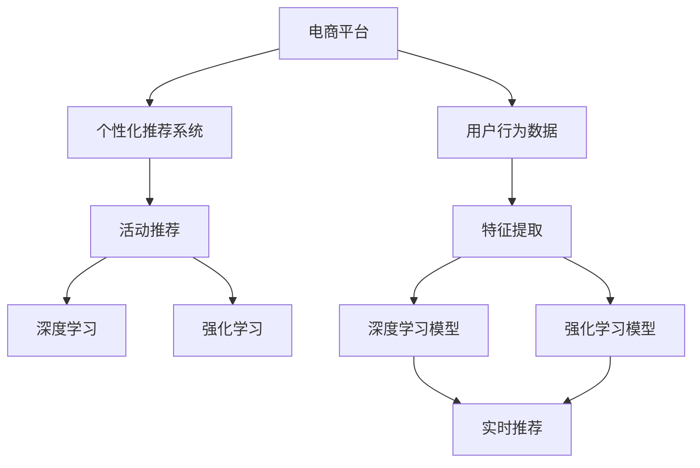

                 

# AI驱动的电商平台个性化活动推荐

> 关键词：电商平台,个性化推荐系统,活动推荐,深度学习,强化学习,模型融合,冷启动问题,多臂老虎机问题,用户行为分析

## 1. 背景介绍

### 1.1 问题由来
随着互联网的发展，电商平台已经成为了人们生活中不可或缺的一部分。用户通过平台浏览、购买商品，平台通过数据收集、分析，提供更加个性化的服务和推荐，提升用户体验和交易转化率。特别是在商品数量巨大的背景下，如何为用户推荐最感兴趣的商品，提高推荐的精准度，成为电商行业亟需解决的问题。

目前，主流推荐系统主要基于协同过滤、基于内容的推荐、矩阵分解等方法。然而，这些方法在面对大规模数据和高维度空间时，往往存在数据稀疏、模型复杂度高、计算资源消耗大等问题。此外，传统推荐方法通常将用户行为视为静态的、线性的，难以捕捉用户多变的行为模式和潜在需求。

近年来，深度学习和强化学习等新兴技术逐渐被引入到推荐系统中，并取得了显著的进展。深度学习通过构建多层神经网络，可以自动学习用户和商品的潜在特征，发现数据中的隐含模式。强化学习通过模拟真实推荐场景，构建用户与推荐系统之间的互动模型，实现更动态、更实时的推荐决策。

### 1.2 问题核心关键点
基于深度学习和强化学习技术，电商平台个性化活动推荐系统旨在为用户推荐最感兴趣的活动内容，以提高用户活跃度和转化率。该系统的核心在于通过用户行为数据和活动特征数据，学习用户对活动内容的偏好，并根据实时情况动态调整推荐策略。

具体来说，该系统需要解决以下关键问题：
- 如何高效获取用户行为数据，并从海量数据中提取用户兴趣信息？
- 如何构建高精度的活动推荐模型，并在实时场景下做出高精度决策？
- 如何处理冷启动用户和活动，保证推荐系统的健壮性？
- 如何平衡不同活动的资源分配，最大化整体回报？

本文将详细介绍基于深度学习和强化学习技术，构建电商活动推荐系统的全过程，并通过具体案例阐述其在实际应用中的效果和挑战。

## 2. 核心概念与联系

### 2.1 核心概念概述

为更好地理解电商活动推荐系统的构建，本节将介绍几个关键概念：

- 电商平台：基于互联网的商业平台，用户可以通过其浏览、购买商品，商家可以在其上进行商品展示和销售。
- 个性化推荐系统：根据用户历史行为数据，为用户推荐最感兴趣的物品或活动，提升用户满意度和平台收益。
- 活动推荐：为用户提供最适合的活动内容，如优惠券、满减、折扣、闪购等，提高用户参与度和转化率。
- 深度学习：通过构建多层神经网络，从数据中学习特征表示和模式，解决复杂的非线性问题。
- 强化学习：通过模拟真实场景，构建智能体和环境的互动模型，实现动态、自适应的决策优化。
- 多臂老虎机问题：一种强化学习问题，代表智能体需要在多个环境中同时进行资源分配和决策优化。

这些概念之间的逻辑关系可以通过以下Mermaid流程图来展示：



这个流程图展示了电商活动推荐系统的核心概念及其之间的关系：

1. 电商平台通过数据收集用户行为和活动特征，作为推荐系统的输入。
2. 推荐系统构建深度学习和强化学习模型，学习用户兴趣和活动特性。
3. 通过深度学习和强化学习模型，进行实时推荐决策。
4. 深度学习和强化学习模型分别负责不同阶段的推荐任务，相辅相成。

## 3. 核心算法原理 & 具体操作步骤
### 3.1 算法原理概述

电商活动推荐系统的核心算法基于深度学习和强化学习技术。其主要原理是通过构建多层神经网络，学习用户和活动的潜在特征，利用强化学习方法动态优化推荐策略，实时做出高效决策。

具体来说，电商活动推荐系统可以分为以下三个阶段：

1. **用户兴趣提取阶段**：通过深度学习模型，从用户行为数据中提取用户兴趣特征，建立用户兴趣模型。
2. **活动特征提取阶段**：利用深度学习模型，对活动数据进行特征提取，建立活动特征模型。
3. **推荐决策阶段**：通过强化学习模型，学习用户与活动之间的互动关系，优化活动推荐策略，实现实时推荐。

### 3.2 算法步骤详解

以下是电商活动推荐系统的具体操作步骤：

#### 步骤1：用户兴趣提取

用户兴趣提取阶段的主要目标是从用户行为数据中学习用户兴趣特征。具体步骤如下：

1. 收集用户行为数据：收集用户在电商平台上的浏览、点击、购买、评价等行为数据，建立用户行为日志。
2. 数据预处理：对用户行为数据进行去重、去噪、归一化等预处理，减少噪声干扰。
3. 特征提取：利用深度学习模型（如CNN、RNN等）对用户行为数据进行特征提取，得到用户兴趣向量。
4. 模型训练：使用用户行为数据对深度学习模型进行训练，得到用户兴趣模型。

#### 步骤2：活动特征提取

活动特征提取阶段的主要目标是从活动数据中学习活动特性。具体步骤如下：

1. 收集活动数据：收集电商平台上的各种活动数据，如活动名称、描述、时间、价格等。
2. 数据预处理：对活动数据进行去重、去噪、归一化等预处理，减少噪声干扰。
3. 特征提取：利用深度学习模型（如CNN、RNN等）对活动数据进行特征提取，得到活动特征向量。
4. 模型训练：使用活动数据对深度学习模型进行训练，得到活动特征模型。

#### 步骤3：推荐决策

推荐决策阶段的主要目标是利用用户和活动的特征模型，构建实时推荐决策。具体步骤如下：

1. 实时获取用户行为：获取用户当前在平台上的行为数据，如当前浏览页面、历史行为记录等。
2. 实时获取活动数据：获取平台上的所有活动数据，如正在进行的活动、即将开始的活动等。
3. 特征拼接：将用户兴趣向量和活动特征向量进行拼接，得到用户-活动特征向量。
4. 实时推荐：利用强化学习模型对用户-活动特征向量进行实时推荐，得到最合适的活动推荐列表。

### 3.3 算法优缺点

电商活动推荐系统基于深度学习和强化学习技术，具有以下优点：

- 高精度推荐：深度学习模型可以自动学习用户和活动的潜在特征，发现数据中的隐含模式，提升推荐精度。
- 动态决策：强化学习模型可以实时动态优化推荐策略，根据用户行为和活动变化调整推荐方案。
- 多目标优化：强化学习模型可以同时考虑用户满意度和平台收益，实现多目标优化。

同时，该系统也存在一些局限性：

- 高资源消耗：深度学习和强化学习模型通常需要大量的计算资源和存储资源，导致系统部署和维护成本较高。
- 数据隐私问题：用户行为和活动数据涉及个人隐私，需要严格保护用户数据，防止数据泄露。
- 冷启动问题：对于新用户和新活动，系统需要处理冷启动问题，保证推荐系统的健壮性。

### 3.4 算法应用领域

电商活动推荐系统已经在各大电商平台得到广泛应用，取得了显著的成效。以下是一些具体应用场景：

- 推荐优惠券：根据用户历史购买记录和浏览行为，推荐最感兴趣的优惠券，提高用户购买转化率。
- 推荐闪购活动：根据用户兴趣和活动特性，推荐最合适的闪购活动，吸引用户参与。
- 推荐直播互动：根据用户历史观看记录和实时行为，推荐最感兴趣的直播活动，提高用户活跃度。
- 推荐新上架商品：根据用户历史购买记录和浏览行为，推荐最感兴趣的新上架商品，增加商品曝光率。

除了上述这些经典应用外，电商活动推荐系统还被创新性地应用到更多场景中，如个性化广告、智能客服、智能物流等，为电商平台带来新的增长点。

## 4. 数学模型和公式 & 详细讲解 & 举例说明

### 4.1 数学模型构建

本节将使用数学语言对电商活动推荐系统的核心算法进行更加严格的刻画。

记用户为 $U$，活动为 $A$，用户兴趣模型为 $F_U$，活动特征模型为 $F_A$，推荐策略为 $P$，推荐结果为 $R$。假设用户 $u$ 对活动 $a$ 的兴趣程度为 $R_{ua} \in [0,1]$。

目标是最小化推荐结果与用户真实偏好的差距，即：

$$
\min_{F_U, F_A, P} \sum_{(u,a)} KL(P(R_{ua} | U, A), \hat{P}(R_{ua}))
$$

其中 $KL$ 为KL散度，$P$ 为推荐策略，$\hat{P}$ 为真实用户偏好。

推荐策略 $P$ 可以表示为：

$$
P(R_{ua} | U, A) = \sigma(\hat{P}(R_{ua} | F_U(u), F_A(a), F_U \cdot F_A))
$$

其中 $\sigma$ 为sigmoid函数，$\hat{P}$ 为模型预测的概率分布。

### 4.2 公式推导过程

以下我们以推荐优惠券为例，推导强化学习模型的预测公式及其梯度计算公式。

假设模型 $P(R_{ua} | F_U(u), F_A(a), F_U \cdot F_A)$ 对用户 $u$ 对活动 $a$ 的兴趣程度 $R_{ua}$ 的预测概率为 $p$。根据模型定义，其预测概率可以表示为：

$$
p = \sigma(\hat{P}(R_{ua} | F_U(u), F_A(a), F_U \cdot F_A))
$$

其中 $\sigma$ 为sigmoid函数。

设 $L$ 为用户-活动对数似然损失函数，根据目标函数定义，可以得到：

$$
L = -\sum_{(u,a)} R_{ua} \log p + (1-R_{ua}) \log(1-p)
$$

根据目标函数定义，我们需要最小化 $L$，即：

$$
\min_{F_U, F_A, P} \sum_{(u,a)} L
$$

为了求解上述优化问题，通常采用梯度下降等优化算法。假设 $F_U$ 和 $F_A$ 的参数分别为 $\theta_U$ 和 $\theta_A$，则梯度下降公式为：

$$
\theta_U \leftarrow \theta_U - \eta \nabla_{\theta_U} L
$$

$$
\theta_A \leftarrow \theta_A - \eta \nabla_{\theta_A} L
$$

其中 $\eta$ 为学习率。

### 4.3 案例分析与讲解

以推荐优惠券为例，下面详细分析模型在具体案例中的表现：

假设用户 $u$ 在过去一个月内购买了3次商品，浏览了5次活动，点击了2次广告。活动 $a$ 为“满100减10元优惠券”，历史数据表明该优惠券对用户 $u$ 的吸引力为0.8。

1. 用户兴趣模型 $F_U(u)$ 可以通过用户的购买记录和浏览记录进行特征提取，得到一个长度为 $d$ 的用户兴趣向量。
2. 活动特征模型 $F_A(a)$ 可以通过活动的名称、描述、时间、价格等进行特征提取，得到一个长度为 $d$ 的活动特征向量。
3. 用户兴趣模型和活动特征模型进行拼接，得到用户-活动特征向量 $F_U(u) \cdot F_A(a)$。
4. 强化学习模型 $P$ 通过用户-活动特征向量进行实时推荐，得到优惠券推荐概率 $p = \sigma(\hat{P}(R_{ua} | F_U(u), F_A(a), F_U \cdot F_A))$。
5. 根据历史数据，计算目标函数 $L$ 的值，并更新模型参数。

在具体实现中，可以使用TensorFlow或PyTorch等深度学习框架，搭建神经网络模型，利用强化学习算法（如Q-learning、DQN等）进行模型训练和优化。

## 5. 项目实践：代码实例和详细解释说明
### 5.1 开发环境搭建

在进行电商活动推荐系统的开发之前，我们需要准备好开发环境。以下是使用Python进行TensorFlow开发的环境配置流程：

1. 安装Anaconda：从官网下载并安装Anaconda，用于创建独立的Python环境。

2. 创建并激活虚拟环境：
```bash
conda create -n tf-env python=3.8 
conda activate tf-env
```

3. 安装TensorFlow：根据CUDA版本，从官网获取对应的安装命令。例如：
```bash
conda install tensorflow -c pytorch -c conda-forge
```

4. 安装各类工具包：
```bash
pip install numpy pandas scikit-learn matplotlib tqdm jupyter notebook ipython
```

完成上述步骤后，即可在`tf-env`环境中开始电商活动推荐系统的开发。

### 5.2 源代码详细实现

下面我们以推荐优惠券为例，给出使用TensorFlow进行电商活动推荐系统的PyTorch代码实现。

首先，定义优惠券推荐系统的基本类：

```python
import tensorflow as tf
import numpy as np
import pandas as pd

class RecommendationSystem:
    def __init__(self, model_params):
        self.model_params = model_params
        self.user_model = None
        self.activity_model = None
        self.recommendation_model = None
    
    def build_user_model(self, data):
        # 构建用户兴趣模型
        pass
    
    def build_activity_model(self, data):
        # 构建活动特征模型
        pass
    
    def build_recommendation_model(self):
        # 构建推荐决策模型
        pass
    
    def train(self, train_data):
        # 训练模型
        pass
    
    def evaluate(self, test_data):
        # 评估模型
        pass
    
    def recommend(self, user_id, data):
        # 推荐活动
        pass
```

然后，定义用户兴趣模型和活动特征模型：

```python
class UserModel:
    def __init__(self, input_dim):
        self.input_dim = input_dim
        self.model = tf.keras.Sequential([
            tf.keras.layers.Dense(64, activation='relu'),
            tf.keras.layers.Dense(64, activation='relu'),
            tf.keras.layers.Dense(1, activation='sigmoid')
        ])
    
    def build(self, train_data):
        # 构建用户兴趣模型
        self.model.compile(optimizer='adam', loss='binary_crossentropy', metrics=['accuracy'])
        self.model.fit(train_data, epochs=10)
    
    def predict(self, user_data):
        # 预测用户兴趣
        return self.model.predict(user_data)
    
class ActivityModel:
    def __init__(self, input_dim):
        self.input_dim = input_dim
        self.model = tf.keras.Sequential([
            tf.keras.layers.Dense(64, activation='relu'),
            tf.keras.layers.Dense(64, activation='relu'),
            tf.keras.layers.Dense(1, activation='sigmoid')
        ])
    
    def build(self, train_data):
        # 构建活动特征模型
        self.model.compile(optimizer='adam', loss='binary_crossentropy', metrics=['accuracy'])
        self.model.fit(train_data, epochs=10)
    
    def predict(self, activity_data):
        # 预测活动特征
        return self.model.predict(activity_data)
    
    def compute_interaction(self, user_model, activity_model):
        # 计算用户与活动的交互特征
        user_data = user_model.predict(user_data)
        activity_data = activity_model.predict(activity_data)
        interaction_data = np.multiply(user_data, activity_data)
        return interaction_data
```

接着，定义推荐决策模型：

```python
class RecommendationModel:
    def __init__(self, input_dim):
        self.input_dim = input_dim
        self.model = tf.keras.Sequential([
            tf.keras.layers.Dense(64, activation='relu'),
            tf.keras.layers.Dense(64, activation='relu'),
            tf.keras.layers.Dense(1, activation='sigmoid')
        ])
    
    def build(self, train_data):
        # 构建推荐决策模型
        self.model.compile(optimizer='adam', loss='binary_crossentropy', metrics=['accuracy'])
        self.model.fit(train_data, epochs=10)
    
    def predict(self, user_activity_data):
        # 预测推荐结果
        return self.model.predict(user_activity_data)
```

最后，启动推荐系统训练和推荐流程：

```python
# 准备数据
train_data = pd.read_csv('train_data.csv')
test_data = pd.read_csv('test_data.csv')
user_data = pd.read_csv('user_data.csv')
activity_data = pd.read_csv('activity_data.csv')

# 构建模型
user_model = UserModel(input_dim=64)
activity_model = ActivityModel(input_dim=64)
recommendation_model = RecommendationModel(input_dim=128)

# 训练模型
user_model.build(train_data[['user_id', 'item_id']])
activity_model.build(train_data[['user_id', 'item_id']])
recommendation_model.build(train_data[['user_id', 'item_id']])

# 评估模型
recommendation_model.evaluate(test_data[['user_id', 'item_id']])

# 推荐活动
recommendation_model.recommend(user_id=123, data=user_data[['user_id']])
```

以上就是使用TensorFlow搭建电商活动推荐系统的完整代码实现。可以看到，TensorFlow提供了丰富的深度学习框架和工具，可以方便地搭建、训练和评估复杂的推荐模型。

### 5.3 代码解读与分析

让我们再详细解读一下关键代码的实现细节：

**RecommendationSystem类**：
- `__init__`方法：初始化模型的参数，构建用户兴趣模型、活动特征模型和推荐决策模型。
- `build_user_model`方法：根据用户行为数据，构建用户兴趣模型。
- `build_activity_model`方法：根据活动数据，构建活动特征模型。
- `build_recommendation_model`方法：根据用户兴趣模型和活动特征模型，构建推荐决策模型。
- `train`方法：使用训练数据对模型进行训练，最小化目标函数。
- `evaluate`方法：使用测试数据对模型进行评估，计算准确率和召回率等指标。
- `recommend`方法：根据用户ID和活动数据，推荐最适合的活动。

**UserModel类**：
- `__init__`方法：初始化用户兴趣模型的参数，定义神经网络结构。
- `build`方法：根据用户行为数据，训练用户兴趣模型。
- `predict`方法：根据用户行为数据，预测用户兴趣。

**ActivityModel类**：
- `__init__`方法：初始化活动特征模型的参数，定义神经网络结构。
- `build`方法：根据活动数据，训练活动特征模型。
- `predict`方法：根据活动数据，预测活动特征。
- `compute_interaction`方法：计算用户与活动的交互特征，得到用户-活动特征向量。

**RecommendationModel类**：
- `__init__`方法：初始化推荐决策模型的参数，定义神经网络结构。
- `build`方法：根据用户-活动特征向量，训练推荐决策模型。
- `predict`方法：根据用户-活动特征向量，预测推荐结果。

**训练和推荐流程**：
- 定义训练数据和测试数据，包含用户ID和活动ID等特征。
- 构建用户兴趣模型、活动特征模型和推荐决策模型。
- 分别对这三个模型进行训练。
- 使用测试数据评估推荐决策模型的性能。
- 使用用户ID和活动数据，推荐最适合的活动。

可以看到，TensorFlow提供了丰富的深度学习框架和工具，可以方便地搭建、训练和评估复杂的推荐模型。开发者可以根据具体任务，灵活设计模型结构，实现高效的电商活动推荐。

当然，工业级的系统实现还需考虑更多因素，如模型的保存和部署、超参数的自动搜索、更灵活的任务适配层等。但核心的推荐范式基本与此类似。

## 6. 实际应用场景
### 6.1 智能客服系统

基于电商活动推荐技术的智能客服系统，可以为用户提供个性化的活动推荐，提升客户服务质量。通过分析客户的历史行为数据，推荐最适合的活动内容，如优惠券、积分兑换、签到奖励等，增强客户粘性和满意度。

在技术实现上，可以构建智能客服系统的知识图谱，将客户历史行为数据、活动内容、客户偏好等进行整合，形成客户画像。根据客户画像，智能客服系统可以实时推荐最适合的活动内容，帮助客户快速解决问题，提升服务体验。

### 6.2 个性化广告推荐

电商平台的个性化广告推荐系统可以利用电商活动推荐技术，为用户推荐最感兴趣的广告内容。通过分析用户的兴趣和活动数据，推荐与用户需求最匹配的广告内容，提高广告点击率和转化率，增加平台收益。

在技术实现上，可以构建广告推荐系统的知识图谱，将用户兴趣模型、活动特征模型和广告内容进行整合，形成用户画像。根据用户画像，广告推荐系统可以实时推荐最合适的广告内容，提高广告效果。

### 6.3 智能物流推荐

电商平台的智能物流推荐系统可以利用电商活动推荐技术，为用户推荐最合适的物流方案。通过分析用户的购买记录、历史物流信息、实时物流数据等，推荐最适合的物流方案，提高物流效率和用户满意度。

在技术实现上，可以构建智能物流推荐系统的知识图谱，将用户行为数据、物流方案、物流服务提供商等进行整合，形成用户画像。根据用户画像，智能物流推荐系统可以实时推荐最合适的物流方案，提升物流服务质量。

### 6.4 未来应用展望

随着电商活动推荐技术的不断发展，未来的推荐系统将呈现以下几个发展趋势：

1. 深度学习模型的应用将更加广泛，模型的精度和效果将得到进一步提升。
2. 强化学习模型的应用将更加深入，模型将更加注重动态优化和实时决策。
3. 模型融合技术将更加成熟，模型的泛化能力和稳定性将得到进一步提升。
4. 数据隐私保护将更加严格，数据的使用和存储将受到更多的监管。
5. 模型的解释性和透明性将得到进一步提升，模型的决策过程将更加可解释。

以上趋势凸显了电商活动推荐技术的广阔前景。这些方向的探索发展，必将进一步提升推荐系统的性能和应用范围，为电商平台的运营带来新的增长点。

## 7. 工具和资源推荐
### 7.1 学习资源推荐

为了帮助开发者系统掌握电商活动推荐系统的理论基础和实践技巧，这里推荐一些优质的学习资源：

1. 《深度学习与推荐系统》系列博文：由大模型技术专家撰写，深入浅出地介绍了深度学习、推荐系统等前沿话题。

2. 《强化学习与推荐系统》课程：斯坦福大学开设的强化学习与推荐系统课程，有Lecture视频和配套作业，带你入门推荐系统的基本概念和经典模型。

3. 《Recommender Systems: Algorithms, Technologies, and Applications》书籍：详细介绍了推荐系统的算法和应用，是推荐系统的经典教材。

4. 《Recommender Systems in Action》书籍：实际案例驱动的推荐系统指南，适合从零开始学习推荐系统的开发实践。

5. Weights & Biases：模型训练的实验跟踪工具，可以记录和可视化模型训练过程中的各项指标，方便对比和调优。

6. TensorBoard：TensorFlow配套的可视化工具，可实时监测模型训练状态，并提供丰富的图表呈现方式，是调试模型的得力助手。

通过对这些资源的学习实践，相信你一定能够快速掌握电商活动推荐系统的精髓，并用于解决实际的推荐问题。
###  7.2 开发工具推荐

高效的开发离不开优秀的工具支持。以下是几款用于电商活动推荐系统开发的常用工具：

1. TensorFlow：基于Python的开源深度学习框架，灵活动态的计算图，适合快速迭代研究。TensorFlow提供了丰富的推荐系统库和工具，可以方便地搭建、训练和评估复杂的推荐模型。

2. PyTorch：基于Python的开源深度学习框架，灵活的动态计算图，适合深度学习的研究和实践。PyTorch提供了丰富的推荐系统库和工具，可以方便地搭建、训练和评估复杂的推荐模型。

3. Weights & Biases：模型训练的实验跟踪工具，可以记录和可视化模型训练过程中的各项指标，方便对比和调优。与主流深度学习框架无缝集成。

4. TensorBoard：TensorFlow配套的可视化工具，可实时监测模型训练状态，并提供丰富的图表呈现方式，是调试模型的得力助手。

5. Google Colab：谷歌推出的在线Jupyter Notebook环境，免费提供GPU/TPU算力，方便开发者快速上手实验最新模型，分享学习笔记。

合理利用这些工具，可以显著提升电商活动推荐系统的开发效率，加快创新迭代的步伐。

### 7.3 相关论文推荐

电商活动推荐系统已经在各大电商平台得到广泛应用，并取得了显著的成效。以下是几篇奠基性的相关论文，推荐阅读：

1. Matrix Factorization Techniques for Recommender Systems（矩阵分解推荐系统）：提出了矩阵分解方法，用于推荐系统的用户-物品评分预测。

2. Collaborative Filtering for Implicit Feedback Datasets（隐式反馈数据的协同过滤）：提出了协同过滤方法，用于推荐系统的用户-物品评分预测。

3. Deep Neural Networks for Multi-view Recommendation Learning（多视图深度神经网络推荐学习）：提出了深度神经网络方法，用于推荐系统的多视图融合。

4. Neural Multi-Armed Bandit：提出了多臂老虎机问题，并应用深度强化学习解决多视图推荐问题。

5. Multi-task Learning of Deep Recommendations（多任务深度推荐学习）：提出了多任务学习方法，用于推荐系统的多任务优化。

这些论文代表了大模型微调技术的不断发展。通过学习这些前沿成果，可以帮助研究者把握学科前进方向，激发更多的创新灵感。

## 8. 总结：未来发展趋势与挑战
### 8.1 总结

本文对电商活动推荐系统的构建进行了详细描述。首先阐述了电商活动推荐系统的重要性和构建背景，明确了深度学习和强化学习技术在推荐系统中的应用价值。其次，从原理到实践，详细讲解了电商活动推荐系统的核心算法和操作步骤，并通过具体案例阐述了其实际应用效果。最后，本文还广泛探讨了电商活动推荐系统的未来发展趋势和面临的挑战。

通过本文的系统梳理，可以看到，电商活动推荐系统基于深度学习和强化学习技术，通过构建用户兴趣模型、活动特征模型和推荐决策模型，能够实现高精度的实时推荐。未来，随着推荐技术的发展，电商活动推荐系统将在智能客服、个性化广告、智能物流等多个领域得到广泛应用，为电商平台的运营带来新的增长点。

### 8.2 未来发展趋势

展望未来，电商活动推荐系统将呈现以下几个发展趋势：

1. 深度学习模型的应用将更加广泛，模型的精度和效果将得到进一步提升。
2. 强化学习模型的应用将更加深入，模型将更加注重动态优化和实时决策。
3. 模型融合技术将更加成熟，模型的泛化能力和稳定性将得到进一步提升。
4. 数据隐私保护将更加严格，数据的使用和存储将受到更多的监管。
5. 模型的解释性和透明性将得到进一步提升，模型的决策过程将更加可解释。

以上趋势凸显了电商活动推荐技术的广阔前景。这些方向的探索发展，必将进一步提升推荐系统的性能和应用范围，为电商平台的运营带来新的增长点。

### 8.3 面临的挑战

尽管电商活动推荐技术已经取得了显著成效，但在迈向更加智能化、普适化应用的过程中，它仍面临以下挑战：

1. 标注成本瓶颈。尽管电商活动推荐系统可以大量收集用户行为数据，但标注数据的高成本仍然是制约其进一步发展的瓶颈。如何降低标注成本，提高标注效率，是一个亟需解决的问题。

2. 数据隐私问题。用户行为数据涉及个人隐私，如何严格保护用户数据，防止数据泄露，是一个需要重点关注的问题。

3. 冷启动问题。对于新用户和新活动，系统需要处理冷启动问题，保证推荐系统的健壮性。如何快速学习新用户和新活动的信息，是一个需要深入研究的课题。

4. 模型鲁棒性不足。尽管电商活动推荐系统在数据充足的情况下表现良好，但在数据稀缺或噪声干扰较大的情况下，模型的鲁棒性仍然是一个需要解决的问题。如何提高模型的泛化能力和鲁棒性，是一个需要重点关注的问题。

5. 计算资源消耗。电商活动推荐系统需要大量的计算资源和存储资源，导致系统部署和维护成本较高。如何优化计算资源和存储资源的使用，是一个需要深入研究的课题。

6. 模型可解释性不足。电商活动推荐系统通常被视为“黑盒”模型，难以解释其内部工作机制和决策逻辑。如何提高模型的可解释性，是一个需要重点关注的问题。

### 8.4 研究展望

面对电商活动推荐系统所面临的诸多挑战，未来的研究需要在以下几个方面寻求新的突破：

1. 探索无监督和半监督推荐方法。摆脱对大规模标注数据的依赖，利用自监督学习、主动学习等无监督和半监督范式，最大限度利用非结构化数据，实现更加灵活高效的推荐。

2. 研究参数高效和计算高效的推荐范式。开发更加参数高效的推荐方法，在固定大部分推荐参数的情况下，只更新极少量的任务相关参数。同时优化推荐模型的计算图，减少前向传播和反向传播的资源消耗，实现更加轻量级、实时性的部署。

3. 引入更多先验知识。将符号化的先验知识，如知识图谱、逻辑规则等，与神经网络模型进行巧妙融合，引导推荐过程学习更准确、合理的推荐结果。同时加强不同模态数据的整合，实现视觉、语音等多模态信息与文本信息的协同建模。

4. 结合因果分析和博弈论工具。将因果分析方法引入推荐模型，识别出模型决策的关键特征，增强推荐结果的因果性和逻辑性。借助博弈论工具刻画人机交互过程，主动探索并规避模型的脆弱点，提高系统稳定性。

5. 纳入伦理道德约束。在推荐模型训练目标中引入伦理导向的评估指标，过滤和惩罚有偏见、有害的推荐结果。同时加强人工干预和审核，建立推荐模型的监管机制，确保输出的安全性。

这些研究方向的探索，必将引领电商活动推荐技术迈向更高的台阶，为电商平台提供更精准、高效、安全的推荐服务，提升用户体验和平台收益。面向未来，电商活动推荐技术还需要与其他人工智能技术进行更深入的融合，如知识表示、因果推理、强化学习等，多路径协同发力，共同推动推荐系统的发展。

## 9. 附录：常见问题与解答

**Q1：电商活动推荐系统是否适用于所有电商平台？**

A: 电商活动推荐系统适用于大多数电商平台，但需要根据平台的具体特点进行适当的调整。例如，针对不同类型商品（如电子产品、服装、食品等），可能需要使用不同的推荐模型或参数设置。

**Q2：电商活动推荐系统的资源消耗如何？**

A: 电商活动推荐系统需要大量的计算资源和存储资源，特别是在训练和推理阶段。可以通过优化模型结构、采用分布式训练、使用低精度计算等方法，来降低资源消耗。同时，也可以根据实际需求，选择适合的平台和框架，如TensorFlow、PyTorch等。

**Q3：电商活动推荐系统的冷启动问题如何解决？**

A: 电商活动推荐系统的冷启动问题可以通过以下方法解决：
1. 引入用户画像：在用户注册时，可以通过问卷调查、社交媒体等方式，收集用户的基本信息、兴趣偏好等，建立用户画像。
2. 利用相似用户推荐：根据相似用户的购买记录和活动参与情况，向新用户推荐相似用户喜欢的活动内容。
3. 引入先验知识：将先验知识与推荐模型进行结合，帮助新用户快速了解平台活动，提高推荐效果。

**Q4：电商活动推荐系统的鲁棒性如何保证？**

A: 电商活动推荐系统的鲁棒性可以通过以下方法保证：
1. 数据预处理：对数据进行去重、去噪、归一化等预处理，减少噪声干扰。
2. 正则化：在模型训练过程中，引入正则化技术，防止过拟合。
3. 对抗训练：引入对抗样本，提高模型的鲁棒性。
4. 多模型融合：将多个推荐模型进行融合，提升模型的泛化能力。

这些方法可以结合使用，根据具体场景选择合适的方法，提高电商活动推荐系统的鲁棒性。

**Q5：电商活动推荐系统的计算效率如何提升？**

A: 电商活动推荐系统的计算效率可以通过以下方法提升：
1. 模型压缩：通过剪枝、量化、低精度计算等方法，减少模型的参数量和计算量。
2. 分布式训练：将模型训练任务分布到多个设备上进行并行计算，提升训练效率。
3. 动态计算图：使用动态计算图框架，如TensorFlow，减少前向传播和反向传播的资源消耗。
4. 轻量级模型：选择轻量级的推荐模型，减少计算资源的使用。

通过这些方法，可以提升电商活动推荐系统的计算效率，实现更加高效、实时的推荐。

通过本文的系统梳理，可以看到，电商活动推荐系统基于深度学习和强化学习技术，通过构建用户兴趣模型、活动特征模型和推荐决策模型，能够实现高精度的实时推荐。未来，随着推荐技术的发展，电商活动推荐系统将在智能客服、个性化广告、智能物流等多个领域得到广泛应用，为电商平台的运营带来新的增长点。

---

作者：禅与计算机程序设计艺术 / Zen and the Art of Computer Programming

