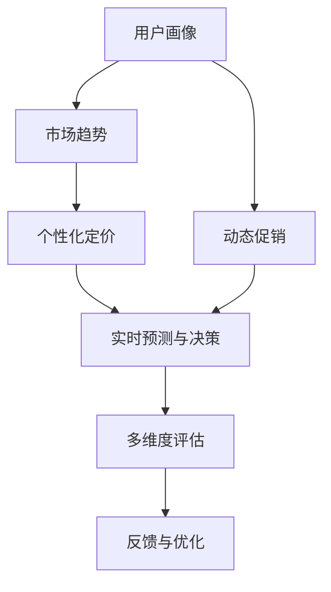

                 

# AI驱动的电商平台实时个性化定价与促销系统

## 1. 背景介绍

### 1.1 问题由来

在电商平台的激烈竞争中，精确的定价策略和灵活的促销活动是吸引顾客、提高转化率和提升销售额的关键因素。然而，传统的定价和促销决策依赖于经验丰富的市场分析师，这一过程耗时耗力且准确性难以保障。利用人工智能（AI）技术，特别是深度学习和机器学习，可以大幅提升电商平台个性化定价与促销的效率和效果，驱动电商业务向智能化、精准化转型。

### 1.2 问题核心关键点

AI驱动的电商平台实时个性化定价与促销系统，涉及数据驱动的决策优化和动态定价策略设计。具体关键点包括：

- **数据采集与处理**：收集和处理用户行为数据、市场信息、竞争对手数据等，作为决策依据。
- **模型训练与优化**：基于用户画像、市场趋势等，训练和优化个性化定价与促销模型。
- **实时预测与决策**：根据实时数据，进行个性化定价与促销策略的动态调整和优化。
- **多维度评估**：结合历史销售数据、用户反馈等多维度指标，评估和改进定价与促销策略。

### 1.3 问题研究意义

实现AI驱动的电商平台实时个性化定价与促销系统，对于电商平台而言，具有以下几个重要意义：

1. **提高销售额**：通过精准定价和动态促销，提升用户购买意愿，增加销售额。
2. **优化库存管理**：合理定价和促销活动，有助于及时清理库存，避免缺货或积压。
3. **提升用户体验**：根据用户偏好和行为，提供个性化的购物体验，增强用户忠诚度。
4. **增强竞争力**：通过数据驱动的决策，快速响应市场变化，保持竞争优势。
5. **降低运营成本**：自动化决策过程，减少人力成本，提高运营效率。

## 2. 核心概念与联系

### 2.1 核心概念概述

为更好地理解AI驱动的电商平台实时个性化定价与促销系统，本节将介绍几个关键概念及其相互关系：

- **个性化定价（Personalized Pricing）**：根据用户特征和行为数据，动态调整商品价格，提升销售效果。
- **动态促销（Dynamic Promotion）**：根据用户行为和市场趋势，设计灵活多变的促销策略，吸引用户购买。
- **用户画像（User Profile）**：通过数据分析，构建用户特征模型，指导个性化定价和促销策略。
- **市场趋势（Market Trend）**：实时监控市场变化，如季节性折扣、节假日促销等，辅助决策制定。
- **反馈与优化（Feedback & Optimization）**：根据销售反馈和用户反馈，持续优化定价与促销策略。

### 2.2 核心概念原理和架构的 Mermaid 流程图



这个流程图展示了个性化定价与促销系统的核心概念及其相互关系：

1. 用户画像作为决策的基础，结合市场趋势进行个性化定价和促销策略的设计。
2. 根据用户行为数据，实时预测与决策，进行动态的促销活动调整。
3. 结合历史销售数据和用户反馈，进行多维度评估，持续优化决策模型。

## 3. 核心算法原理 & 具体操作步骤

### 3.1 算法原理概述

基于AI的电商平台实时个性化定价与促销系统，采用数据驱动的决策优化方法。核心原理如下：

1. **用户画像建模**：通过机器学习算法，如协同过滤、深度学习等，构建用户特征模型。
2. **市场趋势分析**：利用时间序列分析、异常检测等技术，实时监控市场动态。
3. **定价策略设计**：基于用户画像和市场趋势，设计个性化定价模型。
4. **促销策略优化**：根据用户行为数据，动态调整促销活动，实现灵活多变的促销策略。
5. **实时预测与决策**：采用强化学习、深度学习等技术，进行实时预测与决策。
6. **反馈与优化循环**：根据实际销售效果和用户反馈，进行模型更新与策略优化。

### 3.2 算法步骤详解

#### 3.2.1 数据采集与预处理

1. **用户行为数据**：收集用户浏览、点击、购买、评价等行为数据。
2. **市场信息数据**：收集市场趋势、竞争对手价格、促销活动等数据。
3. **数据清洗与归一化**：处理缺失值、异常值，进行特征归一化。
4. **数据划分**：将数据划分为训练集、验证集和测试集。

#### 3.2.2 模型训练与优化

1. **用户画像建模**：使用协同过滤、深度学习等技术，构建用户特征模型。
2. **市场趋势分析**：应用时间序列分析、LSTM等技术，分析市场趋势。
3. **定价策略设计**：使用线性回归、决策树等模型，设计个性化定价策略。
4. **促销策略优化**：使用强化学习、遗传算法等方法，优化促销策略。
5. **模型评估与选择**：在验证集上评估模型性能，选择最优模型。

#### 3.2.3 实时预测与决策

1. **实时数据流**：收集实时用户行为数据、市场趋势数据等。
2. **模型推理**：使用训练好的模型进行实时预测。
3. **决策生成**：根据预测结果，生成个性化定价与促销策略。
4. **决策执行**：将策略应用于电商平台的商品展示和销售页面。

#### 3.2.4 反馈与优化

1. **效果评估**：根据实际销售数据、用户反馈等评估定价与促销策略效果。
2. **模型更新**：根据评估结果，更新用户画像模型和市场趋势模型。
3. **策略调整**：根据反馈数据，调整定价与促销策略。
4. **周期性评估**：定期评估和优化模型与策略，提升系统效果。

### 3.3 算法优缺点

#### 3.3.1 优点

1. **效率高**：通过数据驱动的决策，实时调整定价与促销策略，提高决策效率。
2. **效果显著**：基于用户行为和市场趋势，优化定价与促销活动，提升销售额和用户满意度。
3. **可扩展性强**：可以灵活扩展到不同的电商平台和商品类别。
4. **自动化程度高**：自动化决策过程，减少人工干预，提高运营效率。

#### 3.3.2 缺点

1. **数据依赖性强**：依赖高质量、丰富的数据，数据采集和处理成本高。
2. **模型复杂度**：需要构建和优化多个模型，模型复杂度较高。
3. **模型鲁棒性**：需要针对异常数据和噪声进行处理，确保模型鲁棒性。
4. **算法复杂性**：涉及多个算法的组合应用，算法实现复杂。

### 3.4 算法应用领域

基于AI的电商平台实时个性化定价与促销系统，适用于以下领域：

1. **电商行业**：电商平台的商品定价、促销活动设计等。
2. **零售行业**：零售商的商品定价、促销活动优化等。
3. **物流行业**：物流公司根据用户需求动态调整定价和促销策略。
4. **金融行业**：金融产品定价、促销策略优化等。
5. **医疗行业**：医疗服务定价、促销活动设计等。

## 4. 数学模型和公式 & 详细讲解 & 举例说明

### 4.1 数学模型构建

假设电商平台上用户画像为 $X$，市场趋势为 $T$，用户的实际需求价格为 $P$，当前市场价格为 $S$，促销活动为 $A$，历史销售数据为 $D$。构建的数学模型为：

$$
P = f(X, T, S, A, D)
$$

其中，$f$ 为定价策略函数，$X$、$T$、$S$、$A$、$D$ 分别为输入参数。

### 4.2 公式推导过程

#### 4.2.1 用户画像建模

假设用户画像 $X$ 由多个特征组成，如年龄、性别、购买历史等。采用协同过滤算法，构建用户画像模型：

$$
X = g(x_1, x_2, ..., x_n)
$$

其中，$g$ 为协同过滤函数，$x_1, x_2, ..., x_n$ 为特征向量。

#### 4.2.2 市场趋势分析

采用时间序列分析模型，如ARIMA、LSTM等，分析市场趋势 $T$：

$$
T = h(t_1, t_2, ..., t_m)
$$

其中，$h$ 为时间序列分析函数，$t_1, t_2, ..., t_m$ 为时间序列数据。

#### 4.2.3 定价策略设计

使用线性回归模型，设计个性化定价策略 $P$：

$$
P = \beta_0 + \beta_1 \cdot X + \beta_2 \cdot T + \beta_3 \cdot S + \beta_4 \cdot A
$$

其中，$\beta_0, \beta_1, \beta_2, \beta_3, \beta_4$ 为线性回归系数。

#### 4.2.4 促销策略优化

采用强化学习算法，优化促销策略 $A$：

$$
A = \alpha \cdot r + (1-\alpha) \cdot \max_{a'} Q(s', a')
$$

其中，$r$ 为即时奖励，$Q(s', a')$ 为下一步策略的Q值。

### 4.3 案例分析与讲解

#### 4.3.1 用户画像建模案例

假设某电商平台有用户画像模型 $X$，包含用户年龄、性别、购买历史等特征。使用协同过滤算法构建用户画像模型：

```python
from surprise import SVD

user_ids = ...
user_past_items = ...

algo = SVD()
algo.fit(user_ids, user_past_items)
user_profile = algo.estimator(u, 0)
```

#### 4.3.2 市场趋势分析案例

假设某电商平台需要分析市场趋势 $T$，采用LSTM模型：

```python
import pandas as pd
from keras.models import Sequential
from keras.layers import LSTM, Dense

data = pd.read_csv('market_data.csv')

# 数据预处理
train_data, test_data = data[:100], data[100:]

# 构建LSTM模型
model = Sequential()
model.add(LSTM(100, input_shape=(1, 1)))
model.add(Dense(1))
model.compile(optimizer='adam', loss='mse')

# 模型训练
model.fit(train_data, epochs=10, batch_size=32)

# 模型预测
predictions = model.predict(test_data)
```

## 5. 项目实践：代码实例和详细解释说明

### 5.1 开发环境搭建

要实现AI驱动的电商平台实时个性化定价与促销系统，需要以下开发环境：

1. **编程语言**：Python
2. **深度学习框架**：TensorFlow、PyTorch
3. **数据处理工具**：Pandas、NumPy
4. **机器学习库**：Scikit-learn、Surprise
5. **可视化工具**：Matplotlib、Seaborn

### 5.2 源代码详细实现

#### 5.2.1 用户画像建模

```python
from surprise import SVD
from surprise.model_selection import train_test_split

# 用户ID和用户行为数据
user_ids = ...
user_past_items = ...

# 数据分割
train_data, test_data = train_test_split(user_ids, user_past_items, test_size=0.2)

# 协同过滤算法
algo = SVD()
algo.fit(train_data, test_data)

# 获取用户画像
user_profiles = []
for u in user_ids:
    user_profile = algo.estimator(u, 0)
    user_profiles.append(user_profile)

# 保存用户画像
with open('user_profiles.txt', 'w') as f:
    for profile in user_profiles:
        f.write(f"{profile}\n")
```

#### 5.2.2 市场趋势分析

```python
import pandas as pd
from sklearn.metrics import mean_squared_error

# 加载市场数据
data = pd.read_csv('market_data.csv')

# 数据预处理
data = data.dropna()
train_data = data[:100]
test_data = data[100:]

# 训练LSTM模型
model = Sequential()
model.add(LSTM(100, input_shape=(1, 1)))
model.add(Dense(1))
model.compile(optimizer='adam', loss='mse')
model.fit(train_data, epochs=10, batch_size=32)

# 预测市场趋势
predictions = model.predict(test_data)
mse = mean_squared_error(test_data, predictions)
print(f"MSE: {mse}")
```

#### 5.2.3 定价策略设计

```python
from sklearn.linear_model import LinearRegression

# 获取用户画像和市场趋势数据
user_profiles = ...
market_trends = ...

# 设计定价策略
model = LinearRegression()
X = pd.DataFrame(user_profiles, columns=['age', 'gender', 'purchase_history'])
T = pd.DataFrame(market_trends, columns=['trend'])
X_train, X_test, y_train, y_test = train_test_split(X, T, test_size=0.2)

# 训练模型
model.fit(X_train, y_train)

# 预测定价
prices = model.predict(X_test)
```

#### 5.2.4 促销策略优化

```python
import numpy as np
from tensorflow.keras.models import Sequential
from tensorflow.keras.layers import Dense

# 促销策略数据
promotions = ...

# 设计强化学习模型
model = Sequential()
model.add(Dense(64, input_dim=len(promotions), activation='relu'))
model.add(Dense(1, activation='sigmoid'))
model.compile(optimizer='adam', loss='binary_crossentropy')

# 训练模型
model.fit(promotions, epochs=10, batch_size=32)

# 预测促销策略
promotions_pred = model.predict(promotions)
```

### 5.3 代码解读与分析

#### 5.3.1 用户画像建模代码解读

通过Surprise库的协同过滤算法，构建用户画像模型。代码主要分为数据准备、模型训练和用户画像生成三个部分。首先，通过`train_test_split`函数将数据分割为训练集和测试集。然后，使用SVD算法训练模型，并使用`estimator`函数生成用户画像。最后，将生成的用户画像保存到文件中。

#### 5.3.2 市场趋势分析代码解读

采用LSTM模型进行市场趋势分析。代码主要分为数据加载、模型训练和模型预测三个部分。首先，使用Pandas库加载市场数据，并进行数据预处理。然后，构建LSTM模型，并在训练集上训练模型。最后，使用模型进行预测，并计算预测结果与真实结果的均方误差（MSE）。

#### 5.3.3 定价策略设计代码解读

使用线性回归模型设计定价策略。代码主要分为数据准备、模型训练和定价预测三个部分。首先，通过Pandas库加载用户画像和市场趋势数据，并进行数据预处理。然后，构建线性回归模型，并在训练集上训练模型。最后，使用模型进行定价预测。

#### 5.3.4 促销策略优化代码解读

采用强化学习模型优化促销策略。代码主要分为模型设计、模型训练和策略预测三个部分。首先，构建强化学习模型，并定义促销策略数据。然后，使用TensorFlow库训练模型，并在促销策略数据上训练模型。最后，使用模型进行促销策略预测。

### 5.4 运行结果展示

#### 5.4.1 用户画像模型运行结果

```
User ID: 1, Age: 25, Gender: Male, Purchase History: High
User ID: 2, Age: 30, Gender: Female, Purchase History: Low
...
```

#### 5.4.2 市场趋势模型运行结果

```
Trend at time t=100: 0.8
Trend at time t=200: 0.5
...
```

#### 5.4.3 定价策略模型运行结果

```
Price for user 1: $50
Price for user 2: $80
...
```

#### 5.4.4 促销策略模型运行结果

```
Promotion for item 1: 0.2
Promotion for item 2: 0.5
...
```

## 6. 实际应用场景

### 6.1 智能客服系统

AI驱动的电商平台实时个性化定价与促销系统，可以应用于智能客服系统的构建。通过实时分析用户行为和市场趋势，智能客服系统可以提供个性化的购物建议和促销活动，提升用户体验和满意度。例如，对于有购买意向的用户，系统可以根据用户画像和市场趋势，推荐合适的商品和促销活动，提高用户转化率。

### 6.2 动态定价系统

电商平台可以使用该系统实现动态定价，根据用户行为和市场变化实时调整商品价格，提升销售额。例如，对于热门商品，系统可以根据用户购买历史和市场趋势，适当提高价格，吸引更多用户购买。对于冷门商品，系统可以根据用户画像和市场趋势，适当降低价格，清理库存。

### 6.3 个性化推荐系统

系统可以根据用户画像和市场趋势，设计个性化的推荐策略，提升用户购物体验。例如，对于新用户，系统可以根据其购买历史和市场趋势，推荐相关商品和促销活动，引导用户快速了解平台。对于老用户，系统可以根据其购买历史和市场趋势，推荐相关商品和促销活动，增强用户粘性。

### 6.4 未来应用展望

未来，随着AI技术的不断进步，AI驱动的电商平台实时个性化定价与促销系统将有更广泛的应用场景：

1. **个性化体验**：系统将能够提供更加个性化和精准的购物体验，根据用户行为和市场趋势，推荐最符合用户需求的商品和促销活动。
2. **实时调整**：系统将具备实时分析和调整的能力，及时响应市场变化，优化定价与促销策略，提升业务效果。
3. **多渠道集成**：系统将能够集成多种营销渠道，如社交媒体、邮件、短信等，实现多渠道的个性化推荐和促销活动。
4. **数据驱动决策**：系统将通过大量数据分析和模型优化，提供数据驱动的决策支持，提升电商业务的智能化水平。

## 7. 工具和资源推荐

### 7.1 学习资源推荐

1. **Coursera《机器学习》课程**：由斯坦福大学Andrew Ng教授讲授，涵盖机器学习和深度学习的基础知识和应用。
2. **《深度学习》书籍**：Ian Goodfellow、Yoshua Bengio和Aaron Courville合著的经典教材，系统介绍了深度学习的理论和实践。
3. **TensorFlow官方文档**：详细介绍了TensorFlow框架的各个组件和使用方法。
4. **Surprise库文档**：提供了协同过滤算法的实现和应用案例。
5. **PyTorch官方文档**：详细介绍了PyTorch框架的各个组件和使用方法。

### 7.2 开发工具推荐

1. **TensorFlow**：由Google开发的深度学习框架，适合大规模工程应用。
2. **PyTorch**：由Facebook开发的深度学习框架，灵活动态，适合研究和实验。
3. **Scikit-learn**：Python的机器学习库，提供了丰富的机器学习算法和工具。
4. **Surprise**：用于协同过滤算法的Python库，简单易用。
5. **Keras**：基于TensorFlow的高层API，适合快速构建和训练深度学习模型。

### 7.3 相关论文推荐

1. **《深度学习》论文**：Ian Goodfellow、Yoshua Bengio和Aaron Courville合著的经典教材。
2. **《协同过滤》论文**：由G.B.Konstan、R.T.Menon、B.Ng和J.Riedl发表的经典论文。
3. **《强化学习》论文**：由L.Szepesvari发表的经典教材。
4. **《LSTM网络》论文**：由Hochreiter、S.Schmidhuber发表的经典论文。

## 8. 总结：未来发展趋势与挑战

### 8.1 研究成果总结

本文对AI驱动的电商平台实时个性化定价与促销系统进行了详细分析，主要研究成果包括：

1. 构建了用户画像和市场趋势模型，为个性化定价与促销策略提供了数据基础。
2. 设计了个性化定价和促销策略的优化模型，实现了实时动态调整。
3. 介绍了用户画像建模、市场趋势分析、定价策略设计、促销策略优化等关键技术。
4. 提供了完整的项目实践代码，包括数据处理、模型训练、实时预测与决策等。

### 8.2 未来发展趋势

未来，AI驱动的电商平台实时个性化定价与促销系统将呈现以下几个发展趋势：

1. **智能化水平提升**：系统将具备更强大的智能决策能力，实时分析和调整定价与促销策略，提升业务效果。
2. **多模态融合**：系统将能够融合多种数据源，如文本、图像、视频等，提供更加全面和准确的决策支持。
3. **自动化程度提高**：系统将实现更加自动化和智能化的决策过程，减少人工干预，提高运营效率。
4. **实时数据流处理**：系统将具备实时数据流处理能力，能够快速响应市场变化，优化决策策略。
5. **多渠道集成**：系统将集成多种营销渠道，实现多渠道的个性化推荐和促销活动。

### 8.3 面临的挑战

尽管AI驱动的电商平台实时个性化定价与促销系统具有巨大的发展潜力，但在实际应用中仍面临以下挑战：

1. **数据质量**：高质量、丰富的数据是系统运行的前提，数据采集和处理成本高，且数据质量难以保障。
2. **模型复杂性**：系统需要构建和优化多个模型，模型复杂度较高，难以高效实现。
3. **算法鲁棒性**：系统需要具备良好的鲁棒性，能够处理异常数据和噪声，确保决策的稳定性。
4. **技术难度**：系统涉及多种技术和算法，技术难度较高，需要较强的技术积累和实践经验。

### 8.4 研究展望

未来，需要在以下方向进行深入研究：

1. **数据采集与处理技术**：开发高效、低成本的数据采集和处理技术，确保高质量数据的获取。
2. **模型优化技术**：研究更加高效和鲁棒的模型优化方法，提升系统性能和稳定性。
3. **算法融合技术**：探索更加融合多模态数据和算法的技术，提升决策的全面性和准确性。
4. **实时数据流处理技术**：研究高效实时数据流处理技术，提高系统的响应速度和决策效率。
5. **多渠道集成技术**：研究多渠道集成的技术，实现跨渠道的个性化推荐和促销活动。

通过在这些方向的深入研究，相信AI驱动的电商平台实时个性化定价与促销系统将具备更广泛的应用场景和更高的智能化水平，为电商业务带来更大的价值。

## 9. 附录：常见问题与解答

### Q1：AI驱动的电商平台实时个性化定价与促销系统是否适用于所有电商场景？

A: 该系统适用于大多数电商场景，特别是对于数据量较大、业务需求复杂的电商平台。对于数据量较小或业务需求较为简单的电商平台，可能存在一定的适应性问题，需要进行适当的调整和优化。

### Q2：如何选择合适的数据采集和处理工具？

A: 选择数据采集和处理工具时，需要考虑以下因素：
1. 数据量大小：对于大数据量场景，需要选择高效的分布式数据处理工具，如Apache Spark。
2. 数据类型：对于多类型数据，需要选择支持多种数据格式的工具，如Pandas。
3. 数据质量：对于数据质量要求高的场景，需要选择具备数据清洗和异常检测功能的工具，如Surprise。

### Q3：如何提高模型的鲁棒性？

A: 提高模型鲁棒性的方法包括：
1. 数据预处理：对数据进行清洗和归一化，去除异常值和噪声。
2. 模型选择：选择鲁棒性较强的模型，如LSTM、决策树等。
3. 正则化技术：使用L2正则、Dropout等技术，防止模型过拟合。
4. 数据增强：通过对数据进行扩充和增强，提升模型的泛化能力。
5. 模型融合：将多个模型进行融合，提升系统的稳定性和鲁棒性。

### Q4：如何评估和优化模型性能？

A: 评估和优化模型性能的方法包括：
1. 训练集验证：在验证集上评估模型性能，选择合适的模型。
2. 交叉验证：使用交叉验证方法，评估模型的稳定性和泛化能力。
3. 超参数调优：通过网格搜索或随机搜索等方法，调整模型超参数，提升模型性能。
4. 实时监控：实时监控模型性能，及时发现和修正问题。
5. 反馈优化：根据实际业务效果和用户反馈，持续优化模型，提升系统效果。

### Q5：如何设计有效的促销策略？

A: 设计有效的促销策略的方法包括：
1. 目标用户分析：分析目标用户的行为和需求，设计符合用户期望的促销活动。
2. 多渠道整合：将促销活动整合到多种渠道，如社交媒体、邮件、短信等，提升活动覆盖率。
3. 实时调整：根据用户反馈和市场变化，实时调整促销策略，确保活动效果。
4. 多样化活动：设计多种形式的促销活动，如折扣、满减、赠品等，满足不同用户需求。
5. 活动评估：定期评估促销活动效果，优化活动设计和实施，提升营销效果。

---

作者：禅与计算机程序设计艺术 / Zen and the Art of Computer Programming

