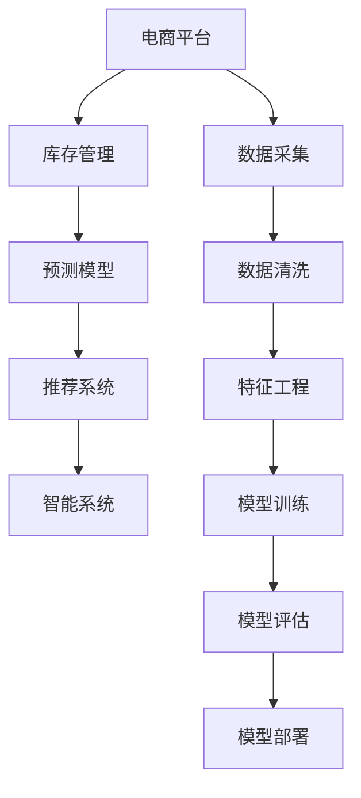

                 

# AI驱动的电商平台库存智能管理系统

## 1. 背景介绍

随着电商平台的快速发展，库存管理成为影响业务运营效率和客户满意度的重要因素。传统库存管理依赖于复杂的人工操作，易出现库存失衡、缺货或过剩等问题，给企业带来巨大损失。而AI驱动的库存智能管理系统，通过自动化、智能化手段，极大地提升了库存管理效率，实现了库存资源的最优配置。

## 2. 核心概念与联系

### 2.1 核心概念概述

为更好地理解AI驱动的电商平台库存智能管理系统，本节将介绍几个密切相关的核心概念：

- 人工智能(Artificial Intelligence, AI)：指使计算机系统模仿人类智能行为的技术，包括学习、推理、感知、决策等能力。
- 电商平台(E-commerce Platform)：指通过互联网提供商品交易服务的平台，包括C2C、B2B、B2C等多种模式。
- 库存管理(Inventory Management)：指对库存物品的采购、存储、补货、配送等过程进行规划和控制的综合性管理活动。
- 智能系统(Intelligent System)：指通过人工智能技术实现自主决策和高度自动化作业的系统。
- 预测模型(Prediction Model)：指通过数据分析和学习算法预测未来趋势的数学模型。
- 推荐系统(Recommendation System)：指根据用户行为、偏好等信息，自动推荐相关商品的系统。

这些核心概念之间的逻辑关系可以通过以下Mermaid流程图来展示：



这个流程图展示了一系列相关的核心概念及其之间的关系：

1. 电商平台是整个系统的运行环境，提供商品展示、交易、支付等服务。
2. 库存管理是电商平台的基础功能，对库存状态、商品数量进行管理。
3. 预测模型利用历史数据预测未来趋势，如商品销售量、库存水平等，作为库存管理的重要依据。
4. 推荐系统通过用户行为分析，推荐相关商品，提升用户体验，同时影响库存需求。
5. 智能系统通过融合预测和推荐结果，实现库存调度和优化决策。
6. 数据采集、清洗和特征工程是模型训练的基础，保障数据质量。
7. 模型训练和评估是系统智能化的核心，通过优化算法和模型参数，提升预测和推荐准确性。
8. 模型部署和持续学习是系统长期稳定的保障，不断根据实际运营情况调整模型。

这些概念共同构成了AI驱动的电商平台库存智能管理系统的理论基础。通过理解这些核心概念，我们可以更好地把握系统的工作原理和优化方向。

## 3. 核心算法原理 & 具体操作步骤
### 3.1 算法原理概述

AI驱动的电商平台库存智能管理系统，其核心算法原理主要基于预测和推荐技术。通过建立和训练预测模型，实现对未来库存需求的准确预测，并结合推荐系统，实现库存优化和资源配置。

具体来说，系统包含以下几个关键模块：

1. **数据采集模块**：收集电商平台的各种数据，如用户行为、交易记录、库存状态等。
2. **数据清洗和特征工程模块**：对原始数据进行预处理，提取有意义的特征，保障模型训练质量。
3. **预测模型模块**：利用机器学习或深度学习算法，建立预测模型，对未来的库存需求、销售量等进行预测。
4. **推荐系统模块**：根据用户行为、历史购买记录等信息，自动推荐相关商品，影响库存需求。
5. **库存优化模块**：结合预测和推荐结果，进行库存调度和优化决策，保持最优库存水平。

### 3.2 算法步骤详解

AI驱动的电商平台库存智能管理系统的实现，一般包括以下几个关键步骤：

**Step 1: 数据准备**

1. **数据采集**：通过API接口、数据库导出等方式，从电商平台获取原始数据，包括用户行为数据、交易记录、库存状态等。
2. **数据清洗**：去除无效数据、处理缺失值、异常值，保证数据质量。
3. **特征提取**：选择有意义的特征，如用户购买频率、商品类别、时间特征等，作为预测模型的输入。

**Step 2: 模型训练**

1. **选择模型**：根据预测任务选择合适的算法，如线性回归、决策树、随机森林、深度学习等。
2. **模型训练**：在清洗后的数据集上，使用优化算法训练预测模型。
3. **模型评估**：在验证集上评估模型性能，选择合适的超参数和模型结构。

**Step 3: 模型部署**

1. **模型集成**：将训练好的模型部署到生产环境中，保证实时性。
2. **持续学习**：根据实时数据，不断更新模型参数，保持模型性能。

**Step 4: 库存优化**

1. **库存预测**：利用预测模型，对未来库存需求进行预测。
2. **库存调度**：根据预测结果和推荐系统结果，调整库存水平，实现库存优化。

**Step 5: 反馈与优化**

1. **效果评估**：定期评估库存优化效果，识别问题。
2. **模型优化**：根据评估结果，调整模型参数，优化算法。

### 3.3 算法优缺点

AI驱动的电商平台库存智能管理系统，具有以下优点：

1. 自动化高效：通过自动化算法，实现库存管理的智能化，减少人工操作，提高效率。
2. 精准预测：利用历史数据和预测模型，对未来库存需求进行精准预测，避免缺货或过剩。
3. 实时响应：结合推荐系统，根据实时数据调整库存，快速响应市场变化。
4. 成本节约：优化库存水平，降低库存成本，提高资金利用率。
5. 用户体验提升：通过推荐系统，个性化推荐商品，提升用户购买体验。

同时，该系统也存在一些局限性：

1. 数据依赖度高：系统性能依赖于数据的完整性和质量，一旦数据出现偏差，预测结果可能不准确。
2. 模型鲁棒性不足：预测模型和推荐系统在面对突发事件时，可能出现鲁棒性不足。
3. 算法复杂度高：模型训练和优化算法复杂，需要较高的计算资源和专业知识。
4. 用户隐私问题：收集和分析用户行为数据，可能引发隐私和数据安全问题。
5. 模型解释性差：部分预测和推荐算法缺乏可解释性，难以理解和调试。

尽管存在这些局限性，但就目前而言，AI驱动的库存智能管理系统在电商平台中的应用已经成为行业趋势，助力企业提升运营效率和客户满意度。

### 3.4 算法应用领域

AI驱动的电商平台库存智能管理系统，已经在多个领域得到广泛应用，具体包括：

- **电商运营优化**：如京东、亚马逊等大型电商平台的库存管理，通过预测模型和推荐系统，实现库存优化和推荐个性化。
- **快消品行业**：如食品饮料、化妆品等行业，通过库存智能管理，减少库存积压，提升商品流转效率。
- **汽车行业**：如汽车零部件供应链管理，通过智能库存系统，优化库存配置，降低采购成本。
- **制造业**：如电子产品、机械制造等行业的库存管理，结合生产计划和销售预测，优化库存水平。

除了上述这些经典应用外，AI驱动的库存智能管理系统还将拓展到更多场景中，如在线教育、医疗、金融等，为各行各业带来变革性影响。

## 4. 数学模型和公式 & 详细讲解  
### 4.1 数学模型构建

本节将使用数学语言对AI驱动的电商平台库存智能管理系统的预测模型进行更加严格的刻画。

记电商平台的历史交易数据为 $D=\{(x_i,y_i)\}_{i=1}^N$，其中 $x_i$ 为输入特征向量， $y_i$ 为对应输出值（如库存水平、销售量等）。设预测模型为 $f(x;\theta)$，其中 $\theta$ 为模型参数。

定义模型 $f(x;\theta)$ 在数据样本 $(x,y)$ 上的损失函数为 $\ell(f(x;\theta),y)$，则在数据集 $D$ 上的经验风险为：

$$
\mathcal{L}(\theta) = \frac{1}{N} \sum_{i=1}^N \ell(f(x_i;\theta),y_i)
$$

预测模型的优化目标是最小化经验风险，即找到最优参数：

$$
\theta^* = \mathop{\arg\min}_{\theta} \mathcal{L}(\theta)
$$

在实践中，我们通常使用基于梯度的优化算法（如SGD、Adam等）来近似求解上述最优化问题。设 $\eta$ 为学习率，则参数的更新公式为：

$$
\theta \leftarrow \theta - \eta \nabla_{\theta}\mathcal{L}(\theta)
$$

其中 $\nabla_{\theta}\mathcal{L}(\theta)$ 为损失函数对参数 $\theta$ 的梯度，可通过反向传播算法高效计算。

### 4.2 公式推导过程

以下我们以线性回归为例，推导预测模型的损失函数及其梯度的计算公式。

假设预测模型 $f(x;\theta)=\theta_0+\theta_1x_1+\theta_2x_2+\cdots+\theta_px_p$，其中 $x_1,x_2,\cdots,x_p$ 为特征向量中的元素。假设模型输出 $y_i$ 与真实值 $y^*_i$ 的误差为 $\epsilon_i=y_i-y^*_i$。则线性回归的损失函数定义为：

$$
\ell(f(x_i;\theta),y_i) = \frac{1}{2}(y_i-f(x_i;\theta))^2
$$

将其代入经验风险公式，得：

$$
\mathcal{L}(\theta) = \frac{1}{N} \sum_{i=1}^N (y_i-f(x_i;\theta))^2
$$

根据链式法则，损失函数对参数 $\theta_k$ 的梯度为：

$$
\frac{\partial \mathcal{L}(\theta)}{\partial \theta_k} = \sum_{i=1}^N -(y_i-f(x_i;\theta))x_{ik}
$$

其中 $x_{ik}$ 为特征向量 $x_i$ 中第 $k$ 个元素的值。

在得到损失函数的梯度后，即可带入参数更新公式，完成模型的迭代优化。重复上述过程直至收敛，最终得到适应电商平台库存预测的最优模型参数 $\theta^*$。

### 4.3 案例分析与讲解

下面以一个具体的库存管理案例，分析如何使用预测模型实现库存优化。

假设某电商平台销售某类商品，每月总需求量为 $D$，历史销售数据如表1所示：

| 月度   | 需求量  | 库存水平 |
| ------ | ------ | -------- |
| 1月     | 1000   | 200      |
| 2月     | 1500   | 300      |
| 3月     | 2000   | 350      |
| 4月     | 1200   | 250      |
| 5月     | 1800   | 400      |

假设需求量 $D$ 为随机变量，服从正态分布 $N(\mu,\sigma^2)$，其中 $\mu=2000$，$\sigma^2=1000$。设库存水平 $I$ 为随机变量，服从正态分布 $N(\mu,\sigma^2)$，其中 $\mu=300$，$\sigma^2=100$。

**Step 1: 数据准备**

1. **数据采集**：收集每月的需求量和库存水平数据。
2. **数据清洗**：去除无效数据、处理缺失值、异常值，保证数据质量。
3. **特征提取**：选择有意义的特征，如时间序列、需求量、库存量等，作为预测模型的输入。

**Step 2: 模型训练**

1. **选择模型**：根据预测任务选择合适的算法，如线性回归、决策树、随机森林、深度学习等。
2. **模型训练**：在清洗后的数据集上，使用优化算法训练预测模型。
3. **模型评估**：在验证集上评估模型性能，选择合适的超参数和模型结构。

**Step 3: 模型部署**

1. **模型集成**：将训练好的模型部署到生产环境中，保证实时性。
2. **持续学习**：根据实时数据，不断更新模型参数，保持模型性能。

**Step 4: 库存优化**

1. **库存预测**：利用预测模型，对未来库存需求进行预测。
2. **库存调度**：根据预测结果和推荐系统结果，调整库存水平，实现库存优化。

**Step 5: 反馈与优化**

1. **效果评估**：定期评估库存优化效果，识别问题。
2. **模型优化**：根据评估结果，调整模型参数，优化算法。

通过该案例，可以看到预测模型在库存管理中的应用效果，可以有效避免库存积压和缺货问题，提升库存管理效率。

## 5. 项目实践：代码实例和详细解释说明
### 5.1 开发环境搭建

在进行预测模型实践前，我们需要准备好开发环境。以下是使用Python进行TensorFlow开发的环境配置流程：

1. 安装Anaconda：从官网下载并安装Anaconda，用于创建独立的Python环境。

2. 创建并激活虚拟环境：
```bash
conda create -n tf-env python=3.8 
conda activate tf-env
```

3. 安装TensorFlow：根据CUDA版本，从官网获取对应的安装命令。例如：
```bash
conda install tensorflow==2.7.0
```

4. 安装Pandas、NumPy、Matplotlib等各类工具包：
```bash
pip install pandas numpy matplotlib scikit-learn tensorflow
```

5. 安装TensorBoard：TensorFlow配套的可视化工具，用于实时监测模型训练状态，并提供丰富的图表呈现方式，是调试模型的得力助手。

完成上述步骤后，即可在`tf-env`环境中开始预测模型实践。

### 5.2 源代码详细实现

下面我们以线性回归模型为例，给出使用TensorFlow对电商平台库存预测的Python代码实现。

首先，定义预测模型的输入特征和输出标签：

```python
import tensorflow as tf
import pandas as pd

# 加载数据
data = pd.read_csv('sales_data.csv')
features = data[['time', 'demand']]
labels = data['inventory']

# 定义模型输入输出
X = tf.keras.layers.Input(shape=(features.shape[1],))
y = tf.keras.layers.Dense(1, activation='linear')(X)
```

然后，定义模型结构并编译：

```python
model = tf.keras.models.Model(inputs=X, outputs=y)

# 定义优化器
optimizer = tf.keras.optimizers.Adam()

# 定义损失函数
loss = tf.keras.losses.MeanSquaredError()

# 编译模型
model.compile(optimizer=optimizer, loss=loss)
```

接着，训练模型并进行库存预测：

```python
# 定义批量大小
batch_size = 32

# 定义训练集和验证集
train_data = features[:1000]
train_labels = labels[:1000]
val_data = features[1000:]
val_labels = labels[1000:]

# 训练模型
model.fit(train_data, train_labels, batch_size=batch_size, epochs=100, validation_data=(val_data, val_labels))

# 预测库存水平
future_data = features[1000:]
future_labels = model.predict(future_data)
```

最后，使用预测结果进行库存调度：

```python
# 根据预测结果调整库存
inventory_levels = future_labels.flatten()
for i, level in enumerate(inventory_levels):
    inventory_levels[i] = level if level > 0 else 0

# 输出库存预测结果
print(future_labels)
```

以上就是使用TensorFlow进行电商平台库存预测的完整代码实现。可以看到，TensorFlow提供了强大的模型构建和训练功能，可以轻松实现预测模型。

### 5.3 代码解读与分析

让我们再详细解读一下关键代码的实现细节：

**数据准备**：
- `pd.read_csv('sales_data.csv')`：从CSV文件中加载历史销售数据，使用Pandas库进行数据处理。
- `features = data[['time', 'demand']]`：提取时间序列和需求量作为模型输入。
- `labels = data['inventory']`：提取库存水平作为模型输出。

**模型构建**：
- `X = tf.keras.layers.Input(shape=(features.shape[1],))`：定义模型输入层，形状为输入特征的大小。
- `y = tf.keras.layers.Dense(1, activation='linear')(X)`：定义模型输出层，为线性回归模型。
- `model = tf.keras.models.Model(inputs=X, outputs=y)`：构建模型，包含输入和输出层。

**模型训练**：
- `optimizer = tf.keras.optimizers.Adam()`：定义优化器，使用Adam算法。
- `loss = tf.keras.losses.MeanSquaredError()`：定义损失函数，使用均方误差损失。
- `model.compile(optimizer=optimizer, loss=loss)`：编译模型，设置优化器和损失函数。
- `model.fit(train_data, train_labels, batch_size=batch_size, epochs=100, validation_data=(val_data, val_labels))`：训练模型，使用批量大小和验证集进行评估。

**模型部署**：
- `inventory_levels = future_labels.flatten()`：将预测结果展开为1维数组，方便后续处理。
- `for i, level in enumerate(inventory_levels): inventory_levels[i] = level if level > 0 else 0`：根据预测结果调整库存水平，避免库存为负。
- `print(future_labels)`：输出库存预测结果。

可以看到，TensorFlow提供了完整的预测模型开发和部署流程，代码实现简洁高效。开发者可以灵活使用TensorFlow的各种工具和组件，快速迭代和优化模型。

当然，工业级的系统实现还需考虑更多因素，如模型的保存和部署、超参数的自动搜索、更灵活的任务适配层等。但核心的预测模型开发逻辑基本与此类似。

## 6. 实际应用场景
### 6.1 智能客服系统

AI驱动的库存智能管理系统，在智能客服系统中也有着广泛应用。通过预测模型和推荐系统，智能客服系统可以实时监控库存水平，及时补货，避免客户因缺货而投诉。同时，结合推荐系统，智能客服还可以根据用户历史购买记录，推荐相关商品，提升客户购买体验。

在技术实现上，可以收集客服中心的实时交易数据，如订单状态、商品类别、用户行为等，建立预测模型，预测未来的订单需求和库存水平。同时，利用推荐系统，对高频订单需求进行预判，生成库存补货计划。结合库存智能管理，智能客服系统可以实现库存自动化调度和补货，提升服务效率和客户满意度。

### 6.2 金融风控管理

金融风控管理中，库存智能管理系统同样发挥着重要作用。通过对历史交易数据和市场趋势进行预测，金融平台可以实时监控贷款违约风险，及时采取措施，降低坏账率。同时，结合推荐系统，根据用户的交易行为和信用记录，生成风险评估报告，帮助平台进行风险预警和贷款审批。

具体来说，可以收集用户的交易记录、信用评分、贷款信息等数据，建立预测模型，对用户的违约概率进行预测。同时，利用推荐系统，根据用户的历史交易行为和信用记录，生成风险评估报告，帮助平台进行风险预警和贷款审批。通过库存智能管理，金融平台可以实时监控贷款违约风险，及时采取措施，降低坏账率。

### 6.3 物流配送系统

物流配送系统中，库存智能管理系统同样发挥着重要作用。通过对历史订单数据和市场趋势进行预测，物流平台可以实时监控库存水平，及时补货，避免缺货和过剩现象。同时，结合推荐系统，物流平台可以根据用户的订单历史和配送地址，推荐合适的配送方式和库存位置，提升配送效率。

具体来说，可以收集订单历史数据、用户配送地址、商品类别等信息，建立预测模型，对未来的订单需求和库存水平进行预测。同时，利用推荐系统，根据用户的订单历史和配送地址，生成推荐路线和库存位置，提升配送效率。结合库存智能管理，物流平台可以实现库存自动化调度和补货，提升配送效率和客户满意度。

### 6.4 未来应用展望

随着AI驱动的库存智能管理系统的不断演进，未来将在更多领域得到应用，为各行各业带来变革性影响。

在智能制造领域，通过预测模型和推荐系统，实现生产计划和库存调度的优化，提升生产效率和质量。

在智慧城市治理中，通过预测模型和推荐系统，实现城市事件监测和应急响应，提升城市管理的智能化水平。

在农业生产中，通过预测模型和推荐系统，实现农产品的市场需求预测和库存管理，提升农业生产效率和农民收入。

此外，在教育、医疗、能源等多个领域，AI驱动的库存智能管理系统也将得到广泛应用，为各行各业带来新的突破。

## 7. 工具和资源推荐
### 7.1 学习资源推荐

为了帮助开发者系统掌握AI驱动的库存智能管理系统的理论基础和实践技巧，这里推荐一些优质的学习资源：

1. TensorFlow官方文档：提供了完整的TensorFlow开发和部署指南，包含丰富的案例和工具。
2. Scikit-learn官方文档：提供了Scikit-learn机器学习库的全面介绍和使用指南。
3. Kaggle竞赛平台：提供了大量的机器学习竞赛和开源数据集，帮助开发者进行模型训练和调优。
4. 《Python数据科学手册》：全面介绍了Python在数据科学中的应用，适合入门和进阶学习。
5. 《深度学习》课程：斯坦福大学开设的深度学习课程，涵盖深度学习理论、算法和实践。

通过对这些资源的学习实践，相信你一定能够快速掌握AI驱动的库存智能管理系统的精髓，并用于解决实际的业务问题。
###  7.2 开发工具推荐

高效的开发离不开优秀的工具支持。以下是几款用于AI驱动的库存智能管理系统开发的常用工具：

1. TensorFlow：由Google主导开发的开源深度学习框架，生产部署方便，适合大规模工程应用。
2. Scikit-learn：Python数据科学库，提供了简单易用的机器学习算法和工具，适合数据预处理和特征工程。
3. Keras：高层神经网络API，易于上手，适合快速原型开发和模型实验。
4. PyTorch：基于Python的深度学习框架，灵活高效，适合模型训练和优化。
5. Jupyter Notebook：交互式开发环境，支持代码、数据和图表的可视化，适合研究与教学。

合理利用这些工具，可以显著提升AI驱动的库存智能管理系统的开发效率，加快创新迭代的步伐。

### 7.3 相关论文推荐

AI驱动的库存智能管理系统的发展源于学界的持续研究。以下是几篇奠基性的相关论文，推荐阅读：

1. Predictive Maintenance: The Hidden Factory The Benefits, Challenges and Opportunities of Predictive Maintenance：介绍了预测模型在工厂维护中的应用。
2. Scaling Best Practices for Production Level Predictive Maintenance Systems：总结了生产级预测模型系统的最佳实践。
3. Collaborative filtering recommendation algorithms：介绍了协同过滤推荐算法的原理和应用。
4. Learning to Predict with Residual Networks：提出了残差网络，提高了深度学习模型的预测准确性。
5. Advances in Production Maintenance Prediction Using Deep Learning Models：总结了深度学习在生产维护预测中的应用。

这些论文代表了大规模预测和推荐模型的发展脉络。通过学习这些前沿成果，可以帮助研究者把握学科前进方向，激发更多的创新灵感。

## 8. 总结：未来发展趋势与挑战
### 8.1 总结

本文对AI驱动的电商平台库存智能管理系统进行了全面系统的介绍。首先阐述了库存管理的重要性和AI驱动的必要性，明确了库存智能管理系统在提升运营效率、客户满意度等方面的独特价值。其次，从原理到实践，详细讲解了库存智能管理系统的预测模型和推荐系统的核心算法，给出了预测模型训练和库存优化的完整代码实现。同时，本文还广泛探讨了库存智能管理系统在智能客服、金融风控、物流配送等实际应用场景中的应用前景，展示了AI驱动的强大能力。

通过本文的系统梳理，可以看到，AI驱动的库存智能管理系统已经成为电商平台优化库存管理的趋势，通过预测模型和推荐系统的结合，实现了库存资源的最优配置和快速响应，大幅提升了运营效率和客户满意度。未来，伴随预测和推荐算法的不断演进，库存智能管理系统必将在更多领域得到应用，为各行各业带来更深远的影响。

### 8.2 未来发展趋势

展望未来，AI驱动的库存智能管理系统将呈现以下几个发展趋势：

1. 预测模型精度提升：随着深度学习算法的不断发展，预测模型的精度将不断提升，能够更准确地预测库存需求和市场变化。
2. 实时响应能力增强：结合实时数据流处理技术，预测模型将能够实现实时更新和预测，快速响应市场变化。
3. 多模态融合应用：预测模型将结合图像、语音、传感器等多模态数据，提升预测和推荐的全面性和准确性。
4. 联邦学习应用：通过联邦学习技术，分散存储在不同设备上的数据可以联合训练模型，保护数据隐私的同时提升模型性能。
5. 自动化调优和优化：引入自动化调优算法，自动搜索最优模型参数和算法策略，减少人工干预。
6. 集成智能决策系统：将预测和推荐结果与其他智能决策系统结合，如智能客服、金融风控等，提升系统综合性能。

以上趋势凸显了AI驱动的库存智能管理系统的广阔前景。这些方向的探索发展，必将进一步提升系统的预测和推荐能力，为各行各业带来新的突破。

### 8.3 面临的挑战

尽管AI驱动的库存智能管理系统已经取得了瞩目成就，但在迈向更加智能化、普适化应用的过程中，它仍面临着诸多挑战：

1. 数据依赖度高：系统的性能依赖于高质量的数据，一旦数据出现偏差，预测结果可能不准确。
2. 模型鲁棒性不足：预测模型在面对突发事件时，可能出现鲁棒性不足，影响决策效果。
3. 计算资源消耗大：预测和推荐模型的训练和优化需要较高的计算资源，存在资源瓶颈。
4. 用户隐私问题：收集和分析用户行为数据，可能引发隐私和数据安全问题。
5. 模型可解释性差：部分预测和推荐算法缺乏可解释性，难以理解和调试。
6. 算法复杂度高：模型的训练和优化算法复杂，需要较高的专业知识。

尽管存在这些挑战，但AI驱动的库存智能管理系统在电商平台中的应用已经成为行业趋势，助力企业提升运营效率和客户满意度。未来，伴随算法的不断演进和优化，这些问题将逐步得到解决。

### 8.4 研究展望

面对AI驱动的库存智能管理系统所面临的挑战，未来的研究需要在以下几个方面寻求新的突破：

1. 探索更多高质量数据源：积极拓展数据采集渠道，获取更多真实、准确的数据，提升模型预测能力。
2. 提升模型鲁棒性：引入鲁棒性增强技术，如对抗训练、集成学习等，提升模型的稳定性和适应性。
3. 优化模型训练资源：引入分布式训练、混合精度训练等技术，优化模型训练过程，减少资源消耗。
4. 保护用户隐私：引入差分隐私、联邦学习等技术，保护用户数据隐私，提升数据安全。
5. 增强模型可解释性：引入可解释性算法，如LIME、SHAP等，提升模型的可解释性，方便理解和调试。
6. 降低算法复杂度：优化算法设计，引入高效算法和优化技巧，降低算法的复杂度，提升开发效率。

这些研究方向的探索，必将引领AI驱动的库存智能管理系统迈向更高的台阶，为各行各业带来新的突破。面向未来，通过不断创新和优化，AI驱动的库存智能管理系统必将在更多领域得到应用，实现更高效的库存管理，提升业务运营效率和客户满意度。

## 9. 附录：常见问题与解答

**Q1：AI驱动的库存智能管理系统如何降低库存成本？**

A: AI驱动的库存智能管理系统通过预测模型和推荐系统，实现了对库存需求和市场变化的精准预测和智能调度。具体来说，系统能够实时监控库存水平，预测未来的库存需求和订单量，从而避免库存积压和缺货。通过优化库存水平和调配送货，系统能够显著降低库存成本，提高资金利用率。

**Q2：AI驱动的库存智能管理系统在实际应用中存在哪些挑战？**

A: AI驱动的库存智能管理系统在实际应用中面临以下挑战：

1. 数据依赖度高：系统的性能依赖于高质量的数据，一旦数据出现偏差，预测结果可能不准确。
2. 模型鲁棒性不足：预测模型在面对突发事件时，可能出现鲁棒性不足，影响决策效果。
3. 计算资源消耗大：预测和推荐模型的训练和优化需要较高的计算资源，存在资源瓶颈。
4. 用户隐私问题：收集和分析用户行为数据，可能引发隐私和数据安全问题。
5. 模型可解释性差：部分预测和推荐算法缺乏可解释性，难以理解和调试。
6. 算法复杂度高：模型的训练和优化算法复杂，需要较高的专业知识。

尽管存在这些挑战，但AI驱动的库存智能管理系统已经在电商平台中得到了广泛应用，助力企业提升运营效率和客户满意度。未来，伴随算法的不断演进和优化，这些问题将逐步得到解决。

**Q3：如何评估AI驱动的库存智能管理系统的性能？**

A: AI驱动的库存智能管理系统的性能评估通常包括以下几个方面：

1. 预测准确性：通过比较预测值和实际值，评估预测模型的准确性。
2. 库存优化效果：通过比较优化前后的库存水平，评估库存智能管理系统的优化效果。
3. 用户满意度：通过客户反馈和满意度调查，评估系统的用户体验。
4. 系统稳定性：通过监测系统运行过程中的异常情况，评估系统的稳定性和鲁棒性。
5. 资源利用率：通过监测系统资源使用情况，评估系统的资源利用率。

通过对这些指标的评估，可以全面了解系统的性能和效果，发现问题并进行优化。

**Q4：AI驱动的库存智能管理系统在预测模型训练中需要注意哪些问题？**

A: 在预测模型训练中，需要注意以下问题：

1. 数据质量：数据集必须干净、完整、准确，避免出现噪声、缺失值和异常值。
2. 特征选择：选择合适的特征，提升模型的预测能力。
3. 模型选择：选择合适的模型，根据数据特点和任务需求进行模型选择。
4. 超参数调优：通过网格搜索、随机搜索等方法，找到最优的超参数组合。
5. 模型评估：使用交叉验证等方法，评估模型的泛化能力和性能。
6. 模型部署：将训练好的模型部署到生产环境中，保证实时性。
7. 持续学习：根据实时数据，不断更新模型参数，保持模型性能。

合理解决这些问题，能够提升预测模型的性能，实现更准确的库存预测。

通过本文的系统梳理，可以看到，AI驱动的库存智能管理系统已经成为电商平台优化库存管理的趋势，通过预测模型和推荐系统的结合，实现了库存资源的最优配置和快速响应，大幅提升了运营效率和客户满意度。未来，伴随预测和推荐算法的不断演进，库存智能管理系统必将在更多领域得到应用，为各行各业带来新的突破。

