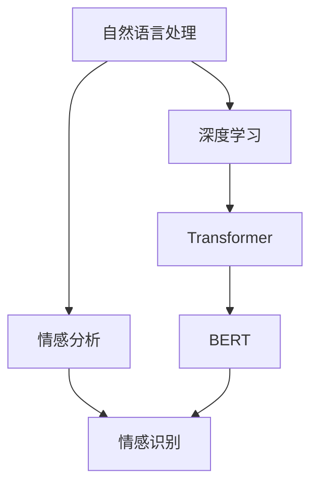

                 

# AI驱动的电商平台智能客服情感识别系统

> 关键词：自然语言处理,情感分析,电商平台,智能客服,深度学习,Transformer,BERT

## 1. 背景介绍

### 1.1 问题由来
近年来，随着电商平台用户数量的激增和交易量的爆炸式增长，智能客服成为保障用户体验、提升客户满意度的重要手段。传统的客服模式依赖人工坐席，不仅人力成本高，而且响应速度慢，难以应对大规模用户需求。基于AI技术的智能客服系统通过自动化、智能化的方式，能够24小时不间断提供服务，极大地提升了客户满意度。

在智能客服系统中，情感识别是重要的核心功能之一。情感识别能够帮助客服系统理解客户情绪，进而采取相应的服务策略。例如，对于愤怒的客户，系统可以立即将其转接给高级客服处理；对于满意的客户，则可以推荐相关商品或服务。因此，准确的情感识别能力直接关系到智能客服系统的性能和用户体验。

### 1.2 问题核心关键点
情感识别是基于自然语言处理(Natural Language Processing, NLP)技术，通过分析文本语义，识别出客户情感倾向的过程。情感识别通常分为两类：

1. **分类任务**：将文本情感分为正面、负面或中性三类。
2. **评分任务**：将文本情感评分在0到1之间，越接近1表示情感越正面，越接近0表示情感越负面。

情感识别技术在智能客服系统的应用中，能够帮助系统实时监测客户情绪，及时调整服务策略，提供个性化推荐，增强客户满意度。但情感识别面临的核心挑战在于：

- 如何从海量用户对话中高效提取出情感信息？
- 如何在不同领域和语境下保持情感识别的准确性和鲁棒性？
- 如何避免情感识别模型对负面信息的敏感性和偏见？

## 2. 核心概念与联系

### 2.1 核心概念概述

为更好地理解情感识别技术在智能客服系统中的应用，本节将介绍几个密切相关的核心概念：

- **自然语言处理(NLP)**：涉及文本信息的自动处理，包括分词、句法分析、语义理解等技术。
- **情感分析(Affective Analysis)**：通过文本分析识别出客户的情感倾向，广泛应用于客服、市场营销等领域。
- **深度学习(Deep Learning)**：以神经网络为核心，通过大量数据训练模型，进行复杂任务的自动学习和识别。
- **Transformer模型**：一种基于自注意力机制的神经网络结构，在大规模语言模型中表现优异，已被广泛应用于NLP任务。
- **BERT模型**：一种基于Transformer的预训练语言模型，通过掩码语言模型和下一句预测任务进行预训练，能学习到丰富的语言知识。
- **情感识别模型**：结合情感分析技术和深度学习模型，能够自动识别出文本中的情感信息，并给出情感分类或评分。

这些核心概念之间的逻辑关系可以通过以下Mermaid流程图来展示：



这个流程图展示了大语言模型在情感识别中的应用：

1. 自然语言处理技术对用户文本进行分词、句法分析和语义理解。
2. 情感分析模型通过深度学习模型，自动学习文本中的情感信息。
3. 基于Transformer的BERT模型，通过预训练获得通用的语言表示，进一步提升情感识别的准确性。
4. 情感识别模型结合情感分析技术和深度学习，输出情感分类或评分。

## 3. 核心算法原理 & 具体操作步骤

### 3.1 算法原理概述

情感识别技术主要是通过分析文本语义，识别出客户情感的过程。一般采用以下两种方法：

1. **分类任务**：将文本情感分为正面、负面或中性三类。
2. **评分任务**：将文本情感评分在0到1之间，越接近1表示情感越正面，越接近0表示情感越负面。

常见的情感识别模型包括情感分类模型和情感评分模型。本文重点介绍情感分类模型的核心算法原理。

**算法原理概述**：
情感分类模型的核心思想是通过训练深度神经网络，将文本输入映射到情感分类结果。模型通常包括输入层、嵌入层、多个隐含层和输出层，其中输出层为情感分类结果，通常是softmax层输出情感类别概率。模型的训练过程是监督学习过程，即使用已标注的情感分类数据集，通过反向传播算法优化模型参数。

### 3.2 算法步骤详解

情感分类模型的训练和推理过程如下：

1. **数据准备**：收集并标注情感分类数据集，一般将文本分为正面、负面、中性三类。
2. **模型选择**：选择适合情感分类的深度学习模型，如使用BERT作为预训练模型，添加任务适配层。
3. **模型训练**：在标注数据集上，使用反向传播算法优化模型参数，最小化损失函数。
4. **模型评估**：在验证集和测试集上评估模型性能，选择最优模型。
5. **模型部署**：将训练好的模型部署到生产环境中，用于实时情感识别。

### 3.3 算法优缺点

情感分类模型的优点包括：
- **准确性高**：通过大量标注数据训练，能够学习到文本中的情感特征。
- **鲁棒性强**：能够处理不同领域、不同风格的情感文本。
- **可解释性强**：模型的决策过程可解释性强，便于调试和优化。

然而，情感分类模型也存在一些缺点：
- **依赖标注数据**：模型性能高度依赖标注数据的质量和数量，标注成本高。
- **泛化能力有限**：对于新领域的情感文本，模型可能存在泛化能力不足的问题。
- **过拟合风险**：在标注数据较少的情况下，模型可能出现过拟合的风险。

### 3.4 算法应用领域

情感分类模型在多个领域都有广泛的应用，如电商平台智能客服、社交媒体情感分析、舆情监测等。

在电商平台智能客服中，情感分类模型能够帮助客服系统实时监测客户情绪，调整服务策略，提供个性化推荐，提升客户满意度。具体而言，智能客服系统可以通过以下步骤进行情感识别：

1. **文本采集**：通过客服聊天界面或邮件、反馈等渠道，采集客户文本。
2. **预处理**：对文本进行分词、去停用词等预处理，提取特征向量。
3. **情感分类**：将预处理后的特征向量输入情感分类模型，得到情感分类结果。
4. **服务响应**：根据情感分类结果，客服系统自动调整服务策略，例如转接高级客服、推荐相关商品等。

## 4. 数学模型和公式 & 详细讲解

### 4.1 数学模型构建

情感分类模型的数学模型可以表示为：

$$
y = \text{softmax}(W[a_{k-1}]+b_k) \\
\min_{W,b} \sum_i \ell(y_i, \hat{y}_i)
$$

其中，$y$为情感分类结果，$W$和$b$为模型参数，$\ell$为损失函数，$i$表示训练样本编号。

具体而言，情感分类模型的输入层为文本的词向量表示，嵌入层将词向量转化为高维向量，隐含层通过多个非线性变换提取特征，输出层通过softmax函数输出情感类别概率。

### 4.2 公式推导过程

情感分类模型的训练过程是监督学习过程，通过反向传播算法最小化损失函数。

假设模型的损失函数为交叉熵损失函数，训练过程可以表示为：

$$
\min_{W,b} \frac{1}{N}\sum_{i=1}^N \ell(y_i, \hat{y}_i)
$$

其中，$N$为训练样本数。

采用随机梯度下降算法进行参数优化，每次迭代更新参数的公式为：

$$
\theta \leftarrow \theta - \eta \nabla_{\theta} \ell(\theta)
$$

其中，$\eta$为学习率，$\nabla_{\theta} \ell(\theta)$为损失函数对模型参数的梯度，可通过反向传播算法计算得到。

### 4.3 案例分析与讲解

以电商平台智能客服系统中的情感分类任务为例，训练过程可以表示为：

1. **数据准备**：收集电商平台的客户反馈数据，标注为正面、负面、中性三类。
2. **模型选择**：选择BERT作为预训练模型，添加任务适配层，包括文本嵌入层、多个全连接层和输出层。
3. **模型训练**：使用随机梯度下降算法，在标注数据集上最小化交叉熵损失函数，更新模型参数。
4. **模型评估**：在验证集和测试集上评估模型性能，选择最优模型。
5. **模型部署**：将训练好的模型部署到生产环境中，用于实时情感识别。

## 5. 项目实践：代码实例和详细解释说明

### 5.1 开发环境搭建

在进行情感识别系统开发前，我们需要准备好开发环境。以下是使用Python进行PyTorch开发的环境配置流程：

1. 安装Anaconda：从官网下载并安装Anaconda，用于创建独立的Python环境。
2. 创建并激活虚拟环境：
```bash
conda create -n pytorch-env python=3.8 
conda activate pytorch-env
```

3. 安装PyTorch：根据CUDA版本，从官网获取对应的安装命令。例如：
```bash
conda install pytorch torchvision torchaudio cudatoolkit=11.1 -c pytorch -c conda-forge
```

4. 安装Transformers库：
```bash
pip install transformers
```

5. 安装各类工具包：
```bash
pip install numpy pandas scikit-learn matplotlib tqdm jupyter notebook ipython
```

完成上述步骤后，即可在`pytorch-env`环境中开始开发实践。

### 5.2 源代码详细实现

下面我们以情感分类任务为例，给出使用Transformers库对BERT模型进行情感分类的PyTorch代码实现。

首先，定义情感分类数据处理函数：

```python
from transformers import BertTokenizer
from torch.utils.data import Dataset
import torch

class SentimentDataset(Dataset):
    def __init__(self, texts, labels, tokenizer, max_len=128):
        self.texts = texts
        self.labels = labels
        self.tokenizer = tokenizer
        self.max_len = max_len
        
    def __len__(self):
        return len(self.texts)
    
    def __getitem__(self, item):
        text = self.texts[item]
        label = self.labels[item]
        
        encoding = self.tokenizer(text, return_tensors='pt', max_length=self.max_len, padding='max_length', truncation=True)
        input_ids = encoding['input_ids'][0]
        attention_mask = encoding['attention_mask'][0]
        
        # 将label进行编码
        label = torch.tensor([label2id[label]], dtype=torch.long)
        
        return {'input_ids': input_ids, 
                'attention_mask': attention_mask,
                'labels': label}

# 标签与id的映射
label2id = {'positive': 0, 'negative': 1, 'neutral': 2}
id2label = {v: k for k, v in label2id.items()}

# 创建dataset
tokenizer = BertTokenizer.from_pretrained('bert-base-cased')

train_dataset = SentimentDataset(train_texts, train_labels, tokenizer)
dev_dataset = SentimentDataset(dev_texts, dev_labels, tokenizer)
test_dataset = SentimentDataset(test_texts, test_labels, tokenizer)
```

然后，定义模型和优化器：

```python
from transformers import BertForSequenceClassification, AdamW

model = BertForSequenceClassification.from_pretrained('bert-base-cased', num_labels=len(label2id))

optimizer = AdamW(model.parameters(), lr=2e-5)
```

接着，定义训练和评估函数：

```python
from torch.utils.data import DataLoader
from tqdm import tqdm
from sklearn.metrics import accuracy_score

device = torch.device('cuda') if torch.cuda.is_available() else torch.device('cpu')
model.to(device)

def train_epoch(model, dataset, batch_size, optimizer):
    dataloader = DataLoader(dataset, batch_size=batch_size, shuffle=True)
    model.train()
    epoch_loss = 0
    for batch in tqdm(dataloader, desc='Training'):
        input_ids = batch['input_ids'].to(device)
        attention_mask = batch['attention_mask'].to(device)
        labels = batch['labels'].to(device)
        model.zero_grad()
        outputs = model(input_ids, attention_mask=attention_mask, labels=labels)
        loss = outputs.loss
        epoch_loss += loss.item()
        loss.backward()
        optimizer.step()
    return epoch_loss / len(dataloader)

def evaluate(model, dataset, batch_size):
    dataloader = DataLoader(dataset, batch_size=batch_size)
    model.eval()
    preds, labels = [], []
    with torch.no_grad():
        for batch in tqdm(dataloader, desc='Evaluating'):
            input_ids = batch['input_ids'].to(device)
            attention_mask = batch['attention_mask'].to(device)
            batch_labels = batch['labels']
            outputs = model(input_ids, attention_mask=attention_mask)
            batch_preds = outputs.logits.argmax(dim=1).to('cpu').tolist()
            batch_labels = batch_labels.to('cpu').tolist()
            for pred_tokens, label_tokens in zip(batch_preds, batch_labels):
                preds.append(pred_tokens)
                labels.append(label_tokens)
                
    print(f'Accuracy: {accuracy_score(labels, preds)}')
```

最后，启动训练流程并在测试集上评估：

```python
epochs = 5
batch_size = 16

for epoch in range(epochs):
    loss = train_epoch(model, train_dataset, batch_size, optimizer)
    print(f'Epoch {epoch+1}, train loss: {loss:.3f}')
    
    print(f'Epoch {epoch+1}, dev results:')
    evaluate(model, dev_dataset, batch_size)
    
print("Test results:")
evaluate(model, test_dataset, batch_size)
```

以上就是使用PyTorch对BERT进行情感分类任务微调的完整代码实现。可以看到，得益于Transformers库的强大封装，我们可以用相对简洁的代码完成BERT模型的加载和情感分类任务的微调。

### 5.3 代码解读与分析

让我们再详细解读一下关键代码的实现细节：

**SentimentDataset类**：
- `__init__`方法：初始化文本、标签、分词器等关键组件。
- `__len__`方法：返回数据集的样本数量。
- `__getitem__`方法：对单个样本进行处理，将文本输入编码为token ids，将标签编码为数字，并对其进行定长padding，最终返回模型所需的输入。

**label2id和id2label字典**：
- 定义了标签与数字id之间的映射关系，用于将模型预测结果解码回真实的标签。

**训练和评估函数**：
- 使用PyTorch的DataLoader对数据集进行批次化加载，供模型训练和推理使用。
- 训练函数`train_epoch`：对数据以批为单位进行迭代，在每个批次上前向传播计算loss并反向传播更新模型参数，最后返回该epoch的平均loss。
- 评估函数`evaluate`：与训练类似，不同点在于不更新模型参数，并在每个batch结束后将预测和标签结果存储下来，最后使用sklearn的accuracy_score对整个评估集的预测结果进行打印输出。

**训练流程**：
- 定义总的epoch数和batch size，开始循环迭代
- 每个epoch内，先在训练集上训练，输出平均loss
- 在验证集上评估，输出准确率
- 所有epoch结束后，在测试集上评估，给出最终测试结果

可以看到，PyTorch配合Transformers库使得BERT微调的代码实现变得简洁高效。开发者可以将更多精力放在数据处理、模型改进等高层逻辑上，而不必过多关注底层的实现细节。

当然，工业级的系统实现还需考虑更多因素，如模型的保存和部署、超参数的自动搜索、更灵活的任务适配层等。但核心的微调范式基本与此类似。

## 6. 实际应用场景

### 6.1 智能客服系统

基于大语言模型微调的情感识别技术，可以广泛应用于智能客服系统的构建。传统客服往往需要配备大量人力，高峰期响应缓慢，且一致性和专业性难以保证。而使用微调后的情感识别模型，能够实时监测客户情绪，快速响应客户需求，用自然流畅的语言解答各类常见问题。

在技术实现上，可以收集企业内部的历史客服对话记录，将问题和最佳答复构建成监督数据，在此基础上对预训练情感识别模型进行微调。微调后的情感识别模型能够自动理解客户情绪，匹配最合适的回复模板进行回复。对于客户提出的新问题，还可以接入检索系统实时搜索相关内容，动态组织生成回答。如此构建的智能客服系统，能大幅提升客户咨询体验和问题解决效率。

### 6.2 金融舆情监测

金融机构需要实时监测市场舆论动向，以便及时应对负面信息传播，规避金融风险。传统的人工监测方式成本高、效率低，难以应对网络时代海量信息爆发的挑战。基于大语言模型微调的情感分析技术，为金融舆情监测提供了新的解决方案。

具体而言，可以收集金融领域相关的新闻、报道、评论等文本数据，并对其进行主题标注和情感标注。在此基础上对预训练语言模型进行微调，使其能够自动判断文本属于何种主题，情感倾向是正面、中性还是负面。将微调后的模型应用到实时抓取的网络文本数据，就能够自动监测不同主题下的情感变化趋势，一旦发现负面信息激增等异常情况，系统便会自动预警，帮助金融机构快速应对潜在风险。

### 6.3 个性化推荐系统

当前的推荐系统往往只依赖用户的历史行为数据进行物品推荐，无法深入理解用户的真实兴趣偏好。基于大语言模型微调的情感识别技术，能够更好地挖掘用户行为背后的语义信息，从而提供更精准、多样的推荐内容。

在实践中，可以收集用户浏览、点击、评论、分享等行为数据，提取和用户交互的物品标题、描述、标签等文本内容。将文本内容作为模型输入，用户的后续行为（如是否点击、购买等）作为监督信号，在此基础上微调预训练语言模型。微调后的模型能够从文本内容中准确把握用户的兴趣点。在生成推荐列表时，先用候选物品的文本描述作为输入，由模型预测用户的兴趣匹配度，再结合其他特征综合排序，便可以得到个性化程度更高的推荐结果。

### 6.4 未来应用展望

随着大语言模型微调技术的不断发展，基于微调范式将在更多领域得到应用，为传统行业带来变革性影响。

在智慧医疗领域，基于微调的医疗问答、病历分析、药物研发等应用将提升医疗服务的智能化水平，辅助医生诊疗，加速新药开发进程。

在智能教育领域，微调技术可应用于作业批改、学情分析、知识推荐等方面，因材施教，促进教育公平，提高教学质量。

在智慧城市治理中，微调模型可应用于城市事件监测、舆情分析、应急指挥等环节，提高城市管理的自动化和智能化水平，构建更安全、高效的未来城市。

此外，在企业生产、社会治理、文娱传媒等众多领域，基于大模型微调的人工智能应用也将不断涌现，为NLP技术带来全新的突破。相信随着预训练语言模型和微调方法的不断进步，大语言模型微调必将在构建人机协同的智能时代中扮演越来越重要的角色。

## 7. 工具和资源推荐
### 7.1 学习资源推荐

为了帮助开发者系统掌握大语言模型微调的理论基础和实践技巧，这里推荐一些优质的学习资源：

1. 《Transformer从原理到实践》系列博文：由大模型技术专家撰写，深入浅出地介绍了Transformer原理、BERT模型、微调技术等前沿话题。

2. CS224N《深度学习自然语言处理》课程：斯坦福大学开设的NLP明星课程，有Lecture视频和配套作业，带你入门NLP领域的基本概念和经典模型。

3. 《Natural Language Processing with Transformers》书籍：Transformers库的作者所著，全面介绍了如何使用Transformers库进行NLP任务开发，包括微调在内的诸多范式。

4. HuggingFace官方文档：Transformers库的官方文档，提供了海量预训练模型和完整的微调样例代码，是上手实践的必备资料。

5. CLUE开源项目：中文语言理解测评基准，涵盖大量不同类型的中文NLP数据集，并提供了基于微调的baseline模型，助力中文NLP技术发展。

通过对这些资源的学习实践，相信你一定能够快速掌握大语言模型微调的精髓，并用于解决实际的NLP问题。
###  7.2 开发工具推荐

高效的开发离不开优秀的工具支持。以下是几款用于大语言模型微调开发的常用工具：

1. PyTorch：基于Python的开源深度学习框架，灵活动态的计算图，适合快速迭代研究。大部分预训练语言模型都有PyTorch版本的实现。

2. TensorFlow：由Google主导开发的开源深度学习框架，生产部署方便，适合大规模工程应用。同样有丰富的预训练语言模型资源。

3. Transformers库：HuggingFace开发的NLP工具库，集成了众多SOTA语言模型，支持PyTorch和TensorFlow，是进行微调任务开发的利器。

4. Weights & Biases：模型训练的实验跟踪工具，可以记录和可视化模型训练过程中的各项指标，方便对比和调优。与主流深度学习框架无缝集成。

5. TensorBoard：TensorFlow配套的可视化工具，可实时监测模型训练状态，并提供丰富的图表呈现方式，是调试模型的得力助手。

6. Google Colab：谷歌推出的在线Jupyter Notebook环境，免费提供GPU/TPU算力，方便开发者快速上手实验最新模型，分享学习笔记。

合理利用这些工具，可以显著提升大语言模型微调任务的开发效率，加快创新迭代的步伐。

### 7.3 相关论文推荐

大语言模型和微调技术的发展源于学界的持续研究。以下是几篇奠基性的相关论文，推荐阅读：

1. Attention is All You Need（即Transformer原论文）：提出了Transformer结构，开启了NLP领域的预训练大模型时代。

2. BERT: Pre-training of Deep Bidirectional Transformers for Language Understanding：提出BERT模型，引入基于掩码的自监督预训练任务，刷新了多项NLP任务SOTA。

3. Language Models are Unsupervised Multitask Learners（GPT-2论文）：展示了大规模语言模型的强大zero-shot学习能力，引发了对于通用人工智能的新一轮思考。

4. Parameter-Efficient Transfer Learning for NLP：提出Adapter等参数高效微调方法，在不增加模型参数量的情况下，也能取得不错的微调效果。

5. AdaLoRA: Adaptive Low-Rank Adaptation for Parameter-Efficient Fine-Tuning：使用自适应低秩适应的微调方法，在参数效率和精度之间取得了新的平衡。

6. Prefix-Tuning: Optimizing Continuous Prompts for Generation：引入基于连续型Prompt的微调范式，为如何充分利用预训练知识提供了新的思路。

这些论文代表了大语言模型微调技术的发展脉络。通过学习这些前沿成果，可以帮助研究者把握学科前进方向，激发更多的创新灵感。

## 8. 总结：未来发展趋势与挑战

### 8.1 总结

本文对基于大语言模型的情感识别技术进行了全面系统的介绍。首先阐述了情感识别技术在智能客服系统中的应用背景和重要性，明确了情感识别在智能客服系统中的核心地位。接着，从原理到实践，详细讲解了情感识别技术的核心算法原理和具体操作步骤，给出了微调任务开发的完整代码实例。同时，本文还广泛探讨了情感识别技术在智能客服系统、金融舆情监测、个性化推荐等多个行业领域的应用前景，展示了情感识别技术在NLP领域的重要价值。最后，本文精选了情感识别技术的各类学习资源，力求为读者提供全方位的技术指引。

通过本文的系统梳理，可以看到，情感识别技术在智能客服系统中发挥着重要作用，能够实时监测客户情绪，快速响应客户需求，用自然流畅的语言解答各类常见问题。情感识别技术的应用前景广阔，将为电商平台带来智能化服务体验，助力客户满意度的提升。

### 8.2 未来发展趋势

展望未来，情感识别技术将呈现以下几个发展趋势：

1. **模型规模持续增大**：随着算力成本的下降和数据规模的扩张，情感识别模型的参数量还将持续增长。超大规模语言模型蕴含的丰富语言知识，有望支撑更加复杂多变的情感识别任务。

2. **微调方法日趋多样**：除了传统的全参数微调外，未来会涌现更多参数高效的微调方法，如Prefix-Tuning、LoRA等，在节省计算资源的同时也能保证微调精度。

3. **持续学习成为常态**：随着数据分布的不断变化，情感识别模型也需要持续学习新知识以保持性能。如何在不遗忘原有知识的同时，高效吸收新样本信息，将成为重要的研究课题。

4. **标注样本需求降低**：受启发于提示学习(Prompt-based Learning)的思路，未来的情感识别方法将更好地利用大模型的语言理解能力，通过更加巧妙的任务描述，在更少的标注样本上也能实现理想的微调效果。

5. **多模态微调崛起**：当前的情感识别主要聚焦于纯文本数据，未来会进一步拓展到图像、视频、语音等多模态数据微调。多模态信息的融合，将显著提升情感识别模型的综合能力。

6. **模型通用性增强**：经过海量数据的预训练和多领域任务的微调，未来的情感识别模型将具备更强大的常识推理和跨领域迁移能力，逐步迈向通用人工智能(AGI)的目标。

以上趋势凸显了情感识别技术的广阔前景。这些方向的探索发展，必将进一步提升情感识别模型的性能和应用范围，为构建人机协同的智能客服系统提供有力支持。

### 8.3 面临的挑战

尽管情感识别技术已经取得了瞩目成就，但在迈向更加智能化、普适化应用的过程中，它仍面临着诸多挑战：

1. **标注成本瓶颈**：情感识别模型依赖大量的标注数据进行训练，标注成本高昂。如何进一步降低标注成本，成为一大难题。

2. **模型鲁棒性不足**：情感识别模型面对不同领域、不同风格的情感文本时，泛化性能可能不足。对于新领域的情感文本，模型可能存在泛化能力不足的问题。

3. **推理效率有待提高**：尽管情感识别模型的精度高，但在实际部署时，推理速度慢、内存占用大等问题依然存在，亟需优化。

4. **可解释性亟需加强**：情感识别模型的决策过程复杂，缺乏可解释性。对于客户情感的自动分类，模型的输出缺乏必要的解释，难以满足合规和透明的要求。

5. **安全性有待保障**：情感识别模型可能学习到有害的信息，对负面信息的敏感性和偏见也可能导致误判，带来安全隐患。如何从数据和算法层面消除模型偏见，确保输出的安全性，也将是重要的研究课题。

6. **知识整合能力不足**：现有的情感识别模型往往局限于文本信息，难以灵活吸收和运用更广泛的先验知识。如何让情感识别过程更好地与外部知识库、规则库等专家知识结合，形成更加全面、准确的信息整合能力，还有很大的想象空间。

正视情感识别面临的这些挑战，积极应对并寻求突破，将是大语言模型微调走向成熟的必由之路。相信随着学界和产业界的共同努力，这些挑战终将一一被克服，情感识别技术必将在构建安全、可靠、可解释、可控的智能客服系统中发挥重要作用。

### 8.4 研究展望

面对情感识别技术所面临的挑战，未来的研究需要在以下几个方面寻求新的突破：

1. **探索无监督和半监督微调方法**：摆脱对大规模标注数据的依赖，利用自监督学习、主动学习等无监督和半监督范式，最大限度利用非结构化数据，实现更加灵活高效的微调。

2. **研究参数高效和计算高效的微调范式**：开发更加参数高效的微调方法，在固定大部分预训练参数的同时，只更新极少量的任务相关参数。同时优化微调模型的计算图，减少前向传播和反向传播的资源消耗，实现更加轻量级、实时性的部署。

3. **融合因果和对比学习范式**：通过引入因果推断和对比学习思想，增强情感识别模型建立稳定因果关系的能力，学习更加普适、鲁棒的语言表征，从而提升模型泛化性和抗干扰能力。

4. **引入更多先验知识**：将符号化的先验知识，如知识图谱、逻辑规则等，与神经网络模型进行巧妙融合，引导情感识别过程学习更准确、合理的语言模型。同时加强不同模态数据的整合，实现视觉、语音等多模态信息与文本信息的协同建模。

5. **结合因果分析和博弈论工具**：将因果分析方法引入情感识别模型，识别出模型决策的关键特征，增强输出解释的因果性和逻辑性。借助博弈论工具刻画人机交互过程，主动探索并规避模型的脆弱点，提高系统稳定性。

6. **纳入伦理道德约束**：在模型训练目标中引入伦理导向的评估指标，过滤和惩罚有害的输出倾向。同时加强人工干预和审核，建立模型行为的监管机制，确保输出符合人类价值观和伦理道德。

这些研究方向的探索，必将引领情感识别技术迈向更高的台阶，为构建安全、可靠、可解释、可控的智能客服系统铺平道路。面向未来，情感识别技术还需要与其他人工智能技术进行更深入的融合，如知识表示、因果推理、强化学习等，多路径协同发力，共同推动自然语言理解和智能交互系统的进步。只有勇于创新、敢于突破，才能不断拓展情感识别技术的边界，让智能技术更好地造福人类社会。

## 9. 附录：常见问题与解答

**Q1：情感识别是否适用于所有NLP任务？**

A: 情感识别在大多数NLP任务上都能取得不错的效果，特别是对于文本分类、情感分析、舆情监测等任务。但对于一些特定领域的任务，如医学、法律等，情感识别模型的性能可能受限于领域特定的数据集。

**Q2：微调过程中如何选择合适的学习率？**

A: 微调的学习率一般要比预训练时小1-2个数量级，如果使用过大的学习率，容易破坏预训练权重，导致过拟合。一般建议从1e-5开始调参，逐步减小学习率，直至收敛。也可以使用warmup策略，在开始阶段使用较小的学习率，再逐渐过渡到预设值。

**Q3：采用大模型微调时会面临哪些资源瓶颈？**

A: 大语言模型微调的资源瓶颈主要在于算力、内存和存储。超大规模语言模型参数量巨大，对GPU/TPU等高性能设备要求较高，同时推理速度慢、内存占用大等问题也需要解决。

**Q4：如何缓解微调过程中的过拟合问题？**

A: 过拟合是微调面临的主要挑战之一。缓解过拟合的方法包括：数据增强、正则化、Dropout、Early Stopping等技术。具体而言，可以通过回译、近义替换等方式扩充训练集，引入L2正则、Dropout等正则化技术，以及Early Stopping机制来防止过拟合。

**Q5：微调模型在落地部署时需要注意哪些问题？**

A: 微调模型的部署需要考虑以下几个方面：模型裁剪、量化加速、服务化封装、弹性伸缩、监控告警、安全防护等。需要在保证性能的同时，优化资源使用，提高服务质量，确保系统稳定和数据安全。

---

作者：禅与计算机程序设计艺术 / Zen and the Art of Computer Programming

