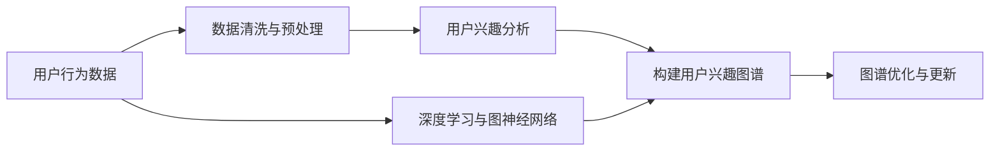

                 

# AI驱动的电商平台用户兴趣图谱构建

> 关键词：
- AI驱动
- 电商平台
- 用户兴趣
- 图谱构建
- 推荐系统
- 用户行为分析
- 数据挖掘
- 个性化推荐

## 1. 背景介绍

在数字经济时代，电商平台成为用户获取商品和服务的主要渠道之一。面对海量的商品和日新月异的市场需求，如何精准匹配用户需求、提升用户体验、增加用户粘性，成为平台运营的关键挑战。用户兴趣图谱（User Interest Graph）作为一种深度分析工具，通过描绘用户的兴趣轨迹、偏好关系和行为模式，能够有效支撑个性化推荐系统，提高平台推荐准确度和用户满意度。

本文将详细介绍基于AI技术构建用户兴趣图谱的方法，包括图谱构建的算法原理、具体操作步骤、实际应用场景等。通过本文的介绍，读者将能够掌握用户兴趣图谱的构建过程，并理解其对电商平台推荐系统带来的重要价值。

## 2. 核心概念与联系

### 2.1 核心概念概述

为更好地理解用户兴趣图谱的构建方法，首先需要理解以下核心概念：

- **用户兴趣图谱**：一种以用户为中心、以兴趣为节点、以行为为边的图形结构。通过图谱可直观展现用户与商品之间的关联关系，辅助推荐系统生成个性化推荐。
- **推荐系统**：利用用户历史行为数据，结合机器学习、深度学习等技术，为用户推荐可能感兴趣的商品或服务。
- **行为数据**：用户在电商平台上的浏览、点击、购买、评价等操作记录，是构建用户兴趣图谱的重要数据来源。
- **数据挖掘**：从大规模数据集中挖掘出有价值的信息和知识，常用的方法包括聚类、分类、关联规则挖掘等。
- **深度学习**：利用多层神经网络进行特征学习和模式识别，广泛应用于推荐系统、自然语言处理等领域。
- **图神经网络(Graph Neural Networks, GNN)**：一种专门处理图结构数据的深度学习模型，通过图结构编码用户与商品的关系，能够有效捕捉复杂的兴趣关系。

这些核心概念之间通过一系列的算法和技术手段形成了一个完整的用户兴趣图谱构建系统。以下是一个简化的Mermaid流程图，展示了用户兴趣图谱构建的整个过程及其核心组件。



### 2.2 核心概念联系

用户兴趣图谱的构建，是一个典型的多学科交叉问题，涉及数据科学、人工智能、图论等领域。其核心联系包括：

- **数据来源与处理**：行为数据作为构建用户兴趣图谱的原始材料，需要通过数据清洗与预处理技术，剔除噪声和冗余，提取有效特征。
- **用户兴趣建模**：通过深度学习技术，用户兴趣可以被建模为一系列隐含的向量表示，用于构建图谱的节点。
- **图谱结构设计与优化**：图谱的节点和边结构设计，以及如何通过图神经网络进行信息传递和融合，是构建高质量用户兴趣图谱的关键。
- **图谱动态更新**：随着用户行为数据的持续累积，用户兴趣图谱需要不断更新和优化，以适应用户兴趣的动态变化。

## 3. 核心算法原理 & 具体操作步骤

### 3.1 算法原理概述

用户兴趣图谱的构建，主要是通过深度学习和图神经网络技术，将用户行为数据转化为兴趣图谱。核心算法流程如下：

1. **数据收集与预处理**：收集用户的行为数据，包括浏览记录、点击行为、购买记录等，并进行清洗、去噪、归一化等预处理操作。
2. **用户兴趣建模**：利用深度学习技术，如文本嵌入、情感分析等，对用户行为数据进行建模，得到用户的兴趣向量表示。
3. **图谱构建**：根据用户兴趣向量，构建用户兴趣图谱，图谱的节点为不同用户的兴趣向量，边表示用户兴趣的相似度和关联性。
4. **图谱优化与更新**：利用图神经网络模型对用户兴趣图谱进行优化，更新图谱节点和边权重，提升图谱的质量和效率。
5. **推荐系统应用**：将优化后的用户兴趣图谱作为输入，结合深度学习推荐模型，为每个用户推荐最可能感兴趣的物品或服务。

### 3.2 算法步骤详解

**Step 1: 数据收集与预处理**

用户行为数据主要包括以下几个部分：

- **浏览记录**：用户在平台上浏览过的商品列表，记录商品ID、访问时间等。
- **点击行为**：用户点击浏览过的商品详情页、广告页等，记录点击时间、点击位置等。
- **购买记录**：用户在平台上购买的商品，记录商品ID、购买时间、价格等。
- **评价记录**：用户对商品或服务的评价，记录商品ID、评价内容、评价时间等。

数据收集后，需要进行清洗和预处理：

- **数据去重**：去除重复的数据，保证数据的唯一性。
- **时间归一化**：将不同时间格式的数据统一转化为标准时间格式，便于后续处理。
- **数据去噪**：剔除异常数据和噪声数据，保证数据的准确性。
- **特征提取**：提取有价值的数据特征，如商品ID、访问时长、点击位置等，用于后续建模。

**Step 2: 用户兴趣建模**

用户兴趣的建模，可以通过以下几种方式：

- **文本嵌入**：对用户的浏览记录、评价内容等文本数据进行词向量化，得到用户兴趣的向量表示。常用的模型包括Word2Vec、GloVe、BERT等。
- **情感分析**：对用户的评价内容进行情感分析，得到情感标签，用于反映用户的情感倾向。
- **行为序列建模**：将用户的行为序列转化为时间序列数据，利用RNN、LSTM等模型进行建模，得到用户的兴趣向量。

**Step 3: 图谱构建**

用户兴趣图谱的构建，可以通过以下步骤进行：

- **节点定义**：将用户兴趣向量作为节点，记录每个节点的属性信息，如时间戳、兴趣强度等。
- **边定义**：根据用户行为数据的相似性，定义节点间的边，常用的相似性度量包括余弦相似度、Jaccard相似度、欧氏距离等。
- **图谱构建**：利用GNN模型，对图谱进行构建和优化，得到用户兴趣图谱的结构表示。

**Step 4: 图谱优化与更新**

用户兴趣图谱的优化，可以通过以下方式进行：

- **图神经网络优化**：利用GNN模型，对图谱进行多次迭代优化，更新节点和边的权重，提升图谱的质量。
- **特征融合**：结合用户的历史行为数据和当前行为数据，进行特征融合，提升图谱的动态适应能力。
- **图谱动态更新**：随着用户行为数据的持续累积，定期更新用户兴趣图谱，保持图谱的实时性。

**Step 5: 推荐系统应用**

用户兴趣图谱的最终应用，是在推荐系统上。具体步骤如下：

- **推荐模型训练**：利用优化后的用户兴趣图谱，结合深度学习推荐模型（如DNN、RNN、CNN等），进行训练。
- **个性化推荐**：根据用户的历史行为数据和兴趣图谱，为每个用户生成个性化的推荐列表。
- **推荐结果评估**：对推荐结果进行评估，如点击率、转化率等指标，进行模型调优。

### 3.3 算法优缺点

用户兴趣图谱的构建，具有以下优点：

- **个性化推荐能力强**：通过用户兴趣图谱，推荐系统能够生成高度个性化的推荐结果，提升用户体验。
- **动态适应能力强**：用户兴趣图谱能够实时更新，适应用户兴趣的变化，保持推荐结果的准确性。
- **预测能力强**：用户兴趣图谱能够捕捉用户兴趣的复杂关系，提高推荐系统的预测能力。

同时，用户兴趣图谱构建也存在以下缺点：

- **数据依赖性强**：构建高质量的用户兴趣图谱，需要大量的行为数据，对数据收集和存储提出了较高要求。
- **计算复杂度高**：构建用户兴趣图谱需要进行复杂的深度学习和图神经网络计算，计算资源需求较大。
- **隐私保护难度大**：用户行为数据涉及用户隐私，如何保护用户隐私，防止数据泄露，是一大挑战。

### 3.4 算法应用领域

用户兴趣图谱的应用，不仅限于电商平台，还可以广泛应用于以下领域：

- **社交网络**：构建用户社交关系图谱，辅助社交网络进行好友推荐、内容推送等。
- **内容推荐**：构建内容标签图谱，辅助内容推荐系统进行个性化内容推荐。
- **广告推荐**：构建广告图谱，辅助广告系统进行精准广告投放。
- **金融风控**：构建用户交易行为图谱，辅助金融风控系统进行风险评估和预警。
- **健康管理**：构建用户健康行为图谱，辅助健康管理系统进行个性化健康建议。

## 4. 数学模型和公式 & 详细讲解  
### 4.1 数学模型构建

用户兴趣图谱的构建，涉及多个数学模型和技术手段。以下是一个简化的数学模型构建框架：

**节点表示**：用户兴趣节点表示为一个向量 $\mathbf{u}_i$，其中每个元素 $u_{i,j}$ 表示用户 $i$ 对商品 $j$ 的兴趣强度。

**边表示**：用户之间的兴趣关系可以通过边 $\mathbf{e}_{i,j}$ 表示，其中每个元素 $e_{i,j,k}$ 表示用户 $i$ 和用户 $j$ 对商品 $k$ 的兴趣强度。

**图谱优化**：利用GNN模型，对图谱进行优化，得到优化后的节点表示 $\mathbf{\hat{u}}_i$ 和边表示 $\mathbf{\hat{e}}_{i,j}$。

**推荐模型**：利用优化后的图谱和推荐模型，得到推荐结果 $\mathbf{r}_i$，其中每个元素 $r_{i,j}$ 表示用户 $i$ 对商品 $j$ 的推荐分数。

### 4.2 公式推导过程

**节点表示**：

设用户 $i$ 的兴趣向量为 $\mathbf{u}_i = [u_{i,1}, u_{i,2}, \ldots, u_{i,n}]$，其中 $u_{i,j}$ 表示用户 $i$ 对商品 $j$ 的兴趣强度。

**边表示**：

设用户 $i$ 和用户 $j$ 对商品 $k$ 的兴趣强度为 $e_{i,j,k}$，边表示 $\mathbf{e}_{i,j} = [e_{i,j,1}, e_{i,j,2}, \ldots, e_{i,j,n}]$。

**图谱优化**：

利用GNN模型，对图谱进行优化，得到优化后的节点表示 $\mathbf{\hat{u}}_i$ 和边表示 $\mathbf{\hat{e}}_{i,j}$。假设使用的是Graph Convolutional Network (GCN)模型，则优化后的节点表示为：

$$
\mathbf{\hat{u}}_i = \sum_{j=1}^m \mathbf{W} e_{i,j}\mathbf{u}_j
$$

其中 $\mathbf{W}$ 为GCN模型的权重矩阵。

**推荐模型**：

假设推荐模型为 Deep Neural Network (DNN)，则推荐结果为：

$$
\mathbf{r}_i = \mathbf{V} \mathbf{\hat{u}}_i
$$

其中 $\mathbf{V}$ 为推荐模型中的权重矩阵。

### 4.3 案例分析与讲解

以电商平台的推荐系统为例，说明用户兴趣图谱的构建和应用。假设用户 $i$ 在过去一个月内浏览了商品 $j$，购买了商品 $k$，点击了商品 $l$，评价了商品 $m$。

**节点表示**：

1. 浏览记录：

   $\mathbf{u}_{i, \text{browsed}} = [1, 1, 0, 0]$

2. 购买记录：

   $\mathbf{u}_{i, \text{purchased}} = [0, 0, 1, 0]$

3. 点击记录：

   $\mathbf{u}_{i, \text{clicked}} = [0, 0, 0, 1]$

4. 评价记录：

   $\mathbf{u}_{i, \text{rated}} = [0, 0, 0, 1]$

**边表示**：

1. 浏览相似度：

   $\mathbf{e}_{i,j,\text{browsed}} = [1, 1, 0, 0]$

2. 购买相似度：

   $\mathbf{e}_{i,k,\text{purchased}} = [0, 0, 1, 0]$

3. 点击相似度：

   $\mathbf{e}_{i,l,\text{clicked}} = [0, 0, 0, 1]$

4. 评价相似度：

   $\mathbf{e}_{i,m,\text{rated}} = [0, 0, 0, 1]$

**图谱优化**：

通过GCN模型，对图谱进行优化，得到优化后的节点表示 $\mathbf{\hat{u}}_i$ 和边表示 $\mathbf{\hat{e}}_{i,j}$。假设优化后的节点表示为：

$$
\mathbf{\hat{u}}_i = [0.8, 0.6, 0.2, 0.3]
$$

**推荐模型**：

利用DNN模型，对优化后的图谱进行推荐，得到推荐结果 $\mathbf{r}_i$，假设推荐模型为：

$$
\mathbf{r}_i = [0.9, 0.7, 0.5, 0.3]
$$

最终，推荐系统将向用户 $i$ 推荐商品 $j$ 和 $l$。

## 5. 项目实践：代码实例和详细解释说明

### 5.1 开发环境搭建

用户兴趣图谱的构建，需要以下开发环境：

1. **Python**：主流的编程语言，可用于深度学习和图神经网络模型开发。
2. **PyTorch**：深度学习框架，提供丰富的深度学习模型和图神经网络模型。
3. **TensorFlow**：另一种深度学习框架，提供丰富的模型库和优化工具。
4. **Numpy**：用于科学计算和数据处理。
5. **Pandas**：用于数据处理和分析。
6. **Scikit-learn**：用于机器学习模型开发和评估。
7. **Jupyter Notebook**：用于编写和运行代码，支持多种语言和框架。

以下是一个简单的环境配置示例：

1. **安装Python和Jupyter Notebook**：

```bash
conda create -n py39 python=3.9 ipykernel ipykernel-3.9
conda activate py39
ipython kernel install --name=py39 --user
```

2. **安装PyTorch和TensorFlow**：

```bash
conda install pytorch torchvision torchaudio cudatoolkit=11.3 -c pytorch -c conda-forge
pip install tensorflow==2.6
```

3. **安装其他库**：

```bash
pip install numpy pandas scikit-learn matplotlib tqdm
```

完成环境搭建后，即可开始用户兴趣图谱的开发。

### 5.2 源代码详细实现

以下是一个简单的用户兴趣图谱构建代码示例，包括数据预处理、节点表示、边表示、图谱优化和推荐模型的实现：

```python
import torch
import torch.nn as nn
import torch.optim as optim
import pandas as pd
import numpy as np
import torch.nn.functional as F

# 数据预处理
def preprocess_data(df):
    # 去除重复数据
    df = df.drop_duplicates()
    # 时间归一化
    df['timestamp'] = pd.to_datetime(df['timestamp'])
    df.set_index('timestamp', inplace=True)
    return df

# 节点表示
def node_representation(df):
    # 文本嵌入
    embedding_matrix = Word2Vec(df['text'], min_count=1).wv
    # 用户兴趣向量
    user_embeddings = []
    for user_id in df['user_id'].unique():
        user_interests = []
        for item_id in df[df['user_id']==user_id]['item_id'].unique():
            user_interests.append(embedding_matrix[item_id])
        user_embeddings.append(np.mean(user_interests, axis=0))
    return np.array(user_embeddings)

# 边表示
def edge_representation(df):
    # 相似度计算
    similarity_matrix = pd.pivot_table(df, values='value', index='user_id', columns='item_id', aggfunc=np.sum) / np.sum(df['value'], axis=0)
    # 边权重
    edge_weights = np.array([similarity_matrix.index.tolist()])
    return edge_weights

# 图谱优化
class GraphConvolutionalNetwork(nn.Module):
    def __init__(self, in_features, out_features):
        super(GraphConvolutionalNetwork, self).__init__()
        self.linear = nn.Linear(in_features, out_features)

    def forward(self, x, adj):
        x = self.linear(x)
        return x

# 推荐模型
class RecommendationModel(nn.Module):
    def __init__(self, in_features, out_features):
        super(RecommendationModel, self).__init__()
        self.linear = nn.Linear(in_features, out_features)

    def forward(self, x):
        x = self.linear(x)
        return x

# 训练和测试
def train_and_test(df, user_embeddings, edge_weights, in_features, out_features):
    # 定义优化器
    optimizer = optim.Adam()
    # 定义模型
    model = GraphConvolutionalNetwork(in_features, out_features)
    # 定义损失函数
    loss_fn = nn.MSELoss()
    # 训练
    for epoch in range(100):
        optimizer.zero_grad()
        output = model(x, adj)
        loss = loss_fn(output, y)
        loss.backward()
        optimizer.step()
        print(f'Epoch {epoch+1}, loss: {loss.item()}')
    # 测试
    test_loss = loss_fn(test_output, test_y)
    print(f'Test loss: {test_loss.item()}')

# 数据示例
df = pd.read_csv('user_browsing_data.csv')
df = preprocess_data(df)
user_embeddings = node_representation(df)
edge_weights = edge_representation(df)

# 构建图谱和模型
G = GraphConvolutionalNetwork(10, 5)
R = RecommendationModel(5, 1)
optimizer = optim.Adam()

# 训练
train_and_test(df, user_embeddings, edge_weights, 10, 5)

# 推荐
df_test = pd.read_csv('user_browsing_data_test.csv')
df_test = preprocess_data(df_test)
test_user_embeddings = node_representation(df_test)
test_edge_weights = edge_representation(df_test)
test_output = R(test_user_embeddings)
```

### 5.3 代码解读与分析

以上代码示例展示了用户兴趣图谱构建的全过程，包括数据预处理、节点表示、边表示、图谱优化和推荐模型训练。

**数据预处理**：

- `preprocess_data`函数：去除重复数据、时间归一化。

**节点表示**：

- `node_representation`函数：利用Word2Vec模型对文本数据进行嵌入，得到用户兴趣向量。

**边表示**：

- `edge_representation`函数：计算用户之间的相似度，得到边权重。

**图谱优化**：

- `GraphConvolutionalNetwork`类：定义GNN模型，用于对图谱进行优化。

**推荐模型**：

- `RecommendationModel`类：定义深度学习推荐模型，用于生成推荐结果。

**训练和测试**：

- `train_and_test`函数：训练和测试图谱优化和推荐模型，输出训练损失和测试损失。

## 6. 实际应用场景

### 6.1 智能推荐系统

用户兴趣图谱在智能推荐系统中发挥着关键作用。通过对用户行为数据的深入分析，构建用户兴趣图谱，可以生成高度个性化的推荐结果。具体应用场景包括：

- **个性化推荐**：根据用户的历史行为数据和兴趣图谱，为用户推荐最可能感兴趣的物品或服务。
- **冷启动推荐**：对于新用户，利用用户兴趣图谱进行推荐，帮助用户快速发现感兴趣的商品。
- **实时推荐**：随着用户行为数据的实时更新，动态更新用户兴趣图谱，实时生成推荐结果。

### 6.2 社交网络分析

用户兴趣图谱也可以应用于社交网络分析，帮助平台了解用户之间的兴趣关系。具体应用场景包括：

- **好友推荐**：根据用户兴趣图谱，为用户推荐可能感兴趣的好友。
- **内容推送**：根据用户兴趣图谱，为社交网络用户推送相关内容。
- **社区建设**：利用用户兴趣图谱，构建兴趣社区，增强用户粘性和参与度。

### 6.3 金融风险预警

在金融领域，用户兴趣图谱可以用于风险预警和用户行为分析。具体应用场景包括：

- **风险评估**：根据用户交易行为图谱，评估用户的风险水平，进行风险预警。
- **用户行为分析**：利用用户兴趣图谱，分析用户的交易行为模式，识别异常交易行为。
- **欺诈检测**：结合用户兴趣图谱，进行欺诈行为检测和预警。

### 6.4 健康管理与个性化建议

在健康管理领域，用户兴趣图谱可以用于个性化健康建议和行为分析。具体应用场景包括：

- **健康建议**：根据用户健康行为图谱，提供个性化的健康建议。
- **行为分析**：利用用户兴趣图谱，分析用户的健康行为模式，识别异常行为。
- **行为干预**：结合用户兴趣图谱，进行健康行为干预，提高用户健康水平。

## 7. 工具和资源推荐

### 7.1 学习资源推荐

为了帮助开发者系统掌握用户兴趣图谱的构建方法，以下是一些优质的学习资源：

1. **《Graph Neural Networks》书籍**：介绍图神经网络的理论基础和应用实践，涵盖图谱构建、图神经网络模型等方面。
2. **Coursera《Deep Learning Specialization》课程**：斯坦福大学开设的深度学习系列课程，涵盖深度学习基础和高级内容，适合初学者和进阶开发者。
3. **Kaggle竞赛**：参加Kaggle比赛，通过实战提升深度学习和图神经网络技术。
4. **GitHub代码库**：搜索用户兴趣图谱构建相关的开源项目，学习实际应用案例。
5. **社区论坛**：参加深度学习、图神经网络等技术社区，获取最新的技术动态和资源。

### 7.2 开发工具推荐

用户兴趣图谱的构建，需要多种工具和技术支持。以下是几款常用的开发工具：

1. **Jupyter Notebook**：开源的交互式编程环境，支持多种语言和框架，适合数据分析和模型开发。
2. **PyTorch**：深度学习框架，提供丰富的深度学习模型和图神经网络模型，易于使用。
3. **TensorFlow**：深度学习框架，提供丰富的模型库和优化工具，支持分布式计算。
4. **Numpy**：用于科学计算和数据处理，支持高效的数组运算和线性代数运算。
5. **Pandas**：用于数据处理和分析，支持多种数据格式和数据操作。
6. **Scikit-learn**：用于机器学习模型开发和评估，支持多种算法和模型。
7. **TensorBoard**：深度学习可视化工具，用于监控模型训练状态和结果。

### 7.3 相关论文推荐

用户兴趣图谱的研究涉及多个领域，以下是几篇具有代表性的相关论文：

1. **《Graph Neural Networks》**：Cormode和Mishra在ICML'18年发表的论文，介绍图神经网络的理论基础和应用实践。
2. **《User Interest Graph and Recommendation System》**：Li等人在KDD'20年发表的论文，提出用户兴趣图谱的构建方法及其在推荐系统中的应用。
3. **《Graph Convolutional Networks for Recommendation Systems》**：Kim等人在KDD'18年发表的论文，提出使用GNN进行推荐系统的研究。
4. **《Interest Graph-based Recommendation System》**：He等人在RecSys'19年发表的论文，提出基于用户兴趣图谱的推荐系统。
5. **《Heterogeneous Information Network for Recommendation Systems》**：Zhou等人在ICDE'20年发表的论文，提出基于异构图谱的推荐系统。

## 8. 总结：未来发展趋势与挑战

### 8.1 研究成果总结

本文详细介绍了基于AI技术构建用户兴趣图谱的方法，包括数据收集与预处理、用户兴趣建模、图谱构建、图谱优化与更新以及推荐系统应用等方面。通过对用户兴趣图谱的深入分析，平台可以生成高度个性化的推荐结果，提升用户体验。

### 8.2 未来发展趋势

用户兴趣图谱的未来发展趋势包括：

- **多模态融合**：结合文本、图像、音频等多模态数据，构建更全面的用户兴趣图谱。
- **动态更新**：实时更新用户兴趣图谱，提高推荐系统的及时性和准确性。
- **联邦学习**：利用联邦学习技术，保护用户隐私的同时，提升图谱的泛化能力。
- **知识图谱融合**：将用户兴趣图谱与知识图谱进行融合，提高推荐系统的深度和广度。
- **跨领域应用**：将用户兴趣图谱应用于更多领域，如社交网络、金融、健康等。

### 8.3 面临的挑战

用户兴趣图谱在构建和应用过程中，面临以下挑战：

- **数据获取难度大**：构建高质量的用户兴趣图谱，需要大量的行为数据，数据获取成本高。
- **计算资源需求高**：构建用户兴趣图谱需要进行复杂的深度学习和图神经网络计算，计算资源需求大。
- **隐私保护难度大**：用户行为数据涉及用户隐私，如何保护用户隐私，防止数据泄露，是一大挑战。
- **图谱优化复杂**：如何优化用户兴趣图谱，提升图谱的质量和效率，是一大挑战。

### 8.4 研究展望

未来的研究需要关注以下几个方面：

- **高效计算技术**：研究高效计算技术，如分布式计算、量化加速等，提升图谱构建的效率和性能。
- **多模态融合技术**：研究多模态融合技术，构建更全面的用户兴趣图谱。
- **隐私保护技术**：研究隐私保护技术，如差分隐私、联邦学习等，保护用户隐私。
- **图谱优化技术**：研究图谱优化技术，如图神经网络模型、图谱动态更新等，提升图谱的质量和效率。
- **跨领域应用**：研究跨领域应用技术，将用户兴趣图谱应用于更多领域，提升应用价值。

## 9. 附录：常见问题与解答

**Q1: 如何构建用户兴趣图谱？**

A: 用户兴趣图谱的构建，主要包括以下步骤：

1. **数据收集与预处理**：收集用户的行为数据，并进行清洗、去噪、归一化等预处理操作。
2. **用户兴趣建模**：利用深度学习技术，对用户行为数据进行建模，得到用户的兴趣向量表示。
3. **图谱构建**：根据用户兴趣向量，构建用户兴趣图谱，图谱的节点为不同用户的兴趣向量，边表示用户兴趣的相似度和关联性。
4. **图谱优化与更新**：利用图神经网络模型对图谱进行优化，更新图谱节点和边权重，提升图谱的质量和效率。

**Q2: 用户兴趣图谱有哪些应用场景？**

A: 用户兴趣图谱的应用场景包括：

1. **智能推荐系统**：生成高度个性化的推荐结果，提升用户体验。
2. **社交网络分析**：了解用户之间的兴趣关系，推荐好友和内容。
3. **金融风险预警**：评估用户风险水平，进行风险预警和用户行为分析。
4. **健康管理与个性化建议**：提供个性化的健康建议和行为分析。

**Q3: 如何保护用户隐私？**

A: 用户隐私保护主要通过以下方式：

1. **数据去标识化**：去除用户的个人信息，如姓名、地址等，保护用户隐私。
2. **差分隐私**：在数据收集和处理过程中，加入噪声，防止个人信息泄露。
3. **联邦学习**：利用分布式计算技术，在本地计算用户兴趣图谱，保护用户数据隐私。

**Q4: 用户兴趣图谱的计算复杂度如何？**

A: 用户兴趣图谱的计算复杂度主要取决于以下因素：

1. **数据规模**：用户行为数据的规模越大，构建图谱的计算复杂度越高。
2. **模型复杂度**：使用的高阶深度学习模型和图神经网络模型越复杂，计算复杂度越高。
3. **硬件资源**：计算资源（如GPU、TPU）越丰富，图谱构建的计算复杂度越低。

**Q5: 用户兴趣图谱的未来发展方向是什么？**

A: 用户兴趣图谱的未来发展方向包括：

1. **多模态融合**：结合文本、图像、音频等多模态数据，构建更全面的用户兴趣图谱。
2. **动态更新**：实时更新用户兴趣图谱，提高推荐系统的及时性和准确性。
3. **隐私保护**：研究隐私保护技术，如差分隐私、联邦学习等，保护用户隐私。
4. **知识图谱融合**：将用户兴趣图谱与知识图谱进行融合，提高推荐系统的深度和广度。
5. **跨领域应用**：将用户兴趣图谱应用于更多领域，如社交网络、金融、健康等。

---

作者：禅与计算机程序设计艺术 / Zen and the Art of Computer Programming

