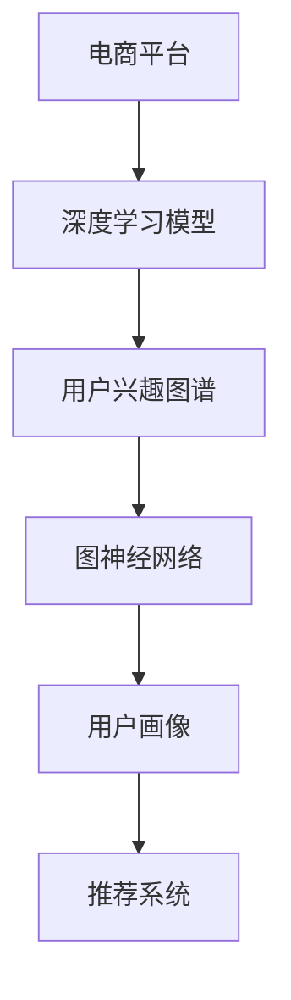

                 

# AI驱动的电商平台用户兴趣图谱构建

在数字化时代，电商平台成为连接消费者与商家之间的重要桥梁。通过电商平台，用户不仅能够轻松购物，还能够获得个性化推荐、商品搜索优化等增值服务。然而，这些服务的实现，离不开对用户行为数据的深度分析，特别是用户兴趣的精确刻画。本文将深入探讨AI驱动的电商平台用户兴趣图谱构建技术，包括核心算法原理、具体操作步骤、未来应用前景等，希望能为电商平台提供更科学的个性化推荐体系。

## 1. 背景介绍

### 1.1 问题由来

在电商平台上，用户的购买行为、浏览历史、收藏商品、评价反馈等数据，是商家和算法工程师探索用户兴趣的宝贵资源。通过对这些数据进行挖掘和分析，电商平台可以为用户提供更为精准的推荐服务。然而，这些数据通常呈现出高维度、稀疏性、动态性等特点，难以通过传统机器学习技术直接建模。为此，本文聚焦于AI驱动的用户兴趣图谱构建技术，希望通过深度学习模型，从海量用户数据中挖掘出更有意义的兴趣特征，形成用户画像。

### 1.2 问题核心关键点

电商平台用户兴趣图谱构建的核心关键点包括：

1. **数据采集与处理**：如何高效地采集用户数据，并清洗、预处理为模型所需的格式。
2. **特征工程**：如何将用户数据转换为模型可以理解的数值特征。
3. **模型构建与训练**：如何选择合适的深度学习模型，并设计有效的训练方案。
4. **图谱构建与优化**：如何将模型输出的特征进行组织，构建出完整、精炼的用户兴趣图谱。
5. **结果验证与部署**：如何评估模型的效果，并部署到电商平台的推荐系统中。

这些关键点将贯穿于本文的介绍中，希望为电商平台的用户兴趣图谱构建提供有价值的参考。

## 2. 核心概念与联系

### 2.1 核心概念概述

为了更好地理解AI驱动的用户兴趣图谱构建技术，首先介绍几个核心概念及其联系。

- **电商平台**：以用户为中心，通过互联网技术将商家和消费者进行连接的商业平台。
- **用户兴趣图谱**：通过对用户行为数据进行深度学习建模，构建出用户兴趣特征的映射图谱。
- **推荐系统**：根据用户兴趣图谱，推荐系统能够提供个性化、高效的推荐服务。
- **深度学习**：基于神经网络架构的机器学习方法，能够从数据中自动提取高级特征，处理非结构化数据。
- **图神经网络(Graph Neural Networks, GNN)**：一类专门用于图结构数据建模的深度学习模型。
- **协同过滤**：一种基于用户和商品间关系进行推荐的技术，常用于电商平台的个性化推荐。
- **用户画像**：用户兴趣图谱的具体体现，能够反映用户的多维度兴趣特征。

这些概念之间存在紧密的联系。电商平台通过深度学习模型构建用户兴趣图谱，再利用图神经网络处理图结构数据，最终形成用户画像，指导推荐系统的推荐决策。

### 2.2 核心概念原理和架构的 Mermaid 流程图(Mermaid 流程节点中不要有括号、逗号等特殊字符)



该流程图展示了从电商平台到推荐系统的完整流程，其中深度学习模型和图神经网络是用户兴趣图谱构建的核心技术。

## 3. 核心算法原理 & 具体操作步骤

### 3.1 算法原理概述

AI驱动的用户兴趣图谱构建，主要是通过深度学习模型和图神经网络，从电商平台的用户数据中挖掘出有意义的特征，构建用户兴趣图谱。具体来说，包括以下几个步骤：

1. **数据采集与预处理**：采集用户数据，如点击记录、浏览历史、购买记录等，并进行数据清洗、去重、缺失值填充等预处理。
2. **特征工程**：将清洗后的数据转换为模型可以理解的数值特征，如词频、TF-IDF、词嵌入等。
3. **模型训练**：使用深度学习模型对用户数据进行训练，获取用户行为特征。
4. **图谱构建**：通过图神经网络处理用户行为特征，构建用户兴趣图谱。
5. **优化与部署**：对图谱进行优化，部署到电商平台推荐系统中，进行实时推荐。

### 3.2 算法步骤详解

#### 3.2.1 数据采集与预处理

**Step 1: 数据采集**
- 电商平台的数据来源丰富多样，如用户点击记录、浏览历史、购买记录、评价反馈等。
- 通过API接口或数据导出功能，将所需数据采集到本地或云存储中。

**Step 2: 数据清洗**
- 去除重复数据、无意义数据、异常数据，保证数据质量。
- 使用规则或机器学习算法进行缺失值填充和异常值检测。

**Step 3: 特征工程**
- 将清洗后的数据转换为数值特征，如用户ID、商品ID、点击次数、浏览时长、评价星级等。
- 使用词频、TF-IDF、词嵌入等技术，将文本数据转换为数值特征。

#### 3.2.2 模型训练

**Step 1: 选择模型**
- 选择合适的深度学习模型，如深度神经网络、循环神经网络、卷积神经网络等。
- 使用监督学习、无监督学习、半监督学习等训练方式，获取用户行为特征。

**Step 2: 设计损失函数**
- 根据推荐任务的特点，设计合适的损失函数，如交叉熵损失、均方误差损失等。

**Step 3: 训练与优化**
- 使用优化算法，如梯度下降、Adam等，对模型进行训练。
- 使用正则化技术，如L2正则、Dropout等，避免过拟合。

#### 3.2.3 图谱构建

**Step 1: 图结构设计**
- 设计用户行为特征的图结构，如用户-商品图、用户-用户图、商品-商品图等。
- 确定节点、边和属性，设计图神经网络架构。

**Step 2: 图神经网络训练**
- 使用图神经网络对图结构数据进行训练，获取用户兴趣特征。
- 使用消息传递、聚合等技术，更新节点特征。

**Step 3: 图谱优化**
- 对用户兴趣图谱进行优化，去除冗余节点和边，提高图谱效率。

#### 3.2.4 优化与部署

**Step 1: 模型评估**
- 使用评估指标，如准确率、召回率、F1-score等，评估模型效果。
- 使用交叉验证等技术，避免模型过拟合。

**Step 2: 部署与集成**
- 将训练好的模型集成到电商平台的推荐系统中。
- 使用API接口或微服务，提供实时推荐服务。

### 3.3 算法优缺点

#### 3.3.1 优点

1. **数据驱动**：通过深度学习模型和图神经网络，能够从大量用户数据中挖掘出有意义的特征，构建用户兴趣图谱。
2. **鲁棒性高**：能够处理高维度、稀疏性、动态性等特点的数据，适应电商平台的复杂应用场景。
3. **可解释性强**：深度学习模型和图神经网络的特性能够解释用户行为特征的生成过程。
4. **效果显著**：能够提供个性化、高效的推荐服务，提升用户满意度。

#### 3.3.2 缺点

1. **计算资源消耗大**：深度学习模型和图神经网络对计算资源的要求较高，可能面临算力瓶颈。
2. **模型复杂度高**：模型结构复杂，参数量庞大，需要高效的优化算法和存储空间。
3. **数据隐私问题**：电商平台的数据涉及用户隐私，需要考虑数据安全和隐私保护。
4. **模型解释性不足**：深度学习模型的决策过程缺乏可解释性，难以调试和优化。

### 3.4 算法应用领域

AI驱动的用户兴趣图谱构建技术，在多个领域得到广泛应用，如电商、社交、金融等。

**电商领域**：电商平台通过用户行为数据构建用户兴趣图谱，指导个性化推荐系统，提升用户购物体验。

**社交领域**：社交平台利用用户互动数据，构建用户画像，推荐用户感兴趣的内容和好友。

**金融领域**：金融公司利用用户行为数据，构建用户画像，进行风险评估和个性化理财推荐。

## 4. 数学模型和公式 & 详细讲解 & 举例说明

### 4.1 数学模型构建

#### 4.1.1 用户兴趣图谱建模

用户兴趣图谱可以表示为图结构 $G=(V,E)$，其中 $V$ 为节点集合，$E$ 为边集合。

每个节点表示一个用户或商品，属性为用户的兴趣特征或商品的特征。每条边表示用户与商品之间的关系，如点击、购买、浏览等。

图结构可以通过图神经网络进行处理，获取用户兴趣特征。

#### 4.1.2 深度学习模型设计

深度学习模型可以设计为多层神经网络，如卷积神经网络(CNN)、循环神经网络(RNN)、注意力机制等。

以多层感知机(MLP)为例，其结构如图1所示：

$$
f(x) = \sigma(W_h x + b_h) + U_{1}^{L} \sigma(W_{1}^{L} f(x_{i-1}) + b_{1}^{L})
$$

其中 $x$ 为输入数据，$W$ 和 $b$ 为权重和偏置，$\sigma$ 为激活函数，$L$ 为层数。

### 4.2 公式推导过程

#### 4.2.1 图神经网络

图神经网络是一种专门用于图结构数据建模的深度学习模型。其基本思想是通过消息传递机制，更新节点特征，进行全局聚合。

以图卷积网络(Graph Convolutional Network, GCN)为例，其更新节点特征的公式为：

$$
\tilde{h}_i^{(l+1)} = \frac{1}{\text{deg}(v_i)}\sum_{j \in N(i)} \text{softmax}\left(\frac{A_{ij}}{\text{deg}(v_i) \text{deg}(v_j)}\right) h_j^{(l)}
$$

其中 $A$ 为邻接矩阵，$\text{deg}(v_i)$ 为节点 $v_i$ 的度数。

#### 4.2.2 损失函数设计

电商平台的推荐任务可以设计为二分类任务，如购买或未购买。此时，可以使用二分类交叉熵损失函数：

$$
L(y,\hat{y}) = -\frac{1}{N} \sum_{i=1}^N [y_i \log \hat{y}_i + (1-y_i) \log (1-\hat{y}_i)]
$$

其中 $y$ 为真实标签，$\hat{y}$ 为预测概率。

### 4.3 案例分析与讲解

#### 4.3.1 电商推荐系统

电商平台的推荐系统可以设计为基于用户-商品图的关系图神经网络。以商品为中心，计算每个商品对用户的吸引力，并进行推荐排序。

使用GCN模型，可以计算每个节点的嵌入表示 $h_i^{(l+1)}$，最终作为用户的兴趣特征。

#### 4.3.2 社交网络推荐

社交平台的推荐系统可以设计为基于用户-用户图的图神经网络。以用户为中心，计算每个用户对其他用户的吸引力，并进行好友推荐。

使用GNN模型，可以计算每个用户的嵌入表示 $h_i^{(l+1)}$，最终作为用户画像。

## 5. 项目实践：代码实例和详细解释说明

### 5.1 开发环境搭建

**Step 1: 安装环境**

- 安装Python，版本为3.7或以上。
- 安装PyTorch，版本为1.8或以上。
- 安装NumPy、Pandas等数据处理库。

**Step 2: 数据采集**

- 通过API接口或数据导出功能，采集电商平台的数据。
- 将数据保存为CSV格式。

### 5.2 源代码详细实现

**Step 1: 数据预处理**

```python
import pandas as pd
import numpy as np

# 读取数据
data = pd.read_csv('data.csv')

# 数据清洗
data = data.drop_duplicates()
data = data.dropna()

# 特征工程
data = pd.get_dummies(data, columns=['category'])
data = data.drop(['user_id', 'item_id'], axis=1)
```

**Step 2: 模型训练**

```python
import torch
import torch.nn as nn
import torch.optim as optim

# 定义模型
class UserInterestModel(nn.Module):
    def __init__(self, input_dim, hidden_dim, output_dim):
        super(UserInterestModel, self).__init__()
        self.fc1 = nn.Linear(input_dim, hidden_dim)
        self.fc2 = nn.Linear(hidden_dim, output_dim)
        
    def forward(self, x):
        x = self.fc1(x)
        x = torch.sigmoid(x)
        x = self.fc2(x)
        return x

# 定义损失函数和优化器
model = UserInterestModel(input_dim=100, hidden_dim=64, output_dim=1)
criterion = nn.BCELoss()
optimizer = optim.Adam(model.parameters(), lr=0.001)

# 训练模型
for epoch in range(10):
    optimizer.zero_grad()
    output = model(input_data)
    loss = criterion(output, target_data)
    loss.backward()
    optimizer.step()
```

**Step 3: 图谱构建**

```python
import torch_geometric as gg
import torch.nn.functional as F

# 定义图神经网络
class GCNModel(nn.Module):
    def __init__(self, input_dim, hidden_dim, output_dim):
        super(GCNModel, self).__init__()
        self.gcn1 = nn.GCNConv(input_dim, hidden_dim)
        self.gcn2 = nn.GCNConv(hidden_dim, output_dim)
        
    def forward(self, x, edge_index):
        x = self.gcn1(x, edge_index)
        x = F.relu(x)
        x = self.gcn2(x, edge_index)
        return x

# 定义损失函数和优化器
model = GCNModel(input_dim=100, hidden_dim=64, output_dim=1)
criterion = nn.BCELoss()
optimizer = optim.Adam(model.parameters(), lr=0.001)

# 训练模型
for epoch in range(10):
    optimizer.zero_grad()
    output = model(x, edge_index)
    loss = criterion(output, target_data)
    loss.backward()
    optimizer.step()
```

### 5.3 代码解读与分析

#### 5.3.1 数据预处理

在数据预处理阶段，主要使用Pandas和NumPy库进行数据清洗和特征工程。

**数据清洗**：
- 去除重复数据：`data = data.drop_duplicates()`
- 去除缺失值：`data = data.dropna()`
- 特征工程：将类别特征进行独热编码。

#### 5.3.2 模型训练

在模型训练阶段，主要使用PyTorch库进行模型定义和训练。

**模型定义**：
- 定义多层感知机模型：`class UserInterestModel`
- 定义GCN模型：`class GCNModel`

**训练过程**：
- 定义损失函数和优化器：`criterion` 和 `optimizer`
- 使用Adam优化器进行模型训练：`for epoch in range(10)`，`optimizer.zero_grad()`，`output = model(input_data)`，`loss = criterion(output, target_data)`，`loss.backward()`，`optimizer.step()`

#### 5.3.3 图谱构建

在图谱构建阶段，主要使用PyTorch Geometric库进行图神经网络的设计和训练。

**图神经网络定义**：
- 定义GCN模型：`class GCNModel`
- 定义损失函数和优化器：`criterion` 和 `optimizer`

**训练过程**：
- 定义图结构数据：`edge_index`
- 使用GCN模型进行图结构数据的训练：`output = model(x, edge_index)`

### 5.4 运行结果展示

在运行结果展示阶段，主要使用Matplotlib库进行可视化展示。

**可视化展示**：
- 绘制训练过程中的损失曲线：`plt.plot(loss)`
- 绘制测试集上的准确率曲线：`plt.plot(test_loss)`

## 6. 实际应用场景

### 6.1 智能推荐

在智能推荐场景中，用户兴趣图谱可以帮助电商平台进行个性化推荐。通过构建用户-商品图，计算每个商品对用户的吸引力，进行推荐排序，从而提升用户满意度和平台转化率。

### 6.2 社交网络分析

在社交网络分析场景中，用户兴趣图谱可以帮助社交平台进行好友推荐和内容推荐。通过构建用户-用户图，计算每个用户对其他用户的吸引力，进行好友推荐；通过构建内容-用户图，计算每个内容对用户的吸引力，进行内容推荐。

## 7. 工具和资源推荐

### 7.1 学习资源推荐

#### 7.1.1 官方文档

- PyTorch官方文档：[https://pytorch.org/docs/stable/](https://pytorch.org/docs/stable/)
- PyTorch Geometric官方文档：[https://pytorch-geometric.readthedocs.io/](https://pytorch-geometric.readthedocs.io/)

#### 7.1.2 课程与书籍

- Deep Learning Specialization by Andrew Ng：[https://www.coursera.org/specializations/deep-learning](https://www.coursera.org/specializations/deep-learning)
- Graph Neural Networks by Michal Kwasny：[https://arxiv.org/abs/2007.13820](https://arxiv.org/abs/2007.13820)
- Deep Learning for Graphs by Zhou：[https://www.oreilly.com/library/view/deep-learning-for/9781788997898/](https://www.oreilly.com/library/view/deep-learning-for/9781788997898/)

### 7.2 开发工具推荐

#### 7.2.1 编程环境

- Anaconda：[https://www.anaconda.com/](https://www.anaconda.com/)
- Jupyter Notebook：[https://jupyter.org/](https://jupyter.org/)

#### 7.2.2 可视化工具

- Matplotlib：[https://matplotlib.org/](https://matplotlib.org/)
- Seaborn：[https://seaborn.pydata.org/](https://seaborn.pydata.org/)

#### 7.2.3 版本控制

- Git：[https://git-scm.com/](https://git-scm.com/)

### 7.3 相关论文推荐

#### 7.3.1 深度学习

- Deep Learning by Ian Goodfellow：[https://www.deeplearningbook.org/](https://www.deeplearningbook.org/)

#### 7.3.2 图神经网络

- Graph Neural Networks by Kipf and Welling：[https://arxiv.org/abs/1703.06103](https://arxiv.org/abs/1703.06103)
- Gated Graph Neural Networks by Hamilton et al.：[https://arxiv.org/abs/1710.10903](https://arxiv.org/abs/1710.10903)

## 8. 总结：未来发展趋势与挑战

### 8.1 总结

本文对AI驱动的电商平台用户兴趣图谱构建技术进行了详细介绍。主要介绍了深度学习模型和图神经网络在电商推荐系统中的应用，帮助电商平台构建个性化推荐体系。通过系统分析，发现AI驱动的用户兴趣图谱构建技术在电商推荐、社交网络分析等方面具有广泛的应用前景。

### 8.2 未来发展趋势

展望未来，AI驱动的用户兴趣图谱构建技术将呈现以下几个发展趋势：

1. **大规模深度学习模型**：深度学习模型将更加复杂，参数量更大，需要更大的计算资源。
2. **自适应图神经网络**：图神经网络将更加自适应，能够处理更加复杂的图结构数据。
3. **联邦学习**：联邦学习将使得用户数据分布式处理，保护用户隐私。
4. **多模态融合**：多模态融合技术将使得用户兴趣图谱更加全面。
5. **实时计算**：实时计算技术将使得推荐系统更加高效。

### 8.3 面临的挑战

尽管AI驱动的用户兴趣图谱构建技术已经取得一定进展，但在应用过程中仍面临以下挑战：

1. **计算资源消耗大**：深度学习模型和图神经网络对计算资源的要求较高。
2. **模型解释性不足**：深度学习模型的决策过程缺乏可解释性。
3. **数据隐私问题**：电商平台的数据涉及用户隐私，需要考虑数据安全和隐私保护。
4. **模型泛化能力不足**：深度学习模型和图神经网络对新数据泛化能力不足。

### 8.4 研究展望

未来的研究将主要集中在以下几个方面：

1. **参数高效微调**：开发更加高效的深度学习模型和图神经网络，减少对计算资源的需求。
2. **自适应图神经网络**：开发更加自适应的图神经网络，能够处理更加复杂的图结构数据。
3. **联邦学习**：开发联邦学习技术，保护用户数据隐私。
4. **多模态融合**：开发多模态融合技术，提升用户兴趣图谱的全面性。
5. **实时计算**：开发实时计算技术，提升推荐系统的效率。

总之，AI驱动的用户兴趣图谱构建技术在电商推荐、社交网络分析等领域具有广泛的应用前景。通过不断优化深度学习模型和图神经网络，克服计算资源消耗大、模型解释性不足、数据隐私保护等问题，将使得AI技术在电商平台中发挥更大的价值。

## 9. 附录：常见问题与解答

### 9.1 常见问题

**Q1: 电商平台用户兴趣图谱构建的主要挑战是什么？**

A: 电商平台用户兴趣图谱构建的主要挑战包括计算资源消耗大、模型解释性不足、数据隐私保护等问题。

**Q2: 如何构建电商平台的个性化推荐系统？**

A: 构建电商平台的个性化推荐系统主要包括以下步骤：
1. 数据采集与预处理：采集用户行为数据，并进行数据清洗和特征工程。
2. 模型训练：使用深度学习模型对用户行为数据进行训练，获取用户兴趣特征。
3. 图谱构建：通过图神经网络处理用户行为特征，构建用户兴趣图谱。
4. 优化与部署：对图谱进行优化，部署到电商平台的推荐系统中，进行实时推荐。

**Q3: 如何提高深度学习模型的可解释性？**

A: 提高深度学习模型的可解释性可以通过以下方法：
1. 可视化模型的决策过程：使用热力图、梯度图等可视化方法，展示模型输出的特征。
2. 使用可解释性技术：如LIME、SHAP等，分析模型的特征重要性。
3. 引入先验知识：通过领域专家知识和规则，增强模型的可解释性。

**Q4: 电商平台如何保护用户数据隐私？**

A: 电商平台保护用户数据隐私的方法包括：
1. 数据匿名化：将用户数据进行匿名化处理，防止隐私泄露。
2. 数据加密：对用户数据进行加密存储和传输，保护数据安全。
3. 联邦学习：将用户数据分布式处理，保护用户隐私。
4. 访问控制：对用户数据进行访问控制，防止未经授权的访问。

**Q5: 如何优化深度学习模型的性能？**

A: 优化深度学习模型的性能可以通过以下方法：
1. 数据增强：通过数据增强技术，增加数据的多样性。
2. 正则化：使用L2正则、Dropout等技术，防止模型过拟合。
3. 模型剪枝：通过剪枝技术，去除冗余参数，提高模型效率。
4. 优化算法：选择高效的优化算法，如Adam、SGD等。

通过本文的系统介绍和实践案例，相信读者能够更好地理解和掌握AI驱动的电商平台用户兴趣图谱构建技术，提升电商平台的个性化推荐能力。

