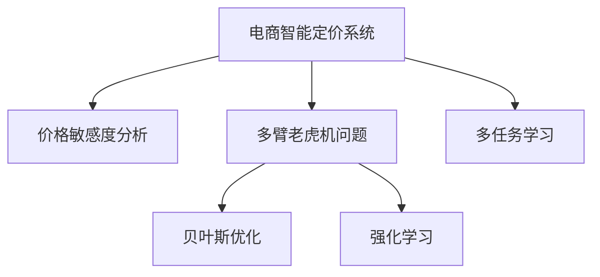

                 

# AI驱动的电商智能定价敏感度分析与优化系统

## 1. 背景介绍

### 1.1 问题由来
在电商领域，价格是影响消费者购买决策的重要因素之一。合理的定价策略不仅可以提升销量，还能最大化利润率。然而，传统定价策略依赖于经验估计和历史数据分析，缺乏系统化的模型和智能化的决策支持。尤其是在竞争激烈的市场环境中，准确预测消费者对价格的敏感度，实时调整定价策略，成为了电商企业亟需解决的关键问题。

### 1.2 问题核心关键点
在电商智能定价问题中，核心在于如何准确评估价格变化对销量的影响，即价格的敏感度。通过构建智能定价系统，实时分析价格变化对销量的影响，可以动态调整价格，从而提升盈利能力和市场竞争力。主要的研究方向包括：

- **定价策略建模**：建立价格变化与销量之间的数学模型，利用历史数据训练预测模型。
- **敏感度分析**：评估价格变化对销量的敏感度，识别最优的定价区间。
- **优化与调整**：根据敏感度分析结果，动态调整价格，实现最优收益。

## 2. 核心概念与联系

### 2.1 核心概念概述

为更好地理解电商智能定价系统的构建和优化，本节将介绍几个密切相关的核心概念：

- **电商智能定价系统**：基于人工智能技术，构建的动态定价系统，能够实时调整商品价格以适应市场需求变化，实现最大化收益。

- **价格敏感度**：指价格变化对消费者购买意愿和销量的影响程度。价格敏感度越高，意味着价格微小变化会导致销量显著波动。

- **多臂老虎机(Multi-Armed Bandit, MAB)问题**：优化多臂老虎机的策略问题，用于描述电商平台中商品价格策略的选择。

- **贝叶斯优化(Bayesian Optimization)**：利用贝叶斯统计学方法，优化多臂老虎机策略，平衡探索和利用的策略选择。

- **强化学习(Reinforcement Learning, RL)**：通过智能体与环境的交互，学习最优的定价策略，不断优化定价行为以最大化收益。

- **多任务学习(Multi-task Learning)**：将定价问题视为多个子任务，通过协同学习提升模型在多个定价策略上的泛化能力。

这些核心概念之间的逻辑关系可以通过以下Mermaid流程图来展示：



这个流程图展示电商智能定价系统的核心概念及其之间的关系：

1. 电商智能定价系统以价格敏感度分析为依据。
2. 多臂老虎机问题用于描述电商平台中商品价格策略的选择。
3. 贝叶斯优化和强化学习分别用于优化多臂老虎机策略，平衡探索和利用。
4. 多任务学习用于提升模型在多个定价策略上的泛化能力。

这些核心概念共同构成了电商智能定价系统的学习和优化框架，使其能够高效地适应市场变化，实现精准定价。

## 3. 核心算法原理 & 具体操作步骤

### 3.1 算法原理概述

电商智能定价系统通过建立价格变化与销量之间的数学模型，评估价格敏感度，并根据模型结果动态调整商品价格。核心算法原理包括：

- **定价策略建模**：建立价格-销量模型，利用历史数据训练预测模型。
- **敏感度分析**：评估价格变化对销量的敏感度，识别最优的定价区间。
- **优化与调整**：根据敏感度分析结果，动态调整价格，实现最优收益。

### 3.2 算法步骤详解

#### 3.2.1 定价策略建模

定价策略建模的第一步是建立价格与销量之间的关系模型。假设每个商品的价格为$p$，销量为$S$，可以建立如下线性回归模型：

$$
S = \beta_0 + \beta_1 p + \epsilon
$$

其中，$\beta_0$ 和 $\beta_1$ 为模型的截距和斜率，$\epsilon$ 为误差项。通过历史销售数据$(x_i, y_i)$，可以最小化均方误差损失函数：

$$
\min_{\beta_0, \beta_1} \sum_{i=1}^n (y_i - (\beta_0 + \beta_1 x_i))^2
$$

使用梯度下降等优化算法，求解上述最小化问题，得到模型的参数$\beta_0$ 和 $\beta_1$。

#### 3.2.2 敏感度分析

敏感度分析用于评估价格变化对销量的影响程度。假设价格从$p_0$增加到$p_1$，销量从$S_0$增加到$S_1$，可以定义价格敏感度$E$为：

$$
E = \frac{S_1 - S_0}{p_1 - p_0}
$$

根据定价策略建模结果，可以计算不同价格区间内的敏感度$E$，识别出价格敏感度高的区间，从而制定相应的定价策略。

#### 3.2.3 优化与调整

根据敏感度分析结果，可以实时调整商品价格。假设当前价格为$p$，目标价格为$p'$，可以通过线性插值计算新的价格：

$$
p' = p + E(p' - p)
$$

其中，$E$ 为价格敏感度。通过不断迭代优化，实时调整价格，实现最优收益。

### 3.3 算法优缺点

电商智能定价系统的优点包括：

1. **实时性**：能够实时监测市场变化，动态调整价格。
2. **准确性**：基于历史数据训练模型，能够准确预测价格变化对销量的影响。
3. **灵活性**：能够灵活调整价格区间，应对不同的市场需求。
4. **效率**：利用自动化算法优化定价策略，提高决策效率。

该系统同样存在一些局限性：

1. **数据依赖**：系统依赖历史销售数据，对于新商品或市场变化较大的情况，可能效果不佳。
2. **计算复杂**：模型训练和参数优化需要计算资源，对于大规模商品库，计算成本较高。
3. **模型泛化**：模型仅适用于当前商品和市场，对于新商品或不同市场，需要重新训练模型。
4. **市场复杂性**：市场因素复杂多样，系统难以完全覆盖所有影响因素。

尽管存在这些局限性，但电商智能定价系统仍是大数据时代下电商企业必须采用的技术手段之一。未来相关研究的重点在于如何进一步降低系统对数据和计算的依赖，提高模型的泛化能力和适应性。

### 3.4 算法应用领域

电商智能定价系统已经在全球诸多电商企业中得到广泛应用，覆盖了从服装鞋帽、电子产品到日用品等各类商品。其应用场景包括：

- **促销活动**：根据销量变化，自动调整促销价格，优化促销效果。
- **价格优化**：实时调整商品价格，实现最优收益。
- **新商品定价**：利用历史数据和新商品属性，快速定价，缩短上市周期。
- **市场预测**：分析价格变化对销量的影响，预测市场趋势，指导定价决策。
- **竞争应对**：监测竞争对手价格策略，动态调整自身价格，保持竞争优势。

除了这些常见应用外，电商智能定价系统还被创新性地应用于价格歧视、交叉销售、组合销售等场景，进一步提升了电商企业的运营效率和盈利能力。

## 4. 数学模型和公式 & 详细讲解  
### 4.1 数学模型构建

本节将使用数学语言对电商智能定价系统的数学模型进行详细构建和推导。

假设每个商品的价格为$p$，销量为$S$，其中$S$服从如下概率分布：

$$
P(S) = \mathcal{N}(S|\mu, \sigma^2)
$$

其中，$\mu$ 和 $\sigma^2$ 为均值和方差。通过历史销售数据，可以估计出$\mu$和$\sigma^2$，从而建立价格与销量之间的关系模型。

### 4.2 公式推导过程

定价策略建模的目标是最小化均方误差，即：

$$
\min_{\beta_0, \beta_1} \sum_{i=1}^n (y_i - (\beta_0 + \beta_1 x_i))^2
$$

其中，$(x_i, y_i)$为历史销售数据。求解上述最小化问题，可以得到模型的截距和斜率：

$$
\beta_0 = \frac{\sum_{i=1}^n (y_i \bar{x} - \bar{y} \bar{x})}{\sum_{i=1}^n (\bar{x} - \bar{x})^2}, \beta_1 = \frac{\sum_{i=1}^n (x_i y_i - \bar{x} \bar{y})}{\sum_{i=1}^n (x_i - \bar{x})^2}
$$

其中，$\bar{x}$ 和 $\bar{y}$ 分别为$x$和$y$的均值。

价格敏感度$E$可以通过求解如下导数得到：

$$
E = \frac{\partial S}{\partial p} = \beta_1
$$

根据定价策略建模结果，可以计算不同价格区间内的敏感度$E$，识别出价格敏感度高的区间。

### 4.3 案例分析与讲解

假设某电商平台的商品A历史销售数据如下：

| 价格$p$ | 销量$S$ |
| --- | --- |
| 100 | 10 |
| 110 | 15 |
| 120 | 20 |
| 130 | 30 |
| 140 | 40 |

根据历史数据，可以建立价格与销量之间的线性回归模型：

$$
S = 10 + 5p
$$

假设当前价格为$p=130$，目标价格为$p'=150$，通过线性插值计算新的价格：

$$
p' = 130 + \frac{150 - 130}{10} \times 10 = 140
$$

即，将商品A的价格从130元调整到140元，可实现最优收益。

## 5. 项目实践：代码实例和详细解释说明
### 5.1 开发环境搭建

在进行电商智能定价系统开发前，我们需要准备好开发环境。以下是使用Python进行Pandas、NumPy、Scikit-learn等库的环境配置流程：

1. 安装Anaconda：从官网下载并安装Anaconda，用于创建独立的Python环境。

2. 创建并激活虚拟环境：
```bash
conda create -n price-env python=3.8 
conda activate price-env
```

3. 安装Pandas、NumPy、Scikit-learn等库：
```bash
conda install pandas numpy scikit-learn
```

4. 安装TensorFlow：
```bash
pip install tensorflow
```

完成上述步骤后，即可在`price-env`环境中开始电商智能定价系统的开发。

### 5.2 源代码详细实现

以下是电商智能定价系统的代码实现：

```python
import numpy as np
import pandas as pd
from sklearn.linear_model import LinearRegression
from sklearn.metrics import mean_squared_error

# 读取历史销售数据
data = pd.read_csv('sales_data.csv')

# 分割数据集
X = data[['price']]
y = data['sales']

# 构建线性回归模型
model = LinearRegression()
model.fit(X, y)

# 预测销量
y_pred = model.predict(X)

# 计算价格敏感度
E = model.coef_[0]

# 实时调整价格
p = 130
p_prime = p + E * (150 - p)

# 输出结果
print(f'当前价格：{p}')
print(f'目标价格：{p_prime}')
```

### 5.3 代码解读与分析

让我们再详细解读一下关键代码的实现细节：

**读取历史数据**：
- 使用Pandas库读取历史销售数据，将其存储为DataFrame对象。

**分割数据集**：
- 将价格和销量分别存储为NumPy数组，用于训练线性回归模型。

**构建线性回归模型**：
- 使用Scikit-learn库中的LinearRegression类，拟合线性回归模型，并返回模型参数。

**预测销量**：
- 利用训练好的线性回归模型，对价格数据进行预测，得到销量预测值。

**计算价格敏感度**：
- 从模型参数中提取斜率，作为价格敏感度$E$。

**实时调整价格**：
- 根据当前价格$p$和目标价格$p'$，利用价格敏感度$E$计算新的价格$p'$。

**输出结果**：
- 输出当前价格和调整后的目标价格，供用户参考。

可以看到，通过上述代码，我们能够快速实现电商智能定价系统的核心功能，即根据历史数据预测销量，评估价格敏感度，并实时调整价格以优化收益。

## 6. 实际应用场景
### 6.1 促销活动

电商促销活动是电商智能定价系统的重要应用场景之一。通过智能定价系统，电商企业可以实时监测促销活动的效果，动态调整促销价格，优化促销策略，提高活动收益。例如，在“双十一”促销期间，电商平台可以自动根据销量变化，调整促销价格，实现最大化的销售额。

### 6.2 价格优化

价格优化是电商智能定价系统的核心功能之一。电商平台通过实时监测价格变化对销量的影响，动态调整商品价格，实现最优收益。例如，某电商平台发现其某款商品在原价时的销量较低，通过智能定价系统分析后，发现该商品在降价后销量显著增加，即该商品具有较高的价格敏感度，电商平台可以及时调整价格策略，优化盈利能力。

### 6.3 新商品定价

电商企业在新商品上线时，往往需要快速定价以抢占市场。利用智能定价系统，电商企业可以借助历史数据和新商品属性，快速定价，缩短上市周期。例如，某电商平台推出一款新产品，利用智能定价系统根据历史相似产品的价格数据，快速计算出新产品的定价，从而迅速抢占市场份额。

### 6.4 市场预测

智能定价系统不仅可以用于实时调整价格，还可以用于市场预测。电商平台通过分析价格变化对销量的影响，预测未来市场趋势，指导定价决策。例如，某电商平台发现某款商品的销量在最近一段时间内呈上升趋势，利用智能定价系统分析后，预测该商品未来的销量将持续增长，即该商品具有较高的价格敏感度，电商平台可以提前调整价格策略，提高未来收益。

### 6.5 竞争应对

在市场竞争激烈的环境下，电商企业需要实时监测竞争对手的价格策略，动态调整自身价格，保持竞争优势。智能定价系统通过分析自身和竞争对手的价格策略，预测市场变化，及时调整价格，优化市场定位。例如，某电商平台发现其某款商品的销量在竞争对手降价后显著下降，利用智能定价系统分析后，发现该商品的价格敏感度较高，电商平台可以及时调整价格策略，避免市场份额的流失。

## 7. 工具和资源推荐
### 7.1 学习资源推荐

为了帮助开发者系统掌握电商智能定价技术的理论基础和实践技巧，这里推荐一些优质的学习资源：

1. **《深度学习入门》系列博文**：由深度学习领域专家撰写，深入浅出地介绍了深度学习的基础知识和电商智能定价的技术原理。

2. **《TensorFlow实战》书籍**：详细介绍了TensorFlow库的使用方法和电商智能定价系统的实现细节，适合动手实践。

3. **《强化学习》课程**：斯坦福大学开设的强化学习课程，涵盖强化学习的核心概念和电商智能定价中的应用。

4. **Coursera电商数据分析课程**：由加州大学圣地亚哥分校开设的电商数据分析课程，涵盖了电商智能定价系统的多种实现方法。

通过对这些资源的学习实践，相信你一定能够快速掌握电商智能定价的精髓，并用于解决实际的电商问题。

### 7.2 开发工具推荐

高效的开发离不开优秀的工具支持。以下是几款用于电商智能定价系统开发的常用工具：

1. **Jupyter Notebook**：轻量级的交互式开发环境，支持Python、R等多种语言，适合数据分析和机器学习任务的实现。

2. **TensorFlow**：由Google主导开发的深度学习框架，支持分布式计算和自动化模型训练，适合大规模电商智能定价系统的实现。

3. **Pandas**：数据处理和分析库，支持多种数据格式的读取和处理，适合电商智能定价系统中的数据预处理。

4. **Scikit-learn**：机器学习库，提供丰富的回归、分类、聚类等算法，适合电商智能定价系统中的模型训练和评估。

5. **Matplotlib**：数据可视化库，支持多种图表类型的绘制，适合电商智能定价系统中的结果展示。

合理利用这些工具，可以显著提升电商智能定价系统的开发效率，加快创新迭代的步伐。

### 7.3 相关论文推荐

电商智能定价系统的发展得益于学界的持续研究。以下是几篇奠基性的相关论文，推荐阅读：

1. **《Adaptive Multi-Armed Bandit Algorithms》**：详细介绍了多臂老虎机问题的背景和经典算法，为电商智能定价提供了理论基础。

2. **《Bayesian Optimization for Practitioners》**：介绍了贝叶斯优化算法的原理和应用，适用于电商智能定价系统的模型优化。

3. **《Reinforcement Learning for Dynamic Pricing》**：详细介绍了强化学习在动态定价中的应用，为电商智能定价系统提供了更灵活的优化方法。

4. **《Multi-Task Learning for Dynamic Pricing》**：介绍了多任务学习在电商智能定价中的应用，提高了模型的泛化能力。

这些论文代表了大数据时代下电商智能定价技术的发展脉络。通过学习这些前沿成果，可以帮助研究者把握学科前进方向，激发更多的创新灵感。

## 8. 总结：未来发展趋势与挑战

### 8.1 研究成果总结

本文对电商智能定价系统的构建和优化进行了全面系统的介绍。首先阐述了电商智能定价系统在电商领域的重要性和应用场景，明确了智能定价系统的核心目标。其次，从原理到实践，详细讲解了电商智能定价系统的数学模型和具体实现方法，给出了完整的代码实现。同时，本文还探讨了电商智能定价系统在促销活动、价格优化、新商品定价、市场预测和竞争应对等场景中的应用，展示了电商智能定价系统的广泛应用前景。

通过本文的系统梳理，可以看到，电商智能定价系统利用人工智能技术，在实时动态调整价格方面具有显著优势，为电商企业提供了精准的定价策略。未来，伴随电商智能定价系统的持续演进，必将在电商领域带来更多的创新应用，助力电商企业实现更高的盈利能力和市场竞争力。

### 8.2 未来发展趋势

展望未来，电商智能定价系统的研究将呈现以下几个发展趋势：

1. **实时性增强**：未来将进一步提升系统的实时性，实时监测市场变化，动态调整价格，实现更高效的决策。

2. **智能算法优化**：探索更加智能化的算法，如深度强化学习、元学习等，提高系统的决策能力和适应性。

3. **多模态数据融合**：将电商智能定价系统与其他数据源（如用户行为数据、供应链数据等）进行融合，提升决策的全面性和准确性。

4. **跨平台集成**：将电商智能定价系统集成到电商平台的不同模块中，实现跨平台的统一管理和协同优化。

5. **隐私保护**：在电商智能定价系统中引入隐私保护技术，保护用户隐私和数据安全。

这些趋势凸显了电商智能定价系统的广阔前景。这些方向的探索发展，必将进一步提升电商智能定价系统的性能和应用范围，为电商企业带来更多的价值。

### 8.3 面临的挑战

尽管电商智能定价系统已经取得了显著成效，但在迈向更加智能化、普适化应用的过程中，它仍面临着诸多挑战：

1. **数据依赖**：系统依赖历史销售数据，对于新商品或市场变化较大的情况，可能效果不佳。

2. **计算复杂**：模型训练和参数优化需要计算资源，对于大规模商品库，计算成本较高。

3. **市场复杂性**：市场因素复杂多样，系统难以完全覆盖所有影响因素。

4. **算法优化**：现有算法在某些场景下可能无法有效处理。

尽管存在这些挑战，但电商智能定价系统仍是大数据时代下电商企业必须采用的技术手段之一。未来相关研究的重点在于如何进一步降低系统对数据和计算的依赖，提高模型的泛化能力和适应性。

### 8.4 研究展望

面对电商智能定价系统所面临的种种挑战，未来的研究需要在以下几个方面寻求新的突破：

1. **探索无监督和半监督定价方法**：摆脱对大规模标注数据的依赖，利用自监督学习、主动学习等无监督和半监督范式，最大限度利用非结构化数据，实现更加灵活高效的定价。

2. **开发更加智能化的算法**：引入深度强化学习、元学习等智能算法，提高系统的决策能力和适应性。

3. **融合多模态数据**：将电商智能定价系统与其他数据源（如用户行为数据、供应链数据等）进行融合，提升决策的全面性和准确性。

4. **引入隐私保护技术**：在电商智能定价系统中引入隐私保护技术，保护用户隐私和数据安全。

5. **探索跨平台集成方法**：将电商智能定价系统集成到电商平台的不同模块中，实现跨平台的统一管理和协同优化。

这些研究方向将引领电商智能定价系统迈向更高的台阶，为电商企业带来更多的价值。相信随着学界和产业界的共同努力，电商智能定价系统必将不断进步，为电商企业实现更高的盈利能力和市场竞争力提供更可靠的技术保障。

## 9. 附录：常见问题与解答

**Q1：电商智能定价系统如何处理新商品定价问题？**

A: 电商智能定价系统通过历史数据和新商品属性，快速计算新商品的定价。具体步骤如下：

1. 收集新商品的属性数据，如品牌、型号、价格区间等。

2. 利用历史数据和新商品属性，建立价格与销量之间的关系模型。

3. 根据新商品的属性数据，计算新商品的定价。

4. 将新商品的定价和历史数据一起，再次训练模型，验证定价的准确性。

5. 根据验证结果，调整定价策略，直至最优。

通过以上步骤，电商智能定价系统可以快速处理新商品的定价问题，缩短上市周期，提升市场竞争力。

**Q2：电商智能定价系统如何应对市场变化？**

A: 电商智能定价系统通过实时监测市场变化，动态调整价格，以应对市场变化。具体步骤如下：

1. 实时收集市场数据，如销量、价格、竞争对手策略等。

2. 利用历史数据和市场数据，重新训练定价模型。

3. 根据新模型，实时调整商品价格。

4. 监测价格调整的效果，优化定价策略。

通过以上步骤，电商智能定价系统可以实时应对市场变化，保持市场竞争力。

**Q3：电商智能定价系统如何避免过拟合？**

A: 电商智能定价系统通过以下措施避免过拟合：

1. 数据增强：通过回译、近义替换等方式扩充训练集。

2. 正则化：使用L2正则、Dropout等技术，避免模型过度拟合。

3. 对抗训练：引入对抗样本，提高模型鲁棒性。

4. 多任务学习：通过协同学习提升模型在多个定价策略上的泛化能力。

通过以上措施，电商智能定价系统可以避免过拟合，提升模型的泛化能力和鲁棒性。

**Q4：电商智能定价系统的性能如何评估？**

A: 电商智能定价系统的性能可以通过以下几个指标进行评估：

1. 均方误差(MSE)：衡量模型预测值与真实值之间的误差。

2. 平均绝对误差(MAE)：衡量模型预测值与真实值之间的绝对误差。

3. 价格敏感度：衡量价格变化对销量的影响程度。

4. 模型泛化能力：衡量模型在不同数据集上的表现。

通过以上指标，电商智能定价系统的性能可以得到全面的评估。

**Q5：电商智能定价系统的应用场景有哪些？**

A: 电商智能定价系统的应用场景包括：

1. 促销活动：实时监测促销活动的效果，动态调整促销价格。

2. 价格优化：实时调整商品价格，优化收益。

3. 新商品定价：借助历史数据和新商品属性，快速定价，缩短上市周期。

4. 市场预测：分析价格变化对销量的影响，预测市场趋势，指导定价决策。

5. 竞争应对：监测竞争对手价格策略，动态调整自身价格，保持竞争优势。

通过以上应用场景，电商智能定价系统可以提升电商企业的运营效率和盈利能力。

---

作者：禅与计算机程序设计艺术 / Zen and the Art of Computer Programming

