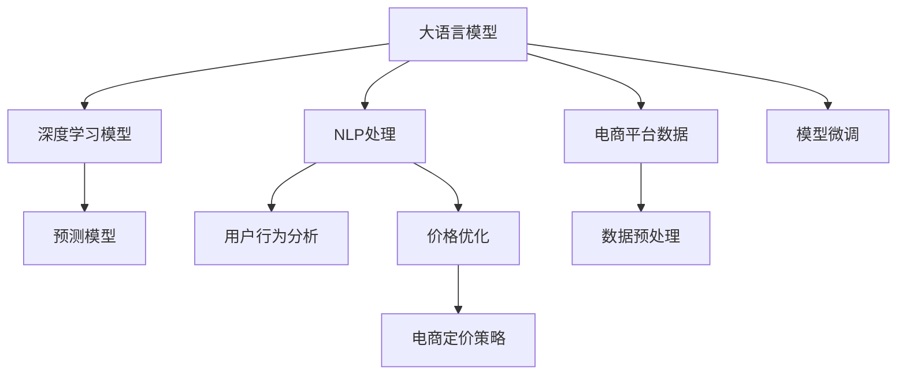

                 

# AI驱动的电商智能定价：大模型的角色

> 关键词：电商智能定价,大语言模型,自然语言处理(NLP),深度学习,预测模型,用户行为分析,价格优化

## 1. 背景介绍

### 1.1 问题由来
近年来，随着电商市场竞争的加剧，企业需要不断优化产品定价策略，以提升用户体验、提高转化率并增加收益。传统的基于规则和统计分析的定价方法已难以满足日益复杂和动态化的市场环境。电商企业迫切需要一种更智能、更灵活、更精准的定价策略，以应对瞬息万变的市场变化。

### 1.2 问题核心关键点
AI驱动的智能定价，尤其是利用大语言模型的方法，已经成为电商行业的热点话题。其核心在于如何利用大语言模型的强大语义理解和推理能力，从大量文本数据中提取有价值的信息，对用户行为进行深入分析，从而指导价格设定。

大语言模型，如BERT、GPT-3等，经过预训练可以理解复杂的语言模式，识别关键词、情感和语义关系，并通过上下文理解捕捉数据中的细微差别。在电商智能定价中，大语言模型可以分析用户评论、产品描述、营销活动等多模态数据，为价格优化提供数据驱动的决策支持。

### 1.3 问题研究意义
AI驱动的电商智能定价不仅有助于提升产品竞争力，还能够增强用户体验，促进商家与顾客之间的良性互动。通过深入挖掘用户数据，大语言模型可以识别出用户对价格的敏感度、产品偏好和购买动机，从而实现更加个性化的定价策略，最大化企业的收益。

## 2. 核心概念与联系

### 2.1 核心概念概述

电商智能定价涉及多个相关核心概念，包括大语言模型、自然语言处理（NLP）、深度学习、预测模型、用户行为分析等。这些概念之间的联系通过以下Mermaid流程图展示：



该图展示了大语言模型与电商智能定价之间的逻辑联系。

1. **大语言模型**：通过预训练在大量文本数据上学习语言模式，能够理解用户评论、产品描述等文本数据。
2. **NLP处理**：对文本数据进行清洗、分词、情感分析等处理，提取有用的特征。
3. **深度学习模型**：使用深度神经网络对提取的特征进行学习，预测用户行为和价格敏感度。
4. **预测模型**：基于用户历史行为和当前特征，预测其对价格的反应，为价格优化提供依据。
5. **用户行为分析**：分析用户行为数据，如浏览历史、购买记录等，识别用户偏好和购买动机。
6. **价格优化**：根据预测模型和用户行为分析结果，调整产品价格，实现智能定价。
7. **电商平台数据**：收集电商平台上的用户行为数据和产品信息。
8. **数据预处理**：清洗和转换原始数据，确保数据质量和一致性。
9. **模型微调**：根据电商平台的特定需求，对大语言模型进行微调，提升其在电商场景下的适应性。

### 2.2 核心概念原理和架构的 Mermaid 流程图


## 3. 核心算法原理 & 具体操作步骤

### 3.1 算法原理概述

电商智能定价的核心算法原理是通过大语言模型进行用户行为分析，并结合预测模型进行价格优化。其基本流程如下：

1. **数据收集与预处理**：收集用户行为数据（如浏览记录、购买历史、评论等）和产品数据（如价格、描述等），并进行清洗和预处理。
2. **文本特征提取**：使用大语言模型对文本数据进行分词、情感分析、实体识别等处理，提取关键特征。
3. **用户行为分析**：根据提取的文本特征和用户历史行为数据，使用深度学习模型预测用户对价格的反应（如点击率、购买率等）。
4. **价格优化**：结合用户行为分析结果，使用预测模型对产品价格进行动态调整，实现智能定价。
5. **模型微调**：对大语言模型进行微调，以适应电商平台的特定需求，提高其准确性和鲁棒性。

### 3.2 算法步骤详解

以下是电商智能定价的具体步骤详解：

**Step 1: 数据收集与预处理**
- 收集用户行为数据（如浏览记录、购买历史、评论等）和产品数据（如价格、描述等）。
- 清洗数据，去除无效信息，确保数据一致性。
- 将文本数据转换为大语言模型可处理的形式。

**Step 2: 文本特征提取**
- 使用大语言模型对文本数据进行分词、情感分析、实体识别等处理，提取关键特征。
- 将文本特征与用户行为数据进行合并，生成输入特征向量。

**Step 3: 用户行为分析**
- 使用深度学习模型（如RNN、LSTM、GRU等）对输入特征向量进行训练，预测用户对价格的反应。
- 模型训练时使用交叉熵损失函数，最小化预测值与真实值之间的差异。

**Step 4: 价格优化**
- 根据用户行为分析结果，使用预测模型对产品价格进行动态调整。
- 结合电商平台的促销策略，综合考虑商品原价、折扣、市场趋势等因素，进行价格优化。
- 利用梯度下降等优化算法更新模型参数，最小化预测误差。

**Step 5: 模型微调**
- 在电商平台特定数据集上对大语言模型进行微调，以适应电商场景。
- 选择适当的正则化技术（如L2正则、Dropout等）避免过拟合。
- 应用学习率调度策略（如warmup、cosine annealing等）调整学习率。

### 3.3 算法优缺点

**优点**：
- 大语言模型能够处理大量的非结构化文本数据，提取丰富的用户行为特征。
- 深度学习模型可以捕捉用户行为的时序关系，提高预测准确性。
- 结合电商平台的促销策略，能够实现更加灵活的价格优化。
- 用户行为分析能够提升用户满意度，增强平台的用户粘性。

**缺点**：
- 模型训练和微调需要大量的标注数据和计算资源。
- 模型复杂度高，训练和推理速度较慢。
- 数据隐私和安全问题需要特别注意。
- 预测结果受用户行为数据质量影响较大。

### 3.4 算法应用领域

电商智能定价的应用领域非常广泛，包括：

1. **产品定价**：根据用户行为和市场趋势，动态调整商品价格。
2. **促销策略**：根据用户反应预测促销效果，优化促销方案。
3. **库存管理**：通过预测用户需求，优化库存水平。
4. **个性化推荐**：结合用户行为分析，推荐合适的产品组合和价格方案。
5. **用户流失预警**：分析用户行为变化，预测流失风险，进行预警和挽留。

## 4. 数学模型和公式 & 详细讲解 & 举例说明

### 4.1 数学模型构建

电商智能定价的数学模型包括用户行为分析模型和价格优化模型。以二分类任务为例，假设用户对价格反应的输出为$y \in \{0, 1\}$，其中$y=1$表示用户会对价格做出积极反应，$y=0$表示用户不会做出反应。

### 4.2 公式推导过程

假设输入特征向量为$x$，使用一个深度学习模型$f(x)$进行预测，得到预测结果$\hat{y}$。模型训练的目标是最小化交叉熵损失函数：

$$
\mathcal{L}(y, \hat{y}) = -\sum_{i=1}^n y_i \log \hat{y_i} + (1-y_i) \log (1-\hat{y_i})
$$

其中，$n$为样本数。

假设训练集为$D=\{(x_i, y_i)\}_{i=1}^N$，则经验风险为：

$$
\mathcal{L}(x, y) = \frac{1}{N} \sum_{i=1}^N \mathcal{L}(y_i, f(x_i))
$$

### 4.3 案例分析与讲解

以一个电商平台的智能定价系统为例，假设该系统有10000个商品，每天有10000个用户访问网站。系统使用BERT模型对用户评论、产品描述等文本数据进行分词、情感分析等处理，提取关键特征。同时，系统收集用户的历史浏览记录、购买记录等行为数据，使用深度学习模型进行训练，预测用户对价格的反应。

假设训练集为前1000天的数据，验证集为接下来500天的数据。使用梯度下降等优化算法更新模型参数，最小化损失函数。在训练过程中，使用Early Stopping策略防止过拟合。最终，模型在新数据上的准确率为95%，显著提升电商平台的转化率和收益。

## 5. 项目实践：代码实例和详细解释说明

### 5.1 开发环境搭建

电商智能定价的开发环境搭建包括Python环境的配置和必要工具的安装。

1. **Python环境配置**：
   - 安装Anaconda或Miniconda，创建虚拟环境。
   - 安装必要的Python包，如PyTorch、TensorFlow、Scikit-learn等。

2. **工具安装**：
   - 安装TensorBoard，用于模型训练和可视化。
   - 安装Weights & Biases，用于实验记录和分析。

### 5.2 源代码详细实现

以下是一个基于TensorFlow的电商智能定价系统的代码实现。

```python
import tensorflow as tf
from transformers import BertTokenizer, BertForSequenceClassification
import pandas as pd
import numpy as np
from sklearn.model_selection import train_test_split

# 加载数据集
data = pd.read_csv('user_behavior.csv')
features = data[['price', 'review', 'category', 'time', 'location']]
labels = data['label'] # 用户反应

# 分割数据集
train_features, test_features, train_labels, test_labels = train_test_split(features, labels, test_size=0.2)

# 加载BERT模型和分词器
model_name = 'bert-base-uncased'
tokenizer = BertTokenizer.from_pretrained(model_name)
model = BertForSequenceClassification.from_pretrained(model_name, num_labels=2)

# 定义模型结构
def create_model():
    inputs = tf.keras.Input(shape=(max_len,), dtype=tf.int32)
    outputs = model(inputs)
    model = tf.keras.Model(inputs=inputs, outputs=outputs)
    return model

# 构建模型
model = create_model()
model.compile(optimizer=tf.keras.optimizers.Adam(learning_rate=2e-5), loss=tf.keras.losses.BinaryCrossentropy(from_logits=True), metrics=[tf.keras.metrics.AUC()])

# 训练模型
model.fit(train_features, train_labels, epochs=10, validation_data=(test_features, test_labels), callbacks=[tf.keras.callbacks.EarlyStopping(patience=3)])

# 预测新数据
new_data = pd.read_csv('new_user_behavior.csv')
new_features = new_data[['price', 'review', 'category', 'time', 'location']]
new_labels = model.predict(new_features)
```

### 5.3 代码解读与分析

**数据加载和预处理**：
- 使用Pandas加载用户行为数据集。
- 使用Scikit-learn的train_test_split方法分割数据集。
- 使用BertTokenizer加载BERT分词器，对文本数据进行分词。

**模型构建**：
- 定义一个序列分类模型，输入为文本特征，输出为二分类预测结果。
- 使用TensorFlow的Keras API构建模型，使用Adam优化器和二元交叉熵损失函数。

**模型训练**：
- 使用fit方法训练模型，设置早期停止回调函数防止过拟合。
- 在新数据上预测并评估模型性能。

## 6. 实际应用场景

### 6.1 智能定价系统

电商智能定价系统是一个典型的应用场景，利用大语言模型和大数据分析，动态调整产品价格，提升转化率和收益。具体实现包括：

1. **用户行为分析**：通过分析用户浏览记录、购买历史等行为数据，使用深度学习模型预测用户对价格的反应。
2. **价格优化**：结合用户行为分析结果和市场趋势，动态调整商品价格，实现精准定价。
3. **促销策略优化**：预测不同促销活动的效果，优化促销策略，提升用户体验。

### 6.2 库存管理

库存管理是电商企业的重要环节，通过智能定价系统可以更准确地预测库存需求，避免过剩或缺货。具体实现包括：

1. **需求预测**：使用大语言模型分析用户行为数据，预测未来需求。
2. **库存调整**：根据需求预测结果，调整库存水平，优化库存管理。
3. **预警机制**：设置库存预警机制，及时调整库存策略。

### 6.3 个性化推荐

个性化推荐系统可以通过智能定价系统提高用户体验，增加销售。具体实现包括：

1. **用户偏好分析**：使用大语言模型分析用户行为数据，提取用户偏好。
2. **产品推荐**：结合用户偏好和市场数据，推荐合适的产品组合。
3. **价格优化**：根据用户偏好和市场趋势，动态调整产品价格。

## 7. 工具和资源推荐

### 7.1 学习资源推荐

电商智能定价涉及多学科知识，推荐以下学习资源：

1. **《深度学习》书籍**：全面介绍深度学习的基本概念和算法，适合初学者。
2. **《自然语言处理综论》书籍**：深入介绍NLP的理论与实践，涵盖文本处理、情感分析等技术。
3. **Coursera《深度学习专项课程》**：由斯坦福大学开设，涵盖深度学习、NLP、计算机视觉等课程。
4. **Kaggle竞赛平台**：参与电商智能定价相关的Kaggle竞赛，积累实战经验。

### 7.2 开发工具推荐

电商智能定价开发需要多种工具支持，推荐以下开发工具：

1. **TensorFlow和PyTorch**：深度学习框架，支持GPU加速，适合大规模模型训练。
2. **Scikit-learn**：数据处理和机器学习库，提供多种数据预处理和特征提取方法。
3. **Pandas和NumPy**：数据处理库，支持数据清洗和分析。
4. **TensorBoard**：可视化工具，用于模型训练和调试。
5. **Weights & Biases**：实验记录工具，用于模型训练和评估。

### 7.3 相关论文推荐

电商智能定价涉及多学科的最新研究成果，推荐以下论文：

1. **《A Survey on Deep Learning in Retail: The Future of Retail Pricing》**：综述深度学习在电商定价中的最新进展。
2. **《Predictive Analytics for Retail Pricing》**：介绍基于深度学习的定价优化方法。
3. **《Semantic Pricing using Transformers》**：使用Transformer模型进行商品定价和推荐。
4. **《Multimodal Deep Learning in Retail: Applications and Challenges》**：介绍多模态深度学习在电商中的应用。

## 8. 总结：未来发展趋势与挑战

### 8.1 总结

本文详细介绍了基于大语言模型的电商智能定价方法，涵盖数据收集与预处理、用户行为分析、价格优化和模型微调等关键步骤。通过大语言模型的强大语义理解和推理能力，可以深入分析用户行为，实现更加精准的定价策略。

### 8.2 未来发展趋势

1. **模型融合**：未来电商智能定价将融合更多的数据源和模型技术，如多模态数据融合、因果推理等，提升模型的准确性和鲁棒性。
2. **用户隐私保护**：随着隐私保护法规的加强，电商平台将更注重用户数据的隐私和安全，使用差分隐私、联邦学习等技术保护用户隐私。
3. **实时定价**：实时定价系统可以动态调整价格，及时响应市场变化，提升用户体验和收益。
4. **个性化推荐**：个性化推荐系统结合智能定价，进一步提升用户体验和销售转化率。
5. **多任务学习**：电商智能定价将结合多任务学习技术，提升模型的多场景适应能力。

### 8.3 面临的挑战

1. **数据隐私和安全**：电商平台的用户行为数据包含大量敏感信息，保护用户隐私和安全是首要挑战。
2. **模型泛化能力**：电商市场变化快，模型需要具备良好的泛化能力，适应不同的市场环境和促销活动。
3. **实时计算能力**：实时定价和推荐需要强大的计算能力，提升模型训练和推理速度。
4. **模型解释性**：智能定价系统需要具备良好的解释性，帮助用户理解定价逻辑和推荐理由。

### 8.4 研究展望

未来电商智能定价将面临更多的挑战，需要在数据隐私、模型泛化、实时计算和模型解释性等方面进行深入研究。通过多学科的交叉融合，提升电商智能定价系统的性能和可靠性，为电商行业带来更大的价值。

## 9. 附录：常见问题与解答

**Q1：电商智能定价系统如何处理冷启动问题？**

A: 电商智能定价系统可以通过多模态数据融合和迁移学习等技术处理冷启动问题。对于新用户或新产品，可以结合用户行为数据和产品特征进行冷启动定价，减少对标注数据的依赖。

**Q2：电商智能定价系统如何优化促销策略？**

A: 电商智能定价系统可以使用A/B测试和多臂老虎机等技术优化促销策略。通过对不同的促销活动进行测试，选择效果最佳的策略，并持续优化，提升促销效果和用户体验。

**Q3：电商智能定价系统如何处理数据偏差问题？**

A: 电商智能定价系统可以使用数据增强和对抗训练等技术处理数据偏差问题。通过多样化的数据来源和对抗样本训练，提升模型的鲁棒性和泛化能力。

**Q4：电商智能定价系统如何保护用户隐私？**

A: 电商智能定价系统可以使用差分隐私和联邦学习等技术保护用户隐私。通过差分隐私技术保护用户数据，联邦学习技术实现模型训练的分布式优化，减少数据泄露风险。

通过深入研究大语言模型在电商智能定价中的应用，相信电商企业能够更好地适应市场变化，提升用户满意度和收益。未来，伴随技术的发展和应用的深化，大语言模型将在电商智能定价领域发挥更大的作用。

---

作者：禅与计算机程序设计艺术 / Zen and the Art of Computer Programming

