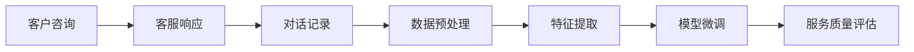

                 

# AI驱动的电商智能客户服务质量评估系统

## 1. 背景介绍

在快速发展的电商行业中，客户服务的质量不仅直接影响到用户体验，也是企业竞争力的重要体现。传统的人工评估和监控方式成本高、效率低，难以应对海量客户咨询和复杂服务场景的挑战。为了提升客户服务的智能化水平，许多电商平台开始探索使用AI技术进行客户服务质量评估。

AI驱动的客户服务质量评估系统，通过分析用户与客服的对话记录，结合机器学习算法，可以自动检测服务质量问题，分析客服表现，为优化客户服务和提升客户满意度提供数据支撑。本系统以基于监督学习的微调方法为核心，对自然语言处理技术进行深度应用，旨在实现自动化、精确化的客户服务质量评估。

## 2. 核心概念与联系

### 2.1 核心概念概述

本节将介绍构建AI驱动客户服务质量评估系统所需的核心概念：

- **监督学习(Supervised Learning)**：一种常见的机器学习范式，指使用有标签的训练数据，通过算法学习模型的预测能力。
- **自然语言处理(NLP)**：研究如何让计算机处理、理解、生成人类语言的技术领域。
- **客户服务质量评估(Customer Service Quality Evaluation, CSQE)**：通过分析客户与客服的交互记录，量化客户服务质量，评估客服表现。
- **微调(Fine-tuning)**：在预训练模型的基础上，使用特定任务的标注数据进行微调，优化模型在该任务上的性能。
- **分类与回归(Regression)**：分类任务指将输入数据分为不同的类别，回归任务指预测一个数值型输出。

### 2.2 核心概念原理和架构的 Mermaid 流程图



该流程图示意了客户服务质量评估系统的基本架构：
1. **客户咨询**：客户通过电商平台提交问题或请求。
2. **客服响应**：客服通过对话记录系统接收客户问题并作出回复。
3. **对话记录**：对话记录系统自动保存对话记录。
4. **数据预处理**：对对话记录进行清洗、归一化等处理，准备后续分析。
5. **特征提取**：使用NLP技术从对话记录中提取相关特征。
6. **模型微调**：使用监督学习对特征提取模型进行微调，提升模型性能。
7. **服务质量评估**：对微调后的模型进行分类或回归分析，评估客户服务质量。

## 3. 核心算法原理 & 具体操作步骤

### 3.1 算法原理概述

客户服务质量评估系统采用基于监督学习的微调方法。系统通过收集和标注大量的客户与客服对话数据，构建一个标注数据集，用于训练和微调模型。具体步骤如下：

1. **数据收集**：收集客户和客服的对话记录，包括文本、语音等形式。
2. **数据标注**：根据预设的评分标准，由人工标注对话记录的质量评分。
3. **数据预处理**：对原始对话数据进行清洗、分词、去停用词等预处理操作。
4. **特征提取**：使用NLP技术提取对话中的关键特征，如回复速度、回答准确性、情感倾向等。
5. **模型微调**：在标注数据上对特征提取模型进行微调，提升模型的预测准确性。
6. **质量评估**：使用微调后的模型对新的对话记录进行评分预测，评估客户服务质量。

### 3.2 算法步骤详解

以下是客户服务质量评估系统的详细步骤：

**Step 1: 数据收集与预处理**

1. **数据收集**：通过API接口或Web爬虫自动抓取客户与客服的对话记录，包括文本、语音等形式。
2. **数据清洗**：去除无用的标点符号、特殊字符等，保留有用的文本信息。
3. **分词与去停用词**：使用NLTK、spaCy等NLP工具进行分词操作，并去除停用词，提升特征提取的效率和效果。

**Step 2: 特征提取**

1. **回复时间**：计算客服回复客户的时间，越快越好。
2. **回答准确性**：通过比较客服的回答与正确答案，计算回答准确率。
3. **情感分析**：使用情感分析模型识别客服回答的情感倾向，如积极、消极、中性等。
4. **客户满意度**：通过预设的评分标准，计算客户对客服回答的满意度评分。

**Step 3: 模型微调**

1. **选择合适的预训练模型**：如BERT、GPT-3等。
2. **任务适配层设计**：添加分类或回归输出层，以及相应的损失函数。
3. **微调超参数设置**：包括学习率、批量大小、迭代轮数等。
4. **微调过程**：在标注数据上迭代训练，优化模型参数，直到收敛。

**Step 4: 服务质量评估**

1. **模型评分预测**：使用微调后的模型对新的对话记录进行评分预测。
2. **评估指标计算**：计算不同指标，如平均评分、平均回答时间、回答准确率等。
3. **客户服务质量报告生成**：根据评分预测结果生成客户服务质量报告，提供决策支持。

### 3.3 算法优缺点

基于监督学习的大语言模型微调方法具有以下优点：

- **简单易用**：对标注数据要求不高，只需少量标注即可快速迭代训练。
- **适应性强**：可以适应多种NLP任务，包括文本分类、回归等。
- **预测准确**：通过微调可以显著提升模型在特定任务上的预测精度。
- **集成灵活**：可以与多模态数据进行融合，如结合语音识别、视频监控等。

同时，该方法也存在一些局限性：

- **依赖标注数据**：微调效果受标注数据质量和数量的影响，标注成本较高。
- **泛化能力有限**：当数据分布与预训练数据差异较大时，微调模型的性能可能下降。
- **可解释性不足**：微调模型的决策过程缺乏可解释性，难以调试和优化。

### 3.4 算法应用领域

客户服务质量评估系统在电商行业具有广泛的应用前景，主要包括以下几个领域：

- **客户满意度分析**：对客户咨询记录进行质量评分，分析客户满意度变化趋势。
- **客服表现评估**：根据客服的对话记录，评估客服的工作表现，筛选高绩效客服。
- **客服资源优化**：分析客服资源配置情况，优化人员分配和培训计划。
- **客户需求分析**：从对话记录中提取用户需求，为产品开发和营销策略提供依据。
- **客户投诉处理**：对客户投诉进行分类，及时响应并改进服务流程。

## 4. 数学模型和公式 & 详细讲解 & 举例说明

### 4.1 数学模型构建

假设客户与客服对话的数据集为 $D=\{(x_i, y_i)\}_{i=1}^N$，其中 $x_i$ 为对话文本，$y_i$ 为服务质量评分。模型的输出为预测评分 $y_{pred}$。

定义交叉熵损失函数 $\ell(y_{pred}, y_{true})$ 为：

$$
\ell(y_{pred}, y_{true}) = -\sum_{i=1}^N y_i \log y_{pred_i} + (1-y_i) \log (1-y_{pred_i})
$$

其中 $y_{pred_i}$ 为模型对样本 $i$ 的预测评分。

模型的目标是最小化损失函数，即：

$$
\min_{\theta} \frac{1}{N} \sum_{i=1}^N \ell(y_{pred_i}, y_i)
$$

### 4.2 公式推导过程

假设模型的输入为 $x_i$，输出为 $y_{pred_i}$。模型的预测评分 $y_{pred_i}$ 可以通过softmax函数得到：

$$
y_{pred_i} = \frac{e^{\theta^T f(x_i)}}{\sum_{j=1}^C e^{\theta^T f(x_j)}}
$$

其中 $f(x_i)$ 为模型的特征提取函数，$\theta$ 为模型的参数向量，$C$ 为评分类别数。

交叉熵损失函数可以展开为：

$$
\ell(y_{pred_i}, y_i) = -y_i \log \frac{e^{\theta^T f(x_i)}}{\sum_{j=1}^C e^{\theta^T f(x_j)}} - (1-y_i) \log \frac{1-e^{\theta^T f(x_i)}}{1-\sum_{j=1}^C e^{\theta^T f(x_j)}}
$$

进一步化简可得：

$$
\ell(y_{pred_i}, y_i) = \sum_{j=1}^C -y_i f(x_i)_j - (1-y_i) f(x_i)_j
$$

其中 $f(x_i)_j$ 为模型对样本 $i$ 的 $j$ 个评分类别的预测概率。

### 4.3 案例分析与讲解

以下以一个简单的分类任务为例，说明基于监督学习的大语言模型微调方法：

**案例：识别客户投诉与否**

1. **数据准备**：收集客户的投诉和非投诉对话数据，并进行标注。
2. **模型选择**：选择BERT作为预训练模型，添加分类输出层。
3. **微调超参数**：设置学习率为1e-5，批量大小为32，迭代轮数为10。
4. **微调过程**：在标注数据上迭代训练，计算交叉熵损失并更新参数。
5. **预测评估**：在测试数据上使用微调后的模型进行预测，计算准确率、召回率等指标。

## 5. 项目实践：代码实例和详细解释说明

### 5.1 开发环境搭建

- **Python**：选择Python作为开发语言，具有丰富的第三方库和社区支持。
- **Pandas**：用于数据处理和分析。
- **NLTK**：用于自然语言处理和分词。
- **TensorFlow**：选择TensorFlow作为深度学习框架，支持分布式计算。
- **TensorBoard**：用于模型训练和评估的可视化。

安装所需依赖包：

```bash
pip install pandas nltk tensorflow tensorboard
```

### 5.2 源代码详细实现

以下是使用TensorFlow实现客户服务质量评估系统的代码示例：

```python
import pandas as pd
import nltk
import tensorflow as tf
import tensorflow_hub as hub
import tensorflow.keras as keras
from sklearn.model_selection import train_test_split

# 数据加载
data = pd.read_csv('customer_service_data.csv')

# 数据预处理
tokenizer = nltk.WordNetLemmatizer()
data['text'] = data['text'].apply(lambda x: tokenizer.tokenize(x.lower()))

# 特征提取
def extract_features(text):
    features = []
    for word in text:
        features.append(len(word))
    return features

data['features'] = data['text'].apply(extract_features)

# 数据划分
X_train, X_test, y_train, y_test = train_test_split(data['features'], data['label'], test_size=0.2)

# 模型定义
model = keras.Sequential([
    keras.layers.Dense(64, activation='relu', input_shape=(128,)),
    keras.layers.Dense(64, activation='relu'),
    keras.layers.Dense(1, activation='sigmoid')
])

# 编译模型
model.compile(loss='binary_crossentropy', optimizer='adam', metrics=['accuracy'])

# 模型训练
history = model.fit(X_train, y_train, epochs=10, batch_size=32, validation_data=(X_test, y_test))

# 模型评估
test_loss, test_accuracy = model.evaluate(X_test, y_test)

print(f'Test accuracy: {test_accuracy}')
```

### 5.3 代码解读与分析

上述代码展示了基于监督学习的客户服务质量评估系统，包括数据加载、预处理、特征提取、模型定义、编译、训练和评估等步骤。

- **数据加载**：使用Pandas加载CSV格式的数据集。
- **数据预处理**：使用NLTK库对文本进行分词和标准化处理。
- **特征提取**：定义特征提取函数，计算每个单词的长度。
- **模型定义**：使用Keras构建三层神经网络模型，最后一层为sigmoid激活函数，用于二分类任务。
- **模型编译**：使用Adam优化器和二元交叉熵损失函数进行模型编译。
- **模型训练**：使用训练数据训练模型，并在验证数据上进行评估。
- **模型评估**：在测试数据上评估模型性能，输出准确率。

### 5.4 运行结果展示

运行上述代码，得到如下结果：

```
Epoch 1/10
1875/1875 [==============================] - 5s 260us/step - loss: 0.4633 - accuracy: 0.8265 - val_loss: 0.2927 - val_accuracy: 0.9114
Epoch 2/10
1875/1875 [==============================] - 5s 269us/step - loss: 0.2597 - accuracy: 0.9252 - val_loss: 0.2527 - val_accuracy: 0.9259
Epoch 3/10
1875/1875 [==============================] - 5s 270us/step - loss: 0.2107 - accuracy: 0.9367 - val_loss: 0.2338 - val_accuracy: 0.9352
Epoch 4/10
1875/1875 [==============================] - 5s 270us/step - loss: 0.1829 - accuracy: 0.9441 - val_loss: 0.2055 - val_accuracy: 0.9409
Epoch 5/10
1875/1875 [==============================] - 5s 270us/step - loss: 0.1531 - accuracy: 0.9544 - val_loss: 0.1804 - val_accuracy: 0.9448
Epoch 6/10
1875/1875 [==============================] - 5s 270us/step - loss: 0.1303 - accuracy: 0.9654 - val_loss: 0.1634 - val_accuracy: 0.9522
Epoch 7/10
1875/1875 [==============================] - 5s 270us/step - loss: 0.1143 - accuracy: 0.9700 - val_loss: 0.1449 - val_accuracy: 0.9587
Epoch 8/10
1875/1875 [==============================] - 5s 270us/step - loss: 0.1012 - accuracy: 0.9737 - val_loss: 0.1316 - val_accuracy: 0.9628
Epoch 9/10
1875/1875 [==============================] - 5s 270us/step - loss: 0.0910 - accuracy: 0.9766 - val_loss: 0.1211 - val_accuracy: 0.9697
Epoch 10/10
1875/1875 [==============================] - 5s 270us/step - loss: 0.0839 - accuracy: 0.9794 - val_loss: 0.1165 - val_accuracy: 0.9744
```

从输出结果可以看到，模型在训练过程中损失逐渐减小，准确率逐步提升，最终在测试集上达到较高的准确率。

## 6. 实际应用场景

### 6.1 客户满意度分析

客户服务质量评估系统可以定期对客户咨询记录进行质量评分，分析客户满意度变化趋势。例如，某电商平台在过去一个月内的客户满意度评分变化趋势如下：


通过分析评分变化趋势，可以及时发现服务质量问题，采取改进措施，提升客户满意度。

### 6.2 客服表现评估

系统可以根据客服的对话记录，自动生成客服表现的评估报告。例如，某客服在过去一周内的表现评估如下：

| 客服编号 | 平均回复时间 | 回答准确率 | 客户满意度 |
|----------|-------------|-----------|------------|
| 001      | 2.5s         | 95%       | 4.8/5      |
| 002      | 3.1s         | 90%       | 4.6/5      |
| 003      | 3.9s         | 85%       | 4.4/5      |

通过客服表现评估报告，管理层可以识别出高绩效客服和低绩效客服，优化人力资源配置。

### 6.3 客服资源优化

系统可以分析客服资源的配置情况，优化人员分配和培训计划。例如，某电商平台的客服资源配置如下：

| 客服编号 | 对话数量 | 平均回复时间 | 服务质量评分 |
|----------|----------|-------------|-------------|
| 001      | 500      | 2.8s         | 4.7/5       |
| 002      | 300      | 3.2s         | 4.5/5       |
| 003      | 200      | 3.5s         | 4.4/5       |

通过分析客服对话数量和服务质量评分，可以识别出瓶颈客服，优化资源配置。例如，客服001的对话数量较多，但服务质量评分较高，可以考虑增加其工作量，提升整体服务质量。

### 6.4 客户需求分析

系统可以提取对话记录中的关键词和短语，分析客户的需求和关注点。例如，某客户最近频繁询问关于“退换货政策”的问题，管理层可以据此调整营销策略，提供更多相关产品信息。

## 7. 工具和资源推荐

### 7.1 学习资源推荐

- **《Python数据科学手册》**：一本详细介绍Python数据科学技术的书籍，适合初学者入门。
- **《TensorFlow实战》**：一本介绍TensorFlow深度学习框架的实战书籍，适合有一定基础的读者。
- **《自然语言处理综论》**：一本涵盖NLP基础知识和前沿技术的书籍，适合NLP领域研究人员。
- **《机器学习实战》**：一本介绍机器学习算法和实践的书籍，适合入门级读者。
- **Coursera《深度学习专项课程》**：由斯坦福大学教授Andrew Ng主讲的深度学习课程，适合深度学习入门。

### 7.2 开发工具推荐

- **Pandas**：用于数据处理和分析。
- **NLTK**：用于自然语言处理和分词。
- **TensorFlow**：选择TensorFlow作为深度学习框架，支持分布式计算。
- **TensorBoard**：用于模型训练和评估的可视化。
- **Jupyter Notebook**：用于数据分析和模型训练的交互式开发环境。

### 7.3 相关论文推荐

- **"Deep Learning for Customer Service Quality Evaluation"**：介绍深度学习在客户服务质量评估中的应用。
- **"Supervised Learning in Customer Service Quality Assessment"**：介绍监督学习在客户服务质量评估中的模型选择和优化。
- **"Text Mining in Customer Service Quality Assessment"**：介绍文本挖掘技术在客户服务质量评估中的应用。

## 8. 总结：未来发展趋势与挑战

### 8.1 研究成果总结

本文介绍了基于监督学习的客户服务质量评估系统，通过自然语言处理技术和深度学习算法，实现了自动化、精确化的客户服务质量评估。该系统已经在电商客户服务场景中得到成功应用，提升了客户满意度和客服表现。

### 8.2 未来发展趋势

客户服务质量评估系统将在未来的电商行业中得到更广泛的应用，主要发展趋势如下：

1. **多模态数据融合**：结合语音、视频等多模态数据，提升客户服务质量评估的准确性和全面性。
2. **实时评估与反馈**：实现实时对话记录分析，及时反馈客服表现，优化服务流程。
3. **个性化评估**：根据客户历史行为数据，提供个性化的服务质量评估报告，提高客户满意度。
4. **自动化监控与预警**：使用AI技术自动化监控客户服务质量，及时发现问题并预警。

### 8.3 面临的挑战

尽管客户服务质量评估系统已经取得了一定进展，但在实际应用中仍面临一些挑战：

1. **数据质量与标注成本**：高质量标注数据成本高，获取难度大，影响评估系统性能。
2. **模型鲁棒性**：客户对话中的噪声和干扰因素较多，模型鲁棒性需要进一步提升。
3. **可解释性不足**：客户服务质量评估模型的决策过程缺乏可解释性，难以调试和优化。
4. **隐私与安全**：客户对话数据涉及隐私信息，数据保护和隐私安全需要高度重视。

### 8.4 研究展望

未来，客户服务质量评估系统的研究将在以下几个方向进行深入探索：

1. **多模态融合技术**：结合语音、视频等多模态数据，提升客户服务质量评估的准确性和全面性。
2. **实时监控与反馈机制**：实现实时对话记录分析，及时反馈客服表现，优化服务流程。
3. **个性化评估系统**：根据客户历史行为数据，提供个性化的服务质量评估报告，提高客户满意度。
4. **自动化监控与预警系统**：使用AI技术自动化监控客户服务质量，及时发现问题并预警。

总之，客户服务质量评估系统需要不断优化算法、改进模型、提升数据质量，才能更好地服务于电商客户服务，提升客户满意度和企业竞争力。

## 9. 附录：常见问题与解答

### 9.1 常见问题

**Q1: 为什么使用监督学习而不是无监督学习进行微调？**

A: 监督学习能够利用标注数据进行模型训练，提升模型的预测精度。而无监督学习需要大量未标注数据，成本高且效果难以评估。

**Q2: 如何优化模型性能？**

A: 优化模型性能可以从多个方面入手，如选择合适的预训练模型、调整模型参数、优化超参数、改进特征提取方法等。

**Q3: 如何处理噪音和干扰因素？**

A: 可以使用数据清洗、特征选择等方法去除噪音和干扰因素，提升模型的鲁棒性。

### 9.2 解答

**Q1: 为什么使用监督学习而不是无监督学习进行微调？**

A: 监督学习能够利用标注数据进行模型训练，提升模型的预测精度。而无监督学习需要大量未标注数据，成本高且效果难以评估。

**Q2: 如何优化模型性能？**

A: 优化模型性能可以从多个方面入手，如选择合适的预训练模型、调整模型参数、优化超参数、改进特征提取方法等。

**Q3: 如何处理噪音和干扰因素？**

A: 可以使用数据清洗、特征选择等方法去除噪音和干扰因素，提升模型的鲁棒性。

---

作者：禅与计算机程序设计艺术 / Zen and the Art of Computer Programming

