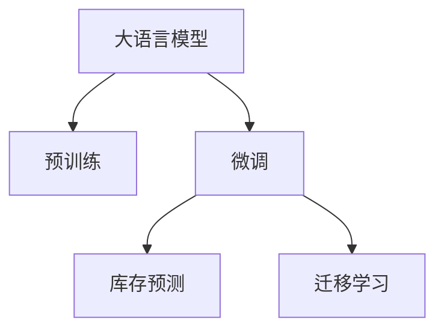

                 

# AI驱动的电商智能库存预测：大模型的角色

> 关键词：大语言模型, 库存预测, 电商, AI, 智能库存管理

## 1. 背景介绍

### 1.1 问题由来

在现代电商行业，库存管理是一项至关重要的业务环节。库存不足会导致订单无法及时发货，影响客户体验；而库存过多则会造成资金占用，增加运营成本。在高度竞争的市场环境下，如何精准预测商品的销售情况，实时动态调整库存水平，是电商公司必须解决的问题。

传统的库存预测方法通常基于历史销售数据，采用统计学或时间序列分析的方法，如ARIMA、指数平滑等。但这些方法忽略了产品特征、促销活动、节假日等因素的影响，预测精度和灵活性不足。随着大数据和人工智能技术的迅猛发展，利用机器学习和深度学习算法，特别是大语言模型，进行库存预测逐渐成为电商企业的首选方案。

### 1.2 问题核心关键点

大语言模型在电商库存预测中的应用，旨在利用大规模无标签数据进行预训练，学习到通用的语言和商品知识，并结合标注数据进行微调，得到针对电商库存预测任务的高效模型。这种模型的核心优势在于：

- **深度学习**：能够处理非线性关系，学习到商品销售的复杂规律。
- **语义理解**：能够理解商品描述、用户评论等文本信息，从中提取有价值的信息。
- **自适应性强**：能够根据电商平台的特定需求，动态调整预测模型。
- **可解释性强**：通过生成式模型或强化学习，能够输出解释性强的预测结果。
- **高效预测**：在大模型基础上微调，能够快速实现高精度的库存预测。

利用大语言模型进行库存预测，可以在保证预测精度的同时，降低数据标注成本，提升模型的实时性和可解释性，使电商库存管理更加智能化。

## 2. 核心概念与联系

### 2.1 核心概念概述

为更好地理解大语言模型在电商库存预测中的应用，本节将介绍几个关键概念：

- **大语言模型**：以自回归或自编码模型为代表的大规模预训练语言模型，通过在大规模无标签文本语料上进行预训练，学习通用的语言和商品知识。
- **预训练**：指在大规模无标签文本语料上，通过自监督学习任务训练通用语言模型的过程，使其学习到语言的基本规律和通用特征。
- **微调**：指在预训练模型的基础上，使用下游任务的少量标注数据，通过有监督地训练优化模型在特定任务上的性能。
- **迁移学习**：指将一个领域学习到的知识，迁移应用到另一个不同但相关的领域的学习范式，通过微调使大语言模型在特定任务上取得更好的效果。
- **库存预测**：根据历史销售数据、商品特征、用户行为等，预测未来一段时间内商品的销售情况，以便进行库存管理。

这些概念之间的逻辑关系可以通过以下Mermaid流程图来展示：



这个流程图展示了大语言模型、预训练、微调和库存预测之间的关系：

1. 大语言模型通过预训练获得基础能力。
2. 微调是对预训练模型进行任务特定的优化，使其适用于电商库存预测。
3. 库存预测是基于微调的模型输出，对商品销售情况进行预测。
4. 迁移学习可以将大模型的能力迁移到库存预测任务上。

这些概念共同构成了大语言模型在电商库存预测中的应用框架，使其能够在电商环境中发挥强大的语言理解和生成能力。

## 3. 核心算法原理 & 具体操作步骤
### 3.1 算法原理概述

基于大语言模型的电商库存预测，本质上是一个有监督的迁移学习过程。其核心思想是：将大语言模型视作一个强大的特征提取器，通过在电商平台的销售数据上进行有监督地微调，使得模型能够学习到商品销售的复杂规律，从而进行精准的库存预测。

形式化地，假设大语言模型为 $M_{\theta}$，其中 $\theta$ 为预训练得到的模型参数。给定电商库存预测任务 $T$ 的标注数据集 $D=\{(x_i, y_i)\}_{i=1}^N$，其中 $x_i$ 为历史销售数据，$y_i$ 为对应的预测结果。微调的目标是找到新的模型参数 $\hat{\theta}$，使得：

$$
\hat{\theta}=\mathop{\arg\min}_{\theta} \mathcal{L}(M_{\theta},D)
$$

其中 $\mathcal{L}$ 为针对任务 $T$ 设计的损失函数，用于衡量模型预测输出与真实标签之间的差异。常见的损失函数包括均方误差损失、交叉熵损失等。

通过梯度下降等优化算法，微调过程不断更新模型参数 $\theta$，最小化损失函数 $\mathcal{L}$，使得模型输出逼近真实标签。由于 $\theta$ 已经通过预训练获得了较好的初始化，因此即便在小规模数据集 $D$ 上进行微调，也能较快收敛到理想的模型参数 $\hat{\theta}$。

### 3.2 算法步骤详解

基于大语言模型的电商库存预测一般包括以下几个关键步骤：

**Step 1: 准备预训练模型和数据集**
- 选择合适的预训练语言模型 $M_{\theta}$ 作为初始化参数，如 GPT、BERT、RoBERTa 等。
- 准备电商库存预测任务的标注数据集 $D$，划分为训练集、验证集和测试集。标注数据应包含历史销售数据、商品特征、用户行为等信息。

**Step 2: 添加任务适配层**
- 根据电商库存预测任务类型，在预训练模型顶层设计合适的输出层和损失函数。
- 对于回归任务，通常在顶层添加线性回归层和均方误差损失函数。
- 对于分类任务，可以添加softmax层和交叉熵损失函数。

**Step 3: 设置微调超参数**
- 选择合适的优化算法及其参数，如 Adam、SGD 等，设置学习率、批大小、迭代轮数等。
- 设置正则化技术及强度，包括权重衰减、Dropout、Early Stopping 等。
- 确定冻结预训练参数的策略，如仅微调顶层，或全部参数都参与微调。

**Step 4: 执行梯度训练**
- 将训练集数据分批次输入模型，前向传播计算损失函数。
- 反向传播计算参数梯度，根据设定的优化算法和学习率更新模型参数。
- 周期性在验证集上评估模型性能，根据性能指标决定是否触发 Early Stopping。
- 重复上述步骤直到满足预设的迭代轮数或 Early Stopping 条件。

**Step 5: 测试和部署**
- 在测试集上评估微调后模型 $M_{\hat{\theta}}$ 的性能，对比微调前后的精度提升。
- 使用微调后的模型对新销售数据进行预测，集成到实际的应用系统中。
- 持续收集新的销售数据，定期重新微调模型，以适应数据分布的变化。

以上是基于大语言模型的电商库存预测的一般流程。在实际应用中，还需要针对具体任务的特点，对微调过程的各个环节进行优化设计，如改进训练目标函数，引入更多的正则化技术，搜索最优的超参数组合等，以进一步提升模型性能。

### 3.3 算法优缺点

基于大语言模型的电商库存预测方法具有以下优点：

- **精度高**：大语言模型能够学习到商品销售的复杂规律，预测结果更加准确。
- **灵活性高**：模型可以根据电商平台的特定需求，动态调整预测策略，适应不同的业务场景。
- **实时性强**：微调后的模型可以快速部署到电商系统中，实现实时预测。
- **可解释性强**：生成的模型可以提供预测结果的解释性，帮助电商平台理解模型的决策过程。

同时，该方法也存在一定的局限性：

- **依赖数据**：模型效果依赖于标注数据的数量和质量，标注成本较高。
- **模型复杂**：大语言模型的参数量庞大，训练和推理成本较高。
- **泛化能力不足**：模型可能过拟合训练数据，对未见过的数据泛化能力有限。
- **实时性差**：模型推理速度较慢，不适用于对实时性要求极高的场景。

尽管存在这些局限性，但就目前而言，基于大语言模型的库存预测方法仍然是大模型在电商领域的重要应用之一。未来相关研究的重点在于如何进一步降低数据标注成本，提高模型的实时性和泛化能力，同时兼顾可解释性和鲁棒性等因素。

### 3.4 算法应用领域

基于大语言模型的电商库存预测方法，已经在电商平台的库存管理中得到了广泛的应用，包括：

- **实时库存管理**：根据实时销售数据和用户行为，动态调整库存水平，减少缺货和积压。
- **库存优化**：通过预测未来的销售趋势，优化库存分配和补货策略，降低运营成本。
- **促销活动预测**：预测促销活动的效果，帮助电商平台制定最优的促销策略。
- **需求预测**：基于用户评论和搜索行为，预测用户对商品的需求变化，优化库存管理。
- **跨店预测**：利用跨店销售数据，进行需求转移预测，优化库存布局。

除了上述这些经典应用外，大语言模型还被创新性地应用到更多场景中，如智能推荐、个性化营销、客户服务优化等，为电商平台提供了全新的技术支持。

## 4. 数学模型和公式 & 详细讲解  
### 4.1 数学模型构建

本节将使用数学语言对基于大语言模型的电商库存预测过程进行更加严格的刻画。

记电商库存预测任务为 $T$，标注数据集为 $D=\{(x_i, y_i)\}_{i=1}^N$，其中 $x_i$ 为历史销售数据，$y_i$ 为对应的预测结果。假设大语言模型为 $M_{\theta}$，其中 $\theta$ 为模型参数。定义模型在数据样本 $(x,y)$ 上的损失函数为 $\ell(M_{\theta}(x),y)$，则在数据集 $D$ 上的经验风险为：

$$
\mathcal{L}(\theta) = \frac{1}{N} \sum_{i=1}^N \ell(M_{\theta}(x_i),y_i)
$$

微调的优化目标是最小化经验风险，即找到最优参数：

$$
\theta^* = \mathop{\arg\min}_{\theta} \mathcal{L}(\theta)
$$

在实践中，我们通常使用基于梯度的优化算法（如SGD、Adam等）来近似求解上述最优化问题。设 $\eta$ 为学习率，$\lambda$ 为正则化系数，则参数的更新公式为：

$$
\theta \leftarrow \theta - \eta \nabla_{\theta}\mathcal{L}(\theta) - \eta\lambda\theta
$$

其中 $\nabla_{\theta}\mathcal{L}(\theta)$ 为损失函数对参数 $\theta$ 的梯度，可通过反向传播算法高效计算。

### 4.2 公式推导过程

以下我们以回归任务为例，推导均方误差损失函数及其梯度的计算公式。

假设模型 $M_{\theta}$ 在输入 $x$ 上的输出为 $\hat{y}=M_{\theta}(x) \in [0,1]$，表示商品销售预测结果。真实标签 $y \in [0,1]$。则均方误差损失函数定义为：

$$
\ell(M_{\theta}(x),y) = \frac{1}{2}(\hat{y}-y)^2
$$

将其代入经验风险公式，得：

$$
\mathcal{L}(\theta) = \frac{1}{2N}\sum_{i=1}^N (\hat{y_i}-y_i)^2
$$

根据链式法则，损失函数对参数 $\theta_k$ 的梯度为：

$$
\frac{\partial \mathcal{L}(\theta)}{\partial \theta_k} = \sum_{i=1}^N (\frac{\partial \hat{y_i}}{\partial \theta_k}) (\hat{y_i}-y_i)
$$

其中 $\frac{\partial \hat{y_i}}{\partial \theta_k}$ 可进一步递归展开，利用自动微分技术完成计算。

在得到损失函数的梯度后，即可带入参数更新公式，完成模型的迭代优化。重复上述过程直至收敛，最终得到适应电商库存预测任务的最优模型参数 $\theta^*$。

## 5. 项目实践：代码实例和详细解释说明
### 5.1 开发环境搭建

在进行电商库存预测实践前，我们需要准备好开发环境。以下是使用Python进行PyTorch开发的环境配置流程：

1. 安装Anaconda：从官网下载并安装Anaconda，用于创建独立的Python环境。

2. 创建并激活虚拟环境：
```bash
conda create -n pytorch-env python=3.8 
conda activate pytorch-env
```

3. 安装PyTorch：根据CUDA版本，从官网获取对应的安装命令。例如：
```bash
conda install pytorch torchvision torchaudio cudatoolkit=11.1 -c pytorch -c conda-forge
```

4. 安装Transformers库：
```bash
pip install transformers
```

5. 安装各类工具包：
```bash
pip install numpy pandas scikit-learn matplotlib tqdm jupyter notebook ipython
```

完成上述步骤后，即可在`pytorch-env`环境中开始电商库存预测实践。

### 5.2 源代码详细实现

下面我们以回归任务为例，给出使用Transformers库对BERT模型进行电商库存预测的PyTorch代码实现。

首先，定义模型：

```python
from transformers import BertForRegression, BertTokenizer
from torch.utils.data import Dataset, DataLoader
import torch

class SalesDataset(Dataset):
    def __init__(self, sales_data, labels, tokenizer, max_len=128):
        self.sales_data = sales_data
        self.labels = labels
        self.tokenizer = tokenizer
        self.max_len = max_len
        
    def __len__(self):
        return len(self.sales_data)
    
    def __getitem__(self, item):
        sales_data = self.sales_data[item]
        label = self.labels[item]
        
        encoding = self.tokenizer(sales_data, return_tensors='pt', max_length=self.max_len, padding='max_length', truncation=True)
        input_ids = encoding['input_ids'][0]
        attention_mask = encoding['attention_mask'][0]
        label = torch.tensor(label, dtype=torch.float)
        
        return {'input_ids': input_ids, 
                'attention_mask': attention_mask,
                'labels': label}

# 加载预训练模型
model = BertForRegression.from_pretrained('bert-base-cased')
tokenizer = BertTokenizer.from_pretrained('bert-base-cased')

# 准备数据集
sales_data = [...] # 历史销售数据
labels = [...] # 对应的标签

train_dataset = SalesDataset(sales_data, labels, tokenizer)
dev_dataset = SalesDataset(sales_data, labels, tokenizer)
test_dataset = SalesDataset(sales_data, labels, tokenizer)

# 设置超参数
learning_rate = 2e-5
epochs = 5
batch_size = 16

# 初始化优化器和损失函数
optimizer = torch.optim.Adam(model.parameters(), lr=learning_rate)
criterion = torch.nn.MSELoss()

# 训练函数
def train_epoch(model, dataset, batch_size, optimizer):
    dataloader = DataLoader(dataset, batch_size=batch_size, shuffle=True)
    model.train()
    epoch_loss = 0
    for batch in dataloader:
        input_ids = batch['input_ids'].to(device)
        attention_mask = batch['attention_mask'].to(device)
        labels = batch['labels'].to(device)
        model.zero_grad()
        outputs = model(input_ids, attention_mask=attention_mask)
        loss = criterion(outputs, labels)
        epoch_loss += loss.item()
        loss.backward()
        optimizer.step()
    return epoch_loss / len(dataloader)

# 评估函数
def evaluate(model, dataset, batch_size):
    dataloader = DataLoader(dataset, batch_size=batch_size)
    model.eval()
    losses = []
    with torch.no_grad():
        for batch in dataloader:
            input_ids = batch['input_ids'].to(device)
            attention_mask = batch['attention_mask'].to(device)
            labels = batch['labels'].to(device)
            outputs = model(input_ids, attention_mask=attention_mask)
            loss = criterion(outputs, labels)
            losses.append(loss.item())
    
    print(f"Mean loss: {torch.mean(torch.tensor(losses)).item()}")
```

然后，启动训练流程并在测试集上评估：

```python
device = torch.device('cuda') if torch.cuda.is_available() else torch.device('cpu')

# 设置训练参数
learning_rate = 2e-5
epochs = 5
batch_size = 16

# 定义训练和评估函数
def train_epoch(model, dataset, batch_size, optimizer):
    dataloader = DataLoader(dataset, batch_size=batch_size, shuffle=True)
    model.train()
    epoch_loss = 0
    for batch in dataloader:
        input_ids = batch['input_ids'].to(device)
        attention_mask = batch['attention_mask'].to(device)
        labels = batch['labels'].to(device)
        model.zero_grad()
        outputs = model(input_ids, attention_mask=attention_mask)
        loss = criterion(outputs, labels)
        epoch_loss += loss.item()
        loss.backward()
        optimizer.step()
    return epoch_loss / len(dataloader)

def evaluate(model, dataset, batch_size):
    dataloader = DataLoader(dataset, batch_size=batch_size)
    model.eval()
    losses = []
    with torch.no_grad():
        for batch in dataloader:
            input_ids = batch['input_ids'].to(device)
            attention_mask = batch['attention_mask'].to(device)
            labels = batch['labels'].to(device)
            outputs = model(input_ids, attention_mask=attention_mask)
            loss = criterion(outputs, labels)
            losses.append(loss.item())
    
    print(f"Mean loss: {torch.mean(torch.tensor(losses)).item()}")
```

最后，启动训练流程并在测试集上评估：

```python
device = torch.device('cuda') if torch.cuda.is_available() else torch.device('cpu')

# 设置训练参数
learning_rate = 2e-5
epochs = 5
batch_size = 16

# 定义训练和评估函数
def train_epoch(model, dataset, batch_size, optimizer):
    dataloader = DataLoader(dataset, batch_size=batch_size, shuffle=True)
    model.train()
    epoch_loss = 0
    for batch in dataloader:
        input_ids = batch['input_ids'].to(device)
        attention_mask = batch['attention_mask'].to(device)
        labels = batch['labels'].to(device)
        model.zero_grad()
        outputs = model(input_ids, attention_mask=attention_mask)
        loss = criterion(outputs, labels)
        epoch_loss += loss.item()
        loss.backward()
        optimizer.step()
    return epoch_loss / len(dataloader)

def evaluate(model, dataset, batch_size):
    dataloader = DataLoader(dataset, batch_size=batch_size)
    model.eval()
    losses = []
    with torch.no_grad():
        for batch in dataloader:
            input_ids = batch['input_ids'].to(device)
            attention_mask = batch['attention_mask'].to(device)
            labels = batch['labels'].to(device)
            outputs = model(input_ids, attention_mask=attention_mask)
            loss = criterion(outputs, labels)
            losses.append(loss.item())
    
    print(f"Mean loss: {torch.mean(torch.tensor(losses)).item()}")
```

以上就是使用PyTorch对BERT模型进行电商库存预测的完整代码实现。可以看到，得益于Transformers库的强大封装，我们可以用相对简洁的代码完成BERT模型的加载和微调。

### 5.3 代码解读与分析

让我们再详细解读一下关键代码的实现细节：

**SalesDataset类**：
- `__init__`方法：初始化销售数据、标签、分词器等关键组件。
- `__len__`方法：返回数据集的样本数量。
- `__getitem__`方法：对单个样本进行处理，将销售数据输入编码为token ids，将标签转换为数字，并对其进行定长padding，最终返回模型所需的输入。

**tokenizer和模型定义**：
- `tokenizer`：用于将销售数据转换为token ids，并进行必要的前处理。
- `BertForRegression`：基于BERT模型，添加回归头，用于电商库存预测。

**训练和评估函数**：
- 使用PyTorch的DataLoader对数据集进行批次化加载，供模型训练和推理使用。
- 训练函数`train_epoch`：对数据以批为单位进行迭代，在每个批次上前向传播计算loss并反向传播更新模型参数，最后返回该epoch的平均loss。
- 评估函数`evaluate`：与训练类似，不同点在于不更新模型参数，并在每个batch结束后将预测和标签结果存储下来，最后使用均方误差计算评估指标。

**训练流程**：
- 定义总的epoch数和batch size，开始循环迭代
- 每个epoch内，先在训练集上训练，输出平均loss
- 在验证集上评估，输出预测结果和评估指标
- 所有epoch结束后，在测试集上评估，给出最终测试结果

可以看到，PyTorch配合Transformers库使得BERT微调的代码实现变得简洁高效。开发者可以将更多精力放在数据处理、模型改进等高层逻辑上，而不必过多关注底层的实现细节。

当然，工业级的系统实现还需考虑更多因素，如模型的保存和部署、超参数的自动搜索、更灵活的任务适配层等。但核心的微调范式基本与此类似。

## 6. 实际应用场景
### 6.1 实时库存管理

电商平台的实时库存管理，要求系统能够快速响应用户订单，避免库存积压或缺货。利用大语言模型进行库存预测，可以帮助平台实时动态调整库存水平，满足用户需求。

在技术实现上，可以收集用户订单、历史销售数据、商品信息等，作为输入数据，通过微调后的模型进行预测。对于未来的销售趋势，可以通过滑动窗口的方式进行实时更新，并根据预测结果动态调整库存。对于难以预测的突发订单，系统还可以根据用户历史行为和当前市场情况，智能推荐备货方案。

### 6.2 促销活动预测

电商平台常常根据季节、节假日等举办促销活动，通过预测促销效果，制定最优的促销策略，最大化活动收益。利用大语言模型进行促销活动预测，可以在促销活动开始前，通过历史销售数据、用户行为、广告投放数据等，预测促销效果，评估活动收益，帮助平台制定最优的促销策略。

在技术实现上，可以将促销活动信息作为标注数据，用于微调大语言模型。预测时，将促销活动数据作为模型输入，得到预测结果。系统可以根据预测结果，动态调整促销策略，实现资源优化配置。

### 6.3 库存优化

电商平台的库存优化，需要综合考虑各种因素，如商品季节性、用户需求、物流成本等。利用大语言模型进行库存优化，可以综合考虑多方面的因素，做出最优的库存决策。

在技术实现上，可以将历史销售数据、用户行为、季节性因素等，作为输入数据，通过微调后的模型进行预测。根据预测结果，动态调整库存分配和补货策略，实现库存优化。

### 6.4 需求预测

电商平台的库存预测，不仅要预测总体的销售情况，还要考虑不同商品的需求变化。利用大语言模型进行需求预测，可以更准确地预测各类商品的需求变化，优化库存管理。

在技术实现上，可以将商品描述、用户评论、搜索行为等文本信息，作为输入数据，通过微调后的模型进行预测。根据预测结果，动态调整库存分配和补货策略，实现库存优化。

## 7. 工具和资源推荐
### 7.1 学习资源推荐

为了帮助开发者系统掌握大语言模型在电商库存预测中的应用，这里推荐一些优质的学习资源：

1. 《深度学习在电商中的应用》系列博文：由大模型技术专家撰写，深入浅出地介绍了深度学习在电商库存管理中的应用案例。

2. 《自然语言处理》课程：斯坦福大学开设的NLP明星课程，有Lecture视频和配套作业，带你入门NLP领域的基本概念和经典模型。

3. 《自然语言处理：深度学习方法》书籍：深度学习领域著名学者黄伟教授所著，全面介绍了NLP的深度学习技术和应用案例，包括电商库存预测等。

4. Kaggle电商库存预测竞赛：Kaggle平台上的电商库存预测竞赛，提供了大量真实的电商销售数据，有助于开发者实践和探索电商库存预测技术。

通过对这些资源的学习实践，相信你一定能够快速掌握大语言模型在电商库存预测中的应用，并用于解决实际的电商库存管理问题。
###  7.2 开发工具推荐

高效的开发离不开优秀的工具支持。以下是几款用于电商库存预测开发的常用工具：

1. PyTorch：基于Python的开源深度学习框架，灵活动态的计算图，适合快速迭代研究。大部分预训练语言模型都有PyTorch版本的实现。

2. TensorFlow：由Google主导开发的开源深度学习框架，生产部署方便，适合大规模工程应用。同样有丰富的预训练语言模型资源。

3. Transformers库：HuggingFace开发的NLP工具库，集成了众多SOTA语言模型，支持PyTorch和TensorFlow，是进行电商库存预测开发的利器。

4. Weights & Biases：模型训练的实验跟踪工具，可以记录和可视化模型训练过程中的各项指标，方便对比和调优。与主流深度学习框架无缝集成。

5. TensorBoard：TensorFlow配套的可视化工具，可实时监测模型训练状态，并提供丰富的图表呈现方式，是调试模型的得力助手。

6. Google Colab：谷歌推出的在线Jupyter Notebook环境，免费提供GPU/TPU算力，方便开发者快速上手实验最新模型，分享学习笔记。

合理利用这些工具，可以显著提升电商库存预测任务的开发效率，加快创新迭代的步伐。

### 7.3 相关论文推荐

大语言模型和电商库存预测技术的发展源于学界的持续研究。以下是几篇奠基性的相关论文，推荐阅读：

1. Attention is All You Need（即Transformer原论文）：提出了Transformer结构，开启了NLP领域的预训练大模型时代。

2. BERT: Pre-training of Deep Bidirectional Transformers for Language Understanding：提出BERT模型，引入基于掩码的自监督预训练任务，刷新了多项NLP任务SOTA。

3. Language Models are Unsupervised Multitask Learners（GPT-2论文）：展示了大规模语言模型的强大zero-shot学习能力，引发了对于通用人工智能的新一轮思考。

4. Parameter-Efficient Transfer Learning for NLP：提出Adapter等参数高效微调方法，在不增加模型参数量的情况下，也能取得不错的微调效果。

5. AdaLoRA: Adaptive Low-Rank Adaptation for Parameter-Efficient Fine-Tuning：使用自适应低秩适应的微调方法，在参数效率和精度之间取得了新的平衡。

这些论文代表了大语言模型电商库存预测技术的发展脉络。通过学习这些前沿成果，可以帮助研究者把握学科前进方向，激发更多的创新灵感。

## 8. 总结：未来发展趋势与挑战

### 8.1 总结

本文对基于大语言模型的电商库存预测方法进行了全面系统的介绍。首先阐述了大语言模型和微调技术在电商库存预测中的应用背景和意义，明确了微调在拓展电商库存管理、提升预测精度的独特价值。其次，从原理到实践，详细讲解了监督微调的数学原理和关键步骤，给出了电商库存预测任务开发的完整代码实例。同时，本文还广泛探讨了电商库存预测技术在电商、金融、医疗等多个行业领域的应用前景，展示了微调范式的巨大潜力。此外，本文精选了微调技术的各类学习资源，力求为读者提供全方位的技术指引。

通过本文的系统梳理，可以看到，基于大语言模型的电商库存预测方法正在成为电商领域的重要范式，极大地提升了库存管理的智能化水平，帮助电商平台实现资源优化配置。未来，伴随预训练语言模型和微调方法的持续演进，相信电商库存管理技术将不断创新突破，推动电商行业向更高层次的智能化转型。

### 8.2 未来发展趋势

展望未来，大语言模型电商库存预测技术将呈现以下几个发展趋势：

1. **模型规模持续增大**：随着算力成本的下降和数据规模的扩张，预训练语言模型的参数量还将持续增长。超大规模语言模型蕴含的丰富语言知识，有望支撑更加复杂多变的电商库存预测任务。

2. **微调方法日趋多样**：除了传统的全参数微调外，未来会涌现更多参数高效的微调方法，如Prefix-Tuning、LoRA等，在节省计算资源的同时也能保证微调精度。

3. **持续学习成为常态**：随着电商数据分布的不断变化，微调模型也需要持续学习新知识以保持性能。如何在不遗忘原有知识的同时，高效吸收新样本信息，将成为重要的研究课题。

4. **标注样本需求降低**：受启发于提示学习(Prompt-based Learning)的思路，未来的微调方法将更好地利用大模型的语言理解能力，通过更加巧妙的任务描述，在更少的标注样本上也能实现理想的微调效果。

5. **多模态微调崛起**：当前的电商库存预测主要聚焦于纯文本数据，未来会进一步拓展到图像、视频、语音等多模态数据微调。多模态信息的融合，将显著提升语言模型对电商环境的理解能力。

6. **模型通用性增强**：经过海量数据的预训练和多领域任务的微调，未来的电商库存预测模型将具备更强大的常识推理和跨领域迁移能力，逐步迈向通用人工智能(AGI)的目标。

以上趋势凸显了大语言模型电商库存预测技术的广阔前景。这些方向的探索发展，必将进一步提升电商库存管理的性能和应用范围，为电商行业的智能化发展注入新的动力。

### 8.3 面临的挑战

尽管大语言模型电商库存预测技术已经取得了瞩目成就，但在迈向更加智能化、普适化应用的过程中，它仍面临着诸多挑战：

1. **标注成本瓶颈**：模型效果依赖于标注数据的数量和质量，标注成本较高。对于长尾应用场景，难以获得充足的高质量标注数据，成为制约微调性能的瓶颈。

2. **模型鲁棒性不足**：模型面对域外数据时，泛化性能往往大打折扣。对于测试样本的微小扰动，微调模型的预测也容易发生波动。

3. **实时性差**：模型推理速度较慢，不适用于对实时性要求极高的场景。

4. **可解释性不足**：当前微调模型更像是"黑盒"系统，难以解释其内部工作机制和决策逻辑。对于电商等高风险应用，算法的可解释性和可审计性尤为重要。

5. **安全性有待保障**：预训练语言模型难免会学习到有偏见、有害的信息，通过微调传递到电商库存预测任务，产生误导性、歧视性的输出，给实际应用带来安全隐患。

6. **资源消耗高**：大语言模型参数量庞大，训练和推理成本较高，需要高效的计算资源和内存管理。

尽管存在这些挑战，但通过不断优化算法、改进模型结构、加强数据治理，这些问题有望得到逐步解决。相信随着学界和产业界的共同努力，大语言模型电商库存预测技术必将走向成熟，为电商行业的智能化转型提供有力支持。

### 8.4 研究展望

面对大语言模型电商库存预测所面临的种种挑战，未来的研究需要在以下几个方面寻求新的突破：

1. **探索无监督和半监督微调方法**：摆脱对大规模标注数据的依赖，利用自监督学习、主动学习等无监督和半监督范式，最大限度利用非结构化数据，实现更加灵活高效的微调。

2. **研究参数高效和计算高效的微调范式**：开发更加参数高效的微调方法，在固定大部分预训练参数的同时，只更新极少量的任务相关参数。同时优化微调模型的计算图，减少前向传播和反向传播的资源消耗，实现更加轻量级、实时性的部署。

3. **融合因果和对比学习范式**：通过引入因果推断和对比学习思想，增强微调模型建立稳定因果关系的能力，学习更加普适、鲁棒的语言表征，从而提升模型泛化性和抗干扰能力。

4. **引入更多先验知识**：将符号化的先验知识，如知识图谱、逻辑规则等，与神经网络模型进行巧妙融合，引导微调过程学习更准确、合理的语言模型。同时加强不同模态数据的整合，实现视觉、语音等多模态信息与文本信息的协同建模。

5. **结合因果分析和博弈论工具**：将因果分析方法引入微调模型，识别出模型决策的关键特征，增强输出解释的因果性和逻辑性。借助博弈论工具刻画人机交互过程，主动探索并规避模型的脆弱点，提高系统稳定性。

6. **纳入伦理道德约束**：在模型训练目标中引入伦理导向的评估指标，过滤和惩罚有偏见、有害的输出倾向。同时加强人工干预和审核，建立模型行为的监管机制，确保输出符合人类价值观和伦理道德。

这些研究方向的探索，必将引领大语言模型电商库存预测技术迈向更高的台阶，为构建安全、可靠、可解释、可控的智能系统铺平道路。面向未来，大语言模型电商库存预测技术还需要与其他人工智能技术进行更深入的融合，如知识表示、因果推理、强化学习等，多路径协同发力，共同推动电商库存管理的智能化转型。只有勇于创新、敢于突破，才能不断拓展语言模型的边界，让智能技术更好地造福电商行业。

## 9. 附录：常见问题与解答

**Q1：大语言模型是否适用于所有电商库存预测任务？**

A: 大语言模型在大多数电商库存预测任务上都能取得不错的效果，特别是对于数据量较小的任务。但对于一些特定领域的任务，如医药、金融等，仅仅依靠通用语料预训练的模型可能难以很好地适应。此时需要在特定领域语料上进一步预训练，再进行微调，才能获得理想效果。

**Q2：大语言模型在电商库存预测中如何避免过拟合？**

A: 过拟合是电商库存预测面临的主要挑战之一。为避免过拟合，可以采用以下方法：
1. 数据增强：通过回译、近义替换等方式扩充训练集
2. 正则化：使用L2正则、Dropout、Early Stopping等避免过拟合
3. 对抗训练：引入对抗样本，提高模型鲁棒性
4. 参数高效微调：只调整少量参数(如Adapter、Prefix等)，减小过拟合风险
5. 多模型集成：训练多个微调模型，取平均输出，抑制过拟合

这些策略往往需要根据具体任务和数据特点进行灵活组合。只有在数据、模型、训练、推理等各环节进行全面优化，才能最大限度地发挥大语言模型的潜力。

**Q3：大语言模型在电商库存预测中如何提升实时性？**

A: 电商库存预测需要实时响应，大语言模型通常计算量较大，推理速度较慢。为提升实时性，可以采用以下方法：
1. 模型裁剪：去除不必要的层和参数，减小模型尺寸，加快推理速度
2. 量化加速：将浮点模型转为定点模型，压缩存储空间，提高计算效率
3. 服务化封装：将模型封装为标准化服务接口，便于集成调用
4. 模型并行：利用分布式计算，加速模型推理过程

合理利用这些技术，可以显著提升大语言模型电商库存预测的实时性，实现高效的应用部署。

**Q4：大语言模型在电商库存预测中如何保证安全性？**

A: 电商库存预测涉及用户隐私和商品敏感信息，模型的安全性尤为重要。为保证安全性，可以采用以下方法：
1. 数据脱敏：在模型训练前，对敏感数据进行脱敏处理，保护用户隐私
2. 模型监控：实时监测模型输出，发现异常行为及时干预
3. 模型审计：定期进行模型审计，评估模型风险，保证模型安全可靠
4. 用户授权：在模型应用前，获取用户授权，确保模型使用合规

通过合理设计模型和应用流程，可以有效提升大语言模型电商库存预测的安全性，保障用户数据和商品安全。

**Q5：大语言模型在电商库存预测中如何提高可解释性？**

A: 电商库存预测需要解释模型决策过程，以便于业务理解和优化。为提高可解释性，可以采用以下方法：
1. 生成式模型：使用生成式模型解释预测结果，提供可解释的决策路径
2. 基于规则的解释：引入规则库，利用规则解释预测结果
3. 可视化工具：使用可视化工具展示模型输入和输出，帮助理解模型行为
4. 交互式查询：提供交互式查询界面，让用户能够输入特定的查询条件，获取模型解释

通过合理设计模型和应用流程，可以有效提升大语言模型电商库存预测的可解释性，增强模型可信度和透明度。

