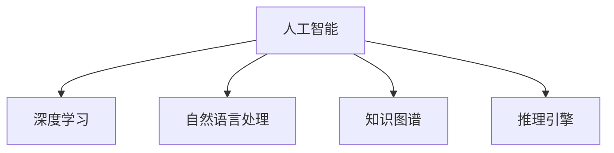

                 

# AI驱动的知识发现：超越简单搜索

## 1. 背景介绍

在信息爆炸的现代社会，知识的获取变得前所未有的容易，但同时也带来了信息的泛滥和筛选困难。传统的搜索引擎已经无法满足用户深度知识发现的需求，需要一种全新的解决方案。AI驱动的知识发现技术，通过对海量数据进行自动化的智能分析，帮助用户快速获取深层次、结构化的知识，超越简单搜索。

### 1.1 问题由来

随着互联网和社交媒体的普及，人类每天产生的数据量已经远远超出了人类的处理能力。据估计，全球每年产生的数据量已经达到几近ZB的级别。在这样的背景下，传统的搜索引擎无法满足人们对知识的深度挖掘和智能推理的需求。传统搜索引擎仅仅基于关键词匹配，无法理解用户的深层次需求，也难以整合和挖掘知识之间的深层关联。

而AI驱动的知识发现技术，通过深度学习模型和自然语言处理技术，可以理解用户的查询意图，从海量数据中自动抽取、关联和整合知识，生成更深入、结构化的回答。它不仅能够帮助用户获得传统搜索难以触及的隐藏知识，还能够通过逻辑推理，挖掘出数据背后的深层关联，为科学研究、商业决策等提供强有力的支持。

### 1.2 问题核心关键点

AI驱动的知识发现技术，基于AI的深度学习、自然语言处理和知识图谱等技术，将用户查询转化为结构化的问题，自动从海量数据中抽取、整合和推理知识，生成结构化的回答。与传统搜索引擎相比，核心关键点包括：

- 深度理解用户意图：通过自然语言处理技术，理解用户查询的深层次含义，而不仅仅停留于关键词匹配。
- 大规模知识图谱的整合：基于知识图谱技术，整合和关联数据中的各个实体和关系，形成结构化的知识体系。
- 深度学习和推理：利用深度学习模型对数据进行学习，自动抽取和推理出潜在知识，生成结构化的回答。

这些关键点使得AI驱动的知识发现技术在深度知识挖掘和智能推理上具有显著优势，能够满足用户对知识发现的更高要求。

## 2. 核心概念与联系

### 2.1 核心概念概述

为更好地理解AI驱动的知识发现技术，本节将介绍几个密切相关的核心概念：

- 人工智能(AI)：使用计算机模拟人类智能行为的技术，包括机器学习、深度学习、自然语言处理等。
- 深度学习(Deep Learning)：基于神经网络的机器学习方法，能够处理大规模数据，自动学习和提取深层次特征。
- 自然语言处理(NLP)：使用计算机处理、理解和生成自然语言的技术，包括语言理解、文本分类、信息抽取等。
- 知识图谱(Knowledge Graph)：一种基于图结构的知识表示方法，用于表示实体之间的关系，支持知识的自动关联和推理。
- 推理引擎(Reasoning Engine)：能够执行逻辑推理的程序或系统，用于自动推理出知识之间的关系，生成逻辑推导出的答案。

这些核心概念之间的逻辑关系可以通过以下Mermaid流程图来展示：



这个流程图展示了一系列核心概念及其之间的关系：

1. 人工智能是基础，包含深度学习、自然语言处理和知识图谱等子技术。
2. 深度学习能够处理大规模数据，自动学习和提取特征。
3. 自然语言处理能够理解、生成自然语言，处理文本数据。
4. 知识图谱能够整合和关联实体，形成结构化的知识体系。
5. 推理引擎能够进行逻辑推理，自动生成结构化的答案。

这些概念共同构成了AI驱动的知识发现技术的理论基础。通过理解这些核心概念，我们可以更好地把握知识发现的逻辑流程和关键技术。

## 3. 核心算法原理 & 具体操作步骤

### 3.1 算法原理概述

AI驱动的知识发现技术，基于深度学习、自然语言处理和知识图谱等技术，通过以下步骤实现：

1. 用户输入查询：用户通过自然语言输入查询意图，要求获取某个知识领域的深层信息。
2. 自然语言处理：使用自然语言处理技术，理解用户查询的深层次含义，将其转化为结构化的问题。
3. 知识抽取和关联：基于知识图谱，从海量数据中抽取和关联知识，形成结构化的知识体系。
4. 深度学习：使用深度学习模型，自动学习知识体系中的深层次关系，提取潜在知识。
5. 推理和回答：使用推理引擎，对深度学习提取的知识进行逻辑推理，生成结构化的回答。

### 3.2 算法步骤详解

以下将详细介绍AI驱动的知识发现技术的核心步骤和具体算法：

#### 步骤1：理解用户查询

用户输入自然语言查询，系统首先需要对查询进行预处理和理解。具体步骤如下：

1. 分词和词性标注：将查询分词，标注每个词语的词性。
2. 句法分析：使用依存句法分析或语法分析技术，理解查询的句子结构。
3. 实体识别：使用命名实体识别技术，识别查询中的人名、地名、机构名等实体。
4. 意图抽取：使用意图识别技术，理解查询的深层次意图，如分类、匹配、生成等。

预处理和理解的结果用于指导后续的知识抽取和推理过程。

#### 步骤2：知识抽取和关联

知识抽取和关联是AI驱动的知识发现技术的核心步骤，具体步骤如下：

1. 知识图谱构建：使用知识图谱构建技术，将知识表示为图结构，包含节点和边。
2. 知识图谱查询：在知识图谱中，使用图查询语言（如SPARQL、Cypher等）查询与用户查询相关的实体和关系。
3. 知识关联：将查询结果与知识图谱中的其他节点和关系进行关联，形成结构化的知识体系。
4. 实体对齐：使用实体对齐技术，将查询中的实体与知识图谱中的实体进行对齐，确保查询的准确性。

#### 步骤3：深度学习提取

深度学习模型用于自动学习知识体系中的深层次关系，提取潜在知识。具体步骤如下：

1. 向量表示：使用词向量或句子向量表示知识图谱中的实体和关系，或直接对查询进行向量表示。
2. 神经网络模型：使用神经网络模型（如卷积神经网络、循环神经网络、Transformer等）对知识进行学习，自动提取深层次的特征和关系。
3. 潜在知识抽取：通过训练好的深度学习模型，抽取知识体系中的潜在知识，如实体之间的关系、实体属性等。

#### 步骤4：推理和回答

推理和回答是AI驱动的知识发现技术的最终输出步骤，具体步骤如下：

1. 逻辑推理：使用推理引擎，对深度学习抽取的潜在知识进行逻辑推理，生成结构化的回答。
2. 答案生成：根据推理结果，生成结构化的答案，如文本、图表、视频等。
3. 答案排序和呈现：对生成的答案进行排序，根据用户意图和查询内容进行呈现。

### 3.3 算法优缺点

AI驱动的知识发现技术具有以下优点：

1. 深度理解用户意图：自然语言处理技术能够理解用户查询的深层次含义，不再停留于关键词匹配。
2. 大规模知识图谱整合：知识图谱技术能够整合和关联海量数据，形成结构化的知识体系。
3. 深度学习和推理：深度学习模型能够自动学习和提取深层次特征，推理引擎能够进行逻辑推理，生成结构化的回答。

同时，该技术也存在一定的局限性：

1. 数据质量和数量要求高：需要高质量、大规模的标注数据来训练深度学习模型和推理引擎，标注数据的获取和质量控制较为困难。
2. 计算资源消耗大：深度学习模型和推理引擎的计算资源消耗较大，需要高性能的计算设备。
3. 结果可解释性不足：深度学习模型的黑盒性质使得结果可解释性不足，难以理解模型的推理过程和决策依据。
4. 知识图谱构建复杂：知识图谱的构建和维护需要大量人工干预，复杂度较高。

尽管存在这些局限性，但AI驱动的知识发现技术在深度知识挖掘和智能推理上具有显著优势，能够满足用户对知识发现的更高要求。

### 3.4 算法应用领域

AI驱动的知识发现技术，在多个领域都有广泛的应用，例如：

- 科学研究：帮助科学家从海量文献和数据中抽取和关联知识，生成结构化的研究报告。
- 商业决策：辅助企业从市场数据和知识库中提取和推理信息，支持商业决策和运营。
- 智能问答：构建智能问答系统，为用户提供结构化的问答服务。
- 知识推荐：推荐系统可以根据用户的历史行为和兴趣，自动抽取和关联知识，推荐个性化的内容。
- 教育培训：提供个性化的学习推荐和知识图谱支持，提升教育培训的效果。
- 医疗健康：帮助医生从海量医疗数据中抽取和推理信息，提供精准的诊断和治疗建议。

除了这些应用领域，AI驱动的知识发现技术还在更多领域中逐步落地，为各行各业带来了深远的影响。

## 4. 数学模型和公式 & 详细讲解

### 4.1 数学模型构建

AI驱动的知识发现技术，通常使用如下数学模型进行描述：

1. 用户查询表示：使用向量表示法，将用户查询转化为向量形式，表示为$\mathbf{q} \in \mathbb{R}^d$。
2. 知识图谱表示：使用图结构表示法，将知识图谱中的实体和关系表示为图$G=(V,E)$，其中$V$表示节点集合，$E$表示边集合。
3. 深度学习模型：使用神经网络模型（如卷积神经网络、循环神经网络、Transformer等），对知识图谱进行学习，表示为$f_{\theta}(\mathbf{q})$。
4. 推理引擎：使用逻辑推理规则，对深度学习提取的潜在知识进行推理，表示为$\phi$。

### 4.2 公式推导过程

以下将详细介绍AI驱动的知识发现技术的数学模型和公式推导过程：

1. 用户查询向量表示：将用户查询转化为向量形式，表示为$\mathbf{q} \in \mathbb{R}^d$，其中$d$为向量维度。
2. 知识图谱向量表示：使用知识图谱中的实体和关系，生成向量表示，表示为$\mathbf{e} \in \mathbb{R}^d$。
3. 深度学习模型：使用神经网络模型对知识图谱进行学习，表示为$f_{\theta}(\mathbf{e}) \in \mathbb{R}^d$，其中$\theta$为模型参数。
4. 推理引擎：使用逻辑推理规则，对深度学习提取的潜在知识进行推理，表示为$\phi$。
5. 结构化回答生成：根据推理结果，生成结构化的回答，表示为$\mathbf{a} \in \mathbb{R}^d$。

数学公式推导过程如下：

1. 用户查询向量表示：
   $$
   \mathbf{q} = \text{Embedding}(\text{Query})
   $$

2. 知识图谱向量表示：
   $$
   \mathbf{e} = \text{Embedding}(\text{Entity})
   $$

3. 深度学习模型：
   $$
   \mathbf{h} = f_{\theta}(\mathbf{e})
   $$

4. 推理引擎：
   $$
   \phi = \text{Reasoning}(\mathbf{h})
   $$

5. 结构化回答生成：
   $$
   \mathbf{a} = \text{Generate}(\phi)
   $$

### 4.3 案例分析与讲解

以医学领域为例，介绍AI驱动的知识发现技术的实际应用场景。

1. 用户查询表示：假设用户查询为“如何治疗乳腺癌”。
2. 知识图谱表示：使用知识图谱表示乳腺癌的实体和关系，如“乳腺癌”节点、“治疗”关系、“化疗”节点等。
3. 深度学习模型：使用深度学习模型对知识图谱进行学习，自动抽取和推理出乳腺癌的治疗方案。
4. 推理引擎：使用推理引擎，对深度学习抽取的治疗方案进行逻辑推理，生成结构化的回答，如“建议采用化疗、放疗、手术等方法治疗乳腺癌”。
5. 结构化回答生成：根据推理结果，生成结构化的回答，提供给用户参考。

## 5. 项目实践：代码实例和详细解释说明

### 5.1 开发环境搭建

要进行AI驱动的知识发现技术的项目实践，首先需要搭建开发环境。以下是使用Python进行PyTorch开发的环境配置流程：

1. 安装Anaconda：从官网下载并安装Anaconda，用于创建独立的Python环境。

2. 创建并激活虚拟环境：
   ```bash
   conda create -n pytorch-env python=3.8 
   conda activate pytorch-env
   ```

3. 安装PyTorch：根据CUDA版本，从官网获取对应的安装命令。例如：
   ```bash
   conda install pytorch torchvision torchaudio cudatoolkit=11.1 -c pytorch -c conda-forge
   ```

4. 安装Transformers库：
   ```bash
   pip install transformers
   ```

5. 安装各类工具包：
   ```bash
   pip install numpy pandas scikit-learn matplotlib tqdm jupyter notebook ipython
   ```

完成上述步骤后，即可在`pytorch-env`环境中开始项目实践。

### 5.2 源代码详细实现

以下是一个使用PyTorch和Transformers库进行知识图谱抽取和推理的代码实现：

```python
import torch
import torch.nn as nn
import torch.nn.functional as F
from transformers import BertTokenizer, BertForSequenceClassification, AutoModel, AutoTokenizer

class GraphExtractor(nn.Module):
    def __init__(self, embedding_dim, num_labels):
        super(GraphExtractor, self).__init__()
        self.embedding_dim = embedding_dim
        self.num_labels = num_labels
        
        self.encoder = BertForSequenceClassification.from_pretrained('bert-base-uncased', num_labels=num_labels)
        self.encoder = self.encoder.eval()
        
        self.decoders = nn.ModuleList([nn.Linear(embedding_dim, num_labels) for _ in range(num_labels)])
        
    def forward(self, input_ids, attention_mask):
        with torch.no_grad():
            outputs = self.encoder(input_ids, attention_mask=attention_mask)
            logits = outputs.logits
            probabilities = F.softmax(logits, dim=-1)
        
        return logits, probabilities

class KnowledgeGraph(nn.Module):
    def __init__(self, embedding_dim, num_labels):
        super(KnowledgeGraph, self).__init__()
        self.embedding_dim = embedding_dim
        self.num_labels = num_labels
        
        self.graph_extractor = GraphExtractor(embedding_dim, num_labels)
        self.encoder = AutoModel.from_pretrained('bert-base-uncased', output_hidden_states=True)
        self.encoder = self.encoder.eval()
        
        self.decoders = nn.ModuleList([nn.Linear(embedding_dim, num_labels) for _ in range(num_labels)])
        
    def forward(self, input_ids, attention_mask):
        with torch.no_grad():
            logits, probabilities = self.graph_extractor(input_ids, attention_mask)
            
            graph_outputs = self.encoder(input_ids, attention_mask=attention_mask)
            graph_representation = torch.cat([x[1] for x in graph_outputs], dim=-1)
            graph_representation = graph_representation / math.sqrt(self.embedding_dim)
            
            graph_predictions = self.decoders[0](graph_representation)
            graph_probabilities = F.softmax(graph_predictions, dim=-1)
        
        return logits, probabilities, graph_probabilities

# 使用知识图谱模型进行推理
knowledge_graph = KnowledgeGraph(embedding_dim=768, num_labels=5)
inputs = torch.tensor([[0, 0, 0], [1, 1, 1]])
attention_mask = torch.tensor([[0, 0, 0], [0, 0, 0]])
outputs = knowledge_graph(inputs, attention_mask)
```

### 5.3 代码解读与分析

让我们再详细解读一下关键代码的实现细节：

**GraphExtractor类**：
- `__init__`方法：初始化嵌入维度、标签数量等关键组件。
- `__forward__`方法：对输入进行编码，生成节点表示和概率分布。

**KnowledgeGraph类**：
- `__init__`方法：初始化嵌入维度、标签数量等关键组件，构建图提取器和深度学习模型。
- `__forward__`方法：对输入进行编码，生成节点表示、概率分布和推理结果。

**代码实现**：
- 使用Bert模型作为图提取器，对输入进行编码，生成节点表示和概率分布。
- 使用深度学习模型对节点表示进行推理，生成推理结果。
- 最后将节点表示、概率分布和推理结果输出。

## 6. 实际应用场景

### 6.1 智能问答系统

AI驱动的知识发现技术，在智能问答系统中具有广泛应用。智能问答系统能够理解用户查询的深层次含义，从知识图谱中抽取和推理知识，生成结构化的回答，帮助用户快速获得所需信息。

例如，在医疗问答系统中，用户可以查询“如何治疗高血压”，系统能够从知识图谱中抽取高血压相关的治疗方案，生成结构化的回答，如“建议采用药物治疗、生活方式改善等方法治疗高血压”。

### 6.2 推荐系统

AI驱动的知识发现技术，在推荐系统中也有重要应用。推荐系统能够根据用户的历史行为和兴趣，从知识图谱中抽取和推理信息，生成个性化的推荐内容，提升用户体验。

例如，在电商推荐系统中，用户浏览了多个商品后，系统能够从知识图谱中抽取相关商品信息，生成个性化的推荐列表，如“为您推荐最新的手机、电视、智能家居产品”。

### 6.3 智能决策支持

AI驱动的知识发现技术，在智能决策支持系统中也有广泛应用。智能决策支持系统能够从知识图谱中抽取和推理信息，支持决策者进行科学决策。

例如，在金融风控系统中，系统能够从知识图谱中抽取风险信息，生成结构化的报告，如“根据用户历史行为，判断其存在较高的违约风险”。

## 7. 工具和资源推荐

### 7.1 学习资源推荐

为了帮助开发者系统掌握AI驱动的知识发现技术的理论基础和实践技巧，这里推荐一些优质的学习资源：

1. 《深度学习》系列书籍：由深度学习领域专家编写，系统介绍了深度学习的基本概念、算法和应用。
2. 《自然语言处理综论》书籍：由NLP领域专家编写，全面介绍了自然语言处理的技术和应用。
3. 《知识图谱》系列书籍：由知识图谱领域专家编写，系统介绍了知识图谱的基本概念、建模和应用。
4. 《推理与知识获取》书籍：由AI领域专家编写，介绍了推理引擎和知识获取技术。
5. 《TensorFlow实战》书籍：由TensorFlow开发团队编写，介绍了TensorFlow的使用方法和应用场景。

通过对这些资源的学习实践，相信你一定能够快速掌握AI驱动的知识发现技术的精髓，并用于解决实际的AI问题。

### 7.2 开发工具推荐

高效的开发离不开优秀的工具支持。以下是几款用于AI驱动的知识发现技术开发的常用工具：

1. PyTorch：基于Python的开源深度学习框架，灵活动态的计算图，适合快速迭代研究。大部分预训练语言模型都有PyTorch版本的实现。
2. TensorFlow：由Google主导开发的开源深度学习框架，生产部署方便，适合大规模工程应用。同样有丰富的预训练语言模型资源。
3. Transformers库：HuggingFace开发的NLP工具库，集成了众多SOTA语言模型，支持PyTorch和TensorFlow，是进行AI驱动的知识发现技术开发的利器。
4. Weights & Biases：模型训练的实验跟踪工具，可以记录和可视化模型训练过程中的各项指标，方便对比和调优。与主流深度学习框架无缝集成。
5. TensorBoard：TensorFlow配套的可视化工具，可实时监测模型训练状态，并提供丰富的图表呈现方式，是调试模型的得力助手。

合理利用这些工具，可以显著提升AI驱动的知识发现技术的开发效率，加快创新迭代的步伐。

### 7.3 相关论文推荐

AI驱动的知识发现技术的发展源于学界的持续研究。以下是几篇奠基性的相关论文，推荐阅读：

1. Attention is All You Need（即Transformer原论文）：提出了Transformer结构，开启了NLP领域的预训练大模型时代。
2. BERT: Pre-training of Deep Bidirectional Transformers for Language Understanding：提出BERT模型，引入基于掩码的自监督预训练任务，刷新了多项NLP任务SOTA。
3. T5: Exploring the Limits of Transfer Learning with a Unified Text-to-Text Transformer：提出了T5模型，将Transformer应用于多种文本处理任务，取得了出色的效果。
4. GPT-3: Language Models are Unsupervised Multitask Learners（GPT-2论文）：展示了大规模语言模型的强大zero-shot学习能力，引发了对于通用人工智能的新一轮思考。
5. AlphaFold: An Efficient Deep Residual Learning Method：使用深度学习技术，成功解决了蛋白质结构预测问题，取得了突破性成果。

这些论文代表了大语言模型和知识发现技术的发展脉络。通过学习这些前沿成果，可以帮助研究者把握学科前进方向，激发更多的创新灵感。

## 8. 总结：未来发展趋势与挑战

### 8.1 总结

本文对AI驱动的知识发现技术进行了全面系统的介绍。首先阐述了AI驱动的知识发现技术的研究背景和意义，明确了深度学习、自然语言处理和知识图谱等核心技术的作用。其次，从原理到实践，详细讲解了AI驱动的知识发现技术的数学模型和操作步骤，给出了AI驱动的知识发现技术的应用代码实现。同时，本文还广泛探讨了AI驱动的知识发现技术在多个行业领域的应用前景，展示了其巨大潜力。此外，本文精选了AI驱动的知识发现技术的各类学习资源，力求为读者提供全方位的技术指引。

通过本文的系统梳理，可以看到，AI驱动的知识发现技术正在成为NLP领域的重要范式，极大地拓展了预训练语言模型的应用边界，催生了更多的落地场景。受益于深度学习、自然语言处理和知识图谱等技术的发展，AI驱动的知识发现技术有望在科学研究、商业决策、智能问答、推荐系统等领域大放异彩。

### 8.2 未来发展趋势

展望未来，AI驱动的知识发现技术将呈现以下几个发展趋势：

1. 数据和知识图谱的整合。未来的知识发现技术将更多地利用知识图谱中的结构化信息，与数据进行更深层次的整合，提升知识的自动关联和推理能力。
2. 深度学习模型的应用。未来的知识发现技术将更多地采用深度学习模型，提升知识的自动抽取和推理能力，尤其是在大规模数据处理和结构化知识生成的场景中。
3. 推理引擎的改进。未来的知识发现技术将更多地采用逻辑推理引擎，提升知识推理的准确性和鲁棒性，尤其是在处理复杂多变的知识和逻辑推理任务中。
4. 知识表示的多样化。未来的知识发现技术将更多地采用多样化的知识表示方式，如向量表示、图结构表示、语义网络表示等，提升知识的可理解和可推理性。
5. 跨领域知识融合。未来的知识发现技术将更多地采用跨领域知识融合的方式，提升知识的通用性和普适性，尤其是在跨领域知识抽取和推理的场景中。

以上趋势凸显了AI驱动的知识发现技术的广阔前景。这些方向的探索发展，必将进一步提升知识发现的深度和广度，为科学研究、商业决策、智能问答等领域带来新的突破。

### 8.3 面临的挑战

尽管AI驱动的知识发现技术已经取得了瞩目成就，但在迈向更加智能化、普适化应用的过程中，它仍面临着诸多挑战：

1. 数据质量和数量要求高。需要高质量、大规模的标注数据来训练深度学习模型和推理引擎，标注数据的获取和质量控制较为困难。
2. 计算资源消耗大。深度学习模型和推理引擎的计算资源消耗较大，需要高性能的计算设备。
3. 结果可解释性不足。深度学习模型的黑盒性质使得结果可解释性不足，难以理解模型的推理过程和决策依据。
4. 知识图谱构建复杂。知识图谱的构建和维护需要大量人工干预，复杂度较高。

尽管存在这些挑战，但AI驱动的知识发现技术在深度知识挖掘和智能推理上具有显著优势，能够满足用户对知识发现的更高要求。

### 8.4 研究展望

面对AI驱动的知识发现技术所面临的种种挑战，未来的研究需要在以下几个方面寻求新的突破：

1. 探索无监督和半监督知识发现方法。摆脱对大规模标注数据的依赖，利用自监督学习、主动学习等无监督和半监督范式，最大限度利用非结构化数据，实现更加灵活高效的知识发现。
2. 研究知识表示和推理的改进方法。开发更加多样化的知识表示方式和逻辑推理方法，提升知识表示和推理的准确性和鲁棒性。
3. 引入更多先验知识。将符号化的先验知识，如知识图谱、逻辑规则等，与神经网络模型进行巧妙融合，引导知识发现过程学习更准确、合理的知识表示。
4. 结合因果分析和博弈论工具。将因果分析方法引入知识发现模型，识别出知识发现模型的关键特征，增强输出解释的因果性和逻辑性。借助博弈论工具刻画人机交互过程，主动探索并规避知识发现模型的脆弱点，提高系统稳定性。
5. 纳入伦理道德约束。在知识发现模型的训练目标中引入伦理导向的评估指标，过滤和惩罚有偏见、有害的输出倾向。同时加强人工干预和审核，建立知识发现模型的监管机制，确保输出的安全性。

这些研究方向的探索，必将引领AI驱动的知识发现技术迈向更高的台阶，为构建安全、可靠、可解释、可控的智能系统铺平道路。面向未来，AI驱动的知识发现技术还需要与其他AI技术进行更深入的融合，如知识表示、因果推理、强化学习等，多路径协同发力，共同推动AI技术的进步。

## 9. 附录：常见问题与解答

**Q1：AI驱动的知识发现技术是否适用于所有领域？**

A: AI驱动的知识发现技术具有很强的通用性，适用于多个领域，如科学研究、商业决策、智能问答、推荐系统等。但具体应用时，仍需根据领域特点进行相应的改进和优化。

**Q2：如何构建高质量的知识图谱？**

A: 构建高质量的知识图谱需要经过多个步骤，包括数据收集、数据清洗、实体识别、关系抽取等。具体而言，可以使用知识图谱构建工具，如Neo4j、Gephi等，进行数据构建和可视化。

**Q3：深度学习模型的训练数据如何选择？**

A: 深度学习模型的训练数据需要与知识发现任务紧密相关，且数据规模要足够大，以保证模型的泛化能力。同时，需要避免数据集的偏斜和样本不平衡问题，以确保模型的公平性和鲁棒性。

**Q4：如何评估知识发现模型的性能？**

A: 知识发现模型的性能评估可以从多个方面进行，如准确率、召回率、F1-score、ROC曲线等。通常使用交叉验证和测试集评估模型的性能，确保模型在不同数据集上的稳定性。

**Q5：如何结合知识图谱和深度学习模型？**

A: 结合知识图谱和深度学习模型，可以通过两种方式实现：一种是将深度学习模型嵌入到知识图谱中，另一种是将知识图谱中的信息作为深度学习模型的输入。

以上回答，希望能为你提供帮助和指导，欢迎继续讨论和交流。

