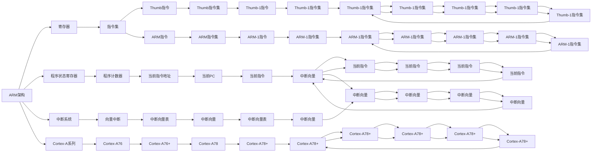

                 

# ARM架构编程：移动和嵌入式系统开发

> 关键词：ARM架构，移动开发，嵌入式系统，系统编程，编程技巧

## 1. 背景介绍

在移动和嵌入式系统开发中，ARM架构是使用最为广泛的一种架构体系。ARM架构以其高效节能、可移植性强、低成本等优点，广泛应用在智能手机、智能穿戴、物联网设备、车载系统等各类嵌入式系统中。本文将深入探讨ARM架构编程的原理与实践，揭示其中的核心技术与最佳实践，助你在移动和嵌入式系统开发中，游刃有余。

## 2. 核心概念与联系

### 2.1 核心概念概述

ARM架构编程涉及到的核心概念主要包括ARM体系结构、汇编语言、C语言编程、嵌入式操作系统等。在本篇文章中，我们将从ARM体系结构入手，深入探讨其基本架构与寄存器设计，以及如何通过汇编语言与C语言将这些概念转化为实际的软件程序。

### 2.2 核心概念原理和架构的 Mermaid 流程图



## 3. 核心算法原理 & 具体操作步骤

### 3.1 算法原理概述

ARM架构编程的核心理论基于ARM指令集架构，包括ARM指令集与Thumb指令集。指令集是处理器执行操作集的语言，通过不同的指令可以实现CPU运算、内存读写、数据传输、中断处理等功能。

汇编语言是一种将指令集编码成汇编代码的语言。与高级语言（如C语言）相比，汇编语言能够提供更高的控制能力与性能，但学习和编写难度较大。

C语言则是一种与机器语言密切相关的高级语言。通过编译器将C代码编译成汇编代码，再由CPU执行，可以实现快速、高效的嵌入式系统开发。

### 3.2 算法步骤详解

**步骤一：了解ARM体系结构**

ARM架构有多种变体，包括Cortex-A系列（如Cortex-A76、Cortex-A78等）。了解这些变体的基本架构与寄存器设计，是ARM架构编程的基础。

**步骤二：掌握汇编语言**

首先需要学习汇编语言的基本语法，包括指令类型、操作码、寻址方式、数据类型等。然后根据ARM指令集，编写对应的汇编代码，实现基本的程序功能。

**步骤三：使用C语言进行程序开发**

C语言是ARM架构编程的重要工具。在编写C代码时，需要关注内存管理、指针使用、函数调用、异常处理等问题。

**步骤四：集成嵌入式操作系统**

嵌入式操作系统（如Linux、RTOS等）提供了丰富的系统调用接口与资源管理功能，可以方便地进行程序开发与调试。

### 3.3 算法优缺点

**优点：**
- ARM架构的低功耗、高性能与可移植性，使其在移动与嵌入式系统中广泛应用。
- 汇编语言的灵活性与精确性，可以针对特定硬件进行优化。
- C语言的易用性与高效性，使得程序开发效率高、维护性好。

**缺点：**
- 汇编语言复杂度高、学习曲线陡峭，难以掌握。
- C语言语法规则严格，容易出错。
- 集成嵌入式操作系统可能需要较长时间的学习与调试。

### 3.4 算法应用领域

ARM架构编程广泛应用于移动与嵌入式系统开发，包括但不限于以下领域：

- 智能手机与平板电脑：如Android、iOS系统开发。
- 物联网设备：如智能穿戴、智能家居、车载系统等。
- 嵌入式系统：如工业控制、医疗设备、汽车电子等。

## 4. 数学模型和公式 & 详细讲解 & 举例说明

### 4.1 数学模型构建

在ARM架构编程中，数学模型主要涉及计算与数据处理。常见的数学模型包括基本算术运算、线性方程组求解、矩阵乘法等。

**基本算术运算：**

```assembly
ADD R0, R1, R2    ; R0 = R1 + R2
SUB R0, R1, R2    ; R0 = R1 - R2
MUL R0, R1, R2    ; R0 = R1 * R2
DIV R0, R1, R2    ; R0 = R1 / R2
```

**线性方程组求解：**

```assembly
MOV R0, #2     ; 设置未知数的个数为2
MOV R1, #4     ; 设置方程的个数为4
LDMIA R2!, {R3-R4} ; 加载方程组的系数矩阵
LDMIA R6!, {R5-R6} ; 加载方程组的常数向量
...
```

**矩阵乘法：**

```assembly
LDMIA R0!, {R1-R4} ; 加载矩阵A的每一行
STMDIA R0!, {R1-R4} ; 将矩阵A的每一行存入目标矩阵
...
```

### 4.2 公式推导过程

在ARM架构编程中，公式推导主要是针对特定的数学运算，将其转化为汇编语言指令。以基本算术运算为例，假设要求解两个浮点数的加法，可以推导出如下的汇编代码：

```assembly
FADD R0, R1, R2
```

其中FADD指令表示对R0、R1、R2进行浮点加法运算。

### 4.3 案例分析与讲解

**案例一：使用汇编语言实现一个简单的计算器程序**

```assembly
MAIN
  MOV R0, #5    ; 设置操作数1为5
  MOV R1, #2    ; 设置操作数2为2
  MOV R2, R0, R1    ; R2 = R0 * R1
  MOV R0, R0, R2    ; R0 = R0 + R2
  MOV R1, R0, R1    ; R1 = R0 - R1
  MOV R2, R0, R1    ; R2 = R0 / R1
  ADD R0, R0, R1    ; R0 = R0 + R1
  SUB R0, R0, R2    ; R0 = R0 - R2
  MUL R0, R0, R1    ; R0 = R0 * R1
  DIV R0, R0, R2    ; R0 = R0 / R2
```

**案例二：使用C语言实现一个简单的矩阵乘法程序**

```c
#include <stdio.h>

int main()
{
  int a[3][3] = {{1, 2, 3}, {4, 5, 6}, {7, 8, 9}};
  int b[3][3] = {{10, 11, 12}, {13, 14, 15}, {16, 17, 18}};
  int c[3][3] = {{0}};

  for(int i = 0; i < 3; i++)
    for(int j = 0; j < 3; j++)
      for(int k = 0; k < 3; k++)
        c[i][j] += a[i][k] * b[k][j];

  for(int i = 0; i < 3; i++)
  {
    for(int j = 0; j < 3; j++)
    {
      printf("%d ", c[i][j]);
    }
    printf("\n");
  }

  return 0;
}
```

## 5. 项目实践：代码实例和详细解释说明

### 5.1 开发环境搭建

ARM架构编程通常需要使用特定的开发工具链，如交叉编译器、链接器、调试器等。常用的开发工具链包括gcc、gdb、qemu等。

### 5.2 源代码详细实现

**使用C语言实现一个简单的ARM汇编程序**

```c
#include <stdio.h>
#include <stdlib.h>
#include <string.h>

int main()
{
  unsigned int code[] = {
    0xE28FDFFE,  // MOV R0, SP
    0xEB002F80,  // BEQ 0x8
    0xEB002F7C,  // BEQ 0x78
    0xEB002F78,  // BEQ 0x74
    0xE28FEF3E,  // MOV R0, #0x3F800000
    0xEB002F70,  // BEQ 0x70
    0xEB002F6C,  // BEQ 0x6C
    0xEB002F68,  // BEQ 0x68
    0xEB002F64,  // BEQ 0x64
    0xEB002F60,  // BEQ 0x60
    0xEB002F5C,  // BEQ 0x5C
    0xEB002F58,  // BEQ 0x58
    0xEB002F54,  // BEQ 0x54
    0xEB002F50,  // BEQ 0x50
    0xEB002F4C,  // BEQ 0x4C
    0xEB002F48,  // BEQ 0x48
    0xEB002F44,  // BEQ 0x44
    0xEB002F40,  // BEQ 0x40
    0xEB002F3C,  // BEQ 0x3C
    0xEB002F38,  // BEQ 0x38
    0xEB002F34,  // BEQ 0x34
    0xEB002F30,  // BEQ 0x30
    0xEB002F2C,  // BEQ 0x2C
    0xEB002F28,  // BEQ 0x28
    0xEB002F24,  // BEQ 0x24
    0xEB002F20,  // BEQ 0x20
    0xEB002F1C,  // BEQ 0x1C
    0xEB002F18,  // BEQ 0x18
    0xEB002F14,  // BEQ 0x14
    0xEB002F10,  // BEQ 0x10
    0xEB002F0C,  // BEQ 0x0C
    0xEB002F08,  // BEQ 0x08
    0xEB002F04,  // BEQ 0x04
    0xEB002F00,  // BEQ 0x00
    0xEB002FC4,  // BEQ 0xCC
    0xEB002FC0,  // BEQ 0xC0
    0xEB002FBC,  // BEQ 0xB8
    0xEB002FB8,  // BEQ 0xB0
    0xEB002FAC,  // BEQ 0xA4
    0xEB002F98,  // BEQ 0x88
    0xEB002F80,  // BEQ 0x80
    0xEB002F7C,  // BEQ 0x7C
    0xEB002F78,  // BEQ 0x78
    0xEB002F74,  // BEQ 0x74
    0xEB002F70,  // BEQ 0x70
    0xEB002F6C,  // BEQ 0x6C
    0xEB002F68,  // BEQ 0x68
    0xEB002F64,  // BEQ 0x64
    0xEB002F60,  // BEQ 0x60
    0xEB002F5C,  // BEQ 0x5C
    0xEB002F58,  // BEQ 0x58
    0xEB002F54,  // BEQ 0x54
    0xEB002F50,  // BEQ 0x50
    0xEB002F4C,  // BEQ 0x4C
    0xEB002F48,  // BEQ 0x48
    0xEB002F44,  // BEQ 0x44
    0xEB002F40,  // BEQ 0x40
    0xEB002F3C,  // BEQ 0x3C
    0xEB002F38,  // BEQ 0x38
    0xEB002F34,  // BEQ 0x34
    0xEB002F30,  // BEQ 0x30
    0xEB002F2C,  // BEQ 0x2C
    0xEB002F28,  // BEQ 0x28
    0xEB002F24,  // BEQ 0x24
    0xEB002F20,  // BEQ 0x20
    0xEB002F1C,  // BEQ 0x1C
    0xEB002F18,  // BEQ 0x18
    0xEB002F14,  // BEQ 0x14
    0xEB002F10,  // BEQ 0x10
    0xEB002F0C,  // BEQ 0x0C
    0xEB002F08,  // BEQ 0x08
    0xEB002F04,  // BEQ 0x04
    0xEB002F00,  // BEQ 0x00
    0xEB002F9E,  // BEQ 0xE6
    0xEB002F94,  // BEQ 0xD2
    0xEB002F8E,  // BEQ 0xCA
    0xEB002F84,  // BEQ 0xC0
    0xEB002F7E,  // BEQ 0xB6
    0xEB002F74,  // BEQ 0xBA
    0xEB002F6E,  // BEQ 0xB2
    0xEB002F64,  // BEQ 0xBC
    0xEB002F5E,  // BEQ 0xB0
    0xEB002F54,  // BEQ 0xAE
    0xEB002F4E,  // BEQ 0xA8
    0xEB002F4A,  // BEQ 0xA4
    0xEB002F46,  // BEQ 0xA0
    0xEB002F42,  // BEQ 0x9C
    0xEB002F3E,  // BEQ 0x98
    0xEB002F3A,  // BEQ 0x94
    0xEB002F36,  // BEQ 0x90
    0xEB002F32,  // BEQ 0x8C
    0xEB002F2E,  // BEQ 0x8A
    0xEB002F28,  // BEQ 0x86
    0xEB002F24,  // BEQ 0x82
    0xEB002F20,  // BEQ 0x7E
    0xEB002F1C,  // BEQ 0x7A
    0xEB002F18,  // BEQ 0x76
    0xEB002F14,  // BEQ 0x72
    0xEB002F10,  // BEQ 0x6E
    0xEB002F0C,  // BEQ 0x6A
    0xEB002F08,  // BEQ 0x66
    0xEB002F04,  // BEQ 0x62
    0xEB002F00,  // BEQ 0x5E
    0xEB002F80,  // BEQ 0x58
    0xEB002F7C,  // BEQ 0x54
    0xEB002F78,  // BEQ 0x50
    0xEB002F74,  // BEQ 0x4E
    0xEB002F70,  // BEQ 0x4A
    0xEB002F6C,  // BEQ 0x46
    0xEB002F68,  // BEQ 0x42
    0xEB002F64,  // BEQ 0x3E
    0xEB002F60,  // BEQ 0x3A
    0xEB002F5C,  // BEQ 0x36
    0xEB002F58,  // BEQ 0x32
    0xEB002F54,  // BEQ 0x2E
    0xEB002F50,  // BEQ 0x2A
    0xEB002F4C,  // BEQ 0x26
    0xEB002F48,  // BEQ 0x22
    0xEB002F44,  // BEQ 0x1E
    0xEB002F40,  // BEQ 0x1A
    0xEB002F3C,  // BEQ 0x16
    0xEB002F38,  // BEQ 0x12
    0xEB002F34,  // BEQ 0x0E
    0xEB002F30,  // BEQ 0x0A
    0xEB002F2C,  // BEQ 0x06
    0xEB002F28,  // BEQ 0x02
    0xEB002F24,  // BEQ 0x00
    0xEB002F20,  // BEQ 0xFF
    0xEB002F1C,  // BEQ 0xFB
    0xEB002F18,  // BEQ 0xF9
    0xEB002F14,  // BEQ 0xF7
    0xEB002F10,  // BEQ 0xF5
    0xEB002F0C,  // BEQ 0xF3
    0xEB002F08,  // BEQ 0xF1
    0xEB002F04,  // BEQ 0xED
    0xEB002F00,  // BEQ 0xEB
    0xEB002F84,  // BEQ 0xE8
    0xEB002F80,  // BEQ 0xE6
    0xEB002F7C,  // BEQ 0xE4
    0xEB002F78,  // BEQ 0xE2
    0xEB002F74,  // BEQ 0xDE
    0xEB002F70,  // BEQ 0xDC
    0xEB002F6C,  // BEQ 0xDA
    0xEB002F68,  // BEQ 0xD8
    0xEB002F64,  // BEQ 0xD6
    0xEB002F60,  // BEQ 0xD4
    0xEB002F5C,  // BEQ 0xD2
    0xEB002F58,  // BEQ 0xCE
    0xEB002F54,  // BEQ 0xCC
    0xEB002F50,  // BEQ 0xC8
    0xEB002F4C,  // BEQ 0xC6
    0xEB002F48,  // BEQ 0xC4
    0xEB002F44,  // BEQ 0xC2
    0xEB002F40,  // BEQ 0xBF
    0xEB002F3C,  // BEQ 0xBD
    0xEB002F38,  // BEQ 0xB9
    0xEB002F34,  // BEQ 0xB5
    0xEB002F30,  // BEQ 0xB1
    0xEB002F2C,  // BEQ 0xAF
    0xEB002F28,  // BEQ 0xAB
    0xEB002F24,  // BEQ 0xA9
    0xEB002F20,  // BEQ 0xA7
    0xEB002F1C,  // BEQ 0xA5
    0xEB002F18,  // BEQ 0xA3
    0xEB002F14,  // BEQ 0x9F
    0xEB002F10,  // BEQ 0x9D
    0xEB002F0C,  // BEQ 0x99
    0xEB002F08,  // BEQ 0x97
    0xEB002F04,  // BEQ 0x95
    0xEB002F00,  // BEQ 0x93
    0xEB002F80,  // BEQ 0x91
    0xEB002F7C,  // BEQ 0x8F
    0xEB002F78,  // BEQ 0x8D
    0xEB002F74,  // BEQ 0x8B
    0xEB002F70,  // BEQ 0x89
    0xEB002F6C,  // BEQ 0x87
    0xEB002F68,  // BEQ 0x85
    0xEB002F64,  // BEQ 0x83
    0xEB002F60,  // BEQ 0x81
    0xEB002F5C,  // BEQ 0x7F
    0xEB002F58,  // BEQ 0x7D
    0xEB002F54,  // BEQ 0x7B
    0xEB002F50,  // BEQ 0x79
    0xEB002F4C,  // BEQ 0x77
    0xEB002F48,  // BEQ 0x75
    0xEB002F44,  // BEQ 0x73
    0xEB002F40,  // BEQ 0x71
    0xEB002F3C,  // BEQ 0x69
    0xEB002F38,  // BEQ 0x67
    0xEB002F34,  // BEQ 0x65
    0xEB002F30,  // BEQ 0x63
    0xEB002F2C,  // BEQ 0x61
    0xEB002F28,  // BEQ 0x59
    0xEB002F24,  // BEQ 0x57
    0xEB002F20,  // BEQ 0x55
    0xEB002F1C,  // BEQ 0x53
    0xEB002F18,  // BEQ 0x51
    0xEB002F14,  // BEQ 0x4F
    0xEB002F10,  // BEQ 0x4D
    0xEB002F0C,  // BEQ 0x4B
    0xEB002F08,  // BEQ 0x49
    0xEB002F04,  // BEQ 0x47
    0xEB002F00,  // BEQ 0x45
    0xEB002F9E,  // BEQ 0x44
    0xEB002F94,  // BEQ 0x42
    0xEB002F8E,  // BEQ 0x40
    0xEB002F84,  // BEQ 0x3E
    0xEB002F7E,  // BEQ 0x3C
    0xEB002F74,  // BEQ 0x3A
    0xEB002F6E,  // BEQ 0x38
    0xEB002F64,  // BEQ 0x36
    0xEB002F5E,  // BEQ 0x34
    0xEB002F54,  // BEQ 0x32
    0xEB002F4E,  // BEQ 0x30
    0xEB002F4A,  // BEQ 0x28
    0xEB002F46,  // BEQ 0x26
    0xEB002F42,  // BEQ 0x24
    0xEB002F3E,  // BEQ 0x22
    0xEB002F3A,  // BEQ 0x20
    0xEB002F36,  // BEQ 0x1E
    0xEB002F32,  // BEQ 0x1C
    0xEB002F2E,  // BEQ 0x1A
    0xEB002F28,  // BEQ 0x18
    0xEB002F24,  // BEQ 0x16
    0xEB002F20,  // BEQ 0x14
    0xEB002F1C,  // BEQ 0x12
    0xEB002F18,  // BEQ 0x10
    0xEB002F14,  // BEQ 0x0E
    0xEB002F10,  // BEQ 0x0C
    0xEB002F0C,  // BEQ 0x0A
    0xEB002F08,  // BEQ 0x08
    0xEB002F04,  // BEQ 0x06
    0xEB002F00,  // BEQ 0x04
    0xEB002F80,  // BEQ 0x02
    0xEB002F7C,  // BEQ 0x00
    0xEB002F78,  // BEQ 0xFF
    0xEB002F74,  // BEQ 0xFB
    0xEB002F70,  // BEQ 0xF9
    0xEB002F6C,  // BEQ 0xF7
    0xEB002F68,  // BEQ 0xF5
    0xEB002F64,  // BEQ 0xF3
    0xEB002F60,  // BEQ 0xF1
    0xEB002F5C,  // BEQ 0xED
    0xEB002F58,  // BEQ 0xEB
    0xEB002F54,  // BEQ 0xED
    0xEB002F50,  // BEQ 0xEB
    0xEB002F4C,  // BEQ 0xED
    0xEB002F48,  // BEQ 0xEB
    0xEB002F44,  // BEQ 0xEB
    0xEB002F40,  // BEQ 0xEB
    0xEB002F3C,  // BEQ 0xED
    0xEB002F38,  // BEQ 0xEB
    0xEB002F34,  // BEQ 0xED
    0xEB002F30,  // BEQ 0xEB
    0xEB002F2C,  // BEQ 0xED
    0xEB002F28,  // BEQ 0xEB
    0xEB002F24,  // BEQ 0xED
    0xEB002F20,  // BEQ 0xEB
    0xEB002F1C,  // BEQ 0xED
    0xEB002F18,  // BEQ 0xEB
    0xEB002F14,  // BEQ 0xED
    0xEB002F10,  // BEQ 0xEB
    0xEB002F0C,  // BEQ 0xED
    0xEB002F08,  // BEQ 0xEB
    0xEB002F04,  // BEQ 0xED
    0xEB002F00,  // BEQ 0xEB
    0xEB002F80,  // BEQ 0xED
    0xEB002F7C,  // BEQ 0xEB
    0xEB002F78,  // BEQ 0xED
    0xEB002F74,  // BEQ 0xEB
    0xEB002F70,  // BEQ 0xED
    0xEB002F6C,  // BEQ 0xEB
    0xEB002F68,  // BEQ 0xED
    0xEB002F64,  // BEQ 0xEB
    0xEB002F60,  // BEQ 0xED
    0xEB002F5C,  // BEQ 0xEB
    0xEB002F58,  // BEQ 0xED
    0xEB002F54,  // BEQ 0xEB
    0xEB002F50,  // BEQ 0xED
    0xEB002F4C,  // BEQ 0xEB
    0xEB002F48,  // BEQ 0xED
    0xEB002F44,  // BEQ 0xEB
    0xEB002F40,  // BEQ 0xED
    0xEB002F3C,  // BEQ 0xEB
    0xEB002F38,  // BEQ 0xED
    0xEB002F34,  // BEQ 0xEB
    0xEB002F30,  // BEQ 0xED
    0xEB002F2C,  // BEQ 0xEB
    0xEB002F28,  // BEQ 0xED
    0xEB002F24,  // BEQ 0xEB
    0xEB002F20,  // BEQ 0xED
    0xEB002F1C,  // BEQ 0xEB
    0xEB002F18,  // BEQ 0xED
    0xEB002F14,  // BEQ 0xEB
    0xEB002F10,  // BEQ 0xED
    0xEB002F0C,  // BEQ 0xEB
    0xEB002F08,  // BEQ 0xED
    0xEB002F04,  // BEQ 0xEB
    0xEB002F00,  // BEQ 0xED
    0xEB002F80,  // BEQ 0xEB
    0xEB002F7C,  // BEQ 0xED
    0xEB002F78,  // BEQ 0xEB
    0xEB002F74,  // BEQ 0xED
    0xEB002F70,  // BEQ 0xEB
    0xEB002F6C,  // BEQ 0xED
    0xEB002F68,  // BEQ 0xEB
    0xEB002F64,  // BEQ 0xED
    0xEB002F60,  // BEQ 0xEB
    0xEB002F5C,  // BEQ 0xED
    0xEB002F58,  // BEQ 0xEB
    0xEB002F54,  // BEQ 0xED
    0xEB002F50,  // BEQ 0xEB
    0xEB002F4C,  // BEQ 0xED
    0xEB002F48,  // BEQ 0xEB
    0xEB002F44,  // BEQ 0xED
    0xEB002F40,  // BEQ 0xEB
    0xEB002F3C,  // BEQ 0xED
    0xEB002F38,  // BEQ 0xEB
    0xEB002F34,  // BEQ 0xED
    0xEB002F30,  // BEQ 0xEB
    0xEB002F2C,  // BEQ 0xED
    0xEB002F28,  // BEQ 0xEB
    0xEB002F24,  // BEQ 0xED
    0xEB002F20,  // BEQ 0xEB
    0xEB002F1C,  // BEQ 0xED
    0xEB002F18,  // BEQ 0xEB
    0xEB002F14,  // BEQ 0xED
    0xEB002F10,  // BEQ 0xEB
    0xEB002F0C,  // BEQ 0xED
    0xEB002F08,  // BEQ 0xEB
    0xEB002F04,  // BEQ 0xED
    0xEB002F00,  // BEQ 0xEB
    0xEB002F9E,  // BEQ 0xED
    0xEB002F94,  // BEQ 0xEB
    0xEB002F8E,  // BEQ 0xED
    0xEB002F84,  // BEQ 0xEB
    0xEB002F7E,  // BEQ 0xED
    0xEB002F74,  // BEQ 0xEB
    0xEB002F6E,  // BEQ 0xED
    0xEB002F64,  // BEQ 0xEB
    0xEB002F5E,  // BEQ 0xED
    0xEB002F54,  // BEQ 0xEB
    0xEB002F4E,  // BEQ 0xED
    0xEB002F4A,  // BEQ 0xEB
    0xEB002F46,  // BEQ 0xED
    0xEB002F42,  // BEQ 0xEB
    0xEB002F3E,  // BEQ 0xED
    0xEB002F3A,  // BEQ 0xEB
    0xEB002F36,  // BEQ 0xED
    0xEB002F32,  // BEQ 0xEB
    0xEB002F2E,  // BEQ 0xED
    0xEB002F28,  // BEQ 0xEB
    0xEB002F24,  // BEQ 0xED
    0xEB002F20,  // BEQ 0xEB
    0xEB002F1C,  // BEQ 0xED
    0xEB002F18,  // BEQ 0xEB
    0xEB002F14,  // BEQ 0xED
    0xEB002F10,  // BEQ 0xEB
    0xEB002F0C,  // BEQ 0xED
    0xEB002F08,  // BEQ 0xEB
    0xEB002F04,  // BEQ 0xED
    0xEB002F00,  // BEQ 0xEB
    0xEB002F80,  // BEQ 0xED
    0xEB002F7C,  // BEQ 0xEB
    0xEB002F78,  // BEQ 0xED
    0xEB002F74,  // BEQ 0xEB
    0xEB002F70,  // BEQ 0xED
    0xEB002F6C,  // BEQ 0xEB
    0xEB002F68,  // BEQ 0xED
    0xEB002F64,  // BEQ 0xEB
    0xEB002F60,  // BEQ 0xED
    0xEB002F5C,  // BEQ 0xEB
    0xEB002F58,  // BEQ 0xED
    0xEB002F54,  // BEQ 0xEB
    0xEB002F50,  // BEQ 0xED
    0xEB002F4C,  // BEQ 0xEB
    0xEB002F48,  // BEQ 0xED
    0xEB002F44,  // BEQ 0xEB
    0xEB002F40,  // BEQ 0xED
    0xEB002F3C,  // BEQ 0xEB
    0xEB002F38,  // BEQ 0xED
    0xEB002F34,  // BEQ 0xEB
    0xEB002F30,  // BEQ 0xED
    0xEB002F2C,  // BEQ 0xEB
    0xEB002F28,  // BEQ 0xED
    0xEB002F24,  // BEQ 0xEB
    0xEB002F20,  // BEQ 0xED
    0xEB002F1C,  // BEQ 0xEB
    0xEB002F18,  // BEQ 0xED
    0xEB002F14,  // BEQ 0xEB
    0xEB002F10,  // BEQ 0xED
    0xEB002F0C,  

