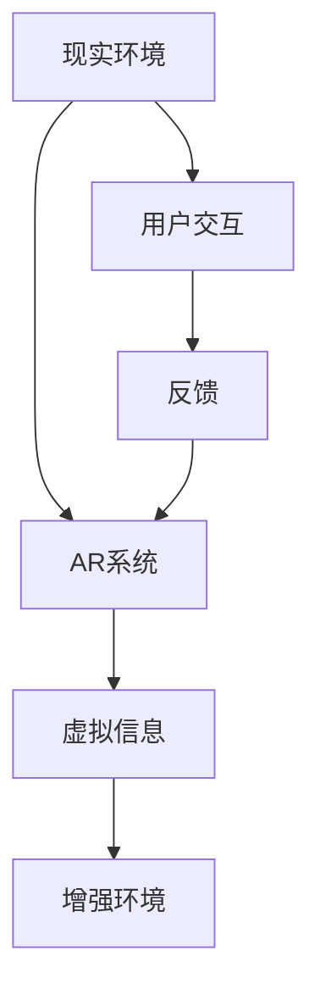

                 

# AR在教育领域的应用：增强学习体验

> 关键词：增强现实（AR），教育，学习体验，虚拟实验室，互动教学，个性化学习，远程教学

## 1. 背景介绍

随着科技的进步，教育领域正经历着一场前所未有的变革。从传统的讲授式教育转向互动式、个性化教育，从单一的知识传授到全方位的素质培养，现代教育正在逐步从量变走向质变。其中，增强现实（AR）技术的引入，为教育注入了新的活力，显著提升了学生的学习体验和效果。

### 1.1 问题由来

传统教育模式以教室讲授为主，教师与学生之间单向的交互方式限制了学生的主动参与和动手能力。学生往往被动接受知识，难以形成深度理解和应用。随着技术的发展，虚拟现实（VR）、增强现实（AR）等新兴技术逐渐被引入教育领域，以期改善这一状况。AR技术通过在真实环境中叠加虚拟信息，创建沉浸式学习环境，可以更好地激发学生的学习兴趣，提升学习效果。

### 1.2 问题核心关键点

AR在教育领域的应用主要集中在以下几个方面：

- **虚拟实验室**：利用AR技术，学生可以在虚拟环境中进行实验，无需昂贵实验设备，即可体验各种实验场景。
- **互动教学**：通过AR技术，教师和学生可以实时互动，实现虚拟与现实相结合的教学方式。
- **个性化学习**：AR技术可以根据学生的兴趣和学习进度，提供个性化的学习内容和路径。
- **远程教学**：AR技术可以在远程教学中创建虚拟课堂，实现互动教学，提升远程学习的效果。
- **知识可视化**：AR技术可以将抽象的概念和知识可视化，便于学生理解和记忆。

这些关键点构成了AR在教育领域应用的核心，展示了其在提升教育效果方面的巨大潜力。

## 2. 核心概念与联系

### 2.1 核心概念概述

增强现实（AR）是一种将数字信息与现实环境相结合的技术，通过将虚拟信息叠加到现实世界中，形成“增强”的效果。AR技术广泛应用于游戏、设计、医疗、教育等多个领域。在教育领域，AR技术可以创建虚拟学习环境，通过视觉、听觉等多种感官输入，增强学生的学习体验。

### 2.2 核心概念原理和架构的 Mermaid 流程图



AR系统的核心原理是通过摄像头、传感器等硬件设备捕捉现实环境的信息，再通过算法将这些信息与虚拟信息进行融合，最后将虚拟信息叠加到现实环境中，形成增强效果。用户可以通过手势、语音等交互方式，与虚拟信息进行互动，获得实时反馈。

## 3. 核心算法原理 & 具体操作步骤

### 3.1 算法原理概述

AR在教育领域的应用主要依赖于计算机视觉、三维建模、人机交互等技术。以下介绍这些技术的核心原理：

- **计算机视觉**：利用摄像头捕捉现实环境中的图像，通过图像处理算法识别出环境中的物体和场景。
- **三维建模**：将虚拟环境中的物体和场景进行三维建模，以便在AR系统中实时渲染。
- **人机交互**：通过手势识别、语音识别等技术，实现用户与虚拟信息的交互。

### 3.2 算法步骤详解

AR在教育领域的应用主要包括以下几个关键步骤：

1. **数据采集**：使用摄像头和传感器捕捉现实环境中的图像和数据，识别出需要增强的物体和场景。
2. **虚拟信息叠加**：根据现实环境中的物体和场景，加载相应的虚拟信息，如三维模型、动画、音频等。
3. **实时渲染**：将虚拟信息叠加到现实环境中，形成增强效果。
4. **用户交互**：通过手势、语音等交互方式，用户可以与虚拟信息进行互动，获得反馈。
5. **反馈机制**：根据用户的交互行为，实时调整虚拟信息，提供个性化学习体验。

### 3.3 算法优缺点

AR技术在教育领域的应用具有以下优点：

- **互动性**：通过实时互动，提升学生的参与感和学习兴趣。
- **沉浸感**：虚拟环境与现实环境的结合，营造出沉浸式的学习体验。
- **可视化**：抽象的概念和知识可以通过可视化技术进行展示，便于学生理解和记忆。

同时，AR技术也存在一些缺点：

- **硬件成本**：AR设备的硬件成本较高，限制了技术的普及和应用。
- **技术门槛**：AR技术的开发和维护需要一定的技术门槛，对教育机构的技术能力提出了较高要求。
- **隐私问题**：AR设备涉及大量的摄像头和传感器数据，可能引发隐私问题。

### 3.4 算法应用领域

AR技术在教育领域的应用非常广泛，涵盖了虚拟实验室、互动教学、个性化学习等多个方面。

- **虚拟实验室**：通过AR技术，学生可以在虚拟环境中进行实验，无需昂贵的实验设备。例如，在化学实验中，学生可以通过AR设备观察和操作虚拟化学试剂，进行实验操作。
- **互动教学**：教师可以通过AR设备在教室中展示虚拟信息，实现互动教学。例如，在历史课上，教师可以展示虚拟的历史场景，让学生更好地理解历史事件。
- **个性化学习**：AR技术可以根据学生的学习进度和兴趣，提供个性化的学习内容和路径。例如，在数学课上，AR设备可以根据学生的学习进度，提供不同难度的数学题和解题思路。
- **远程教学**：AR技术可以在远程教学中创建虚拟课堂，实现互动教学。例如，在远程英语课上，教师可以通过AR设备展示虚拟场景，与学生进行互动。

## 4. 数学模型和公式 & 详细讲解 & 举例说明

### 4.1 数学模型构建

AR技术的应用需要计算机视觉、三维建模、人机交互等多领域的知识。以下介绍几个核心数学模型：

- **三维重建模型**：利用计算机视觉算法，从多个角度拍摄现实环境中的物体，通过三角测量等技术进行三维重建。
- **运动捕捉模型**：通过摄像头捕捉用户的手势和动作，利用运动捕捉算法进行数据处理。
- **路径规划模型**：根据用户的手势和动作，计算虚拟信息在现实环境中的位置和姿态，进行路径规划。

### 4.2 公式推导过程

- **三维重建模型**：假设我们拍摄了n个角度的照片，每个角度的照片包含m个像素，每个像素的坐标为(x,y,z)，则三维重建的过程可以表示为：

  $$
  X = [X_{1}, X_{2}, ..., X_{n}] \in \mathbb{R}^{3 \times n}
  $$

  其中，$X_i = [x_i, y_i, z_i]$ 表示第i个角度的照片像素坐标。

  通过三角测量算法，可以得到像素与物体的位置关系，从而进行三维重建。

- **运动捕捉模型**：假设用户的手势和动作可以表示为一个n维向量$u = [u_1, u_2, ..., u_n]$，则运动捕捉的过程可以表示为：

  $$
  y = A u + b
  $$

  其中，$y = [y_1, y_2, ..., y_m]$ 表示m维的传感器数据，$A$ 为传感器矩阵，$b$ 为传感器噪声。

  通过最小二乘法，可以求解出用户的手势和动作。

- **路径规划模型**：假设虚拟信息的位置和姿态可以表示为$P = [p_x, p_y, p_z, q_x, q_y, q_z]$，用户的手势和动作可以表示为$u = [u_1, u_2, ..., u_n]$，则路径规划的过程可以表示为：

  $$
  P = f(u)
  $$

  其中，$f$ 为路径规划函数。

  通过优化算法，可以求解出虚拟信息在现实环境中的位置和姿态。

### 4.3 案例分析与讲解

以虚拟实验室为例，介绍AR技术的具体应用。

假设我们要在虚拟实验室中演示化学反应过程。首先，通过摄像头捕捉实验室的环境图像，并利用计算机视觉算法识别出实验室中的化学试剂和反应容器。然后，利用三维建模技术，创建虚拟的化学试剂和反应容器，并加载到AR系统中。接着，学生可以通过手势或语音操作虚拟试剂，进行实验操作，实验过程通过AR设备展示在学生面前。最后，系统根据学生的实验操作，实时调整虚拟试剂的位置和状态，提供反馈和指导。

## 5. 项目实践：代码实例和详细解释说明

### 5.1 开发环境搭建

在进行AR项目实践前，我们需要准备好开发环境。以下是使用Unity3D进行AR开发的环境配置流程：

1. 安装Unity3D：从官网下载并安装Unity3D，下载地址为[https://unity3d.com/](https://unity3d.com/)。
2. 安装AR插件：在Unity Hub中搜索并安装AR插件，如ARKit（iOS）或ARCore（Android）。
3. 安装摄像头和传感器：确保设备的摄像头和传感器功能正常，以便捕捉现实环境中的数据。

### 5.2 源代码详细实现

以下是一个简单的AR项目示例，介绍如何在Unity3D中实现虚拟实验室。

首先，创建一个Unity3D项目，并导入AR插件。然后，在场景中添加虚拟实验室环境，如桌子、椅子和实验器材等。接着，使用AR插件，将虚拟实验室叠加到现实环境中，形成增强效果。最后，编写代码，实现用户与虚拟实验室的互动。

```csharp
using UnityEngine;
using System.Collections;

public class ARExperiment : MonoBehaviour
{
    public GameObject virtualLab; // 虚拟实验室
    public Transform arAnchor; // AR锚点

    void Start()
    {
        // 加载虚拟实验室
        virtualLab.SetActive(false);

        // 加载AR锚点
        arAnchor = GameObject.Find("ARAnchor").transform;

        // 创建虚拟实验室实例
        GameObject lab = Instantiate(virtualLab, arAnchor.position, arAnchor.rotation);

        // 加载虚拟实验室中的试剂和容器
        LoadReagents(lab);

        // 创建交互事件
        CreateInteraction(lab);
    }

    void LoadReagents(GameObject lab)
    {
        // 加载试剂和容器
    }

    void CreateInteraction(GameObject lab)
    {
        // 创建交互事件
    }
}
```

### 5.3 代码解读与分析

**ARExperiment类**：
- `Start`方法：在场景加载完成后，初始化虚拟实验室和AR锚点，加载虚拟实验室，创建虚拟试剂和容器，创建交互事件。
- `LoadReagents`方法：加载虚拟实验室中的试剂和容器。
- `CreateInteraction`方法：创建交互事件。

**虚拟实验室的实现**：
- 在Unity3D中，可以通过创建模型、材质、光照等组件，构建虚拟实验室环境。
- 利用AR插件，将虚拟实验室叠加到现实环境中，形成增强效果。

**交互事件的实现**：
- 通过Unity3D的事件系统，可以实现手势识别、语音识别等交互方式，实现用户与虚拟实验室的互动。
- 例如，可以通过点击、拖拽等手势操作虚拟试剂，进行实验操作。

### 5.4 运行结果展示

运行上述代码，可以在Unity3D的编辑器中看到虚拟实验室叠加到现实环境中的效果。通过手势操作虚拟试剂，可以实时调整虚拟试剂的位置和状态，进行实验操作。

## 6. 实际应用场景

### 6.1 虚拟实验室

在传统的实验教学中，实验室设备昂贵且数量有限，学生往往无法进行多次实验操作。而虚拟实验室通过AR技术，可以创建虚拟的实验环境，学生无需实际实验设备，即可进行多次实验操作。

- **化学实验**：通过AR设备，学生可以在虚拟环境中进行化学实验操作，观察化学反应过程，增强理解。
- **物理实验**：通过AR设备，学生可以在虚拟环境中进行物理实验操作，如电路连接、光学实验等。
- **生物实验**：通过AR设备，学生可以在虚拟环境中进行生物实验操作，观察细胞结构、生物反应等。

### 6.2 互动教学

传统的教学方式以教师讲授为主，缺乏互动性。而AR技术可以通过互动教学，提升学生的参与感和学习效果。

- **历史课**：教师可以在课堂上展示虚拟的历史场景，通过互动，让学生更好地理解历史事件。
- **地理课**：教师可以通过AR设备展示虚拟的地理位置，引导学生进行互动，增强对地理知识的理解。
- **科学课**：教师可以通过AR设备展示虚拟的科学实验，让学生进行互动，增强对科学知识的理解。

### 6.3 个性化学习

AR技术可以根据学生的学习进度和兴趣，提供个性化的学习内容和路径。

- **数学课**：AR设备可以根据学生的学习进度，提供不同难度的数学题和解题思路。
- **英语课**：AR设备可以根据学生的学习兴趣，提供不同的英语阅读材料和听力材料。
- **编程课**：AR设备可以根据学生的编程水平，提供不同的编程练习和项目。

### 6.4 远程教学

AR技术可以在远程教学中创建虚拟课堂，实现互动教学。

- **英语课**：通过AR设备，教师可以在远程课堂上展示虚拟的英语场景，引导学生进行互动。
- **科学课**：通过AR设备，教师可以在远程课堂上展示虚拟的科学实验，引导学生进行互动。
- **美术课**：通过AR设备，教师可以在远程课堂上展示虚拟的美术作品，引导学生进行互动。

## 7. 工具和资源推荐

### 7.1 学习资源推荐

为了帮助开发者系统掌握AR技术在教育领域的应用，这里推荐一些优质的学习资源：

1. **Unity3D官方文档**：Unity3D官方文档提供了全面的AR插件和SDK文档，帮助开发者快速上手开发。
2. **ARKit和ARCore官方文档**：苹果和谷歌提供的ARKit和ARCore官方文档，提供了详细的API接口和使用示例。
3. **AR in Education**：AR in Education网站提供了大量的教育案例和AR应用，展示AR技术在教育中的应用效果。
4. **AR Development**：AR Development网站提供了大量的AR开发教程和案例，帮助开发者掌握AR技术。

### 7.2 开发工具推荐

AR技术在教育领域的应用离不开开发工具的支持。以下是几款常用的AR开发工具：

1. **Unity3D**：Unity3D是目前最流行的AR开发工具之一，支持多平台开发，提供丰富的插件和SDK。
2. **ARKit**：ARKit是苹果提供的AR开发SDK，支持iOS平台，提供丰富的API接口和工具。
3. **ARCore**：ARCore是谷歌提供的AR开发SDK，支持Android平台，提供丰富的API接口和工具。
4. **ARToolKit**：ARToolKit是微软提供的AR开发SDK，支持Windows平台，提供丰富的API接口和工具。

### 7.3 相关论文推荐

AR技术在教育领域的应用涉及多个领域的知识，以下几篇论文展示了最新的研究成果：

1. **Augmented Reality for Interactive Learning: A Systematic Review**：系统回顾了AR在教育领域的应用，提供了丰富的案例和应用效果。
2. **Augmented Reality in Education: A Comprehensive Survey**：对AR在教育领域的应用进行了全面综述，展示了AR技术的优势和应用前景。
3. **Using Augmented Reality to Enhance Learning and Teaching**：介绍了AR技术在教育领域的具体应用，展示了AR技术的教育效果。

## 8. 总结：未来发展趋势与挑战

### 8.1 总结

本文对AR技术在教育领域的应用进行了全面系统的介绍。首先阐述了AR技术在教育领域的背景和意义，明确了AR技术在提升教育效果方面的独特价值。其次，从原理到实践，详细讲解了AR技术的核心算法和操作步骤，给出了AR技术在教育领域应用的完整代码实例。同时，本文还广泛探讨了AR技术在虚拟实验室、互动教学、个性化学习、远程教学等多个方面的应用前景，展示了AR技术在教育领域广阔的应用空间。

通过本文的系统梳理，可以看到，AR技术在教育领域的应用前景广阔，具有极大的潜力提升教育效果。未来，随着AR技术的不断演进，其应用范围将进一步扩展，为教育领域带来更多的变革性影响。

### 8.2 未来发展趋势

展望未来，AR技术在教育领域的应用将呈现以下几个发展趋势：

1. **沉浸感增强**：通过增强现实技术，创建更加沉浸式的学习环境，提升学生的学习体验和效果。
2. **互动性提升**：通过交互技术，实现用户与虚拟信息的互动，提升学习的参与感和互动性。
3. **个性化学习深化**：通过个性化学习路径，根据学生的学习进度和兴趣，提供个性化的学习内容和路径。
4. **远程教学普及**：通过AR技术，实现远程教学的互动性和沉浸性，提升远程学习的效果。
5. **教育资源共享**：通过AR技术，共享教育资源，实现全球教育资源的共享和协作。

### 8.3 面临的挑战

尽管AR技术在教育领域的应用前景广阔，但在迈向更加智能化、普适化应用的过程中，仍面临诸多挑战：

1. **硬件成本高昂**：AR设备的硬件成本较高，限制了技术的普及和应用。
2. **技术门槛较高**：AR技术的开发和维护需要一定的技术门槛，对教育机构的技术能力提出了较高要求。
3. **隐私问题突出**：AR设备涉及大量的摄像头和传感器数据，可能引发隐私问题。
4. **应用场景受限**：AR技术在特定场景下的应用效果仍需进一步提升，如大型教室等。
5. **交互体验不理想**：AR设备的交互体验仍需进一步提升，避免操作繁琐、响应延迟等问题。

### 8.4 研究展望

未来，随着AR技术的不断演进，其应用范围将进一步扩展，为教育领域带来更多的变革性影响。同时，AR技术也需要与其他技术进行更深入的融合，如机器学习、人工智能等，共同推动教育领域的智能化和普适化。

**研究工作展望**：

1. **AR技术与人工智能的融合**：将AR技术与人工智能结合，提升AR技术的智能化水平，实现更精准的教育辅助。
2. **AR技术与机器学习的融合**：将AR技术与机器学习结合，提升AR技术的个性化水平，实现更智能化的学习推荐。
3. **AR技术与虚拟现实的融合**：将AR技术与虚拟现实结合，提升AR技术的沉浸感和互动性，实现更沉浸式的学习体验。

## 9. 附录：常见问题与解答

**Q1：AR技术在教育领域的应用前景如何？**

A: AR技术在教育领域的应用前景非常广阔。通过虚拟实验室、互动教学、个性化学习等应用，可以显著提升学生的学习体验和效果。未来，随着AR技术的不断演进，其应用范围将进一步扩展，为教育领域带来更多的变革性影响。

**Q2：如何选择合适的AR设备？**

A: 选择AR设备时，需要考虑设备的硬件性能、交互方式、应用场景等因素。一般来说，选择支持多平台开发、交互方式丰富、应用场景广泛的设备，可以更好地满足教育需求。

**Q3：AR技术在教育领域有哪些应用场景？**

A: AR技术在教育领域的应用场景非常广泛，包括虚拟实验室、互动教学、个性化学习、远程教学等。通过AR技术，可以提升学生的学习体验和效果，实现更智能、普适的教育。

**Q4：AR技术在教育领域有哪些挑战？**

A: AR技术在教育领域面临硬件成本高昂、技术门槛较高、隐私问题突出等挑战。为解决这些问题，需要进一步降低设备成本，提升技术可及性，保护用户隐私。

**Q5：AR技术在教育领域有哪些成功案例？**

A: 目前，AR技术在教育领域已经有了许多成功案例，如虚拟实验室、互动教学、个性化学习等。例如，通过AR技术，学生可以在虚拟实验室中进行化学实验操作，增强对化学知识的理解；通过AR技术，教师可以在课堂上展示虚拟的历史场景，引导学生进行互动，增强对历史知识的理解。

---

作者：禅与计算机程序设计艺术 / Zen and the Art of Computer Programming

