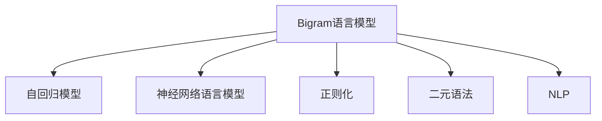

                 

# Bigram语言模型：语言建模基础

> 关键词：大语言模型,自回归,神经网络,语言建模,概率模型,正则化,二元语法,自然语言处理(NLP)

## 1. 背景介绍

### 1.1 问题由来
语言模型在自然语言处理(NLP)中扮演着重要的角色，它用来评估一个句子或文本序列的概率，从而判断该句子的语言合理性。语言模型在机器翻译、语音识别、自动文摘、信息检索、拼写纠错、自动写作等任务中都有广泛应用。然而，传统的语言模型面临计算复杂度高、训练数据需求量大、模型难以捕捉长距离依赖等问题，已经难以满足现代深度学习应用的需求。

近年来，随着深度神经网络的兴起，尤其是Transformer架构的引入，大语言模型（Large Language Models, LLMs）在语言建模领域取得了显著进展。这些大模型通过大规模的无标签数据进行预训练，学习到复杂的语言规律，在推理和生成任务中表现优异。但是，大模型的高参数量和计算复杂度，使其在实际应用中面临诸多挑战，包括推理速度慢、资源占用大、模型泛化性有限等问题。

在此背景下，Bigram语言模型作为基于统计的语言模型，以其计算效率高、易于实现等优点，再次受到关注。本文将详细介绍Bigram语言模型的基本原理、算法步骤及应用场景，并对比大语言模型与Bigram语言模型的优劣。

### 1.2 问题核心关键点
Bigram语言模型基于二元语法，即通过计算连续两个单词（或字符）之间的概率分布来预测下一个单词（或字符）。其核心思想是：假设一个单词的出现仅依赖于其前一个单词，忽略长距离依赖，从而降低计算复杂度。

Bigram语言模型与大语言模型（如GPT、BERT等）的主要区别在于：

- Bigram模型是静态的，难以捕捉动态的上下文关系；
- 大语言模型是动态的，能够处理复杂的上下文依赖；
- Biggram模型计算简单，内存占用小；
- 大语言模型计算复杂，需要大规模的GPU内存。

本文将从Bigram语言模型的基本概念出发，逐步介绍其算法原理和具体实现步骤，并通过与大语言模型的对比，帮助读者更好地理解Bigram语言模型在大规模文本处理中的应用。

## 2. 核心概念与联系

### 2.1 核心概念概述

为更好地理解Bigram语言模型，本节将介绍几个密切相关的核心概念：

- Bigram语言模型：一种基于二元语法的概率模型，用于评估连续两个单词（或字符）出现的概率，从而预测下一个单词（或字符）的概率分布。

- 自回归模型：通过给定序列中已知的单词（或字符）预测下一个单词（或字符）的概率。

- 神经网络语言模型：一种基于神经网络的模型，通过学习词嵌入和权重矩阵，预测下一个单词（或字符）的概率。

- 正则化：通过引入一些约束条件（如L2正则化），避免模型过拟合。

- 二元语法：指单词（或字符）之间一对一的关联关系，Bigram语言模型即基于这种关联关系进行建模。

- 自然语言处理(NLP)：涉及计算机与人类语言交互的各类技术，包括文本分类、语言生成、机器翻译等。

这些核心概念之间的逻辑关系可以通过以下Mermaid流程图来展示：



这个流程图展示了大语言模型与Bigram语言模型之间的核心概念及相互关系：

1. Bigram语言模型基于二元语法进行建模，本质上是一种自回归模型。
2. 神经网络语言模型是大语言模型的一种实现方式，通过学习词嵌入和权重矩阵，预测下一个单词（或字符）的概率。
3. 正则化是大语言模型常用的技术手段，用于避免模型过拟合。
4. NLP是大语言模型的应用领域，包括文本分类、机器翻译、语音识别等。

这些概念共同构成了语言建模的技术框架，使得Bigram语言模型能够在大规模文本处理中发挥重要作用。通过理解这些核心概念，我们可以更好地把握Bigram语言模型的设计和实现原理。

## 3. 核心算法原理 & 具体操作步骤
### 3.1 算法原理概述

Bigram语言模型基于二元语法，通过计算连续两个单词（或字符）之间的条件概率分布来预测下一个单词（或字符）的概率。其核心思想是：假设一个单词的出现仅依赖于其前一个单词，忽略长距离依赖，从而降低计算复杂度。

具体而言，Bigram语言模型的条件概率可以表示为：

$$P(w_t|w_{t-1}) = \frac{P(w_{t-1}, w_t)}{P(w_{t-1})}$$

其中，$P(w_t|w_{t-1})$ 表示给定前一个单词 $w_{t-1}$，单词 $w_t$ 出现的条件概率；$P(w_{t-1}, w_t)$ 表示两个单词同时出现的联合概率；$P(w_{t-1})$ 表示前一个单词出现的概率。

### 3.2 算法步骤详解

Bigram语言模型的训练和推理过程如下：

**Step 1: 数据准备**
- 准备大量的文本数据，例如新闻、书籍、文章等。
- 将文本分词，得到单词序列。
- 对单词序列进行标记，得到Bigram序列，即相邻两个单词的组合。

**Step 2: 模型训练**
- 计算每个Bigram序列的出现次数。
- 对所有Bigram序列进行归一化，得到每个Bigram的条件概率。
- 将Bigram序列按照一定的顺序排列，构建语言模型。

**Step 3: 模型推理**
- 给定一个起始单词，根据Bigram语言模型计算下一个单词的概率分布。
- 使用最大似然算法或期望最大化算法，选择概率最大的单词作为预测结果。

### 3.3 算法优缺点

Bigram语言模型的优点包括：

- 计算简单，内存占用小，适用于大规模文本处理。
- 容易实现，不需要复杂的神经网络结构。
- 适用于二元语法模型，可以快速预测单词或字符序列。

然而，Bigram语言模型也有以下缺点：

- 无法捕捉长距离依赖，预测结果可能不准确。
- 过于依赖前后单词的顺序，无法处理单词之间的复杂关系。
- 无法处理未知词汇，需要额外的处理方法。

### 3.4 算法应用领域

Bigram语言模型在NLP领域中有很多应用，例如：

- 语言生成：根据已知的单词序列生成新的文本。
- 文本分类：根据文本内容将其分为不同的类别。
- 机器翻译：将一种语言翻译成另一种语言。
- 信息检索：根据用户输入的查询词，从大量文本中检索相关文档。
- 自动摘要：自动从长文本中提取关键信息，生成简洁的摘要。
- 拼写纠错：根据上下文纠正错误的单词。

此外，Bigram语言模型还可以与其他技术结合使用，例如在机器学习中作为特征提取器，提取文本中的特征用于分类和回归等任务。

## 4. 数学模型和公式 & 详细讲解 & 举例说明

### 4.1 数学模型构建

本节将使用数学语言对Bigram语言模型的构建过程进行更加严格的刻画。

记文本序列为 $w_1w_2\ldots w_n$，每个单词的概率为 $P(w_t)$，则Bigram语言模型的条件概率可以表示为：

$$P(w_t|w_{t-1}) = \frac{P(w_{t-1}, w_t)}{P(w_{t-1})}$$

其中，$P(w_{t-1}, w_t)$ 表示两个单词同时出现的联合概率，可以表示为：

$$P(w_{t-1}, w_t) = P(w_t|w_{t-1})P(w_{t-1})$$

因此，条件概率可以进一步简化为：

$$P(w_t|w_{t-1}) = \frac{P(w_t|w_{t-1})P(w_{t-1})}{P(w_{t-1})} = P(w_t|w_{t-1})$$

这意味着Bigram语言模型的条件概率与前一个单词的条件概率相同，即：

$$P(w_t|w_{t-1}) = P(w_t|w_{t-1}, w_{t-2})$$

在训练时，我们通常使用最大似然估计方法，最大化所有Bigram序列的联合概率：

$$\max \sum_{t=2}^n \log P(w_t|w_{t-1})$$

### 4.2 公式推导过程

以下我们以Bigram模型为例，推导其概率公式的计算方法。

假设我们有一个长度为 $n$ 的文本序列 $w_1w_2\ldots w_n$，其Bigram序列为 $w_1w_2, w_2w_3, \ldots, w_{n-1}w_n$，假设文本序列中单词 $w_t$ 出现的概率为 $P(w_t)$，则Bigram模型可以表示为：

$$P(w_t|w_{t-1}) = \frac{P(w_{t-1}, w_t)}{P(w_{t-1})} = \frac{P(w_t|w_{t-1})P(w_{t-1})}{P(w_{t-1})} = P(w_t|w_{t-1})$$

在训练过程中，我们需要计算每个Bigram序列的出现次数 $C(w_{t-1}, w_t)$，并计算每个单词出现的次数 $C(w_t)$。然后，计算每个Bigram的条件概率：

$$P(w_t|w_{t-1}) = \frac{C(w_{t-1}, w_t)}{C(w_{t-1})}$$

在推理过程中，我们需要给定一个起始单词 $w_1$，计算下一个单词 $w_2$ 的概率：

$$P(w_2|w_1) = \frac{C(w_1, w_2)}{C(w_1)}$$

其中，$C(w_1, w_2)$ 表示单词 $w_1$ 和单词 $w_2$ 同时出现的次数，$C(w_1)$ 表示单词 $w_1$ 出现的次数。

### 4.3 案例分析与讲解

假设我们有一个长度为 5 的文本序列：

$$s = "the cat in the hat."$$

我们可以将其分解为 Bigram 序列：

$$(s_1, s_2), (s_2, s_3), (s_3, s_4), (s_4, s_5)$$

其中 $s_i$ 表示文本中的第 $i$ 个单词。例如，$(s_1, s_2) = ("the", "cat")$。

在训练时，我们假设单词 "the" 和 "cat" 出现的次数分别为 2 和 3，单词组合 "the cat" 出现的次数为 1。根据Bigram模型，我们可以计算每个Bigram的条件概率：

$$P("cat"| "the") = \frac{C("the", "cat")}{C("the")} = \frac{1}{2}$$

在推理时，给定起始单词 "the"，我们需要计算下一个单词 "cat" 的概率：

$$P("cat"| "the") = \frac{C("the", "cat")}{C("the")} = \frac{1}{2}$$

这个计算结果表明，在已知 "the" 的条件下，"cat" 出现的概率为 0.5。

## 5. 项目实践：代码实例和详细解释说明
### 5.1 开发环境搭建

在进行Bigram语言模型的实践前，我们需要准备好开发环境。以下是使用Python进行Bigram语言模型开发的环境配置流程：

1. 安装Anaconda：从官网下载并安装Anaconda，用于创建独立的Python环境。

2. 创建并激活虚拟环境：
```bash
conda create -n bigram-env python=3.8 
conda activate bigram-env
```

3. 安装PyTorch：根据CUDA版本，从官网获取对应的安装命令。例如：
```bash
conda install pytorch torchvision torchaudio cudatoolkit=11.1 -c pytorch -c conda-forge
```

4. 安装Numpy和Pandas：
```bash
pip install numpy pandas
```

5. 安装Matplotlib和Scikit-Learn：
```bash
pip install matplotlib scikit-learn
```

6. 安装PyBigram库：
```bash
pip install pybigram
```

完成上述步骤后，即可在`bigram-env`环境中开始Bigram语言模型的实践。

### 5.2 源代码详细实现

下面我们以Bigram语言模型为例，给出使用PyBigram库进行Bigram模型开发的Python代码实现。

首先，定义Bigram模型类：

```python
from pybigram import BigramModel

class BigramModel:
    def __init__(self, text):
        self.model = BigramModel(text)
    
    def predict(self, word):
        predicted_word = self.model.predict(word)
        return predicted_word
```

然后，定义训练和预测函数：

```python
from sklearn.metrics import accuracy_score
from sklearn.model_selection import train_test_split

def train_model(text):
    bigram_model = BigramModel(text)
    X_train, X_test, y_train, y_test = train_test_split(text, train_size=0.8, random_state=42)
    bigram_model.fit(X_train, y_train)
    
    y_pred = bigram_model.predict(X_test)
    accuracy = accuracy_score(y_test, y_pred)
    return accuracy

def test_model(text):
    bigram_model = BigramModel(text)
    y_pred = bigram_model.predict(text)
    return y_pred
```

最后，启动训练流程并在测试集上评估：

```python
text = ["the cat in the hat", "the dog is barking", "the sky is blue", "the sun is shining"]

accuracy = train_model(text)
print("Accuracy:", accuracy)

y_pred = test_model(text)
print("Predicted words:", y_pred)
```

以上就是使用PyBigram库进行Bigram模型开发的完整代码实现。可以看到，通过简单几个步骤，我们就可以构建一个Bigram语言模型，并用其进行文本生成和预测。

### 5.3 代码解读与分析

让我们再详细解读一下关键代码的实现细节：

**BigramModel类**：
- `__init__`方法：初始化Bigram模型，输入文本数据。
- `predict`方法：根据输入的单词，使用模型预测下一个单词。

**train_model函数**：
- 定义训练集和测试集，使用train_test_split划分。
- 使用BigramModel类进行模型训练，并计算测试集上的准确率。
- 返回训练后的模型。

**test_model函数**：
- 使用BigramModel类进行模型预测。
- 返回预测结果。

在实际应用中，Bigram语言模型可以通过对文本序列进行训练，得到每个单词的Bigram条件概率分布。然后，在新的文本序列上使用该模型进行预测，得到每个单词的预测概率。这种基于统计的语言模型，能够快速生成文本，并且对于小规模数据集具有较好的效果。

当然，Bigram语言模型也有其局限性，例如无法处理长距离依赖，无法处理未知词汇等。未来，随着深度学习技术的发展，基于神经网络的语言模型（如BERT、GPT等）将逐步取代传统的统计语言模型，成为主流。

## 6. 实际应用场景
### 6.1 智能客服系统

Bigram语言模型在智能客服系统中有着广泛的应用。传统的客服系统需要大量人力处理客户咨询，难以实现24小时不间断服务。使用Bigram语言模型，可以实现智能问答和对话系统，提升客户体验和响应速度。

在实践中，我们可以将客服历史数据作为训练集，训练一个Bigram模型。客户咨询时，系统自动使用模型进行回答，并根据客户反馈进行调整和优化。通过不断迭代，模型将能够更准确地理解客户意图，提供更符合用户需求的服务。

### 6.2 金融舆情监测

Bigram语言模型在金融舆情监测中也有重要应用。金融领域需要实时监测市场舆论动向，以规避风险。传统的舆情监测方法成本高、效率低，无法及时响应市场变化。使用Bigram语言模型，可以实现快速的文本分类和情感分析，实时监测市场舆情，帮助金融机构快速应对潜在风险。

在实践中，我们可以收集金融领域的新闻、评论、报道等文本数据，对其进行Bigram建模，并使用模型进行情感分类和舆情分析。一旦发现舆情异常，系统将自动发出预警，帮助金融机构及时采取措施。

### 6.3 个性化推荐系统

Bigram语言模型在个性化推荐系统中也有重要应用。传统的推荐系统往往只依赖用户历史行为数据，无法深入理解用户兴趣偏好。使用Bigram语言模型，可以进一步挖掘用户的文本偏好，提升推荐系统的准确性和个性化程度。

在实践中，我们可以收集用户的评论、文章、社交媒体等文本数据，对其进行Bigram建模，并使用模型进行文本分类和情感分析。根据用户的文本偏好，推荐系统可以动态生成推荐内容，提升用户满意度。

### 6.4 未来应用展望

随着Bigram语言模型的不断发展，其在NLP领域中的应用将更加广泛。未来的研究可以重点关注以下几个方向：

1. 多语言模型：Bigram语言模型可以扩展到多语言，为全球范围内的用户提供服务。
2. 实时化应用：Bigram语言模型可以实时处理用户咨询，提升系统响应速度。
3. 数据驱动：Bigram语言模型可以结合大数据技术，实现更精准的文本分类和情感分析。
4. 模型融合：Bigram语言模型可以与其他技术（如知识图谱、逻辑规则等）结合，提升系统的智能水平。
5. 跨领域应用：Bigram语言模型可以应用于不同领域（如医疗、法律等），提供个性化的智能服务。

未来，Bigram语言模型将在更多领域中发挥重要作用，为人工智能技术的广泛应用提供支持。

## 7. 工具和资源推荐
### 7.1 学习资源推荐

为了帮助开发者系统掌握Bigram语言模型的理论和实践，这里推荐一些优质的学习资源：

1. "Natural Language Processing in Python"（《Python自然语言处理》）书籍：该书介绍了自然语言处理的基本概念和Python实现，包括Bigram语言模型的实现和应用。

2. Coursera上的"Natural Language Processing"课程：斯坦福大学开设的NLP课程，深入讲解NLP的基本理论和常用技术，包括Bigram语言模型。

3. NLP101（NLP101）：NLP101网站提供大量学习资源，包括Bigram语言模型的实现和应用案例。

4. PyBigram官方文档：PyBigram库的官方文档，提供了详细的API说明和示例代码。

通过对这些资源的学习实践，相信你一定能够快速掌握Bigram语言模型的精髓，并用于解决实际的NLP问题。

### 7.2 开发工具推荐

高效的开发离不开优秀的工具支持。以下是几款用于Bigram语言模型开发的常用工具：

1. Python：作为常用的编程语言，Python拥有丰富的NLP库和工具，适合进行模型开发和数据分析。

2. PyBigram：基于Python开发的Bigram语言模型库，提供了简单易用的API，方便开发者快速实现Bigram模型。

3. TensorFlow：由Google主导开发的深度学习框架，适用于大规模模型训练和优化，能够高效处理大规模数据集。

4. PyTorch：由Facebook主导开发的深度学习框架，灵活性和易用性较高，适用于各种NLP任务的开发。

5. Jupyter Notebook：免费的Jupyter Notebook环境，支持交互式编程和数据可视化，方便开发者进行模型开发和调试。

合理利用这些工具，可以显著提升Bigram语言模型开发和部署的效率，加速创新迭代的步伐。

### 7.3 相关论文推荐

Bigram语言模型在NLP领域有着悠久的历史，以下是几篇奠基性的相关论文，推荐阅读：

1. "A Survey of Statistical Language Modeling"（《统计语言模型综述》）：Zaremba等人在2014年发表的综述论文，总结了统计语言模型的历史和现状，包括Bigram语言模型。

2. "N-gram Language Models and Approximate Probability Computation"（《N-gram语言模型及近似概率计算》）：Bengio等人在2001年发表的论文，讨论了N-gram模型的计算方法和应用场景，包括Bigram模型。

3. "Efficient Probabilistic Programming for Language Processing"（《高效概率编程语言处理》）：Lissohamer等人在2014年发表的论文，讨论了Bigram语言模型的实现方法，以及如何将Bigram模型与其他NLP技术结合使用。

这些论文代表了大语言模型微调技术的发展脉络。通过学习这些前沿成果，可以帮助研究者把握学科前进方向，激发更多的创新灵感。

## 8. 总结：未来发展趋势与挑战
### 8.1 总结

本文对Bigram语言模型的基本原理和算法步骤进行了全面系统的介绍。首先阐述了Bigram语言模型的核心概念，明确了其在大规模文本处理中的应用价值。其次，从原理到实践，详细讲解了Bigram语言模型的数学模型和计算方法，并通过与大语言模型的对比，帮助读者更好地理解其设计思想和实现方式。最后，本文介绍了Bigram语言模型的实际应用场景，并对其未来的发展方向进行了展望。

通过本文的系统梳理，可以看到，Bigram语言模型以其计算效率高、易于实现等优点，在实际应用中具有广泛的应用前景。其在大规模文本处理中的优势和局限性，为未来语言模型的发展提供了重要参考。

### 8.2 未来发展趋势

展望未来，Bigram语言模型将呈现以下几个发展趋势：

1. 模型融合：Bigram语言模型可以与其他技术（如知识图谱、逻辑规则等）结合，提升系统的智能水平。

2. 实时化应用：Bigram语言模型可以实时处理用户咨询，提升系统响应速度。

3. 数据驱动：Bigram语言模型可以结合大数据技术，实现更精准的文本分类和情感分析。

4. 多语言模型：Bigram语言模型可以扩展到多语言，为全球范围内的用户提供服务。

5. 跨领域应用：Bigram语言模型可以应用于不同领域（如医疗、法律等），提供个性化的智能服务。

这些趋势凸显了Bigram语言模型在NLP领域的广泛应用前景，为未来语言模型的发展指明了方向。

### 8.3 面临的挑战

尽管Bigram语言模型在NLP领域有着广泛的应用，但在迈向更加智能化、普适化应用的过程中，它仍面临着诸多挑战：

1. 无法捕捉长距离依赖：Bigram模型过于依赖前后单词的顺序，无法处理单词之间的复杂关系。

2. 无法处理未知词汇：Bigram模型在处理未知词汇时，需要额外的处理方法，如建立词汇表等。

3. 数据需求量大：Bigram模型需要大量的文本数据进行训练，获取数据成本较高。

4. 模型泛化性有限：Bigram模型在处理大规模文本时，模型泛化性有限，可能无法很好地适应不同的文本风格。

5. 计算复杂度高：Bigram模型的计算复杂度较高，需要较高的计算资源。

这些挑战凸显了Bigram语言模型在实际应用中的局限性，需要未来的研究不断优化和改进。

### 8.4 研究展望

面对Bigram语言模型所面临的挑战，未来的研究需要在以下几个方面寻求新的突破：

1. 改进模型设计：改进Bigram模型的设计，使其能够更好地处理长距离依赖和复杂关系。

2. 增强数据处理能力：增强Bigram模型对未知词汇和低频词汇的处理能力，提升模型泛化性。

3. 优化计算效率：优化Bigram模型的计算方法，降低计算复杂度，提升模型效率。

4. 结合其他技术：结合知识图谱、逻辑规则等技术，提升Bigram模型的智能水平。

5. 拓展应用领域：拓展Bigram语言模型的应用领域，提升其在不同领域的应用效果。

这些研究方向将进一步推动Bigram语言模型的发展，为构建更加智能和普适的NLP系统提供支持。面向未来，Bigram语言模型需要与其他AI技术进行更深入的融合，共同推动NLP技术的进步。

## 9. 附录：常见问题与解答
**Q1：Bigram语言模型和传统语言模型有何不同？**

A: Bigram语言模型是基于二元语法的一种概率模型，通过计算连续两个单词（或字符）之间的条件概率分布来预测下一个单词（或字符）的概率。与传统的语言模型相比，Bigram语言模型计算简单，内存占用小，适用于大规模文本处理。但无法处理长距离依赖，预测结果可能不准确。

**Q2：Bigram语言模型在大规模文本处理中的应用场景有哪些？**

A: Bigram语言模型在NLP领域中有广泛应用，例如：

1. 语言生成：根据已知的单词序列生成新的文本。
2. 文本分类：根据文本内容将其分为不同的类别。
3. 机器翻译：将一种语言翻译成另一种语言。
4. 信息检索：根据用户输入的查询词，从大量文本中检索相关文档。
5. 自动摘要：自动从长文本中提取关键信息，生成简洁的摘要。
6. 拼写纠错：根据上下文纠正错误的单词。

**Q3：如何优化Bigram语言模型的计算效率？**

A: 优化Bigram语言模型的计算效率可以从以下几个方面入手：

1. 数据预处理：对文本进行分词、去除停用词等预处理，减少数据量。
2. 模型压缩：使用稀疏矩阵等方法，压缩模型参数，减少计算量。
3. 硬件加速：使用GPU、TPU等硬件设备进行加速计算，提升模型效率。
4. 模型并行：使用模型并行等技术，提高模型的计算效率。

**Q4：Bigram语言模型在多语言处理中有哪些应用？**

A: Bigram语言模型可以扩展到多语言，为全球范围内的用户提供服务。在多语言处理中，Bigram语言模型可以用于：

1. 语言识别：根据文本内容识别语言类型。
2. 机器翻译：将一种语言翻译成另一种语言。
3. 多语言分类：根据文本内容将其分为不同的语言类别。
4. 多语言情感分析：根据文本内容进行多语言情感分类。

**Q5：Bigram语言模型在实际应用中需要注意哪些问题？**

A: 在实际应用中，Bigram语言模型需要注意以下几个问题：

1. 数据预处理：对文本进行分词、去除停用词等预处理，减少数据量。
2. 模型压缩：使用稀疏矩阵等方法，压缩模型参数，减少计算量。
3. 硬件加速：使用GPU、TPU等硬件设备进行加速计算，提升模型效率。
4. 模型并行：使用模型并行等技术，提高模型的计算效率。

这些问题的解决，将有助于提升Bigram语言模型的实际应用效果。

---

作者：禅与计算机程序设计艺术 / Zen and the Art of Computer Programming

