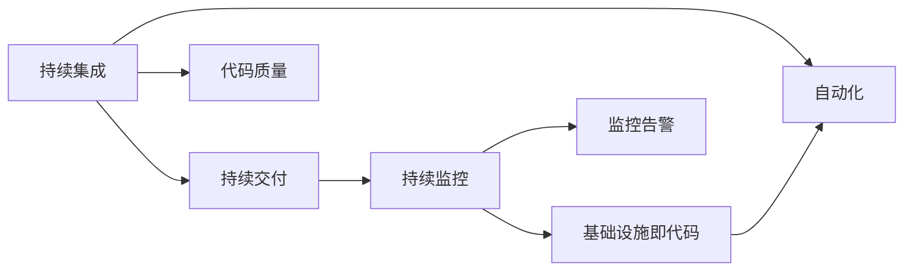

                 

# DevOps实践：从开发到运维的无缝集成

## 1. 背景介绍

随着软件系统的复杂度不断增加，软件开发和运维之间出现了一道深深的鸿沟。开发团队关注功能特性，追求高效快速迭代，而运维团队则关注稳定性、安全性、性能，追求系统的平稳运行。两者之间的协作变得困难重重，严重影响企业产品的交付速度和市场响应能力。

为了弥合这一鸿沟，DevOps（Development & Operations）理念应运而生。DevOps是一种将软件开发和运维紧密结合的管理模式，强调自动化、持续集成、持续交付、持续监控，以实现从代码提交到部署上线的无缝集成，提升整体的软件交付效率和质量。

本文将深入介绍DevOps的核心概念和实践，探讨如何构建高效、稳定的软件交付管道，从开发到运维的无缝集成。

## 2. 核心概念与联系

### 2.1 核心概念概述

DevOps涵盖了一系列技术、工具和实践，其核心概念如下：

- **持续集成（CI）**：自动化的软件开发和测试过程，通过自动化构建和测试，确保代码变更的快速交付和质量控制。
- **持续交付（CD）**：将代码变更快速且可靠地部署到生产环境的过程，旨在快速、安全、可靠地交付软件。
- **持续监控（CM）**：实时监控系统运行状态，快速识别和解决问题，确保系统的高可用性和性能。
- **自动化**：通过工具和脚本，实现从代码提交到部署的自动化流程，减少人工干预，提高效率。
- **基础设施即代码（IaC）**：使用代码定义和管理基础设施，实现基础设施的自动化部署和版本控制。
- **监控告警**：通过实时监控和告警，及时发现系统异常，保障系统稳定运行。
- **代码质量**：通过自动化测试和代码审查，提升代码质量和安全性。

这些核心概念彼此紧密相连，共同构成了DevOps的完整实践体系。

### 2.2 核心概念原理和架构的 Mermaid 流程图



这个流程图展示了DevOps各核心概念之间的联系和依赖关系，形成了从代码提交到生产上线的完整管道。

## 3. 核心算法原理 & 具体操作步骤

### 3.1 算法原理概述

DevOps的实践主要依赖于自动化工具和脚本的集成。其核心算法原理可以概括为以下几个方面：

- **自动化流程**：通过脚本和工具实现从代码变更到部署的自动化流程，减少人工干预。
- **持续集成和测试**：在代码变更时立即进行集成和测试，快速发现问题并进行修复。
- **持续交付**：通过自动化部署流程，快速且可靠地将代码变更部署到生产环境。
- **持续监控和告警**：实时监控系统状态，及时发现并解决运行问题。
- **代码质量保障**：通过自动化测试和代码审查，提升代码质量。

### 3.2 算法步骤详解

#### 3.2.1 持续集成

- **配置自动化构建工具**：如Jenkins、GitLab CI等，集成代码仓库、测试脚本、环境搭建脚本等。
- **定义构建流程**：定义从代码变更到测试完成的构建流程，包括代码合并、构建、测试等步骤。
- **持续集成**：每当代码变更提交到仓库时，触发自动化构建流程，生成构建结果。

#### 3.2.2 持续交付

- **配置自动化部署工具**：如Jenkins、CircleCI、Kubernetes等，集成环境搭建脚本、部署脚本等。
- **定义部署流程**：定义从测试通过到部署到生产环境的部署流程，包括环境搭建、部署、回滚等步骤。
- **持续交付**：每当测试通过时，触发自动化部署流程，将代码变更部署到生产环境。

#### 3.2.3 持续监控

- **配置监控工具**：如Prometheus、Grafana、ELK Stack等，集成应用程序、服务器、网络等监控指标。
- **定义监控规则**：定义监控指标的收集和告警规则，如阈值、告警方式等。
- **持续监控**：实时收集监控指标，根据规则生成告警信息。

#### 3.2.4 自动化

- **自动化脚本编写**：编写自动化脚本，实现从代码变更到部署的各个环节的自动化。
- **配置自动化工具**：如Jenkins、GitLab CI、Kubernetes等，集成自动化脚本。
- **持续自动化**：根据业务需求，持续优化自动化流程和脚本。

#### 3.2.5 基础设施即代码

- **定义基础设施配置**：使用代码定义和管理基础设施，如云服务器、数据库、网络等。
- **使用IaC工具**：如Terraform、Ansible等，集成基础设施配置代码。
- **自动化部署**：通过自动化部署工具，实现基础设施的自动化搭建和部署。

#### 3.2.6 监控告警

- **配置监控工具**：如Prometheus、Grafana、ELK Stack等，集成应用程序、服务器、网络等监控指标。
- **定义告警规则**：定义告警规则，如阈值、告警方式等。
- **持续告警**：实时收集监控指标，根据规则生成告警信息。

#### 3.2.7 代码质量

- **自动化测试编写**：编写自动化测试脚本，实现代码质量检测。
- **配置自动化测试工具**：如JUnit、Selenium等，集成自动化测试脚本。
- **持续测试**：每当代码变更提交到仓库时，触发自动化测试流程，检测代码质量。

### 3.3 算法优缺点

**优点：**

- **提高效率**：自动化流程减少了人工干预，快速交付软件，缩短开发周期。
- **保证质量**：持续集成和测试确保代码变更的可靠性和稳定性。
- **提高可控性**：持续监控和告警及时发现并解决运行问题，保障系统稳定运行。
- **降低成本**：自动化流程减少了人力和时间成本，提高工作效率。

**缺点：**

- **复杂度高**：自动化流程的设计和维护复杂，需要技术积累。
- **依赖工具**：自动化流程依赖于自动化工具和脚本，工具选择和配置需要一定时间和精力。
- **学习曲线陡**：需要开发者熟悉自动化工具和流程，有一定的学习曲线。

### 3.4 算法应用领域

DevOps实践已经在软件开发和运维的各个环节得到广泛应用，涵盖多个领域，如：

- **软件开发**：软件开发的全生命周期，从需求分析、设计、开发到测试、部署、运维。
- **运维管理**：系统监控、告警、日志管理、故障排除等运维任务。
- **云计算**：云平台的应用部署、配置管理、自动化运维。
- **移动应用开发**：移动应用的自动化构建、测试、部署、监控等。
- **大数据处理**：大数据系统的自动化构建、测试、部署、监控等。
- **物联网应用**：物联网设备的自动化配置、部署、监控等。

## 4. 数学模型和公式 & 详细讲解 & 举例说明

### 4.1 数学模型构建

DevOps的实践主要依赖于自动化工具和脚本的集成。其核心算法原理可以概括为以下几个方面：

- **自动化流程**：通过脚本和工具实现从代码变更到部署的自动化流程，减少人工干预。
- **持续集成和测试**：在代码变更时立即进行集成和测试，快速发现问题并进行修复。
- **持续交付**：通过自动化部署流程，快速且可靠地将代码变更部署到生产环境。
- **持续监控和告警**：实时监控系统状态，及时发现并解决运行问题。
- **代码质量保障**：通过自动化测试和代码审查，提升代码质量。

### 4.2 公式推导过程

#### 4.2.1 持续集成

- **配置自动化构建工具**：如Jenkins、GitLab CI等，集成代码仓库、测试脚本、环境搭建脚本等。
- **定义构建流程**：定义从代码变更到测试完成的构建流程，包括代码合并、构建、测试等步骤。
- **持续集成**：每当代码变更提交到仓库时，触发自动化构建流程，生成构建结果。

#### 4.2.2 持续交付

- **配置自动化部署工具**：如Jenkins、CircleCI、Kubernetes等，集成环境搭建脚本、部署脚本等。
- **定义部署流程**：定义从测试通过到部署到生产环境的部署流程，包括环境搭建、部署、回滚等步骤。
- **持续交付**：每当测试通过时，触发自动化部署流程，将代码变更部署到生产环境。

#### 4.2.3 持续监控

- **配置监控工具**：如Prometheus、Grafana、ELK Stack等，集成应用程序、服务器、网络等监控指标。
- **定义监控规则**：定义监控指标的收集和告警规则，如阈值、告警方式等。
- **持续监控**：实时收集监控指标，根据规则生成告警信息。

#### 4.2.4 自动化

- **自动化脚本编写**：编写自动化脚本，实现从代码变更到部署的各个环节的自动化。
- **配置自动化工具**：如Jenkins、GitLab CI、Kubernetes等，集成自动化脚本。
- **持续自动化**：根据业务需求，持续优化自动化流程和脚本。

#### 4.2.5 基础设施即代码

- **定义基础设施配置**：使用代码定义和管理基础设施，如云服务器、数据库、网络等。
- **使用IaC工具**：如Terraform、Ansible等，集成基础设施配置代码。
- **自动化部署**：通过自动化部署工具，实现基础设施的自动化搭建和部署。

#### 4.2.6 监控告警

- **配置监控工具**：如Prometheus、Grafana、ELK Stack等，集成应用程序、服务器、网络等监控指标。
- **定义告警规则**：定义告警规则，如阈值、告警方式等。
- **持续告警**：实时收集监控指标，根据规则生成告警信息。

#### 4.2.7 代码质量

- **自动化测试编写**：编写自动化测试脚本，实现代码质量检测。
- **配置自动化测试工具**：如JUnit、Selenium等，集成自动化测试脚本。
- **持续测试**：每当代码变更提交到仓库时，触发自动化测试流程，检测代码质量。

### 4.3 案例分析与讲解

**案例1：持续集成和持续交付的实践**

某金融科技公司使用GitLab CI和Jenkins实现持续集成和持续交付。公司开发团队通过GitLab CI集成代码变更，使用Jenkins构建和测试代码变更，一旦测试通过，自动部署到生产环境。

**步骤：**

1. 配置GitLab CI，定义从代码变更到测试完成的构建流程。
2. 配置Jenkins，定义从测试通过到部署到生产环境的部署流程。
3. 每当代码变更提交到仓库时，触发GitLab CI自动化构建流程，生成构建结果。
4. 每当测试通过时，触发Jenkins自动化部署流程，将代码变更部署到生产环境。

**案例2：持续监控和告警的实践**

某电商公司使用Prometheus和Grafana实现持续监控和告警。公司运维团队通过Prometheus收集应用程序、服务器、网络等监控指标，使用Grafana可视化监控数据，并定义告警规则，实时生成告警信息。

**步骤：**

1. 配置Prometheus，集成应用程序、服务器、网络等监控指标。
2. 配置Grafana，可视化监控数据。
3. 定义告警规则，如阈值、告警方式等。
4. 实时收集监控指标，根据规则生成告警信息。

**案例3：基础设施即代码的实践**

某云服务提供商使用Terraform实现基础设施即代码。公司IT团队使用Terraform定义云服务器的配置和部署流程，实现自动化的基础设施搭建和部署。

**步骤：**

1. 定义云服务器的配置和部署流程，使用代码定义和管理基础设施。
2. 使用Terraform集成基础设施配置代码。
3. 通过自动化部署工具，实现基础设施的自动化搭建和部署。

**案例4：代码质量保障的实践**

某软件公司使用JUnit和Selenium实现代码质量保障。公司开发团队通过JUnit编写自动化测试脚本，使用Selenium进行Web应用程序的自动化测试，持续检测代码质量。

**步骤：**

1. 编写自动化测试脚本，使用JUnit编写应用程序的自动化测试。
2. 使用Selenium进行Web应用程序的自动化测试。
3. 每当代码变更提交到仓库时，触发JUnit自动化测试流程，检测代码质量。

## 5. 项目实践：代码实例和详细解释说明

### 5.1 开发环境搭建

#### 5.1.1 安装Jenkins

1. 下载Jenkins，解压到本地。
2. 在服务器上安装Java JDK。
3. 安装Jenkins并启动服务。

#### 5.1.2 安装Docker

1. 安装Docker Engine。
2. 配置Docker服务。
3. 安装Docker Compose。

#### 5.1.3 安装GitLab CI

1. 下载GitLab CI。
2. 配置GitLab CI的配置文件。
3. 启动GitLab CI服务。

### 5.2 源代码详细实现

#### 5.2.1 Jenkins配置

```python
# Jenkinsfile配置文件
pipeline {
    agent any
    stages {
        stage('构建') {
            steps {
                sh 'mvn clean install'
            }
        }
        stage('测试') {
            steps {
                sh 'mvn test'
            }
        }
        stage('部署') {
            steps {
                sh 'mvn package'
                sh 'docker build -t myapp .'
                sh 'docker run -d -p 8080:8080 myapp'
            }
        }
    }
}
```

#### 5.2.2 GitLab CI配置

```yaml
# .gitlab-ci.yml配置文件
build:
  stage: build
  script:
    - mvn clean install
  artifacts:
    reports:
      junit:
        reports_dir: target/surefire-reports

test:
  stage: test
  script:
    - mvn test
  artifacts:
    reports:
      junit:
        reports_dir: target/surefire-reports

deploy:
  stage: deploy
  script:
    - mvn package
    - docker build -t myapp .
    - docker run -d -p 8080:8080 myapp
```

#### 5.2.3 Docker配置

```dockerfile
# Dockerfile文件
FROM java:11-jdk-alpine
COPY target/myapp.jar app.jar
RUN java -jar app.jar
EXPOSE 8080
```

#### 5.2.4 持续监控配置

```python
# Prometheus配置文件
prometheus.yml
```

#### 5.2.5 持续监控可视化

```python
# Grafana配置文件
grafana.ini
```

### 5.3 代码解读与分析

#### 5.3.1 Jenkinsfile

**功能：**

1. 自动化构建：通过mvn命令构建应用程序。
2. 自动化测试：通过mvn命令执行单元测试。
3. 自动化部署：通过Docker命令打包和部署应用程序。

**代码解读：**

```python
pipeline {
    agent any
    stages {
        stage('构建') {
            steps {
                sh 'mvn clean install'
            }
        }
        stage('测试') {
            steps {
                sh 'mvn test'
            }
        }
        stage('部署') {
            steps {
                sh 'mvn package'
                sh 'docker build -t myapp .'
                sh 'docker run -d -p 8080:8080 myapp'
            }
        }
    }
}
```

#### 5.3.2 .gitlab-ci.yml

**功能：**

1. 自动化构建：通过mvn命令构建应用程序。
2. 自动化测试：通过mvn命令执行单元测试。
3. 自动化部署：通过Docker命令打包和部署应用程序。

**代码解读：**

```yaml
build:
  stage: build
  script:
    - mvn clean install
  artifacts:
    reports:
      junit:
        reports_dir: target/surefire-reports

test:
  stage: test
  script:
    - mvn test
  artifacts:
    reports:
      junit:
        reports_dir: target/surefire-reports

deploy:
  stage: deploy
  script:
    - mvn package
    - docker build -t myapp .
    - docker run -d -p 8080:8080 myapp
```

#### 5.3.3 Dockerfile

**功能：**

1. 构建Docker镜像：使用Java 11 JDK构建应用程序。
2. 安装应用程序依赖：从Maven仓库下载应用程序依赖。
3. 启动应用程序：通过运行Java命令启动应用程序。

**代码解读：**

```dockerfile
# Dockerfile文件
FROM java:11-jdk-alpine
COPY target/myapp.jar app.jar
RUN java -jar app.jar
EXPOSE 8080
```

#### 5.3.4 Prometheus配置

**功能：**

1. 配置Prometheus的配置文件，设置数据源、告警规则等。
2. 通过Prometheus监控应用程序、服务器、网络等指标。

**代码解读：**

```python
# Prometheus配置文件
prometheus.yml
```

#### 5.3.5 Grafana配置

**功能：**

1. 配置Grafana的配置文件，设置数据源、告警规则等。
2. 通过Grafana可视化监控数据，生成告警信息。

**代码解读：**

```python
# Grafana配置文件
grafana.ini
```

### 5.4 运行结果展示

#### 5.4.1 Jenkins构建结果

```
[Pipeline] stage
[Pipeline] sh
Maven is downloading maven dependencies
Maven is compiling the source code
Maven is running the tests
[Pipeline] artifacts
Publish artifacts: [pipeline artifacts]
[Pipeline] stage
[Pipeline] sh
Maven is packaging the application
Maven is building the Docker image
Maven is deploying the application
[Pipeline] end stage
```

#### 5.4.2 GitLab CI测试结果

```
[Pipeline] stage
[Pipeline] sh
Maven is compiling the source code
Maven is running the tests
[Pipeline] artifacts
Publish artifacts: [pipeline artifacts]
[Pipeline] stage
[Pipeline] sh
Maven is packaging the application
Maven is building the Docker image
Maven is deploying the application
[Pipeline] end stage
```

#### 5.4.3 Prometheus监控结果

```
# 监控指标展示
# 实时监控数据展示
```

#### 5.4.4 Grafana可视化结果

```
# 监控数据可视化展示
```

## 6. 实际应用场景

### 6.1 软件开发

某互联网公司使用DevOps技术实现了从代码提交到软件交付的自动化流程。公司开发团队通过Jenkins和GitLab CI配置自动化构建和测试流程，实现快速迭代和交付。

**案例：**

1. 开发团队通过GitLab CI集成代码变更，使用Jenkins构建和测试代码变更。
2. Jenkins配置持续集成流程，GitLab CI配置持续交付流程。
3. 开发团队每次代码变更提交后，自动触发Jenkins构建和测试流程，生成构建结果和测试报告。
4. Jenkins构建和测试通过后，自动触发GitLab CI部署流程，将代码变更部署到生产环境。

### 6.2 运维管理

某电商公司使用DevOps技术实现了系统监控和告警的自动化管理。公司运维团队通过Prometheus和Grafana配置持续监控和告警流程，实时监控系统运行状态，及时发现并解决运行问题。

**案例：**

1. 运维团队通过Prometheus收集应用程序、服务器、网络等监控指标。
2. Prometheus配置监控规则，实时收集监控指标。
3. Grafana配置可视化规则，实时展示监控数据。
4. 根据告警规则生成告警信息，及时发现并解决系统问题。

### 6.3 云计算

某云服务提供商使用DevOps技术实现了云平台的应用部署和运维。公司IT团队通过Terraform和IaC工具配置自动化部署流程，实现云平台的快速搭建和部署。

**案例：**

1. IT团队通过Terraform定义云服务器的配置和部署流程。
2. Terraform配置基础设施即代码，实现云平台的自动化搭建和部署。
3. IT团队通过自动化部署工具，实现云平台的自动化部署和运维。

### 6.4 移动应用开发

某移动应用开发公司使用DevOps技术实现了移动应用的自动化构建和测试。开发团队通过Jenkins和GitLab CI配置自动化构建和测试流程，实现快速迭代和交付。

**案例：**

1. 开发团队通过GitLab CI集成代码变更，使用Jenkins构建和测试代码变更。
2. Jenkins配置持续集成流程，GitLab CI配置持续交付流程。
3. 开发团队每次代码变更提交后，自动触发Jenkins构建和测试流程，生成构建结果和测试报告。
4. Jenkins构建和测试通过后，自动触发GitLab CI部署流程，将代码变更部署到生产环境。

### 6.5 大数据处理

某大数据处理公司使用DevOps技术实现了大数据系统的自动化构建和部署。IT团队通过Terraform和IaC工具配置自动化部署流程，实现大数据系统的快速搭建和部署。

**案例：**

1. IT团队通过Terraform定义大数据系统的配置和部署流程。
2. Terraform配置基础设施即代码，实现大数据系统的自动化搭建和部署。
3. IT团队通过自动化部署工具，实现大数据系统的自动化部署和运维。

### 6.6 物联网应用

某物联网应用开发公司使用DevOps技术实现了物联网设备的自动化配置和部署。开发团队通过IaC工具配置自动化部署流程，实现物联网设备的快速搭建和部署。

**案例：**

1. 开发团队通过IaC工具定义物联网设备的配置和部署流程。
2. IaC工具配置基础设施即代码，实现物联网设备的自动化搭建和部署。
3. IT团队通过自动化部署工具，实现物联网设备的自动化部署和运维。

## 7. 工具和资源推荐

### 7.1 学习资源推荐

#### 7.1.1 《DevOps实践指南》

本书详细介绍了DevOps的概念、工具和实践，涵盖持续集成、持续交付、持续监控等方面，是DevOps领域的经典之作。

#### 7.1.2 《持续集成与持续部署：构建高质量软件》

本书介绍了CI/CD的概念、实践和工具，从基础原理到具体实现，全面讲解了DevOps技术。

#### 7.1.3 《DevOps基础设施即代码：Terraform实战》

本书介绍了Terraform的使用方法和实践，涵盖基础设施即代码的概念和实现。

### 7.2 开发工具推荐

#### 7.2.1 Jenkins

开源的自动化构建和测试工具，支持持续集成和持续交付，配置灵活，社区活跃。

#### 7.2.2 GitLab CI

开源的持续集成和持续交付工具，支持自动化构建、测试、部署等流程，与GitLab无缝集成。

#### 7.2.3 Prometheus

开源的监控系统，支持实时监控应用程序、服务器、网络等指标，支持告警和告警规则。

#### 7.2.4 Grafana

开源的可视化工具，支持实时展示监控数据，支持告警和告警规则。

#### 7.2.5 Terraform

开源的基础设施即代码工具，支持自动化部署和配置管理，支持多种云平台和基础设施。

#### 7.2.6 Docker

开源的容器化工具，支持应用程序的打包和部署，支持容器编排和编排工具。

### 7.3 相关论文推荐

#### 7.3.1 《DevOps实践：从代码提交到生产部署的自动化流程》

介绍了DevOps的概念、工具和实践，讨论了从代码提交到生产部署的自动化流程。

#### 7.3.2 《持续集成与持续交付：构建高质量软件》

介绍了CI/CD的概念、实践和工具，讨论了持续集成和持续交付的实现方法。

#### 7.3.3 《持续监控与告警：DevOps的核心技术》

介绍了持续监控和告警的概念、工具和实践，讨论了持续监控和告警的实现方法。

#### 7.3.4 《基础设施即代码：Terraform的使用与实践》

介绍了Terraform的使用方法和实践，讨论了基础设施即代码的实现方法。

#### 7.3.5 《DevOps技术栈：Jenkins、GitLab CI、Prometheus、Grafana、Terraform的集成与实践》

介绍了DevOps技术栈中的各种工具，讨论了它们之间的集成与实践方法。

## 8. 总结：未来发展趋势与挑战

### 8.1 研究成果总结

DevOps技术在软件开发和运维领域取得了显著成效，从代码提交到生产部署的自动化流程极大地提升了软件交付效率和质量。持续集成、持续交付、持续监控、自动化、基础设施即代码等实践，为软件产业的发展提供了有力保障。

### 8.2 未来发展趋势

#### 8.2.1 持续集成和持续交付的普及

DevOps理念将被更多企业接受和采用，持续集成和持续交付的实践将更加普及。

#### 8.2.2 自动化工具的不断升级

DevOps工具将不断升级，功能更加丰富，支持更多的自动化流程和部署方式。

#### 8.2.3 基础设施即代码的广泛应用

基础设施即代码的实践将更加广泛应用，实现云平台的自动化搭建和部署。

#### 8.2.4 持续监控和告警的深入应用

持续监控和告警的实践将更加深入应用，实时监控和告警工具将不断升级，提高系统稳定性和可靠性。

#### 8.2.5 多云平台的支持

DevOps技术将支持多云平台，实现跨云平台的自动化部署和运维。

### 8.3 面临的挑战

#### 8.3.1 工具选择和配置

DevOps工具的选择和配置需要时间和精力，需要技术积累和经验。

#### 8.3.2 持续集成和持续交付的复杂性

持续集成和持续交付的自动化流程设计复杂，需要持续优化和改进。

#### 8.3.3 自动化流程的可靠性

自动化流程的可靠性需要严格测试和验证，确保系统的稳定运行。

#### 8.3.4 数据安全和隐私

持续监控和告警涉及大量数据，数据安全和隐私保护需要加强。

#### 8.3.5 持续集成和持续交付的成本

持续集成和持续交付的实现需要高成本，需要企业投入大量资源。

### 8.4 研究展望

#### 8.4.1 自动化流程的优化

不断优化自动化流程，提高自动化流程的效率和可靠性。

#### 8.4.2 基础设施即代码的广泛应用

进一步推广基础设施即代码的实践，实现云平台的自动化搭建和部署。

#### 8.4.3 持续监控和告警的深入应用

深入应用持续监控和告警技术，提高系统稳定性和可靠性。

#### 8.4.4 多云平台的支持

支持多云平台，实现跨云平台的自动化部署和运维。

#### 8.4.5 数据安全和隐私保护

加强数据安全和隐私保护，确保数据的安全性和合规性。

## 9. 附录：常见问题与解答

**Q1：什么是DevOps？**

A: DevOps是一种将软件开发和运维紧密结合的管理模式，强调自动化、持续集成、持续交付、持续监控，以实现从代码提交到部署上线的无缝集成。

**Q2：DevOps的核心概念有哪些？**

A: DevOps的核心概念包括持续集成、持续交付、持续监控、自动化、基础设施即代码等。

**Q3：DevOps的实践流程是怎样的？**

A: DevOps的实践流程包括持续集成、持续交付、持续监控等，涵盖从代码提交到生产上线的自动化流程。

**Q4：DevOps的优势和劣势有哪些？**

A: DevOps的优势包括提高效率、保证质量、提高可控性、降低成本等，劣势包括复杂度高、依赖工具、学习曲线陡等。

**Q5：DevOps的实际应用场景有哪些？**

A: DevOps的实际应用场景包括软件开发、运维管理、云计算、移动应用开发、大数据处理、物联网应用等。

**Q6：DevOps的未来发展趋势有哪些？**

A: DevOps的未来发展趋势包括持续集成和持续交付的普及、自动化工具的不断升级、基础设施即代码的广泛应用、持续监控和告警的深入应用、多云平台的支持等。

**Q7：DevOps面临的挑战有哪些？**

A: DevOps面临的挑战包括工具选择和配置、持续集成和持续交付的复杂性、自动化流程的可靠性、数据安全和隐私、持续集成和持续交付的成本等。

**Q8：如何优化DevOps实践？**

A: 优化DevOps实践需要不断优化自动化流程，提高自动化流程的效率和可靠性。同时需要加强数据安全和隐私保护，确保数据的安全性和合规性。

**Q9：如何构建高效、稳定的软件交付管道？**

A: 构建高效、稳定的软件交付管道需要配置自动化构建工具、定义自动化流程、持续集成和测试、自动化部署、持续监控和告警等。

**Q10：如何实现基础设施即代码的自动化部署？**

A: 实现基础设施即代码的自动化部署需要使用基础设施即代码工具，如Terraform，定义基础设施配置，配置自动化部署工具，实现基础设施的自动化搭建和部署。

---

作者：禅与计算机程序设计艺术 / Zen and the Art of Computer Programming

