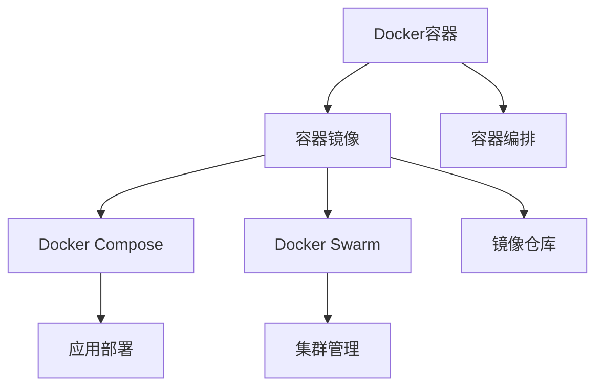

                 

# Docker：轻量级容器化解决方案

> 关键词：Docker, 容器化, 轻量级, 虚拟机, 软件包管理, 多平台支持

## 1. 背景介绍

### 1.1 问题由来
在当今复杂多变的软件开发环境中，如何高效、灵活地构建、部署和维护应用，成为了软件工程的一大难题。传统的虚拟机(Virtual Machine, VM)虽然能够提供隔离环境，但每台VM的启动和维护开销巨大，限制了开发和运维效率。Docker容器技术作为新一代的容器化解决方案，以其轻量级、易部署、易扩展的特性，迅速受到开发者和企业的青睐。

容器技术将应用及其依赖的软件包打包在容器中，以实现软件运行环境的隔离和一致性。Docker通过提供一种轻量级、可移植、可重复的容器化平台，简化了软件开发和部署的复杂度，大大提升了开发和运维效率。

### 1.2 问题核心关键点
Docker容器化技术能够帮助开发者快速构建、打包和部署应用，同时也保证了应用程序在不同环境中的稳定性和一致性。其核心关键点包括：
- 轻量级：Docker容器是基于内核级别的虚拟化技术实现的，相比于传统VM，Docker容器启动速度快、资源占用少。
- 可移植性：Docker容器可以在任何支持Docker的平台上运行，支持跨主机、云平台和环境迁移。
- 易管理：Docker提供了丰富的管理和编排工具，如Docker Compose、Docker Swarm等，简化了容器编排和运维工作。
- 安全性：Docker容器提供了多层次的安全机制，包括网络隔离、权限控制、资源限制等，确保应用安全运行。
- 生态系统完善：Docker拥有强大的社区和生态支持，提供了大量的官方镜像和第三方插件，极大提高了开发和运维效率。

## 2. 核心概念与联系

### 2.1 核心概念概述

为更好地理解Docker容器化技术的原理和应用，本节将介绍几个关键概念：

- Docker容器：一种轻量级的、独立的、可移植的运行环境，包含应用及其依赖的软件包和系统库。
- 容器镜像：Docker容器的基础，是容器化应用及其依赖的打包格式，可以在任何支持Docker的环境中运行。
- Docker Compose：一个Docker容器编排工具，用于定义和运行多个容器的集合，简化了多容器应用的部署和管理。
- Docker Swarm：一个Docker容器编排平台，提供集群管理和调度功能，支持自动扩展、故障恢复和负载均衡。
- 镜像仓库：用于存储、管理和分发Docker镜像的平台，如Docker Hub、阿里云镜像仓库等。

这些概念通过Docker容器化技术的架构，紧密地联系在一起。Docker容器在容器镜像的基础上，通过Docker Compose和Swarm等工具，实现了多容器应用的高效部署和管理，同时确保应用在不同环境中的稳定性和一致性。

### 2.2 核心概念原理和架构的 Mermaid 流程图



该流程图展示了Docker容器化技术的基本架构和关键组件：

1. Docker容器是基于容器镜像的运行环境，包含应用及其依赖的软件包和系统库。
2. Docker Compose和Swarm用于容器编排和管理，简化多容器应用的部署和运维。
3. 镜像仓库存储和管理Docker镜像，方便分发和共享。
4. 应用通过容器编排工具部署到Docker Swarm集群中，实现分布式运行和负载均衡。

## 3. 核心算法原理 & 具体操作步骤
### 3.1 算法原理概述

Docker容器化技术的核心原理是利用Linux内核的CGroup和Namespace技术，实现资源的隔离和沙箱化。具体来说，Docker容器通过以下步骤实现应用隔离和一致性：

1. 创建容器Namespace：Docker容器会创建一个独立的Namespace，隔离容器与宿主机之间的文件系统、网络、进程等资源。
2. 创建容器CGroup：Docker容器会创建一个独立的CGroup，限制容器可用的CPU、内存等系统资源，防止资源滥用。
3. 挂载容器镜像：Docker容器会将指定的镜像文件挂载到容器的根文件系统中，确保容器启动后能够运行所需的依赖软件包。
4. 启动容器进程：Docker容器将启动应用进程，并为其提供所需的资源和环境，使其在隔离的容器环境中运行。

通过这些步骤，Docker容器实现了应用及其依赖软件包的打包和隔离，确保了应用程序在不同环境中的稳定性和一致性。

### 3.2 算法步骤详解

以下是使用Docker容器化技术进行应用构建、打包和部署的详细步骤：

**Step 1: 准备Docker环境和应用代码**
- 安装Docker引擎和客户端工具。
- 编写应用代码，并打包依赖的软件包和系统库。

**Step 2: 创建容器镜像**
- 使用Dockerfile定义容器镜像构建规则，包含应用源码、依赖包和系统库。
- 在Dockerfile中指定构建步骤，包括环境准备、编译、测试等。
- 使用Docker build命令构建容器镜像，生成镜像文件。

**Step 3: 运行Docker容器**
- 使用Docker run命令运行Docker容器，指定容器镜像、端口映射、环境变量等参数。
- 启动容器后，应用会自动在隔离的容器环境中运行。

**Step 4: 容器编排和管理**
- 使用Docker Compose定义多容器应用的编排规则，指定服务间的依赖关系和启动顺序。
- 使用Docker Compose up命令启动多容器应用，自动分配资源、配置网络和路由。
- 使用Docker Swarm集群管理工具，实现容器的自动化部署、扩展和故障恢复。

### 3.3 算法优缺点

Docker容器化技术具有以下优点：
- 轻量级：Docker容器基于内核级别虚拟化，相比于传统VM，容器启动速度快、资源占用少。
- 易部署：Docker容器可以通过Docker Compose和Swarm等工具，快速部署和管理多容器应用。
- 可移植性：Docker容器可以在任何支持Docker的环境中运行，支持跨主机、云平台和环境迁移。
- 安全性：Docker容器提供了多层次的安全机制，包括网络隔离、权限控制、资源限制等，确保应用安全运行。
- 易管理：Docker提供了丰富的管理和编排工具，简化了容器编排和运维工作。

同时，Docker容器化技术也存在一些局限性：
- 依赖Docker环境：Docker容器只能在支持Docker的环境中运行，无法跨平台运行。
- 不支持动态扩缩容：Docker Swarm虽然支持集群管理和调度，但无法实现动态扩缩容，需要手动调整容器数量。
- 依赖静态依赖包：Docker容器依赖静态依赖包，无法动态加载新的依赖包，增加了维护成本。

尽管存在这些局限性，但就目前而言，Docker容器化技术仍是应用开发和运维的主流方案。未来相关研究的重点在于如何进一步提升Docker的灵活性和动态性，以及如何与云平台和其他容器化技术进行更好的集成。

### 3.4 算法应用领域

Docker容器化技术已经在众多领域得到广泛应用，以下是几个典型应用场景：

- 云原生应用：Docker容器化技术支持微服务架构，帮助企业实现云原生应用的高效构建和部署。
- 软件开发：Docker容器化技术简化了软件开发和测试流程，帮助开发者快速构建和测试应用。
- DevOps：Docker容器化技术支持DevOps自动化流程，包括构建、测试、部署和运维等环节，提高开发和运维效率。
- 移动应用：Docker容器化技术支持移动应用的打包和部署，确保应用在不同平台上的稳定性和一致性。
- IoT应用：Docker容器化技术支持物联网设备的容器化部署和管理，简化设备运维和升级流程。

除了上述这些经典应用外，Docker容器化技术还被创新性地应用到更多场景中，如可移植系统、分布式数据库、大数据应用等，为各个行业带来新的变革。

## 4. 数学模型和公式 & 详细讲解 & 举例说明

### 4.1 数学模型构建

Docker容器化技术涉及到的主要数学模型包括：

- 资源隔离模型：Docker容器通过CGroup和Namespace技术实现资源隔离，确保容器与宿主机之间资源的独立和隔离。
- 镜像构建模型：Docker镜像通过Dockerfile定义构建规则，确保应用及其依赖的打包一致性。
- 容器编排模型：Docker Compose和Swarm工具通过配置文件定义容器编排规则，实现多容器应用的自动化部署和管理。

### 4.2 公式推导过程

以下是Docker容器化技术的数学模型构建和公式推导：

- 资源隔离模型：Docker容器通过CGroup和Namespace技术实现资源隔离，确保容器与宿主机之间资源的独立和隔离。具体来说，Docker容器会创建独立的Namespace和CGroup，限制容器可用的CPU、内存等系统资源，防止资源滥用。
- 镜像构建模型：Docker镜像通过Dockerfile定义构建规则，确保应用及其依赖的打包一致性。具体来说，Dockerfile包含应用源码、依赖包和系统库的构建步骤，生成镜像文件。
- 容器编排模型：Docker Compose和Swarm工具通过配置文件定义容器编排规则，实现多容器应用的自动化部署和管理。具体来说，Docker Compose定义应用服务和容器之间的关系，Docker Swarm实现容器的自动化部署、扩展和故障恢复。

### 4.3 案例分析与讲解

以下通过一个简单的应用示例，说明如何使用Docker容器化技术进行应用构建和部署：

**案例：构建一个Python Flask应用**

1. 编写Python Flask应用代码：
```python
from flask import Flask, request
app = Flask(__name__)

@app.route('/')
def hello():
    return 'Hello, World!'

if __name__ == '__main__':
    app.run(host='0.0.0.0', port=8080)
```

2. 编写Dockerfile定义镜像构建规则：
```dockerfile
# 定义Python运行时环境
FROM python:3.9-slim

# 设置应用依赖
COPY requirements.txt /
RUN pip install -r requirements.txt

# 设置应用代码
COPY . /app

# 设置环境变量
ENV NAME=World

# 设置应用启动命令
CMD ["python", "app.py"]
```

3. 在Dockerfile中指定构建步骤：
- 从Python 3.9-slim镜像开始构建
- 复制应用的requirements.txt文件和代码
- 安装应用依赖
- 设置环境变量
- 启动应用

4. 使用Docker build命令构建容器镜像：
```
docker build -t my-flask-app .
```

5. 使用Docker run命令运行Docker容器：
```
docker run -p 8080:8080 my-flask-app
```

通过以上步骤，即可在Docker容器中构建、打包和部署Python Flask应用，实现应用的隔离和一致性。

## 5. 项目实践：代码实例和详细解释说明
### 5.1 开发环境搭建

在进行Docker项目实践前，我们需要准备好开发环境。以下是使用Linux系统安装Docker和Docker Compose的步骤：

1. 安装Docker引擎和客户端工具：
```
sudo apt-get update
sudo apt-get install apt-transport-https ca-certificates curl gnupg-lsb-release
curl -fsSL https://download.docker.com/linux/debian/gpg | sudo gpg --dearmor -o /usr/share/keyrings/docker-archive-keyring.gpg
echo "deb [arch=amd64 signed-by=/usr/share/keyrings/docker-archive-keyring.gpg] https://download.docker.com/linux/debian stable main" | sudo tee /etc/apt/sources.list.d/docker.list
sudo apt-get update
sudo apt-get install docker-ce docker-ce-cli containerd.io
```

2. 安装Docker Compose：
```
sudo apt-get install docker-compose
```

3. 安装Docker Swarm：
```
sudo apt-get install docker-swarm
```

完成上述步骤后，即可在Linux系统上开始Docker项目实践。

### 5.2 源代码详细实现

以下是一个使用Docker Compose部署的简单Node.js应用的示例代码：

**Dockerfile：**
```dockerfile
# 定义Node.js运行时环境
FROM node:14

# 设置应用依赖
COPY package.json yarn.lock .
RUN yarn install

# 设置应用代码
COPY . /app

# 设置应用启动命令
CMD ["node", "app.js"]
```

**Docker Compose配置文件：**
```yaml
version: '3'
services:
  app:
    build: .
    ports:
      - '8080:8080'
    volumes:
      - .:/app
```

**app.js：**
```javascript
const express = require('express');
const app = express();

app.get('/', (req, res) => {
  res.send('Hello, Docker!');
});

app.listen(8080, () => {
  console.log('App listening on port 8080!');
});
```

**package.json：**
```json
{
  "name": "app",
  "version": "1.0.0",
  "description": "A simple Node.js app",
  "main": "app.js",
  "scripts": {
    "watch": "node app.js"
  },
  "dependencies": {
    "express": "^4.17.1"
  }
}
```

通过以上步骤，即可在Docker容器中构建、打包和部署Node.js应用，实现应用的隔离和一致性。

### 5.3 代码解读与分析

让我们再详细解读一下关键代码的实现细节：

**Dockerfile：**
- FROM指令指定了构建环境，这里使用了Node.js 14镜像。
- COPY指令复制了应用依赖文件和代码到容器中。
- RUN指令在容器中安装了应用依赖，确保应用能够正确运行。
- CMD指令指定了应用启动命令。

**Docker Compose配置文件：**
- services定义了应用服务的名称和构建规则。
- ports指定了应用的端口映射关系。
- volumes指定了应用的数据存储路径。

**app.js：**
- 定义了一个简单的Express应用，返回"Hello, Docker!"字符串。

**package.json：**
- 定义了应用的基本信息，包括应用名称、版本、依赖等。

通过这些代码，我们可以使用Docker容器化技术构建、打包和部署Node.js应用，确保应用在不同环境中的稳定性和一致性。

### 5.4 运行结果展示

启动Docker Compose后，即可在宿主机的8080端口访问应用，在浏览器中访问`http://localhost:8080`，即可看到"Hello, Docker!"的输出。

## 6. 实际应用场景

### 6.1 云原生应用

Docker容器化技术支持微服务架构，帮助企业实现云原生应用的高效构建和部署。通过Docker容器，企业可以轻松构建、打包和部署微服务应用，实现应用的自动化、可扩展和可移植性。例如，在云原生应用中，企业可以使用Kubernetes等容器编排工具，实现应用的自动化部署、扩展和故障恢复，提高应用的稳定性和可用性。

### 6.2 软件开发

Docker容器化技术简化了软件开发和测试流程，帮助开发者快速构建和测试应用。通过Docker容器，开发者可以在同一环境中快速构建、测试和部署应用，确保应用在不同环境中的稳定性和一致性。例如，在软件开发中，开发者可以使用Docker Compose和Swarm工具，自动化构建、测试和部署应用，提高开发效率和质量。

### 6.3 DevOps

Docker容器化技术支持DevOps自动化流程，包括构建、测试、部署和运维等环节，提高开发和运维效率。通过Docker容器，DevOps工程师可以自动化构建、测试和部署应用，实现CI/CD管道自动化。例如，在DevOps自动化流程中，企业可以使用Jenkins等CI/CD工具，自动化构建和测试应用，提高开发和运维效率。

### 6.4 移动应用

Docker容器化技术支持移动应用的打包和部署，确保应用在不同平台上的稳定性和一致性。通过Docker容器，企业可以打包和部署移动应用，确保应用在不同平台上的稳定性和一致性。例如，在移动应用开发中，企业可以使用Docker Compose和Swarm工具，自动化构建和部署应用，确保应用在不同平台上的稳定性和一致性。

### 6.5 IoT应用

Docker容器化技术支持物联网设备的容器化部署和管理，简化设备运维和升级流程。通过Docker容器，企业可以容器化部署和管理物联网设备，确保设备的稳定性和一致性。例如，在物联网应用中，企业可以使用Docker Swarm集群管理工具，实现容器的自动化部署、扩展和故障恢复，提高设备的稳定性和可用性。

## 7. 工具和资源推荐
### 7.1 学习资源推荐

为了帮助开发者系统掌握Docker容器化技术的原理和实践技巧，这里推荐一些优质的学习资源：

1. 《Docker实战指南》书籍：由Docker官方出版的Docker实战指南，深入浅出地介绍了Docker容器化技术的原理和实践技巧。

2. Docker官方文档：Docker官方文档，提供了详细的Docker容器化技术的使用指南和最佳实践。

3. Docker Swarm官方文档：Docker Swarm官方文档，提供了详细的Swarm容器编排工具的使用指南和最佳实践。

4. Docker Compose官方文档：Docker Compose官方文档，提供了详细的Compose容器编排工具的使用指南和最佳实践。

5. Docker Hub：Docker Hub是Docker官方的镜像仓库，提供了丰富的Docker镜像资源，方便开发者快速构建和部署应用。

通过对这些资源的学习实践，相信你一定能够快速掌握Docker容器化技术的精髓，并用于解决实际的开发和运维问题。

### 7.2 开发工具推荐

高效的开发离不开优秀的工具支持。以下是几款用于Docker容器化开发的常用工具：

1. Docker引擎和客户端工具：Docker官方提供的引擎和客户端工具，支持Docker容器的构建、打包和部署。

2. Docker Compose：Docker Compose是Docker官方提供的容器编排工具，用于定义和运行多个容器的集合，简化多容器应用的部署和管理。

3. Docker Swarm：Docker Swarm是Docker官方提供的容器编排平台，提供集群管理和调度功能，支持自动扩展、故障恢复和负载均衡。

4. Docker Hub：Docker Hub是Docker官方的镜像仓库，提供丰富的Docker镜像资源，方便开发者快速构建和部署应用。

5. Google Cloud Platform：Google Cloud Platform提供了丰富的Docker容器化工具和资源，支持容器编排、集群管理和自动扩展等。

合理利用这些工具，可以显著提升Docker容器化开发的效率，加快创新迭代的步伐。

### 7.3 相关论文推荐

Docker容器化技术的发展源于学界的持续研究。以下是几篇奠基性的相关论文，推荐阅读：

1. Docker: The Union of Unification and Distribution（Docker官方论文）：介绍了Docker容器的基本原理和设计思路，奠定了Docker容器化技术的基础。

2. Swarm: Distributed System Toolkit for Docker（Swarm官方论文）：介绍了Docker Swarm的架构和设计，详细讲解了Swarm容器编排平台的实现细节。

3. docker-compose-a-declarative-approach-to-docker-container-orchestration（Compose官方论文）：介绍了Docker Compose的设计和实现，详细讲解了Compose容器编排工具的原理和应用。

这些论文代表了大规模容器化技术的发展脉络。通过学习这些前沿成果，可以帮助研究者把握学科前进方向，激发更多的创新灵感。

## 8. 总结：未来发展趋势与挑战

### 8.1 总结

本文对Docker容器化技术的原理和应用进行了全面系统的介绍。首先阐述了Docker容器化技术在应用开发和运维中的重要性和应用场景，明确了容器化技术在提高开发和运维效率、确保应用稳定性和一致性方面的独特价值。其次，从原理到实践，详细讲解了Docker容器的构建、打包和部署过程，给出了Docker项目实践的完整代码实例。同时，本文还广泛探讨了Docker容器化技术在云原生应用、软件开发、DevOps、移动应用、IoT应用等多个领域的应用前景，展示了容器化技术的广泛应用潜力。此外，本文精选了Docker容器化技术的各类学习资源，力求为读者提供全方位的技术指引。

通过本文的系统梳理，可以看到，Docker容器化技术已经成为了应用开发和运维的主流方案，极大提升了软件开发和部署的效率，推动了DevOps自动化流程的发展，具有广阔的市场前景。

### 8.2 未来发展趋势

展望未来，Docker容器化技术将呈现以下几个发展趋势：

1. 容器编排平台的升级：Docker Swarm和Compose等容器编排工具将继续升级，提供更强大的容器编排和管理功能，支持多集群管理、服务网格等先进技术。

2. 容器云平台的普及：越来越多的企业将采用容器云平台，实现容器化应用的自动化部署、扩展和故障恢复，提升应用的稳定性和可用性。

3. 容器化技术的集成：Docker容器化技术将与其他容器化技术（如Kubernetes、Rancher等）进行更紧密的集成，提供更全面的容器化解决方案。

4. 容器化技术的跨平台支持：Docker容器化技术将继续拓展跨平台支持，支持更多操作系统和硬件平台，实现应用的无缝迁移和部署。

5. 容器化技术的社区化发展：Docker容器化技术将进一步社区化发展，提供更丰富的社区支持和生态资源，推动容器化技术的普及和应用。

以上趋势凸显了Docker容器化技术的广阔前景。这些方向的探索发展，必将进一步提升容器化技术的效率和灵活性，推动容器化技术在更多行业得到应用，为数字化转型提供强大的技术支撑。

### 8.3 面临的挑战

尽管Docker容器化技术已经取得了显著成果，但在迈向更加智能化、普适化应用的过程中，它仍面临诸多挑战：

1. 容器编排复杂性：随着应用的规模和复杂度增加，容器编排的难度也会增加，如何自动化管理复杂的容器集群，提高编排效率，仍是一个重要挑战。

2. 资源利用率问题：Docker容器化技术虽然提高了应用的部署和运行效率，但在某些场景下，容器资源的利用率仍较低，如何优化资源使用，降低容器化成本，也是一个重要问题。

3. 容器化技术的安全性：Docker容器化技术提供了多层次的安全机制，但仍存在漏洞和安全隐患，如何进一步提升容器化技术的安全性，确保应用的安全运行，是一个重要课题。

4. 容器化技术的标准化：Docker容器化技术虽然得到了广泛应用，但在标准化方面仍存在一些问题，如何实现容器化技术的标准化，促进容器化技术的普及和应用，也是一个重要挑战。

5. 容器化技术的生态问题：Docker容器化技术虽然拥有庞大的社区和生态，但在生态资源的共享和互操作性方面仍存在一些问题，如何进一步整合和优化容器化技术的生态资源，是一个重要课题。

正视容器化技术面临的这些挑战，积极应对并寻求突破，将有助于Docker容器化技术走向成熟的未来，为构建更加智能、普适的容器化应用提供坚实的技术基础。

### 8.4 研究展望

面对Docker容器化技术所面临的挑战，未来的研究需要在以下几个方面寻求新的突破：

1. 探索更高效的容器编排技术：开发更加高效的容器编排工具，支持复杂容器集群的自动化管理，提高编排效率。

2. 优化资源利用率：开发更优化的容器化技术，优化资源使用，降低容器化成本。

3. 增强安全性：进一步提升容器化技术的安全性，提供更强大的安全机制，确保应用的安全运行。

4. 推进标准化：推动容器化技术的标准化，促进容器化技术的普及和应用。

5. 整合生态资源：整合和优化容器化技术的生态资源，促进容器化技术的社区化和普适化发展。

这些研究方向的探索，必将引领Docker容器化技术迈向更高的台阶，为构建更加智能、普适的容器化应用提供坚实的技术基础。面向未来，Docker容器化技术还需要与其他容器化技术进行更深入的融合，协同发力，共同推动容器化技术的进步。只有勇于创新、敢于突破，才能不断拓展容器化技术的边界，让容器化技术更好地服务于数字化转型。

## 9. 附录：常见问题与解答

**Q1：Docker容器化技术是否适用于所有应用？**

A: Docker容器化技术适用于大多数应用，特别是那些依赖大量依赖包的应用。对于一些需要动态加载新依赖包的应用，或者需要进行容器间通信的应用，可能需要在容器编排和网络配置上进行一些特殊处理。

**Q2：Docker容器化技术是否会增加开发成本？**

A: Docker容器化技术虽然增加了初始的构建和配置成本，但在开发和运维阶段可以显著降低成本。通过容器化技术，开发者可以快速构建和测试应用，简化部署流程，降低运维成本，提高开发和运维效率。

**Q3：Docker容器化技术是否会影响应用的性能？**

A: Docker容器化技术虽然增加了一些额外的开销，但并不会显著影响应用的性能。在大部分场景下，Docker容器化技术可以提供与应用本地运行相同的性能，甚至在某些场景下，由于容器化技术提升了资源利用率，应用的性能可能会有所提升。

**Q4：Docker容器化技术是否支持动态扩缩容？**

A: Docker Swarm虽然支持容器的自动扩展和负载均衡，但在动态扩缩容方面仍存在一些局限性。Docker Swarm提供的扩展机制基于任务的实际负载，可能无法完全实现动态扩缩容。

**Q5：Docker容器化技术是否支持跨平台部署？**

A: Docker容器化技术支持跨平台部署，可以在任何支持Docker的环境中运行。但Docker容器化技术在一些平台上的性能和特性可能存在差异，开发者需要根据具体平台进行优化和调整。

通过以上问题的解答，相信你对Docker容器化技术的优势和局限有了更全面的了解，可以更好地应用于实际开发和运维中。

