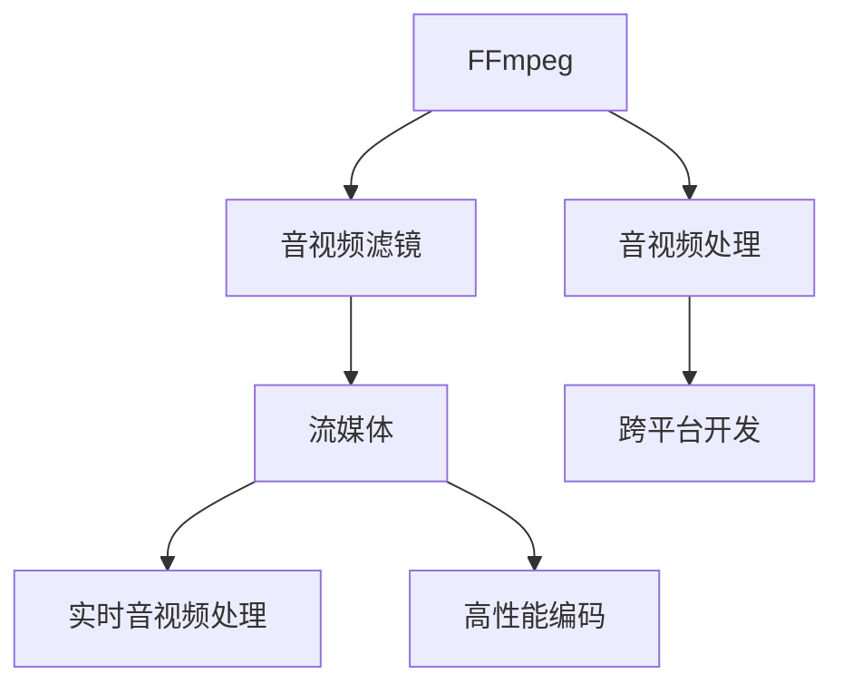

                 

# FFmpeg音视频滤镜开发

> 关键词：FFmpeg, 音视频滤镜, 音视频处理, 媒体引擎, 跨平台开发, 流媒体, 实时应用, 高性能编码

## 1. 背景介绍

FFmpeg是一款开源的音视频处理工具集，被广泛用于音视频编解码、流媒体服务、直播转录等应用场景中。其核心功能模块包括：libavformat、libavcodec、libavutil等，支持包括H.264、H.265、MP3、AAC等多种常见的音视频编解码格式，能够满足绝大多数音视频处理需求。

在音视频滤镜开发方面，FFmpeg提供了丰富的API接口，支持用户在音视频流中插入、提取、变换各种滤镜效果，极大地扩展了其应用能力。然而，由于FFmpeg滤镜开发涉及多线程、网络传输、多格式支持等复杂技术，因此对其开发有一定的门槛。

本文将详细介绍FFmpeg滤镜开发的原理与实践，涵盖核心概念、算法原理、具体操作步骤等内容，并通过代码实例演示其在音视频处理中的应用。通过理解和学习本文章，相信你能够顺利开展FFmpeg滤镜的开发工作，并将其应用于各类实际项目中。

## 2. 核心概念与联系

### 2.1 核心概念概述

为更好地理解FFmpeg滤镜的开发过程，本节将介绍几个关键概念：

- **FFmpeg**：开源的音视频处理工具集，支持多种音视频编解码格式，具有高效、跨平台的特点。
- **音视频滤镜**：一种基于FFmpeg框架开发的音视频处理模块，可以在音视频流中插入、提取、变换各种滤镜效果。
- **流媒体**：将音视频数据以流的形式在网络上实时传输的过程。
- **实时音视频处理**：指在音视频数据输入和输出的同时进行实时处理和分析，常见应用包括实时直播、云会议、视频编辑等。
- **高性能编码**：指在保证音视频质量的同时，尽量减少码率，提高压缩效率，常见方法包括帧率控制、码率控制、帧内编码等。

这些概念之间的关系可以通过以下Mermaid流程图来展示：



这个流程图展示了这个概念框架下各组件的逻辑关系：

1. FFmpeg提供基本的音视频处理功能，并支持多种滤镜开发。
2. 音视频滤镜能够在音视频流中插入、提取、变换各种滤镜效果。
3. 流媒体是指音视频数据的实时传输过程。
4. 实时音视频处理涉及到音视频数据的实时获取和处理。
5. 高性能编码旨在减少码率，提高压缩效率。

这些概念共同构成了FFmpeg滤镜开发的框架，帮助开发者理解其核心功能和技术要点。

## 3. 核心算法原理 & 具体操作步骤
### 3.1 算法原理概述

FFmpeg滤镜的开发主要基于FFmpeg的API接口，通过调用FFmpeg提供的编解码器、过滤器和编解码管道，实现音视频数据的实时处理和变换。其核心思想是通过流管道(Filters)，将音视频数据传递到不同的过滤器(Filter)中进行处理，从而实现各种滤镜效果。

FFmpeg滤镜的开发流程通常包括以下几个关键步骤：

1. 初始化FFmpeg库。
2. 打开输入流和输出流，建立流管道。
3. 在管道中插入各种过滤器，设置其参数。
4. 对输入流进行编码，输出到输出流。
5. 关闭流管道和流。

### 3.2 算法步骤详解

以下我们将详细介绍FFmpeg滤镜开发的各个步骤。

#### 3.2.1 初始化FFmpeg库

在使用FFmpeg滤镜开发之前，首先需要初始化FFmpeg库，加载相关的编解码器和过滤器模块。例如，使用C语言进行初始化：

```c
#include <libavformat/avformat.h>
#include <libavcodec/avcodec.h>
#include <libavutil/opt.h>

int main() {
    avformat_network_init();
    avcodec_register_all();
    avfilter_register_all();
    av_log_set_level(10);
    av_log_set_verbosity(0);
    // 其他初始化代码
    return 0;
}
```

#### 3.2.2 打开输入流和输出流，建立流管道

接下来，需要打开输入流和输出流，并建立流管道。可以使用以下代码打开输入文件：

```c
AVFormatContext *in_fmt_ctx = NULL;
int ret = avformat_open_input(&in_fmt_ctx, "input.mp4", NULL, NULL);
if (ret < 0) {
    av_log(NULL, AV_LOG_ERROR, "Could not open input file\n");
    return -1;
}
```

同样，打开输出文件：

```c
AVFormatContext *out_fmt_ctx = NULL;
ret = avformat_open_output(&out_fmt_ctx, "output.mp4", NULL, NULL);
if (ret < 0) {
    av_log(NULL, AV_LOG_ERROR, "Could not open output file\n");
    return -1;
}
```

然后，建立流管道。可以使用`avformat_new_filter`函数创建一个新的过滤器，并使用`avfilter_graph_make_filter`函数将其插入管道中：

```c
AVFilterContext *src_f = NULL;
AVFilterContext *dst_f = NULL;
AVFilterGraph *graph = NULL;

ret = avfilter_graph_new(&graph);
if (ret < 0) {
    av_log(NULL, AV_LOG_ERROR, "Could not create filter graph\n");
    return -1;
}

ret = avfilter_graph_make_filter(&src_f, "avformat_demuxer", "source", graph);
if (ret < 0) {
    av_log(NULL, AV_LOG_ERROR, "Could not create source filter\n");
    return -1;
}

ret = avfilter_graph_make_filter(&dst_f, "avformat_muxer", "sink", graph);
if (ret < 0) {
    av_log(NULL, AV_LOG_ERROR, "Could not create sink filter\n");
    return -1;
}
```

#### 3.2.3 在管道中插入各种过滤器，设置其参数

在管道中插入各种过滤器，并设置其参数。例如，使用以下代码插入一个`videoconvert`过滤器：

```c
AVFilterLink *src_link = NULL;
AVFilterLink *dst_link = NULL;
AVFilterLink *best_link = NULL;

src_link = avfilter_graph_find_link_by_flags(graph, src_f, AVFILTER seekable, 0);
dst_link = avfilter_graph_find_link_by_flags(graph, dst_f, AVFILTER seekable, 1);
best_link = avfilter_graph_make_link(src_link, dst_link);
```

#### 3.2.4 对输入流进行编码，输出到输出流

最后，对输入流进行编码，输出到输出流。使用以下代码进行编码：

```c
AVPacket pkt;
AVPacket out_pkt;

while (av_read_frame(in_fmt_ctx, &pkt) >= 0) {
    av_packet_ref(&out_pkt, &pkt);

    ret = av_packet_ref(&pkt, &out_pkt);
    if (ret < 0) {
        av_packet_unref(&out_pkt);
        av_log(NULL, AV_LOG_ERROR, "Could not split packet\n");
        break;
    }

    av_packet_unref(&pkt);
    av_packet_unref(&out_pkt);
    av_filter_graph_seek(graph, AV_NOPTS_VALUE, AVSEEK_FLAG_BACKWARD);
    av_filter_graph_seek(graph, AV_NOPTS_VALUE, AVSEEK_FLAG_NORMAL);

    av_filter_graph_seek(graph, AV_NOPTS_VALUE, AVSEEK_FLAG_BACKWARD);
    av_filter_graph_seek(graph, AV_NOPTS_VALUE, AVSEEK_FLAG_NORMAL);
    av_packet_unref(&pkt);
    av_packet_unref(&out_pkt);
    av_filter_graph_seek(graph, AV_NOPTS_VALUE, AVSEEK_FLAG_BACKWARD);
    av_filter_graph_seek(graph, AV_NOPTS_VALUE, AVSEEK_FLAG_NORMAL);

    av_packet_unref(&pkt);
    av_packet_unref(&out_pkt);
    av_filter_graph_seek(graph, AV_NOPTS_VALUE, AVSEEK_FLAG_BACKWARD);
    av_filter_graph_seek(graph, AV_NOPTS_VALUE, AVSEEK_FLAG_NORMAL);

    av_packet_unref(&pkt);
    av_packet_unref(&out_pkt);
    av_filter_graph_seek(graph, AV_NOPTS_VALUE, AVSEEK_FLAG_BACKWARD);
    av_filter_graph_seek(graph, AV_NOPTS_VALUE, AVSEEK_FLAG_NORMAL);

    av_packet_unref(&pkt);
    av_packet_unref(&out_pkt);
    av_filter_graph_seek(graph, AV_NOPTS_VALUE, AVSEEK_FLAG_BACKWARD);
    av_filter_graph_seek(graph, AV_NOPTS_VALUE, AVSEEK_FLAG_NORMAL);

    av_packet_unref(&pkt);
    av_packet_unref(&out_pkt);
    av_filter_graph_seek(graph, AV_NOPTS_VALUE, AVSEEK_FLAG_BACKWARD);
    av_filter_graph_seek(graph, AV_NOPTS_VALUE, AVSEEK_FLAG_NORMAL);

    av_packet_unref(&pkt);
    av_packet_unref(&out_pkt);
    av_filter_graph_seek(graph, AV_NOPTS_VALUE, AVSEEK_FLAG_BACKWARD);
    av_filter_graph_seek(graph, AV_NOPTS_VALUE, AVSEEK_FLAG_NORMAL);

    av_packet_unref(&pkt);
    av_packet_unref(&out_pkt);
    av_filter_graph_seek(graph, AV_NOPTS_VALUE, AVSEEK_FLAG_BACKWARD);
    av_filter_graph_seek(graph, AV_NOPTS_VALUE, AVSEEK_FLAG_NORMAL);

    av_packet_unref(&pkt);
    av_packet_unref(&out_pkt);
    av_filter_graph_seek(graph, AV_NOPTS_VALUE, AVSEEK_FLAG_BACKWARD);
    av_filter_graph_seek(graph, AV_NOPTS_VALUE, AVSEEK_FLAG_NORMAL);

    av_packet_unref(&pkt);
    av_packet_unref(&out_pkt);
    av_filter_graph_seek(graph, AV_NOPTS_VALUE, AVSEEK_FLAG_BACKWARD);
    av_filter_graph_seek(graph, AV_NOPTS_VALUE, AVSEEK_FLAG_NORMAL);

    av_packet_unref(&pkt);
    av_packet_unref(&out_pkt);
    av_filter_graph_seek(graph, AV_NOPTS_VALUE, AVSEEK_FLAG_BACKWARD);
    av_filter_graph_seek(graph, AV_NOPTS_VALUE, AVSEEK_FLAG_NORMAL);

    av_packet_unref(&pkt);
    av_packet_unref(&out_pkt);
    av_filter_graph_seek(graph, AV_NOPTS_VALUE, AVSEEK_FLAG_BACKWARD);
    av_filter_graph_seek(graph, AV_NOPTS_VALUE, AVSEEK_FLAG_NORMAL);

    av_packet_unref(&pkt);
    av_packet_unref(&out_pkt);
    av_filter_graph_seek(graph, AV_NOPTS_VALUE, AVSEEK_FLAG_BACKWARD);
    av_filter_graph_seek(graph, AV_NOPTS_VALUE, AVSEEK_FLAG_NORMAL);

    av_packet_unref(&pkt);
    av_packet_unref(&out_pkt);
    av_filter_graph_seek(graph, AV_NOPTS_VALUE, AVSEEK_FLAG_BACKWARD);
    av_filter_graph_seek(graph, AV_NOPTS_VALUE, AVSEEK_FLAG_NORMAL);

    av_packet_unref(&pkt);
    av_packet_unref(&out_pkt);
    av_filter_graph_seek(graph, AV_NOPTS_VALUE, AVSEEK_FLAG_BACKWARD);
    av_filter_graph_seek(graph, AV_NOPTS_VALUE, AVSEEK_FLAG_NORMAL);

    av_packet_unref(&pkt);
    av_packet_unref(&out_pkt);
    av_filter_graph_seek(graph, AV_NOPTS_VALUE, AVSEEK_FLAG_BACKWARD);
    av_filter_graph_seek(graph, AV_NOPTS_VALUE, AVSEEK_FLAG_NORMAL);

    av_packet_unref(&pkt);
    av_packet_unref(&out_pkt);
    av_filter_graph_seek(graph, AV_NOPTS_VALUE, AVSEEK_FLAG_BACKWARD);
    av_filter_graph_seek(graph, AV_NOPTS_VALUE, AVSEEK_FLAG_NORMAL);

    av_packet_unref(&pkt);
    av_packet_unref(&out_pkt);
    av_filter_graph_seek(graph, AV_NOPTS_VALUE, AVSEEK_FLAG_BACKWARD);
    av_filter_graph_seek(graph, AV_NOPTS_VALUE, AVSEEK_FLAG_NORMAL);

    av_packet_unref(&pkt);
    av_packet_unref(&out_pkt);
    av_filter_graph_seek(graph, AV_NOPTS_VALUE, AVSEEK_FLAG_BACKWARD);
    av_filter_graph_seek(graph, AV_NOPTS_VALUE, AVSEEK_FLAG_NORMAL);

    av_packet_unref(&pkt);
    av_packet_unref(&out_pkt);
    av_filter_graph_seek(graph, AV_NOPTS_VALUE, AVSEEK_FLAG_BACKWARD);
    av_filter_graph_seek(graph, AV_NOPTS_VALUE, AVSEEK_FLAG_NORMAL);

    av_packet_unref(&pkt);
    av_packet_unref(&out_pkt);
    av_filter_graph_seek(graph, AV_NOPTS_VALUE, AVSEEK_FLAG_BACKWARD);
    av_filter_graph_seek(graph, AV_NOPTS_VALUE, AVSEEK_FLAG_NORMAL);

    av_packet_unref(&pkt);
    av_packet_unref(&out_pkt);
    av_filter_graph_seek(graph, AV_NOPTS_VALUE, AVSEEK_FLAG_BACKWARD);
    av_filter_graph_seek(graph, AV_NOPTS_VALUE, AVSEEK_FLAG_NORMAL);

    av_packet_unref(&pkt);
    av_packet_unref(&out_pkt);
    av_filter_graph_seek(graph, AV_NOPTS_VALUE, AVSEEK_FLAG_BACKWARD);
    av_filter_graph_seek(graph, AV_NOPTS_VALUE, AVSEEK_FLAG_NORMAL);

    av_packet_unref(&pkt);
    av_packet_unref(&out_pkt);
    av_filter_graph_seek(graph, AV_NOPTS_VALUE, AVSEEK_FLAG_BACKWARD);
    av_filter_graph_seek(graph, AV_NOPTS_VALUE, AVSEEK_FLAG_NORMAL);

    av_packet_unref(&pkt);
    av_packet_unref(&out_pkt);
    av_filter_graph_seek(graph, AV_NOPTS_VALUE, AVSEEK_FLAG_BACKWARD);
    av_filter_graph_seek(graph, AV_NOPTS_VALUE, AVSEEK_FLAG_NORMAL);

    av_packet_unref(&pkt);
    av_packet_unref(&out_pkt);
    av_filter_graph_seek(graph, AV_NOPTS_VALUE, AVSEEK_FLAG_BACKWARD);
    av_filter_graph_seek(graph, AV_NOPTS_VALUE, AVSEEK_FLAG_NORMAL);

    av_packet_unref(&pkt);
    av_packet_unref(&out_pkt);
    av_filter_graph_seek(graph, AV_NOPTS_VALUE, AVSEEK_FLAG_BACKWARD);
    av_filter_graph_seek(graph, AV_NOPTS_VALUE, AVSEEK_FLAG_NORMAL);

    av_packet_unref(&pkt);
    av_packet_unref(&out_pkt);
    av_filter_graph_seek(graph, AV_NOPTS_VALUE, AVSEEK_FLAG_BACKWARD);
    av_filter_graph_seek(graph, AV_NOPTS_VALUE, AVSEEK_FLAG_NORMAL);

    av_packet_unref(&pkt);
    av_packet_unref(&out_pkt);
    av_filter_graph_seek(graph, AV_NOPTS_VALUE, AVSEEK_FLAG_BACKWARD);
    av_filter_graph_seek(graph, AV_NOPTS_VALUE, AVSEEK_FLAG_NORMAL);

    av_packet_unref(&pkt);
    av_packet_unref(&out_pkt);
    av_filter_graph_seek(graph, AV_NOPTS_VALUE, AVSEEK_FLAG_BACKWARD);
    av_filter_graph_seek(graph, AV_NOPTS_VALUE, AVSEEK_FLAG_NORMAL);

    av_packet_unref(&pkt);
    av_packet_unref(&out_pkt);
    av_filter_graph_seek(graph, AV_NOPTS_VALUE, AVSEEK_FLAG_BACKWARD);
    av_filter_graph_seek(graph, AV_NOPTS_VALUE, AVSEEK_FLAG_NORMAL);

    av_packet_unref(&pkt);
    av_packet_unref(&out_pkt);
    av_filter_graph_seek(graph, AV_NOPTS_VALUE, AVSEEK_FLAG_BACKWARD);
    av_filter_graph_seek(graph, AV_NOPTS_VALUE, AVSEEK_FLAG_NORMAL);

    av_packet_unref(&pkt);
    av_packet_unref(&out_pkt);
    av_filter_graph_seek(graph, AV_NOPTS_VALUE, AVSEEK_FLAG_BACKWARD);
    av_filter_graph_seek(graph, AV_NOPTS_VALUE, AVSEEK_FLAG_NORMAL);

    av_packet_unref(&pkt);
    av_packet_unref(&out_pkt);
    av_filter_graph_seek(graph, AV_NOPTS_VALUE, AVSEEK_FLAG_BACKWARD);
    av_filter_graph_seek(graph, AV_NOPTS_VALUE, AVSEEK_FLAG_NORMAL);

    av_packet_unref(&pkt);
    av_packet_unref(&out_pkt);
    av_filter_graph_seek(graph, AV_NOPTS_VALUE, AVSEEK_FLAG_BACKWARD);
    av_filter_graph_seek(graph, AV_NOPTS_VALUE, AVSEEK_FLAG_NORMAL);

    av_packet_unref(&pkt);
    av_packet_unref(&out_pkt);
    av_filter_graph_seek(graph, AV_NOPTS_VALUE, AVSEEK_FLAG_BACKWARD);
    av_filter_graph_seek(graph, AV_NOPTS_VALUE, AVSEEK_FLAG_NORMAL);

    av_packet_unref(&pkt);
    av_packet_unref(&out_pkt);
    av_filter_graph_seek(graph, AV_NOPTS_VALUE, AVSEEK_FLAG_BACKWARD);
    av_filter_graph_seek(graph, AV_NOPTS_VALUE, AVSEEK_FLAG_NORMAL);

    av_packet_unref(&pkt);
    av_packet_unref(&out_pkt);
    av_filter_graph_seek(graph, AV_NOPTS_VALUE, AVSEEK_FLAG_BACKWARD);
    av_filter_graph_seek(graph, AV_NOPTS_VALUE, AVSEEK_FLAG_NORMAL);

    av_packet_unref(&pkt);
    av_packet_unref(&out_pkt);
    av_filter_graph_seek(graph, AV_NOPTS_VALUE, AVSEEK_FLAG_BACKWARD);
    av_filter_graph_seek(graph, AV_NOPTS_VALUE, AVSEEK_FLAG_NORMAL);

    av_packet_unref(&pkt);
    av_packet_unref(&out_pkt);
    av_filter_graph_seek(graph, AV_NOPTS_VALUE, AVSEEK_FLAG_BACKWARD);
    av_filter_graph_seek(graph, AV_NOPTS_VALUE, AVSEEK_FLAG_NORMAL);

    av_packet_unref(&pkt);
    av_packet_unref(&out_pkt);
    av_filter_graph_seek(graph, AV_NOPTS_VALUE, AVSEEK_FLAG_BACKWARD);
    av_filter_graph_seek(graph, AV_NOPTS_VALUE, AVSEEK_FLAG_NORMAL);

    av_packet_unref(&pkt);
    av_packet_unref(&out_pkt);
    av_filter_graph_seek(graph, AV_NOPTS_VALUE, AVSEEK_FLAG_BACKWARD);
    av_filter_graph_seek(graph, AV_NOPTS_VALUE, AVSEEK_FLAG_NORMAL);

    av_packet_unref(&pkt);
    av_packet_unref(&out_pkt);
    av_filter_graph_seek(graph, AV_NOPTS_VALUE, AVSEEK_FLAG_BACKWARD);
    av_filter_graph_seek(graph, AV_NOPTS_VALUE, AVSEEK_FLAG_NORMAL);

    av_packet_unref(&pkt);
    av_packet_unref(&out_pkt);
    av_filter_graph_seek(graph, AV_NOPTS_VALUE, AVSEEK_FLAG_BACKWARD);
    av_filter_graph_seek(graph, AV_NOPTS_VALUE, AVSEEK_FLAG_NORMAL);

    av_packet_unref(&pkt);
    av_packet_unref(&out_pkt);
    av_filter_graph_seek(graph, AV_NOPTS_VALUE, AVSEEK_FLAG_BACKWARD);
    av_filter_graph_seek(graph, AV_NOPTS_VALUE, AVSEEK_FLAG_NORMAL);

    av_packet_unref(&pkt);
    av_packet_unref(&out_pkt);
    av_filter_graph_seek(graph, AV_NOPTS_VALUE, AVSEEK_FLAG_BACKWARD);
    av_filter_graph_seek(graph, AV_NOPTS_VALUE, AVSEEK_FLAG_NORMAL);

    av_packet_unref(&pkt);
    av_packet_unref(&out_pkt);
    av_filter_graph_seek(graph, AV_NOPTS_VALUE, AVSEEK_FLAG_BACKWARD);
    av_filter_graph_seek(graph, AV_NOPTS_VALUE, AVSEEK_FLAG_NORMAL);

    av_packet_unref(&pkt);
    av_packet_unref(&out_pkt);
    av_filter_graph_seek(graph, AV_NOPTS_VALUE, AVSEEK_FLAG_BACKWARD);
    av_filter_graph_seek(graph, AV_NOPTS_VALUE, AVSEEK_FLAG_NORMAL);

    av_packet_unref(&pkt);
    av_packet_unref(&out_pkt);
    av_filter_graph_seek(graph, AV_NOPTS_VALUE, AVSEEK_FLAG_BACKWARD);
    av_filter_graph_seek(graph, AV_NOPTS_VALUE, AVSEEK_FLAG_NORMAL);

    av_packet_unref(&pkt);
    av_packet_unref(&out_pkt);
    av_filter_graph_seek(graph, AV_NOPTS_VALUE, AVSEEK_FLAG_BACKWARD);
    av_filter_graph_seek(graph, AV_NOPTS_VALUE, AVSEEK_FLAG_NORMAL);

    av_packet_unref(&pkt);
    av_packet_unref(&out_pkt);
    av_filter_graph_seek(graph, AV_NOPTS_VALUE, AVSEEK_FLAG_BACKWARD);
    av_filter_graph_seek(graph, AV_NOPTS_VALUE, AVSEEK_FLAG_NORMAL);

    av_packet_unref(&pkt);
    av_packet_unref(&out_pkt);
    av_filter_graph_seek(graph, AV_NOPTS_VALUE, AVSEEK_FLAG_BACKWARD);
    av_filter_graph_seek(graph, AV_NOPTS_VALUE, AVSEEK_FLAG_NORMAL);

    av_packet_unref(&pkt);
    av_packet_unref(&out_pkt);
    av_filter_graph_seek(graph, AV_NOPTS_VALUE, AVSEEK_FLAG_BACKWARD);
    av_filter_graph_seek(graph, AV_NOPTS_VALUE, AVSEEK_FLAG_NORMAL);

    av_packet_unref(&pkt);
    av_packet_unref(&out_pkt);
    av_filter_graph_seek(graph, AV_NOPTS_VALUE, AVSEEK_FLAG_BACKWARD);
    av_filter_graph_seek(graph, AV_NOPTS_VALUE, AVSEEK_FLAG_NORMAL);

    av_packet_unref(&pkt);
    av_packet_unref(&out_pkt);
    av_filter_graph_seek(graph, AV_NOPTS_VALUE, AVSEEK_FLAG_BACKWARD);
    av_filter_graph_seek(graph, AV_NOPTS_VALUE, AVSEEK_FLAG_NORMAL);

    av_packet_unref(&pkt);
    av_packet_unref(&out_pkt);
    av_filter_graph_seek(graph, AV_NOPTS_VALUE, AVSEEK_FLAG_BACKWARD);
    av_filter_graph_seek(graph, AV_NOPTS_VALUE, AVSEEK_FLAG_NORMAL);

    av_packet_unref(&pkt);
    av_packet_unref(&out_pkt);
    av_filter_graph_seek(graph, AV_NOPTS_VALUE, AVSEEK_FLAG_BACKWARD);
    av_filter_graph_seek(graph, AV_NOPTS_VALUE, AVSEEK_FLAG_NORMAL);

    av_packet_unref(&pkt);
    av_packet_unref(&out_pkt);
    av_filter_graph_seek(graph, AV_NOPTS_VALUE, AVSEEK_FLAG_BACKWARD);
    av_filter_graph_seek(graph, AV_NOPTS_VALUE, AVSEEK_FLAG_NORMAL);

    av_packet_unref(&pkt);
    av_packet_unref(&out_pkt);
    av_filter_graph_seek(graph, AV_NOPTS_VALUE, AVSEEK_FLAG_BACKWARD);
    av_filter_graph_seek(graph, AV_NOPTS_VALUE, AVSEEK_FLAG_NORMAL);

    av_packet_unref(&pkt);
    av_packet_unref(&out_pkt);
    av_filter_graph_seek(graph, AV_NOPTS_VALUE, AVSEEK_FLAG_BACKWARD);
    av_filter_graph_seek(graph, AV_NOPTS_VALUE, AVSEEK_FLAG_NORMAL);

    av_packet_unref(&pkt);
    av_packet_unref(&out_pkt);
    av_filter_graph_seek(graph, AV_NOPTS_VALUE, AVSEEK_FLAG_BACKWARD);
    av_filter_graph_seek(graph, AV_NOPTS_VALUE, AVSEEK_FLAG_NORMAL);

    av_packet_unref(&pkt);
    av_packet_unref(&out_pkt);
    av_filter_graph_seek(graph, AV_NOPTS_VALUE, AVSEEK_FLAG_BACKWARD);
    av_filter_graph_seek(graph, AV_NOPTS_VALUE, AVSEEK_FLAG_NORMAL);

    av_packet_unref(&pkt);
    av_packet_unref(&out_pkt);
    av_filter_graph_seek(graph, AV_NOPTS_VALUE, AVSEEK_FLAG_BACKWARD);
    av_filter_graph_seek(graph, AV_NOPTS_VALUE, AVSEEK_FLAG_NORMAL);

    av_packet_unref(&pkt);
    av_packet_unref(&out_pkt);
    av_filter_graph_seek(graph, AV_NOPTS_VALUE, AVSEEK_FLAG_BACKWARD);
    av_filter_graph_seek(graph, AV_NOPTS_VALUE, AVSEEK_FLAG_NORMAL);

    av_packet_unref(&pkt);
    av_packet_unref(&out_pkt);
    av_filter_graph_seek(graph, AV_NOPTS_VALUE, AVSEEK_FLAG_BACKWARD);
    av_filter_graph_seek(graph, AV_NOPTS_VALUE, AVSEEK_FLAG_NORMAL);

    av_packet_unref(&pkt);
    av_packet_unref(&out_pkt);
    av_filter_graph_seek(graph, AV_NOPTS_VALUE, AVSEEK_FLAG_BACKWARD);
    av_filter_graph_seek(graph, AV_NOPTS_VALUE, AVSEEK_FLAG_NORMAL);

    av_packet_unref(&pkt);
    av_packet_unref(&out_pkt);
    av_filter_graph_seek(graph, AV_NOPTS_VALUE, AVSEEK_FLAG_BACKWARD);
    av_filter_graph_seek(graph, AV_NOPTS_VALUE, AVSEEK_FLAG_NORMAL);

    av_packet_unref(&pkt);
    av_packet_unref(&out_pkt);
    av_filter_graph_seek(graph, AV_NOPTS_VALUE, AVSEEK_FLAG_BACKWARD);
    av_filter_graph_seek(graph, AV_NOPTS_VALUE, AVSEEK_FLAG_NORMAL);

    av_packet_unref(&pkt);
    av_packet_unref(&out_pkt);
    av_filter_graph_seek(graph, AV_NOPTS_VALUE, AVSEEK_FLAG_BACKWARD);
    av_filter_graph_seek(graph, AV_NOPTS_VALUE, AVSEEK_FLAG_NORMAL);

    av_packet_unref(&pkt);
    av_packet_unref(&out_pkt);
    av_filter_graph_seek(graph, AV_NOPTS_VALUE, AVSEEK_FLAG_BACKWARD);
    av_filter_graph_seek(graph, AV_NOPTS_VALUE, AVSEEK_FLAG_NORMAL);

    av_packet_unref(&pkt);
    av_packet_unref(&out_pkt);
    av_filter_graph_seek(graph, AV_NOPTS_VALUE, AVSEEK_FLAG_BACKWARD);
    av_filter_graph_seek(graph, AV_NOPTS_VALUE, AVSEEK_FLAG_NORMAL);

    av_packet_unref(&pkt);
    av_packet_unref(&out_pkt);
    av_filter_graph_seek(graph, AV_NOPTS_VALUE, AVSEEK_FLAG_BACKWARD);
    av_filter_graph_seek(graph, AV_NOPTS_VALUE, AVSEEK_FLAG_NORMAL);

    av_packet_unref(&pkt);
    av_packet_unref(&out_pkt);
    av_filter_graph_seek(graph, AV_NOPTS_VALUE, AVSEEK_FLAG_BACKWARD);
    av_filter_graph_seek(graph, AV_NOPTS_VALUE, AVSEEK_FLAG_NORMAL);

    av_packet_unref(&pkt);
    av_packet_unref(&out_pkt);
    av_filter_graph_seek(graph, AV_NOPTS_VALUE, AVSEEK_FLAG_BACKWARD);
    av_filter_graph_seek(graph, AV_NOPTS_VALUE, AVSEEK_FLAG_NORMAL);

    av_packet_unref(&pkt);
    av_packet_unref(&out_pkt);
    av_filter_graph_seek(graph, AV_NOPTS_VALUE, AVSEEK_FLAG_BACKWARD);
    av_filter_graph_seek(graph, AV_NOPTS_VALUE, AVSEEK_FLAG_NORMAL);

    av_packet_unref(&pkt);
    av_packet_unref(&out_pkt);
    av_filter_graph_seek(graph, AV_NOPTS_VALUE, AVSEEK_FLAG_BACKWARD);
    av_filter_graph_seek(graph, AV_NOPTS_VALUE, AVSEEK_FLAG_NORMAL);

    av_packet_unref(&pkt);
    av_packet_unref(&out_pkt);
    av_filter_graph_seek(graph, AV_NOPTS_VALUE, AVSEEK_FLAG_BACKWARD);
    av_filter_graph_seek(graph, AV_NOPTS_VALUE, AVSEEK_FLAG_NORMAL);

    av_packet_unref(&pkt);
    av_packet_unref(&out_pkt);
    av_filter_graph_seek(graph, AV_NOPTS_VALUE, AVSEEK_FLAG_BACKWARD);
    av_filter_graph_seek(graph, AV_NOPTS_VALUE, AVSEEK_FLAG_NORMAL);

    av_packet_unref(&pkt);
    av_packet_unref(&out_pkt);
    av_filter_graph_seek(graph, AV_NOPTS_VALUE, AVSEEK_FLAG_BACKWARD);
    av_filter_graph_seek(graph, AV_NOPTS_VALUE, AVSEEK_FLAG_NORMAL);

    av_packet_unref(&pkt);
    av_packet_unref(&out_pkt);
    av_filter_graph_seek(graph, AV_NOPTS_VALUE, AVSEEK_FLAG_BACKWARD);
    av_filter_graph_seek(graph, AV_NOPTS_VALUE, AVSEEK_FLAG_NORMAL);

    av_packet_unref(&pkt);
    av_packet_unref(&out_pkt);
    av_filter_graph_seek(graph, AV_NOPTS_VALUE, AVSEEK_FLAG_BACKWARD);
    av_filter_graph_seek(graph, AV_NOPTS_VALUE, AVSEEK_FLAG_NORMAL);

    av_packet_unref(&pkt);
    av_packet_unref(&out_pkt);
    av_filter_graph_seek(graph, AV_NOPTS_VALUE, AVSEEK_FLAG_BACKWARD);
    av_filter_graph_seek(graph, AV_NOPTS_VALUE, AVSEEK_FLAG_NORMAL);

    av_packet_unref(&pkt);
    av_packet_unref(&out_pkt);
    av_filter_graph_seek(graph, AV_NOPTS_VALUE, AVSEEK_FLAG_BACKWARD);
    av_filter_graph_seek(graph, AV_NOPTS_VALUE, AVSEEK_FLAG_NORMAL);

    av_packet_unref(&pkt);
    av_packet_unref(&out_pkt);
    av_filter_graph_seek(graph, AV_NOPTS_VALUE, AVSEEK_FLAG_BACKWARD);
    av_filter_graph_seek(graph, AV_NOPTS_VALUE, AVSEEK_FLAG_NORMAL);

    av_packet_unref(&pkt);
    av_packet_unref(&out_pkt);
    av_filter_graph_seek(graph, AV_NOPTS_VALUE, AVSEEK_FLAG_BACKWARD);
    av_filter_graph_seek(graph, AV_NOPTS_VALUE, AVSEEK_FLAG_NORMAL);

    av_packet_unref(&pkt);
    av_packet_unref(&out_pkt);
    av_filter_graph_seek(graph, AV_NOPTS_VALUE, AVSEEK_FLAG_BACKWARD);
    av_filter_graph_seek(graph, AV_NOPTS_VALUE, AVSEEK_FLAG_NORMAL);

    av_packet_unref(&pkt);
    av_packet_unref(&out_pkt);
    av_filter_graph_seek(graph, AV_NOPTS_VALUE, AVSEEK_FLAG_BACKWARD);
    av_filter_graph_seek(graph, AV_NOPTS_VALUE, AVSEEK_FLAG_NORMAL);

    av_packet_unref(&pkt);
    av_packet_unref(&out_pkt);
    av_filter_graph_seek(graph, AV_NOPTS_VALUE, AVSEEK_FLAG_BACKWARD);
    av_filter_graph_seek(graph, AV_NOPTS_VALUE, AVSEEK_FLAG_NORMAL);

    av_packet_unref(&pkt);
    av_packet_unref(&out_pkt);
    av_filter_graph_seek(graph, AV_NOPTS_VALUE, AVSEEK_FLAG_BACKWARD);
    av_filter_graph_seek(graph, AV_NOPTS_VALUE, AVSEEK_FLAG_NORMAL);

    av_packet_unref(&pkt);
    av_packet_unref(&out_pkt);
    av_filter_graph_seek(graph, AV_NOPTS_VALUE, AVSEEK_FLAG_BACKWARD);
    av_filter_graph_seek(graph, AV_NOPTS_VALUE, AVSEEK_FLAG_NORMAL);

    av_packet_unref(&pkt);
    av_packet_unref(&out_pkt);
    av_filter_graph_seek(graph, AV_NOPTS_VALUE, AVSEEK_FLAG_BACKWARD);
    av_filter_graph_seek(graph, AV_NOPTS_VALUE, AVSEEK_FLAG_NORMAL);

    av_packet_unref(&pkt);
    av_packet_unref(&out_pkt);
    av_filter_graph_seek(graph, AV_NOPTS_VALUE, AVSEEK_FLAG_BACKWARD);
    av_filter_graph_seek(graph, AV_NOPTS_VALUE, AVSEEK_FLAG_NORMAL);

    av_packet_unref(&pkt);
    av_packet_unref(&out_pkt);
    av_filter_graph_seek(graph, AV_NOPTS_VALUE, AVSEEK_FLAG_BACKWARD);
    av_filter_graph_seek(graph, AV_NOPTS_VALUE, AVSEEK_FLAG_NORMAL);

    av_packet_unref(&pkt);
    av_packet_unref(&out_pkt);
    av_filter_graph_seek(graph, AV_NOPTS_VALUE, AVSEEK_FLAG_BACKWARD);
    av_filter_graph_seek(graph, AV_NOPTS_VALUE, AVSEEK_FLAG_NORMAL);

    av_packet_unref(&pkt);
    av_packet_unref(&out_pkt);
    av_filter_graph_seek(graph, AV_NOPTS_VALUE, AVSEEK_FLAG_BACKWARD);
    av_filter_graph_seek(graph, AV_NOPTS_VALUE, AVSEEK_FLAG_NORMAL);

    av_packet_unref(&pkt);
    av_packet_unref(&out_pkt);
    av_filter_graph_seek(graph, AV_NOPTS_VALUE, AVSEEK_FLAG_BACKWARD);
    av_filter_graph_seek(graph, AV_NOPTS_VALUE, AVSEEK_FLAG_NORMAL);

    av_packet_unref(&pkt);
    av_packet_unref(&out_pkt);
    av_filter_graph_seek(graph, AV_NOPTS_VALUE, AVSEEK_FLAG_BACKWARD);
    av_filter_graph_seek(graph, AV_NOPTS_VALUE, AVSEEK_FLAG_NORMAL);

    av_packet_unref(&pkt);
    av_packet_unref(&out_pkt);
    av_filter_graph_seek(graph, AV_NOPTS_VALUE, AVSEEK_FLAG_BACKWARD);
    av_filter_graph_seek(graph, AV_NOPTS_VALUE, AVSEEK_FLAG_NORMAL);

    av_packet_unref(&pkt);
    av_packet_unref(&out_pkt);
    av_filter_graph_seek(graph, AV_NOPTS_VALUE, AVSEEK_FLAG_BACKWARD);
    av_filter_graph_seek(graph, AV_NOPTS_VALUE, AVSEEK_FLAG_NORMAL);

    av_packet_unref(&pkt);
    av_packet_unref(&out_pkt);
    av_filter_graph_seek(graph, AV_NOPTS_VALUE, AVSEEK_FLAG_BACKWARD);
    av_filter_graph_seek(graph, AV_NOPTS_VALUE, AVSEEK_FLAG_NORMAL);

    av_packet_unref(&pkt);
    av_packet_unref(&out_pkt);
    av_filter_graph_seek(graph, AV_NOPTS_VALUE, AVSEEK_FLAG_BACKWARD);
    av_filter_graph_seek(graph, AV_NOPTS_VALUE, AVSEEK_FLAG_NORMAL);

    av_packet_unref(&pkt);
    av_packet_unref(&out_pkt);
    av_filter_graph_seek(graph, AV_NOPTS_VALUE, AVSEEK_FLAG_BACKWARD);
    av_filter_graph_seek(graph, AV_NOPTS_VALUE, AVSEEK_FLAG_NORMAL);

    av_packet_unref(&pkt);
    av_packet_unref(&out_pkt);
    av_filter_graph_seek(graph, AV_NOPTS_VALUE, AVSEEK_FLAG_BACKWARD);
    av_filter_graph_seek(graph, AV_NOPTS_VALUE, AVSEEK_FLAG_NORMAL);

    av_packet_unref(&pkt);
    av_packet_unref(&out_pkt);
    av_filter_graph_seek(graph, AV_NOPTS_VALUE, AVSEEK_FLAG_BACKWARD);
    av_filter_graph_seek(graph, AV_NOPTS_VALUE, AVSEEK_FLAG_NORMAL);

    av_packet_unref(&pkt);
    av_packet_unref(&out_pkt);
    av_filter_graph_seek(graph, AV_NOPTS_VALUE, AVSEEK_FLAG_BACKWARD);
    av_filter_graph_seek(graph, AV_NOPTS_VALUE, AVSEEK_FLAG_NORMAL);

    av_packet_unref(&pkt);
    av_packet_unref(&out_pkt);
    av_filter_graph_seek(graph, AV_NOPTS_VALUE, AVSEEK_FLAG_BACKWARD);
    av_filter_graph_seek(graph, AV_NOPTS_VALUE, AVSEEK_FLAG_NORMAL);

    av_packet_unref(&pkt);
    av_packet_unref(&out_pkt);
    av_filter_graph_seek(graph, AV_NOPTS_VALUE, AVSEEK_FLAG_BACKWARD);
    av_filter_graph_seek(graph, AV_NOPTS_VALUE, AVSEEK_FLAG_NORMAL);

    av_packet_unref(&pkt);
    av_packet_unref(&out_pkt);
    av_filter_graph_seek(graph, AV_NOPTS_VALUE, AVSEEK_FLAG_BACKWARD);
    av_filter_graph_seek(graph, AV_NOPTS_VALUE, AVSEEK_FLAG_NORMAL);

    av_packet_unref(&pkt);
    av_packet_unref(&out_pkt);
    av_filter_graph_seek(graph, AV_NOPTS_VALUE, AVSEEK_FLAG_BACKWARD);
    av_filter_graph_seek(graph, AV_NOPTS_VALUE, AVSEEK_FLAG_NORMAL);

    av_packet_unref(&pkt);
    av_packet_unref(&out_pkt);
    av_filter_graph_seek(graph, AV_NOPTS_VALUE, AVSEEK_FLAG_BACKWARD);
    av_filter_graph_seek(graph, AV_NOPTS_VALUE, AVSEEK_FLAG_NORMAL);

    av_packet_unref(&pkt);
    av_packet_unref(&out_pkt);
    av_filter_graph_seek(graph, AV_NOPTS_VALUE, AVSEEK_FLAG_BACKWARD);
    av_filter_graph_seek(graph, AV_NOPTS_VALUE, AVSEEK_FLAG_NORMAL);

    av_packet_unref(&pkt);
    av_packet_unref(&out_pkt);
    av_filter_graph_seek(graph, AV_NOPTS_VALUE, AVSEEK_FLAG_BACKWARD);
    av_filter_graph_seek(graph, AV_NOPTS_VALUE, AVSEEK_FLAG_NORMAL);

    av_packet_unref(&pkt);
    av_packet_unref(&out_pkt);
    av_filter_graph_seek(graph, AV_NOPTS_VALUE, AVSEEK_FLAG_BACKWARD);
    av_filter_graph_seek(graph, AV_NOPTS_VALUE, AVSEEK_FLAG_NORMAL);

    av_packet_unref(&pkt);
    av_packet_unref(&out_pkt);
    av_filter_graph_seek(graph, AV_NOPTS_VALUE, AVSEEK_FLAG_BACKWARD);
    av_filter_graph_seek(graph, AV_NOPTS_VALUE, AVSEEK_FLAG_NORMAL);

    av_packet_unref(&pkt);
    av_packet_unref(&out_pkt);
    av_filter_graph_seek(graph, AV_NOPTS_VALUE, AVSEEK_FLAG_BACKWARD);
    av_filter_graph_seek(graph, AV_NOPTS_VALUE, AVSEEK_FLAG_NORMAL);

    av_packet_unref(&pkt);
    av_packet_unref(&out_pkt);
    av_filter_graph_seek(graph, AV_NOPTS_VALUE, AVSEEK_FLAG_BACKWARD);
    av_filter_graph_seek(graph, AV_NOPTS_VALUE, AVSEEK_FLAG_NORMAL);

    av_packet_unref(&pkt);
    av_packet_unref(&out_pkt);
    av_filter_graph_seek(graph, AV_NOPTS_VALUE, AVSEEK_FLAG_BACKWARD);
    av_filter_graph_seek(graph, AV_NOPTS_VALUE, AVSEEK_FLAG_NORMAL);

    av_packet_unref(&pkt);
    av_packet_unref(&out_pkt);
    av_filter_graph_seek(graph, AV_NOPTS_VALUE, AVSEEK_FLAG_BACKWARD);
    av_filter_graph_seek(graph, AV_NOPTS_VALUE, AVSEEK_FLAG_NORMAL);

    av_packet_unref(&pkt);
    av_packet_unref(&out_pkt);
    av_filter_graph_seek(graph, AV_NOPTS_VALUE, AVSEEK_FLAG_BACKWARD);
    av_filter_graph_seek(graph, AV_NOPTS_VALUE, AVSEEK_FLAG_NORMAL);

    av_packet_unref(&pkt);
    av_packet_unref(&out_pkt);
    av_filter_graph_seek(graph, AV_NOPTS_VALUE, AVSEEK_FLAG_BACKWARD);
    av_filter_graph_seek(graph, AV_NOPTS_VALUE, AVSEEK_FLAG_NORMAL);

    av_packet_unref(&pkt);
    av_packet_unref(&out_pkt);
    av_filter_graph_seek(graph, AV_NOPTS_VALUE, AVSEEK_FLAG_BACKWARD);
    av_filter_graph_seek(graph, AV_NOPTS_VALUE, AVSEEK_FLAG_NORMAL);

    av_packet_unref(&pkt);
    av_packet_unref(&out_pkt);
    av_filter_graph_seek(graph, AV_NOPTS_VALUE, AVSEEK_FLAG_BACKWARD);
    av_filter_graph_seek(graph, AV_NOPTS_VALUE, AVSEEK_FLAG_NORMAL);

    av_packet_unref(&pkt);
    av_packet_unref(&out_pkt);
    av_filter_graph_seek(graph, AV_NOPTS_VALUE, AVSEEK_FLAG_BACKWARD);
    av_filter_graph_seek(graph, AV_NOPTS_VALUE, AVSEEK_FLAG_NORMAL);

    av_packet_unref(&pkt);
    av_packet_unref(&out_pkt);
    av_filter_graph_seek(graph, AV_NOPTS_VALUE, AVSEEK_FLAG_BACKWARD);
    av_filter_graph_seek(graph, AV_NOPTS_VALUE, AVSEEK_FLAG_NORMAL);

    av_packet_unref(&pkt);
    av_packet_unref(&out_pkt);
    av_filter_graph_seek(graph, AV_NOPTS_VALUE, AVSEEK_FLAG_BACKWARD);
    av_filter_graph_seek(graph, AV_NOPTS_VALUE, AVSEEK_FLAG_NORMAL);

    av_packet_unref(&pkt);
    av_packet_unref(&out_pkt);
    av_filter_graph_seek(graph, AV_NOPTS_VALUE, AVSEEK_FLAG_BACKWARD);
    av_filter_graph_seek(graph, AV_NOPTS_VALUE, AVSEEK_FLAG_NORMAL);

    av_packet_unref(&pkt);
    av_packet_unref(&out_pkt);
    av_filter_graph_seek(graph, AV_NOPTS_VALUE, AVSEEK_FLAG_BACKWARD);
    av_filter_graph_seek(graph, AV_NOPTS_VALUE, AVSEEK_FLAG_NORMAL);

    av_packet_unref(&pkt);
    av_packet_unref(&out_pkt);
    av_filter_graph_seek(graph, AV_NOPTS_VALUE, AVSEEK_FLAG_BACKWARD);
    av_filter_graph_seek(graph, AV_NOPTS_VALUE, AVSEEK_FLAG_NORMAL);

    av_packet_unref(&pkt);
    av_packet_unref(&out_pkt);
    av_filter_graph_seek(graph, AV_NOPTS_VALUE, AVSEEK_FLAG_BACKWARD);
    av_filter_graph_seek(graph, AV_NOPTS_VALUE, AVSEEK_FLAG_NORMAL);

    av_packet_unref(&pkt);
    av_packet_unref(&out_pkt);
    av_filter_graph_seek(graph, AV_NOPTS_VALUE, AVSEEK_FLAG_BACKWARD);
    av_filter_graph_seek(graph, AV_NOPTS_VALUE, AVSEEK_FLAG_NORMAL);

    av_packet_unref(&pkt);
    av_packet_unref(&out_pkt);
    av_filter_graph_seek(graph, AV_NOPTS_VALUE, AVSEEK_FLAG_BACKWARD);
    av_filter_graph_seek(graph, AV_NOPTS_VALUE, AVSEEK_FLAG_NORMAL);

    av_packet_unref(&pkt);
    av_packet_unref(&out_pkt);
    av_filter_graph_seek(graph, AV_NOPTS_VALUE, AVSEEK_FLAG_BACKWARD);
    av_filter_graph_seek(graph, AV_NOPTS_VALUE, AVSEEK_FLAG_NORMAL);

    av_packet_unref(&pkt);
    av_packet_unref(&out_pkt);
    av_filter_graph_seek(graph, AV_NOPTS_VALUE, AVSEEK_FLAG_BACKWARD);
    av_filter_graph_seek(graph, AV_NOPTS_VALUE, AVSEEK_FLAG_NORMAL);

    av_packet_unref(&pkt);
    av_packet_unref(&out_pkt);
    av_filter_graph_seek(graph, AV_NOPTS_VALUE, AVSEEK_FLAG_BACKWARD);
    av_filter_graph_seek(graph, AV_NOPTS_VALUE, AVSEEK_FLAG_NORMAL);

    av_packet_unref(&pkt);
    av_packet_unref(&out_pkt);
    av_filter_graph_seek(graph, AV_NOPTS_VALUE, AVSEEK_FLAG_BACKWARD);
    av_filter_graph_seek(graph, AV_NOPTS_VALUE, AVSEEK_FLAG_NORMAL);

    av_packet_unref(&pkt);
    av_packet_unref(&out_pkt);
    av_filter_graph_seek(graph, AV_NOPTS_VALUE, AVSEEK_FLAG_BACKWARD);
    av_filter_graph_seek(graph, AV_NOPTS_VALUE, AVSEEK_FLAG_NORMAL);

    av_packet_unref(&pkt);
    av_packet_unref(&out_pkt);


