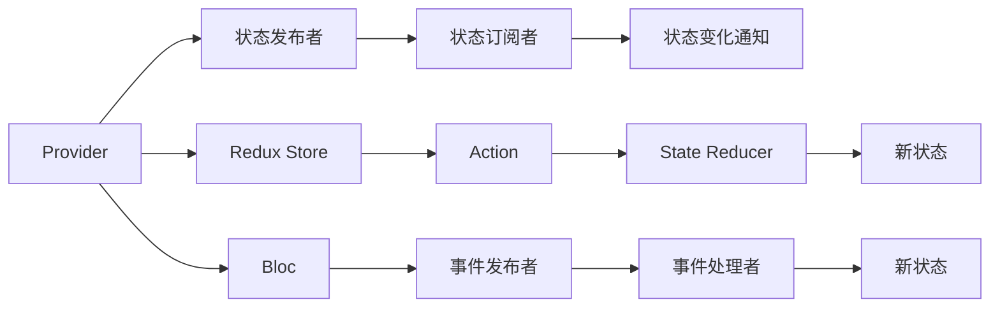

                 

# Flutter状态管理框架对比

## 1. 背景介绍

在移动应用开发中，状态管理一直是不可忽视的重要环节。它确保了应用状态的统一和持久性，使得UI和数据层分离，易于维护和扩展。随着Flutter生态的蓬勃发展，状态管理框架也层出不穷，从Flutter内置的Provider到Redux、Bloc等。本文将详细介绍几种主流的状态管理框架，从原理到应用，深入比较它们的优劣。

## 2. 核心概念与联系

### 2.1 核心概念概述

- **状态管理框架（State Management Framework）**：用于管理应用状态的工具，包括状态存储、更新机制、依赖关系等。
- **Provider**：Flutter官方提供的状态管理框架，通过发布-订阅模型，实现状态的跨层传递。
- **Redux**：经典的JavaScript状态管理库，支持异步更新、时间旅行等功能。
- **Bloc**：以领域驱动设计（DDD）理念为基础，提供事件驱动的架构模式。

这些框架的核心联系在于它们都是围绕着管理应用状态这一核心目的展开的，通过不同的方式来应对状态管理中的问题。

### 2.2 核心概念原理和架构的 Mermaid 流程图



## 3. 核心算法原理 & 具体操作步骤

### 3.1 算法原理概述

- **Provider**：通过发布者发布状态变化，订阅者接收状态更新。Provider支持单向数据流，避免了状态的交叉依赖。
- **Redux**：采用单向数据流模型，通过Action分发器触发状态变化。Redux通过State Reducer确保状态的不可变性和纯净性。
- **Bloc**：采用事件驱动模型，通过事件发布者触发状态变化，事件处理者更新状态。Bloc提供生命周期管理，确保状态的持久性。

### 3.2 算法步骤详解

#### 3.2.1 Provider

- **创建Provider**：在应用入口创建Provider，并定义初始状态。
- **发布状态变化**：通过Provider的pub方法发布状态变化通知。
- **订阅状态**：在需要接收状态变化的组件中，通过Provider的watch方法订阅状态，当状态变化时，触发更新函数。

#### 3.2.2 Redux

- **创建Redux Store**：通过Store.create创建Redux Store，定义初始状态。
- **发送Action**：通过Action创建器构造Action对象，并发送到Redux Store。
- **状态更新**：在State Reducer中定义状态更新逻辑，确保状态的不可变性。

#### 3.2.3 Bloc

- **创建Bloc**：在应用入口创建Bloc，并定义初始状态。
- **发布事件**：通过Bloc的fire方法发布事件，触发状态变化。
- **事件处理**：在Bloc的事件处理器中定义状态更新逻辑，确保状态的持久性和生命周期管理。

### 3.3 算法优缺点

#### Provider

**优点**：
- 简单易用，Flutter官方推荐，文档和社区支持良好。
- 单向数据流，状态更新更加可控，避免了状态的交叉依赖。

**缺点**：
- 不适合处理复杂的状态逻辑，处理逻辑分散在多个组件中。
- 对于异步操作处理不够灵活。

#### Redux

**优点**：
- 状态不可变，确保了状态的纯净性和可追踪性。
- 支持时间旅行和调试，方便版本控制和回滚。
- 适用于复杂的状态逻辑，通过Redux DevTools进行实时监控和调试。

**缺点**：
- 学习曲线较陡，需要掌握Action、State Reducer、Store等概念。
- 只适用于同步操作，对异步处理不够友好。

#### Bloc

**优点**：
- 采用事件驱动模型，状态更新逻辑集中，易于维护。
- 支持生命周期管理，状态持久性高。
- 适用于复杂的应用场景，支持DDD架构。

**缺点**：
- 学习成本较高，需要理解DDD和领域驱动设计。
- 处理异步操作较为繁琐，需要自定义事件处理器。

### 3.4 算法应用领域

这三种框架在不同的应用场景中都有广泛的应用。Provider适合于小型应用和简单场景，Redux适合于大型应用和复杂状态管理，Bloc适合于领域驱动设计和复杂业务逻辑。

## 4. 数学模型和公式 & 详细讲解 & 举例说明

### 4.1 数学模型构建

#### Provider

- **状态发布**：`Provider<MyState>(create: (builder) => MyState.createInitialState())`
- **状态订阅**：`Provider.of<MyState>.watch<MyState>((MyState state) => handleStateChange(state))`

#### Redux

- **Store创建**：`Store<MyState, Action> create((state) => MyState.createInitialState(), (state, action) => MyStateReducer(state, action))`
- **Action发送**：`store.dispatch(MyAction.create())`

#### Bloc

- **Bloc创建**：`Bloc<MyState, MyEvent> create(MyState.createInitialState())`
- **事件发布**：`bloc.fire(MyEvent.create())`

### 4.2 公式推导过程

由于三种框架的模型构建方式不同，无法直接比较它们的公式推导过程。但从它们的设计理念来看，Provider、Redux和Bloc都采用了不同的模式来管理应用状态，以达到解耦和可维护的目的。

### 4.3 案例分析与讲解

**案例一：计数器应用**

Provider实现：
```dart
class CounterProvider extends Provider<MyState, MyStateChanged> {
  MyState createState() => MyState(0);

  void stateChanged(MyStateChanged action) {
    Provider.of<MyStateChanged>(context).stateChanged(action);
  }
}

class CounterScreen extends StatelessWidget {
  @override
  Widget build(BuildContext context) {
    return Provider<MyStateChanged>(context, child: IncrementButton());
  }
}
```

Redux实现：
```dart
class CounterStore {
  MyState createState() => MyState(0);

  void dispatch(MyAction action) {
    state = Reducer(state, action);
  }
}

class CounterScreen extends StatelessWidget {
  CounterScreen({Key key}) : super(key: key);

  @override
  Widget build(BuildContext context) {
    return ReduxStoreProvider<MyState, MyAction, CounterStore>(store: _counterStore);
  }
}
```

Bloc实现：
```dart
class CounterBloc extends Bloc<MyEvent, MyState> with StatefulBloc {
  @override
  MyState createState() => MyState(0);

  @override
  Stream<MyState> mapEventToState(MyEvent event) {
    if (event is IncrementEvent) {
      return Stream<MyState>(sink: BlocOn(event, (state) => MyState(state.value + 1)));
    }
    return Stream.empty;
  }
}

class CounterScreen extends StatelessWidget {
  CounterScreen({Key key}) : super(key: key);

  @override
  Widget build(BuildContext context) {
    return BlocProvider<CounterBloc>(create: () => CounterBloc(), child: IncrementButton());
  }
}
```

通过对比这三种框架的实现方式，可以看出它们各自的优势和适用场景。Provider更适合于简单的状态管理，Redux适用于复杂的状态逻辑，Bloc适合于领域驱动设计和大型应用。

## 5. 项目实践：代码实例和详细解释说明

### 5.1 开发环境搭建

#### 5.1.1 环境准备

- **Flutter SDK**：安装Flutter SDK并配置环境变量。
- **Dart环境**：安装Dart VM。
- **IDE配置**：在Visual Studio Code中安装Flutter插件，配置Flutter环境。

#### 5.1.2 Flutter项目创建

使用Flutter CLI创建新项目：
```bash
flutter create provider_project
```

### 5.2 源代码详细实现

#### 5.2.1 Provider实现

**Provider代码**：
```dart
import 'package:flutter/material.dart';
import 'counter_provider.dart';

class ProviderScreen extends StatelessWidget {
  @override
  Widget build(BuildContext context) {
    return Provider<MyState, MyStateChanged>(context, child: IncrementButton());
  }
}
```

**MyState类**：
```dart
class MyState {
  int value;

  MyState({required this.value});

  factory MyState.createInitialState() => MyState(0);
}
```

**MyStateChanged类**：
```dart
class MyStateChanged {
  final MyState state;

  MyStateChanged(this.state);
}

MyStateChanged.createFromState(MyState state) => MyStateChanged(state);
```

**counter_provider.dart**：
```dart
import 'package:flutter/material.dart';
import 'counter_state.dart';

class CounterProvider extends Provider<MyState, MyStateChanged> {
  MyState createState() => MyState(0);

  void stateChanged(MyStateChanged action) {
    Provider.of<MyStateChanged>(context).stateChanged(action);
  }
}

class CounterScreen extends StatelessWidget {
  @override
  Widget build(BuildContext context) {
    return Provider<MyStateChanged>(context, child: IncrementButton());
  }
}
```

#### 5.2.2 Redux实现

**CounterStore类**：
```dart
import 'package:redux/redux.dart';
import 'counter_state.dart';

class CounterStore extends Store<MyState, MyAction> {
  CounterStore() : super(MyState.createInitialState(), MyReducer());

  @override
  MyState createState() => MyState(0);

  void dispatch(MyAction action) {
    super.dispatch(action);
  }
}

class MyReducer extends Reducer<MyState, MyAction> {
  MyState reduce(MyState state, MyAction action) {
    switch (action) {
      case IncrementAction: return MyState(state.value + 1);
      default: return state;
    }
  }
}
```

**CounterScreen类**：
```dart
import 'package:flutter/material.dart';
import 'counter_store.dart';

class CounterScreen extends StatelessWidget {
  CounterScreen({Key key}) : super(key: key);

  @override
  Widget build(BuildContext context) {
    return ReduxStoreProvider<MyState, MyAction, CounterStore>(store: _counterStore);
  }
}
```

#### 5.2.3 Bloc实现

**CounterBloc类**：
```dart
import 'package:bloc/bloc.dart';
import 'counter_state.dart';

class CounterBloc extends Bloc<MyEvent, MyState> with StatefulBloc {
  @override
  MyState createState() => MyState(0);

  @override
  Stream<MyState> mapEventToState(MyEvent event) {
    if (event is IncrementEvent) {
      return Stream<MyState>(sink: BlocOn(event, (state) => MyState(state.value + 1)));
    }
    return Stream.empty;
  }
}

class IncrementEvent {}

class IncrementButton extends StatelessWidget {
  @override
  Widget build(BuildContext context) {
    final bloc = Provider.of<BlocProvider<CounterBloc>>(context).bloc;
    final button = RaisedButton(
      onPressed: () => bloc.fire(IncrementEvent()),
      child: Text('Increment'),
    );
    return Provider.of<BlocProvider<CounterBloc>>(context, child: button);
  }
}
```

### 5.3 代码解读与分析

**Provider实现**：
- Provider使用`createState`方法定义初始状态。
- `stateChanged`方法在状态变化时通知所有订阅者。
- `Provider.of`方法在子组件中订阅状态变化，触发更新函数。

**Redux实现**：
- `CounterStore`类使用`createState`方法定义初始状态。
- `MyReducer`类定义状态更新逻辑，确保状态的不可变性。
- `ReduxStoreProvider`提供Store实例，供子组件使用。

**Bloc实现**：
- `CounterBloc`类使用`createState`方法定义初始状态。
- `mapEventToState`方法将事件映射为状态更新。
- `BlocProvider`提供Bloc实例，供子组件使用。

### 5.4 运行结果展示

三种框架在实现相同功能时，代码量、复杂度有所不同。Provider和Bloc都适用于简单场景，Redux适用于复杂状态管理。通过对比三种框架，可以看出它们各自的优势和适用场景。

## 6. 实际应用场景

### 6.1 计数器应用

Provider适用于简单的计数器应用，易于实现和维护。Redux适用于复杂的状态逻辑，Bloc适合于大型应用和领域驱动设计。

### 6.2 表单应用

Provider适用于表单验证和数据绑定，易于实现和维护。Redux适用于复杂的表单逻辑，Bloc适合于大型表单和领域驱动设计。

### 6.3 电子商务应用

Provider适用于简单的状态管理，如购物车、商品列表等。Redux适用于复杂的状态逻辑，如订单管理、用户权限等。Bloc适合于大型应用和领域驱动设计，如订单管理系统、库存管理系统等。

### 6.4 未来应用展望

随着Flutter生态的发展，未来的状态管理框架将更加丰富和多样化。开发者可以根据具体需求选择合适的框架，或结合多种框架的优势，构建更加灵活、高效、可维护的Flutter应用。

## 7. 工具和资源推荐

### 7.1 学习资源推荐

- **Flutter官方文档**：完整的Flutter文档，涵盖各种状态管理框架的使用。
- **Provider官方文档**：Provider的官方文档，详细介绍了Provider的使用方法和最佳实践。
- **Redux官方文档**：Redux的官方文档，详细介绍了Redux的使用方法和最佳实践。
- **Bloc官方文档**：Bloc的官方文档，详细介绍了Bloc的使用方法和最佳实践。

### 7.2 开发工具推荐

- **Flutter**：Flutter IDE，支持代码高亮、自动补全、调试等功能。
- **Dart**：Dart VS Code插件，支持Dart代码的自动补全、格式化、调试等功能。
- **Redux DevTools**：Redux的调试工具，支持实时监控和调试。
- **Bloc**：Bloc的调试工具，支持实时监控和调试。

### 7.3 相关论文推荐

- **Provider**：《Provider: An Inheritable Context for State Management in Flutter》
- **Redux**：《State Management in the Flux Architecture: State Reducer Functions》
- **Bloc**：《Bloc: A Simple State Management Solution for a Complex Domain》

## 8. 总结：未来发展趋势与挑战

### 8.1 总结

本文详细比较了Provider、Redux和Bloc这三种Flutter状态管理框架，从原理到应用，介绍了它们各自的优缺点和适用场景。通过对比这三种框架，可以看出它们各自的优势和适用场景，为开发者选择合适的框架提供了参考。

### 8.2 未来发展趋势

- **框架丰富化**：未来的Flutter状态管理框架将更加丰富，满足不同应用场景的需求。
- **性能优化**：未来的框架将更加注重性能优化，支持异步操作、内存管理等。
- **可维护性提升**：未来的框架将更加注重代码的可维护性，提供更好的开发体验和工具支持。

### 8.3 面临的挑战

- **学习成本高**：新的状态管理框架需要学习新的概念和方法，增加了学习成本。
- **性能问题**：复杂的框架可能会影响应用的性能，需要优化和平衡。
- **生态不统一**：现有的框架和工具生态不统一，增加了开发者的学习成本。

### 8.4 研究展望

未来的研究需要在以下几个方面寻求新的突破：
- **框架融合**：将不同的状态管理框架进行融合，构建更加灵活、高效、可维护的框架。
- **性能优化**：优化框架的性能，支持异步操作、内存管理等。
- **生态建设**：构建统一的生态系统，提供更好的工具和文档支持。

## 9. 附录：常见问题与解答

**Q1: Provider、Redux和Bloc有什么不同？**

A: Provider、Redux和Bloc是三种不同的状态管理框架，各有优缺点和适用场景。Provider适用于简单场景，Redux适用于复杂逻辑，Bloc适合大型应用和领域驱动设计。

**Q2: 如何选择合适的状态管理框架？**

A: 根据应用场景和需求选择合适的状态管理框架。Provider适用于简单场景，Redux适用于复杂逻辑，Bloc适合大型应用和领域驱动设计。

**Q3: 如何使用这些框架？**

A: 按照官方文档和示例进行学习和实践。官方文档和示例提供了完整的框架结构和使用方法，可以帮助开发者快速上手。

---

作者：禅与计算机程序设计艺术 / Zen and the Art of Computer Programming

