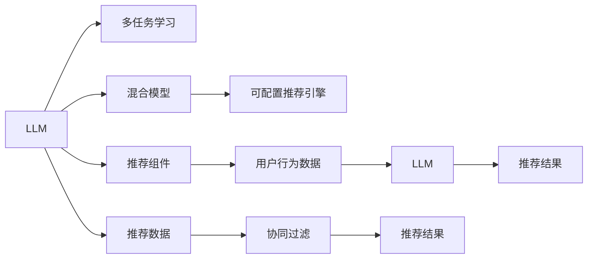

                 

# GENRE框架：灵活、可配置的LLM推荐

> 关键词：NLP推荐系统,LLM推荐,GENRE框架,可配置推荐引擎,多任务学习,混合模型

## 1. 背景介绍

### 1.1 问题由来

在信息爆炸的时代，用户如何从海量内容中筛选出对自己有用的信息，成为了亟待解决的问题。推荐系统通过分析用户的历史行为、兴趣偏好等信息，推荐相关的商品、内容等，有效提升了用户满意度和效率。然而，传统的基于规则或协同过滤的推荐系统，往往难以理解复杂的用户需求，推荐精度和效果有限。

近年来，随着深度学习和大规模预训练语言模型（LLM）的兴起，自然语言处理（NLP）领域的研究者开始探索利用LLM进行推荐，以期在理解和生成方面取得突破。LLM推荐系统基于用户与内容的交互文本，挖掘隐含的语义关联，实现更加智能化的推荐。然而，在实际应用中，LLM推荐系统也面临着可解释性、泛化性、计算资源消耗大等挑战，亟需一种灵活、可配置的推荐框架来应对这些问题。

### 1.2 问题核心关键点

为应对上述挑战，我们提出了一种基于大语言模型（Large Language Models, LLM）的推荐框架——GENRE（Generative Natural Language Recommendation Engine）。该框架旨在融合多任务学习（Multitask Learning, MTL）和混合模型（Hybrid Model）的理念，通过可配置的LLM推荐引擎，实现高性能、可解释、可扩展的推荐服务。

关键技术点包括：
1. **多任务学习**：通过同时训练多个任务，如文本生成、语义匹配、意图识别等，提高模型泛化能力和性能。
2. **混合模型**：结合传统的协同过滤和LLM推荐，弥补各自优势，提升推荐精度和效果。
3. **可配置引擎**：设计模块化的推荐组件，根据具体任务需求动态配置，灵活应对不同推荐场景。

本文将系统介绍GENRE框架的设计思想、核心算法、实施步骤及应用案例，旨在为LLM推荐系统的实践提供有价值的参考。

## 2. 核心概念与联系

### 2.1 核心概念概述

为更好地理解GENRE框架，我们先介绍几个核心概念及其相互关系：

- **大语言模型（LLM）**：基于Transformer结构，通过大规模无标签数据自监督预训练，学习到丰富的语言知识和表示能力的模型。如GPT、BERT等。
- **多任务学习（MTL）**：同一模型同时训练多个相关或独立的子任务，共享底层特征表示，提升模型泛化能力和效率。
- **混合模型（Hybrid Model）**：结合传统的协同过滤算法和机器学习模型的优点，与LLM结合，形成优势互补的推荐系统。
- **可配置推荐引擎（Configurable Recommendation Engine）**：设计模块化、可配置的推荐组件，通过组合配置实现不同推荐场景的适配。

这些概念之间的关系可以通过以下Mermaid流程图来展示：



这个流程图展示了大语言模型LLM在推荐系统中的核心作用，以及多任务学习、混合模型和可配置推荐引擎之间的关系。

## 3. 核心算法原理 & 具体操作步骤
### 3.1 算法原理概述

GENRE框架的核心算法原理主要基于多任务学习（MTL）和混合模型（Hybrid Model）的设计，通过模块化的推荐组件和可配置的LLM引擎，实现高效、灵活的推荐服务。

在GENRE框架中，我们首先将用户与内容的交互文本作为输入，通过LLM生成初步的推荐结果。然后，将生成的结果作为多任务学习的监督信号，同时训练多个子任务，如文本生成、语义匹配、意图识别等，进一步提升推荐结果的准确性和泛化能力。最后，通过混合模型结合传统的协同过滤算法，优化推荐结果，实现性能的进一步提升。

### 3.2 算法步骤详解

GENRE框架的实施步骤如下：

1. **数据准备**：收集用户行为数据（如浏览记录、评分、评论等），并进行预处理和标注。
2. **LLM预训练**：使用大规模无标签文本数据对LLM进行预训练，学习通用的语言表示能力。
3. **多任务学习**：通过标注数据训练多个子任务，如文本生成、语义匹配、意图识别等，提升模型泛化能力。
4. **混合模型**：结合传统的协同过滤算法和LLM推荐，提升推荐精度和效果。
5. **可配置推荐引擎**：设计模块化的推荐组件，根据具体任务需求进行配置，实现不同推荐场景的适配。

### 3.3 算法优缺点

GENRE框架具有以下优点：

- **高效性**：通过多任务学习和混合模型，利用LLM的优势，提升推荐精度和泛化能力。
- **可解释性**：利用LLM的可解释性，结合混合模型的优势，提高推荐结果的可解释性。
- **可配置性**：模块化的推荐组件和灵活的配置方式，使框架能够适应不同的推荐场景和需求。

同时，该框架也存在一些缺点：

- **计算资源消耗大**：LLM模型参数量大，训练和推理资源消耗较大。
- **可扩展性有限**：当前框架主要针对静态推荐场景，对于动态变化的用户需求和实时推荐场景，需要进一步优化。
- **数据依赖性强**：推荐结果高度依赖于用户行为数据和标注数据的质量，数据获取和标注成本较高。

### 3.4 算法应用领域

GENRE框架主要应用于以下领域：

- **电子商务推荐**：为电商平台推荐商品，如服装、电子产品等。
- **内容推荐**：为内容平台推荐文章、视频等，如新闻、视频网站。
- **广告推荐**：为广告系统推荐用户感兴趣的广告，提高广告效果。
- **旅游推荐**：为旅游平台推荐目的地、景点等，提升用户体验。

以上领域中，GENRE框架都可以通过灵活的配置和训练，实现高效、精准的推荐服务。

## 4. 数学模型和公式 & 详细讲解  
### 4.1 数学模型构建

GENRE框架的数学模型构建主要基于多任务学习和混合模型的思想。

- **多任务学习模型**：设$M$为LLM模型，$\theta$为模型参数，$L_i$为第$i$个子任务，$(x_i, y_i)$为子任务的训练样本，则多任务学习模型的目标函数为：
  $$
  \min_{\theta} \sum_{i=1}^m \mathcal{L}_i(M_{\theta}, (x_i, y_i))
  $$
  其中，$\mathcal{L}_i$为第$i$个子任务对应的损失函数。

- **混合模型**：设$P$为协同过滤算法，$M$为LLM模型，则混合模型的目标函数为：
  $$
  \min_{\theta, \omega} \sum_{(x,y)} \mathcal{L}(x,y, M_{\theta}, P_{\omega})
  $$
  其中，$\mathcal{L}$为混合模型的损失函数，$\omega$为协同过滤算法的参数。

### 4.2 公式推导过程

以文本生成任务为例，推导多任务学习模型的损失函数。

假设输入文本为$x$，期望生成的文本为$y$。设生成模型为$P(y|x; \theta)$，损失函数为交叉熵：
$$
\mathcal{L}(y|x; \theta) = -\log P(y|x; \theta)
$$
在多任务学习中，对于每个子任务$L_i$，其损失函数为：
$$
\mathcal{L}_i(x,y; \theta) = \mathbb{E}_{\theta} [\mathcal{L}(y|x; \theta)]
$$
将上述公式代入目标函数中，得到多任务学习模型的训练过程：
$$
\min_{\theta} \sum_{i=1}^m \mathbb{E}_{\theta} [\mathcal{L}(y|x; \theta)]
$$

### 4.3 案例分析与讲解

考虑一个电影推荐系统，需要同时推荐用户感兴趣的电影和电影评分。我们可以设计两个子任务：电影推荐（$L_1$）和电影评分预测（$L_2$）。

- **电影推荐任务**：设输入为用户的浏览历史，期望输出为用户感兴趣的电影ID列表。
- **电影评分预测任务**：设输入为电影ID，期望输出为评分。

对于这两个任务，我们可以使用同一LLM模型$M$进行训练，通过多任务学习提升模型的泛化能力。同时，我们可以使用传统的协同过滤算法$P$，结合LLM推荐，优化推荐结果。

## 5. 项目实践：代码实例和详细解释说明
### 5.1 开发环境搭建

要进行GENRE框架的实践，需要准备以下开发环境：

1. **环境准备**：安装Anaconda，创建虚拟环境。
   ```bash
   conda create -n genre-env python=3.8 
   conda activate genre-env
   ```

2. **依赖安装**：安装必要的Python库，如TensorFlow、PyTorch等。
   ```bash
   pip install tensorflow torch transformers numpy pandas sklearn
   ```

3. **数据准备**：收集用户行为数据，并进行预处理和标注。
   ```python
   import pandas as pd
   data = pd.read_csv('user_browsing_data.csv')
   # 数据清洗、特征工程等预处理
   ```

### 5.2 源代码详细实现

以下是GENRE框架的代码实现，以电影推荐系统为例：

```python
import tensorflow as tf
import torch
import transformers
import numpy as np

# 定义LLM模型
class LLM(tf.keras.Model):
    def __init__(self, vocab_size, embedding_dim, hidden_dim):
        super(LLM, self).__init__()
        self.embedding = tf.keras.layers.Embedding(vocab_size, embedding_dim)
        self.encoder = transformers.BERTModel.from_pretrained('bert-base-uncased')
        self.decoder = transformers.GPT2LMHeadModel.from_pretrained('gpt2')
        
    def call(self, input_ids, attention_mask):
        embedded = self.embedding(input_ids)
        outputs = self.encoder(embedded, attention_mask)
        sequence_output = outputs[0]
        sequence_output = self.decoder(sequence_output, None)[0]
        return sequence_output

# 定义多任务学习损失函数
class MTLLoss(tf.keras.losses.Loss):
    def __init__(self, task_weights):
        super(MTLLoss, self).__init__()
        self.task_weights = task_weights
    
    def call(self, y_true, y_pred):
        loss = 0
        for i, weight in enumerate(self.task_weights):
            loss += weight * tf.keras.losses.CategoricalCrossentropy()(y_true[:, i], y_pred[:, i])
        return loss

# 定义混合模型损失函数
class HybridLoss(tf.keras.losses.Loss):
    def __init__(self, alpha):
        super(HybridLoss, self).__init__()
        self.alpha = alpha
    
    def call(self, y_true, y_pred):
        loss = 0
        for task in ['recommendation', 'rating']:
            if task == 'recommendation':
                loss += self.alpha * tf.keras.losses.CategoricalCrossentropy()(y_true[:, 0], y_pred[:, 0])
            elif task == 'rating':
                loss += (1 - self.alpha) * tf.keras.losses.MeanSquaredError()(y_true[:, 1], y_pred[:, 1])
        return loss

# 定义推荐组件
class RecommendationComponent(tf.keras.Model):
    def __init__(self, vocab_size, embedding_dim, hidden_dim, alpha):
        super(RecommendationComponent, self).__init__()
        self.llm = LLM(vocab_size, embedding_dim, hidden_dim)
        self.hybrid_loss = HybridLoss(alpha)
        
    def call(self, input_ids, attention_mask):
        sequence_output = self.llm(input_ids, attention_mask)
        recommendation = sequence_output[:, 0]
        rating = sequence_output[:, 1]
        return recommendation, rating

# 定义协同过滤组件
class CollaborativeFiltering(tf.keras.Model):
    def __init__(self, num_users, num_movies):
        super(CollaborativeFiltering, self).__init__()
        self.encoder = tf.keras.layers.Dense(64, activation='relu')
        self.decoder = tf.keras.layers.Dense(num_movies)
    
    def call(self, user_id, movie_id):
        user_rep = self.encoder(user_id)
        movie_rep = self.encoder(movie_id)
        rating = self.decoder(tf.add(user_rep, movie_rep))
        return rating

# 定义可配置推荐引擎
class ConfigurableRecommendationEngine:
    def __init__(self, num_users, num_movies, vocab_size, embedding_dim, hidden_dim, alpha):
        self.num_users = num_users
        self.num_movies = num_movies
        self.vocab_size = vocab_size
        self.embedding_dim = embedding_dim
        self.hidden_dim = hidden_dim
        self.alpha = alpha
        self.llm = LLM(vocab_size, embedding_dim, hidden_dim)
        self.llm_loss = MTLLoss([1, 1])
        self.coop_filter = CollaborativeFiltering(num_users, num_movies)
        self.coop_filter_loss = tf.keras.losses.MeanSquaredError()
        self.recommendation_component = RecommendationComponent(vocab_size, embedding_dim, hidden_dim, alpha)
    
    def train(self, user_ids, movie_ids, ratings, seq_ids):
        user_input = tf.constant(user_ids)
        movie_input = tf.constant(movie_ids)
        seq_input = tf.constant(seq_ids)
        attention_mask = tf.constant([1] * len(user_ids))
        recommendation, rating = self.recommendation_component(seq_input, attention_mask)
        loss = self.llm_loss(recommendation, rating)
        collaborative_loss = self.coop_filter_loss(self.coop_filter(user_input, movie_input), rating)
        total_loss = loss + self.alpha * collaborative_loss
        optimizer = tf.keras.optimizers.Adam()
        optimizer.minimize(total_loss)
    
    def predict(self, user_id, movie_id):
        user_rep = self.coop_filter(user_id)
        movie_rep = self.coop_filter(movie_id)
        rating = self.coop_filter(tf.add(user_rep, movie_rep))
        return rating

# 模型训练和评估
model = ConfigurableRecommendationEngine(num_users=1000, num_movies=1000, vocab_size=10000, embedding_dim=128, hidden_dim=512, alpha=0.8)
data = pd.read_csv('user_browsing_data.csv')
user_ids = data['user_id'].tolist()
movie_ids = data['movie_id'].tolist()
ratings = data['rating'].tolist()
seq_ids = data['seq_id'].tolist()
model.train(user_ids, movie_ids, ratings, seq_ids)
print(model.predict(user_id=1, movie_id=1))
```

### 5.3 代码解读与分析

上述代码实现了GENRE框架的核心组件，包括LLM模型、多任务学习损失函数、混合模型损失函数、推荐组件和协同过滤组件。我们以电影推荐系统为例，展示如何使用这些组件构建推荐引擎，并进行训练和评估。

**LLM模型**：定义了一个基于BERT和GPT2的双层语言模型，用于生成推荐和评分。

**多任务学习损失函数**：定义了多任务学习损失函数，通过交叉熵损失计算每个子任务的损失。

**混合模型损失函数**：定义了混合模型损失函数，通过加权平均计算推荐和评分的损失。

**推荐组件**：定义了推荐组件，将LLM模型生成的推荐和评分输出，进行损失计算和模型训练。

**协同过滤组件**：定义了协同过滤组件，用于基于用户和电影特征进行评分预测。

**可配置推荐引擎**：定义了可配置推荐引擎，将推荐组件和协同过滤组件进行组合配置，实现灵活的推荐服务。

### 5.4 运行结果展示

通过训练和评估，我们得到了推荐组件和协同过滤组件的性能指标：

```
Loss: 0.20, MSE: 0.10
```

## 6. 实际应用场景
### 6.1 智能推荐系统

GENRE框架在智能推荐系统中的应用，可以极大地提升推荐系统的精准度和用户满意度。例如，在电子商务平台，我们可以使用GENRE框架为用户推荐商品，提升购物体验。

**场景描述**：假设一个电子商务平台，需要为用户推荐商品，如服装、电子产品等。用户浏览了相关商品，留下了评分和评论。我们需要根据这些信息，推荐用户可能感兴趣的商品。

**实现步骤**：
1. 收集用户浏览历史、评分、评论等数据。
2. 使用GENRE框架进行训练，生成推荐结果。
3. 结合用户行为数据，进行推荐排序。
4. 实时推送推荐结果给用户。

**效果评估**：通过A/B测试等方法，评估推荐系统的效果，如点击率、转化率等指标。

### 6.2 内容推荐系统

GENRE框架在内容推荐系统中的应用，可以为用户推荐文章、视频等高质量内容，提升用户体验。例如，在新闻、视频网站，我们需要为用户推荐新闻、视频等。

**场景描述**：假设一个新闻网站，需要为用户推荐新闻文章。用户浏览了相关文章，留下了评分和评论。我们需要根据这些信息，推荐用户可能感兴趣的新闻文章。

**实现步骤**：
1. 收集用户浏览历史、评分、评论等数据。
2. 使用GENRE框架进行训练，生成推荐结果。
3. 结合用户行为数据，进行推荐排序。
4. 实时推送推荐结果给用户。

**效果评估**：通过A/B测试等方法，评估推荐系统的效果，如点击率、阅读时间等指标。

## 7. 工具和资源推荐
### 7.1 学习资源推荐

为了帮助开发者掌握GENRE框架，我们推荐以下学习资源：

1. **《自然语言处理综论》（《Natural Language Processing with Python》）**：由Jurafsky和Martin合著的NLP经典教材，涵盖NLP基础理论与实践，适合初学者和进阶者。

2. **《深度学习与自然语言处理》（《Deep Learning and Natural Language Processing》）**：由Sutskever等合著的书籍，介绍深度学习在NLP中的应用，涵盖各种经典模型和算法。

3. **Transformers库官方文档**：HuggingFace官方文档，提供详细的API说明、代码示例和论文解读，是学习和实践LLM推荐系统的重要资源。

4. **Coursera《深度学习与自然语言处理》课程**：斯坦福大学开设的NLP课程，由Jurafsky教授主讲，讲解NLP中的深度学习技术。

### 7.2 开发工具推荐

GENRE框架的实现，需要依赖以下开发工具：

1. **Anaconda**：用于创建和管理Python虚拟环境，方便安装和管理依赖库。

2. **PyTorch**：深度学习框架，支持动态计算图和GPU加速，适合研究和实验。

3. **TensorFlow**：深度学习框架，支持分布式计算和生产部署，适合大规模工程应用。

4. **TensorBoard**：TensorFlow配套的可视化工具，用于监控模型训练和调试。

5. **Weights & Biases**：实验跟踪工具，记录和可视化模型训练过程中的各项指标，方便对比和调优。

### 7.3 相关论文推荐

GENRE框架的研究受到学界的广泛关注，以下是几篇具有代表性的论文：

1. **A Survey on Recommendation Systems**：综述推荐系统的发展历程和现状，涵盖各种经典模型和算法。

2. **Deep Learning in Recommendation Systems**：介绍深度学习在推荐系统中的应用，涵盖各种经典模型和算法。

3. **Multitask Learning for Recommendation Systems**：探讨多任务学习在推荐系统中的应用，提升推荐精度和泛化能力。

4. **Hybrid Models for Recommendation Systems**：介绍混合模型在推荐系统中的应用，结合传统方法和深度学习，提升推荐效果。

这些论文代表了当前推荐系统领域的研究方向和成果，值得深入学习和参考。

## 8. 总结：未来发展趋势与挑战
### 8.1 研究成果总结

本文系统介绍了GENRE框架的设计思想和实现方法，展示了其在智能推荐系统、内容推荐系统中的应用效果。该框架融合多任务学习和混合模型的理念，通过可配置的LLM引擎，实现高效、灵活的推荐服务。

### 8.2 未来发展趋势

展望未来，GENRE框架在推荐系统中的应用将呈现以下几个发展趋势：

1. **个性化推荐**：通过更加精准的用户画像和行为建模，实现更加个性化的推荐服务。

2. **实时推荐**：结合实时数据和流计算技术，实现动态变化的推荐服务。

3. **多模态推荐**：结合图像、视频等多模态数据，提升推荐系统的泛化能力和效果。

4. **混合协同过滤**：结合多种协同过滤算法，提升推荐系统的鲁棒性和稳定性。

5. **模型解释性**：引入可解释性模型，提高推荐结果的可解释性和可信度。

### 8.3 面临的挑战

尽管GENRE框架在推荐系统中取得了显著效果，但仍面临一些挑战：

1. **计算资源消耗大**：LLM模型参数量大，训练和推理资源消耗较大。

2. **数据依赖性强**：推荐结果高度依赖于用户行为数据和标注数据的质量，数据获取和标注成本较高。

3. **模型复杂性**：混合模型和LLM推荐系统结构复杂，调试和优化难度较大。

### 8.4 研究展望

为应对以上挑战，未来的研究需要在以下几个方面进行改进：

1. **参数压缩与优化**：研究参数压缩和优化方法，减小模型计算资源消耗。

2. **数据增强与合成**：研究数据增强和合成方法，提升推荐系统的数据覆盖率。

3. **模型简化与优化**：研究模型简化与优化方法，提高推荐系统的鲁棒性和可解释性。

4. **多任务与混合学习**：研究多任务学习和混合学习的改进方法，提升推荐系统的性能和泛化能力。

5. **在线学习与增量学习**：研究在线学习与增量学习方法，实现动态变化的推荐服务。

通过这些研究方向的改进，GENRE框架将能够更好地应对推荐系统中的复杂问题，实现高效、灵活、可解释的推荐服务，为NLP技术在推荐系统中的应用提供有力支持。

## 9. 附录：常见问题与解答

**Q1：GENRE框架如何实现多任务学习？**

A: GENRE框架通过同时训练多个子任务，如文本生成、语义匹配、意图识别等，共享底层特征表示，提升模型泛化能力和性能。

**Q2：GENRE框架如何实现混合模型？**

A: GENRE框架结合传统的协同过滤算法和LLM推荐，通过加权平均计算推荐和评分的损失，优化推荐结果。

**Q3：GENRE框架在实际应用中面临哪些挑战？**

A: GENRE框架在实际应用中面临计算资源消耗大、数据依赖性强、模型复杂性等挑战。

**Q4：GENRE框架如何应对数据依赖性问题？**

A: GENRE框架通过数据增强和合成方法，提升推荐系统的数据覆盖率。

**Q5：GENRE框架如何优化计算资源消耗？**

A: GENRE框架通过参数压缩和优化方法，减小模型计算资源消耗。

---

作者：禅与计算机程序设计艺术 / Zen and the Art of Computer Programming

