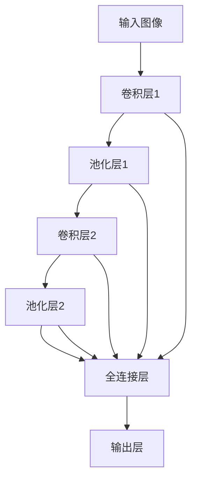
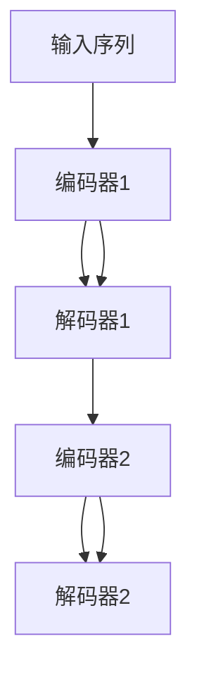

                 

# Google的AI布局:从搜索到多元化的AI帝国

Google作为全球知名的互联网科技巨头，一直站在人工智能(AI)技术前沿，并不断将其技术应用于搜索、广告、地图、云服务等多个业务领域。本文将从Google在AI领域的布局出发，详细解析其在搜索、自然语言处理(NLP)、计算机视觉、云计算等多元化的AI帝国建设过程中所采取的策略与成果。

## 1. 背景介绍

Google对AI技术的探索始于20世纪90年代。当时，其创始人拉里·佩奇和谢尔盖·布林在斯坦福大学期间就开始了信息检索算法的深入研究，最终研发出基于PageRank算法的网络搜索系统。1998年，Google推出了首个搜索引擎，并很快成为全球最受欢迎的搜索引擎。

进入21世纪，Google进一步推动AI技术的商业化应用。通过不断研发，Google在搜索、语音识别、图像处理等领域积累了大量技术优势。2012年，Google发布了Google Brain项目，专注于深度学习等前沿技术的研究。2016年，Google宣布将在其搜索和广告系统中大规模应用AI技术。此后，Google的AI技术布局开始从搜索向其他业务领域拓展。

## 2. 核心概念与联系

为了更好地理解Google的AI布局，需要了解几个核心概念及其相互关系。

- **深度学习**：基于神经网络的机器学习范式，通过多层网络学习数据间的复杂非线性映射，被广泛用于图像处理、自然语言处理等任务。
- **自然语言处理**：使计算机能够理解、处理和生成人类语言的技术，主要应用于搜索引擎、翻译、对话系统等。
- **计算机视觉**：使计算机能够“看”、“理解”和“生成”图像的技术，用于图像识别、视频分析、自动驾驶等。
- **机器学习平台**：如TensorFlow，提供了工具和框架支持，方便开发者构建和部署AI模型。
- **云计算**：提供强大的计算和存储能力，支持大规模数据处理和模型训练，促进AI技术的广泛应用。

这些概念之间相互联系，共同构成了Google AI帝国的基础架构。深度学习为Google提供强大模型构建能力，自然语言处理和计算机视觉拓展了Google在搜索、广告、地图等业务的应用场景，而机器学习平台和云计算则为Google的AI研究与商业化提供了坚实基础。

## 3. 核心算法原理 & 具体操作步骤

### 3.1 算法原理概述

Google在AI领域的布局主要基于以下几个核心算法原理：

- **深度学习**：通过构建深度神经网络，学习数据的高级抽象表示，用于图像、语音、文本等处理。
- **自监督学习**：利用大量未标注数据进行训练，自动学习数据的隐含关系，减少对标注数据的依赖。
- **迁移学习**：将一个领域学到的知识迁移到另一个领域，提高模型在新领域的表现。
- **强化学习**：通过与环境的交互，不断优化模型策略，应用于游戏、自动驾驶等任务。
- **知识图谱**：构建结构化的语义知识库，辅助自然语言处理和搜索。

### 3.2 算法步骤详解

Google的AI布局主要通过以下几个步骤实现：

1. **数据收集与预处理**：
   - 从海量互联网数据、学术文献、卫星图像等渠道收集数据。
   - 对数据进行清洗、标注、归一化等预处理。

2. **模型设计与训练**：
   - 选择适合任务的深度学习模型，如CNN用于图像处理，RNN用于文本处理。
   - 使用自监督学习或迁移学习进行预训练，构建基础模型。
   - 使用标注数据进行微调，适配特定业务需求。

3. **模型部署与应用**：
   - 将训练好的模型部署到云服务器、移动设备等环境。
   - 集成到Google的搜索、广告、地图等业务中，实现AI驱动的功能。

4. **持续优化与迭代**：
   - 基于用户反馈和业务需求，不断收集新数据进行模型优化。
   - 使用强化学习、在线学习等技术，适应环境变化。

### 3.3 算法优缺点

Google的AI布局在带来显著优势的同时，也存在一些挑战：

- **优点**：
  - **强大计算能力**：Google拥有全球最大的数据中心和计算集群，为AI研究提供了强大算力支持。
  - **多样业务场景**：AI技术被广泛应用于搜索、广告、地图、云服务等多个业务领域。
  - **开源贡献**：Google通过TensorFlow等工具，推动开源AI社区发展。

- **缺点**：
  - **技术复杂性高**：深度学习等AI技术涉及多学科知识，开发和维护成本较高。
  - **数据隐私问题**：大规模数据收集和处理可能带来隐私和安全风险。
  - **结果可解释性差**：AI模型的决策过程往往难以解释，影响可信度。

### 3.4 算法应用领域

Google的AI布局涵盖多个应用领域：

1. **搜索与广告**：
   - 利用深度学习进行搜索结果排序，提升用户搜索体验。
   - 通过预测用户行为，个性化推荐广告，提高广告投放效果。

2. **地图与定位**：
   - 使用计算机视觉技术，进行街景数据标注和地图语义理解。
   - 结合实时数据，提供智能导航和交通预测服务。

3. **语音识别与对话**：
   - 采用深度学习进行语音识别和语义理解，支持语音搜索和语音助手。
   - 利用自然语言生成技术，生成智能对话。

4. **云计算与AI平台**：
   - 提供强大的计算和存储资源，支持AI模型的训练和推理。
   - 开放AI平台TensorFlow，推动AI技术的研究和应用。

5. **自动驾驶**：
   - 通过计算机视觉和强化学习技术，实现车辆感知和决策。
   - 集成激光雷达、摄像头等多传感器数据，提高驾驶安全性。

6. **科研与创新**：
   - 通过Google Brain项目，推动前沿AI技术研究。
   - 发布开源项目，推动学术界和工业界共同进步。

## 4. 数学模型和公式 & 详细讲解 & 举例说明

### 4.1 数学模型构建

以Google的深度学习模型为例，其数学模型构建过程如下：

- **输入**：原始数据 $x \in \mathbb{R}^d$，如图像、文本等。
- **输出**：预测结果 $y \in \mathbb{R}^k$，如分类标签、回归值等。
- **模型**：深度神经网络 $f_\theta: \mathbb{R}^d \rightarrow \mathbb{R}^k$，其中 $\theta$ 为模型参数。

以图像分类为例，使用卷积神经网络(CNN)进行建模，其结构如图：



其中，卷积层和池化层提取图像特征，全连接层和输出层进行分类。

### 4.2 公式推导过程

以CNN为例，其前向传播过程可表示为：

$$
f_\theta(x) = W_6 \cdot \sigma(W_5 \cdot \sigma(W_4 \cdot \sigma(W_3 \cdot \sigma(W_2 \cdot \sigma(W_1 \cdot x + b_1) + b_2) + b_3) + b_4) + b_5)
$$

其中 $W_i$ 为权重矩阵，$b_i$ 为偏置向量，$\sigma$ 为激活函数，$x$ 为输入。

### 4.3 案例分析与讲解

以Google的BERT模型为例，其数学模型如下：

- **输入**：文本序列 $x \in \mathbb{R}^{n \times d}$，如一句话。
- **输出**：上下文表示向量 $y \in \mathbb{R}^{n \times h}$，如每个词的上下文表示。
- **模型**：Transformer结构 $f_\theta: \mathbb{R}^{n \times d} \rightarrow \mathbb{R}^{n \times h}$，其中 $\theta$ 为模型参数。

BERT模型的架构如图：



其中，编码器和解码器都由多个自注意力机制和前向神经网络组成。

## 5. 项目实践：代码实例和详细解释说明

### 5.1 开发环境搭建

为了搭建Google的AI项目环境，需要以下步骤：

1. **安装Python**：
   ```bash
   sudo apt-get update
   sudo apt-get install python3
   ```

2. **安装TensorFlow**：
   ```bash
   pip install tensorflow
   ```

3. **安装Keras**：
   ```bash
   pip install keras
   ```

4. **搭建Google Cloud环境**：
   - 注册Google Cloud账号，创建项目。
   - 安装Google Cloud SDK，配置身份认证。
   - 设置GCP存储桶，保存模型和数据。

### 5.2 源代码详细实现

以下是一个简单的TensorFlow图像分类项目代码实现：

```python
import tensorflow as tf
from tensorflow import keras

# 加载数据
(x_train, y_train), (x_test, y_test) = keras.datasets.mnist.load_data()

# 数据预处理
x_train = x_train / 255.0
x_test = x_test / 255.0

# 定义模型
model = keras.Sequential([
    keras.layers.Flatten(input_shape=(28, 28)),
    keras.layers.Dense(128, activation='relu'),
    keras.layers.Dense(10)
])

# 编译模型
model.compile(optimizer='adam', loss=tf.keras.losses.SparseCategoricalCrossentropy(from_logits=True), metrics=['accuracy'])

# 训练模型
model.fit(x_train, y_train, epochs=10, validation_data=(x_test, y_test))

# 评估模型
model.evaluate(x_test, y_test)
```

### 5.3 代码解读与分析

1. **数据加载**：使用Keras的内置数据集，加载手写数字数据集。
2. **数据预处理**：将像素值归一化到[0, 1]区间。
3. **模型定义**：构建一个简单的神经网络模型，包括输入层、隐藏层和输出层。
4. **模型编译**：设置优化器、损失函数和评估指标。
5. **模型训练**：使用训练集进行模型训练，验证集用于评估模型性能。
6. **模型评估**：在测试集上评估模型性能。

## 6. 实际应用场景

### 6.1 智能客服系统

Google在智能客服系统中的应用主要通过Google AI语言模型和自然语言处理技术实现。

- **应用场景**：
  - 客户提问：用户通过语音或文本方式输入问题。
  - 理解输入：使用语言模型解析用户输入，提取关键词。
  - 提供回答：调用知识库和推荐系统，生成智能回复。
  - 更新知识库：不断收集用户反馈和经验，优化知识库。

### 6.2 金融舆情监测

Google的金融舆情监测系统主要基于自然语言处理技术实现。

- **应用场景**：
  - 数据采集：采集金融领域的新闻、评论、报告等文本数据。
  - 文本分类：使用文本分类模型，对新闻和评论进行分类。
  - 情感分析：使用情感分析模型，识别情感倾向。
  - 事件识别：提取关键事件，生成舆情报告。

### 6.3 个性化推荐系统

Google的个性化推荐系统主要通过机器学习技术实现。

- **应用场景**：
  - 数据收集：收集用户浏览、点击、购买等行为数据。
  - 用户建模：使用协同过滤、深度学习等技术，构建用户行为模型。
  - 物品推荐：基于用户模型，推荐个性化商品。
  - 持续优化：使用在线学习算法，实时优化推荐策略。

### 6.4 未来应用展望

未来，Google在AI领域的布局将进一步拓展，涵盖更多领域和应用场景：

1. **医疗**：
   - 利用深度学习进行图像诊断和自然语言理解，辅助医生诊疗。
   - 使用强化学习进行手术辅助和智能诊断系统。

2. **教育**：
   - 利用自然语言处理和推荐系统，提供个性化学习内容。
   - 使用生成模型进行教学设计和自动评卷。

3. **自动驾驶**：
   - 使用计算机视觉和深度学习，实现智能驾驶。
   - 结合强化学习，优化驾驶决策。

4. **环保**：
   - 利用计算机视觉和机器学习，监测环境变化。
   - 使用自然语言处理，分析环境报告。

5. **智慧城市**：
   - 通过AI技术，优化城市管理和服务。
   - 使用智能传感器和数据分析，提升城市效率。

## 7. 工具和资源推荐

### 7.1 学习资源推荐

1. **《Deep Learning》教材**：Ian Goodfellow等著，全面介绍了深度学习的基本概念和应用。
2. **《TensorFlow官方文档》**：Google官方提供的TensorFlow文档，包括教程、API参考和案例分析。
3. **《自然语言处理综述》**：Yoav Goldberg等著，综述了NLP领域的最新进展和经典算法。
4. **《Python深度学习》书籍**：Francois Chollet著，介绍了深度学习在Python中的实现。
5. **Google AI博客和论文**：Google AI官方博客和发表的论文，涵盖了最新的研究成果和应用案例。

### 7.2 开发工具推荐

1. **Jupyter Notebook**：开源的交互式Python编辑器，方便代码调试和文档编写。
2. **Google Cloud Platform(GCP)**：Google提供的云服务平台，支持AI模型的部署和运行。
3. **TensorFlow Extended(TFX)**：Google开发的机器学习平台，提供端到端的模型训练和部署功能。
4. **Keras**：基于TensorFlow的高层API，简化了深度学习的模型构建过程。
5. **PyTorch**：Facebook开发的深度学习框架，提供了灵活的模型定义和训练功能。

### 7.3 相关论文推荐

1. **《Attention is All You Need》**：提出Transformer结构，推动了NLP领域的发展。
2. **《BERT: Pre-training of Deep Bidirectional Transformers for Language Understanding》**：提出BERT模型，提升了NLP任务的性能。
3. **《Google's AlphaGo Zero》**：提出强化学习算法，用于游戏AI开发。
4. **《TensorFlow: A System for Large-Scale Machine Learning》**：介绍TensorFlow框架的设计和实现。
5. **《On the Importance of Transfer Learning for AI Research》**：讨论了迁移学习在AI研究中的重要性。

## 8. 总结：未来发展趋势与挑战

### 8.1 研究成果总结

Google在AI领域的布局取得了显著成果，涵盖了搜索、自然语言处理、计算机视觉、深度学习等多个方向。Google的AI技术不仅在内部业务中广泛应用，还通过开源工具和平台，推动了AI社区的发展。

### 8.2 未来发展趋势

1. **跨领域应用**：AI技术将在更多领域得到应用，如医疗、教育、环保等。
2. **多模态融合**：深度学习、自然语言处理、计算机视觉等技术将进一步融合，形成更强大的AI模型。
3. **智能系统集成**：AI技术与硬件、软件等系统集成，构建智能生态系统。
4. **模型可解释性**：提升模型的可解释性，增强用户信任和透明度。
5. **数据隐私保护**：加强数据隐私保护，确保用户数据安全。

### 8.3 面临的挑战

1. **技术复杂性高**：深度学习和大规模数据处理涉及多学科知识，开发和维护成本高。
2. **数据隐私问题**：大规模数据收集和处理可能带来隐私和安全风险。
3. **结果可解释性差**：AI模型的决策过程难以解释，影响可信度。
4. **计算资源限制**：大规模深度学习模型需要大量的计算资源，资源消耗高。

### 8.4 研究展望

未来的研究应在以下几个方向寻求突破：

1. **模型可解释性**：通过可解释模型和因果推理，提升模型的透明性和可信度。
2. **数据隐私保护**：引入差分隐私等技术，保护用户数据隐私。
3. **计算资源优化**：使用模型压缩和优化算法，提高模型训练和推理效率。
4. **跨领域融合**：推动不同领域的AI技术融合，形成更强大的跨领域模型。
5. **伦理和安全**：在AI系统中引入伦理导向和安全性设计，确保系统的公平性和安全性。

## 9. 附录：常见问题与解答

### Q1: 如何使用Google Cloud进行AI模型部署？

**A:** 使用Google Cloud Platform(GCP)进行AI模型部署，主要步骤如下：
1. 在GCP上创建虚拟机实例。
2. 将训练好的模型文件上传至GCP存储桶。
3. 在虚拟机实例中安装TensorFlow等AI框架。
4. 使用TensorFlow Serving等工具部署模型。
5. 通过API接口调用部署的模型进行推理。

### Q2: 如何优化Google AI模型的计算资源消耗？

**A:** 优化Google AI模型的计算资源消耗，主要方法包括：
1. 使用模型压缩技术，如剪枝、量化等，减小模型参数量。
2. 使用分布式训练，利用多台机器并行计算。
3. 使用GPU或TPU等高性能设备，加速模型训练和推理。
4. 使用混合精度训练，提高计算效率。
5. 使用在线学习算法，实时更新模型参数。

### Q3: 如何确保Google AI系统的数据隐私？

**A:** 确保Google AI系统的数据隐私，主要方法包括：
1. 使用差分隐私技术，保护用户数据不被泄露。
2. 对数据进行匿名化处理，防止数据关联攻击。
3. 设置严格的访问控制，限制数据访问权限。
4. 使用安全通信协议，防止数据传输过程中被窃取。
5. 定期审计系统安全性，发现和修复漏洞。

通过上述方法，可以显著提升Google AI系统的数据隐私保护能力，确保用户数据安全。

---

作者：禅与计算机程序设计艺术 / Zen and the Art of Computer Programming

