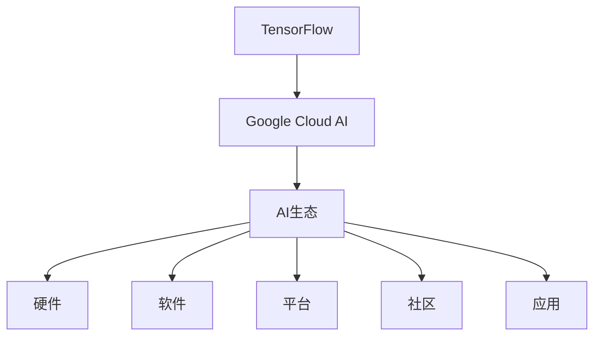

                 

# Google的AI生态布局:从TensorFlow到Google Cloud AI

## 1. 背景介绍

### 1.1 问题由来
在过去十年中，人工智能（AI）和机器学习（ML）已经成为科技产业的重要引擎，Google作为全球科技巨头，一直在这场AI竞赛中处于领先地位。从开源的TensorFlow平台，到构建Google Cloud AI生态，Google的AI布局跨越了多个层面，涵盖了从研究、开发到应用的广泛领域。本文将深入探讨Google的AI生态布局，包括TensorFlow的诞生、演化及其在Google Cloud上的应用，以及未来可能的发展方向。

### 1.2 问题核心关键点
Google的AI生态布局核心关键点主要包括以下几个方面：
- **TensorFlow的诞生与演化**：Google为什么要开发TensorFlow？其核心特性和重要贡献是什么？
- **Google Cloud AI构建**：Google如何利用TensorFlow构建其云上AI生态，有哪些关键应用和策略？
- **未来发展趋势**：Google在AI领域的未来布局可能有哪些？

### 1.3 问题研究意义
Google的AI生态布局是当前全球AI领域的一个重要研究课题，具有以下几方面的重要意义：
1. **技术领先性**：Google的AI技术引领行业发展方向，其核心算法和工具包（如TensorFlow）对全球AI社区有着深远影响。
2. **商业模式创新**：Google通过构建云上AI生态，探索AI技术的商业化路径，为其他科技公司提供了成功范例。
3. **全球合作与竞争**：Google在AI领域的布局影响了全球AI市场格局，也面临来自其他科技巨头的激烈竞争，这些动态关系值得深入分析。

## 2. 核心概念与联系

### 2.1 核心概念概述

为了更好地理解Google的AI生态布局，需要了解以下核心概念：

- **TensorFlow**：由Google开发的开源深度学习框架，支持构建各种AI模型，广泛应用于学术研究和工业应用。
- **Google Cloud AI**：Google构建的云上AI服务平台，提供包括模型训练、推理、部署等在内的全链路AI服务。
- **AI生态**：围绕AI技术构建的完整生态系统，包括硬件、软件、平台、社区、应用等各个方面。

### 2.2 核心概念原理和架构的 Mermaid 流程图



这个流程图展示了TensorFlow与Google Cloud AI之间以及它们与AI生态的其他组成部分的联系。TensorFlow作为Google构建AI生态的核心工具，通过Google Cloud AI平台，将AI技术和应用推广到更广泛的领域。

## 3. 核心算法原理 & 具体操作步骤
### 3.1 算法原理概述

TensorFlow的核心算法原理基于分布式计算和自动微分技术，通过构建计算图进行模型训练和推理。TensorFlow支持多种深度学习模型，包括卷积神经网络（CNN）、循环神经网络（RNN）、生成对抗网络（GAN）等，同时提供了丰富的优化器和正则化技术，以提升模型的稳定性和泛化能力。

Google Cloud AI则在此基础上，进一步扩展了TensorFlow的功能，通过云平台提供大规模分布式训练支持、模型服务化、自动化部署和监控等全链路服务，简化了AI应用的开发和部署流程。

### 3.2 算法步骤详解

TensorFlow的开发和应用步骤通常包括以下几个关键环节：

1. **模型定义**：使用TensorFlow定义神经网络模型，包括输入、隐藏层和输出层的设计。
2. **数据预处理**：对输入数据进行归一化、增强等预处理操作，提高模型训练效果。
3. **模型训练**：在TensorFlow中构建计算图，使用优化器进行模型训练，调整模型参数。
4. **模型评估**：在测试集上评估模型性能，调整超参数和模型结构。
5. **模型部署**：将训练好的模型部署到Google Cloud AI平台，进行模型推理和实时服务。

Google Cloud AI的应用步骤则在此基础上进一步细化，包括：

1. **云端训练**：利用Google Cloud AI提供的分布式训练资源，进行大规模模型训练。
2. **自动化调参**：使用Google Cloud AI的自动调参工具，优化模型超参数，提升模型性能。
3. **模型服务化**：将模型部署为RESTful API服务，支持HTTP接口调用，实现高效的服务化部署。
4. **持续集成与监控**：使用Google Cloud AI的持续集成和监控工具，实时跟踪模型性能，进行异常检测和告警。

### 3.3 算法优缺点

TensorFlow作为Google构建AI生态的基础工具，具有以下优点：
1. **开放性**：开源社区支持广泛，便于学习和应用。
2. **灵活性**：支持多种模型和算法，满足不同的AI需求。
3. **性能**：支持分布式计算和自动微分，适用于大规模模型训练。

同时，TensorFlow也存在一些缺点：
1. **学习曲线陡峭**：对于初学者和没有深度学习背景的开发者，学习难度较大。
2. **资源消耗大**：训练大模型时需要大量计算资源，可能造成性能瓶颈。

Google Cloud AI则通过云计算平台，进一步优化了TensorFlow的缺点，具有以下优点：
1. **可扩展性**：提供弹性计算资源，支持大规模模型训练。
2. **自动化**：支持自动化调参和持续集成，简化开发流程。
3. **服务化**：将模型部署为RESTful服务，便于集成和调用。

Google Cloud AI的主要缺点在于：
1. **成本**：云服务可能带来较高的成本，特别是大规模计算任务。
2. **隐私和安全**：将模型和服务部署到云上，可能涉及隐私和安全问题。

### 3.4 算法应用领域

TensorFlow和Google Cloud AI在多个领域得到了广泛应用，包括：

- **计算机视觉**：图像识别、目标检测、图像分割等。
- **自然语言处理**：语言模型、机器翻译、情感分析等。
- **语音识别**：自动语音识别（ASR）、语音合成（TTS）等。
- **推荐系统**：个性化推荐、广告投放等。
- **医疗健康**：医学影像分析、基因组学研究等。
- **金融科技**：风险评估、欺诈检测等。
- **自动驾驶**：环境感知、决策规划等。

TensorFlow和Google Cloud AI在这些领域的应用，不仅提升了各行业的技术水平，也为Google带来了显著的市场竞争优势。

## 4. 数学模型和公式 & 详细讲解 & 举例说明

### 4.1 数学模型构建

TensorFlow的核心数学模型基于图计算模型，即计算图（Computation Graph）。计算图由节点和边组成，节点表示计算操作，边表示数据流。TensorFlow中的计算图可以通过`tf.Graph`和`tf.keras`等API进行定义和构建。

### 4.2 公式推导过程

以一个简单的线性回归模型为例，推导其在TensorFlow中的实现过程：

设有一个样本集 $(x_i, y_i)$，其中 $x_i$ 为输入特征，$y_i$ 为对应的输出标签。线性回归模型的目标是最小化预测值与真实值之间的误差：

$$
\min_{\theta} \sum_{i=1}^n (y_i - \theta^T x_i)^2
$$

其中 $\theta$ 为模型的权重向量。使用梯度下降法进行优化，计算损失函数对 $\theta$ 的梯度：

$$
\frac{\partial \mathcal{L}}{\partial \theta} = -2\sum_{i=1}^n (y_i - \theta^T x_i) x_i
$$

然后，通过反向传播算法计算损失函数对模型参数的梯度，并更新参数值：

$$
\theta \leftarrow \theta - \eta \frac{\partial \mathcal{L}}{\partial \theta}
$$

其中 $\eta$ 为学习率。

### 4.3 案例分析与讲解

TensorFlow中的线性回归模型是一个简单的例子，实际应用中，模型的复杂度可能会更高。下面以TensorFlow中的卷积神经网络（CNN）为例，讲解其在计算机视觉任务中的应用。

CNN是一种常用于图像处理的神经网络模型，其核心在于卷积层和池化层的设计。在TensorFlow中，可以通过`tf.keras.layers`等API构建CNN模型，并使用`model.compile()`和`model.fit()`进行训练和评估。

## 5. 项目实践：代码实例和详细解释说明
### 5.1 开发环境搭建

在进行TensorFlow和Google Cloud AI的开发和应用前，需要准备好开发环境。以下是使用Python进行TensorFlow和Google Cloud AI开发的典型环境配置流程：

1. **安装TensorFlow**：
```bash
pip install tensorflow
```

2. **安装Google Cloud SDK**：
```bash
gcloud components update
```

3. **设置环境变量**：
```bash
export GOOGLE_APPLICATION_CREDENTIALS=/path/to/your/service-account.json
```

### 5.2 源代码详细实现

以下是一个简单的TensorFlow项目示例，包括数据预处理、模型定义、训练和评估的完整代码实现：

```python
import tensorflow as tf
from tensorflow.keras import layers, models

# 定义数据预处理函数
def preprocess_data(x):
    x = tf.keras.utils.normalize(x)
    x = tf.expand_dims(x, axis=0)
    return x

# 定义模型
model = models.Sequential()
model.add(layers.Dense(64, activation='relu', input_shape=(784,)))
model.add(layers.Dense(10, activation='softmax'))

# 编译模型
model.compile(optimizer=tf.keras.optimizers.Adam(learning_rate=0.001),
              loss=tf.keras.losses.CategoricalCrossentropy(from_logits=True),
              metrics=['accuracy'])

# 加载数据集
mnist = tf.keras.datasets.mnist
(x_train, y_train), (x_test, y_test) = mnist.load_data()

# 预处理数据
x_train = preprocess_data(x_train)
x_test = preprocess_data(x_test)

# 训练模型
model.fit(x_train, y_train, epochs=10, batch_size=32, validation_data=(x_test, y_test))

# 评估模型
model.evaluate(x_test, y_test)
```

### 5.3 代码解读与分析

在上述代码中，我们首先定义了数据预处理函数`preprocess_data()`，用于对输入数据进行归一化和展开。然后定义了一个简单的神经网络模型，包含一个全连接层和一个输出层。使用`model.compile()`方法进行模型编译，设置优化器、损失函数和评估指标。最后加载MNIST数据集，进行预处理，调用`model.fit()`进行模型训练，并使用`model.evaluate()`方法评估模型性能。

这个例子展示了TensorFlow在图像分类任务中的应用，模型虽然简单，但包含了一系列关键步骤，如数据预处理、模型定义、编译、训练和评估。通过类似的方式，可以构建更加复杂的模型，应对不同的AI任务。

### 5.4 运行结果展示

在TensorFlow中，可以使用TensorBoard工具对模型训练过程进行可视化。以下是一个简单的TensorBoard示例：

```bash
tensorboard --logdir=./logs
```

运行上述命令后，在浏览器中打开`http://localhost:6006`，即可查看模型训练过程中的各项指标，如损失函数、准确率等。

## 6. 实际应用场景

### 6.1 计算机视觉

TensorFlow和Google Cloud AI在计算机视觉领域有着广泛应用，如图像识别、目标检测、图像分割等。Google Cloud AI的AutoML Vision服务，允许用户无需编写代码，直接上传图片，自动生成图像识别模型。该服务支持多种模型类型，包括SVM、DNN、BERT等，适用于不同场景。

### 6.2 自然语言处理

在自然语言处理领域，TensorFlow和Google Cloud AI的应用也相当广泛。Google Cloud AI的AutoML Natural Language服务，可以自动构建语言模型、文本分类、命名实体识别等模型，适用于新闻摘要、情感分析、舆情监测等任务。

### 6.3 语音识别

语音识别是TensorFlow和Google Cloud AI在音频处理领域的重要应用之一。Google Cloud AI的Speech-to-Text服务，可以将语音信号转换为文本，支持多种语言和方言，广泛应用于智能家居、客服系统等领域。

### 6.4 推荐系统

推荐系统是TensorFlow和Google Cloud AI在商业应用中的典型案例。Google Cloud AI的Recommendation AI服务，可以自动构建推荐模型，支持多种算法和数据格式，适用于电商、媒体、金融等场景。

## 7. 工具和资源推荐

### 7.1 学习资源推荐

为了帮助开发者系统掌握TensorFlow和Google Cloud AI的理论基础和实践技巧，这里推荐一些优质的学习资源：

1. **TensorFlow官方文档**：提供全面详细的TensorFlow介绍和API文档，是TensorFlow学习的首选资源。
2. **Google Cloud AI官方文档**：详细介绍了Google Cloud AI平台的各项服务功能，以及如何在云上构建和部署AI模型。
3. **TensorFlow实战**：由Google开发者撰写，深入浅出地介绍了TensorFlow的核心概念和应用实例。
4. **Google Cloud AI开发者指南**：提供从入门到高级的Google Cloud AI开发教程，覆盖了从模型训练到服务部署的全流程。
5. **Kaggle竞赛**：参与Kaggle数据科学竞赛，通过实战锻炼TensorFlow和Google Cloud AI的开发能力。

### 7.2 开发工具推荐

高效的开发离不开优秀的工具支持。以下是几款用于TensorFlow和Google Cloud AI开发的常用工具：

1. **Jupyter Notebook**：开源的交互式开发环境，支持Python和TensorFlow代码的编写和执行。
2. **TensorBoard**：TensorFlow的可视化工具，用于监控模型训练过程和结果。
3. **Google Cloud SDK**：用于部署和管理Google Cloud AI服务的命令行工具。
4. **TensorFlow Extended (TFX)**：TensorFlow的企业级解决方案，提供模型构建、数据管道和部署的一站式解决方案。
5. **Kubeflow**：Google Cloud和Kubernetes集成的AI平台，支持在Kubernetes上部署和管理TensorFlow和Google Cloud AI模型。

### 7.3 相关论文推荐

TensorFlow和Google Cloud AI的发展源于学界的持续研究。以下是几篇奠基性的相关论文，推荐阅读：

1. **TensorFlow: A System for Large-Scale Machine Learning**：介绍了TensorFlow的核心设计理念和功能模块。
2. **Attention is All You Need**：提出了Transformer模型，开创了自注意力机制在深度学习中的先河。
3. **Neural Machine Translation by Jointly Learning to Align and Translate**：提出了机器翻译模型Seq2Seq，为NLP任务奠定了基础。
4. **BERT: Pre-training of Deep Bidirectional Transformers for Language Understanding**：提出了BERT模型，开创了预训练语言模型的先河。
5. **Towards a Neural Architecture for Machine Learning**：提出了TensorFlow，成为深度学习领域的重要工具。

这些论文代表了大规模AI模型的研究进展，为TensorFlow和Google Cloud AI的发展提供了重要参考。

## 8. 总结：未来发展趋势与挑战

### 8.1 总结

本文对Google的AI生态布局，从TensorFlow的诞生与演化，到Google Cloud AI的构建和应用，进行了全面系统的介绍。通过深入讲解TensorFlow的核心算法原理和Google Cloud AI的云上AI服务，探讨了Google在AI领域的战略布局和市场竞争力。

通过本文的系统梳理，可以看到，Google的AI生态布局是当前全球AI领域的一个重要研究课题，具有以下几方面的重要意义：
1. **技术领先性**：Google的AI技术引领行业发展方向，其核心算法和工具包（如TensorFlow）对全球AI社区有着深远影响。
2. **商业模式创新**：Google通过构建云上AI生态，探索AI技术的商业化路径，为其他科技公司提供了成功范例。
3. **全球合作与竞争**：Google在AI领域的布局影响了全球AI市场格局，也面临来自其他科技巨头的激烈竞争，这些动态关系值得深入分析。

### 8.2 未来发展趋势

展望未来，TensorFlow和Google Cloud AI的发展趋势可能包括以下几个方面：

1. **更广泛的适用性**：随着Google Cloud AI的进一步发展，TensorFlow将更广泛地应用于不同行业和领域，涵盖更多AI任务。
2. **更高的性能和效率**：Google将继续优化TensorFlow和Google Cloud AI的性能和效率，提供更快速、更稳定的AI服务。
3. **更加智能的自动化**：Google将进一步提升AutoML等自动化工具的智能化水平，使得AI模型的开发和部署更加便捷高效。
4. **更强的跨领域能力**：Google将加强AI模型在跨领域、跨模态数据融合方面的能力，推动AI技术的全面融合。
5. **更加开放的生态**：Google将进一步开放TensorFlow和Google Cloud AI的技术和资源，推动全球AI社区的共同发展。

### 8.3 面临的挑战

尽管TensorFlow和Google Cloud AI在AI领域取得了显著成就，但在迈向更加智能化、普适化应用的过程中，仍面临以下挑战：

1. **资源消耗大**：大模型的训练和推理需要大量计算资源，可能造成性能瓶颈。
2. **隐私和安全**：将模型和服务部署到云上，可能涉及隐私和安全问题。
3. **学习曲线陡峭**：对于初学者和没有深度学习背景的开发者，TensorFlow和Google Cloud AI的学习难度较大。
4. **成本高**：云服务可能带来较高的成本，特别是大规模计算任务。

### 8.4 研究展望

为应对这些挑战，未来的研究需要在以下几个方面寻求新的突破：

1. **资源优化**：开发更高效、更经济的模型训练和推理算法，降低资源消耗。
2. **隐私保护**：采用隐私计算和数据脱敏技术，保护模型训练和推理过程中的数据隐私。
3. **易用性提升**：开发更易于上手的工具和接口，降低开发门槛，提高用户满意度。
4. **成本控制**：探索更经济的云服务和计算资源，降低AI应用的成本门槛。

通过这些研究方向的探索，TensorFlow和Google Cloud AI必将在未来获得更广泛的应用和更深的市场影响力，推动全球AI技术的发展。

## 9. 附录：常见问题与解答

**Q1: 为什么Google要开发TensorFlow？**

A: Google开发TensorFlow的主要目标是提供一个灵活、高效、易于使用的深度学习框架，支持大规模的分布式计算和自动微分，以满足不同AI任务的需求。

**Q2: 如何提高TensorFlow的性能和效率？**

A: 提高TensorFlow性能和效率的方法包括：
1. 使用混合精度训练和梯度累积等技术，降低计算资源消耗。
2. 利用分布式计算和GPU/TPU加速，提高模型训练和推理速度。
3. 优化模型结构和超参数，避免过拟合和资源浪费。

**Q3: 如何使用Google Cloud AI构建AI生态？**

A: 使用Google Cloud AI构建AI生态的主要步骤包括：
1. 选择合适的AI服务，如AutoML、Cloud TPU、Cloud AI Platform等。
2. 设计数据管道和数据预处理流程，确保数据质量。
3. 训练和优化AI模型，进行模型评估和调参。
4. 将模型部署到Google Cloud AI服务中，进行实时推理和监控。

**Q4: Google Cloud AI在云计算领域的应用前景如何？**

A: Google Cloud AI在云计算领域的应用前景广阔，主要体现在以下几个方面：
1. 提供弹性计算资源，支持大规模模型训练和推理。
2. 提供自动化工具和持续集成，简化开发流程，提升开发效率。
3. 提供云上部署和监控，降低应用成本，提高应用稳定性。
4. 提供AI服务市场，让开发者可以方便地访问和应用AI模型。

**Q5: Google在AI领域的未来布局可能有哪些？**

A: Google在AI领域的未来布局可能包括：
1. 更广泛的AI应用场景，如智慧城市、自动驾驶、医疗健康等。
2. 更加智能和自动化的AI工具，如AutoML、AutoML Vision等。
3. 更加全面和开放的AI生态，包括硬件、软件、平台、社区、应用等。
4. 更加注重伦理和隐私的AI研究，确保AI技术的安全和可控。

---

作者：禅与计算机程序设计艺术 / Zen and the Art of Computer Programming

