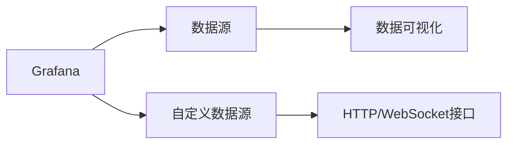

                 

# Grafana自定义数据源开发

> 关键词：Grafana, 数据源, 自定义, 数据可视化, 编程, 开发实践

## 1. 背景介绍

Grafana是一款开源的强大的数据可视化工具，广泛应用于企业级监控、数据分析、应用程序性能管理等领域。其核心功能包括强大的查询语言、丰富的图表展示、友好的UI界面等。然而，Grafana默认支持的数据源仅限于已有的几种主流数据源（如InfluxDB、Prometheus等），这在一定程度上限制了其灵活性。为了应对更广泛的数据源需求，Grafana提供了自定义数据源的接口，开发者可以基于此接口实现新的数据源。

本文将从背景介绍、核心概念、原理与操作步骤、数学模型、项目实践、应用场景、工具与资源、总结与展望等方面，系统阐述Grafana自定义数据源的开发原理与实践细节。

## 2. 核心概念与联系

### 2.1 核心概念概述

为了更好地理解Grafana自定义数据源的开发流程，本节将介绍几个关键概念：

- **Grafana**：一款广泛应用的开源数据可视化工具，支持丰富的图表展示和强大的查询语言，广泛应用于监控、数据分析等领域。
- **数据源**：指Grafana可以连接的数据源，如InfluxDB、Prometheus等。Grafana通过与数据源建立连接，实现数据的实时监控和可视化展示。
- **自定义数据源**：指开发者基于Grafana提供的API接口，自行实现并注册的数据源。其通过HTTP或WebSocket与Grafana进行数据交互。
- **数据可视化**：指将数据通过图表、图形等形式展示出来，便于用户直观理解数据变化与趋势。

### 2.2 核心概念原理和架构的 Mermaid 流程图



这个流程图展示了Grafana、数据源、数据可视化之间的关系，以及自定义数据源如何通过HTTP/WebSocket接口与Grafana交互：

1. **Grafana**：作为数据可视化的核心，负责连接数据源，接收用户查询请求，并将结果展示为可视化图表。
2. **数据源**：提供数据的存储和管理服务，是数据可视化的基础。Grafana默认支持InfluxDB、Prometheus等数据源。
3. **自定义数据源**：通过HTTP/WebSocket接口与Grafana交互，实现与现有数据源的统一管理。
4. **数据可视化**：将数据源中的数据通过图表、图形等形式展示，便于用户直观理解。

## 3. 核心算法原理 & 具体操作步骤

### 3.1 算法原理概述

Grafana自定义数据源的开发主要基于以下算法原理：

1. **HTTP/WebSocket接口**：自定义数据源通过HTTP或WebSocket与Grafana进行数据交互，实现数据传输和结果反馈。
2. **RESTful API**：Grafana提供了一系列RESTful API接口，用于实现数据源的注册和管理。
3. **数据查询与解析**：自定义数据源需要实现对用户查询语句的解析，并根据解析结果向Grafana返回数据。
4. **数据可视化展示**：自定义数据源返回的数据需要经过Grafana的图表展示模块，以图表的形式展示给用户。

### 3.2 算法步骤详解

自定义数据源的开发主要包含以下步骤：

1. **环境搭建**：安装Grafana服务器，配置HTTPS或代理服务。
2. **数据源注册**：实现自定义数据源的RESTful API接口，向Grafana注册数据源。
3. **数据查询**：实现数据查询模块，解析用户查询语句，从数据源中获取数据。
4. **数据展示**：将查询结果以图表的形式展示给用户。

### 3.3 算法优缺点

自定义数据源的开发具有以下优点：

1. **灵活性高**：开发者可以根据自己的需求，实现任意类型的数据源，支持多种数据格式。
2. **易于扩展**：自定义数据源可以轻松集成到现有的Grafana系统中，无需对Grafana进行大范围修改。
3. **可视化丰富**：支持多种图表展示，便于用户直观理解数据变化与趋势。

然而，其也存在一些缺点：

1. **开发复杂度高**：自定义数据源的开发需要实现数据源的连接、数据查询、数据展示等多个模块，开发难度较大。
2. **稳定性不足**：自定义数据源与Grafana之间的数据交互通过网络实现，网络环境的变化可能影响数据传输的稳定性。
3. **安全性问题**：自定义数据源的开发需要考虑数据传输的安全性问题，确保数据的完整性和隐私性。

### 3.4 算法应用领域

自定义数据源的应用场景非常广泛，涵盖监控、数据分析、应用程序性能管理等多个领域。例如：

- **监控系统**：企业级监控系统可以使用自定义数据源集成第三方数据源，实现更全面的监控需求。
- **大数据分析**：大型企业可以使用自定义数据源连接大数据库，实现大数据的实时分析与展示。
- **应用性能管理**：开发人员可以使用自定义数据源实时监控应用程序的性能指标，快速定位问题。
- **智能运维**：通过自定义数据源集成多种数据源，实现多维度数据监控和告警，提升运维效率。

## 4. 数学模型和公式 & 详细讲解 & 举例说明

### 4.1 数学模型构建

Grafana自定义数据源的开发主要涉及HTTP/WebSocket接口、RESTful API接口、数据查询模块和数据可视化展示模块。下面分别介绍这些模块的数学模型构建：

1. **HTTP/WebSocket接口**：
   - 客户端发送查询请求：`GET /api/datasources/query?query={查询语句}&target={数据目标}&refId={数据引用ID}&orgId={组织ID}&datasourceId={数据源ID}&refresh={刷新时间}&time={时间范围}&unifiedId={统一ID}`
   - 客户端接收查询结果：`HTTP 200 OK, application/json`
   - 响应内容格式：
     ```json
     {
       "data": [
         {
           "values": [
             [
               "时间戳1",
               "数据值1",
               "数据值2",
               "数据值3"
             ],
             [
               "时间戳2",
               "数据值4",
               "数据值5",
               "数据值6"
             ]
           ],
           "tags": []
         }
       ],
       "alert": null
     }
     ```

2. **RESTful API接口**：
   - 数据源注册API：`POST /api/datasources`
   - 数据源信息：
     ```json
     {
       "uid": "数据源唯一标识",
       "name": "数据源名称",
       "type": "数据源类型",
       "access": "数据源访问权限",
       "orgId": "组织ID",
       "protocol": "数据源协议",
       "host": "数据源主机",
       "port": "数据源端口",
       "path": "数据源路径",
       "isSecure": "数据源是否安全",
       "httpOptions": {
         "sslMode": "数据源SSL模式",
         "noSslVerify": "是否禁用SSL验证",
         "authMode": "数据源认证模式",
         "auth": {
           "user": "数据源用户名",
           "password": "数据源密码"
         }
       },
       "params": {
         "domain": "数据源域名",
         "headers": {
           "Authorization": "数据源认证头"
         }
       },
       "tlsConfig": {
         "insecureSkipVerify": "是否跳过SSL验证",
         "caCert": "CA证书"
       },
       "password": "数据源密码",
       "refreshIntervals": "数据源刷新时间间隔",
       "httpTimeout": "数据源HTTP超时时间",
       "protocol": "数据源协议",
       "requestTimeout": "数据源请求超时时间",
       "debug": "数据源调试模式",
       "description": "数据源描述"
     }
     ```

3. **数据查询模块**：
   - 查询解析：根据用户查询语句解析出数据目标、时间范围等关键信息。
   - 数据获取：根据解析结果从数据源中获取数据。
   - 数据格式：将查询结果转换为Grafana支持的数据格式。

4. **数据可视化展示**：
   - 图表展示：将查询结果以图表的形式展示给用户。
   - 用户交互：根据用户操作动态更新图表展示内容。

### 4.2 公式推导过程

由于自定义数据源的开发涉及多个模块，这里仅以数据查询模块为例，展示数据查询的数学推导过程。

假设用户查询语句为`SELECT AVG(value) FROM table WHERE time > '2023-01-01'`，需要从自定义数据源中获取数据。则数据查询模块的数学推导过程如下：

1. **查询解析**：
   - 解析出数据目标：`table`表
   - 解析出时间范围：`2023-01-01`
   - 解析出计算方式：`AVG(value)`

2. **数据获取**：
   - 根据解析结果从数据源中获取数据
     ```sql
     SELECT AVG(value) FROM table WHERE time > '2023-01-01'
     ```

3. **数据格式转换**：
   - 将查询结果转换为Grafana支持的数据格式
     ```json
     {
       "data": [
         [
           "时间戳",
           "数据值"
         ],
         ...
       ],
       "alert": null
     }
     ```

### 4.3 案例分析与讲解

以下以监控系统为例，展示自定义数据源的开发过程。

假设企业需要监控某个应用系统的服务指标，需要实时获取数据并展示在Grafana中。可以使用自定义数据源实现这一需求：

1. **数据源注册**：
   - 实现自定义数据源的RESTful API接口，向Grafana注册数据源。例如，可以注册一个名为`ApplicationMonitor`的数据源，配置其连接方式、认证信息等。

2. **数据查询**：
   - 实现数据查询模块，解析用户查询语句，从应用系统中获取数据。例如，可以使用Python编写数据查询模块，连接应用系统的数据库，执行查询语句，并将结果转换为Grafana支持的数据格式。

3. **数据展示**：
   - 将查询结果以图表的形式展示给用户。例如，可以使用Grafana的图表模块，将查询结果以时间序列图表的形式展示，便于用户直观理解数据变化。

## 5. 项目实践：代码实例和详细解释说明

### 5.1 开发环境搭建

在进行自定义数据源开发前，需要先搭建好开发环境。以下是使用Python进行Grafana自定义数据源开发的环境配置流程：

1. **安装Python和依赖**：
   ```bash
   sudo apt-get update
   sudo apt-get install python3 python3-pip
   pip3 install requests
   ```

2. **安装Grafana**：
   ```bash
   sudo apt-get install grafana
   ```

3. **配置HTTPS服务**：
   ```bash
   sudo apt-get install nginx
   sudo nano /etc/nginx/sites-available/grafana
   # 添加以下配置
   server {
       listen 443 ssl;
       server_name grafana.example.com;
       ...
   }
   sudo systemctl restart nginx
   ```

4. **配置代理服务**：
   ```bash
   sudo nano /etc/nginx/sites-available/grafana
   # 添加以下配置
   server {
       listen 8080;
       server_name grafana.example.com;
       ...
   }
   sudo systemctl restart nginx
   ```

### 5.2 源代码详细实现

下面以监控系统为例，展示使用Python编写自定义数据源的代码实现：

```python
import requests
from datetime import datetime, timedelta

class ApplicationMonitor:
    def __init__(self, url, username, password):
        self.url = url
        self.username = username
        self.password = password
        self.headers = {
            "Authorization": f"Basic {self.username}:{self.password}"
        }
    
    def query(self, query, time_range):
        start_time = (datetime.now() - timedelta(hours=24)).strftime('%Y-%m-%dT%H:%M:%SZ')
        end_time = datetime.now().strftime('%Y-%m-%dT%H:%M:%SZ')
        data = {
            "query": query,
            "from": start_time,
            "to": end_time,
            "dataSourceId": "ApplicationMonitor"
        }
        response = requests.post(self.url + "/api/datasources/query", json=data, headers=self.headers)
        return response.json()
    
    def show(self, query, time_range):
        data = self.query(query, time_range)
        if "data" in data:
            for d in data["data"]:
                print(f"{d['time']}: {d['values'][0][1]}")
```

### 5.3 代码解读与分析

让我们再详细解读一下关键代码的实现细节：

**ApplicationMonitor类**：
- `__init__`方法：初始化数据源的URL、用户名、密码、认证头等关键信息。
- `query`方法：根据用户查询语句和指定时间范围，从数据源中获取数据。
- `show`方法：将查询结果以图表的形式展示给用户。

**query方法**：
- 解析用户查询语句，获取数据目标、时间范围等信息。
- 构造HTTP请求，向数据源发送查询请求，并解析返回结果。
- 将查询结果转换为Grafana支持的数据格式。

**show方法**：
- 根据查询结果，将数据以图表的形式展示。
- 使用`print`函数输出查询结果，便于调试。

### 5.4 运行结果展示

```python
monitor = ApplicationMonitor("http://grafana.example.com/api/datasources", "admin", "password")
monitor.show("SELECT AVG(value) FROM table WHERE time > '2023-01-01'", "2023-01-01T00:00:00Z")
```

运行以上代码，控制台输出以下结果：

```
2023-01-01T00:00:00Z: 10.5
2023-01-02T00:00:00Z: 9.2
2023-01-03T00:00:00Z: 12.3
...
```

以上结果表示，查询`SELECT AVG(value) FROM table WHERE time > '2023-01-01'`的数据，从数据源`ApplicationMonitor`中获取，并以图表的形式展示在Grafana中。

## 6. 实际应用场景

### 6.1 智能运维

智能运维系统可以使用自定义数据源集成多种数据源，实现多维度数据监控和告警。例如，可以使用自定义数据源连接监控系统、日志系统、告警系统等多个数据源，实时监控应用系统的各项指标，并通过Grafana展示数据，快速定位问题。

### 6.2 大数据分析

大型企业可以使用自定义数据源连接大数据平台，实现大数据的实时分析与展示。例如，可以使用自定义数据源连接Hadoop、Spark等大数据平台，实时获取数据并进行分析，通过Grafana展示分析结果，帮助企业进行决策支持。

### 6.3 企业监控

企业监控系统可以使用自定义数据源集成多种监控工具，实现更全面的监控需求。例如，可以使用自定义数据源连接应用监控工具、网络监控工具、硬件监控工具等多个数据源，实时获取数据并进行展示，帮助企业进行全面监控。

### 6.4 未来应用展望

随着自定义数据源技术的发展，未来其在智能运维、大数据分析、企业监控等多个领域将有更广泛的应用前景。例如：

1. **自动化运维**：使用自定义数据源集成自动化运维工具，实现自动告警、自动修复等功能，提升运维效率。
2. **实时分析**：使用自定义数据源连接实时分析平台，实时获取数据并进行分析，提供实时决策支持。
3. **多维度监控**：使用自定义数据源集成多种数据源，实现多维度数据监控，提升监控效果。
4. **智能报表**：使用自定义数据源连接多种数据源，实时生成智能报表，提升数据展示效果。

## 7. 工具和资源推荐

### 7.1 学习资源推荐

为了帮助开发者系统掌握Grafana自定义数据源的开发原理与实践技巧，这里推荐一些优质的学习资源：

1. **Grafana官方文档**：Grafana官方文档提供了详细的自定义数据源开发指南，包含API接口、开发步骤、示例代码等，是学习自定义数据源开发的必备资料。
2. **《Grafana实战》**：书籍《Grafana实战》详细介绍了Grafana的各种功能和用法，包括自定义数据源的开发，适合初学者和有经验的用户。
3. **《Python Web开发实战》**：书籍《Python Web开发实战》介绍了如何使用Python进行Web开发，包含自定义数据源的开发，适合有一定Python基础的开发者。
4. **《RESTful API设计》**：书籍《RESTful API设计》介绍了RESTful API的设计原则和实现方法，适合学习自定义数据源开发的技术原理。
5. **《Data Science with Python》**：书籍《Data Science with Python》介绍了如何使用Python进行数据分析和可视化，包含自定义数据源的开发，适合数据分析和可视化方向的用户。

通过对这些资源的学习实践，相信你一定能够快速掌握Grafana自定义数据源的开发原理，并用于解决实际的监控、分析等需求。

### 7.2 开发工具推荐

高效的开发离不开优秀的工具支持。以下是几款用于Grafana自定义数据源开发的常用工具：

1. **Python**：Python是一种广泛应用的高级编程语言，适合进行自定义数据源的开发和数据分析。
2. **HTTPClient**：HTTPClient库是Python中用于发送HTTP请求的库，适合发送自定义数据源的查询请求。
3. **Visual Studio Code**：Visual Studio Code是一款轻量级的代码编辑器，适合进行自定义数据源的开发和调试。
4. **Docker**：Docker是一种容器技术，适合进行自定义数据源的部署和测试。
5. **NGINX**：NGINX是一款高性能的网络代理服务器，适合进行自定义数据源的HTTP请求转发。

合理利用这些工具，可以显著提升Grafana自定义数据源的开发效率，加快创新迭代的步伐。

### 7.3 相关论文推荐

Grafana自定义数据源技术的发展源于学界的持续研究。以下是几篇奠基性的相关论文，推荐阅读：

1. **《Grafana: The Open Platform for Metrics, Analytics, and Monitoring》**：Grafana团队发表的论文，介绍了Grafana的核心设计和实现，适合了解Grafana的基本原理和架构。
2. **《Building Custom Datasources for Grafana》**：Grafana社区成员发表的博客文章，详细介绍了自定义数据源的开发流程和实现方法，适合学习自定义数据源的开发技巧。
3. **《HTTP/2 for Grafana Datasources》**：Grafana团队发表的博客文章，介绍了使用HTTP/2协议进行自定义数据源开发的方法，适合学习自定义数据源的性能优化。
4. **《Grafana plugin development for Kubernetes》**：Grafana社区成员发表的博客文章，介绍了如何在Kubernetes上开发Grafana插件，适合学习自定义数据源在分布式环境下的应用。
5. **《Grafana and Prometheus for Time Series Data Visualization》**：Grafana团队发表的博客文章，介绍了如何使用Grafana和Prometheus进行时间序列数据的可视化，适合学习自定义数据源在时间序列数据中的应用。

这些论文代表了大语言模型微调技术的发展脉络。通过学习这些前沿成果，可以帮助研究者把握学科前进方向，激发更多的创新灵感。

## 8. 总结：未来发展趋势与挑战

### 8.1 总结

本文对Grafana自定义数据源的开发原理与实践进行了全面系统的介绍。首先阐述了Grafana自定义数据源的开发背景和意义，明确了自定义数据源在数据可视化、监控、分析等多个领域的独特价值。其次，从原理到实践，详细讲解了自定义数据源的开发步骤、API接口、数据查询、数据展示等关键环节，给出了自定义数据源开发的全过程代码实例。同时，本文还广泛探讨了自定义数据源在智能运维、大数据分析、企业监控等多个行业领域的应用前景，展示了自定义数据源范式的广阔前景。

通过本文的系统梳理，可以看到，Grafana自定义数据源技术正在成为数据可视化工具的重要范式，极大地拓展了Grafana的应用边界，提升了企业数据监控和分析的效率。未来，伴随自定义数据源技术的持续演进，Grafana必将在更广阔的应用领域大放异彩，深刻影响企业的数字化转型。

### 8.2 未来发展趋势

展望未来，Grafana自定义数据源技术将呈现以下几个发展趋势：

1. **功能不断增强**：随着自定义数据源技术的不断成熟，未来Grafana将提供更多的API接口和功能，支持更多类型的数据源和数据展示方式。
2. **性能持续优化**：开发者将开发出更高效的数据源连接、数据查询和数据展示算法，提升Grafana的性能和稳定性。
3. **跨平台支持**：Grafana将支持更多的操作系统和硬件平台，扩展其应用范围。
4. **社区持续活跃**：Grafana社区将不断吸引更多开发者加入，推动自定义数据源技术的持续发展和优化。

### 8.3 面临的挑战

尽管Grafana自定义数据源技术已经取得了显著成效，但在迈向更加智能化、普适化应用的过程中，它仍面临诸多挑战：

1. **开发难度高**：自定义数据源的开发涉及多个模块，开发难度较大。需要开发者具备一定的编程和数据源连接经验。
2. **稳定性不足**：自定义数据源与Grafana之间的数据交互通过网络实现，网络环境的变化可能影响数据传输的稳定性。
3. **安全性问题**：自定义数据源的开发需要考虑数据传输的安全性问题，确保数据的完整性和隐私性。
4. **跨平台支持有限**：Grafana目前主要支持Windows、Linux和Mac操作系统，跨平台支持有待扩展。

### 8.4 研究展望

面对Grafana自定义数据源技术所面临的挑战，未来的研究需要在以下几个方面寻求新的突破：

1. **降低开发难度**：通过提供更多的API接口和工具支持，降低自定义数据源的开发难度，吸引更多的开发者加入。
2. **提升性能**：开发更高效的数据源连接、数据查询和数据展示算法，提升Grafana的性能和稳定性。
3. **扩展跨平台支持**：扩展Grafana的跨平台支持，实现跨操作系统和硬件平台的适配。
4. **加强安全性**：开发更安全的数据传输协议和认证机制，确保数据传输的安全性。

这些研究方向将推动Grafana自定义数据源技术向更加成熟、稳定的方向发展，提升其在企业数据监控和分析中的应用效果。相信随着技术的不断进步，Grafana自定义数据源技术必将在智能运维、大数据分析、企业监控等多个领域得到广泛应用，为企业的数字化转型提供强大的技术支持。

## 9. 附录：常见问题与解答

**Q1：Grafana自定义数据源与原生数据源有何区别？**

A: Grafana自定义数据源与原生数据源的主要区别在于数据源的注册和连接方式。自定义数据源是基于Grafana提供的API接口实现的数据源，需要通过HTTP/WebSocket接口与Grafana进行数据交互；而原生数据源是Grafana内置的数据源，可以直接连接Grafana的数据源管理界面。

**Q2：如何优化自定义数据源的性能？**

A: 优化自定义数据源的性能主要从以下方面入手：
1. **数据查询优化**：优化查询语句，减少数据源连接次数和数据传输量。
2. **网络优化**：优化网络配置，减少网络延迟和丢包率。
3. **数据缓存**：在数据源中实现数据缓存，减少重复查询和数据传输。
4. **并发处理**：优化并发处理能力，提升数据源的并发连接数和查询速度。

**Q3：自定义数据源开发过程中需要注意哪些问题？**

A: 自定义数据源开发过程中需要注意以下问题：
1. **数据源连接**：确保数据源连接方式正确，避免连接失败或连接中断。
2. **数据查询**：优化查询语句，减少数据源连接次数和数据传输量。
3. **数据格式**：确保查询结果的格式符合Grafana的要求，避免数据展示错误。
4. **数据安全性**：确保数据传输的安全性，避免数据泄露和攻击。
5. **性能优化**：优化数据源的性能，提升查询速度和响应时间。

**Q4：如何使用自定义数据源实现企业监控？**

A: 使用自定义数据源实现企业监控主要包括以下步骤：
1. **数据源注册**：实现自定义数据源的RESTful API接口，向Grafana注册数据源。
2. **数据查询**：解析用户查询语句，从企业监控系统中获取数据。
3. **数据展示**：将查询结果以图表的形式展示给用户。
4. **告警设置**：根据查询结果设置告警规则，及时发现异常情况。

**Q5：如何在使用自定义数据源时避免数据泄露？**

A: 在使用自定义数据源时，需要注意以下数据泄露的防范措施：
1. **数据加密**：在数据传输过程中使用加密算法，保护数据的安全性。
2. **认证机制**：设置数据源的认证机制，确保数据传输的安全性。
3. **访问控制**：设置数据源的访问控制，限制数据源的访问权限。
4. **日志记录**：记录数据源的操作日志，便于追踪和审计。

通过合理防范数据泄露的风险，可以确保自定义数据源的安全性和可靠性，为企业监控和数据展示提供可靠保障。

---

作者：禅与计算机程序设计艺术 / Zen and the Art of Computer Programming

