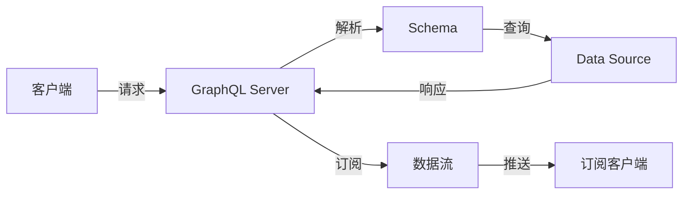

                 

# GraphQL：新一代API查询语言

> 关键词：GraphQL, RESTful API, API Gateway, Web应用, Data Modeling, Schema, Query, Fragment, Subscription, GraphQL Resolver

## 1. 背景介绍

随着Web应用的不断发展，API作为连接前后端的重要桥梁，其设计和规范日益成为构建高效、灵活、可维护系统的重要基础。传统的RESTful API虽然结构简单，但存在数据冗余、响应不灵活等问题。而作为新一代API查询语言的GraphQL，以其强大的数据查询能力、灵活的数据控制和高效的性能表现，迅速成为现代Web应用的首选。

## 2. 核心概念与联系

### 2.1 核心概念概述

GraphQL是一种用于构建API的查询语言，由Facebook在2015年开源。与RESTful API不同，GraphQL提供了一种更为灵活的数据获取方式。在GraphQL中，客户端可以直接查询数据模型的任何部分，而不需要像RESTful API那样固定返回一组资源。

核心概念包括：

- **GraphQL：** 一种用于API的查询语言，支持复杂的数据查询、数据控制和类型检查。
- **Schema：** GraphQL的架构，定义了可查询数据模型和数据类型。
- **Query：** 客户端发送的请求，用于获取数据。
- **Fragment：** 预定义的数据片段，可以在多个查询中复用。
- **Subscription：** 实现在线数据流，用于实时更新。
- **GraphQL Resolver：** 用于解析查询请求并返回数据的处理函数。

### 2.2 核心概念原理和架构的 Mermaid 流程图



这个流程图展示了GraphQL的基本流程：

1. 客户端向GraphQL Server发送GraphQL请求。
2. GraphQL Server解析请求，并根据Schema查询数据源。
3. 数据源返回处理后的数据。
4. GraphQL Server构造响应并返回给客户端。
5. 对于订阅请求，GraphQL Server会在数据更新时推送新数据给订阅客户端。

## 3. 核心算法原理 & 具体操作步骤

### 3.1 算法原理概述

GraphQL的核心原理可以总结为两点：数据查询与数据控制。具体来说，GraphQL允许客户端定义查询结构，服务器解析并执行这些结构，从而获取需要的数据。这种结构化的查询方式，使得客户端可以精确地控制返回的数据，避免了数据冗余。

GraphQL查询的语义是一对一的，即每个请求都对应着唯一的响应。这种一对一的映射关系，确保了数据的一致性和准确性。同时，GraphQL的Schema定义了一个明确的数据模型，客户端和服务器都遵循这个模型，从而保证了API的规范性和可维护性。

### 3.2 算法步骤详解

GraphQL的查询和响应流程分为以下几个步骤：

1. **Schema定义：**
   - 首先，需要定义Schema，即数据模型和数据类型。Schema定义了可查询的数据类型和数据关系，是GraphQL的架构基础。

   ```graphql
   scalar DateTime
   scalar String
   type Query {
       // 查询用户信息
       user(id: ID!): User
       // 查询所有用户
       users: [User]
   }
   type User {
       id: ID!
       name: String!
       email: String
       posts: [Post]
   }
   type Post {
       id: ID!
       content: String
       author: User
       comments: [Comment]
   }
   type Comment {
       id: ID!
       content: String
       author: User
   }
   ```

2. **查询构建：**
   - 客户端通过定义查询结构，向GraphQL Server发送请求。查询结构中包含了需要查询的数据类型、字段和关系。

   ```graphql
   query {
       users {
           id
           name
           email
       }
   }
   ```

3. **解析和执行：**
   - GraphQL Server解析客户端的查询请求，并根据Schema查询数据源。数据源可以是数据库、API、外部服务等。
   - 数据源返回处理后的数据，GraphQL Server根据Schema将数据映射到查询结果。

4. **响应构造：**
   - GraphQL Server构造响应，包含查询结果和错误信息。响应结果是一个JSON对象，每个字段对应着请求中定义的字段。
   - 对于复杂查询，GraphQL Server还支持嵌套、聚合、排序、过滤等操作，进一步提升数据获取的灵活性。

   ```json
   {
       "data": {
           "users": [
               {
                   "id": "1",
                   "name": "Alice",
                   "email": "alice@example.com"
               },
               {
                   "id": "2",
                   "name": "Bob",
                   "email": "bob@example.com"
               }
           ]
       }
   }
   ```

### 3.3 算法优缺点

GraphQL的优点：

1. **数据控制灵活：** 客户端可以自定义查询结构，获取所需的数据。
2. **减少数据冗余：** 服务器只返回查询结果中的数据，避免数据冗余。
3. **支持数据聚合和过滤：** 客户端可以指定查询的聚合方式和过滤条件。
4. **高效的数据获取：** 客户端一次请求，获取多个数据源的数据。
5. **实时数据更新：** 支持数据流，实现实时数据推送。

GraphQL的缺点：

1. **学习成本高：** GraphQL的查询结构相对复杂，需要花费时间学习。
2. **数据聚合难度高：** 复杂查询可能导致数据聚合困难，增加服务器的负担。
3. **网络延迟较大：** 一次请求可能包含多个数据源的数据，导致网络延迟较大。
4. **缓存管理复杂：** 客户端需要自行管理缓存，增加了实现的复杂性。
5. **安全性风险：** GraphQL的Schema定义暴露了数据模型，存在数据泄露的风险。

### 3.4 算法应用领域

GraphQL不仅适用于Web应用，还可以用于API Gateway、移动应用、物联网设备等多个领域。以下是一些典型的应用场景：

- **Web应用：** 通过GraphQL构建API，实现前后端数据的无缝集成。
- **API Gateway：** 用于聚合多个API，提供统一的查询接口。
- **移动应用：** 提供高效的移动端数据获取和控制。
- **物联网设备：** 实现设备与云端的实时数据交互。
- **企业内部系统：** 构建企业级数据中心，实现跨系统的数据访问和控制。

## 4. 数学模型和公式 & 详细讲解 & 举例说明

### 4.1 数学模型构建

GraphQL的查询模型是基于树形结构的，每个节点代表一个数据类型，每个边代表一个字段和关系。Schema定义了这种树形结构，确保了查询和响应的正确性。

GraphQL的Schema定义格式如下：

```graphql
type Query {
    // 查询用户信息
    user(id: ID!): User
    // 查询所有用户
    users: [User]
}
```

Schema中包含了三个主要元素：

- **type：** 数据类型，如User、Post、Comment等。
- **field：** 字段名和类型，如user、users、id、name等。
- **args：** 参数，如id、content、author等。

### 4.2 公式推导过程

GraphQL的查询和响应过程可以用数学模型表示为：

- **查询表示：** 查询结构可以表示为树形结构，每个节点代表一个数据类型，每个边代表一个字段和关系。
- **响应表示：** 响应结果可以表示为树形结构，每个节点代表一个数据类型，每个边代表一个字段和值。

以查询`users`为例，其数学模型可以表示为：

```
users {
    id
    name
    email
}
```

这个查询表示为：

```
 users -----> id
             |
             ---------------------- users -----> name
                                           |
                                           ---------------------- email
```

响应结果为：

```
 users -----> id
             |
             ---------------------- users -----> name
                                           |
                                           ---------------------- email
```

### 4.3 案例分析与讲解

以查询用户信息为例，GraphQL的查询和响应过程如下：

**Schema定义：**

```graphql
type Query {
    user(id: ID!): User
    users: [User]
}
type User {
    id: ID!
    name: String!
    email: String
    posts: [Post]
}
type Post {
    id: ID!
    content: String
    author: User
    comments: [Comment]
}
```

**客户端查询：**

```graphql
query {
    user(id: "1") {
        id
        name
        email
    }
}
```

**服务器解析和执行：**

服务器解析查询请求，查询用户信息并返回结果。

```graphql
query {
    user(id: "1") {
        id
        name
        email
    }
}
```

**响应结果：**

```json
{
    "data": {
        "user": {
            "id": "1",
            "name": "Alice",
            "email": "alice@example.com"
        }
    }
}
```

## 5. 项目实践：代码实例和详细解释说明

### 5.1 开发环境搭建

使用Node.js和Express框架搭建GraphQL服务端，需要安装以下依赖：

```bash
npm install express graphql graphql-relay graphql-upload
```

### 5.2 源代码详细实现

以下是一个简单的GraphQL服务端实现，包含Schema定义、数据源、查询解析器等。

**Schema定义：**

```js
const { buildSchema } = require('graphql');

const typeDefs = `
  type User {
    id: ID!
    name: String!
    email: String
    posts: [Post]
  }

  type Post {
    id: ID!
    content: String
    author: User
    comments: [Comment]
  }

  type Comment {
    id: ID!
    content: String
    author: User
  }

  type Query {
    user(id: ID!): User
    users: [User]
  }

  type Mutation {
    // 创建新用户
    createUser(name: String!, email: String!): User
  }

  type Subscription {
    // 订阅用户信息变更
    user(id: ID!): User
  }
`;

const schema = buildSchema(typeDefs);
```

**数据源定义：**

```js
const users = [
  { id: '1', name: 'Alice', email: 'alice@example.com' },
  { id: '2', name: 'Bob', email: 'bob@example.com' }
];

const posts = [
  { id: '1', content: 'Hello, GraphQL!', author: 'Alice' },
  { id: '2', content: 'Hi, world!', author: 'Bob' }
];

const comments = [
  { id: '1', content: 'Nice job!', author: 'Alice' }
];

const userMap = users.reduce((map, user) => {
  map[user.id] = user;
  return map;
}, {});

const postMap = posts.reduce((map, post) => {
  map[post.id] = post;
  return map;
}, {});

const commentMap = comments.reduce((map, comment) => {
  map[comment.id] = comment;
  return map;
}, {});

const resolvers = {
  Query: {
    users: () => users,
    user: (parent, { id }) => userMap[id],
    createUser: (parent, { name, email }) => ({
      id: `${users.length + 1}`,
      name,
      email,
      posts: [],
      comments: [],
    }),
  },
  Subscription: {
    user: {
      subscribe: (parent, { id }) => {
        return new Promise((resolve) => {
          const unsubscribe = setInterval(() => {
            resolve(userMap[id]);
          }, 2000);
          return () => clearInterval(unsubscribe);
        });
      },
    },
  },
  Post: {
    author: (parent, _, context) => context.userMap[parent.author.id],
  },
  Comment: {
    author: (parent, _, context) => context.userMap[parent.author.id],
  },
};

const express = require('express');
const app = express();

app.use('/graphql', graphqlHTTP({
  schema: schema,
  rootValue: resolvers,
  graphiql: true,
}));

app.listen(4000, () => {
  console.log('GraphQL server is running on port 4000');
});
```

**代码解读与分析：**

- **Schema定义：** 使用buildSchema函数定义Schema，包含了User、Post、Comment等数据类型。
- **数据源定义：** 定义了users、posts、comments等数据源，并创建了用户、帖子、评论的Map对象，方便查询和更新。
- **查询解析器：** 实现了查询解析器，包括users、user、createUser等方法。
- **订阅解析器：** 实现了用户订阅解析器，支持实时数据推送。

**运行结果展示：**

启动服务后，可以在浏览器访问GraphiQL界面，进行GraphQL查询和订阅操作。

## 6. 实际应用场景

GraphQL已经在多个领域得到了广泛应用，以下是一些典型的应用场景：

- **电商平台：** 用于构建产品、订单、库存等数据的查询和更新API。
- **内容管理系统：** 用于构建文章、评论、用户等数据的查询和更新API。
- **社交网络：** 用于构建用户、帖子、评论等数据的查询和更新API。
- **API Gateway：** 用于聚合多个微服务的数据API，提供统一的查询接口。
- **实时数据应用：** 用于实现实时数据推送和订阅，如聊天室、新闻推送等。

## 7. 工具和资源推荐

### 7.1 学习资源推荐

为了帮助开发者系统掌握GraphQL的核心概念和实践技巧，这里推荐一些优质的学习资源：

1. GraphQL官方文档：GraphQL的官方文档，包含了详细的Schema定义、查询解析器和订阅解析器等内容。
2. GraphQL教程：由GraphQL社区提供的系列教程，涵盖从基础到高级的各个方面。
3. GraphQL在中国：国内知名的GraphQL社区，提供大量的实战经验和社区支持。
4. GraphQL实战：由Stormpath开发者撰写，深入浅出地介绍了GraphQL在Web应用中的实现和优化。
5. GraphQL in 60 Seconds：一个简短的GraphQL教程，适合快速入门。

### 7.2 开发工具推荐

以下是几款用于GraphQL开发的常用工具：

1. GraphiQL：GraphQL的在线交互界面，方便测试和调试GraphQL查询。
2. GraphQL Playground：GraphQL的API测试工具，支持实时数据更新和订阅。
3. Prisma：基于GraphQL的ORM，支持数据库和API的无缝集成。
4. Apollo Client：React生态下的GraphQL客户端，提供高性能的数据获取和控制。
5. Apollo Server：GraphQL的服务器端框架，支持GraphQL的构建和部署。

### 7.3 相关论文推荐

GraphQL的研究涵盖了数据查询、数据控制、类型系统等多个方面，以下是几篇具有代表性的相关论文：

1. GraphQL: A Universal API Layer for JavaScript：提出GraphQL的概念和基本原理，讨论了GraphQL的优势和应用场景。
2. GraphQL as a Relational Database：探讨了GraphQL与传统关系型数据库的结合方式，提出了基于GraphQL的数据模型和查询方式。
3. GraphQL Combinators：研究了GraphQL查询组合器，提供了一种基于组合的数据控制方式。
4. GraphQL+WebSockets：研究了GraphQL与WebSocket的结合方式，支持实时数据推送和订阅。
5. GraphQL Scaling：探讨了GraphQL在大规模数据和复杂查询场景下的性能优化策略。

## 8. 总结：未来发展趋势与挑战

### 8.1 总结

本文对GraphQL的基本概念、查询和响应流程、优缺点和应用场景进行了全面系统的介绍。通过示例代码和实际应用场景，展示了GraphQL如何在Web应用中发挥强大的数据获取和控制能力。同时，本文还推荐了一些优质的学习资源和开发工具，帮助开发者系统掌握GraphQL的核心技术和实践技巧。

GraphQL以其强大的数据查询能力、灵活的数据控制和高效的性能表现，已经成为现代Web应用的首选。未来，GraphQL将在更多领域得到广泛应用，为构建高效、灵活、可维护的系统提供有力的支持。

### 8.2 未来发展趋势

展望未来，GraphQL的发展趋势包括以下几个方面：

1. **数据模型标准化：** 随着GraphQL社区的壮大，数据模型的标准化将得到进一步提升，确保API的规范性和可维护性。
2. **高性能优化：** 针对大规模数据和复杂查询，GraphQL将引入更多的优化技术和工具，提高API的性能和稳定性。
3. **实时数据增强：** 随着Websocket的普及，GraphQL的实时数据推送功能将进一步增强，支持更丰富的订阅应用场景。
4. **多模态数据融合：** 将GraphQL与REST、WebSocket、GraphDB等技术结合，实现多模态数据的无缝集成和控制。
5. **企业级应用扩展：** GraphQL将在企业级应用中得到广泛应用，支持数据治理、数据可视化、数据管理等。

### 8.3 面临的挑战

尽管GraphQL在Web应用中已经取得了广泛应用，但在未来发展过程中，仍然面临一些挑战：

1. **学习成本高：** GraphQL的查询结构和Schema定义相对复杂，初学者需要花费一定时间学习。
2. **性能瓶颈：** 针对大规模数据和复杂查询，GraphQL的性能优化仍然需要进一步改进。
3. **安全性问题：** GraphQL的Schema定义暴露了数据模型，存在数据泄露和安全性风险。
4. **开发成本高：** GraphQL的开发和维护成本相对较高，需要专门的开发团队和技术支持。
5. **兼容性问题：** GraphQL与其他技术（如REST、WebSocket等）的兼容性仍需进一步优化。

### 8.4 研究展望

未来，GraphQL的研究方向将包括以下几个方面：

1. **数据控制优化：** 研究更加灵活、高效的数据控制方式，提升GraphQL的查询和响应性能。
2. **多模态数据整合：** 将GraphQL与REST、WebSocket、GraphDB等技术结合，实现多模态数据的无缝集成和控制。
3. **实时数据推送：** 研究基于WebSocket的实时数据推送机制，支持更丰富的订阅应用场景。
4. **企业级应用支持：** 研究企业级应用中的数据治理、数据可视化、数据管理等应用场景。
5. **安全性增强：** 研究GraphQL的安全性问题，提供更加安全的数据访问和控制机制。

## 9. 附录：常见问题与解答

**Q1：GraphQL和RESTful API有什么区别？**

A: GraphQL与RESTful API的主要区别在于数据获取的方式和数据的控制方式。RESTful API采用固定返回一组资源的方式，客户端需要定义多个API来获取不同类型的数据。而GraphQL允许客户端自定义查询结构，直接获取所需的数据，避免了数据冗余。

**Q2：GraphQL的Schema定义复杂吗？**

A: GraphQL的Schema定义相对复杂，但也是其强大的数据控制能力的基础。Schema定义了可查询的数据类型和数据关系，确保了查询和响应的正确性。初学者可以通过GraphiQL等在线工具进行实验，逐步理解Schema定义的方式。

**Q3：GraphQL的查询解析器复杂吗？**

A: GraphQL的查询解析器相对复杂，需要根据Schema定义和数据源实现具体的查询逻辑。但通过使用GraphQL Resolver，可以将查询解析器的实现与业务逻辑分离，提高代码的可维护性。

**Q4：GraphQL的实时数据推送如何实现？**

A: GraphQL的实时数据推送可以通过WebSocket实现。在GraphQL服务器端，定义一个WebSocket订阅解析器，将数据更新推送到客户端。在客户端，通过WebSocket监听数据更新，实现实时数据刷新。

**Q5：GraphQL如何处理数据聚合？**

A: GraphQL支持数据聚合，可以通过嵌套、聚合、排序、过滤等方式获取数据。在查询解析器中，可以根据客户端的聚合需求，提供相应的聚合函数和计算逻辑。

---

作者：禅与计算机程序设计艺术 / Zen and the Art of Computer Programming

