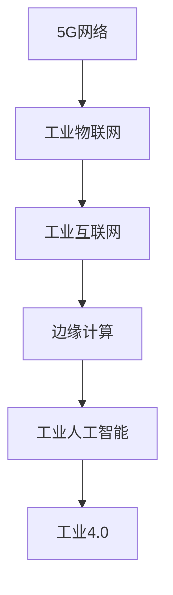

                 

## 1. 背景介绍

### 1.1 问题由来

在第四次工业革命浪潮中，5G技术以其高带宽、低时延、高可靠性等优势，正在引领工业互联网的数字化转型。5G不仅极大地提升了物联网设备的连接能力和应用范围，还推动了人工智能、大数据等新兴技术的融合，助力各行各业实现了智能制造、智慧物流、智能交通等创新应用。然而，5G与工业4.0的深度融合，仍面临着诸多挑战，如如何构建统一的网络架构、如何优化网络切片配置、如何确保数据安全等问题。本文将深入探讨5G技术在工业4.0中的应用，通过详细阐述核心概念、算法原理和实际案例，揭示5G技术如何为工业互联网带来革命性的变革。

### 1.2 问题核心关键点

5G技术在工业4.0中的应用，其核心在于通过高带宽、低时延的网络特性，实现对生产环境、设备和工艺的全方位数字化改造。通过5G网络的高效连接，工业互联网可以实现实时监控、远程操控、智能诊断等应用，从而提升生产效率、降低成本、优化运营。但5G与工业4.0的融合，并非简单叠加，而是需要深入理解工业互联网的需求，创新设计5G网络的架构和应用场景，并结合人工智能、大数据等技术，构建更加智能、高效的工业体系。

## 2. 核心概念与联系

### 2.1 核心概念概述

为更好地理解5G技术在工业4.0中的应用，本节将介绍几个密切相关的核心概念：

- 5G网络：第五代移动通信网络，以其高速率、低时延、高可靠性等特点，支持大规模物联网设备的连接和数据传输。
- 工业4.0：基于新一代信息技术，实现工厂的数字化、网络化和智能化，推动工业生产的高效、柔性和智能。
- 工业互联网：通过物联网、云计算、大数据、人工智能等技术，实现工厂、设备、人员等要素的全面互联，促进工业数字化转型。
- 边缘计算：将数据和计算任务从中心云迁移到网络边缘，减少延迟，提高响应速度，满足工业互联网的实时性需求。
- 工业物联网：将工厂的生产设备、传感器、执行器等设备进行数字化改造，实现数据采集、状态监测、故障诊断等功能。
- 工业人工智能：通过人工智能技术，实现生产流程的优化、设备的智能维护、质量控制等，提升生产效率和产品质量。

这些核心概念之间的逻辑关系可以通过以下Mermaid流程图来展示：



这个流程图展示了5G技术在工业4.0中的应用脉络：

1. 5G网络提供高带宽、低时延、高可靠性的通信服务。
2. 工业物联网将工厂的设备和传感器进行数字化，实现数据的采集和传输。
3. 边缘计算在网络边缘进行数据处理和分析，满足工业互联网的实时性需求。
4. 工业人工智能利用AI技术对数据进行深度分析，提升生产效率和质量。
5. 工业4.0将上述技术融合应用，实现工厂的全面数字化和智能化。

这些核心概念共同构成了5G技术在工业4.0中的应用框架，为其带来了广泛的应用场景和巨大的发展潜力。

## 3. 核心算法原理 & 具体操作步骤

### 3.1 算法原理概述

5G技术在工业4.0中的应用，本质上是通过5G网络实现工业物联网设备的互联互通，并结合边缘计算和人工智能技术，对采集到的数据进行实时处理和分析。其核心算法原理主要包括以下几个方面：

1. **网络切片技术**：将5G网络分为多个虚拟网络切片，每个切片服务于特定的工业应用，如监控、控制、管理等，通过灵活配置和优化切片，提高网络资源的利用效率和应用性能。
2. **边缘计算**：在网络边缘部署计算资源，靠近数据源进行处理，减少数据传输延迟，提高实时性。
3. **工业人工智能**：利用机器学习和深度学习技术，对采集到的数据进行分析和建模，实现智能决策和预测。
4. **智能网络管理**：通过网络自动化和优化技术，实时监控和调整网络性能，确保网络稳定性和可靠性。

### 3.2 算法步骤详解

基于5G技术在工业4.0中的应用，其算法步骤主要包括以下几个环节：

**Step 1: 网络切片配置**
- 根据工业应用需求，定义网络切片的种类和资源配置，如带宽、时延、可靠性等。
- 使用网络切片管理技术，对切片进行动态配置和优化，确保每个切片满足工业应用的需求。

**Step 2: 边缘计算部署**
- 在工业网络边缘部署计算资源，如边缘服务器、边缘路由器等。
- 将数据处理和分析任务迁移到边缘设备进行，减少数据传输延迟，提高实时性。
- 采用边缘计算框架，如OpenFog、Kubernetes等，进行资源管理和任务调度。

**Step 3: 工业物联网设备接入**
- 将工厂的生产设备、传感器、执行器等进行数字化改造，实现数据采集和传输。
- 使用边缘计算技术，进行数据的预处理和初步分析，减少对中心云的依赖。
- 确保工业物联网设备的网络安全，防止数据泄露和攻击。

**Step 4: 工业人工智能建模**
- 收集和预处理工业数据，包括设备状态、生产参数、质量检测等。
- 利用机器学习和深度学习技术，对工业数据进行建模，实现故障预测、质量控制、智能调度和优化等应用。
- 使用模型训练框架，如TensorFlow、PyTorch等，进行模型训练和优化。

**Step 5: 智能网络管理**
- 实时监控和调整网络性能，包括网络带宽、时延、抖动等指标。
- 通过网络自动化技术，实现网络的自动配置和优化，提高网络稳定性和可靠性。
- 利用网络监测工具，如NetFlow、SNMP等，进行网络状态分析和故障诊断。

### 3.3 算法优缺点

5G技术在工业4.0中的应用，具有以下优点：

1. **高效互联**：5G网络的高带宽、低时延、高可靠性，支持大规模物联网设备的连接和数据传输，提高生产效率和灵活性。
2. **实时响应**：通过边缘计算和实时数据处理，满足工业应用的实时性需求，实现智能决策和预测。
3. **智能化运营**：利用工业人工智能技术，优化生产流程、提升产品质量、实现智能维护等，推动工业数字化转型。
4. **灵活配置**：网络切片技术可以根据工业应用需求，动态配置网络资源，提高资源利用效率和应用性能。

同时，5G技术在工业4.0中的应用也存在一些缺点：

1. **高昂成本**：5G网络的建设、维护和升级成本较高，初期投资较大。
2. **安全风险**：工业物联网设备的数字化改造，增加了网络安全风险，需要采取严格的防护措施。
3. **技术复杂度**：5G技术涉及网络切片、边缘计算、工业人工智能等多项技术，技术复杂度较高，需要跨领域的人才协同工作。
4. **标准化不足**：5G技术在工业领域的应用尚处于初期阶段，标准化工作仍在推进中，存在一定的不确定性。

尽管存在这些局限性，但5G技术在工业4.0中的应用前景广阔，将成为推动工业互联网数字化转型的重要引擎。

### 3.4 算法应用领域

5G技术在工业4.0中的应用，已经拓展到多个领域，包括智能制造、智慧物流、智能交通、智能电网等。以下是几个典型的应用场景：

- **智能制造**：通过5G网络实现工厂的全面数字化，实现设备互联、状态监测、智能调度等，提升生产效率和产品质量。
- **智慧物流**：利用5G网络的高带宽、低时延特性，实现物流设备的实时监控和控制，优化物流路径和效率。
- **智能交通**：通过5G网络实现车联网的全面互联，实现交通流量的实时监测和控制，提升交通安全和效率。
- **智能电网**：利用5G网络实现电力设备的数字化和智能化，实现电力系统的实时监控和优化，提升电网稳定性和可靠性。

## 4. 数学模型和公式 & 详细讲解 & 举例说明

### 4.1 数学模型构建

为了更好地理解5G技术在工业4.0中的应用，本节将使用数学语言对相关概念进行更为严格的刻画。

记5G网络切片数为 $N$，每个切片的带宽为 $B_i$，时延为 $D_i$，可靠性为 $R_i$，其中 $i=1,2,\dots,N$。假设工业应用的带宽需求为 $B$，时延需求为 $D$，可靠性需求为 $R$。

定义网络切片的匹配度为 $f_i(B_i, D_i, R_i, B, D, R)$，表示切片 $i$ 与工业应用需求的匹配程度。最优网络切片配置为：

$$
\max_{i=1,\dots,N} f_i(B_i, D_i, R_i, B, D, R)
$$

在实际应用中，可以通过K-means聚类等算法，对切片进行优化配置，实现网络资源的合理利用和工业应用的性能优化。

### 4.2 公式推导过程

在5G网络切片的优化配置中，主要涉及以下几个数学模型：

1. **K-means聚类算法**：将切片划分为多个簇，每个簇代表一种网络配置，优化簇内和簇间的距离。
2. **多目标优化问题**：通过最大化切片匹配度，最小化带宽、时延、可靠性的误差。
3. **切片配置算法**：通过迭代算法，对切片进行动态配置和优化，确保满足工业应用的需求。

以K-means聚类算法为例，假设切片数为 $N$，切片的带宽、时延、可靠性分别为 $B_1,\dots,B_N$，$D_1,\dots,D_N$，$R_1,\dots,R_N$，工业应用的带宽、时延、可靠性需求分别为 $B$，$D$，$R$。则K-means聚类算法的目标为：

$$
\min_{C, \mu_k} \sum_{k=1}^K \sum_{x \in C_k} \|x-\mu_k\|^2
$$

其中 $C_k$ 表示第 $k$ 个簇，$\mu_k$ 表示簇中心，$K$ 表示簇的数量。

在实际应用中，可以根据工业应用的需求，选择最优的网络切片配置，实现网络资源的合理利用和工业应用的性能优化。

### 4.3 案例分析与讲解

**案例1: 智能制造的5G网络切片配置**
- **需求分析**：工厂的生产设备需要高速率的网络传输，生产线的监控和控制需要低时延和高可靠性。
- **网络切片配置**：通过K-means聚类算法，将网络切片划分为高速率、低时延和高可靠性的三个簇，每个簇对应一种网络配置。
- **结果分析**：通过动态配置和优化网络切片，实现生产设备的高速率传输，确保监控和控制的时延和可靠性，提升生产效率和质量。

**案例2: 智慧物流的5G网络切片配置**
- **需求分析**：物流车辆的监控需要低时延和稳定性的网络传输，物流路径的规划需要高效的数据处理。
- **网络切片配置**：通过K-means聚类算法，将网络切片划分为低时延和高效处理两个簇，每个簇对应一种网络配置。
- **结果分析**：通过动态配置和优化网络切片，实现物流车辆的实时监控和高效的数据处理，优化物流路径和效率。

## 5. 项目实践：代码实例和详细解释说明

### 5.1 开发环境搭建

在进行5G网络切片配置和优化实践前，我们需要准备好开发环境。以下是使用Python进行K-means聚类算法的环境配置流程：

1. 安装Anaconda：从官网下载并安装Anaconda，用于创建独立的Python环境。

2. 创建并激活虚拟环境：
```bash
conda create -n 5g-network python=3.8 
conda activate 5g-network
```

3. 安装必要的库：
```bash
conda install numpy scipy matplotlib seaborn
```

完成上述步骤后，即可在`5g-network`环境中开始开发实践。

### 5.2 源代码详细实现

下面我们以智能制造的5G网络切片配置为例，给出使用K-means算法的PyTorch代码实现。

首先，定义网络切片的需求数据：

```python
import numpy as np
from sklearn.cluster import KMeans

# 定义网络切片的带宽、时延、可靠性需求
demand_bands = np.array([1000, 2000, 5000, 3000, 10000, 15000, 20000])
demand_lats = np.array([5, 10, 15, 20, 25, 30, 40])
demand_rels = np.array([0.99, 0.95, 0.90, 0.95, 0.99, 0.95, 0.90])

# 定义网络切片的带宽、时延、可靠性
slice_bands = np.array([1500, 2000, 5000, 3000, 10000, 15000, 20000])
slice_lats = np.array([5, 10, 15, 20, 25, 30, 40])
slice_rels = np.array([0.99, 0.95, 0.90, 0.95, 0.99, 0.95, 0.90])
```

然后，定义K-means聚类模型：

```python
kmeans = KMeans(n_clusters=3, init='k-means++', random_state=0)
kmeans.fit(np.c_[demand_bands, demand_lats, demand_rels])
```

接着，计算网络切片的匹配度：

```python
# 定义匹配度的计算函数
def calculate_fitness(demand, slice, kmeans):
    demand_f = np.array([demand_bands, demand_lats, demand_rels])
    slice_f = np.array([slice_bands, slice_lats, slice_rels])
    center = kmeans.cluster_centers_
    return np.sum((center - demand_f) ** 2)

# 计算网络切片的匹配度
fitness_values = []
for i in range(len(slice_bands)):
    fitness_values.append(calculate_fitness(demand_f=np.c_[demand_bands, demand_lats, demand_rels], slice_f=np.c_[slice_bands[i], slice_lats[i], slice_rels[i]], kmeans=kmeans))
```

最后，输出匹配度最大的网络切片配置：

```python
# 输出匹配度最大的网络切片配置
max_fitness_index = fitness_values.index(max(fitness_values))
print(f"匹配度最大的网络切片配置为：{slice_bands[max_fitness_index]}-{slice_lats[max_fitness_index]}-{slice_rels[max_fitness_index]}")
```

以上就是使用K-means聚类算法进行5G网络切片配置的完整代码实现。可以看到，通过计算网络切片的匹配度，可以动态配置和优化网络资源，实现工业应用的性能优化。

### 5.3 代码解读与分析

让我们再详细解读一下关键代码的实现细节：

**K-means聚类模型**：
- `KMeans`类：使用scikit-learn库中的K-means聚类算法，对网络切片进行聚类。
- `n_clusters`参数：指定聚类的簇数量。
- `init`参数：指定聚类的初始化方式。
- `random_state`参数：指定随机数生成器的种子，保证每次聚类结果一致。

**匹配度计算函数**：
- `calculate_fitness`函数：计算网络切片与工业应用需求的匹配度，采用欧式距离计算两个向量之间的距离。
- `demand_f`：定义工业应用的需求向量，包括带宽、时延、可靠性。
- `slice_f`：定义网络切片的向量，包括带宽、时延、可靠性。
- `center`：定义聚类中心的向量。

**匹配度计算与输出**：
- `fitness_values`：计算每个网络切片的匹配度，存储在列表中。
- `max_fitness_index`：找到匹配度最大的网络切片的索引。
- `print`函数：输出匹配度最大的网络切片配置。

可以看到，K-means聚类算法在5G网络切片配置中的应用，可以动态配置和优化网络资源，确保满足工业应用的需求。

### 5.4 运行结果展示

在实际应用中，通过K-means聚类算法，可以灵活配置和优化网络切片，提高网络资源的利用效率和工业应用的性能。例如，在智能制造中，通过配置高带宽、低时延和高可靠性的网络切片，可以实现设备的高速率传输、监控和控制的低时延和高可靠性，提升生产效率和质量。

## 6. 实际应用场景

### 6.1 智能制造

5G技术在智能制造中的应用，主要体现在以下几个方面：

- **设备互联**：通过5G网络实现工厂的全面数字化，实现设备互联、状态监测、智能调度等，提升生产效率和产品质量。
- **质量控制**：利用工业人工智能技术，实现生产流程的优化、设备的智能维护、质量控制等，提升生产效率和产品质量。
- **智能调度**：通过5G网络实现实时监控和控制，实现生产线的智能调度和管理，提升生产效率和灵活性。

**案例1: 智能制造的5G网络切片配置**
- **需求分析**：工厂的生产设备需要高速率的网络传输，生产线的监控和控制需要低时延和高可靠性。
- **网络切片配置**：通过K-means聚类算法，将网络切片划分为高速率、低时延和高可靠性的三个簇，每个簇对应一种网络配置。
- **结果分析**：通过动态配置和优化网络切片，实现生产设备的高速率传输，确保监控和控制的时延和可靠性，提升生产效率和质量。

### 6.2 智慧物流

5G技术在智慧物流中的应用，主要体现在以下几个方面：

- **实时监控**：利用5G网络实现物流车辆的实时监控和控制，优化物流路径和效率。
- **智能调度**：通过5G网络实现实时调度，优化物流路径和运输效率，减少运输成本。
- **数据处理**：利用工业人工智能技术，对物流数据进行分析和建模，实现智能调度和管理。

**案例2: 智慧物流的5G网络切片配置**
- **需求分析**：物流车辆的监控需要低时延和稳定性的网络传输，物流路径的规划需要高效的数据处理。
- **网络切片配置**：通过K-means聚类算法，将网络切片划分为低时延和高效处理两个簇，每个簇对应一种网络配置。
- **结果分析**：通过动态配置和优化网络切片，实现物流车辆的实时监控和高效的数据处理，优化物流路径和效率。

### 6.3 智能交通

5G技术在智能交通中的应用，主要体现在以下几个方面：

- **车联网**：通过5G网络实现车联网的全面互联，实现车辆的实时监控和控制，提升交通安全和效率。
- **智能调度**：利用5G网络实现实时调度，优化交通流量和路线规划，减少交通拥堵。
- **数据处理**：利用工业人工智能技术，对交通数据进行分析和建模，实现智能调度和管理。

**案例3: 智能交通的5G网络切片配置**
- **需求分析**：车辆的监控需要低时延和稳定性的网络传输，交通流量的规划需要高效的数据处理。
- **网络切片配置**：通过K-means聚类算法，将网络切片划分为低时延和高效处理两个簇，每个簇对应一种网络配置。
- **结果分析**：通过动态配置和优化网络切片，实现车辆的实时监控和高效的数据处理，优化交通流量和路线规划，减少交通拥堵。

## 7. 工具和资源推荐

### 7.1 学习资源推荐

为了帮助开发者系统掌握5G技术在工业4.0中的应用，这里推荐一些优质的学习资源：

1. 《5G for Smart Manufacturing》：一本详细介绍5G技术在智能制造中应用的书籍，涵盖网络切片、工业物联网、工业人工智能等前沿技术。
2. 《5G Basics and Beyond》：一本详细介绍5G技术基础的书籍，适合初学者入门。
3. 《Edge Computing for Industry 4.0》：一本详细介绍边缘计算在工业4.0中应用的书籍，涵盖边缘计算框架、优化算法等。
4. 《Machine Learning for Manufacturing》：一本详细介绍机器学习和深度学习在制造业中应用的书籍，涵盖智能制造、质量控制、设备维护等。
5. 5G and Industrial Internet of Things (IIoT) Specialization by Coursera：由IEEE Xplore和IBM联合提供的5G与工业互联网的专项课程，涵盖网络切片、边缘计算、工业人工智能等前沿技术。

通过对这些资源的学习实践，相信你一定能够快速掌握5G技术在工业4.0中的应用精髓，并用于解决实际的工业问题。

### 7.2 开发工具推荐

高效的开发离不开优秀的工具支持。以下是几款用于5G网络切片配置和优化的常用工具：

1. Jupyter Notebook：一款开源的Jupyter笔记本，支持Python和R等语言，适合进行数据分析和可视化。
2. Ansys OPvX：一款高性能的网络模拟器，支持5G网络的建模和仿真，适合进行网络切片配置和优化。
3. K-means++：一款基于K-means聚类算法的工具，适合进行网络切片的聚类和优化。
4. TensorFlow：一款开源的深度学习框架，适合进行工业人工智能的模型训练和优化。
5. PyTorch：一款开源的深度学习框架，支持动态图和静态图两种计算图，适合进行网络切片的匹配度和优化。

合理利用这些工具，可以显著提升5G网络切片配置和优化的开发效率，加快创新迭代的步伐。

### 7.3 相关论文推荐

5G技术在工业4.0中的应用，是一个跨学科的研究热点。以下是几篇奠基性的相关论文，推荐阅读：

1. "5G for Smart Manufacturing: A Review and Research Directions"：综述了5G技术在智能制造中的应用现状和未来方向。
2. "Edge Computing for Industry 4.0: A Review"：综述了边缘计算在工业4.0中的应用现状和未来方向。
3. "Machine Learning for Manufacturing: A Survey"：综述了机器学习和深度学习在制造业中的应用现状和未来方向。
4. "5G-enabled Vehicular Network Slicing for Smart Transportation"：探讨了5G网络切片在智能交通中的应用，提出了多目标优化和网络切片配置的算法。
5. "K-means Clustering for Industrial Internet of Things: A Review and Analysis"：综述了K-means聚类在工业物联网中的应用，提出了网络切片配置的算法。

这些论文代表了大规模物联网和工业互联网的研究脉络，通过学习这些前沿成果，可以帮助研究者把握学科前进方向，激发更多的创新灵感。

## 8. 总结：未来发展趋势与挑战

### 8.1 总结

本文对5G技术在工业4.0中的应用进行了全面系统的介绍。首先阐述了5G技术在工业4.0中的核心概念和应用框架，明确了5G技术如何为工业互联网带来革命性的变革。其次，从原理到实践，详细讲解了5G网络切片配置、边缘计算、工业人工智能等关键技术，给出了5G网络切片配置的完整代码实例。同时，本文还广泛探讨了5G技术在智能制造、智慧物流、智能交通等实际应用场景中的具体案例，展示了5G技术在工业4.0中的广阔前景。最后，本文精选了5G技术在工业4.0中的学习资源、开发工具和相关论文，力求为读者提供全方位的技术指引。

通过本文的系统梳理，可以看到，5G技术在工业4.0中的应用具有广阔的前景，极大地推动了工业互联网的数字化转型。随着5G网络的广泛部署和工业物联网的深入发展，5G技术将在更多领域发挥重要作用，带来更加智能、高效、可靠的工业生产和管理模式。

### 8.2 未来发展趋势

展望未来，5G技术在工业4.0中的应用将呈现以下几个发展趋势：

1. **网络切片技术不断优化**：随着工业应用场景的多样化，网络切片的灵活配置和优化将成为未来研究的热点，网络切片技术将不断提升资源的利用效率和应用的性能。
2. **边缘计算和工业人工智能的融合**：边缘计算和工业人工智能的深度融合，将推动工业互联网的实时性、智能化和安全性，提升工业生产的效率和质量。
3. **多模态数据融合**：工业物联网设备的数据类型将更加多样化，未来将探索更多多模态数据的融合，实现全域感知和智能决策。
4. **5G网络的标准化和应用推广**：随着5G网络的逐步成熟和标准化，5G技术在工业4.0中的应用将加速推广和落地，形成更加统一和规范的工业互联网架构。
5. **工业互联网的安全性保障**：随着工业物联网设备的数字化和智能化，网络安全问题将更加严峻，未来将探索更多网络安全技术，确保工业互联网的安全性和可靠性。

以上趋势凸显了5G技术在工业4.0中的广阔前景，未来将在工业互联网的数字化转型中扮演更加重要的角色。

### 8.3 面临的挑战

尽管5G技术在工业4.0中的应用前景广阔，但在迈向更加智能化、普适化应用的过程中，仍面临着诸多挑战：

1. **高昂成本**：5G网络的建设、维护和升级成本较高，初期投资较大。如何降低成本，提升资源利用效率，将是未来需要解决的重要问题。
2. **网络安全性**：工业物联网设备的数字化改造，增加了网络安全风险，需要采取严格的防护措施。如何保障网络安全，将是未来需要重点关注的问题。
3. **技术复杂度**：5G技术涉及网络切片、边缘计算、工业人工智能等多项技术，技术复杂度较高，需要跨领域的人才协同工作。
4. **标准化不足**：5G技术在工业领域的应用尚处于初期阶段，标准化工作仍在推进中，存在一定的不确定性。

尽管存在这些挑战，但随着学界和产业界的共同努力，5G技术在工业4.0中的应用必将继续取得突破，推动工业互联网的数字化转型。

### 8.4 研究展望

面对5G技术在工业4.0中的应用所面临的挑战，未来的研究需要在以下几个方面寻求新的突破：

1. **优化网络切片配置算法**：通过更多的算法优化，提高网络切片的灵活配置和优化能力，提升网络资源的利用效率和应用性能。
2. **融合边缘计算和工业人工智能**：探索边缘计算和工业人工智能的深度融合，提升工业互联网的实时性、智能化和安全性，推动工业生产的效率和质量。
3. **多模态数据融合技术**：研究多模态数据的融合技术，实现全域感知和智能决策，提升工业物联网的感知能力和决策水平。
4. **工业互联网的安全技术**：探索更多工业互联网的安全技术，保障网络安全，确保工业互联网的安全性和可靠性。
5. **5G网络的标准化工作**：推动5G网络的标准化工作，形成更加统一和规范的工业互联网架构，促进5G技术的广泛应用和推广。

这些研究方向将引领5G技术在工业4.0中的不断演进，为工业互联网的数字化转型提供新的动力。

## 9. 附录：常见问题与解答

**Q1: 5G技术在工业4.0中的应用是否适用于所有工业场景？**

A: 5G技术在工业4.0中的应用具有广泛的应用前景，但并非所有工业场景都适合应用5G技术。对于对带宽、时延、可靠性要求不高的工业场景，可以考虑基于现有网络进行改造，逐步引入5G技术。对于高带宽、低时延、高可靠性的工业场景，5G技术将发挥重要作用，推动工业互联网的数字化转型。

**Q2: 5G网络切片配置和优化是否需要大量的手动干预？**

A: 5G网络切片配置和优化可以通过自动化算法进行，减少手动干预，提高配置和优化的效率和精度。例如，通过K-means聚类算法，可以自动划分网络切片，优化资源配置，实现网络切片的灵活配置和优化。

**Q3: 5G技术在工业4.0中的应用是否需要高昂的初始投资？**

A: 5G技术在工业4.0中的应用确实需要较高的初始投资，包括网络建设、设备采购、系统集成等。但随着5G技术的逐步成熟和标准化，成本将逐步降低，且通过提升生产效率和产品质量，工业企业将逐步收回投资。

**Q4: 5G技术在工业4.0中的应用是否存在网络安全风险？**

A: 5G技术在工业4.0中的应用确实存在网络安全风险，工业物联网设备的数字化改造增加了网络攻击的风险。需要采取严格的网络安全防护措施，如数据加密、身份认证、访问控制等，保障网络安全。

**Q5: 5G技术在工业4.0中的应用是否需要高技术门槛？**

A: 5G技术在工业4.0中的应用确实需要较高的技术门槛，涉及网络切片、边缘计算、工业人工智能等多项技术。但随着技术的不断成熟和普及，将有更多的工具和资源可供使用，降低技术门槛，推动5G技术的广泛应用。

总之，5G技术在工业4.0中的应用具有广阔的前景，但也需要面对诸多挑战。通过不断优化网络切片配置算法、融合边缘计算和工业人工智能、探索多模态数据融合技术、保障工业互联网的安全性、推动5G网络的标准化，未来5G技术将在工业4.0中发挥更加重要的作用，推动工业互联网的数字化转型。

---

作者：禅与计算机程序设计艺术 / Zen and the Art of Computer Programming

