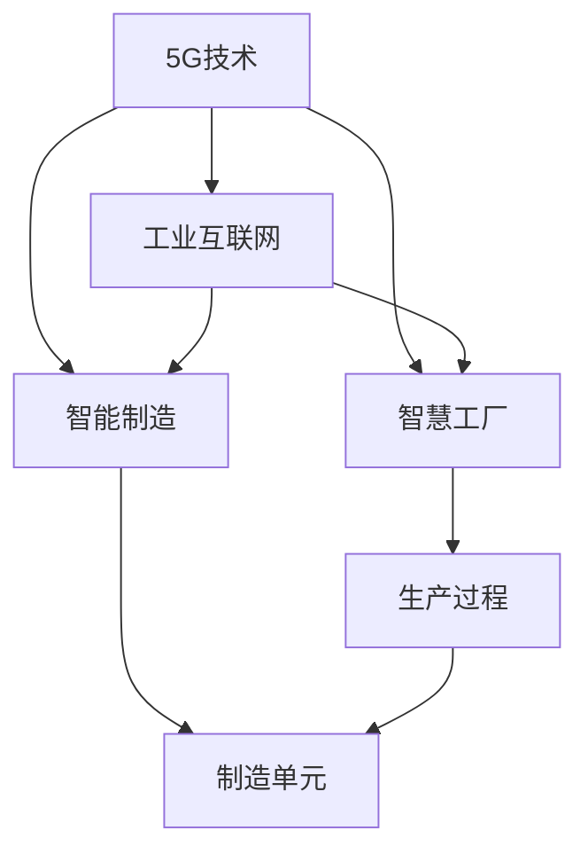

                 

# 5G技术在工业4.0中的应用与挑战

## 1. 背景介绍

### 1.1 问题由来
随着工业4.0的深入推进，制造业正处于由传统大规模批量生产向高度灵活、定制化生产的转变。传统的工业生产模式已难以适应新形势下产品研发周期缩短、市场变化快速、个性化需求增加等需求。为了满足这些需求，工业4.0需要实现全生命周期智能化，使得生产过程更加高效、精确、敏捷，并且具备高度的灵活性和可重构性。

在这一背景下，5G技术的出现为工业4.0提供了新型的通信基础设施，它具有更高的带宽、更低的延迟、更大的连接密度，能够支撑海量设备之间的实时通信，以及高可靠性和安全性。5G的这些特性为工业互联网、智慧工厂、智能制造等场景提供了新的可能，使得数据驱动、实时响应、深度融合等成为可能。

### 1.2 问题核心关键点
5G技术在工业4.0中的核心应用主要集中在以下几个方面：
- **工业互联网**：通过5G实现高带宽、低延迟的网络连接，支持工业设备之间的数据实时传输，构建实时数据采集与分析体系，实现生产过程的数字化、智能化。
- **智慧工厂**：利用5G的高可靠性、广覆盖，构建车间级无线感知与控制系统，实现对生产线的精确控制和优化。
- **智能制造**：在生产线的各个环节中，利用5G的高吞吐量和低延迟，支持工业机器人、智能设备等高度自主化的制造单元协同工作。
- **智能运维**：通过5G网络实现对设备状态的实时监测和预测性维护，提升设备利用率和运行效率。

5G在工业4.0中的应用不仅仅是为了实现数据采集和传输，更重要的是为了促进数据和业务流程的深度融合，构建高度集成、高度自治的工业生态系统。

### 1.3 问题研究意义
研究5G技术在工业4.0中的应用，对于推动制造业转型升级，提升生产效率和经济效益，具有重要意义：

1. **提升生产效率**：通过5G实现数据实时传输和处理，使工业设备之间的通信更加灵活和高效，可以大大缩短生产周期，提升生产效率。
2. **降低运营成本**：5G的广覆盖和高可靠性使得设备联网更加方便，降低了维护成本，提高了设备的运行效率和可靠性。
3. **促进产品创新**：5G技术支撑的工业互联网和智慧工厂，为个性化定制和柔性制造提供了可能，促进了产品创新和市场响应速度的提升。
4. **推动产业协同**：5G为不同设备和系统之间的通信提供基础，促进了跨行业、跨企业的协同创新。
5. **安全性和可靠性**：5G的高可靠性和低延迟特性，保证了工业生产环境的稳定和安全，提高了生产系统的鲁棒性。

## 2. 核心概念与联系

### 2.1 核心概念概述

为更好地理解5G技术在工业4.0中的应用，本节将介绍几个密切相关的核心概念：

- **5G技术**：第五代移动通信技术，提供更高的带宽、更低的延迟、更大的连接密度，是工业4.0数字化转型的关键支撑。
- **工业4.0**：基于互联网、物联网、云计算、大数据、人工智能等新一代信息技术，通过人、机、物的深度融合，实现高度灵活、定制化、智能化、高效化的生产模式。
- **智慧工厂**：通过信息技术和物联网技术，实现对生产过程的智能化管理和优化，提升生产效率和产品质量。
- **智能制造**：利用先进的智能设备和技术手段，实现生产过程的自动化和智能化，提高生产效率和灵活性。
- **工业互联网**：将工业设备和系统通过5G网络进行互联互通，实现数据驱动的智能化生产和管理。

这些核心概念之间的逻辑关系可以通过以下Mermaid流程图来展示：



这个流程图展示了这个逻辑关系：5G技术为工业互联网提供了基础，智慧工厂和智能制造通过工业互联网实现智能化生产，从而支撑工业4.0的建设。

## 3. 核心算法原理 & 具体操作步骤
### 3.1 算法原理概述

5G技术在工业4.0中的应用涉及到了多个领域，包括设备互联、数据采集与分析、生产过程优化等。从算法角度来看，5G的应用主要涉及以下几个核心技术：

- **物联网技术**：通过5G网络实现设备之间的互联，构建工业物联网体系。
- **工业大数据分析**：利用5G网络实现海量数据的实时传输和处理，提供生产过程中的数据支持。
- **边缘计算**：在5G网络的边缘节点上部署计算资源，实现数据就地分析和处理，减少数据传输的延迟和带宽消耗。
- **人工智能与机器学习**：通过5G网络实现模型的实时训练和优化，提高生产效率和产品质量。

### 3.2 算法步骤详解

5G技术在工业4.0中的应用步骤如下：

1. **设备联网与数据采集**：
   - 将工业设备通过5G网络进行联网，实现数据实时采集。
   - 利用5G的广覆盖和高可靠性，保证数据采集的稳定性和可靠性。
   - 数据采集后，进行预处理和存储，为后续分析提供基础。

2. **数据传输与边缘计算**：
   - 利用5G的高带宽和低延迟特性，实现数据的实时传输。
   - 在5G网络边缘节点上部署计算资源，实现数据的实时处理和分析。
   - 通过边缘计算，减小数据传输的延迟和带宽消耗，提升处理效率。

3. **数据分析与决策优化**：
   - 利用工业大数据分析技术，对采集的数据进行深度分析，提取有价值的信息。
   - 应用机器学习与人工智能技术，构建预测模型，优化生产过程。
   - 将分析结果反馈到生产系统中，进行实时决策和优化。

### 3.3 算法优缺点

5G技术在工业4.0中的应用具有以下优点：
- **高效性**：5G网络的高带宽和低延迟特性，支持海量数据的实时传输和处理，提高了生产效率和响应速度。
- **可靠性**：5G网络的高可靠性和广覆盖，保证了数据传输的稳定性和安全性。
- **灵活性**：5G网络支持多种通信协议和设备类型，易于集成到现有的工业系统中。
- **可扩展性**：5G网络能够支持大规模设备的互联和通信，具有较强的扩展能力。

同时，5G技术在工业4.0的应用也存在一些局限性：
- **成本高**：5G网络的建设、维护和设备购置成本较高，短期内难以大规模推广。
- **技术复杂**：5G网络的应用需要跨学科的集成，技术复杂度较高，对企业技术能力要求高。
- **安全性**：5G网络的高带宽和低延迟特性，增加了网络攻击的风险。
- **标准化问题**：不同设备和系统之间的互操作性和标准化问题尚未完全解决。

### 3.4 算法应用领域

5G技术在工业4.0中的应用非常广泛，主要集中在以下几个领域：

- **智慧工厂**：利用5G网络实现工厂内的设备互联和数据实时传输，构建智能化的生产环境。
- **智能制造**：通过5G网络实现生产线的实时监控和优化，支持设备的高度自治和协同工作。
- **工业互联网**：构建工业互联网平台，实现设备与云端的实时通信和数据共享。
- **智能运维**：通过5G网络实现对设备的实时监测和预测性维护，提升设备利用率和运行效率。
- **个性化定制**：利用5G网络实现对个性化需求的快速响应，提供定制化产品和服务。
- **物流自动化**：通过5G网络实现物流设备的自动化和智能化，提升物流效率和准确性。

这些应用领域展示了5G技术在工业4.0中的广泛应用前景，进一步推动了制造业的数字化转型。

## 4. 数学模型和公式 & 详细讲解 & 举例说明

### 4.1 数学模型构建

为更好地理解5G在工业4.0中的应用，本节将使用数学语言对相关算法进行更加严格的刻画。

假设工业生产系统由 $N$ 个设备组成，设备编号为 $i \in [1, N]$。设备的实时状态数据为 $x_i$，设备之间的通信协议为 $p_{ij}$，工业物联网平台的边缘计算节点为 $e_k$，网络带宽为 $b_k$，边缘计算节点的计算能力为 $c_k$。设备与边缘计算节点之间的通信延迟为 $d_{ik}$。

定义设备 $i$ 的实时状态监测函数为 $f_i(x_i)$，计算设备 $i$ 与 $e_k$ 之间的通信延迟函数为 $g_{ik}(d_{ik})$，定义边缘计算节点 $e_k$ 的计算延迟函数为 $h_k(c_k)$。

### 4.2 公式推导过程

根据以上定义，可以建立以下数学模型：

**数据采集模型**：
$$
x_i = f_i(x_i)
$$

**通信延迟模型**：
$$
d_{ik} = g_{ik}(d_{ik})
$$

**计算延迟模型**：
$$
\Delta_{ik} = h_k(c_k)
$$

**数据传输模型**：
$$
t_{ik} = \frac{b_k}{p_{ik} \cdot x_i}
$$

将上述模型综合考虑，可以构建5G网络支持的工业生产系统的数据传输和处理模型：

$$
\begin{aligned}
\min_{x_i, d_{ik}, c_k} & \sum_{i=1}^N \sum_{k=1}^K (\frac{d_{ik}}{b_k} + \frac{c_k \cdot f_i(x_i)}{b_k}) + \sum_{k=1}^K h_k(c_k) \\
\text{s.t.} & \sum_{k=1}^K \frac{d_{ik}}{b_k} + \Delta_{ik} = T_i \\
& d_{ik} \geq 0 \\
& c_k \geq 0
\end{aligned}
$$

其中 $T_i$ 表示设备 $i$ 的通信和计算延迟总和。

通过求解上述模型，可以实现对工业生产系统的优化和调度。

### 4.3 案例分析与讲解

以一个简单的智慧工厂生产系统为例，分析5G技术的应用：

假设一个工厂有3个生产车间，每个车间有10个生产设备，设备实时状态数据通过5G网络实时传输到边缘计算节点，边缘计算节点对数据进行处理并返回结果，处理时间与计算能力成正比。工厂希望在20秒内完成所有设备的通信和处理。

构建如下模型：
- 生产设备编号为 $i \in [1, 30]$，实时状态数据为 $x_i$。
- 5G网络带宽为 $b_k$，计算能力为 $c_k$。
- 设备与边缘计算节点之间的通信延迟为 $d_{ik}$，计算延迟为 $\Delta_{ik}$。
- 每个车间的生产设备共享同一5G网络，通信延迟和计算延迟总和为 $T_i$。

模型求解后，可以得到最优的设备和边缘计算节点的配置方案，使得系统满足20秒内完成所有设备通信和处理的约束。

## 5. 项目实践：代码实例和详细解释说明
### 5.1 开发环境搭建

在进行5G技术应用实践前，我们需要准备好开发环境。以下是使用Python进行PyTorch开发的环境配置流程：

1. 安装Anaconda：从官网下载并安装Anaconda，用于创建独立的Python环境。

2. 创建并激活虚拟环境：
```bash
conda create -n pytorch-env python=3.8 
conda activate pytorch-env
```

3. 安装PyTorch：根据CUDA版本，从官网获取对应的安装命令。例如：
```bash
conda install pytorch torchvision torchaudio cudatoolkit=11.1 -c pytorch -c conda-forge
```

4. 安装各类工具包：
```bash
pip install numpy pandas scikit-learn matplotlib tqdm jupyter notebook ipython
```

完成上述步骤后，即可在`pytorch-env`环境中开始5G技术应用的开发实践。

### 5.2 源代码详细实现

我们以智慧工厂的智能制造为例，给出使用PyTorch实现的代码实现。

首先，定义智慧工厂的生产设备类：

```python
class ProductionDevice:
    def __init__(self, id, state_function, communication_delay, calculation_delay):
        self.id = id
        self.state_function = state_function
        self.communication_delay = communication_delay
        self.calculation_delay = calculation_delay

    def get_state(self, state_data):
        return self.state_function(state_data)

    def compute_delay(self, communication_delay, calculation_delay):
        return communication_delay + calculation_delay
```

然后，定义生产车间的边缘计算节点类：

```python
class EdgeNode:
    def __init__(self, id, bandwidth, calculation_capacity):
        self.id = id
        self.bandwidth = bandwidth
        self.calculation_capacity = calculation_capacity

    def compute_delay(self, calculation_capacity):
        return calculation_capacity
```

接着，定义智慧工厂的生产系统类：

```python
class FactorySystem:
    def __init__(self, devices, edge_nodes, communication_delay, calculation_delay, total_delay):
        self.devices = devices
        self.edge_nodes = edge_nodes
        self.communication_delay = communication_delay
        self.calculation_delay = calculation_delay
        self.total_delay = total_delay

    def compute_total_delay(self):
        total_delay = 0
        for device in self.devices:
            total_delay += device.compute_delay(self.communication_delay, self.calculation_delay)
        return total_delay
```

最后，定义生产系统的求解函数：

```python
from scipy.optimize import minimize

def optimize_system(devices, edge_nodes, communication_delay, calculation_delay, total_delay):
    def objective(x):
        return sum([sum([device.compute_delay(x[k], calculation_delay) for device in devices]) + x[k] for k in range(len(devices))]) + sum([node.compute_delay(calculation_delay) for node in edge_nodes])

    def constraint(x):
        return [sum([device.compute_delay(x[k], communication_delay) for device in devices]) + x[k] - total_delay for k in range(len(devices))]

    x0 = [0] * len(devices)
    result = minimize(objective, x0, constraints=constraint, bounds=(0, 1))
    return result.x
```

在上述代码中，通过定义设备类、边缘节点类和系统类，构建了一个简单的智慧工厂生产系统模型。使用SciPy库中的优化函数minimize，求解系统在20秒内完成所有设备通信和处理的配置方案。

### 5.3 代码解读与分析

让我们再详细解读一下关键代码的实现细节：

**ProductionDevice类**：
- `__init__`方法：初始化设备编号、状态函数、通信延迟、计算延迟。
- `get_state`方法：获取设备实时状态。
- `compute_delay`方法：计算设备通信和计算延迟总和。

**EdgeNode类**：
- `__init__`方法：初始化边缘节点编号、带宽、计算能力。
- `compute_delay`方法：计算边缘节点计算延迟。

**FactorySystem类**：
- `__init__`方法：初始化设备列表、边缘节点列表、通信延迟、计算延迟、总延迟。
- `compute_total_delay`方法：计算系统总延迟。

**optimize_system函数**：
- 使用SciPy库的优化函数minimize，构建目标函数和约束条件。
- 目标函数计算设备通信和计算延迟总和，以及边缘节点计算延迟总和。
- 约束条件限制系统总延迟不超过20秒。
- 初始化求解变量，调用minimize求解最优配置方案。

## 6. 实际应用场景
### 6.1 智能制造

5G技术在智能制造中的应用非常广泛，主要体现在以下几个方面：

- **设备联网**：通过5G网络实现生产设备之间的互联，构建工业物联网体系。
- **数据采集**：利用5G网络实现实时数据的采集和传输，为生产过程的优化提供数据支持。
- **远程监控**：通过5G网络实现对生产设备的远程监控和控制，提高生产过程的透明性和可控性。
- **智能调度**：通过5G网络实现对生产设备的智能调度，提高生产效率和灵活性。
- **预测性维护**：利用5G网络实现对设备状态的实时监测和预测性维护，提高设备利用率和运行效率。

例如，在一个智能制造工厂中，通过5G网络将各个生产设备和边缘计算节点连接起来，实时采集设备状态数据，利用大数据分析技术对数据进行处理和分析，提取有价值的信息。通过机器学习算法构建预测模型，对生产设备进行优化和调度，实现生产过程的智能化和自动化。

### 6.2 智能物流

5G技术在智能物流中的应用主要体现在以下几个方面：

- **物流设备的互联**：通过5G网络实现物流设备的互联，构建智能物流系统。
- **实时监控**：利用5G网络实现对物流设备的实时监控和控制，提高物流过程的透明性和可控性。
- **路径优化**：通过5G网络实现对物流路径的实时优化，提高物流效率和准确性。
- **自动驾驶**：利用5G网络实现自动驾驶技术，提高物流作业的自动化水平。

例如，在一个智能物流中心，通过5G网络将各个物流设备和边缘计算节点连接起来，实时采集设备状态数据，利用大数据分析技术对数据进行处理和分析，提取有价值的信息。通过机器学习算法构建路径优化模型，对物流路径进行优化，提高物流效率和准确性。

### 6.3 智慧工厂

5G技术在智慧工厂中的应用主要体现在以下几个方面：

- **设备互联**：通过5G网络实现生产设备之间的互联，构建工业物联网体系。
- **数据采集**：利用5G网络实现实时数据的采集和传输，为生产过程的优化提供数据支持。
- **智能制造**：通过5G网络实现生产线的实时监控和优化，支持设备的高度自治和协同工作。
- **工业互联网**：构建工业互联网平台，实现设备与云端的实时通信和数据共享。
- **智能运维**：通过5G网络实现对设备的实时监测和预测性维护，提高设备利用率和运行效率。

例如，在一个智慧工厂中，通过5G网络将各个生产设备和边缘计算节点连接起来，实时采集设备状态数据，利用大数据分析技术对数据进行处理和分析，提取有价值的信息。通过机器学习算法构建预测模型，对生产设备进行优化和调度，实现生产过程的智能化和自动化。

## 7. 工具和资源推荐
### 7.1 学习资源推荐

为了帮助开发者系统掌握5G技术的应用原理和实践技巧，这里推荐一些优质的学习资源：

1. **5G基础与实践**：《5G基础与实践》系列博文，由5G专家撰写，深入浅出地介绍了5G的基础知识、关键技术和应用场景。

2. **工业4.0与物联网**：斯坦福大学开设的《工业4.0与物联网》课程，涵盖5G、工业互联网、智慧工厂等工业4.0关键技术，有Lecture视频和配套作业。

3. **5G网络与边缘计算**：《5G网络与边缘计算》书籍，详细介绍了5G网络和边缘计算的基本原理、技术架构和应用案例。

4. **工业互联网平台**：《工业互联网平台》系列文章，介绍了工业互联网平台的构建和应用，包括5G、物联网、云计算等关键技术。

5. **智慧工厂建设**：《智慧工厂建设》系列书籍，介绍了智慧工厂的建设思路、技术架构和最佳实践。

通过对这些资源的学习实践，相信你一定能够快速掌握5G技术的应用精髓，并用于解决实际的工业4.0问题。

### 7.2 开发工具推荐

高效的开发离不开优秀的工具支持。以下是几款用于5G技术应用开发的常用工具：

1. **PyTorch**：基于Python的开源深度学习框架，灵活动态的计算图，适合快速迭代研究。
2. **TensorFlow**：由Google主导开发的开源深度学习框架，生产部署方便，适合大规模工程应用。
3. **Simulink**：MATLAB的Simulink工具箱，支持对5G网络进行建模和仿真，适合研究5G网络的应用场景。
4. **OMNeT++**：基于C++的模拟工具，支持对5G网络进行建模和仿真，适合研究5G网络的性能优化。
5. **NS-3**：基于C++的网络仿真工具，支持对5G网络进行建模和仿真，适合研究5G网络的应用场景。

合理利用这些工具，可以显著提升5G技术应用开发的效率，加快创新迭代的步伐。

### 7.3 相关论文推荐

5G技术在工业4.0中的应用源于学界的持续研究。以下是几篇奠基性的相关论文，推荐阅读：

1. **5G：下一代移动通信网络**：5G技术的原理和关键特性，奠定了5G技术的基础。

2. **物联网与工业4.0**：5G在物联网中的应用，介绍了工业物联网体系和关键技术。

3. **智慧工厂与智能制造**：智慧工厂和智能制造的概念、技术架构和应用案例，展示了5G技术在智慧工厂中的应用。

4. **工业互联网平台**：工业互联网平台的构建和应用，介绍了5G网络在工业互联网中的作用。

5. **智能运维与预测性维护**：通过5G网络实现对设备的实时监测和预测性维护，提高设备利用率和运行效率。

这些论文代表了大语言模型微调技术的发展脉络。通过学习这些前沿成果，可以帮助研究者把握学科前进方向，激发更多的创新灵感。

## 8. 总结：未来发展趋势与挑战

### 8.1 总结

本文对5G技术在工业4.0中的应用进行了全面系统的介绍。首先阐述了5G技术在工业4.0中的核心应用场景，明确了其在智慧工厂、智能制造、智能物流等领域的重要性。其次，从原理到实践，详细讲解了5G技术的数学模型和关键算法，给出了5G技术应用的代码实例。同时，本文还广泛探讨了5G技术在工业4.0中的实际应用场景，展示了其广阔的应用前景。

通过本文的系统梳理，可以看到，5G技术在工业4.0中的应用不仅能够提升生产效率和经济效益，还能够推动制造业的数字化转型，提升企业竞争力。未来，随着5G技术的进一步成熟，其将为工业4.0的发展提供更强大的技术支撑，为构建高度集成、高度自治的工业生态系统提供更多可能性。

### 8.2 未来发展趋势

展望未来，5G技术在工业4.0中的应用将呈现以下几个发展趋势：

1. **全连接工厂**：5G技术将实现生产设备和边缘计算节点的全连接，支持海量设备的互联和通信，实现全面数字化生产。
2. **实时数据处理**：5G技术将支持实时数据的采集和处理，为生产过程的优化提供数据支持。
3. **工业互联网的普及**：5G技术将推动工业互联网的普及，实现设备与云端的实时通信和数据共享，构建智能化的工业生态系统。
4. **智能制造的深化**：5G技术将支持智能制造的深化，实现生产过程的智能化和自动化，提高生产效率和灵活性。
5. **预测性维护的普及**：5G技术将推动预测性维护的普及，实现对设备的实时监测和预测性维护，提高设备利用率和运行效率。
6. **个性化定制的发展**：5G技术将支持个性化定制的发展，实现对个性化需求的快速响应，提供定制化产品和服务。

这些趋势展示了5G技术在工业4.0中的广阔应用前景，进一步推动了制造业的数字化转型。

### 8.3 面临的挑战

尽管5G技术在工业4.0中的应用已经取得了显著成效，但在迈向更加智能化、普适化应用的过程中，仍面临诸多挑战：

1. **高成本**：5G网络的建设、维护和设备购置成本较高，短期内难以大规模推广。
2. **技术复杂**：5G网络的应用需要跨学科的集成，技术复杂度较高，对企业技术能力要求高。
3. **安全性和可靠性**：5G网络的高带宽和低延迟特性，增加了网络攻击的风险。
4. **标准化问题**：不同设备和系统之间的互操作性和标准化问题尚未完全解决。

### 8.4 研究展望

面对5G技术在工业4.0中面临的挑战，未来的研究需要在以下几个方面寻求新的突破：

1. **成本优化**：探索降低5G网络建设、维护和设备购置成本的方案，推动5G技术的普及。
2. **技术简化**：开发更加易于集成和部署的5G解决方案，降低技术门槛，促进企业应用。
3. **安全增强**：研究5G网络的安全性增强技术，提高网络的安全性和可靠性。
4. **标准化推进**：推动5G技术的标准化，促进不同设备和系统之间的互操作性。
5. **新场景应用**：探索5G技术在更多应用场景中的应用，如智慧城市、智慧医疗等，拓展5G技术的应用范围。

这些研究方向的探索，必将引领5G技术在工业4.0中的进一步发展，为构建更加智能化、普适化的工业生态系统提供更多可能性。

## 9. 附录：常见问题与解答

**Q1：5G技术在工业4.0中的应用是否面临数据传输速度和带宽的限制？**

A: 5G技术在工业4.0中的应用需要高带宽和低延迟，这对数据传输速度和带宽提出了较高要求。但在实际应用中，需要根据具体场景和需求，进行合理的配置和优化，以实现最优的传输效果。同时，5G网络的多接入边缘计算(MEC)技术可以实现在边缘节点上的数据处理和分析，进一步降低传输带宽的要求。

**Q2：5G技术在工业4.0中的应用是否需要大量设备支持？**

A: 5G网络可以支持大量设备的互联和通信，但设备和边缘计算节点的配置需要根据具体需求进行优化。在实际应用中，需要考虑设备的实际负载情况和网络带宽，避免设备间的干扰和网络拥堵。

**Q3：5G技术在工业4.0中的应用是否需要高昂的维护成本？**

A: 5G网络的建设、维护和设备购置成本较高，但通过合理配置和使用，可以降低维护成本。同时，5G技术的应用可以提高生产效率和设备利用率，降低运营成本，具有显著的经济效益。

**Q4：5G技术在工业4.0中的应用是否存在网络安全风险？**

A: 5G网络的高带宽和低延迟特性，增加了网络攻击的风险，需要采取相应的安全措施，如网络隔离、加密传输、访问控制等，保障网络的安全性和可靠性。

**Q5：5G技术在工业4.0中的应用是否存在标准化问题？**

A: 5G技术在工业4.0中的应用需要跨设备和系统的互操作性，标准化问题需要进一步解决。可以通过推动行业标准和协议的制定和实施，促进设备和系统的互操作性和兼容性。

---

作者：禅与计算机程序设计艺术 / Zen and the Art of Computer Programming

