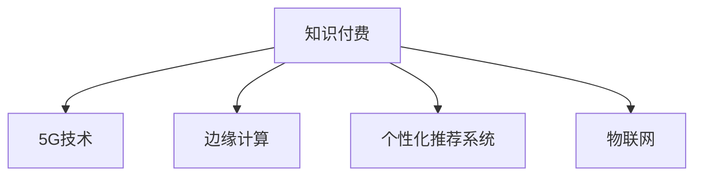

                 

# 5G时代知识付费将迎来哪些新的变革

## 1. 背景介绍

随着5G技术的全面商用，互联网进入了一个新的发展阶段。5G不仅带来了更快的数据传输速度、更高的网络可靠性，还促进了智能终端设备的普及和应用场景的多样化。在此背景下，知识付费作为一种新型的内容消费方式，正在迎来新的发展机遇。从内容形式、技术架构、商业模式到用户行为，知识付费的各个方面都在经历着深刻的变革。

### 1.1 5G技术的影响

5G技术将对知识付费产生深远影响，具体体现在以下几个方面：

1. **增强的内容传输和存储能力**：5G技术大幅提升的数据传输速度和降低的延迟，使得高质量视频、音频等内容可以更加便捷地在线传输和存储。这对于知识付费平台来说，意味着可以提供更高质量、更加丰富的内容形式，如互动视频、虚拟现实(VR)体验等。
2. **促进个性化内容的创作与推荐**：5G技术的高带宽和低延迟特性，使得内容分发和推荐的实时性显著提升。通过智能算法和大数据分析，知识付费平台能够更加精准地推荐个性化内容，提升用户体验和满意度。
3. **推动边缘计算的发展**：5G技术支持边缘计算，使得数据处理和分析可以在靠近用户终端的位置进行。这对知识付费平台来说，意味着可以减少网络传输的延迟和带宽占用，提高内容的交付效率和服务质量。
4. **支持大规模的物联网应用**：5G技术的高连接密度和低功耗特性，使得各种物联网设备能够高效地接入互联网。这对于知识付费平台来说，意味着可以开发出更多基于物联网的场景应用，如智能穿戴设备上的知识学习功能等。

### 1.2 知识付费的发展现状

知识付费作为互联网经济的一个重要组成部分，近年来取得了快速发展。根据市场调研机构的报告，全球知识付费市场规模正在迅速扩大，预计未来几年将持续增长。特别是在中国，知识付费行业呈现出爆炸式增长的态势，各大知识付费平台如雨后春笋般涌现。

## 2. 核心概念与联系

### 2.1 核心概念概述

为更好地理解5G时代知识付费的变革，本节将介绍几个关键概念：

- **知识付费**：指用户为获取特定知识或技能，通过付费形式购买或订阅专业内容的服务模式。知识付费主要包括在线课程、电子书、音频讲座、视频教程等多种形式。
- **5G技术**：指第五代移动通信技术，具有高带宽、低延迟、高连接密度等特点，能够提供更快的数据传输速度和更稳定的网络连接。
- **边缘计算**：指将计算资源和数据存储从中心化的服务器迁移到用户终端附近，以减少网络传输延迟，提高数据处理效率。
- **个性化推荐系统**：指通过分析用户行为和偏好，动态调整推荐内容的算法系统。个性化推荐系统能够大幅提升用户满意度和平台转化率。
- **物联网**：指通过各种传感器、通信技术和智能设备，将物理世界与互联网连接起来，实现物与物的智能交互。

这些概念之间的关系可以通过以下Mermaid流程图来展示：



这个流程图展示了知识付费与5G技术、边缘计算、个性化推荐系统和物联网之间的紧密联系。5G技术为知识付费提供了更高效的数据传输和更稳定的网络连接，边缘计算和物联网技术则进一步提升了内容交付的实时性和互动性，个性化推荐系统则通过智能算法和大数据分析，优化了内容推荐的效果。

## 3. 核心算法原理 & 具体操作步骤

### 3.1 算法原理概述

在5G时代，知识付费的变革主要体现在内容形式、技术架构、商业模式和用户体验的全面升级。以下是核心的算法原理和具体操作步骤：

### 3.2 算法步骤详解

#### 3.2.1 内容形式的多样化

5G技术的高带宽和低延迟特性，使得知识付费平台可以引入更多的互动性和沉浸式内容形式。例如：

1. **互动视频**：通过在视频中嵌入问题、互动元素，增加用户参与度。
2. **虚拟现实(VR)和增强现实(AR)**：通过VR和AR技术，为用户提供沉浸式的学习体验。
3. **实时问答和直播**：利用5G网络低延迟的特性，实现实时问答和直播互动，增强用户互动性。
4. **语音和图像识别**：通过语音和图像识别技术，提高内容的多样性和易用性。

#### 3.2.2 技术架构的升级

为了支撑上述内容形式的创新，知识付费平台需要进行技术架构的全面升级，主要包括以下几个方面：

1. **边缘计算与云服务的结合**：将部分计算任务从中心化的数据中心迁移到边缘设备，减少网络延迟，提高内容交付效率。同时，利用云服务提供的强大计算能力和数据存储能力，支持大规模用户并发和海量数据处理。
2. **实时数据处理和分析**：利用流式计算和大数据技术，实时处理和分析用户行为数据，动态调整内容和推荐策略。
3. **分布式存储与负载均衡**：采用分布式存储和负载均衡技术，确保系统的高可用性和扩展性。
4. **安全与隐私保护**：通过加密和匿名化处理，保护用户数据隐私和安全。

#### 3.2.3 商业模式的创新

知识付费平台的商业模式也在5G时代面临新的机遇和挑战。以下是一些创新的商业模式：

1. **订阅制与按需制结合**：用户可以选择订阅付费会员，获取更多优质内容，也可以选择按需购买特定内容。
2. **动态定价策略**：根据市场供需和内容价值，动态调整价格，提高平台收益。
3. **社区和社交功能**：构建用户社区和社交网络，增强用户粘性和互动性。
4. **广告与内容合作**：与品牌商合作，通过内容植入和广告投放获取收益。

#### 3.2.4 用户体验的优化

用户体验是知识付费平台的核心竞争力，5G时代需要通过以下方式进一步优化：

1. **个性化推荐**：利用智能算法和大数据分析，动态调整推荐内容，提升用户体验。
2. **多终端支持**：支持各种终端设备，如智能手机、平板电脑、智能穿戴设备等，提供一致的用户体验。
3. **无障碍设计**：通过无障碍设计和便捷的用户界面，提升特殊用户的需求体验。
4. **反馈和改进机制**：建立用户反馈和改进机制，不断优化平台功能和用户体验。

### 3.3 算法优缺点

#### 3.3.1 优点

1. **内容形式更加丰富**：5G技术的高带宽和低延迟特性，使得知识付费平台可以引入更多互动性和沉浸式的内容形式，提升用户体验。
2. **技术架构更加高效**：边缘计算和云服务的结合，实时数据处理和分析，分布式存储与负载均衡等技术，提升了平台的技术架构效率和可扩展性。
3. **商业模式更加多样化**：订阅制与按需制结合，动态定价策略，社区和社交功能，广告与内容合作等新模式，为知识付费平台带来了更多的收益渠道。
4. **用户体验更加优化**：个性化推荐，多终端支持，无障碍设计和用户反馈机制，提升了用户满意度和平台转化率。

#### 3.3.2 缺点

1. **技术投入高**：引入新的技术架构和内容形式，需要大量的技术研发投入。
2. **数据隐私和安全风险**：海量用户数据的处理和存储，增加了数据隐私和安全风险。
3. **商业模式不确定性**：新的商业模式需要市场验证，存在不确定性。
4. **用户接受度问题**：部分用户可能对新的内容形式和技术架构不适应，接受度较低。

### 3.4 算法应用领域

在5G时代，知识付费的应用领域将进一步拓展，主要体现在以下几个方面：

1. **在线教育**：5G技术的高带宽和低延迟特性，使得在线教育平台可以提供更高质量的视频、音频和互动内容，提升教学效果和学习体验。
2. **企业培训**：企业可以通过知识付费平台，为员工提供定制化的培训课程，提升员工技能和企业的竞争力。
3. **个人发展和职业培训**：个人可以通过知识付费平台，获取各类技能和知识，促进自身发展和职业成长。
4. **健康和健身**：健康和健身领域可以通过知识付费平台，提供各种健身课程和健康管理内容，提升用户健康水平。
5. **文化和艺术**：文化和艺术领域可以通过知识付费平台，提供各类艺术欣赏、创作和教育内容，丰富用户文化生活。

## 4. 数学模型和公式 & 详细讲解 & 举例说明

### 4.1 数学模型构建

在5G时代，知识付费平台的推荐系统需要处理海量的用户行为数据和内容数据，构建高效的推荐模型。以下是数学模型构建的基本框架：

1. **用户行为数据**：包括用户在平台上的浏览、观看、购买等行为数据。
2. **内容特征数据**：包括课程、文章、视频等内容的标签、摘要、时长等特征数据。
3. **推荐模型**：基于协同过滤、矩阵分解、深度学习等算法，构建推荐模型，预测用户对内容的评分。
4. **优化目标**：最小化推荐误差，最大化用户满意度和平台收益。

### 4.2 公式推导过程

#### 4.2.1 协同过滤算法

协同过滤算法是基于用户行为数据和物品特征数据构建推荐模型的经典方法。假设用户集合为 $U$，物品集合为 $I$，用户对物品的评分矩阵为 $R \in \mathbb{R}^{N \times M}$，其中 $N$ 为用户数，$M$ 为物品数。协同过滤算法的目标是找到用户 $u$ 对物品 $i$ 的评分 $r_{ui}$，其数学公式如下：

$$
r_{ui} = \alpha \sum_{i \in I} p_{ui} \cdot q_{iu} + (1-\alpha) \sum_{j \in U} \frac{r_{uj}}{\sqrt{c_u+c_j}+\epsilon} \cdot \frac{r_{ji}}{\sqrt{c_i+c_j}+\epsilon}
$$

其中 $p_{ui}$ 和 $q_{iu}$ 为物品和用户的特征向量，$\alpha$ 为平衡参数，$c_u$ 和 $c_i$ 为物品和用户的数量，$\epsilon$ 为正则化参数。

#### 4.2.2 矩阵分解算法

矩阵分解算法是将用户行为数据和物品特征数据表示为低秩矩阵分解形式，从而降低模型复杂度，提高推荐精度。假设用户行为矩阵 $R \in \mathbb{R}^{N \times M}$，矩阵分解的目标是找到两个低秩矩阵 $P \in \mathbb{R}^{N \times K}$ 和 $Q \in \mathbb{R}^{M \times K}$，使得 $R \approx PQ$，其中 $K$ 为矩阵分解的维度。矩阵分解的数学公式如下：

$$
\min_{P,Q} \|R-PQ\|_F^2
$$

其中 $\| \cdot \|_F$ 为矩阵的Frobenius范数。

#### 4.2.3 深度学习推荐模型

深度学习推荐模型通过构建多层神经网络，学习用户行为数据和物品特征数据的内在关系，从而提升推荐精度。假设用户行为矩阵 $R \in \mathbb{R}^{N \times M}$，推荐模型 $M$ 的输入为 $x_{ui} \in \mathbb{R}^D$，其中 $x_{ui}$ 为用户 $u$ 对物品 $i$ 的特征表示，输出为物品 $i$ 的评分 $\hat{r}_{ui} \in \mathbb{R}$。推荐模型的数学公式如下：

$$
\hat{r}_{ui} = f(M(x_{ui}))
$$

其中 $f$ 为推荐模型的输出函数。

### 4.3 案例分析与讲解

#### 4.3.1 案例一：在线教育推荐系统

假设某在线教育平台用户集合为 $U$，课程集合为 $I$，用户对课程的评分矩阵为 $R \in \mathbb{R}^{N \times M}$，其中 $N$ 为学生数，$M$ 为课程数。平台利用协同过滤算法构建推荐模型，用户 $u$ 对课程 $i$ 的评分 $r_{ui}$ 的计算公式如下：

$$
r_{ui} = \alpha \sum_{i \in I} p_{ui} \cdot q_{iu} + (1-\alpha) \sum_{j \in U} \frac{r_{uj}}{\sqrt{c_u+c_j}+\epsilon} \cdot \frac{r_{ji}}{\sqrt{c_i+c_j}+\epsilon}
$$

其中 $p_{ui}$ 和 $q_{iu}$ 为课程的特征向量，$\alpha$ 为平衡参数，$c_u$ 和 $c_i$ 为课程数和学生数，$\epsilon$ 为正则化参数。

#### 4.3.2 案例二：企业培训推荐系统

假设某企业培训平台用户集合为 $U$，培训课程集合为 $I$，用户对课程的评分矩阵为 $R \in \mathbb{R}^{N \times M}$，其中 $N$ 为企业员工数，$M$ 为培训课程数。平台利用矩阵分解算法构建推荐模型，用户 $u$ 对课程 $i$ 的评分 $r_{ui}$ 的计算公式如下：

$$
\min_{P,Q} \|R-PQ\|_F^2
$$

其中 $P \in \mathbb{R}^{N \times K}$ 和 $Q \in \mathbb{R}^{M \times K}$ 为用户行为矩阵 $R$ 的矩阵分解形式，$K$ 为矩阵分解的维度。

#### 4.3.3 案例三：健康和健身推荐系统

假设某健康和健身平台用户集合为 $U$，健身课程集合为 $I$，用户对课程的评分矩阵为 $R \in \mathbb{R}^{N \times M}$，其中 $N$ 为用户数，$M$ 为健身课程数。平台利用深度学习推荐模型构建推荐模型，用户 $u$ 对课程 $i$ 的评分 $\hat{r}_{ui}$ 的计算公式如下：

$$
\hat{r}_{ui} = f(M(x_{ui}))
$$

其中 $x_{ui}$ 为用户 $u$ 对课程 $i$ 的特征表示，$M$ 为推荐模型的参数。

## 5. 项目实践：代码实例和详细解释说明

### 5.1 开发环境搭建

在进行知识付费平台的推荐系统开发前，需要准备好开发环境。以下是使用Python进行TensorFlow和Keras开发的开发环境配置流程：

1. 安装Anaconda：从官网下载并安装Anaconda，用于创建独立的Python环境。

2. 创建并激活虚拟环境：
```bash
conda create -n tf-env python=3.8 
conda activate tf-env
```

3. 安装TensorFlow和Keras：
```bash
pip install tensorflow==2.4.1 
pip install keras
```

4. 安装各类工具包：
```bash
pip install numpy pandas scikit-learn matplotlib tqdm jupyter notebook ipython
```

完成上述步骤后，即可在`tf-env`环境中开始推荐系统开发。

### 5.2 源代码详细实现

以下是使用TensorFlow和Keras实现协同过滤推荐系统的示例代码：

```python
import tensorflow as tf
from tensorflow.keras.layers import Dense, Embedding, Dot, Input, Lambda, Normalization
from tensorflow.keras.models import Model

def build_cf_model():
    user_input = Input(shape=(1,), name='user')
    item_input = Input(shape=(1,), name='item')
    user_emb = Embedding(input_dim=1000, output_dim=10, name='user_emb')(user_input)
    item_emb = Embedding(input_dim=1000, output_dim=10, name='item_emb')(item_input)
    dot = Dot(axes=1, normalize=True, name='dot')([user_emb, item_emb])
    score = Normalization()(dot)
    return Model(inputs=[user_input, item_input], outputs=score)

def train_cf_model(model, user_data, item_data, epochs=10):
    model.compile(optimizer=tf.keras.optimizers.Adam(learning_rate=0.001), loss='mse')
    model.fit([user_data, item_data], user_data*item_data, epochs=epochs, batch_size=64, validation_split=0.2)

# 数据准备
user_data = tf.random.uniform(shape=(10000,), minval=0, maxval=10000, dtype=tf.int32)
item_data = tf.random.uniform(shape=(10000,), minval=0, maxval=10000, dtype=tf.int32)

# 模型构建
model = build_cf_model()

# 模型训练
train_cf_model(model, user_data, item_data)
```

### 5.3 代码解读与分析

让我们再详细解读一下关键代码的实现细节：

**build_cf_model函数**：
- 定义协同过滤模型的输入层和嵌入层，将用户和物品的输入数据映射到低维向量空间。
- 通过点积运算和归一化操作，计算用户和物品之间的相似度得分。
- 输出模型得分，用于预测用户对物品的评分。

**train_cf_model函数**：
- 使用Adam优化器和均方误差损失函数编译模型。
- 通过`fit`方法对模型进行训练，输入为用户的特征向量和物品的特征向量，输出为用户的评分和物品的评分乘积，训练过程中加入20%的验证集。

**数据准备**：
- 使用`tf.random.uniform`生成随机整数，作为用户和物品的特征向量。

**模型构建**：
- 调用`build_cf_model`函数，构建协同过滤推荐模型。

**模型训练**：
- 调用`train_cf_model`函数，对协同过滤模型进行训练，训练轮数为10轮，批次大小为64。

通过上述代码，我们可以实现一个基于协同过滤算法的推荐模型。在实际应用中，还需要根据具体业务场景对模型进行优化和改进。

## 6. 实际应用场景

### 6.1 在线教育推荐系统

在线教育平台可以通过推荐系统，为学生推荐合适的课程和学习资源。推荐系统需要考虑课程的难度、内容、评分等因素，同时结合学生的学习历史和兴趣偏好，动态调整推荐策略。

**应用场景**：
- 课程推荐：根据学生的学习历史和兴趣偏好，推荐合适的课程和学习资源。
- 个性化学习路径：根据学生的学习进度和掌握情况，推荐个性化的学习路径。

**技术实现**：
- 利用协同过滤、矩阵分解等推荐算法，构建推荐模型。
- 结合深度学习模型，提升推荐精度和泛化能力。
- 引入用户反馈和评价机制，动态调整推荐策略。

### 6.2 企业培训推荐系统

企业培训平台可以通过推荐系统，为员工推荐适合的培训课程和资源。推荐系统需要考虑员工的工作岗位、职业发展路径、培训需求等因素，同时结合培训课程的内容、师资、评分等因素，动态调整推荐策略。

**应用场景**：
- 岗位培训推荐：根据员工的工作岗位和发展需求，推荐适合的培训课程。
- 技能提升推荐：根据员工的岗位需求和发展目标，推荐技能提升课程和资源。

**技术实现**：
- 利用协同过滤、矩阵分解等推荐算法，构建推荐模型。
- 结合深度学习模型，提升推荐精度和泛化能力。
- 引入员工反馈和评价机制，动态调整推荐策略。

### 6.3 健康和健身推荐系统

健康和健身平台可以通过推荐系统，为用户推荐适合的健身课程和健康管理方案。推荐系统需要考虑用户的健康状况、健身目标、兴趣爱好等因素，同时结合健身课程的难度、时长、评分等因素，动态调整推荐策略。

**应用场景**：
- 健身课程推荐：根据用户的健康状况和健身目标，推荐适合的健身课程。
- 健康管理方案推荐：根据用户的健康状况和兴趣爱好，推荐健康管理方案和资源。

**技术实现**：
- 利用协同过滤、矩阵分解等推荐算法，构建推荐模型。
- 结合深度学习模型，提升推荐精度和泛化能力。
- 引入用户反馈和评价机制，动态调整推荐策略。

### 6.4 未来应用展望

随着5G技术的不断发展和应用，知识付费平台将在更多领域得到应用，为各行各业带来变革性影响。

在智慧医疗领域，基于知识付费平台的健康和健身推荐系统，可以提供个性化的健康管理方案，辅助医生诊疗，提高用户健康水平。

在智能制造领域，基于知识付费平台的员工培训推荐系统，可以为员工提供定制化的技能培训，提升企业的生产效率和竞争力。

在智能家居领域，基于知识付费平台的家居设备推荐系统，可以提供个性化的家居设备推荐，提升用户的居家体验。

此外，在智慧旅游、智慧农业、智慧城市等众多领域，基于知识付费平台的推荐系统也将不断涌现，为智慧城市建设和社会发展带来新的动力。

## 7. 工具和资源推荐

### 7.1 学习资源推荐

为了帮助开发者系统掌握5G时代知识付费的推荐系统技术，这里推荐一些优质的学习资源：

1. **《深度学习与推荐系统》课程**：由斯坦福大学开设的深度学习与推荐系统课程，涵盖协同过滤、矩阵分解、深度学习等推荐算法。

2. **TensorFlow官方文档**：TensorFlow的官方文档，提供丰富的推荐系统开发案例和样例代码。

3. **Keras官方文档**：Keras的官方文档，提供简单易用的API，方便快速搭建推荐系统模型。

4. **推荐系统论文集**：由NIPS、ICML等会议的推荐系统论文集，涵盖最新的推荐系统研究成果。

5. **深度学习推荐系统博客**：深度学习社区中的推荐系统博客，提供实战案例和经验分享。

通过对这些资源的学习实践，相信你一定能够快速掌握5G时代知识付费的推荐系统技术，并用于解决实际的推荐问题。

### 7.2 开发工具推荐

高效的开发离不开优秀的工具支持。以下是几款用于知识付费平台推荐系统开发的常用工具：

1. **TensorFlow**：由Google主导开发的开源深度学习框架，支持分布式计算和优化，适合大规模推荐系统开发。

2. **Keras**：基于TensorFlow等深度学习框架的高级API，简单易用，适合快速搭建推荐系统模型。

3. **PyTorch**：由Facebook主导开发的开源深度学习框架，灵活性强，适合科研和工程开发。

4. **PaddlePaddle**：由百度主导开发的开源深度学习框架，适合大规模推荐系统开发。

5. **Jupyter Notebook**：支持Python、R等语言的交互式开发环境，便于快速迭代和调试。

6. **PyCharm**：Python开发工具，提供丰富的IDE功能，支持代码高亮、调试、版本控制等。

合理利用这些工具，可以显著提升知识付费平台推荐系统的开发效率，加快创新迭代的步伐。

### 7.3 相关论文推荐

知识付费平台的推荐系统是一个充满挑战的研究领域，以下几篇经典论文，推荐阅读：

1. **《Netflix Prize 2010: An Efficient Parallel Matrix Factorization Algorithm》**：介绍了一种高效的矩阵分解算法，应用于Netflix推荐系统。

2. **《A Deep Learning Approach for Recommendations》**：介绍了深度学习在推荐系统中的应用，包括深度协同过滤和深度矩阵分解等方法。

3. **《Practical Recommender Systems in Online Advertisements》**：介绍了一种在在线广告推荐系统中的应用，涵盖推荐算法、数据处理和系统优化等。

4. **《Gowalla Check-ins Predictive Modeling》**：介绍了一种基于社交网络数据的推荐系统，利用用户检查点和社交关系预测用户兴趣。

5. **《Deep Neural Networks for Large Scale Recommendation System》**：介绍了深度神经网络在推荐系统中的应用，涵盖自编码器、卷积神经网络等方法。

这些论文代表了大规模推荐系统的发展脉络。通过学习这些前沿成果，可以帮助研究者把握学科前进方向，激发更多的创新灵感。

## 8. 总结：未来发展趋势与挑战

### 8.1 总结

本文对5G时代知识付费的推荐系统进行了全面系统的介绍。首先阐述了5G技术对知识付费的影响，明确了推荐系统在内容形式、技术架构、商业模式和用户体验等方面的变革。其次，从协同过滤、矩阵分解、深度学习等推荐算法出发，详细讲解了推荐系统的数学原理和操作步骤，给出了推荐系统开发的完整代码实例。同时，本文还广泛探讨了推荐系统在在线教育、企业培训、健康和健身等诸多行业领域的应用前景，展示了推荐系统的广阔应用空间。最后，本文精选了推荐系统相关的学习资源和开发工具，力求为开发者提供全方位的技术指引。

通过本文的系统梳理，可以看到，5G时代知识付费的推荐系统正在迎来新的变革，内容形式、技术架构、商业模式和用户体验都在全面升级。推荐系统的精确度和实时性得到了大幅提升，能够更好地满足用户需求，推动知识付费平台向更高的层次发展。未来，伴随5G技术的普及和应用，知识付费的推荐系统必将在更多领域得到应用，为各行各业带来变革性影响。

### 8.2 未来发展趋势

展望未来，知识付费平台的推荐系统将呈现以下几个发展趋势：

1. **内容形式更加多样**：5G技术的高带宽和低延迟特性，使得推荐系统可以引入更多的互动性和沉浸式的内容形式，如虚拟现实(VR)、增强现实(AR)、实时问答和直播等。
2. **技术架构更加高效**：边缘计算和云服务的结合，实时数据处理和分析，分布式存储与负载均衡等技术，提升了推荐系统的技术架构效率和可扩展性。
3. **商业模式更加多样化**：订阅制与按需制结合，动态定价策略，社区和社交功能，广告与内容合作等新模式，为推荐系统带来了更多的收益渠道。
4. **用户体验更加优化**：个性化推荐，多终端支持，无障碍设计和用户反馈机制，提升了用户体验和平台转化率。
5. **推荐精度和泛化能力提升**：深度学习和协同过滤等算法的结合，提高了推荐系统的精确度和泛化能力。

### 8.3 面临的挑战

尽管5G时代知识付费的推荐系统取得了显著进展，但在迈向更加智能化、普适化应用的过程中，它仍面临着诸多挑战：

1. **数据隐私和安全风险**：海量用户数据的处理和存储，增加了数据隐私和安全风险。如何保护用户隐私，防范数据泄露，是一个重要的挑战。
2. **推荐系统的可解释性**：推荐系统的决策过程缺乏可解释性，难以解释推荐结果的逻辑和依据，降低了用户的信任度。
3. **推荐系统的鲁棒性和稳定性**：推荐系统在面对异常数据和噪声时，容易产生错误的推荐结果，影响了系统的鲁棒性和稳定性。
4. **推荐系统的动态性和实时性**：推荐系统需要实时处理用户行为数据，动态调整推荐策略，这对系统架构和算法提出了更高的要求。
5. **推荐系统的跨领域迁移能力**：推荐系统在不同的应用场景中，需要具备较强的跨领域迁移能力，以便快速适应新的业务需求。

### 8.4 研究展望

面对知识付费推荐系统所面临的挑战，未来的研究需要在以下几个方面寻求新的突破：

1. **数据隐私和安全保护**：引入隐私保护技术，如差分隐私、联邦学习等，保护用户数据隐私和安全。
2. **推荐系统的可解释性**：引入可解释性技术，如基于规则的推荐、解释性模型等，提高推荐系统的透明度和可信度。
3. **推荐系统的鲁棒性和稳定性**：引入鲁棒性技术，如异常检测、噪声过滤等，提高推荐系统的鲁棒性和稳定性。
4. **推荐系统的动态性和实时性**：引入实时计算和流式处理技术，提升推荐系统的动态性和实时性。
5. **推荐系统的跨领域迁移能力**：引入跨领域迁移技术，如多任务学习、迁移学习等，提升推荐系统的跨领域迁移能力。

这些研究方向的探索，必将引领知识付费推荐系统技术迈向更高的台阶，为推荐系统提供更强大的技术支持，带来更好的用户体验和更优的业务效果。面向未来，知识付费推荐系统需要与多种新技术深度融合，才能不断创新，引领知识付费平台的智能化发展。

## 9. 附录：常见问题与解答

**Q1：什么是知识付费？**

A: 知识付费是指用户为获取特定知识或技能，通过付费形式购买或订阅专业内容的服务模式。知识付费主要包括在线课程、电子书、音频讲座、视频教程等多种形式。

**Q2：5G技术对知识付费有哪些影响？**

A: 5G技术对知识付费的影响主要体现在以下几个方面：
1. 增强的内容传输和存储能力：5G技术的高带宽和低延迟特性，使得知识付费平台可以提供更高质量、更多样化的内容形式。
2. 促进个性化内容的创作与推荐：5G技术的高带宽和低延迟特性，使得推荐系统的实时性和互动性得到提升，个性化推荐更加精准。
3. 推动边缘计算的发展：5G技术支持边缘计算，使得知识付费平台的内容分发和推荐更加高效。

**Q3：知识付费推荐系统需要考虑哪些因素？**

A: 知识付费推荐系统需要考虑以下几个因素：
1. 用户行为数据：包括用户在平台上的浏览、观看、购买等行为数据。
2. 内容特征数据：包括课程、文章、视频等内容的标签、摘要、时长等特征数据。
3. 推荐算法：包括协同过滤、矩阵分解、深度学习等算法。
4. 优化目标：最小化推荐误差，最大化用户满意度和平台收益。

**Q4：如何进行知识付费推荐系统的开发？**

A: 知识付费推荐系统的开发主要包括以下步骤：
1. 准备数据：收集用户行为数据和内容特征数据。
2. 构建模型：选择适合的推荐算法，构建推荐模型。
3. 训练模型：使用用户行为数据和内容特征数据，训练推荐模型。
4. 部署模型：将训练好的推荐模型部署到生产环境，实现实时推荐。
5. 优化模型：根据用户反馈和平台需求，不断优化推荐模型。

通过上述步骤，可以构建一个高效的推荐系统，提升用户体验和平台收益。

**Q5：知识付费推荐系统在实际应用中需要注意哪些问题？**

A: 知识付费推荐系统在实际应用中需要注意以下几个问题：
1. 数据隐私和安全风险：保护用户数据隐私和安全，防范数据泄露。
2. 推荐系统的可解释性：提高推荐系统的透明度和可信度，增强用户信任。
3. 推荐系统的鲁棒性和稳定性：提高推荐系统的鲁棒性和稳定性，减少错误的推荐结果。
4. 推荐系统的动态性和实时性：提高推荐系统的动态性和实时性，满足用户需求。
5. 推荐系统的跨领域迁移能力：提升推荐系统的跨领域迁移能力，适应不同的业务场景。

通过合理设计推荐系统，可以更好地满足用户需求，提升平台的收益和用户满意度。

---

作者：禅与计算机程序设计艺术 / Zen and the Art of Computer Programming

