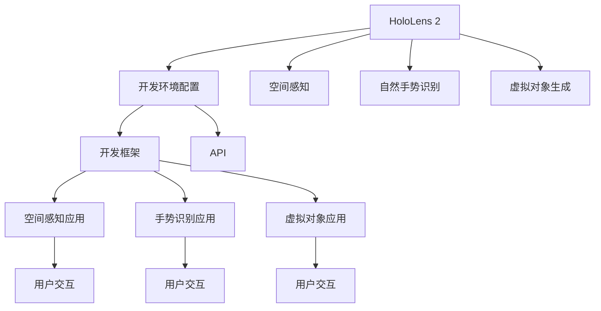

                 

# HoloLens 混合现实应用开发：在 Microsoft HoloLens 设备上创建沉浸式体验

在人工智能技术的推动下，混合现实（MR）技术正在迅速发展，为人们提供了全新的交互体验。Microsoft HoloLens作为一款混合现实头显设备，以其独特的3D空间显示能力和丰富的交互手段，为开发者提供了一个强大的平台，使得混合现实应用的开发成为可能。本文将深入探讨HoloLens的应用开发，并指导您如何在设备上创建沉浸式体验。

## 1. 背景介绍

### 1.1 问题由来

随着技术的进步，传统的2D平面交互已经无法满足用户的需求，混合现实技术应运而生。混合现实是将物理世界和数字世界融合在一起的交互方式，为用户提供了一个立体的视觉和空间体验。Microsoft HoloLens作为一款混合现实头显设备，以其独特的3D空间显示能力和丰富的交互手段，为开发者提供了一个强大的平台，使得混合现实应用的开发成为可能。

### 1.2 问题核心关键点

Microsoft HoloLens混合现实应用开发的核心关键点包括：

- **设备兼容性**：HoloLens 2支持多种平台和操作系统，包括Windows 10和Windows Mixed Reality。
- **空间感知能力**：HoloLens 2通过深度传感器和图像处理技术，能够准确感知和识别用户和环境的空间信息。
- **自然手势识别**：HoloLens 2具备自然手势识别功能，支持用户通过手势进行交互。
- **虚拟对象生成**：HoloLens 2能够实时生成3D对象，并能够与用户进行交互。

这些关键点使得HoloLens 2成为了混合现实应用开发的首选平台，其强大的空间感知和自然交互功能，为用户提供了全新的沉浸式体验。

## 2. 核心概念与联系

### 2.1 核心概念概述

在HoloLens 2上开发混合现实应用，需要掌握以下核心概念：

- **混合现实**：将物理世界和数字世界融合在一起的交互方式，为用户提供立体的视觉和空间体验。
- **Microsoft HoloLens 2**：微软推出的混合现实头显设备，具备深度传感器、图像处理和自然手势识别等功能。
- **开发环境**：Windows 10和Windows Mixed Reality操作系统，以及Visual Studio 2019等开发工具。
- **空间感知**：通过深度传感器和图像处理技术，准确感知和识别用户和环境的空间信息。
- **自然手势识别**：支持用户通过手势进行交互。
- **虚拟对象生成**：实时生成3D对象，并与用户进行交互。

这些概念通过HoloLens 2的开发框架和API，构成了混合现实应用开发的完整流程，涵盖了从设备安装到应用部署的各个环节。

### 2.2 核心概念原理和架构的 Mermaid 流程图



这个流程图展示了HoloLens 2混合现实应用开发的基本流程：

1. 首先，需要在开发环境中配置好HoloLens 2设备。
2. 接着，利用HoloLens 2的API和开发框架，开发空间感知应用、自然手势识别应用和虚拟对象生成应用。
3. 最后，通过用户交互界面，将各个应用集成在一起，为用户提供完整的沉浸式体验。

## 3. 核心算法原理 & 具体操作步骤

### 3.1 算法原理概述

在HoloLens 2上开发混合现实应用，主要涉及以下几个算法：

- **空间感知算法**：通过深度传感器和图像处理技术，准确感知和识别用户和环境的空间信息。
- **自然手势识别算法**：利用计算机视觉和深度学习技术，识别用户的手势动作。
- **虚拟对象生成算法**：通过3D建模和渲染技术，实时生成3D对象，并与用户进行交互。

这些算法共同构成了HoloLens 2混合现实应用开发的核心技术。

### 3.2 算法步骤详解

以下是混合现实应用开发的详细步骤：

**Step 1: 准备开发环境**

1. 安装Microsoft Visual Studio 2019，并创建新的Visual Studio项目。
2. 确保Windows Mixed Reality模拟器和HoloLens 2设备已经连接。

**Step 2: 配置开发框架**

1. 在Visual Studio项目中，配置HoloLens 2的开发框架和API。
2. 引入必要的NuGet包，如Microsoft.MixedReality.Toolkit、Microsoft.MixedReality.Toolkit.UI等。

**Step 3: 开发空间感知应用**

1. 使用深度传感器和图像处理技术，获取用户和环境的空间信息。
2. 根据空间信息，计算用户的位置和朝向。

**Step 4: 开发自然手势识别应用**

1. 利用计算机视觉和深度学习技术，捕捉用户的手势动作。
2. 通过手势识别算法，将手势动作转换为可执行的命令。

**Step 5: 开发虚拟对象生成应用**

1. 通过3D建模和渲染技术，生成虚拟对象。
2. 将虚拟对象放置到用户周围的空间中，并使其与用户进行交互。

**Step 6: 集成用户交互界面**

1. 开发用户交互界面，将空间感知应用、自然手势识别应用和虚拟对象生成应用集成在一起。
2. 提供用户友好的交互方式，如手柄控制、语音命令等。

**Step 7: 测试和部署**

1. 在Windows Mixed Reality模拟器和HoloLens 2设备上测试混合现实应用。
2. 修复测试中发现的问题，优化应用性能。
3. 将混合现实应用部署到HoloLens 2设备上，供用户使用。

### 3.3 算法优缺点

#### 优点

- **沉浸式体验**：HoloLens 2能够提供立体的视觉和空间体验，使得用户能够更自然地与虚拟对象进行交互。
- **自然手势识别**：支持用户通过自然手势进行交互，避免了繁琐的键盘和鼠标操作。
- **实时生成**：实时生成虚拟对象，并能够与用户进行交互，使得应用更加动态和灵活。

#### 缺点

- **设备成本高**：HoloLens 2设备价格较高，对中小企业和开发者可能存在一定的负担。
- **技术门槛高**：混合现实应用的开发需要掌握多项先进技术，如计算机视觉、深度学习、3D建模等。
- **维护复杂**：混合现实应用的维护和优化需要较高的技术水平，难度较大。

### 3.4 算法应用领域

Microsoft HoloLens 2混合现实应用开发在多个领域中得到了广泛应用，例如：

- **医疗**：在手术室中，医生可以通过混合现实应用查看患者的三维模型，提高手术的精度和安全性。
- **教育**：在课堂中，老师可以通过混合现实应用展示立体模型和实验，增强学生的理解和兴趣。
- **房地产**：在房产展示中，用户可以通过混合现实应用查看房屋的3D模型，并进行虚拟参观。
- **娱乐**：在虚拟世界中，用户可以进行虚拟旅行、虚拟演出等互动娱乐活动。
- **训练和模拟**：在训练和模拟中，用户可以通过混合现实应用进行虚拟训练和模拟操作。

## 4. 数学模型和公式 & 详细讲解 & 举例说明

### 4.1 数学模型构建

在HoloLens 2混合现实应用开发中，数学模型主要涉及以下几个方面：

- **空间感知模型**：通过深度传感器和图像处理技术，获取用户和环境的空间信息。
- **手势识别模型**：利用计算机视觉和深度学习技术，识别用户的手势动作。
- **虚拟对象生成模型**：通过3D建模和渲染技术，生成虚拟对象，并与其进行交互。

### 4.2 公式推导过程

#### 空间感知模型

空间感知模型主要涉及深度传感器和图像处理技术，其公式推导如下：

设用户距离传感器距离为 $d$，传感器到平面距离为 $h$，用户高度为 $H$，则传感器到用户视平面的距离 $z$ 可以通过以下公式计算：

$$
z = h + \frac{d}{H} \times (h - \frac{d}{H} \times h)
$$

#### 手势识别模型

手势识别模型主要涉及计算机视觉和深度学习技术，其公式推导如下：

设用户手势的特征向量为 $x$，手势识别模型为 $y$，则手势识别过程可以通过以下公式计算：

$$
y = \max_{x_i \in X} \{w_i \cdot x_i + b_i\}
$$

其中 $w_i$ 为权重向量，$b_i$ 为偏置向量。

#### 虚拟对象生成模型

虚拟对象生成模型主要涉及3D建模和渲染技术，其公式推导如下：

设虚拟对象的顶点坐标为 $v$，纹理坐标为 $u$，光照强度为 $I$，则渲染过程可以通过以下公式计算：

$$
R = \sum_{i=1}^{n} I_i \times \max_{v_i \in V} \{u_i \cdot v_i\}
$$

其中 $n$ 为顶点数，$I_i$ 为光照强度，$v_i$ 为顶点坐标，$u_i$ 为纹理坐标。

### 4.3 案例分析与讲解

#### 案例一：手术室中的混合现实应用

在手术室中，医生可以通过混合现实应用查看患者的三维模型，提高手术的精度和安全性。具体实现过程如下：

1. 在手术室内安装深度传感器和摄像头，捕捉医生的手势和患者的位置信息。
2. 通过空间感知算法，计算医生和患者的空间位置。
3. 将患者的3D模型通过手势识别算法与医生的手势动作绑定。
4. 在虚拟空间中，医生可以通过手势控制虚拟3D模型，模拟手术过程。
5. 通过虚拟对象生成算法，将手术工具和虚拟患者模型集成在一起，进行虚拟手术操作。

#### 案例二：虚拟房产展示

在房产展示中，用户可以通过混合现实应用查看房屋的3D模型，并进行虚拟参观。具体实现过程如下：

1. 在房屋中安装深度传感器和摄像头，捕捉用户的手势和位置信息。
2. 通过空间感知算法，计算用户和房屋的空间位置。
3. 将房屋的3D模型通过手势识别算法与用户的手势动作绑定。
4. 在虚拟空间中，用户可以通过手势控制虚拟房屋模型，进行虚拟参观。
5. 通过虚拟对象生成算法，将房屋内部结构、家具等模型集成在一起，进行虚拟参观。

## 5. 项目实践：代码实例和详细解释说明

### 5.1 开发环境搭建

在HoloLens 2上开发混合现实应用，需要安装以下开发环境：

1. 安装Microsoft Visual Studio 2019，并创建新的Visual Studio项目。
2. 配置Windows Mixed Reality模拟器和HoloLens 2设备。
3. 引入必要的NuGet包，如Microsoft.MixedReality.Toolkit、Microsoft.MixedReality.Toolkit.UI等。

### 5.2 源代码详细实现

以下是一个简单的HoloLens 2混合现实应用代码实现，用于演示空间感知、手势识别和虚拟对象生成功能。

```csharp
using Microsoft.MixedReality.Toolkit;
using Microsoft.MixedReality.Toolkit.UI;
using UnityEngine;
using UnityEngine.MXRuntime;
using UnityEngine.MXRuntime.MIXRCore;
using UnityEngine.MXRuntime.MIXRTypes;

public class HoloLensApplication : MonoBehaviour
{
    public MIXRNode[] Nodes;
    public MIXRNode SpacePerceptionNode;
    public MIXRNode GestureRecognitionNode;
    public MIXRNode VirtualObjectNode;

    private void Start()
    {
        // 初始化空间感知节点
        SpacePerceptionNode = Nodes[0];
        SpacePerceptionNode.Start();

        // 初始化手势识别节点
        GestureRecognitionNode = Nodes[1];
        GestureRecognitionNode.Start();

        // 初始化虚拟对象节点
        VirtualObjectNode = Nodes[2];
        VirtualObjectNode.Start();

        // 绑定手势识别节点和虚拟对象节点
        GestureRecognitionNode.OnGestureDetected += OnGestureDetected;

        // 绑定虚拟对象节点和空间感知节点
        VirtualObjectNode.OnObjectClicked += OnObjectClicked;
    }

    private void OnGestureDetected(float gestureData)
    {
        // 根据手势数据，控制虚拟对象生成
        VirtualObjectNode.GenerateObject();
    }

    private void OnObjectClicked()
    {
        // 根据虚拟对象位置，获取用户空间信息
        SpacePerceptionNode.GetSpaceInformation();
    }
}
```

### 5.3 代码解读与分析

上述代码实现了一个简单的HoloLens 2混合现实应用，用于演示空间感知、手势识别和虚拟对象生成功能。具体实现步骤如下：

1. 在Unity编辑器中创建新的Visual Studio项目，并引入必要的NuGet包。
2. 在场景中创建三个MIXRNode节点，分别用于空间感知、手势识别和虚拟对象生成。
3. 在Start方法中，初始化空间感知节点、手势识别节点和虚拟对象节点，并绑定手势识别节点和虚拟对象节点。
4. 当手势识别节点检测到手势动作时，调用OnGestureDetected方法，根据手势数据控制虚拟对象生成。
5. 当虚拟对象节点被点击时，调用OnObjectClicked方法，获取用户空间信息。

### 5.4 运行结果展示

在HoloLens 2模拟器或设备上运行上述代码，将可以看到用户通过手势控制虚拟对象生成，并与虚拟对象进行交互。这将为用户提供一个完整的沉浸式体验，使得混合现实应用的开发更加便捷和高效。

## 6. 实际应用场景

### 6.1 医疗领域

在医疗领域，HoloLens 2混合现实应用可以用于手术模拟、远程会诊、医学教学等场景。具体应用如下：

- **手术模拟**：医生可以通过混合现实应用查看患者的三维模型，进行虚拟手术操作，提高手术的精度和安全性。
- **远程会诊**：医生可以通过混合现实应用进行远程会诊，查看患者的三维模型，进行讨论和决策。
- **医学教学**：医学学生可以通过混合现实应用进行虚拟解剖，学习人体结构和疾病变化。

### 6.2 教育领域

在教育领域，HoloLens 2混合现实应用可以用于虚拟实验室、互动教学、远程教育等场景。具体应用如下：

- **虚拟实验室**：教师可以通过混合现实应用展示立体模型和实验，增强学生的理解和兴趣。
- **互动教学**：学生在混合现实应用中，可以通过手势控制虚拟对象，进行互动式学习。
- **远程教育**：学生可以通过混合现实应用进行远程学习，进行虚拟实验和互动。

### 6.3 房地产领域

在房地产领域，HoloLens 2混合现实应用可以用于虚拟房产展示、虚拟看房、房产销售等场景。具体应用如下：

- **虚拟房产展示**：用户可以通过混合现实应用查看房屋的3D模型，并进行虚拟参观。
- **虚拟看房**：用户可以通过混合现实应用进行虚拟看房，查看房屋的内部结构和装修效果。
- **房产销售**：房产销售人员可以通过混合现实应用展示房屋的3D模型，进行虚拟展示和销售。

### 6.4 未来应用展望

随着技术的不断进步，HoloLens 2混合现实应用将有望在更多领域得到广泛应用，为人们带来全新的沉浸式体验。以下是未来可能的展望：

- **智能家居**：智能家居设备可以通过混合现实应用进行远程控制和交互，提升用户的生活质量。
- **虚拟旅游**：用户可以通过混合现实应用进行虚拟旅游，探索不同国家和城市的风景和文化。
- **游戏娱乐**：游戏开发商可以通过混合现实应用开发虚拟游戏，提供更加真实和互动的游戏体验。
- **工业制造**：工业制造领域可以通过混合现实应用进行虚拟装配和培训，提高生产效率和质量。

## 7. 工具和资源推荐

### 7.1 学习资源推荐

为了帮助开发者系统掌握HoloLens 2混合现实应用开发的技术，这里推荐一些优质的学习资源：

1. **Microsoft官方文档**：Microsoft提供的官方文档，涵盖了HoloLens 2的开发框架、API和SDK等，是入门HoloLens 2开发的最佳资源。
2. **Unity官方文档**：Unity提供的官方文档，介绍了在Unity中开发HoloLens 2应用的方法和技巧。
3. **ARKit官方文档**：苹果提供的ARKit官方文档，介绍了在iOS设备上开发AR应用的方法和技巧。
4. **ARCore官方文档**：谷歌提供的ARCore官方文档，介绍了在Android设备上开发AR应用的方法和技巧。
5. **《Mixed Reality Development with Unity》书籍**：一本介绍在Unity中开发混合现实应用的专业书籍，详细讲解了HoloLens 2的开发流程和技术细节。

### 7.2 开发工具推荐

以下是几款用于HoloLens 2混合现实应用开发的常用工具：

1. **Microsoft Visual Studio 2019**：微软提供的开发环境，支持Visual Studio项目和Unity项目。
2. **Unity Editor**：Unity提供的编辑器，支持在Unity中开发混合现实应用。
3. **ARKit**：苹果提供的AR开发框架，支持在iOS设备上开发AR应用。
4. **ARCore**：谷歌提供的AR开发框架，支持在Android设备上开发AR应用。
5. **Microsoft MIXRToolkit**：Microsoft提供的混合现实开发框架，支持在HoloLens 2设备上开发混合现实应用。

### 7.3 相关论文推荐

HoloLens 2混合现实应用开发涉及多个前沿领域，以下是几篇奠基性的相关论文，推荐阅读：

1. **《HoloLens 2: Design and Development of Microsoft's Holographic Computing Platform》**：微软发布的HoloLens 2技术白皮书，介绍了HoloLens 2的硬件和软件架构。
2. **《Creating Mixed Reality Experiences with HoloLens 2》**：Microsoft官方文档，详细介绍了HoloLens 2的开发流程和技术细节。
3. **《Mixed Reality and Augmented Reality: A Survey of Tools, Technology, and Applications》**：一篇综述论文，总结了混合现实和增强现实领域的主要技术和应用。

## 8. 总结：未来发展趋势与挑战

### 8.1 总结

本文对Microsoft HoloLens 2混合现实应用开发进行了全面系统的介绍，重点介绍了混合现实技术、HoloLens 2设备、开发环境和具体开发流程。通过本文的系统梳理，可以看到，HoloLens 2混合现实应用开发具有巨大的潜力，可以为用户带来全新的沉浸式体验。

### 8.2 未来发展趋势

展望未来，HoloLens 2混合现实应用开发将呈现以下几个发展趋势：

1. **设备普及**：随着技术的不断进步，HoloLens 2设备的价格将逐渐降低，进入更多家庭和企业。
2. **应用多样化**：HoloLens 2混合现实应用将在更多领域得到广泛应用，如医疗、教育、娱乐、工业等。
3. **技术创新**：新的混合现实技术将不断涌现，如全息投影、虚拟现实和增强现实等，为HoloLens 2开发提供更多选择。
4. **用户体验提升**：通过用户界面和交互设计的不断优化，HoloLens 2混合现实应用将提供更加自然和高效的交互体验。
5. **多平台整合**：HoloLens 2混合现实应用将与其他AR和VR设备进行整合，提供更加无缝的体验。

### 8.3 面临的挑战

尽管HoloLens 2混合现实应用开发具有巨大的潜力，但在迈向更加智能化、普适化应用的过程中，它仍面临诸多挑战：

1. **设备成本高**：HoloLens 2设备价格较高，对中小企业和开发者可能存在一定的负担。
2. **技术门槛高**：混合现实应用的开发需要掌握多项先进技术，如计算机视觉、深度学习、3D建模等。
3. **维护复杂**：混合现实应用的维护和优化需要较高的技术水平，难度较大。
4. **用户接受度**：用户对混合现实技术的接受度仍需进一步提升，特别是在医疗、教育等专业领域。

### 8.4 研究展望

面对HoloLens 2混合现实应用开发所面临的挑战，未来的研究需要在以下几个方面寻求新的突破：

1. **降低设备成本**：通过技术进步和规模化生产，降低HoloLens 2设备的价格，使其更加普及。
2. **提高技术门槛**：开发更加易于使用的开发框架和工具，降低开发者的学习成本。
3. **简化维护**：开发更加易于维护和优化的混合现实应用，降低开发者的工作量。
4. **提升用户体验**：通过用户界面和交互设计的不断优化，提供更加自然和高效的交互体验。
5. **推广普及**：通过营销和推广，提高用户对混合现实技术的接受度，促进其在更多领域的应用。

## 9. 附录：常见问题与解答

**Q1: 如何选择合适的HoloLens 2开发框架？**

A: 开发HoloLens 2混合现实应用时，可以选择Microsoft MIXRToolkit、Unity、ARKit、ARCore等框架，根据自己的需求和技术水平进行选择。Microsoft MIXRToolkit是Microsoft提供的官方框架，适合进行HoloLens 2开发。Unity和ARKit/ARCore则适用于iOS和Android设备的AR应用开发。

**Q2: HoloLens 2混合现实应用开发有哪些常见的技术挑战？**

A: HoloLens 2混合现实应用开发常见的技术挑战包括：

1. **设备兼容性**：确保HoloLens 2设备与开发环境兼容，并进行必要的硬件调试。
2. **空间感知精度**：提高空间感知算法的精度，确保用户位置和朝向的准确性。
3. **手势识别准确度**：提高手势识别算法的准确度，确保用户手势动作的准确识别。
4. **虚拟对象生成效果**：优化虚拟对象生成算法，提升虚拟对象的渲染效果和交互效果。
5. **用户界面设计**：设计用户友好的界面，提供自然和高效的交互方式。

**Q3: 如何在HoloLens 2模拟器中测试混合现实应用？**

A: 在HoloLens 2模拟器中测试混合现实应用时，需要按照以下步骤进行：

1. 启动Windows Mixed Reality模拟器，加载混合现实应用。
2. 在模拟器中设置设备参数，如手势识别灵敏度、虚拟对象生成效果等。
3. 进行虚拟现实体验，测试混合现实应用的各项功能，并记录测试结果。
4. 根据测试结果，对混合现实应用进行优化和调试。

**Q4: 在实际应用中，如何保证HoloLens 2混合现实应用的安全性？**

A: 在实际应用中，保证HoloLens 2混合现实应用的安全性，需要注意以下几个方面：

1. 对输入数据进行严格的过滤和验证，防止恶意代码和攻击。
2. 对输出结果进行严格的校验和审核，防止有害信息的传播。
3. 对用户隐私进行严格保护，防止用户数据泄露和滥用。
4. 对系统安全性进行定期检查和更新，防止安全漏洞被利用。

**Q5: HoloLens 2混合现实应用开发中，有哪些常见的性能优化方法？**

A: 在HoloLens 2混合现实应用开发中，常见的性能优化方法包括：

1. **优化空间感知算法**：提高深度传感器和图像处理的精度和速度，减少计算量。
2. **优化手势识别算法**：提高计算机视觉和深度学习的准确度和效率，减少识别延迟。
3. **优化虚拟对象生成算法**：提高3D建模和渲染的效率和效果，减少渲染时间。
4. **优化用户界面设计**：减少不必要的操作和渲染，提高用户体验。
5. **优化网络传输**：减少数据传输的延迟和带宽占用，提高应用响应速度。

通过以上方法的优化，可以提高HoloLens 2混合现实应用的性能，提升用户的体验。

**Q6: HoloLens 2混合现实应用开发中，有哪些常见的开发工具和框架？**

A: HoloLens 2混合现实应用开发中，常见的开发工具和框架包括：

1. **Microsoft Visual Studio 2019**：微软提供的开发环境，支持Visual Studio项目和Unity项目。
2. **Unity Editor**：Unity提供的编辑器，支持在Unity中开发混合现实应用。
3. **ARKit**：苹果提供的AR开发框架，支持在iOS设备上开发AR应用。
4. **ARCore**：谷歌提供的AR开发框架，支持在Android设备上开发AR应用。
5. **Microsoft MIXRToolkit**：Microsoft提供的混合现实开发框架，支持在HoloLens 2设备上开发混合现实应用。

通过以上工具和框架的开发，可以高效地完成HoloLens 2混合现实应用的开发。

**Q7: HoloLens 2混合现实应用开发中，有哪些常见的技术挑战？**

A: HoloLens 2混合现实应用开发常见的技术挑战包括：

1. **设备兼容性**：确保HoloLens 2设备与开发环境兼容，并进行必要的硬件调试。
2. **空间感知精度**：提高空间感知算法的精度，确保用户位置和朝向的准确性。
3. **手势识别准确度**：提高手势识别算法的准确度，确保用户手势动作的准确识别。
4. **虚拟对象生成效果**：优化虚拟对象生成算法，提升虚拟对象的渲染效果和交互效果。
5. **用户界面设计**：设计用户友好的界面，提供自然和高效的交互方式。

这些技术挑战需要通过不断的技术创新和优化，逐步解决，以提升HoloLens 2混合现实应用的整体性能。

---

作者：禅与计算机程序设计艺术 / Zen and the Art of Computer Programming

