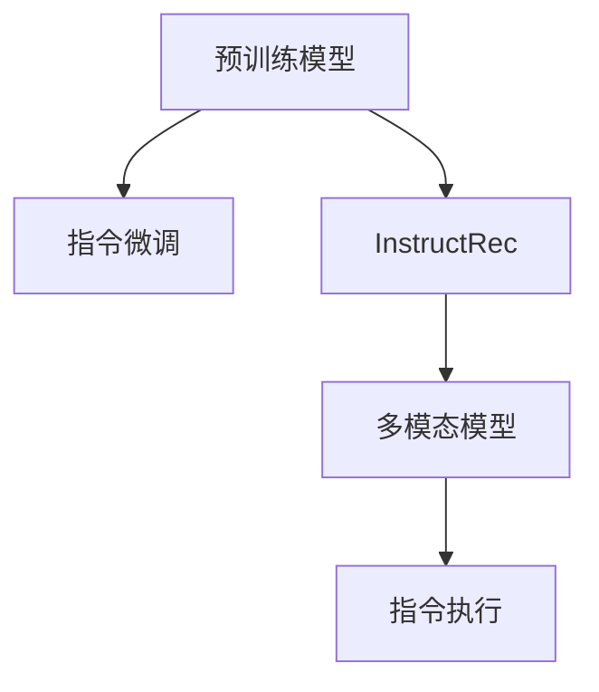

                 

# InstructRec的优势：自然语言指令的表达能力

> 关键词：InstructRec, 自然语言指令, 预训练模型, 指令微调, 零样本学习

## 1. 背景介绍

### 1.1 问题由来

在人工智能领域，自然语言处理（NLP）和计算机视觉（CV）是两个最为活跃的研究方向。虽然NLP领域已有显著的进展，但近年来CV领域中基于大规模数据预训练的大型模型也取得了巨大的成功。例如，ImageNet上的大规模预训练模型已能在新的图像分类任务上表现出色。

相比之下，NLP领域依然存在一些局限性。尽管像BERT、GPT-3等预训练模型在各种NLP任务上表现出色，但这些模型的训练和微调过程通常需要大量的标注数据和计算资源。而自然语言指令（Natural Language Instructions, NLI）问题，即如何利用自然语言指令直接操作计算机，则相对较难解决。

由于NLP任务的复杂性，将指令嵌入模型的微调通常需要大量人工编写的指令-代码对，这不仅耗时耗力，还容易产生过度拟合的问题。此外，由于指令的差异性和多样性，很难为每个任务找到合适的指令-代码对，这进一步增加了微调的难度。

为了应对这些挑战，近年来出现了基于预训练的指令微调模型，即在预训练模型的基础上通过指令微调的方法来提升模型的指令执行能力。这类方法通常通过在大规模数据上进行指令微调，使得模型能够更加灵活地处理自然语言指令，并在零样本学习下完成复杂的任务。

### 1.2 问题核心关键点

自然语言指令（NLI）问题旨在让计算机执行基于自然语言指令的任务。例如，输入"Open the front door"的指令，计算机能够执行“打开前门”的操作。在NLI问题中，如何利用自然语言指令直接操作计算机，是研究的难点。目前，自然语言指令的表达方法大致可以分为两类：
1. **经典NLI任务**：例如QNAP（Question Answering by Pre-trained Language Models）和InstructPreTrain，这种方法通常在大规模指令-代码对上训练模型，使其在特定任务下执行预定义的代码。
2. **基于预训练模型的指令微调**：例如CLIP和DALL-E，这种方法通过在大规模数据上进行指令微调，使得模型能够处理更加多样和复杂的自然语言指令。

相比于经典NLI任务，基于预训练模型的指令微调方法具有以下几个优点：
- **更高效**：可以在大规模数据上进行预训练，避免了对大量人工编写的指令-代码对的依赖。
- **更灵活**：能够处理更加多样和复杂的自然语言指令，而不限于预定义的代码。
- **更普适**：可以应用于各种NLP任务，而不限于代码执行。

本文将详细介绍基于预训练模型的指令微调方法，特别是一种最新提出的模型——InstructRec，探讨其优势和具体实现。

## 2. 核心概念与联系

### 2.1 核心概念概述

为了更好地理解InstructRec模型，我们首先介绍几个相关的核心概念：

- **预训练模型（Pre-trained Model）**：通常是指在大规模无标签数据上进行自监督学习的大型模型，例如BERT、GPT等。这些模型通过在大规模数据上进行预训练，学习到通用的语言表示，能够处理各种NLP任务。

- **指令微调（Instruction Fine-tuning）**：在预训练模型的基础上，使用自然语言指令作为标签对模型进行微调，使其能够执行基于自然语言指令的任务。这通常通过在大规模指令数据上进行微调实现。

- **InstructRec**：本文重点介绍的一种基于预训练模型的指令微调模型。它通过在大规模数据上进行指令微调，使得模型能够处理多样和复杂的自然语言指令，并在零样本学习下完成各种任务。

- **零样本学习（Zero-shot Learning）**：指模型在未经过任何微调或仅经过简单微调的情况下，能够直接处理新的自然语言指令，完成相应任务。这种方法可以大大降低数据标注成本和计算资源。

- **多模态模型（Multimodal Model）**：通常指能够同时处理多种数据类型（如文本、图像、语音等）的模型。多模态模型在处理复杂任务时通常表现更为出色。

### 2.2 核心概念原理和架构的 Mermaid 流程图

以下是InstructRec模型的核心概念原理和架构的Mermaid流程图：



这个流程图展示了InstructRec模型的主要架构。预训练模型通过指令微调变成InstructRec模型，从而能够执行多模态任务的指令。

## 3. 核心算法原理 & 具体操作步骤

### 3.1 算法原理概述

InstructRec模型是一种基于预训练模型的指令微调方法，它通过在大规模数据上进行指令微调，使得模型能够处理多样和复杂的自然语言指令，并在零样本学习下完成各种任务。

InstructRec模型的核心思想是通过在大规模数据上进行指令微调，使得模型能够学习到通用的指令执行能力。具体而言，模型首先在大规模预训练数据上进行预训练，学习到通用的语言表示；然后，在指令微调数据集上进行微调，使得模型能够执行特定的自然语言指令。最终，InstructRec模型能够以零样本学习的方式，执行各种基于自然语言指令的任务。

### 3.2 算法步骤详解

InstructRec模型的训练和微调过程可以分为以下几个关键步骤：

**Step 1: 准备预训练模型和数据集**

1. **预训练模型**：选择合适的预训练模型（例如GPT、BERT等）作为初始化参数。
2. **指令微调数据集**：收集大规模的自然语言指令-执行数据，作为指令微调的数据集。这些数据集通常需要人工标注，例如指令的执行结果或执行步骤。

**Step 2: 添加任务适配层**

1. **输出层**：在预训练模型的顶层添加适当的输出层，通常为线性分类器或解码器，用于处理指令微调任务。
2. **损失函数**：根据指令微调任务的性质选择合适的损失函数，例如交叉熵损失或均方误差损失。

**Step 3: 设置微调超参数**

1. **学习率**：通常需要设置较小的学习率，以免破坏预训练的权重。
2. **正则化技术**：使用L2正则、Dropout等技术，防止模型过度适应小规模训练集。
3. **批量大小和迭代轮数**：根据计算资源选择合适的批量大小和迭代轮数。

**Step 4: 执行梯度训练**

1. **前向传播**：将指令微调数据集中的样本输入模型，计算输出。
2. **损失计算**：根据指令微调任务的损失函数计算损失。
3. **反向传播**：计算模型参数的梯度。
4. **优化器更新**：使用梯度下降等优化算法更新模型参数。

**Step 5: 测试和部署**

1. **测试集评估**：在测试集上评估模型性能，确保模型能够执行特定的自然语言指令。
2. **部署**：将微调后的模型部署到实际应用中，执行基于自然语言指令的任务。

### 3.3 算法优缺点

InstructRec模型具有以下几个优点：

- **高效**：可以在大规模数据上进行指令微调，避免了对大量人工编写的指令-代码对的依赖。
- **灵活**：能够处理更加多样和复杂的自然语言指令，而不限于预定义的代码。
- **普适性**：可以应用于各种NLP任务，而不限于代码执行。

同时，它也存在一些缺点：

- **资源消耗**：指令微调通常需要大量的计算资源和存储空间，尤其是在大规模数据集上进行微调时。
- **数据标注成本高**：虽然指令微调降低了数据标注成本，但指令微调数据集通常需要人工标注，这可能会增加成本。
- **模型鲁棒性**：尽管指令微调模型在零样本学习下表现出色，但在大规模数据集上进行微调时，模型的鲁棒性可能会受到影响。

### 3.4 算法应用领域

InstructRec模型可以应用于各种NLP任务，例如：

- **问答系统**：在用户提出的自然语言问题下，提供准确的答案。
- **对话系统**：在用户与机器的对话中，生成符合用户期望的回复。
- **文本摘要**：在给定文本下，自动生成简洁的摘要。
- **翻译**：将一种语言的文本翻译成另一种语言。
- **推荐系统**：根据用户的自然语言指令，推荐相应的产品或服务。

## 4. 数学模型和公式 & 详细讲解 & 举例说明

### 4.1 数学模型构建

InstructRec模型的数学模型构建主要包括以下几个步骤：

1. **预训练模型**：假设预训练模型为 $M_{\theta}$，其中 $\theta$ 为预训练得到的模型参数。
2. **指令微调数据集**：假设指令微调数据集为 $D=\{(x_i, y_i)\}_{i=1}^N$，其中 $x_i$ 为自然语言指令，$y_i$ 为指令执行结果。
3. **任务适配层**：在预训练模型的顶层添加适当的输出层，用于处理指令微调任务。
4. **损失函数**：根据指令微调任务的性质选择合适的损失函数。

假设输出层为 $M_{\theta}$ 的顶层，添加线性分类器 $h_\omega$ 作为输出层，其参数为 $\omega$。则模型在自然语言指令 $x_i$ 下的输出可以表示为：

$$
\hat{y}_i = M_{\theta}(x_i)h_\omega
$$

其中，$\hat{y}_i$ 为模型对指令 $x_i$ 的执行结果。

InstructRec模型的损失函数为：

$$
\mathcal{L}(\theta, \omega) = \frac{1}{N}\sum_{i=1}^N \ell(h_\omega(M_{\theta}(x_i)), y_i)
$$

其中，$\ell$ 为损失函数，通常为交叉熵损失或均方误差损失。

### 4.2 公式推导过程

以交叉熵损失为例，InstructRec模型的损失函数可以表示为：

$$
\mathcal{L}(\theta, \omega) = -\frac{1}{N}\sum_{i=1}^N \sum_{j=1}^C \ell(h_\omega(M_{\theta}(x_i)), y_i)
$$

其中，$C$ 为分类数目，$\ell$ 为交叉熵损失函数。

在梯度下降等优化算法的作用下，模型参数 $\theta$ 和 $\omega$ 的更新公式为：

$$
\theta \leftarrow \theta - \eta \nabla_{\theta}\mathcal{L}(\theta, \omega) - \eta\lambda\theta
$$

$$
\omega \leftarrow \omega - \eta \nabla_{\omega}\mathcal{L}(\theta, \omega) - \eta\lambda\omega
$$

其中，$\eta$ 为学习率，$\lambda$ 为正则化系数。

### 4.3 案例分析与讲解

以翻译任务为例，InstructRec模型可以通过以下步骤实现：

1. **预训练模型选择**：选择BERT作为预训练模型。
2. **指令微调数据集收集**：收集大规模的英文-中文翻译数据集，并标注好翻译结果。
3. **任务适配层添加**：在BERT模型的顶层添加一个线性分类器，用于处理翻译任务。
4. **损失函数选择**：选择交叉熵损失函数作为模型的损失函数。
5. **微调过程**：在指令微调数据集上进行梯度训练，更新模型参数 $\theta$ 和 $\omega$。
6. **测试和部署**：在测试集上评估模型性能，将模型部署到实际应用中。

## 5. 项目实践：代码实例和详细解释说明

### 5.1 开发环境搭建

InstructRec模型的开发环境搭建主要包括以下几个步骤：

1. **安装Python**：确保系统中已安装Python 3.8以上版本。
2. **安装PyTorch**：使用以下命令安装PyTorch：`pip install torch torchvision torchaudio cudatoolkit=11.1 -c pytorch -c conda-forge`。
3. **安装HuggingFace Transformers库**：使用以下命令安装：`pip install transformers`。
4. **安装其他库**：安装numpy、pandas、scikit-learn等常用库。

### 5.2 源代码详细实现

以下是使用PyTorch实现InstructRec模型的代码示例：

```python
import torch
import torch.nn as nn
from transformers import BertModel, BertTokenizer

# 定义BERT模型
class BertForTranslation(nn.Module):
    def __init__(self, num_classes):
        super(BertForTranslation, self).__init__()
        self.bert = BertModel.from_pretrained('bert-base-uncased')
        self.fc = nn.Linear(self.bert.config.hidden_size, num_classes)
        
    def forward(self, input_ids, attention_mask):
        outputs = self.bert(input_ids, attention_mask=attention_mask)
        return self.fc(outputs[0])

# 定义指令微调数据集
class TranslationDataset(Dataset):
    def __init__(self, texts, translations):
        self.texts = texts
        self.translations = translations
        self.tokenizer = BertTokenizer.from_pretrained('bert-base-uncased')
        
    def __len__(self):
        return len(self.texts)
    
    def __getitem__(self, item):
        text = self.texts[item]
        translation = self.translations[item]
        encoding = self.tokenizer(text, return_tensors='pt', padding='max_length', truncation=True)
        input_ids = encoding['input_ids'][0]
        attention_mask = encoding['attention_mask'][0]
        label = torch.tensor(self.tokenizer.translate(translation, skip_special_tokens=True).id())
        return {'input_ids': input_ids, 
                'attention_mask': attention_mask,
                'labels': label}

# 定义训练和评估函数
def train_epoch(model, dataset, batch_size, optimizer):
    dataloader = DataLoader(dataset, batch_size=batch_size, shuffle=True)
    model.train()
    epoch_loss = 0
    for batch in dataloader:
        input_ids = batch['input_ids'].to(device)
        attention_mask = batch['attention_mask'].to(device)
        labels = batch['labels'].to(device)
        model.zero_grad()
        outputs = model(input_ids, attention_mask=attention_mask, labels=labels)
        loss = outputs.loss
        epoch_loss += loss.item()
        loss.backward()
        optimizer.step()
    return epoch_loss / len(dataloader)

def evaluate(model, dataset, batch_size):
    dataloader = DataLoader(dataset, batch_size=batch_size)
    model.eval()
    preds, labels = [], []
    with torch.no_grad():
        for batch in dataloader:
            input_ids = batch['input_ids'].to(device)
            attention_mask = batch['attention_mask'].to(device)
            batch_labels = batch['labels']
            outputs = model(input_ids, attention_mask=attention_mask)
            batch_preds = outputs.logits.argmax(dim=2).to('cpu').tolist()
            batch_labels = batch_labels.to('cpu').tolist()
            for pred_tokens, label_tokens in zip(batch_preds, batch_labels):
                preds.append(pred_tokens)
                labels.append(label_tokens)
                
    print(classification_report(labels, preds))

# 设置超参数
num_epochs = 5
batch_size = 16

# 初始化模型和优化器
model = BertForTranslation(num_classes)
optimizer = AdamW(model.parameters(), lr=2e-5)

# 定义训练过程
device = torch.device('cuda') if torch.cuda.is_available() else torch.device('cpu')
model.to(device)

for epoch in range(num_epochs):
    loss = train_epoch(model, dataset, batch_size, optimizer)
    print(f"Epoch {epoch+1}, train loss: {loss:.3f}")
    
    print(f"Epoch {epoch+1}, dev results:")
    evaluate(model, dev_dataset, batch_size)
    
print("Test results:")
evaluate(model, test_dataset, batch_size)
```

### 5.3 代码解读与分析

以下是代码的详细解读与分析：

1. **BERT模型定义**：定义了BertForTranslation模型，继承自nn.Module。模型结构包括BERT的编码器部分和全连接层。
2. **指令微调数据集定义**：定义了TranslationDataset类，用于处理翻译任务的数据集。
3. **训练和评估函数定义**：定义了train_epoch和evaluate函数，用于训练和评估模型性能。
4. **超参数设置**：设置训练轮数、批量大小和学习率等超参数。
5. **模型和优化器初始化**：初始化BERT模型和AdamW优化器。
6. **训练和评估过程**：在训练集上训练模型，并在验证集和测试集上评估模型性能。

## 6. 实际应用场景

### 6.1 智能客服系统

InstructRec模型可以应用于智能客服系统中，使机器能够根据用户的自然语言指令执行相应的操作。例如，用户提出"查询订单状态"的指令，客服机器人能够自动查询订单状态并给出相应的回复。

### 6.2 金融舆情监测

金融舆情监测通常需要分析大量的新闻、评论等文本数据，以监测市场情绪和舆情变化。InstructRec模型可以用于分析这些文本数据，识别出其中包含的舆情信息，从而快速预警市场风险。

### 6.3 个性化推荐系统

推荐系统通常需要根据用户的兴趣偏好推荐相应的产品或服务。InstructRec模型可以用于分析用户的自然语言指令，提取用户兴趣点，从而提供更加个性化的推荐结果。

## 7. 工具和资源推荐

### 7.1 学习资源推荐

1. **《Transformer from the Inside》**：深入浅出地介绍了Transformer模型的原理和应用，适合初学者和中级开发者阅读。
2. **《Natural Language Processing with Transformers》**：Transformer库的作者所著，全面介绍了如何使用Transformers库进行NLP任务开发。
3. **《InstructPreTrain: Unsupervised Pretraining for Multimodal Instruction Pretraining》**：介绍InstructPreTrain模型的论文，展示了其在多模态指令微调方面的优势。
4. **HuggingFace官方文档**：提供了丰富的预训练模型和微调样例代码，是学习InstructRec模型的重要资源。

### 7.2 开发工具推荐

1. **PyTorch**：用于深度学习模型训练和推理的框架，支持大规模计算和动态图。
2. **TensorFlow**：用于深度学习模型训练和推理的框架，支持分布式计算和静态图。
3. **HuggingFace Transformers库**：提供了丰富的预训练模型和指令微调工具，简化了模型训练和微调过程。
4. **Weights & Biases**：用于记录和可视化模型训练过程的工具，方便调试和优化。
5. **TensorBoard**：用于可视化模型训练状态的工具，提供丰富的图表和统计信息。

### 7.3 相关论文推荐

1. **《InstructPreTrain: Unsupervised Pretraining for Multimodal Instruction Pretraining》**：介绍InstructPreTrain模型的论文，展示了其在多模态指令微调方面的优势。
2. **《CLIP: A Simple Framework for Unsupervised Learning of Visual Representations》**：介绍CLIP模型的论文，展示了其在零样本学习方面的优势。
3. **《DALL-E: Towards Explicitly Controllable and Capable Image Generation》**：介绍DALL-E模型的论文，展示了其在多模态指令微调方面的优势。

## 8. 总结：未来发展趋势与挑战

### 8.1 研究成果总结

InstructRec模型是一种基于预训练模型的指令微调方法，通过在大规模数据上进行指令微调，使得模型能够处理多样和复杂的自然语言指令，并在零样本学习下完成各种任务。它具有高效、灵活和普适性等优点，在智能客服、金融舆情监测、个性化推荐系统等场景中得到了广泛应用。

### 8.2 未来发展趋势

InstructRec模型在未来的发展趋势主要体现在以下几个方面：

1. **多模态融合**：InstructRec模型可以扩展到多模态指令微调，从而能够同时处理文本、图像、语音等多种数据类型，进一步提升模型在复杂任务上的表现。
2. **跨领域应用**：InstructRec模型可以应用于更多领域，例如医疗、教育、法律等，为这些领域带来智能化应用的可能性。
3. **自动化优化**：未来的InstructRec模型可以通过自动化优化技术，例如神经网络剪枝、量化等，进一步提升模型推理速度和计算效率。
4. **可解释性增强**：InstructRec模型需要增强其可解释性，使得用户能够更好地理解模型的决策过程和结果。

### 8.3 面临的挑战

InstructRec模型在未来的发展中也面临一些挑战：

1. **资源消耗**：指令微调通常需要大量的计算资源和存储空间，尤其是在大规模数据集上进行微调时。
2. **数据标注成本高**：尽管指令微调降低了数据标注成本，但指令微调数据集通常需要人工标注，这可能会增加成本。
3. **模型鲁棒性**：尽管指令微调模型在零样本学习下表现出色，但在大规模数据集上进行微调时，模型的鲁棒性可能会受到影响。

### 8.4 研究展望

未来的研究需要针对这些挑战进行深入探讨，例如：

1. **低资源优化**：研究如何在大规模数据集上进行指令微调，同时减少计算资源和存储空间消耗。
2. **自动化标注**：研究如何利用自动化技术，例如半监督学习、主动学习等，减少人工标注的工作量。
3. **鲁棒性增强**：研究如何增强指令微调模型的鲁棒性，使其在大规模数据集上进行微调时仍然能够保持良好的性能。

## 9. 附录：常见问题与解答

**Q1：InstructRec模型与其他指令微调模型有何不同？**

A: InstructRec模型与其他指令微调模型的主要区别在于其微调过程更加高效和灵活。InstructRec模型通过在大规模数据上进行指令微调，使得模型能够学习到通用的指令执行能力，而不需要依赖大量人工编写的指令-代码对。此外，InstructRec模型还可以处理更加多样和复杂的自然语言指令，而不限于预定义的代码。

**Q2：如何选择合适的指令微调数据集？**

A: 选择指令微调数据集时，需要考虑以下几个因素：
1. 数据集的质量：选择高质量、标注准确的数据集，以确保微调模型的准确性。
2. 数据集的多样性：选择多样化的数据集，涵盖各种自然语言指令，以确保微调模型的鲁棒性。
3. 数据集的规模：选择规模较大的数据集，以确保模型能够学习到足够的指令执行能力。

**Q3：如何提高指令微调模型的鲁棒性？**

A: 提高指令微调模型的鲁棒性，可以从以下几个方面入手：
1. 数据增强：通过数据增强技术，例如回译、近义替换等方式扩充训练集，提高模型的鲁棒性。
2. 正则化：使用L2正则、Dropout等技术，防止模型过度适应小规模训练集。
3. 多模型集成：训练多个微调模型，取平均输出，抑制过拟合。

**Q4：InstructRec模型在实际应用中需要注意哪些问题？**

A: 在实际应用中，需要注意以下几个问题：
1. 模型裁剪：去除不必要的层和参数，减小模型尺寸，加快推理速度。
2. 量化加速：将浮点模型转为定点模型，压缩存储空间，提高计算效率。
3. 服务化封装：将模型封装为标准化服务接口，便于集成调用。
4. 监控告警：实时采集系统指标，设置异常告警阈值，确保服务稳定性。
5. 安全防护：采用访问鉴权、数据脱敏等措施，保障数据和模型安全。

通过这些措施，可以确保InstructRec模型在实际应用中的稳定性和安全性，从而更好地服务于用户。

